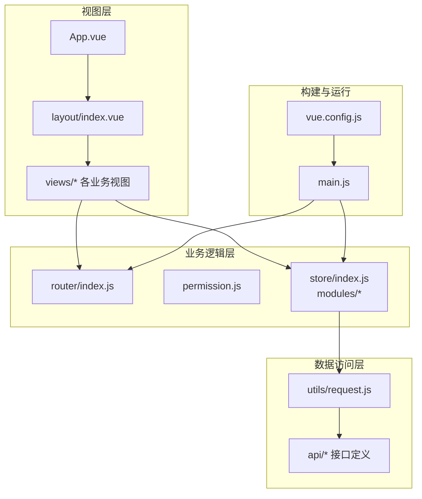
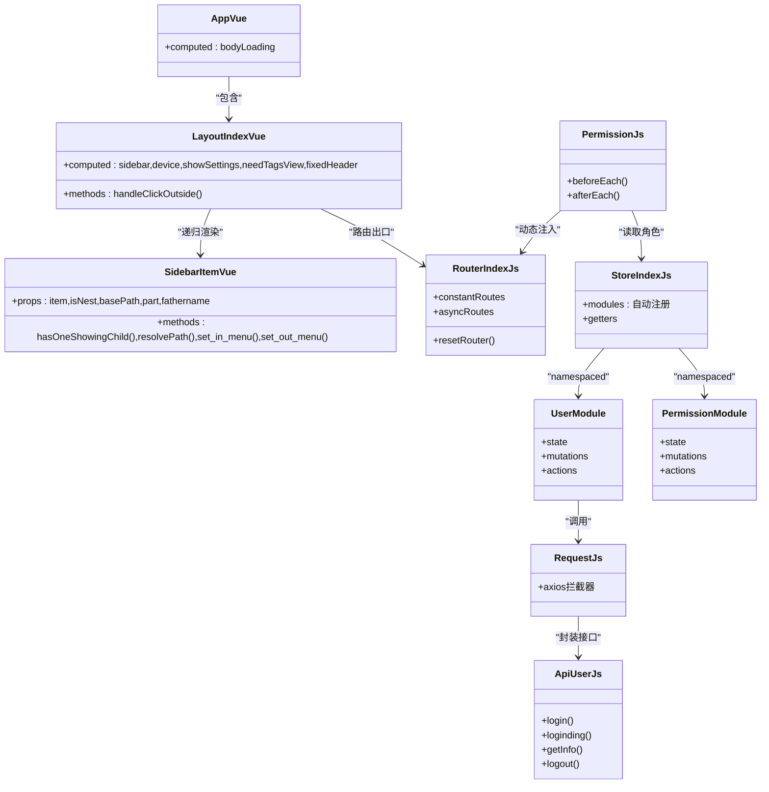
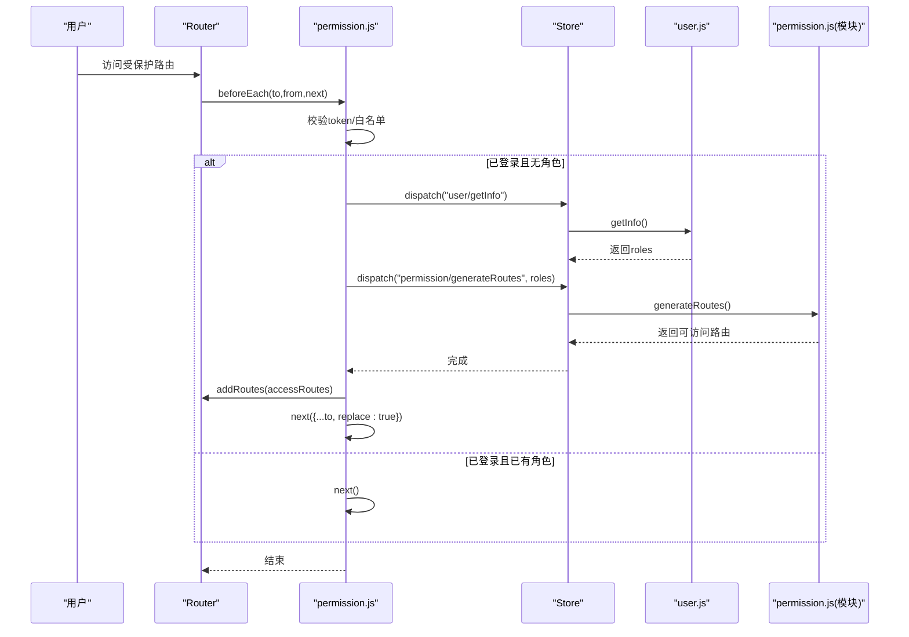
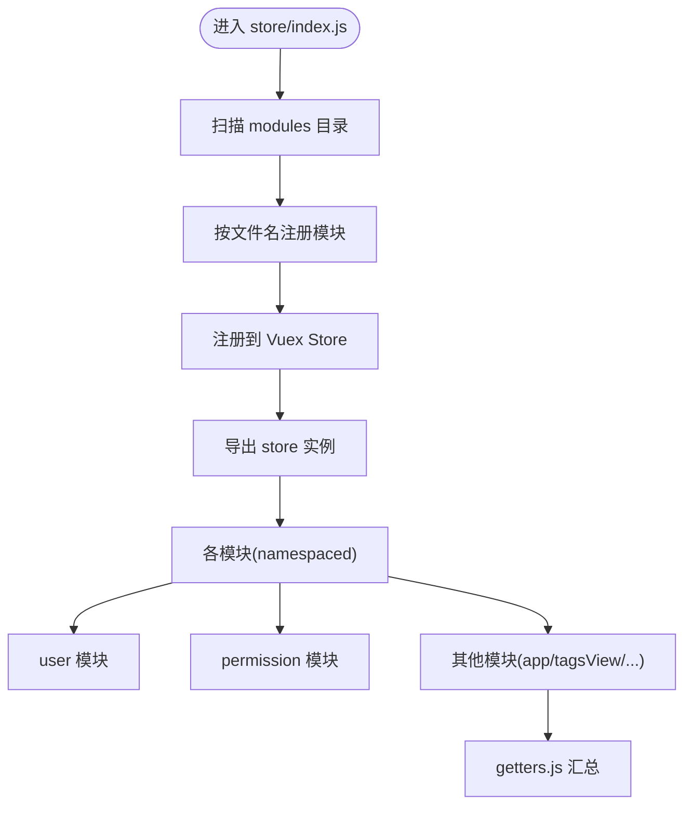
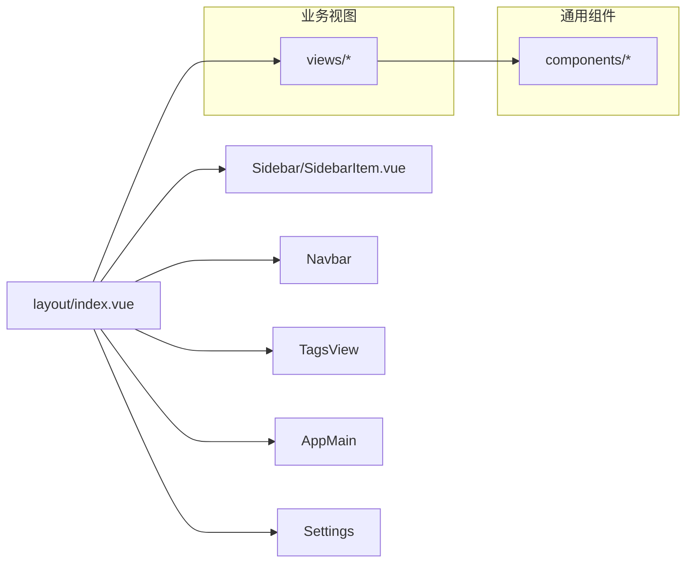
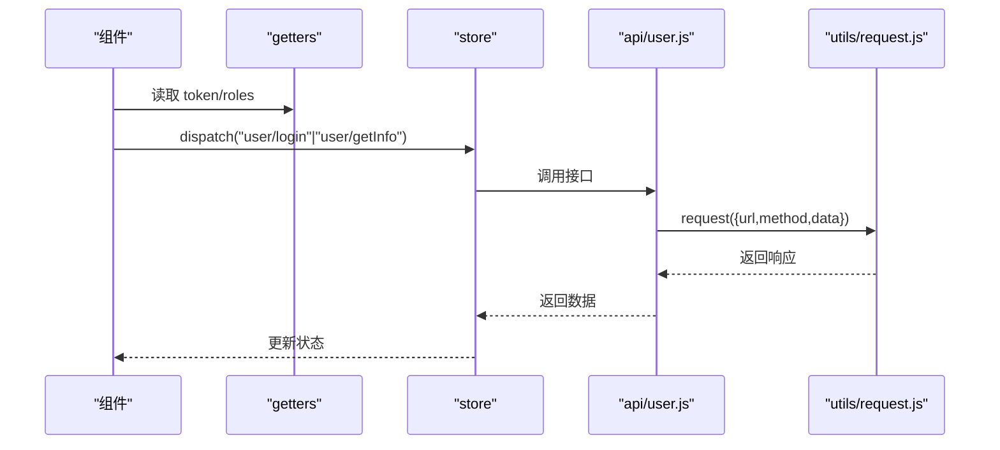
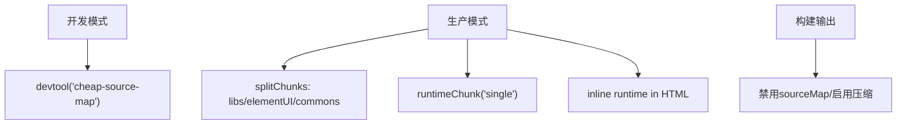
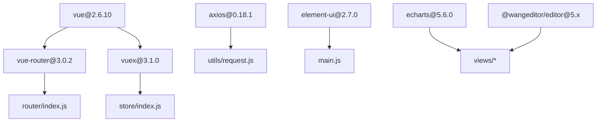

# 架构设计

<cite>
**本文引用的文件**
- [package.json](file://package.json)
- [vue.config.js](file://vue.config.js)
- [src/main.js](file://src/main.js)
- [src/App.vue](file://src/App.vue)
- [src/layout/index.vue](file://src/layout/index.vue)
- [src/layout/components/Sidebar/SidebarItem.vue](file://src/layout/components/Sidebar/SidebarItem.vue)
- [src/router/index.js](file://src/router/index.js)
- [src/permission.js](file://src/permission.js)
- [src/store/index.js](file://src/store/index.js)
- [src/store/modules/user.js](file://src/store/modules/user.js)
- [src/store/modules/permission.js](file://src/store/modules/permission.js)
- [src/store/getters.js](file://src/store/getters.js)
- [src/settings.js](file://src/settings.js)
- [src/utils/request.js](file://src/utils/request.js)
- [src/api/user.js](file://src/api/user.js)
</cite>

## 目录
1. [引言](#引言)
2. [项目结构](#项目结构)
3. [核心组件](#核心组件)
4. [架构总览](#架构总览)
5. [详细组件分析](#详细组件分析)
6. [依赖分析](#依赖分析)
7. [性能考虑](#性能考虑)
8. [故障排查指南](#故障排查指南)
9. [结论](#结论)
10. [附录](#附录)

## 引言
本文件面向 Leisu Admin 项目，系统性梳理基于 Vue.js 的前端架构设计与实现要点，重点覆盖 MVVM 设计模式、组件化与模块化架构、路由与权限体系、状态管理、数据访问层、构建配置与技术选型，并通过多类架构图帮助读者快速建立整体认知。

## 项目结构
Leisu Admin 采用典型的 Vue CLI 工程化组织方式，围绕“视图层-业务层-数据层”进行分层，配合模块化的路由与状态管理，形成清晰的职责边界与可扩展性。

- 视图层（View Layer）
  - 根组件 App.vue 承载全局加载态与路由出口
  - 布局组件 layout/index.vue 组织侧边栏、头部、主内容区与设置面板
  - 业务视图位于 views 下按功能域划分，如 dashboard、forum、media、member、system 等
- 业务逻辑层（Business Logic Layer）
  - 路由与权限：router/index.js 定义常量与异步路由；permission.js 实现导航守卫
  - 状态管理：store/index.js 自动注册 modules，modules 下按领域拆分
- 数据访问层（Data Access Layer）
  - API 层：src/api 下按业务模块拆分接口定义
  - 请求封装：utils/request.js 统一封装 axios，注入 token 与错误处理
- 构建与运行（Build & Dev）
  - vue.config.js 配置别名、SVG 处理、分包策略、开发服务器与生产优化
  - package.json 定义脚本与依赖生态

**图表来源**
- [src/App.vue:1-18](file://src/App.vue#L1-L18)
- [src/layout/index.vue:1-124](file://src/layout/index.vue#L1-L124)
- [src/router/index.js:1-177](file://src/router/index.js#L1-L177)
- [src/permission.js:1-82](file://src/permission.js#L1-L82)
- [src/store/index.js:1-26](file://src/store/index.js#L1-L26)
- [src/utils/request.js:1-130](file://src/utils/request.js#L1-L130)
- [src/api/user.js:1-37](file://src/api/user.js#L1-L37)
- [vue.config.js:1-155](file://vue.config.js#L1-L155)
- [src/main.js:1-526](file://src/main.js#L1-L526)

**章节来源**
- [src/main.js:1-526](file://src/main.js#L1-L526)
- [vue.config.js:1-155](file://vue.config.js#L1-L155)

## 核心组件
- 应用入口与全局初始化
  - main.js 注入 Element UI、全局过滤器、全局指令与组件注册、事件总线、环境变量与域名跳转工具
- 全局布局与导航
  - layout/index.vue 提供侧边栏、顶部导航、标签页与右侧设置面板的组合布局
  - layout/components/Sidebar/SidebarItem.vue 递归渲染菜单项，支持收藏与外部链接
- 路由与权限
  - router/index.js 定义常量路由与异步路由集合，支持 reset 与 hash 模式
  - permission.js 实现登录态校验、角色拉取、动态注入路由与页面标题设置
- 状态管理
  - store/index.js 自动扫描 modules 并注册命名空间模块
  - user.js 管理用户会话、角色、产品与渠道等信息，支持动态路由生成
  - permission.js 提供路由过滤与动态注入能力
  - getters.js 汇总常用派生状态
- 数据访问
  - utils/request.js 封装 axios，自动注入 token、错误提示与异常分支
  - api/user.js 定义用户相关接口

**章节来源**
- [src/main.js:1-526](file://src/main.js#L1-L526)
- [src/layout/index.vue:1-124](file://src/layout/index.vue#L1-L124)
- [src/layout/components/Sidebar/SidebarItem.vue:1-206](file://src/layout/components/Sidebar/SidebarItem.vue#L1-L206)
- [src/router/index.js:1-177](file://src/router/index.js#L1-L177)
- [src/permission.js:1-82](file://src/permission.js#L1-L82)
- [src/store/index.js:1-26](file://src/store/index.js#L1-L26)
- [src/store/modules/user.js:1-542](file://src/store/modules/user.js#L1-L542)
- [src/store/modules/permission.js:1-66](file://src/store/modules/permission.js#L1-L66)
- [src/store/getters.js:1-33](file://src/store/getters.js#L1-L33)
- [src/utils/request.js:1-130](file://src/utils/request.js#L1-L130)
- [src/api/user.js:1-37](file://src/api/user.js#L1-L37)

## 架构总览
Leisu Admin 采用 MVVM 架构范式：
- Model：Vuex 模块（user、permission 等）承载用户态与路由态数据
- View：Vue 组件（布局、视图、通用组件）负责渲染与交互
- ViewModel：Vue 实例与 Vuex Store 协同，通过计算属性与 actions 管理状态变更

**图表来源**
- [src/App.vue:1-18](file://src/App.vue#L1-L18)
- [src/layout/index.vue:1-124](file://src/layout/index.vue#L1-L124)
- [src/layout/components/Sidebar/SidebarItem.vue:1-206](file://src/layout/components/Sidebar/SidebarItem.vue#L1-L206)
- [src/router/index.js:1-177](file://src/router/index.js#L1-L177)
- [src/permission.js:1-82](file://src/permission.js#L1-L82)
- [src/store/index.js:1-26](file://src/store/index.js#L1-L26)
- [src/store/modules/user.js:1-542](file://src/store/modules/user.js#L1-L542)
- [src/store/modules/permission.js:1-66](file://src/store/modules/permission.js#L1-L66)
- [src/utils/request.js:1-130](file://src/utils/request.js#L1-L130)
- [src/api/user.js:1-37](file://src/api/user.js#L1-L37)

## 详细组件分析

### 路由系统与权限控制
- 路由设计
  - 常量路由：登录、重定向、错误页等
  - 异步路由：按业务域拆分（如 member、forum、media、system 等），支持动态注入
  - resetRouter：在登出或角色切换后重置路由匹配器
- 权限控制
  - 导航守卫：校验 token、拉取用户信息、生成可访问路由并注入
  - 白名单：免登录路由（如登录页）
  - 页面标题：根据 meta.title 设置 document.title
- 动态路由生成
  - permission/generateRoutes 基于用户角色过滤 asyncRoutes
  - 支持三级及以上标签页缓存的特殊处理

**图表来源**
- [src/permission.js:1-82](file://src/permission.js#L1-L82)
- [src/store/modules/user.js:1-542](file://src/store/modules/user.js#L1-L542)
- [src/store/modules/permission.js:1-66](file://src/store/modules/permission.js#L1-L66)
- [src/router/index.js:1-177](file://src/router/index.js#L1-L177)

**章节来源**
- [src/router/index.js:1-177](file://src/router/index.js#L1-L177)
- [src/permission.js:1-82](file://src/permission.js#L1-L82)
- [src/store/modules/permission.js:1-66](file://src/store/modules/permission.js#L1-L66)

### 状态管理架构（Vuex 模块化）
- 自动模块注册
  - store/index.js 通过 require.context 扫描 modules 目录，按文件名注册命名空间模块
- 模块职责
  - user：登录态、角色、头像、产品与渠道等用户维度数据
  - permission：路由表与可访问路由集合
  - 其他模块：app、tagsView、system、news、ossToken、pay、predictor、settings、errorLog 等
- Getters 汇总
  - 提供常用派生状态，如 roles、visitedViews、cachedViews、products、trade_products 等

**图表来源**
- [src/store/index.js:1-26](file://src/store/index.js#L1-L26)
- [src/store/getters.js:1-33](file://src/store/getters.js#L1-L33)

**章节来源**
- [src/store/index.js:1-26](file://src/store/index.js#L1-L26)
- [src/store/getters.js:1-33](file://src/store/getters.js#L1-L33)
- [src/store/modules/user.js:1-542](file://src/store/modules/user.js#L1-L542)
- [src/store/modules/permission.js:1-66](file://src/store/modules/permission.js#L1-L66)

### 组件系统架构
- 布局组件
  - layout/index.vue：侧边栏、顶部导航、标签页、右侧设置面板的容器
  - Sidebar/SidebarItem.vue：递归菜单渲染、收藏与外部链接处理
- 通用组件
  - components/ 下大量复用组件（分页、图表、拖拽、上传、表情、富文本等）
  - 通过 main.js 全局注册部分自定义组件与 Element UI 扩展
- 业务组件
  - views/ 下按功能域划分的页面组件，配合 API 层完成业务编排

**图表来源**
- [src/layout/index.vue:1-124](file://src/layout/index.vue#L1-L124)
- [src/layout/components/Sidebar/SidebarItem.vue:1-206](file://src/layout/components/Sidebar/SidebarItem.vue#L1-L206)
- [src/main.js:1-526](file://src/main.js#L1-L526)

**章节来源**
- [src/layout/index.vue:1-124](file://src/layout/index.vue#L1-L124)
- [src/layout/components/Sidebar/SidebarItem.vue:1-206](file://src/layout/components/Sidebar/SidebarItem.vue#L1-L206)
- [src/main.js:1-526](file://src/main.js#L1-L526)

### 数据访问层与 API 设计
- 请求封装
  - utils/request.js 基于 axios，自动注入 token、跨域凭证、超时时间
  - 统一错误处理：根据状态码与响应 code 显示消息，401 跳转登录
- 接口定义
  - api/user.js 定义登录、钉钉登录、获取用户信息、退出登录等
  - 其他模块在 api/ 下按业务域拆分，统一通过 request.js 发起请求

**图表来源**
- [src/store/modules/user.js:1-542](file://src/store/modules/user.js#L1-L542)
- [src/api/user.js:1-37](file://src/api/user.js#L1-L37)
- [src/utils/request.js:1-130](file://src/utils/request.js#L1-L130)

**章节来源**
- [src/utils/request.js:1-130](file://src/utils/request.js#L1-L130)
- [src/api/user.js:1-37](file://src/api/user.js#L1-L37)
- [src/store/modules/user.js:1-542](file://src/store/modules/user.js#L1-L542)

### 构建配置与运行时优化
- 别名与解析
  - 配置 @ 指向 src，提供开发期便捷导入
- SVG 图标
  - 使用 svg-sprite-loader 统一处理 src/icons 下的 SVG
- 开发服务器
  - 端口与覆盖警告/错误显示，支持代理与 mock 钩子预留
- 生产优化
  - 删除 preload/prefetch 插件
  - 分包策略：libs、elementUI、commons 独立 chunk
  - runtimeChunk 单独提取，HTML 中内联 runtime
  - 外部化第三方（如百度地图 BMap）

**图表来源**
- [vue.config.js:1-155](file://vue.config.js#L1-L155)

**章节来源**
- [vue.config.js:1-155](file://vue.config.js#L1-L155)

## 依赖分析
- 前端框架与 UI
  - Vue 2.6.10、Vue Router 3.0.2、Vuex 3.1.0、Element UI 2.7.0
- 网络与工具
  - axios 0.18.1、js-cookie、crypto-js、lodash、pako、moment-like 工具集
- 可视化与编辑
  - echarts 5.6.0、@wangeditor/editor 5.x、v-viewer、highlight.js、sortablejs、vuedraggable
- 构建与测试
  - @vue/cli-service、webpack、SVGO、Jest、ESLint

**图表来源**
- [package.json:1-139](file://package.json#L1-L139)
- [src/main.js:1-526](file://src/main.js#L1-L526)
- [src/utils/request.js:1-130](file://src/utils/request.js#L1-L130)

**章节来源**
- [package.json:1-139](file://package.json#L1-L139)

## 性能考虑
- 代码分割
  - 通过 splitChunks 将第三方库、Element UI 与通用组件独立打包，提升缓存命中率
- 资源优化
  - 生产关闭 source map，减少体积与调试信息泄露
  - SVG 使用 sprite-loader，减少请求与体积
- 运行时优化
  - runtimeChunk 单独提取，避免频繁更新
  - 预加载/预取插件删除，避免无效资源提前下载
- 网络层
  - axios 超时与统一错误提示，避免长时间挂起
  - 自动注入 token，减少重复头信息传递

[本节为通用指导，无需列出具体文件来源]

## 故障排查指南
- 登录态问题
  - 检查 utils/auth 中 token 是否存在，permission.js 是否正确拦截与重定向
- 动态路由不生效
  - 确认 user/getInfo 是否成功返回 roles，permission/generateRoutes 是否被调用并 addRoutes
- 请求失败
  - 查看 utils/request.js 的响应拦截器，关注 401/403/404/500 等状态码提示
- 构建异常
  - 检查 vue.config.js 的 alias、externals、plugins 与 chainWebpack 配置
- 样式与图标
  - 确认 svg-sprite-loader 配置与 src/icons 目录结构一致

**章节来源**
- [src/permission.js:1-82](file://src/permission.js#L1-L82)
- [src/store/modules/user.js:1-542](file://src/store/modules/user.js#L1-L542)
- [src/utils/request.js:1-130](file://src/utils/request.js#L1-L130)
- [vue.config.js:1-155](file://vue.config.js#L1-L155)

## 结论
Leisu Admin 以 Vue 为核心，结合 Element UI 与 Vuex，采用模块化与组件化设计，实现了清晰的 MVVM 分层与可扩展的路由权限体系。通过合理的构建配置与网络封装，兼顾了开发体验与生产性能。建议在后续迭代中持续完善模块边界、增强单元测试覆盖率，并逐步引入 Composition API 与更现代的构建工具链以进一步提升可维护性与性能。

## 附录
- 配置项速览
  - settings.js：标题、标签页、固定头部、侧边栏 Logo、错误日志开关
  - vue.config.js：别名、SVG 处理、开发服务器、生产分包与优化
  - main.js：全局组件注册、指令、过滤器、事件总线与环境工具

**章节来源**
- [src/settings.js:1-36](file://src/settings.js#L1-L36)
- [vue.config.js:1-155](file://vue.config.js#L1-L155)
- [src/main.js:1-526](file://src/main.js#L1-L526)