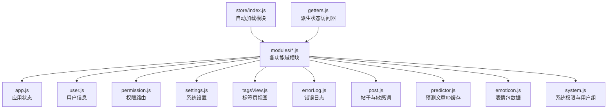
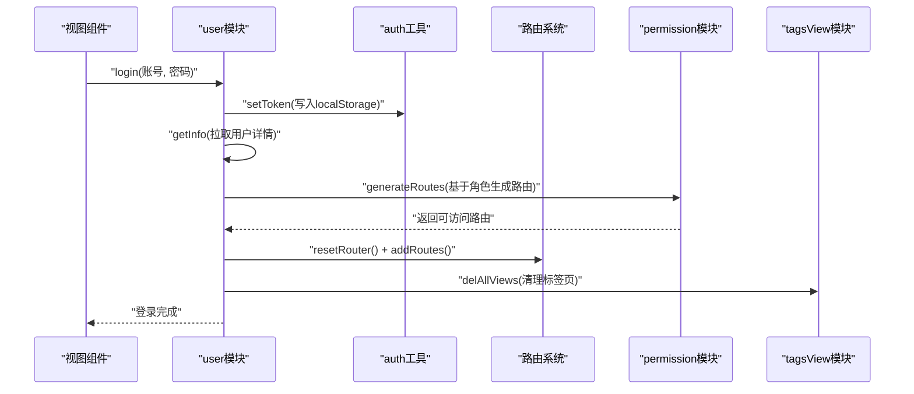
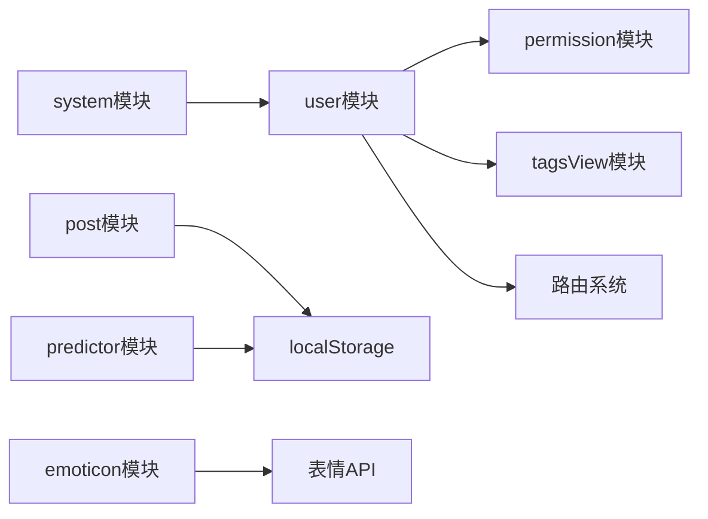

# Vuex模块化设计

<cite>
**本文引用的文件**
- [src/store/index.js](file://src/store/index.js)
- [src/store/getters.js](file://src/store/getters.js)
- [src/store/modules/app.js](file://src/store/modules/app.js)
- [src/store/modules/user.js](file://src/store/modules/user.js)
- [src/store/modules/permission.js](file://src/store/modules/permission.js)
- [src/store/modules/settings.js](file://src/store/modules/settings.js)
- [src/store/modules/tagsView.js](file://src/store/modules/tagsView.js)
- [src/store/modules/errorLog.js](file://src/store/modules/errorLog.js)
- [src/store/modules/post.js](file://src/store/modules/post.js)
- [src/store/modules/predictor.js](file://src/store/modules/predictor.js)
- [src/store/modules/emoticon.js](file://src/store/modules/emoticon.js)
- [src/store/modules/system.js](file://src/store/modules/system.js)
- [src/utils/auth.js](file://src/utils/auth.js)
- [src/settings.js](file://src/settings.js)
</cite>

## 目录
1. [引言](#引言)
2. [项目结构](#项目结构)
3. [核心组件](#核心组件)
4. [架构总览](#架构总览)
5. [详细组件分析](#详细组件分析)
6. [依赖分析](#依赖分析)
7. [性能考量](#性能考量)
8. [故障排查指南](#故障排查指南)
9. [结论](#结论)
10. [附录](#附录)

## 引言
本文件面向Leisu Admin项目的前端工程，系统性梳理其基于Vuex的状态管理模块化设计与实现。内容涵盖模块自动加载机制、模块命名规范、模块间依赖关系、核心模块职责划分（app、user、permission、settings等）、模块内部结构（state、mutations、actions、getters）以及模块间通信机制（模块调用、事件传递、状态共享）。最后提供模块开发最佳实践，帮助开发者在保持一致性的同时提升可维护性与扩展性。

## 项目结构
Leisu Admin采用“按模块分层”的组织方式，核心状态管理位于src/store目录，包含：
- store入口：自动扫描modules目录下的所有模块，统一注入到Vuex实例
- getters：集中导出常用派生状态访问器
- modules：按功能域拆分的独立模块，每个模块自包含namespaced命名空间、state、mutations、actions

图表来源
- [src/store/index.js:1-26](file://src/store/index.js#L1-L26)
- [src/store/getters.js:1-33](file://src/store/getters.js#L1-L33)
- [src/store/modules/app.js:1-65](file://src/store/modules/app.js#L1-L65)
- [src/store/modules/user.js:1-542](file://src/store/modules/user.js#L1-L542)
- [src/store/modules/permission.js:1-66](file://src/store/modules/permission.js#L1-L66)
- [src/store/modules/settings.js:1-35](file://src/store/modules/settings.js#L1-L35)
- [src/store/modules/tagsView.js:1-182](file://src/store/modules/tagsView.js#L1-L182)
- [src/store/modules/errorLog.js:1-29](file://src/store/modules/errorLog.js#L1-L29)
- [src/store/modules/post.js:1-113](file://src/store/modules/post.js#L1-L113)
- [src/store/modules/predictor.js:1-88](file://src/store/modules/predictor.js#L1-L88)
- [src/store/modules/emoticon.js:1-156](file://src/store/modules/emoticon.js#L1-L156)
- [src/store/modules/system.js:1-186](file://src/store/modules/system.js#L1-L186)

章节来源
- [src/store/index.js:1-26](file://src/store/index.js#L1-L26)
- [src/store/getters.js:1-33](file://src/store/getters.js#L1-L33)

## 核心组件
- 自动模块加载：通过require.context扫描modules目录，动态构建模块注册表，无需手动import
- 命名空间：所有模块均启用namespaced，避免状态与动作名称冲突
- 派生状态：通过getters集中暴露跨模块的常用状态访问器，便于组件以语义化方式读取
- 工具与配置：auth工具负责token持久化，settings提供主题与界面开关的默认值

章节来源
- [src/store/index.js:7-23](file://src/store/index.js#L7-L23)
- [src/store/getters.js:1-33](file://src/store/getters.js#L1-L33)
- [src/utils/auth.js:1-17](file://src/utils/auth.js#L1-L17)
- [src/settings.js:1-36](file://src/settings.js#L1-L36)

## 架构总览
下面的序列图展示了登录流程中各模块的协作：用户模块发起登录请求，成功后写入token并触发用户信息拉取；随后根据角色生成可访问路由并重置标签页视图，最终完成登录态建立。

图表来源
- [src/store/modules/user.js:141-358](file://src/store/modules/user.js#L141-L358)
- [src/store/modules/permission.js:50-57](file://src/store/modules/permission.js#L50-L57)
- [src/store/modules/tagsView.js:148-169](file://src/store/modules/tagsView.js#L148-L169)
- [src/utils/auth.js:9-11](file://src/utils/auth.js#L9-L11)

## 详细组件分析

### app模块：应用状态管理
- 职责：管理侧边栏展开/收起、设备类型、全局尺寸、页面加载状态等
- 关键点：
  - 通过Cookie持久化侧边栏与尺寸状态
  - 提供切换设备、设置尺寸、控制body加载态的动作
- 交互：与layout组件联动，影响UI布局与主题

章节来源
- [src/store/modules/app.js:1-65](file://src/store/modules/app.js#L1-L65)

### user模块：用户信息管理与权限初始化
- 职责：登录、登出、获取用户信息、动态修改角色、拉取产品/渠道/标签等数据
- 关键点：
  - 登录成功后写入token并持久化
  - 获取用户信息时根据角色动态补充报表类权限，并拉取目录、tab、商品、交易商品、渠道等数据
  - 支持“随机马甲号”与“社区马甲号”的本地缓存与消费
  - 角色变化时重置路由并清理标签页
- 依赖：auth工具、路由系统、多个API模块

章节来源
- [src/store/modules/user.js:139-534](file://src/store/modules/user.js#L139-L534)
- [src/utils/auth.js:1-17](file://src/utils/auth.js#L1-17)

### permission模块：权限控制与路由生成
- 职责：根据用户角色过滤异步路由，生成可访问路由集合
- 关键点：
  - 递归过滤路由树，支持meta.roles白名单
  - 将常量路由与动态路由合并，供router.addRoutes使用
- 与user模块配合，在用户信息获取后生成路由并注入

章节来源
- [src/store/modules/permission.js:1-66](file://src/store/modules/permission.js#L1-L66)

### settings模块：系统设置
- 职责：主题、标签页、固定头部、侧边栏Logo等界面设置
- 关键点：
  - 默认值来源于settings.js
  - 通过changeSetting变更设置项

章节来源
- [src/store/modules/settings.js:1-35](file://src/store/modules/settings.js#L1-L35)
- [src/settings.js:1-36](file://src/settings.js#L1-L36)

### tagsView模块：标签页视图
- 职责：维护已访问视图与缓存视图，支持增删改查、清空、去他页等操作
- 关键点：
  - params路由的特殊处理与机器人相关路由的过滤
  - affix固定标签页的保留策略

章节来源
- [src/store/modules/tagsView.js:1-182](file://src/store/modules/tagsView.js#L1-L182)

### errorLog模块：错误日志
- 职责：收集并持久化前端错误日志
- 关键点：
  - 提供新增与清空动作

章节来源
- [src/store/modules/errorLog.js:1-29](file://src/store/modules/errorLog.js#L1-L29)

### post模块：帖子与敏感词
- 职责：本地缓存帖子ID、敏感词列表
- 关键点：
  - 从localStorage恢复历史ID，限制最大长度并自动淘汰
  - 拉取轻量敏感词列表并缓存

章节来源
- [src/store/modules/post.js:1-113](file://src/store/modules/post.js#L1-L113)

### predictor模块：预测文章ID缓存
- 职责：单关、串关、足彩三类文章ID的本地缓存与同步
- 关键点：
  - 从localStorage恢复并限制容量
  - 提供按类型追加与持久化

章节来源
- [src/store/modules/predictor.js:1-88](file://src/store/modules/predictor.js#L1-L88)

### emoticon模块：表情包数据
- 职责：表情列表的拉取、缓存与格式化输出
- 关键点：
  - 深拷贝避免组件直接修改缓存
  - 支持编辑器、回显、列表三种场景的数据格式
  - 可按tab类型隐藏特定分组

章节来源
- [src/store/modules/emoticon.js:1-156](file://src/store/modules/emoticon.js#L1-L156)

### system模块：系统权限与用户组
- 职责：权限字典、用户组列表、权限组过滤与聚合
- 关键点：
  - 根据当前用户角色过滤可分配的权限组与用户组
  - 提供“拥有权限的用户组”与“全部权限”的缓存

章节来源
- [src/store/modules/system.js:1-186](file://src/store/modules/system.js#L1-L186)

## 依赖分析
- 模块耦合关系
  - user模块对permission、tagsView、router存在强依赖（登录后生成路由、重置路由、清理标签页）
  - post与predictor模块分别依赖localStorage进行本地缓存
  - emoticon模块依赖API与工具常量进行数据格式化
  - system模块依赖user模块的角色信息进行过滤
- 自动加载机制
  - store/index.js通过require.context扫描modules目录，模块命名即为文件名去除扩展名
  - 模块需导出默认对象且启用namespaced，否则无法被正确注册

图表来源
- [src/store/index.js:8-18](file://src/store/index.js#L8-L18)
- [src/store/modules/user.js:371-392](file://src/store/modules/user.js#L371-L392)
- [src/store/modules/post.js:74-85](file://src/store/modules/post.js#L74-L85)
- [src/store/modules/predictor.js:44-79](file://src/store/modules/predictor.js#L44-L79)
- [src/store/modules/emoticon.js:103-148](file://src/store/modules/emoticon.js#L103-L148)
- [src/store/modules/system.js:64-133](file://src/store/modules/system.js#L64-L133)

章节来源
- [src/store/index.js:8-18](file://src/store/index.js#L8-L18)

## 性能考量
- 模块自动加载：减少手动import，降低遗漏注册风险，但需确保模块命名与导出规范一致
- 本地缓存：post与predictor模块对ID列表进行容量限制与淘汰，避免无限增长
- 数据深拷贝：emoticon模块对缓存数据进行深拷贝，避免组件直接修改导致的副作用
- 路由生成：permission模块递归过滤路由，建议在角色稳定时一次性生成，避免重复计算

## 故障排查指南
- 登录后无路由
  - 检查user模块是否成功调用generateRoutes并addRoutes
  - 确认角色列表包含有效的meta.roles
- 标签页异常
  - 检查tagsView模块对params路由与机器人路由的特殊处理逻辑
- 本地缓存异常
  - 检查localStorage键名是否与模块约定一致（如window_post_ids、window_article_*_ids）
- 表情包不显示
  - 确认emoticon模块已成功拉取并缓存列表，或在需要时强制刷新
- 权限组不可见
  - 检查system模块的过滤逻辑是否正确匹配当前用户角色

章节来源
- [src/store/modules/user.js:371-392](file://src/store/modules/user.js#L371-L392)
- [src/store/modules/tagsView.js:25-29](file://src/store/modules/tagsView.js#L25-L29)
- [src/store/modules/post.js:74-85](file://src/store/modules/post.js#L74-L85)
- [src/store/modules/predictor.js:44-79](file://src/store/modules/predictor.js#L44-L79)
- [src/store/modules/emoticon.js:103-148](file://src/store/modules/emoticon.js#L103-L148)
- [src/store/modules/system.js:64-133](file://src/store/modules/system.js#L64-L133)

## 结论
Leisu Admin的Vuex模块化设计通过自动加载、命名空间与集中getters实现了清晰的职责分离与低耦合。核心模块围绕用户态、权限路由、界面设置与本地缓存展开，既满足了管理后台的复杂业务需求，又保证了良好的可维护性与扩展性。遵循本文的最佳实践，可在新模块开发中快速落地一致的设计风格。

## 附录

### 模块命名规范与注册机制
- 命名规范
  - 模块文件名即模块名（去除.js扩展名），采用小驼峰或名词短语
  - 模块必须导出默认对象，且设置namespaced: true
- 注册机制
  - 通过require.context扫描modules目录，自动注册所有模块
  - 不再需要手动import与挂载到Vuex.store

章节来源
- [src/store/index.js:8-18](file://src/store/index.js#L8-L18)

### 模块间通信机制
- 模块调用
  - 通过dispatch调用其他模块的动作，必要时使用{root: true}访问根命名空间
- 状态共享
  - 通过getters集中暴露跨模块状态，组件以语义化方式读取
- 事件传递
  - 通过模块动作组合与API调用间接传递状态变更

章节来源
- [src/store/modules/user.js:324-327](file://src/store/modules/user.js#L324-L327)
- [src/store/getters.js:1-33](file://src/store/getters.js#L1-L33)

### 最佳实践
- 命名约定
  - 模块名简洁明确，避免过长或歧义
  - 动作与变更使用语义化命名，如SET_*、ADD_*、DEL_*、LOAD_*、SAVE_*
- 状态设计
  - 将可变状态集中在state，避免在mutations/actions中产生副作用
  - 对外部数据进行深拷贝，避免组件直接修改缓存
- 异步处理
  - 所有异步操作封装为Promise，统一在actions中处理
  - 成功与失败分支均需明确处理，避免静默失败
- 本地缓存
  - 明确缓存键名与生命周期，设置容量上限并实现淘汰策略
- 路由与权限
  - 角色与路由解耦，权限变更后及时重置路由与标签页