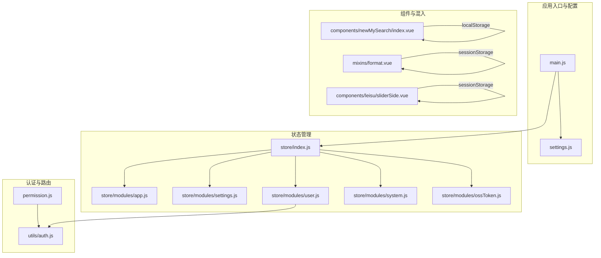
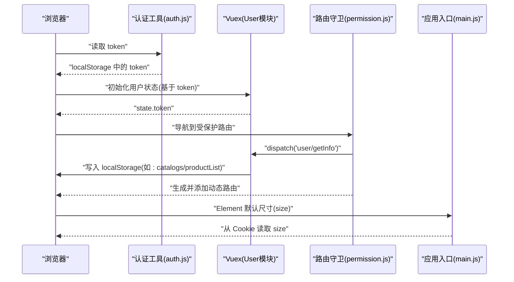
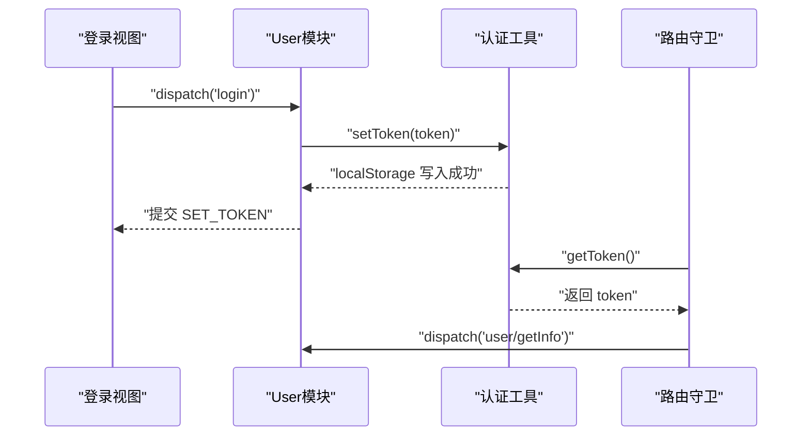
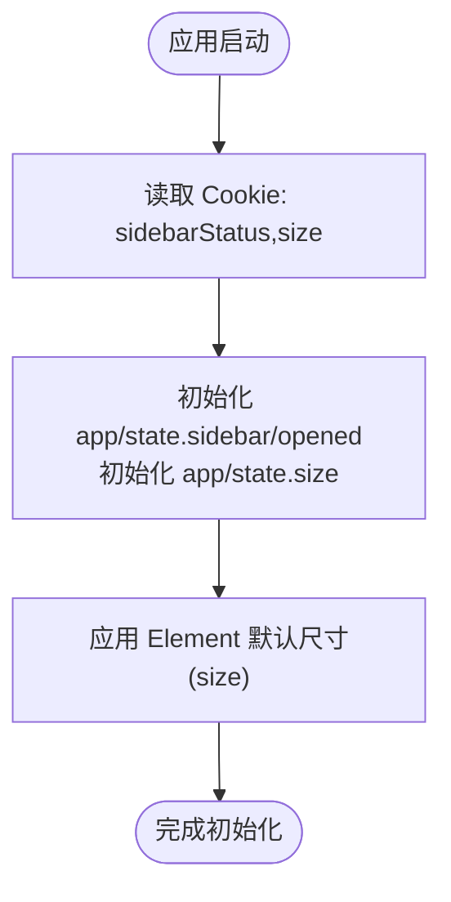
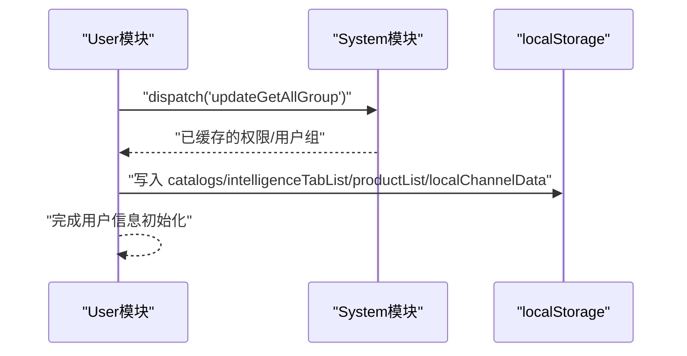
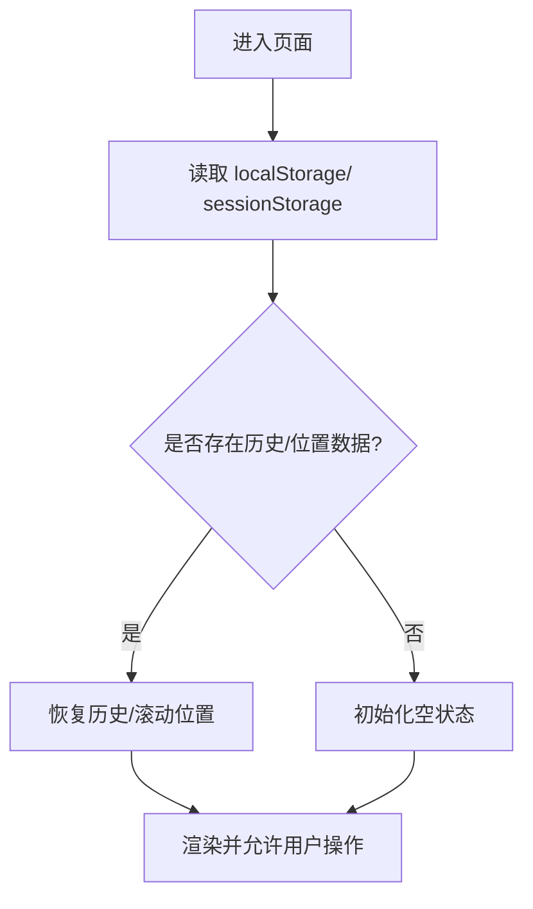
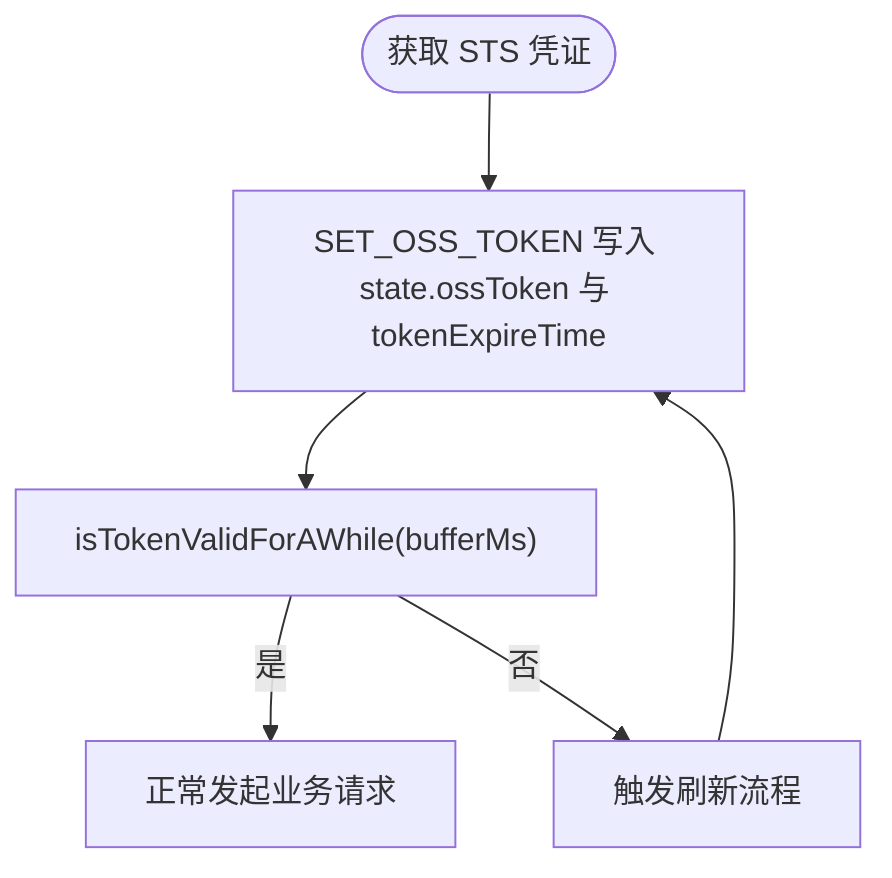
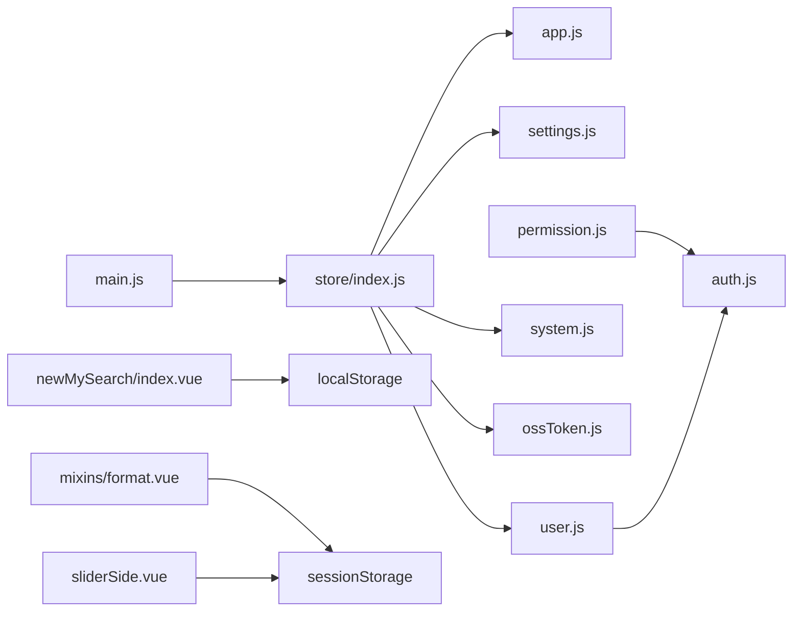

# 状态持久化策略

<cite>
**本文引用的文件**
- [src/main.js](file://src/main.js)
- [src/settings.js](file://src/settings.js)
- [src/store/index.js](file://src/store/index.js)
- [src/store/modules/app.js](file://src/store/modules/app.js)
- [src/store/modules/settings.js](file://src/store/modules/settings.js)
- [src/store/modules/user.js](file://src/store/modules/user.js)
- [src/store/modules/system.js](file://src/store/modules/system.js)
- [src/store/modules/ossToken.js](file://src/store/modules/ossToken.js)
- [src/utils/auth.js](file://src/utils/auth.js)
- [src/permission.js](file://src/permission.js)
- [src/components/newMySearch/index.vue](file://src/components/newMySearch/index.vue)
- [src/mixins/format.vue](file://src/mixins/format.vue)
- [src/components/leisu/sliderSide.vue](file://src/components/leisu/sliderSide.vue)
</cite>

## 目录
1. [引言](#引言)
2. [项目结构](#项目结构)
3. [核心组件](#核心组件)
4. [架构总览](#架构总览)
5. [详细组件分析](#详细组件分析)
6. [依赖关系分析](#依赖关系分析)
7. [性能考量](#性能考量)
8. [故障排查指南](#故障排查指南)
9. [结论](#结论)
10. [附录](#附录)

## 引言
本文件面向 Leisu Admin 项目的前端状态持久化策略，系统性梳理 localStorage、sessionStorage 的使用边界与场景，明确关键状态的持久化方案（登录态、主题设置、语言偏好、权限信息等），并给出状态恢复机制、安全考虑、版本兼容与迁移策略、配置示例与最佳实践。

## 项目结构
围绕状态持久化，项目主要涉及以下模块与文件：
- 应用入口与全局配置：main.js、settings.js
- 状态管理：store/index.js 及各模块（app、settings、user、system、ossToken）
- 认证与路由守卫：utils/auth.js、permission.js
- 组件与混入中的持久化行为：newMySearch/index.vue、mixins/format.vue、sliderSide.vue
- 本地历史与滚动位置等场景：通过 localStorage/sessionStorage 实现

图表来源
- [src/main.js:1-526](file://src/main.js#L1-L526)
- [src/settings.js:1-36](file://src/settings.js#L1-L36)
- [src/store/index.js:1-26](file://src/store/index.js#L1-L26)
- [src/store/modules/app.js:1-65](file://src/store/modules/app.js#L1-L65)
- [src/store/modules/settings.js:1-35](file://src/store/modules/settings.js#L1-L35)
- [src/store/modules/user.js:1-542](file://src/store/modules/user.js#L1-L542)
- [src/store/modules/system.js:1-149](file://src/store/modules/system.js#L1-L149)
- [src/store/modules/ossToken.js:37-70](file://src/store/modules/ossToken.js#L37-L70)
- [src/utils/auth.js:1-17](file://src/utils/auth.js#L1-L17)
- [src/permission.js:1-82](file://src/permission.js#L1-L82)
- [src/components/newMySearch/index.vue:1215-1256](file://src/components/newMySearch/index.vue#L1215-L1256)
- [src/mixins/format.vue:1736-1768](file://src/mixins/format.vue#L1736-L1768)
- [src/components/leisu/sliderSide.vue:85-102](file://src/components/leisu/sliderSide.vue#L85-L102)

章节来源
- [src/main.js:1-526](file://src/main.js#L1-L526)
- [src/store/index.js:1-26](file://src/store/index.js#L1-L26)

## 核心组件
- 应用入口与全局配置：负责注入 Element UI 默认尺寸、注册全局组件与过滤器、挂载根实例，并读取 Cookie 中的 size 作为全局尺寸偏好。
- 状态管理：集中于 store/index.js 自动加载各模块；app 模块持久化侧边栏开关与尺寸；settings 模块管理主题与界面设置；user 模块持久化登录 token 并在登录后写入 localStorage；system 模块缓存权限与用户组；ossToken 模块管理 OSS STS 临时凭证与过期时间。
- 认证与路由：permission.js 在导航前检查 token，若存在则拉取用户信息并生成路由；utils/auth.js 提供 token 的读取/设置/清除。
- 组件与混入：newMySearch 通过 localStorage 存储搜索历史；format 混入通过 sessionStorage 保存滚动位置；sliderSide 通过 sessionStorage 维护弹窗层级。

章节来源
- [src/main.js:443-445](file://src/main.js#L443-L445)
- [src/store/modules/app.js:1-65](file://src/store/modules/app.js#L1-L65)
- [src/store/modules/settings.js:1-35](file://src/store/modules/settings.js#L1-L35)
- [src/store/modules/user.js:13-155](file://src/store/modules/user.js#L13-L155)
- [src/store/modules/system.js:1-149](file://src/store/modules/system.js#L1-L149)
- [src/store/modules/ossToken.js:37-70](file://src/store/modules/ossToken.js#L37-L70)
- [src/utils/auth.js:1-17](file://src/utils/auth.js#L1-L17)
- [src/permission.js:13-75](file://src/permission.js#L13-L75)
- [src/components/newMySearch/index.vue:1215-1256](file://src/components/newMySearch/index.vue#L1215-L1256)
- [src/mixins/format.vue:1736-1768](file://src/mixins/format.vue#L1736-L1768)
- [src/components/leisu/sliderSide.vue:85-102](file://src/components/leisu/sliderSide.vue#L85-L102)

## 架构总览
下图展示“登录态、主题设置、语言偏好、权限信息”等关键状态在应用生命周期中的持久化与恢复路径。

图表来源
- [src/utils/auth.js:1-17](file://src/utils/auth.js#L1-L17)
- [src/store/modules/user.js:13-336](file://src/store/modules/user.js#L13-L336)
- [src/permission.js:13-75](file://src/permission.js#L13-L75)
- [src/main.js:443-445](file://src/main.js#L443-L445)

## 详细组件分析

### 登录态与 Token 持久化
- 写入与读取：登录成功后将 token 写入 localStorage；应用启动时从 localStorage 读取 token 初始化用户状态；退出登录时清除 token。
- 路由守卫：导航前检查 token，若存在则调用用户信息接口完成角色与路由生成；失败时重置 token 并跳转登录页。
- 安全注意：当前 token 存储于 localStorage，建议结合 HttpOnly Cookie 与服务端会话管理，或对敏感数据进行加密存储。

图表来源
- [src/store/modules/user.js:141-155](file://src/store/modules/user.js#L141-L155)
- [src/utils/auth.js:1-17](file://src/utils/auth.js#L1-L17)
- [src/permission.js:20-47](file://src/permission.js#L20-L47)

章节来源
- [src/store/modules/user.js:13-155](file://src/store/modules/user.js#L13-L155)
- [src/utils/auth.js:1-17](file://src/utils/auth.js#L1-L17)
- [src/permission.js:13-75](file://src/permission.js#L13-L75)

### 主题与界面设置持久化
- 主题：settings 模块维护主题变量；界面设置（如 tagsView、fixedHeader、sidebarLogo）来自 settings.js 默认值。
- 侧边栏与尺寸：app 模块将侧边栏开关与尺寸写入 Cookie；Element 默认尺寸也来源于 Cookie。
- 恢复机制：应用启动时从 Cookie 读取并初始化状态。

图表来源
- [src/store/modules/app.js:1-65](file://src/store/modules/app.js#L1-L65)
- [src/main.js:443-445](file://src/main.js#L443-L445)
- [src/settings.js:1-36](file://src/settings.js#L1-L36)

章节来源
- [src/store/modules/app.js:1-65](file://src/store/modules/app.js#L1-L65)
- [src/store/modules/settings.js:1-35](file://src/store/modules/settings.js#L1-L35)
- [src/main.js:443-445](file://src/main.js#L443-L445)
- [src/settings.js:1-36](file://src/settings.js#L1-L36)

### 权限信息与用户组缓存
- system 模块：缓存“拥有权限的用户组”与“全部权限”列表，避免重复拉取。
- user 模块：在获取用户信息时，将部分静态数据写入 localStorage（如分类目录、智能标签页、产品列表、渠道数据），以提升二次访问性能。
- 恢复机制：应用启动后优先使用内存缓存；若无则触发接口拉取并写入 localStorage。

图表来源
- [src/store/modules/system.js:1-149](file://src/store/modules/system.js#L1-L149)
- [src/store/modules/user.js:272-319](file://src/store/modules/user.js#L272-L319)

章节来源
- [src/store/modules/system.js:1-149](file://src/store/modules/system.js#L1-L149)
- [src/store/modules/user.js:272-319](file://src/store/modules/user.js#L272-L319)

### 搜索历史与滚动位置持久化
- 搜索历史：newMySearch 组件通过 localStorage 以键前缀“LS_”存储不同来源的历史数据，支持排序、去重与删除。
- 滚动位置：format 混入通过 sessionStorage 保存滚动容器的可视项与偏移，便于页面刷新后恢复。
- 弹窗层级：sliderSide 通过 sessionStorage 维护弹窗 z-index，避免层级冲突。

图表来源
- [src/components/newMySearch/index.vue:1215-1256](file://src/components/newMySearch/index.vue#L1215-L1256)
- [src/mixins/format.vue:1736-1768](file://src/mixins/format.vue#L1736-L1768)
- [src/components/leisu/sliderSide.vue:85-102](file://src/components/leisu/sliderSide.vue#L85-L102)

章节来源
- [src/components/newMySearch/index.vue:1215-1256](file://src/components/newMySearch/index.vue#L1215-L1256)
- [src/mixins/format.vue:1736-1768](file://src/mixins/format.vue#L1736-L1768)
- [src/components/leisu/sliderSide.vue:85-102](file://src/components/leisu/sliderSide.vue#L85-L102)

### OSS STS 临时凭证与有效期管理
- ossToken 模块：接收服务端返回的 STS 凭证，计算过期时间并标记刷新状态；提供“缓冲窗口”判断是否即将过期。
- 使用建议：在请求前检查 isTokenValidForAWhile，若接近过期则提前刷新，避免业务中断。

图表来源
- [src/store/modules/ossToken.js:37-70](file://src/store/modules/ossToken.js#L37-L70)

章节来源
- [src/store/modules/ossToken.js:37-70](file://src/store/modules/ossToken.js#L37-L70)

## 依赖关系分析
- 入口依赖：main.js 依赖 settings.js 与 store/index.js；store 自动加载各模块。
- 认证依赖：permission.js 依赖 utils/auth.js；user 模块依赖 utils/auth.js。
- 组件依赖：newMySearch 依赖 localStorage；format 混入依赖 sessionStorage；sliderSide 依赖 sessionStorage。

图表来源
- [src/main.js:1-526](file://src/main.js#L1-L526)
- [src/store/index.js:1-26](file://src/store/index.js#L1-L26)
- [src/store/modules/app.js:1-65](file://src/store/modules/app.js#L1-L65)
- [src/store/modules/settings.js:1-35](file://src/store/modules/settings.js#L1-L35)
- [src/store/modules/user.js:1-542](file://src/store/modules/user.js#L1-L542)
- [src/store/modules/system.js:1-149](file://src/store/modules/system.js#L1-L149)
- [src/store/modules/ossToken.js:37-70](file://src/store/modules/ossToken.js#L37-L70)
- [src/utils/auth.js:1-17](file://src/utils/auth.js#L1-L17)
- [src/permission.js:1-82](file://src/permission.js#L1-L82)
- [src/components/newMySearch/index.vue:1215-1256](file://src/components/newMySearch/index.vue#L1215-L1256)
- [src/mixins/format.vue:1736-1768](file://src/mixins/format.vue#L1736-L1768)
- [src/components/leisu/sliderSide.vue:85-102](file://src/components/leisu/sliderSide.vue#L85-L102)

章节来源
- [src/store/index.js:1-26](file://src/store/index.js#L1-L26)
- [src/utils/auth.js:1-17](file://src/utils/auth.js#L1-L17)
- [src/permission.js:1-82](file://src/permission.js#L1-L82)

## 性能考量
- 减少重复请求：通过 system 与 user 模块将常用数据写入 localStorage，降低网络开销。
- 缓存策略：合理设置 localStorage 数据的更新频率与失效策略，避免陈旧数据影响体验。
- 滚动位置恢复：使用 sessionStorage 保存滚动位置，减少 DOM 重建成本。
- 主题与尺寸：从 Cookie 恢复，避免每次渲染都进行计算。

[本节为通用指导，无需列出章节来源]

## 故障排查指南
- 登录后仍被重定向至登录页
  - 检查 localStorage 是否正确写入 token；确认 permission.js 导航守卫逻辑是否抛错。
  - 参考：[src/permission.js:20-61](file://src/permission.js#L20-L61)、[src/utils/auth.js:1-17](file://src/utils/auth.js#L1-L17)
- 主题或尺寸未生效
  - 检查 Cookie 是否存在 sidebarStatus、size；确认 main.js 初始化 Element 尺寸逻辑。
  - 参考：[src/store/modules/app.js:14-34](file://src/store/modules/app.js#L14-L34)、[src/main.js:443-445](file://src/main.js#L443-L445)
- 搜索历史丢失或异常
  - 检查组件是否正确使用“LS_”前缀键；确认 JSON 序列化/反序列化过程。
  - 参考：[src/components/newMySearch/index.vue:1215-1256](file://src/components/newMySearch/index.vue#L1215-L1256)
- 滚动位置未恢复
  - 确认 sessionStorage 中对应键是否存在；检查保存时机与 DOM 结构变化。
  - 参考：[src/mixins/format.vue:1736-1768](file://src/mixins/format.vue#L1736-L1768)
- 弹窗层级错乱
  - 检查 sessionStorage/zInx 的递增逻辑是否被意外重置。
  - 参考：[src/components/leisu/sliderSide.vue:85-102](file://src/components/leisu/sliderSide.vue#L85-L102)

章节来源
- [src/permission.js:20-61](file://src/permission.js#L20-L61)
- [src/utils/auth.js:1-17](file://src/utils/auth.js#L1-L17)
- [src/store/modules/app.js:14-34](file://src/store/modules/app.js#L14-L34)
- [src/main.js:443-445](file://src/main.js#L443-L445)
- [src/components/newMySearch/index.vue:1215-1256](file://src/components/newMySearch/index.vue#L1215-L1256)
- [src/mixins/format.vue:1736-1768](file://src/mixins/format.vue#L1736-L1768)
- [src/components/leisu/sliderSide.vue:85-102](file://src/components/leisu/sliderSide.vue#L85-L102)

## 结论
本项目在状态持久化方面采用“Cookie + localStorage + sessionStorage”的组合策略：Cookie 用于界面尺寸与侧边栏状态；localStorage 用于登录 token 与静态/缓存数据；sessionStorage 用于滚动位置与弹窗层级。整体设计清晰、职责分明，但在安全性与版本兼容方面仍有优化空间。

[本节为总结，无需列出章节来源]

## 附录

### 关键状态持久化清单
- 登录态与 Token
  - 写入：登录成功后 setToken(token)
  - 读取：应用启动时从 localStorage 读取 token 初始化
  - 清理：退出登录时 removeToken()
  - 参考：[src/store/modules/user.js:141-155](file://src/store/modules/user.js#L141-L155)、[src/utils/auth.js:1-17](file://src/utils/auth.js#L1-L17)
- 主题与界面设置
  - 侧边栏开关与尺寸：写入 Cookie；Element 默认尺寸：读取 Cookie
  - 参考：[src/store/modules/app.js:14-34](file://src/store/modules/app.js#L14-L34)、[src/main.js:443-445](file://src/main.js#L443-L445)
- 权限与用户组
  - 缓存：system 模块内存缓存；user 模块写入 localStorage 的静态数据
  - 参考：[src/store/modules/system.js:1-149](file://src/store/modules/system.js#L1-L149)、[src/store/modules/user.js:272-319](file://src/store/modules/user.js#L272-L319)
- 搜索历史
  - 存储：组件使用 localStorage，键前缀“LS_”
  - 参考：[src/components/newMySearch/index.vue:1215-1256](file://src/components/newMySearch/index.vue#L1215-L1256)
- 滚动位置
  - 存储：sessionStorage
  - 参考：[src/mixins/format.vue:1736-1768](file://src/mixins/format.vue#L1736-L1768)
- 弹窗层级
  - 存储：sessionStorage
  - 参考：[src/components/leisu/sliderSide.vue:85-102](file://src/components/leisu/sliderSide.vue#L85-L102)

### 安全考虑与最佳实践
- 敏感信息加密存储
  - 对 localStorage 中的敏感数据（如 token）建议采用对称加密后再存储，解密仅在内存中进行。
- Token 有效期管理
  - 结合服务端过期时间与本地缓冲窗口，提前刷新；避免使用 localStorage 存放长期有效凭证。
- 数据清理策略
  - 为每类持久化数据设定 TTL 或版本号；定期清理过期或废弃键。
- 版本兼容与迁移
  - 为 localStorage 数据增加版本字段；启动时执行迁移脚本，将旧结构转换为新结构。
- 配置示例（思路）
  - 在 settings.js 中扩展“持久化开关”与“默认值”，在 main.js 中读取并初始化。
  - 在 store/modules/app.js 中扩展更多可持久化 UI 状态（如多语言、暗色模式等）。

[本节为通用指导，无需列出章节来源]