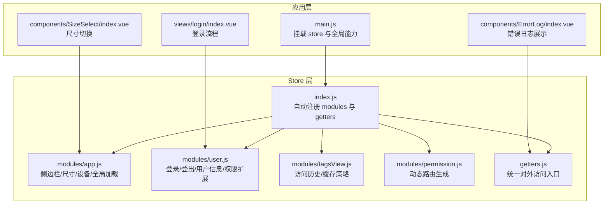
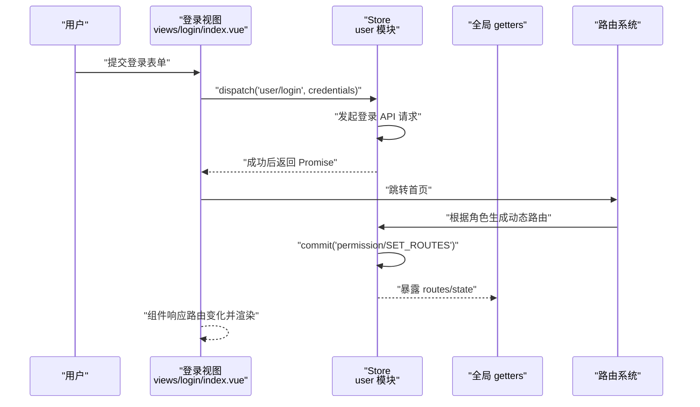
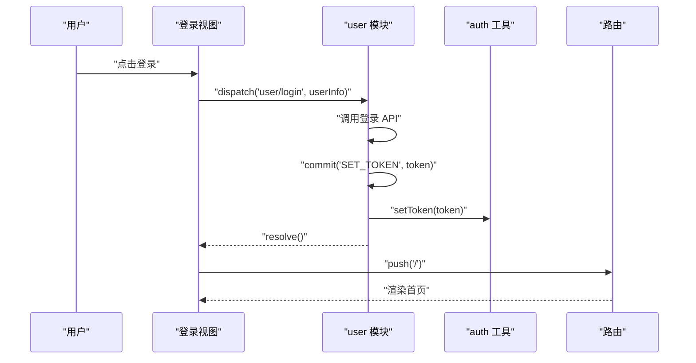
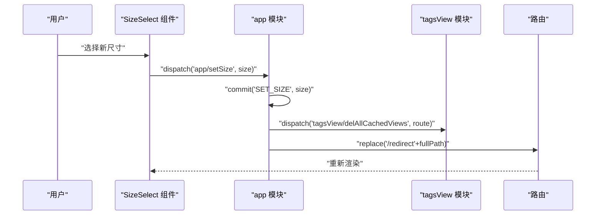
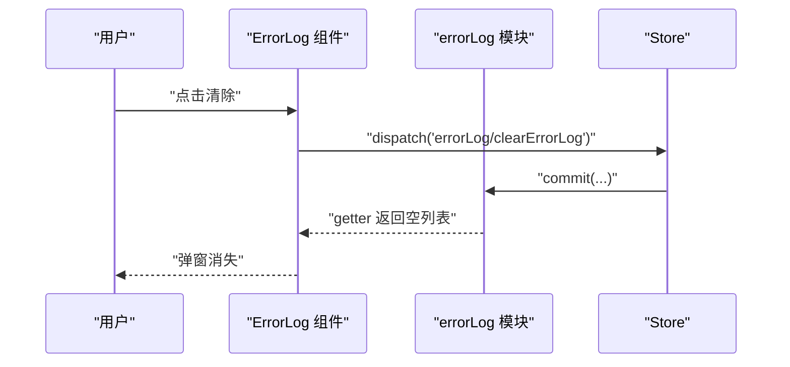
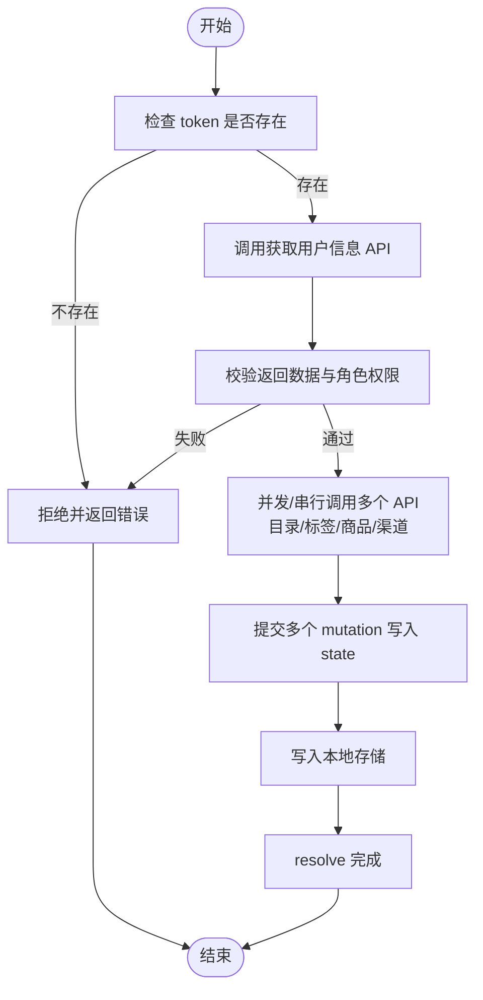
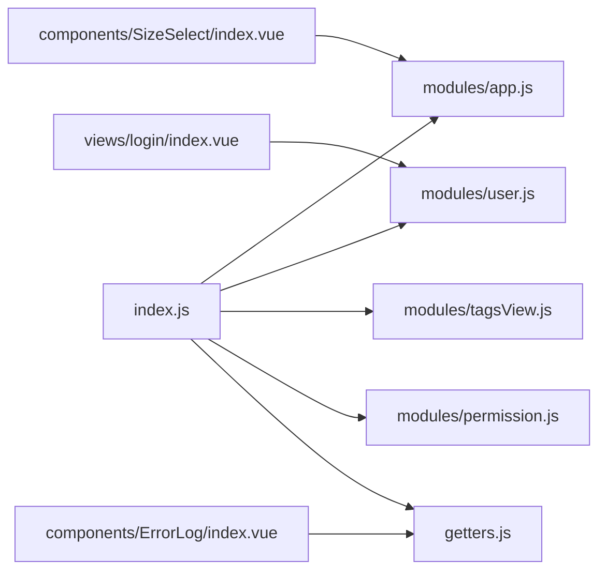

# 状态数据流管理

<cite>
**本文引用的文件**   
- [src/store/index.js](file://src/store/index.js)
- [src/store/getters.js](file://src/store/getters.js)
- [src/store/modules/app.js](file://src/store/modules/app.js)
- [src/store/modules/user.js](file://src/store/modules/user.js)
- [src/store/modules/tagsView.js](file://src/store/modules/tagsView.js)
- [src/store/modules/permission.js](file://src/store/modules/permission.js)
- [src/main.js](file://src/main.js)
- [src/views/login/index.vue](file://src/views/login/index.vue)
- [src/components/SizeSelect/index.vue](file://src/components/SizeSelect/index.vue)
- [src/components/ErrorLog/index.vue](file://src/components/ErrorLog/index.vue)
</cite>

## 目录
1. [引言](#引言)
2. [项目结构](#项目结构)
3. [核心组件](#核心组件)
4. [架构总览](#架构总览)
5. [详细组件分析](#详细组件分析)
6. [依赖分析](#依赖分析)
7. [性能考虑](#性能考虑)
8. [故障排查指南](#故障排查指南)
9. [结论](#结论)

## 引言
本文件面向 Leisu Admin 项目的前端工程，系统性梳理基于 Vuex 的状态数据流管理，覆盖从用户交互到状态更新再到视图渲染的完整生命周期；深入解析 action 触发、mutation 执行、state 更新与组件响应；总结异步数据流处理（API 调用、Promise 链、错误捕获与重试）、计算属性与 getters 缓存机制；并给出状态与组件绑定的最佳实践与可视化流程图，帮助开发者快速理解与优化复杂数据流转。

## 项目结构
- Store 通过自动扫描注册模块，集中导出，便于按功能域拆分与维护。
- 核心模块包含：用户认证与角色权限、侧边栏与尺寸控制、标签页缓存、动态路由生成等。
- 组件通过 mapState/mapGetters/mapMutations/mapActions 或直接通过 $store 访问状态与派发动作。

图表来源
- [src/store/index.js:1-26](file://src/store/index.js#L1-L26)
- [src/store/modules/app.js:1-65](file://src/store/modules/app.js#L1-L65)
- [src/store/modules/user.js:1-542](file://src/store/modules/user.js#L1-L542)
- [src/store/modules/tagsView.js:1-182](file://src/store/modules/tagsView.js#L1-L182)
- [src/store/modules/permission.js:1-66](file://src/store/modules/permission.js#L1-L66)
- [src/store/getters.js:1-33](file://src/store/getters.js#L1-L33)
- [src/main.js:1-526](file://src/main.js#L1-L526)
- [src/views/login/index.vue:1-200](file://src/views/login/index.vue#L1-L200)
- [src/components/SizeSelect/index.vue:1-58](file://src/components/SizeSelect/index.vue#L1-L58)
- [src/components/ErrorLog/index.vue:1-79](file://src/components/ErrorLog/index.vue#L1-L79)

章节来源
- [src/store/index.js:1-26](file://src/store/index.js#L1-L26)
- [src/store/getters.js:1-33](file://src/store/getters.js#L1-L33)
- [src/store/modules/app.js:1-65](file://src/store/modules/app.js#L1-L65)
- [src/store/modules/user.js:1-542](file://src/store/modules/user.js#L1-L542)
- [src/store/modules/tagsView.js:1-182](file://src/store/modules/tagsView.js#L1-L182)
- [src/store/modules/permission.js:1-66](file://src/store/modules/permission.js#L1-L66)
- [src/main.js:1-526](file://src/main.js#L1-L526)

## 核心组件
- 自动模块注册：通过 require.context 扫描 modules 下的命名模块，统一注入 Store，降低手动导入成本。
- 全局 getters：集中暴露常用状态片段，供组件以轻量方式读取，避免跨模块直接访问 state。
- 用户模块：封装登录、登出、获取用户信息、权限扩展、多场景商品与渠道数据初始化等。
- 应用模块：管理侧边栏开关、设备类型、界面尺寸、全局加载态等。
- 标签页模块：维护访问历史与缓存键集合，支持增删改查与全清操作。
- 权限模块：根据角色过滤异步路由，生成可访问路由表并写入 state。

章节来源
- [src/store/index.js:7-23](file://src/store/index.js#L7-L23)
- [src/store/getters.js:1-33](file://src/store/getters.js#L1-L33)
- [src/store/modules/user.js:139-392](file://src/store/modules/user.js#L139-L392)
- [src/store/modules/app.js:13-57](file://src/store/modules/app.js#L13-L57)
- [src/store/modules/tagsView.js:6-88](file://src/store/modules/tagsView.js#L6-L88)
- [src/store/modules/permission.js:49-57](file://src/store/modules/permission.js#L49-L57)

## 架构总览
下图展示一次典型“用户登录”到“路由生效”的端到端数据流，涵盖 action 触发、mutation 提交、state 更新与组件响应。

图表来源
- [src/views/login/index.vue:103-120](file://src/views/login/index.vue#L103-L120)
- [src/store/modules/user.js:139-155](file://src/store/modules/user.js#L139-L155)
- [src/store/modules/permission.js:49-57](file://src/store/modules/permission.js#L49-L57)
- [src/store/getters.js:13-13](file://src/store/getters.js#L13-L13)

## 详细组件分析

### 登录流程（Action → Mutation → State → 组件响应）
- 用户在登录页输入凭据并提交。
- 视图通过 dispatch 触发 user 模块的登录 action，内部发起 API 请求。
- 成功后提交 mutation 设置 token，并持久化；随后跳转首页。
- 组件通过路由守卫与权限模块生成可访问路由，完成渲染。

图表来源
- [src/views/login/index.vue:103-120](file://src/views/login/index.vue#L103-L120)
- [src/store/modules/user.js:139-155](file://src/store/modules/user.js#L139-L155)
- [src/main.js:18-20](file://src/main.js#L18-L20)

章节来源
- [src/views/login/index.vue:103-120](file://src/views/login/index.vue#L103-L120)
- [src/store/modules/user.js:139-155](file://src/store/modules/user.js#L139-L155)

### 尺寸切换（Getter 读取 → Action 触发 → Mutation 提交 → 组件刷新）
- SizeSelect 组件通过 getter 读取当前尺寸，用户选择后 dispatch 到 app 模块。
- app 模块提交 mutation 写入 Cookie 并更新 state，随后触发标签页缓存清理与路由重定向，使缓存视图重新渲染。

图表来源
- [src/components/SizeSelect/index.vue:27-53](file://src/components/SizeSelect/index.vue#L27-L53)
- [src/store/modules/app.js:50-56](file://src/store/modules/app.js#L50-L56)
- [src/store/modules/tagsView.js:148-169](file://src/store/modules/tagsView.js#L148-L169)

章节来源
- [src/components/SizeSelect/index.vue:27-53](file://src/components/SizeSelect/index.vue#L27-L53)
- [src/store/modules/app.js:50-56](file://src/store/modules/app.js#L50-L56)
- [src/store/modules/tagsView.js:148-169](file://src/store/modules/tagsView.js#L148-L169)

### 错误日志展示（Getter 读取 → 动作派发）
- ErrorLog 组件通过 getter 读取错误日志列表，点击清除时派发动作清理日志。
- 该流程体现“只读 getters + 可变动作”的职责分离。

图表来源
- [src/components/ErrorLog/index.vue:57-66](file://src/components/ErrorLog/index.vue#L57-L66)
- [src/store/getters.js:14-14](file://src/store/getters.js#L14-L14)

章节来源
- [src/components/ErrorLog/index.vue:57-66](file://src/components/ErrorLog/index.vue#L57-L66)
- [src/store/getters.js:14-14](file://src/store/getters.js#L14-L14)

### 异步数据流与错误处理
- 登录/登出/获取用户信息等均采用 Promise 包裹，成功 resolve，失败 reject，由调用方捕获并刷新验证码或提示。
- 用户信息获取中包含多处 API 并行/串行调用（如日志页面路由、社区目录、情报标签、商品列表、渠道数据），并在成功后写入本地存储，提升二次进入性能。
- 权限模块通过递归过滤异步路由，确保仅注入可访问路由。

图表来源
- [src/store/modules/user.js:173-336](file://src/store/modules/user.js#L173-L336)

章节来源
- [src/store/modules/user.js:173-336](file://src/store/modules/user.js#L173-L336)

### 计算属性与 getters 缓存机制
- 全局 getters 将常用状态片段暴露给组件，组件通过 computed 读取，具备响应式与缓存特性。
- 示例：尺寸、侧边栏状态、用户令牌、角色列表、错误日志、敏感词列表、渠道对象、预测器本地 ID 列表等。

章节来源
- [src/store/getters.js:1-33](file://src/store/getters.js#L1-L33)
- [src/components/SizeSelect/index.vue:27-30](file://src/components/SizeSelect/index.vue#L27-L30)
- [src/components/ErrorLog/index.vue:57-60](file://src/components/ErrorLog/index.vue#L57-L60)

### 状态与组件绑定最佳实践
- 读取：优先使用 mapGetters 或直接通过 this.$store.getters.xxx 访问，避免直接跨模块访问 state。
- 修改：通过 mapMutations 或 this.$store.commit('MODULE/MUTATION', payload) 同步提交。
- 行为：通过 mapActions 或 this.$store.dispatch('MODULE/action', payload) 触发异步流程。
- 场景建议：
  - SizeSelect：读取尺寸（getter）+ 触发尺寸变更（action）+ 清理缓存视图（action）。
  - ErrorLog：读取错误列表（getter）+ 触发清理（action）。
  - 登录页：触发登录（action）+ 成功后跳转。

章节来源
- [src/components/SizeSelect/index.vue:27-53](file://src/components/SizeSelect/index.vue#L27-L53)
- [src/components/ErrorLog/index.vue:57-66](file://src/components/ErrorLog/index.vue#L57-L66)
- [src/views/login/index.vue:103-120](file://src/views/login/index.vue#L103-L120)

## 依赖分析
- Store 注册：index.js 通过 require.context 自动收集 modules，避免手动维护导入清单。
- 模块耦合：user 模块与 router/permission 模块存在运行时耦合（动态路由注入），但通过命名空间与根级 dispatch 解耦。
- 组件依赖：组件通过 $store.getters/$store.dispatch/$store.commit 与 store 解耦，便于测试与替换。

图表来源
- [src/store/index.js:7-23](file://src/store/index.js#L7-L23)
- [src/store/modules/app.js:1-65](file://src/store/modules/app.js#L1-L65)
- [src/store/modules/user.js:1-542](file://src/store/modules/user.js#L1-L542)
- [src/store/modules/tagsView.js:1-182](file://src/store/modules/tagsView.js#L1-L182)
- [src/store/modules/permission.js:1-66](file://src/store/modules/permission.js#L1-L66)
- [src/store/getters.js:1-33](file://src/store/getters.js#L1-L33)
- [src/views/login/index.vue:1-200](file://src/views/login/index.vue#L1-L200)
- [src/components/SizeSelect/index.vue:1-58](file://src/components/SizeSelect/index.vue#L1-L58)
- [src/components/ErrorLog/index.vue:1-79](file://src/components/ErrorLog/index.vue#L1-L79)

章节来源
- [src/store/index.js:7-23](file://src/store/index.js#L7-L23)

## 性能考虑
- 模块懒加载：通过 require.context 自动注册，减少手工维护成本，利于按需拆分。
- 本地缓存：用户信息获取后将部分数据写入 localStorage，减少重复请求。
- 视图缓存：tagsView 模块维护缓存键集合，支持清理特定视图缓存，配合路由重定向实现“强制刷新”。

章节来源
- [src/store/modules/user.js:259-328](file://src/store/modules/user.js#L259-L328)
- [src/store/modules/tagsView.js:36-41](file://src/store/modules/tagsView.js#L36-L41)
- [src/components/SizeSelect/index.vue:42-53](file://src/components/SizeSelect/index.vue#L42-L53)

## 故障排查指南
- 登录失败：检查 action 中的 Promise 拒绝分支，确认错误提示与验证码刷新逻辑。
- 权限异常：确认 permission 模块的过滤函数与角色列表，确保动态路由正确注入。
- 视图未刷新：确认是否调用了 tagsView 的清理缓存动作并执行了路由重定向。
- Getter 读取不到数据：确认命名空间拼写与 getters 导出是否一致。

章节来源
- [src/store/modules/user.js:139-155](file://src/store/modules/user.js#L139-L155)
- [src/store/modules/permission.js:8-35](file://src/store/modules/permission.js#L8-L35)
- [src/store/modules/tagsView.js:148-169](file://src/store/modules/tagsView.js#L148-L169)
- [src/store/getters.js:1-33](file://src/store/getters.js#L1-L33)

## 结论
Leisu Admin 的 Vuex 数据流以“自动模块注册 + 命名空间 + 全局 getters”为核心，结合“action 异步 + mutation 同步”的清晰边界，实现了从用户交互到视图渲染的稳定闭环。通过合理使用 getters、actions 与 mutations，并配合本地缓存与视图缓存策略，可在保证开发效率的同时获得良好的用户体验与可维护性。建议在新增模块时遵循现有命名规范与职责划分，持续沉淀跨模块共享的 getters 与工具方法。