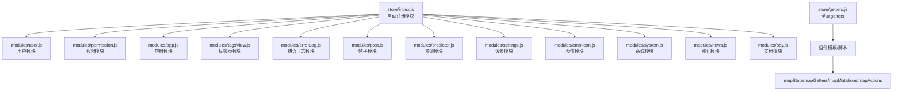
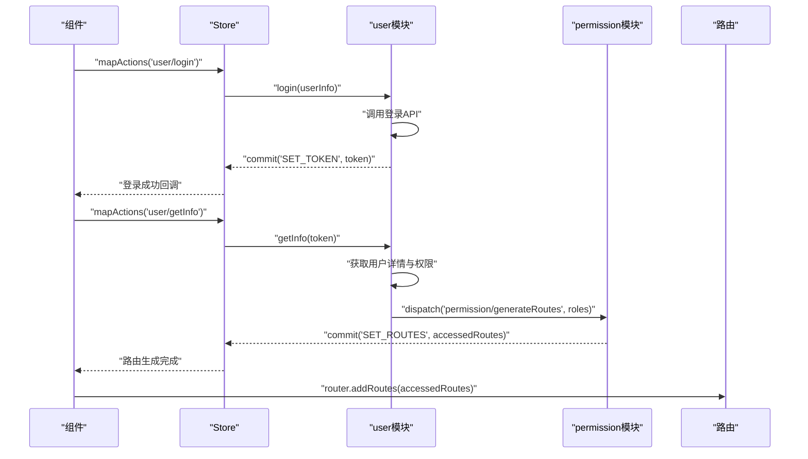
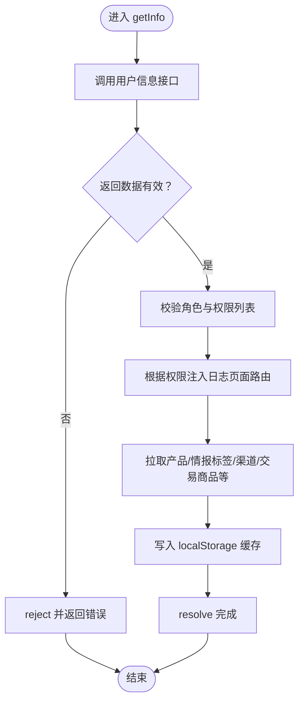
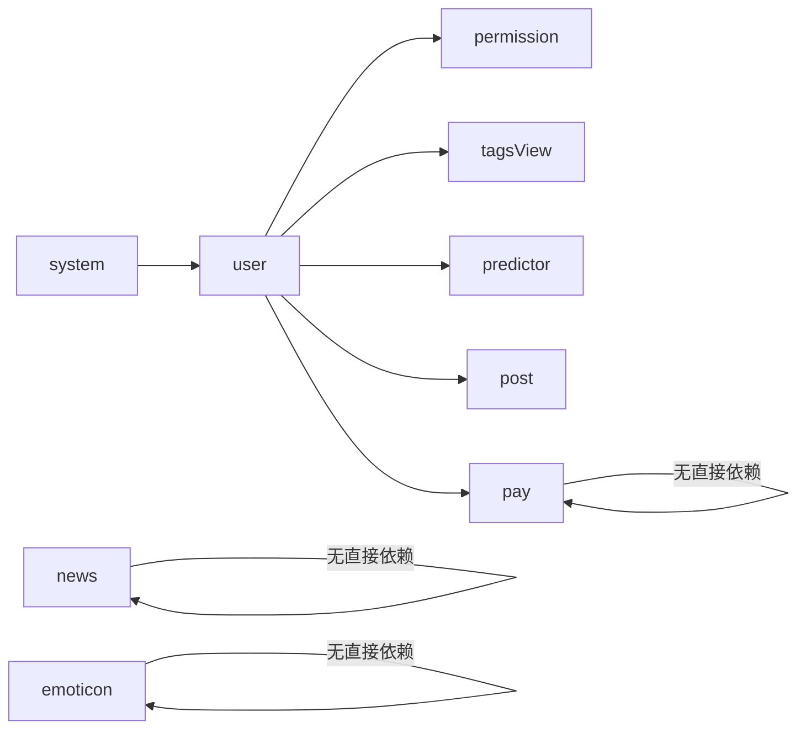

# 状态管理架构

<cite>
**本文引用的文件**
- [src/store/index.js](file://src/store/index.js)
- [src/store/getters.js](file://src/store/getters.js)
- [src/store/modules/user.js](file://src/store/modules/user.js)
- [src/store/modules/permission.js](file://src/store/modules/permission.js)
- [src/store/modules/app.js](file://src/store/modules/app.js)
- [src/store/modules/tagsView.js](file://src/store/modules/tagsView.js)
- [src/store/modules/errorLog.js](file://src/store/modules/errorLog.js)
- [src/store/modules/post.js](file://src/store/modules/post.js)
- [src/store/modules/predictor.js](file://src/store/modules/predictor.js)
- [src/store/modules/settings.js](file://src/store/modules/settings.js)
- [src/store/modules/emoticon.js](file://src/store/modules/emoticon.js)
- [src/store/modules/system.js](file://src/store/modules/system.js)
- [src/store/modules/news.js](file://src/store/modules/news.js)
- [src/store/modules/pay.js](file://src/store/modules/pay.js)
</cite>

## 目录
1. [引言](#引言)
2. [项目结构](#项目结构)
3. [核心组件](#核心组件)
4. [架构总览](#架构总览)
5. [详细组件分析](#详细组件分析)
6. [依赖分析](#依赖分析)
7. [性能考量](#性能考量)
8. [故障排查指南](#故障排查指南)
9. [结论](#结论)
10. [附录](#附录)

## 引言
本文件面向 Leisu Admin 项目的前端团队与协作开发者，系统性梳理基于 Vuex 3.1.0 的状态管理架构。内容涵盖状态树结构、模块化组织、数据流管理、核心概念（state/mutations/actions/getters）、状态持久化策略（localStorage/sessionStorage）、异步状态管理与错误处理、以及与组件的集成方式（mapState/mapGetters/mapMutations/mapActions）。文中通过架构图与流程图帮助读者快速建立对整体状态管理的理解。

## 项目结构
- 状态入口与自动注册
  - 通过 require.context 自动扫描 modules 目录下的所有模块，并以模块名为键注入到根 store 中，实现零样板代码的模块注册。
  - 根 store 同时挂载全局 getters，便于在组件中按需访问。
- 模块化组织
  - 每个模块均采用 namespaced: true 的命名空间模式，避免命名冲突，提升可维护性。
  - 模块职责清晰：用户认证与个人信息、权限路由生成、应用主题与布局、标签页缓存、错误日志、帖子与预测文章高亮、设置项、表情包、系统权限与用户组、资讯频道、支付优惠券类型等。

图表来源
- [src/store/index.js:1-26](file://src/store/index.js#L1-L26)
- [src/store/getters.js:1-33](file://src/store/getters.js#L1-L33)
- [src/store/modules/user.js:536-542](file://src/store/modules/user.js#L536-L542)
- [src/store/modules/permission.js:60-66](file://src/store/modules/permission.js#L60-L66)
- [src/store/modules/app.js:59-65](file://src/store/modules/app.js#L59-L65)
- [src/store/modules/tagsView.js:176-182](file://src/store/modules/tagsView.js#L176-L182)
- [src/store/modules/errorLog.js:23-29](file://src/store/modules/errorLog.js#L23-L29)
- [src/store/modules/post.js:107-113](file://src/store/modules/post.js#L107-L113)
- [src/store/modules/predictor.js:82-88](file://src/store/modules/predictor.js#L82-L88)
- [src/store/modules/settings.js:28-35](file://src/store/modules/settings.js#L28-L35)
- [src/store/modules/emoticon.js:150-156](file://src/store/modules/emoticon.js#L150-L156)
- [src/store/modules/system.js:180-186](file://src/store/modules/system.js#L180-L186)
- [src/store/modules/news.js:106-112](file://src/store/modules/news.js#L106-L112)
- [src/store/modules/pay.js:27-33](file://src/store/modules/pay.js#L27-L33)

章节来源
- [src/store/index.js:1-26](file://src/store/index.js#L1-L26)
- [src/store/getters.js:1-33](file://src/store/getters.js#L1-L33)

## 核心组件
- 根 Store 与模块注册
  - 使用 require.context 动态导入 modules 下的所有模块，键名为模块文件名（去除扩展名），值为模块默认导出。
  - 将 getters 注入根 store，供全局访问。
- Getter 聚合
  - 聚合来自 app、tagsView、user、permission、errorLog、post、emoticon、predictor 等模块的常用派生状态，简化组件访问。
- 模块命名空间
  - 所有模块启用 namespaced: true，组件中通过命名空间访问模块的 state/mutations/actions/getters，避免全局污染。

章节来源
- [src/store/index.js:7-23](file://src/store/index.js#L7-L23)
- [src/store/getters.js:1-33](file://src/store/getters.js#L1-L33)

## 架构总览
- 数据流向
  - 组件通过 mapState/mapGetters 访问 state/getters。
  - 组件通过 mapMutations/mapActions 触发 mutation/action。
  - action 内部进行异步操作（如 API 调用），成功后提交 mutation 更新 state；失败时记录错误日志或抛出异常。
  - 某些模块会结合 localStorage/sessionStorage 实现状态持久化与恢复。
- 关键交互
  - 用户模块负责登录、登出、获取用户信息与权限，随后触发权限模块生成可访问路由并重置路由。
  - 标签页模块维护 visitedViews/cachedViews，配合路由守卫与权限模块控制页面缓存。
  - 预测模块与帖子模块分别维护文章高亮 ID 列表，并持久化到 localStorage。
  - 表情模块提供表情列表与格式化工具，支持编辑器与富文本回显。
  - 支付模块缓存优惠券类型映射，减少重复请求。

图表来源
- [src/store/modules/user.js:139-392](file://src/store/modules/user.js#L139-L392)
- [src/store/modules/permission.js:49-58](file://src/store/modules/permission.js#L49-L58)

## 详细组件分析

### 用户模块（user）
- 职责
  - 管理登录态 token、用户基础信息、角色与权限列表、产品与交易商品列表、渠道信息、用户标签、随机马甲号等。
  - 登录、登出、切换角色、获取用户信息并动态生成路由。
- 核心概念
  - state：包含 token、name、avatar、introduction、roles、roles_id、mangeid、unionid、product_list、tradeProductList、channel_obj、userTags、randomUserList、groupRandomUserList 等。
  - mutations：SET_* 系列变更用户信息与列表。
  - actions：
    - login/loginDing：发起登录请求，成功后写入 token 并持久化。
    - getInfo：拉取用户详情、权限、产品、渠道、情报标签等，必要时动态注入日志页面路由，最后持久化部分数据到 localStorage。
    - logout/resetToken：清理 token、角色、路由与标签页缓存。
    - changeRoles：模拟切换角色，重新生成路由并重置标签页。
    - setMemberTagMsg/getMemberTagMsg：封装用户标签数据的获取与格式化。
    - userRandomAlias/groupUserRandomAlias：封装随机马甲号的获取与消费逻辑。
- 异步与错误处理
  - 所有异步请求均返回 Promise，成功时提交 mutation，失败时 reject 或返回空结果并记录错误。
  - 对特定权限进行增强（如媒体/专家/社区流水报表权限），确保前端展示与路由一致。
- 状态持久化
  - 登录成功后写入 token；部分数据（如产品列表、情报标签、渠道数据）写入 localStorage，供后续恢复使用。

图表来源
- [src/store/modules/user.js:173-335](file://src/store/modules/user.js#L173-L335)

章节来源
- [src/store/modules/user.js:13-542](file://src/store/modules/user.js#L13-L542)

### 权限模块（permission）
- 职责
  - 基于用户角色过滤异步路由表，生成可访问路由集合，并合并到常量路由中。
- 核心概念
  - state：routes（最终路由集合）、addRoutes（新增路由）。
  - mutations：SET_ROUTES 合并常量与新增路由。
  - actions：generateRoutes 根据角色递归过滤异步路由并提交。
- 与路由集成
  - 由 user 模块在获取用户信息后触发 generateRoutes，随后由路由层 addRoutes 生效。

章节来源
- [src/store/modules/permission.js:37-66](file://src/store/modules/permission.js#L37-L66)

### 应用模块（app）
- 职责
  - 管理侧边栏开关、设备类型、尺寸大小、全局 loading 状态等。
- 核心概念
  - state：sidebar/device/size/bodyLoading。
  - mutations：TOGGLE_SIDEBAR/CLOSE_SIDEBAR/TOGGLE_DEVICE/SET_SIZE/SET_BODYLOADING。
  - actions：toggleSideBar/closeSideBar/toggleDevice/setSize/set_body_loading。
- 状态持久化
  - 侧边栏与尺寸状态通过 Cookie 持久化，刷新后恢复。

章节来源
- [src/store/modules/app.js:3-65](file://src/store/modules/app.js#L3-L65)

### 标签页模块（tagsView）
- 职责
  - 维护已访问页面列表 visitedViews 与缓存页面列表 cachedViews，支持增删改查与清空。
- 核心概念
  - mutations：ADD_*、DEL_*、DEL_OTHERS_*、DEL_ALL_*、UPDATE_VISITED_VIEW。
  - actions：addView/addVisitedView/addCachedView、delView/...、delOthersViews/...、delAllViews/...、updateVisitedView。
- 特殊逻辑
  - params 路由仅保留最新一次访问；机器人相关路由与其他路由互斥清理。

章节来源
- [src/store/modules/tagsView.js:1-182](file://src/store/modules/tagsView.js#L1-L182)

### 错误日志模块（errorLog）
- 职责
  - 记录前端运行期错误，便于统一收集与展示。
- 核心概念
  - state：logs。
  - mutations：ADD_ERROR_LOG/CLEAR_ERROR_LOG。
  - actions：addErrorLog/clearErrorLog。

章节来源
- [src/store/modules/errorLog.js:1-29](file://src/store/modules/errorLog.js#L1-L29)

### 帖子模块（post）
- 职责
  - 维护帖子点击 ID 列表（window_post_ids），并持久化到 localStorage。
  - 提供敏感词列表的异步加载。
- 核心概念
  - state：newfavds/delfavd/lightSensitiveWordList/window_post_ids。
  - mutations：ADDPOSTID/SET_POSTID/SET_newfavds/SET_delfavd/SET_LIGHT_SENSITIVE_WORD。
  - actions：loadPostIds/addPostIds/set_light_sensitive_word。
- 状态持久化
  - 通过 localStorage 保存 window_post_ids，兼容历史键名。

章节来源
- [src/store/modules/post.js:1-113](file://src/store/modules/post.js#L1-L113)

### 预测模块（predictor）
- 职责
  - 维护不同文章类型（单关/串关/足彩）的高亮 ID 列表，并持久化到 localStorage。
- 核心概念
  - state：singleIds/multibetIds/lotteryIds。
  - mutations：ADD_ARTICLE_S/M/ L、SET_ARTICLE_S/M/L。
  - actions：loadArticleIds/addArticleIds/saveArticleIds。
- 状态持久化
  - 三类文章 ID 分别持久化到 window_article_s_ids、window_article_m_ids、window_article_l_ids。

章节来源
- [src/store/modules/predictor.js:1-88](file://src/store/modules/predictor.js#L1-L88)

### 设置模块（settings）
- 职责
  - 管理主题、标签页、固定头部、侧边栏 Logo 等界面设置。
- 核心概念
  - state：theme/showSettings/tagsView/fixedHeader/sidebarLogo。
  - mutations：CHANGE_SETTING。
  - actions：changeSetting。

章节来源
- [src/store/modules/settings.js:1-35](file://src/store/modules/settings.js#L1-L35)

### 表情模块（emoticon）
- 职责
  - 拉取表情列表并提供多种格式化输出（编辑器、富文本回显、tab 列表），支持隐藏指定 tab 类型。
- 核心概念
  - state：emoticonList。
  - mutations：SET_EMOTICON_MAP。
  - actions：getList（拉取并缓存）、setEmoticonMap（按场景返回格式化数据）。
- 设计要点
  - 深拷贝避免组件直接修改缓存；支持强制刷新与缓存优先策略。

章节来源
- [src/store/modules/emoticon.js:1-156](file://src/store/modules/emoticon.js#L1-L156)

### 系统模块（system）
- 职责
  - 管理系统权限与用户组，过滤可分配权限组与可编辑用户组，供系统管理页面使用。
- 核心概念
  - state：initPermissionsAll/havingPermissionGroups。
  - mutations：SET_ALL_PERMISSIONS/SET_ALLHAVING_PERMISSIONS。
  - actions：getAllPermissions/filterAllPermissionsRole、getAllUserGroups/filterAllUserGroups、updateGetAllGroup。
- 与用户模块联动
  - 基于 user.roles 与 roles_id 进行权限判断与过滤。

章节来源
- [src/store/modules/system.js:1-186](file://src/store/modules/system.js#L1-L186)

### 资讯模块（news）
- 职责
  - 获取并缓存资讯频道列表，支持去重、并发请求复用与错误处理。
- 核心概念
  - state：newsChannelList/isLoading/pendingPromise。
  - mutations：SET_NEWS_CHANNEL_LIST/SET_IS_LOADING/SET_PENDING_PROMISE。
  - actions：GET_NEWS_CHANNEL_LIST（带缓存与并发复用）。

章节来源
- [src/store/modules/news.js:1-112](file://src/store/modules/news.js#L1-L112)

### 支付模块（pay）
- 职责
  - 缓存优惠券类型映射，减少重复请求。
- 核心概念
  - state：coupon_type_map。
  - mutations：SET_COUPON_TYPE_MAP。
  - actions：get_coupon_type_map（从接口拉取并持久化到 localStorage）。

章节来源
- [src/store/modules/pay.js:1-33](file://src/store/modules/pay.js#L1-L33)

## 依赖分析
- 模块耦合关系
  - user 模块与 permission 模块强关联：user 模块在获取用户信息后触发 permission.generateRoutes。
  - user 模块与 tagsView 模块：logout 时重置标签页视图。
  - user 模块与 pay/predictor/post 模块：通过 dispatch 触发其初始化动作，实现数据预热与本地缓存。
  - system 模块依赖 user 模块的角色信息进行权限过滤。
  - news/pay/emoticon 模块相对独立，主要依赖各自 API。
- 外部依赖
  - cookies：app 模块使用 js-cookie 持久化侧边栏与尺寸。
  - localStorage：多个模块用于状态持久化与恢复。
  - API 层：各模块通过对应 API 文件发起请求，遵循统一的 Promise 错误处理。

图表来源
- [src/store/modules/user.js:324-328](file://src/store/modules/user.js#L324-L328)
- [src/store/modules/system.js:84-132](file://src/store/modules/system.js#L84-L132)

章节来源
- [src/store/modules/user.js:324-328](file://src/store/modules/user.js#L324-L328)
- [src/store/modules/system.js:84-132](file://src/store/modules/system.js#L84-L132)

## 性能考量
- 模块懒加载与按需访问
  - 通过命名空间与 getters 聚合，避免组件直接访问深层嵌套状态，降低不必要的响应式开销。
- 本地缓存与去重
  - predictor/post 使用 localStorage 缓存高频访问的 ID 列表，限制容量并及时清理。
  - news 模块对频道列表进行去重与并发请求复用，避免重复网络请求。
- 路由按需生成
  - permission 模块仅生成当前角色可访问的路由，减少渲染与鉴权成本。
- Cookie 与本地存储
  - app 模块使用 Cookie 持久化轻量 UI 状态；其他模块使用 localStorage 持久化业务数据，注意容量与序列化开销。

## 故障排查指南
- 登录失败
  - 检查 user.login 是否正确提交 SET_TOKEN 并写入 token；确认 getInfo 是否返回有效 roles 与权限列表。
- 权限不足导致页面不可见
  - 确认 user.getInfo 是否正确增强权限列表；检查 permission.generateRoutes 是否被调用且返回非空路由。
- 标签页异常
  - 检查 tagsView 的 ADD/DEL/DEL_OTHERS/DEL_ALL 系列 mutation 是否按预期执行；关注 params 路由的覆盖逻辑。
- 本地缓存不生效
  - 检查 predictor/post 的 load/save 逻辑与 localStorage 键名是否匹配；确认过期或容量上限导致的数据丢失。
- 表情/频道/优惠券为空
  - 确认对应模块的 actions 是否正确提交 mutation；检查 API 返回码与错误处理分支。

章节来源
- [src/store/modules/user.js:139-392](file://src/store/modules/user.js#L139-L392)
- [src/store/modules/permission.js:49-58](file://src/store/modules/permission.js#L49-L58)
- [src/store/modules/tagsView.js:6-88](file://src/store/modules/tagsView.js#L6-L88)
- [src/store/modules/predictor.js:44-79](file://src/store/modules/predictor.js#L44-L79)
- [src/store/modules/post.js:74-104](file://src/store/modules/post.js#L74-L104)
- [src/store/modules/emoticon.js:103-148](file://src/store/modules/emoticon.js#L103-L148)
- [src/store/modules/news.js:47-103](file://src/store/modules/news.js#L47-L103)
- [src/store/modules/pay.js:14-25](file://src/store/modules/pay.js#L14-L25)

## 结论
本项目采用模块化、命名空间化的 Vuex 架构，结合 Cookie 与 localStorage 实现轻量 UI 状态与业务数据的持久化。通过 getters 聚合与 actions 统一异步流程，提升了可维护性与可测试性。建议在后续迭代中：
- 对大体量本地缓存增加版本控制与清理策略；
- 对高频 API 请求引入统一的重试与节流；
- 在组件中统一使用 mapXxx 辅助函数，减少样板代码；
- 对关键模块补充单元测试与端到端测试。

## 附录
- 组件集成建议
  - 使用 mapState/mapGetters 获取状态与派生数据；
  - 使用 mapMutations/mapActions 触发变更与异步流程；
  - 在路由守卫中结合 permission.generateRoutes 与 tagsView 清理逻辑，保证页面一致性。
- 状态持久化清单
  - app：sidebarStatus、size（Cookie）；
  - predictor：window_article_s_ids、window_article_m_ids、window_article_l_ids（localStorage）；
  - post：localPostIdList、window_post_ids（localStorage）；
  - user：productList、intelligenceTabList、localChannelData（localStorage）；
  - pay：locaCouponType（localStorage）。