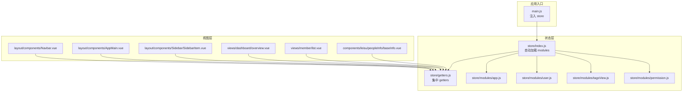
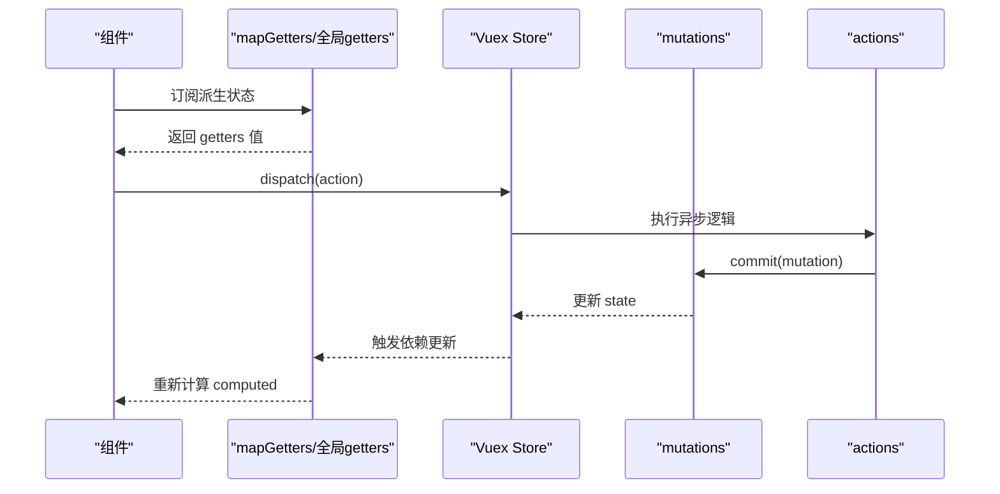
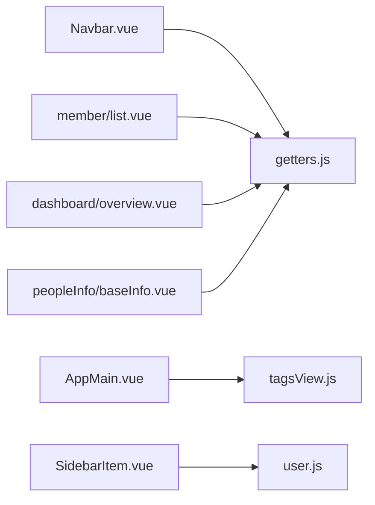

# 组件状态集成

<cite>
**本文引用的文件**
- [src/store/index.js](file://src/store/index.js)
- [src/store/getters.js](file://src/store/getters.js)
- [src/store/modules/app.js](file://src/store/modules/app.js)
- [src/store/modules/user.js](file://src/store/modules/user.js)
- [src/store/modules/tagsView.js](file://src/store/modules/tagsView.js)
- [src/store/modules/permission.js](file://src/store/modules/permission.js)
- [src/main.js](file://src/main.js)
- [src/layout/components/AppMain.vue](file://src/layout/components/AppMain.vue)
- [src/layout/components/Navbar.vue](file://src/layout/components/Navbar.vue)
- [src/layout/components/Sidebar/SidebarItem.vue](file://src/layout/components/Sidebar/SidebarItem.vue)
- [src/views/dashboard/overview.vue](file://src/views/dashboard/overview.vue)
- [src/views/member/list.vue](file://src/views/member/list.vue)
- [src/components/leisu/peopleInfo/baseInfo.vue](file://src/components/leisu/peopleInfo/baseInfo.vue)
</cite>

## 目录
1. [简介](#简介)
2. [项目结构](#项目结构)
3. [核心组件](#核心组件)
4. [架构总览](#架构总览)
5. [详细组件分析](#详细组件分析)
6. [依赖关系分析](#依赖关系分析)
7. [性能考量](#性能考量)
8. [故障排查指南](#故障排查指南)
9. [结论](#结论)
10. [附录](#附录)

## 简介
本文件面向 Leisu Admin 的前端工程，系统性梳理 Vue 组件与 Vuex 状态管理的集成方式，覆盖以下主题：
- mapState、mapGetters、mapMutations、mapActions 的使用与最佳实践
- 组件中的状态订阅模式：computed 属性、watch 监听器、生命周期中的状态处理
- 组件间状态共享机制：父子、兄弟、跨层级通信与状态传递
- 动态组件的状态管理：路由切换时的状态保持、条件渲染时的状态缓存、列表组件的状态同步
- 组件状态调试技巧：Vue DevTools 使用、状态变化追踪、性能优化策略
- 常见集成场景的代码示例与解决方案（以源码路径标注代替具体代码）

## 项目结构
Leisu Admin 采用模块化的 Vuex 架构，通过自动扫描 modules 目录加载各命名空间模块，并在全局 getters 中集中导出常用派生状态。应用入口在 main.js 中注入 store，组件通过映射辅助函数或直接访问 $store 订阅状态。

图表来源
- [src/main.js:19](file://src/main.js#L19)
- [src/store/index.js:20-26](file://src/store/index.js#L20-L26)
- [src/store/getters.js:1-33](file://src/store/getters.js#L1-L33)
- [src/store/modules/app.js:1-65](file://src/store/modules/app.js#L1-L65)
- [src/store/modules/user.js:1-542](file://src/store/modules/user.js#L1-L542)
- [src/store/modules/tagsView.js:1-182](file://src/store/modules/tagsView.js#L1-L182)
- [src/store/modules/permission.js:1-66](file://src/store/modules/permission.js#L1-L66)
- [src/layout/components/Navbar.vue:29-54](file://src/layout/components/Navbar.vue#L29-L54)
- [src/layout/components/AppMain.vue:34-41](file://src/layout/components/AppMain.vue#L34-L41)
- [src/layout/components/Sidebar/SidebarItem.vue:100-104](file://src/layout/components/Sidebar/SidebarItem.vue#L100-L104)
- [src/views/dashboard/overview.vue:108-331](file://src/views/dashboard/overview.vue#L108-L331)
- [src/views/member/list.vue:248-520](file://src/views/member/list.vue#L248-L520)
- [src/components/leisu/peopleInfo/baseInfo.vue:161-199](file://src/components/leisu/peopleInfo/baseInfo.vue#L161-L199)

章节来源
- [src/main.js:19](file://src/main.js#L19)
- [src/store/index.js:20-26](file://src/store/index.js#L20-L26)
- [src/store/getters.js:1-33](file://src/store/getters.js#L1-L33)

## 核心组件
- 应用状态入口：store/index.js 自动扫描 modules 并挂载 getters，形成统一状态树。
- 全局 getters：store/getters.js 提供 sidebar、device、visitedViews、cachedViews、token、roles、permission_routes 等常用派生状态，便于组件以 mapGetters 快速订阅。
- 用户模块：store/modules/user.js 管理 token、角色、产品列表、渠道对象等，提供登录、登出、动态权限变更等异步动作。
- 应用模块：store/modules/app.js 管理侧边栏开关、设备类型、尺寸、全局 loading 等。
- 标签页模块：store/modules/tagsView.js 管理已访问页与缓存页集合，配合 keep-alive 实现路由切换时的状态保持。
- 权限模块：store/modules/permission.js 过滤异步路由并生成可访问路由表。

章节来源
- [src/store/index.js:20-26](file://src/store/index.js#L20-L26)
- [src/store/getters.js:1-33](file://src/store/getters.js#L1-L33)
- [src/store/modules/user.js:1-542](file://src/store/modules/user.js#L1-L542)
- [src/store/modules/app.js:1-65](file://src/store/modules/app.js#L1-L65)
- [src/store/modules/tagsView.js:1-182](file://src/store/modules/tagsView.js#L1-L182)
- [src/store/modules/permission.js:1-66](file://src/store/modules/permission.js#L1-L66)

## 架构总览
下图展示组件如何通过 mapGetters、$store.state/$store.getters 订阅状态，以及通过 $store.dispatch 触发异步动作，最终由 mutations 修改 state 并驱动视图更新。

图表来源
- [src/store/getters.js:1-33](file://src/store/getters.js#L1-L33)
- [src/store/modules/user.js:139-392](file://src/store/modules/user.js#L139-L392)
- [src/store/modules/app.js:40-57](file://src/store/modules/app.js#L40-L57)

## 详细组件分析

### 组件状态订阅模式与最佳实践
- computed 属性
  - 通过 mapGetters 将 getters 映射为本地计算属性，确保响应式订阅与最小重渲染范围。
  - 示例：导航栏组件通过 mapGetters 订阅 sidebar、avatar、device，用于控制侧边栏开关与头像显示。
  - 参考路径：[src/layout/components/Navbar.vue:39](file://src/layout/components/Navbar.vue#L39)

- watch 监听器
  - 在路由切换或窗口大小变化时，watch 监听器触发副作用（如打开 iframe、调整布局），避免在模板中直接执行副作用。
  - 示例：AppMain 监听 $route，按路由名称动态创建 iframe。
  - 参考路径：[src/layout/components/AppMain.vue:43-70](file://src/layout/components/AppMain.vue#L43-L70)

- 生命周期中的状态处理
  - created/mounted/activated 中读取全局 getters 或触发异步加载，避免在模板中直接访问 $store。
  - 示例：成员列表页 created 阶段从 getters 读取渠道列表；activated 中处理外部 UID 查询。
  - 参考路径：[src/views/member/list.vue:299-344](file://src/views/member/list.vue#L299-L344)

- 最佳实践
  - 优先使用 mapState/mapGetters/mapMutations/mapActions，减少直接访问 $store 的耦合度。
  - 将复杂计算放入 getters，保持组件逻辑简洁。
  - 异步操作统一通过 actions，避免在组件中直接 commit。

章节来源
- [src/layout/components/Navbar.vue:39](file://src/layout/components/Navbar.vue#L39)
- [src/layout/components/AppMain.vue:43-70](file://src/layout/components/AppMain.vue#L43-L70)
- [src/views/member/list.vue:299-344](file://src/views/member/list.vue#L299-L344)

### 组件间状态共享机制
- 父子组件通信
  - 父组件通过 props 向子组件传递状态，子组件通过 $emit 向父组件回传事件，实现自上而下的状态流与自下而上的反馈。
  - 示例：成员列表向用户信息组件传递 uid，用户信息组件在获取数据后通过 $emit 回传用户信息。
  - 参考路径：[src/views/member/list.vue:413-424](file://src/views/member/list.vue#L413-L424)、[src/components/leisu/peopleInfo/baseInfo.vue:182-195](file://src/components/leisu/peopleInfo/baseInfo.vue#L182-L195)

- 兄弟组件通信
  - 通过公共父组件协调，或使用事件总线/全局状态进行松耦合通信。
  - 项目中通过全局事件总线 $eventBus 注入，便于跨层级组件通信。
  - 参考路径：[src/main.js:517-518](file://src/main.js#L517-L518)

- 跨层级组件通信
  - 通过全局 getters 与 actions，避免层层 props 下传。
  - 示例：侧边栏菜单项通过 dispatch 写入 post 模块状态，实现收藏菜单的跨层级联动。
  - 参考路径：[src/layout/components/Sidebar/SidebarItem.vue:173](file://src/layout/components/Sidebar/SidebarItem.vue#L173)

- 状态传递
  - 使用 mapGetters 将全局状态映射为本地计算属性，减少重复读取。
  - 示例：成员列表页直接使用 $store.getters.channelObj。
  - 参考路径：[src/views/member/list.vue:324](file://src/views/member/list.vue#L324)

章节来源
- [src/views/member/list.vue:413-424](file://src/views/member/list.vue#L413-L424)
- [src/components/leisu/peopleInfo/baseInfo.vue:182-195](file://src/components/leisu/peopleInfo/baseInfo.vue#L182-L195)
- [src/layout/components/Sidebar/SidebarItem.vue:173](file://src/layout/components/Sidebar/SidebarItem.vue#L173)
- [src/views/member/list.vue:324](file://src/views/member/list.vue#L324)
- [src/main.js:517-518](file://src/main.js#L517-L518)

### 动态组件的状态管理
- 路由切换时的状态保持
  - AppMain 通过 keep-alive 结合 tagsView.cachedViews 实现路由切换时组件状态保持。
  - 参考路径：[src/layout/components/AppMain.vue:5-8](file://src/layout/components/AppMain.vue#L5-L8)、[src/store/modules/tagsView.js:36-41](file://src/store/modules/tagsView.js#L36-L41)

- 条件渲染时的状态缓存
  - 通过 computed 返回缓存值，避免重复计算与网络请求。
  - 示例：仪表盘 overview 组件在 created 中初始化时间范围与网格粒度，随后在多个图表组件中复用。
  - 参考路径：[src/views/dashboard/overview.vue:182-191](file://src/views/dashboard/overview.vue#L182-L191)、[src/views/dashboard/overview.vue:217-229](file://src/views/dashboard/overview.vue#L217-L229)

- 列表组件的状态同步
  - 列表页通过 $store.getters 读取渠道列表，搜索与分页参数通过本地 data 与 actions 同步，保证列表状态与全局状态解耦。
  - 参考路径：[src/views/member/list.vue:324](file://src/views/member/list.vue#L324)、[src/views/member/list.vue:359-396](file://src/views/member/list.vue#L359-L396)

章节来源
- [src/layout/components/AppMain.vue:5-8](file://src/layout/components/AppMain.vue#L5-L8)
- [src/store/modules/tagsView.js:36-41](file://src/store/modules/tagsView.js#L36-L41)
- [src/views/dashboard/overview.vue:182-191](file://src/views/dashboard/overview.vue#L182-L191)
- [src/views/dashboard/overview.vue:217-229](file://src/views/dashboard/overview.vue#L217-L229)
- [src/views/member/list.vue:324](file://src/views/member/list.vue#L324)
- [src/views/member/list.vue:359-396](file://src/views/member/list.vue#L359-L396)

### 组件状态调试技巧
- Vue DevTools 使用
  - 在浏览器中安装 Vue DevTools，观察组件的 state、getters、mutations、actions 调用链，定位状态变化来源。
- 状态变化追踪
  - 在 actions 中打印关键参数与返回值，结合浏览器 Network 面板检查异步请求是否符合预期。
  - 在 mutations 中避免直接发起异步请求，确保状态更新可追踪。
- 性能优化策略
  - 使用 computed 缓存派生结果，避免在模板中进行复杂计算。
  - 对高频 watch 使用防抖/节流，减少不必要的重渲染。
  - 合理使用 keep-alive 与 tagsView.cachedViews，避免无意义的组件重建。

[本节为通用指导，无需列出具体文件来源]

### 常见集成场景与解决方案
- 场景一：侧边栏开关与设备类型
  - 使用 mapGetters 订阅 sidebar/device，通过 dispatch(app/toggleSideBar) 切换侧边栏，通过 dispatch(app/toggleDevice) 设置设备类型。
  - 参考路径：[src/layout/components/Navbar.vue:39-52](file://src/layout/components/Navbar.vue#L39-L52)、[src/store/modules/app.js:40-57](file://src/store/modules/app.js#L40-L57)

- 场景二：用户登录与权限动态变更
  - 登录成功后 commit SET_TOKEN，随后 dispatch(user/getInfo) 拉取用户信息与权限，再通过 dispatch(permission/generateRoutes) 生成可访问路由。
  - 参考路径：[src/store/modules/user.js:139-392](file://src/store/modules/user.js#L139-L392)、[src/store/modules/permission.js:49-58](file://src/store/modules/permission.js#L49-L58)

- 场景三：标签页缓存与路由切换
  - 在路由进入时 dispatch(tagsView/addView)，离开时 dispatch(tagsView/delView)，结合 AppMain 的 keep-alive 实现状态保持。
  - 参考路径：[src/store/modules/tagsView.js:90-174](file://src/store/modules/tagsView.js#L90-L174)、[src/layout/components/AppMain.vue:5-8](file://src/layout/components/AppMain.vue#L5-L8)

- 场景四：菜单收藏与本地持久化
  - 通过 dispatch(post/set_newfavds) 写入收藏状态，同时写入 localStorage，实现跨会话持久化。
  - 参考路径：[src/layout/components/Sidebar/SidebarItem.vue:163-189](file://src/layout/components/Sidebar/SidebarItem.vue#L163-L189)

章节来源
- [src/layout/components/Navbar.vue:39-52](file://src/layout/components/Navbar.vue#L39-L52)
- [src/store/modules/app.js:40-57](file://src/store/modules/app.js#L40-L57)
- [src/store/modules/user.js:139-392](file://src/store/modules/user.js#L139-L392)
- [src/store/modules/permission.js:49-58](file://src/store/modules/permission.js#L49-L58)
- [src/store/modules/tagsView.js:90-174](file://src/store/modules/tagsView.js#L90-L174)
- [src/layout/components/AppMain.vue:5-8](file://src/layout/components/AppMain.vue#L5-L8)
- [src/layout/components/Sidebar/SidebarItem.vue:163-189](file://src/layout/components/Sidebar/SidebarItem.vue#L163-L189)

## 依赖关系分析
- 模块耦合
  - 组件主要依赖全局 getters 与 actions，降低对具体模块内部结构的耦合。
  - tagsView 与 AppMain 存在强耦合（keep-alive 缓存），需谨慎管理 cachedViews。
- 外部依赖
  - main.js 注入 Element UI、全局过滤器、事件总线等，为组件提供一致的 UI 与通信能力。
- 循环依赖
  - 当前结构未发现明显循环依赖；若新增模块，应避免相互 commit 与互相依赖。

图表来源
- [src/layout/components/Navbar.vue:39](file://src/layout/components/Navbar.vue#L39)
- [src/layout/components/AppMain.vue:35-41](file://src/layout/components/AppMain.vue#L35-L41)
- [src/layout/components/Sidebar/SidebarItem.vue:100-104](file://src/layout/components/Sidebar/SidebarItem.vue#L100-L104)
- [src/views/member/list.vue:324](file://src/views/member/list.vue#L324)
- [src/views/dashboard/overview.vue:108-331](file://src/views/dashboard/overview.vue#L108-L331)
- [src/components/leisu/peopleInfo/baseInfo.vue:161-199](file://src/components/leisu/peopleInfo/baseInfo.vue#L161-L199)

章节来源
- [src/layout/components/Navbar.vue:39](file://src/layout/components/Navbar.vue#L39)
- [src/layout/components/AppMain.vue:35-41](file://src/layout/components/AppMain.vue#L35-L41)
- [src/layout/components/Sidebar/SidebarItem.vue:100-104](file://src/layout/components/Sidebar/SidebarItem.vue#L100-L104)
- [src/views/member/list.vue:324](file://src/views/member/list.vue#L324)
- [src/views/dashboard/overview.vue:108-331](file://src/views/dashboard/overview.vue#L108-L331)
- [src/components/leisu/peopleInfo/baseInfo.vue:161-199](file://src/components/leisu/peopleInfo/baseInfo.vue#L161-L199)

## 性能考量
- 计算属性与缓存
  - 将昂贵的派生计算放入 getters，利用 Vue 的响应式缓存机制减少重复计算。
- 异步加载与节流
  - 对高频搜索与筛选操作使用防抖/节流，避免频繁触发 actions。
- keep-alive 与缓存策略
  - 合理配置 tagsView.cachedViews，避免将所有路由都加入缓存，控制内存占用。
- 渲染优化
  - 列表组件使用虚拟滚动与分页，减少一次性渲染的数据量。

[本节为通用指导，无需列出具体文件来源]

## 故障排查指南
- 登录后权限无效
  - 检查 user/getInfo 是否正确提交 SET_ROLES、SET_ROLES_ID 等 mutation，并确认 permission/generateRoutes 已生成路由。
  - 参考路径：[src/store/modules/user.js:251-258](file://src/store/modules/user.js#L251-L258)、[src/store/modules/permission.js:50-57](file://src/store/modules/permission.js#L50-L57)

- 侧边栏状态不同步
  - 确认 app/toggleSideBar 是否被正确调用，以及 Cookies 是否正确写入/读取。
  - 参考路径：[src/store/modules/app.js:14-22](file://src/store/modules/app.js#L14-L22)

- 路由切换后组件状态丢失
  - 检查 tagsView 是否正确 addView/delView，以及 AppMain 的 keep-alive include 是否包含对应组件名。
  - 参考路径：[src/store/modules/tagsView.js:90-174](file://src/store/modules/tagsView.js#L90-L174)、[src/layout/components/AppMain.vue:5-8](file://src/layout/components/AppMain.vue#L5-L8)

- 菜单收藏未持久化
  - 检查 dispatch(post/set_newfavds) 是否触发，localStorage 是否写入成功。
  - 参考路径：[src/layout/components/Sidebar/SidebarItem.vue:173](file://src/layout/components/Sidebar/SidebarItem.vue#L173)

章节来源
- [src/store/modules/user.js:251-258](file://src/store/modules/user.js#L251-L258)
- [src/store/modules/permission.js:50-57](file://src/store/modules/permission.js#L50-L57)
- [src/store/modules/app.js:14-22](file://src/store/modules/app.js#L14-L22)
- [src/store/modules/tagsView.js:90-174](file://src/store/modules/tagsView.js#L90-L174)
- [src/layout/components/AppMain.vue:5-8](file://src/layout/components/AppMain.vue#L5-L8)
- [src/layout/components/Sidebar/SidebarItem.vue:173](file://src/layout/components/Sidebar/SidebarItem.vue#L173)

## 结论
Leisu Admin 的组件状态集成以 Vuex 为核心，通过模块化设计与集中 getters 实现清晰的状态管理边界。组件遵循“通过映射辅助函数订阅状态、通过 actions 触发异步、通过 mutations 修改 state”的规范，辅以 keep-alive 与 tagsView 实现动态组件的状态保持。建议在后续开发中持续强化调试流程与性能监控，确保状态流稳定、可追踪、可维护。

[本节为总结性内容，无需列出具体文件来源]

## 附录
- 常用映射辅助函数
  - mapState：将 state 映射为本地计算属性
  - mapGetters：将 getters 映射为本地计算属性
  - mapMutations：将 mutations 映射为本地方法
  - mapActions：将 actions 映射为本地方法
- 关键模块一览
  - 应用状态入口：store/index.js
  - 全局 getters：store/getters.js
  - 用户模块：store/modules/user.js
  - 应用模块：store/modules/app.js
  - 标签页模块：store/modules/tagsView.js
  - 权限模块：store/modules/permission.js

[本节为概览性内容，无需列出具体文件来源]