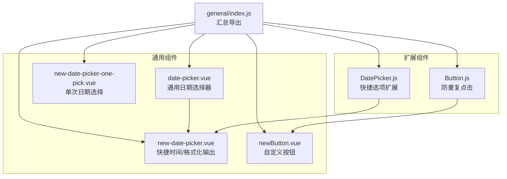
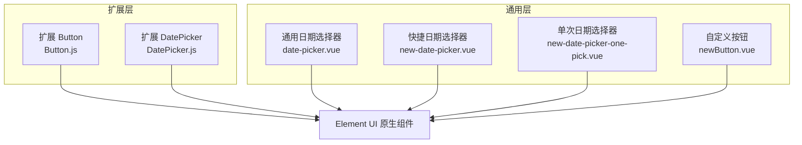
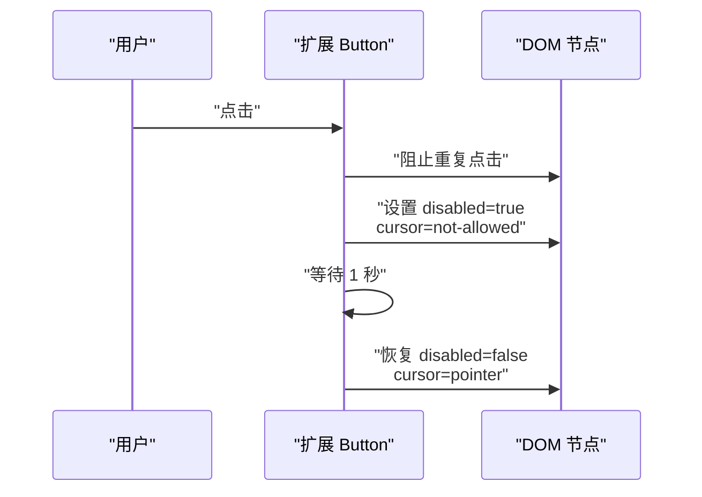
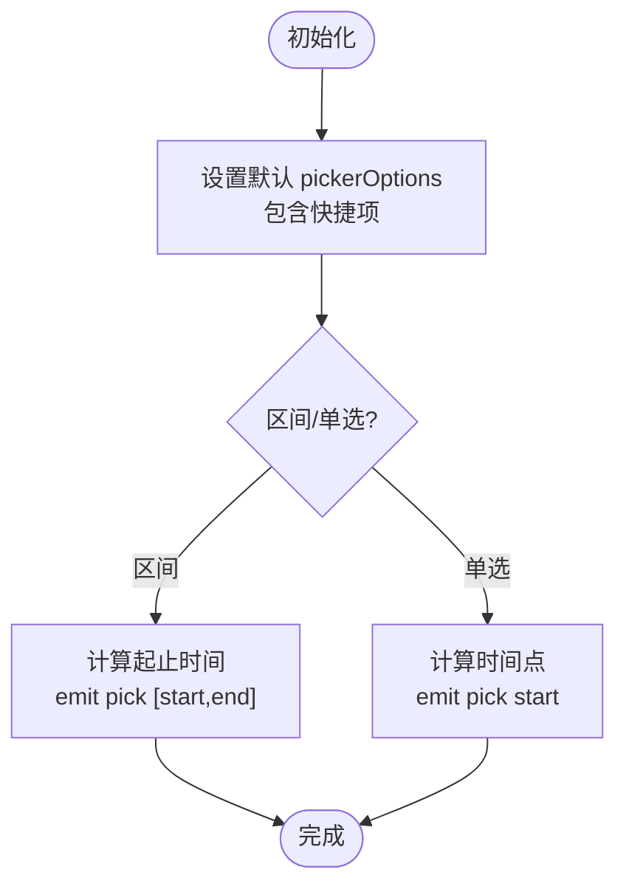
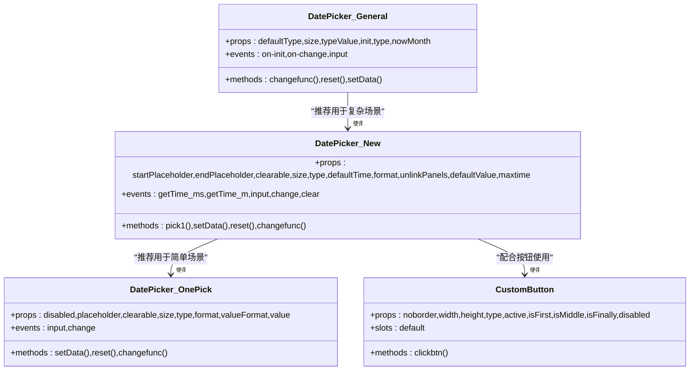
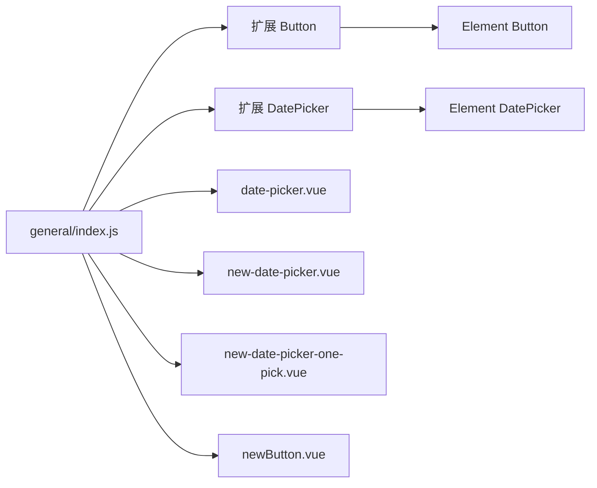

# Element UI扩展组件

<cite>
**本文引用的文件**
- [src/components/leisu/elementUi_extend/Button.js](file://src/components/leisu/elementUi_extend/Button.js)
- [src/components/leisu/elementUi_extend/DatePicker.js](file://src/components/leisu/elementUi_extend/DatePicker.js)
- [src/components/general/date-picker.vue](file://src/components/general/date-picker.vue)
- [src/components/general/new-date-picker.vue](file://src/components/general/new-date-picker.vue)
- [src/components/general/new-date-picker-one-pick.vue](file://src/components/general/new-date-picker-one-pick.vue)
- [src/components/general/newButton.vue](file://src/components/general/newButton.vue)
- [src/components/general/index.js](file://src/components/general/index.js)
- [src/views/expert/components/articleRate.vue](file://src/views/expert/components/articleRate.vue)
- [src/components/newMySearch/index.vue](file://src/components/newMySearch/index.vue)
</cite>

## 目录
1. [简介](#简介)
2. [项目结构](#项目结构)
3. [核心组件](#核心组件)
4. [架构概览](#架构概览)
5. [详细组件分析](#详细组件分析)
6. [依赖关系分析](#依赖关系分析)
7. [性能考量](#性能考量)
8. [故障排查指南](#故障排查指南)
9. [结论](#结论)
10. [附录](#附录)

## 简介
本文件面向 Leisu Admin 项目的 Element UI 扩展组件，系统性解析以下内容：
- Button 扩展：防重复点击能力与交互反馈
- DatePicker 扩展：快捷选项、时区/时间边界、国际化风格适配
- 通用日期选择器系列：统一的快捷时间、格式化输出、联动面板与禁用日期策略
- 组件关系与兼容性：与原生 Element UI 的继承/组合关系、事件与属性透传
- 配置项、使用方法与最佳实践：props、事件、样式与行为约定
- 定制指南：如何新增或修改扩展组件
- 性能、兼容性与维护建议

## 项目结构
Element UI 扩展组件位于 leisu/elementUi_extend 目录，通用日期选择器与自定义按钮位于 general 目录。通过 general/index.js 汇总导出，便于全局按需引入。

图表来源
- [src/components/leisu/elementUi_extend/Button.js:1-27](file://src/components/leisu/elementUi_extend/Button.js#L1-L27)
- [src/components/leisu/elementUi_extend/DatePicker.js:1-55](file://src/components/leisu/elementUi_extend/DatePicker.js#L1-L55)
- [src/components/general/date-picker.vue:1-338](file://src/components/general/date-picker.vue#L1-L338)
- [src/components/general/new-date-picker.vue:1-191](file://src/components/general/new-date-picker.vue#L1-L191)
- [src/components/general/new-date-picker-one-pick.vue:1-153](file://src/components/general/new-date-picker-one-pick.vue#L1-L153)
- [src/components/general/newButton.vue:1-114](file://src/components/general/newButton.vue#L1-L114)
- [src/components/general/index.js:1-41](file://src/components/general/index.js#L1-L41)

章节来源
- [src/components/general/index.js:1-41](file://src/components/general/index.js#L1-L41)

## 核心组件
- 扩展 Button（防重复点击）
  - 在 created 生命周期内监听原生 click 事件，对未禁用的按钮在点击后短暂禁用并改变光标样式，1 秒后恢复
  - 通过 Vue.extend 继承原生 Button，保持完全兼容
- 扩展 DatePicker（快捷选项）
  - 通过 extends 继承原生 DatePicker
  - 默认注入“昨天/今天/明天”快捷选项；支持区间与单选模式
  - 通过 pickerOptions.default 返回默认快捷项，确保与业务常用场景一致
- 通用日期选择器系列
  - date-picker.vue：内置丰富快捷项（近X天、周/月/年等），支持初始化触发与双向绑定
  - new-date-picker.vue：基于工具函数生成快捷项，支持毫秒/秒级输出、禁用未来日期
  - new-date-picker-one-pick.vue：单次日期选择，支持占位符、格式化与禁用态
  - newButton.vue：自定义按钮容器，支持尺寸、边框、激活态与组合按钮样式

章节来源
- [src/components/leisu/elementUi_extend/Button.js:1-27](file://src/components/leisu/elementUi_extend/Button.js#L1-L27)
- [src/components/leisu/elementUi_extend/DatePicker.js:1-55](file://src/components/leisu/elementUi_extend/DatePicker.js#L1-L55)
- [src/components/general/date-picker.vue:1-338](file://src/components/general/date-picker.vue#L1-L338)
- [src/components/general/new-date-picker.vue:1-191](file://src/components/general/new-date-picker.vue#L1-L191)
- [src/components/general/new-date-picker-one-pick.vue:1-153](file://src/components/general/new-date-picker-one-pick.vue#L1-L153)
- [src/components/general/newButton.vue:1-114](file://src/components/general/newButton.vue#L1-L114)

## 架构概览
扩展组件与通用组件共同构成日期与按钮两类增强体验。扩展组件以“包装/继承”的方式复用 Element UI，通用组件以“组合/封装”的方式提供更高层的业务能力。

图表来源
- [src/components/leisu/elementUi_extend/Button.js:1-27](file://src/components/leisu/elementUi_extend/Button.js#L1-L27)
- [src/components/leisu/elementUi_extend/DatePicker.js:1-55](file://src/components/leisu/elementUi_extend/DatePicker.js#L1-L55)
- [src/components/general/date-picker.vue:1-338](file://src/components/general/date-picker.vue#L1-L338)
- [src/components/general/new-date-picker.vue:1-191](file://src/components/general/new-date-picker.vue#L1-L191)
- [src/components/general/new-date-picker-one-pick.vue:1-153](file://src/components/general/new-date-picker-one-pick.vue#L1-L153)
- [src/components/general/newButton.vue:1-114](file://src/components/general/newButton.vue#L1-L114)

## 详细组件分析

### 扩展 Button 分析
- 设计目标
  - 防止重复提交：在一次点击后短时间内禁用按钮，避免重复触发
  - 用户反馈：通过光标变化提示不可点击状态
- 实现要点
  - 生命周期 created 中注册 click 事件监听
  - 点击时立即设置 disabled 并变更光标样式
  - 使用定时器在 1 秒后恢复按钮可用
- 兼容性
  - 通过 Vue.extend 继承原生 Button，保留所有原生属性与事件
  - 对外行为与原生一致，仅增加防抖逻辑

图表来源
- [src/components/leisu/elementUi_extend/Button.js:6-22](file://src/components/leisu/elementUi_extend/Button.js#L6-L22)

章节来源
- [src/components/leisu/elementUi_extend/Button.js:1-27](file://src/components/leisu/elementUi_extend/Button.js#L1-L27)

### 扩展 DatePicker 分析
- 设计目标
  - 提供常用快捷选项（昨天/今天/明天），覆盖常见业务场景
  - 支持区间与单选模式，统一事件与值格式
- 实现要点
  - 通过 extends 继承原生 DatePicker
  - 在 props.pickerOptions.default 中返回默认快捷项数组
  - 区间模式下同时设置起止时间，单选模式仅设置一个时间点
- 兼容性
  - 保持与原生 DatePicker 的 API 一致，透传所有原生属性与事件
  - 默认值与快捷项可被外部覆盖

图表来源
- [src/components/leisu/elementUi_extend/DatePicker.js:3-51](file://src/components/leisu/elementUi_extend/DatePicker.js#L3-L51)

章节来源
- [src/components/leisu/elementUi_extend/DatePicker.js:1-55](file://src/components/leisu/elementUi_extend/DatePicker.js#L1-L55)

### 通用日期选择器系列分析
- date-picker.vue（通用版）
  - 提供丰富的快捷项（前天/昨天/今天/明天、近X天、周/月/年等）
  - 支持初始化时触发 on-init 或 on-change，并向父组件回传输入值
  - 内置滚动条样式优化
- new-date-picker.vue（快捷版）
  - 基于工具函数生成快捷项，支持毫秒/秒级输出
  - 支持禁用未来日期（maxtime 控制）
  - 支持 format、default-time、unlink-panels 等原生属性透传
- new-date-picker-one-pick.vue（单次选择）
  - 提供“前天/昨天/今天/明天”快捷项
  - 支持占位符、格式化与禁用态
- newButton.vue（自定义按钮）
  - 支持宽度/高度、类型、边框、激活态、禁用态
  - 支持组合按钮（首/中/尾）的圆角合并样式

图表来源
- [src/components/general/date-picker.vue:18-325](file://src/components/general/date-picker.vue#L18-L325)
- [src/components/general/new-date-picker.vue:25-173](file://src/components/general/new-date-picker.vue#L25-L173)
- [src/components/general/new-date-picker-one-pick.vue:19-135](file://src/components/general/new-date-picker-one-pick.vue#L19-L135)
- [src/components/general/newButton.vue:8-62](file://src/components/general/newButton.vue#L8-L62)

章节来源
- [src/components/general/date-picker.vue:1-338](file://src/components/general/date-picker.vue#L1-L338)
- [src/components/general/new-date-picker.vue:1-191](file://src/components/general/new-date-picker.vue#L1-L191)
- [src/components/general/new-date-picker-one-pick.vue:1-153](file://src/components/general/new-date-picker-one-pick.vue#L1-L153)
- [src/components/general/newButton.vue:1-114](file://src/components/general/newButton.vue#L1-L114)

## 依赖关系分析
- 扩展组件与原生 Element UI
  - Button.js 通过 Vue.extend 继承原生 Button
  - DatePicker.js 通过 extends 继承原生 DatePicker
  - 两者均保持原生 API 兼容，仅增强交互与默认行为
- 通用组件与工具函数
  - new-date-picker.vue 依赖工具函数生成快捷时间
  - 通用日期组件内部维护快捷项映射与时间计算逻辑
- 导出与使用
  - general/index.js 汇总导出通用组件，便于按需引入
  - 实际业务页面通过 import 引入扩展或通用组件并绑定事件

图表来源
- [src/components/leisu/elementUi_extend/Button.js:23-25](file://src/components/leisu/elementUi_extend/Button.js#L23-L25)
- [src/components/leisu/elementUi_extend/DatePicker.js:4-4](file://src/components/leisu/elementUi_extend/DatePicker.js#L4-L4)
- [src/components/general/index.js:1-41](file://src/components/general/index.js#L1-L41)

章节来源
- [src/components/general/index.js:1-41](file://src/components/general/index.js#L1-L41)

## 性能考量
- 防重复点击
  - Button 扩展在点击后 1 秒内禁用，避免重复提交带来的接口压力
  - 建议在高频操作（批量导出、提交审核）场景启用
- 日期选择器
  - 通用组件内部使用 Map 与常量计算快捷项，避免重复计算
  - new-date-picker.vue 支持禁用未来日期（maxtime），减少无效渲染
- 样式与滚动条
  - 通用组件内置滚动条样式，减少额外资源加载
- 事件与数据流
  - 通过 input/on-change 事件进行双向绑定，避免不必要的深度监听

[本节为通用指导，无需特定文件引用]

## 故障排查指南
- 扩展 Button 无法恢复
  - 检查是否在点击后被外部逻辑再次禁用
  - 确认未覆盖 created 生命周期导致监听失效
- 扩展 DatePicker 快捷项不生效
  - 确认未被外部覆盖 pickerOptions
  - 检查区间/单选模式下的值格式是否正确
- 通用日期选择器值未更新
  - 确认 v-model 与 @change 事件绑定是否正确
  - 检查 type 与 format 是否匹配业务期望
- 页面重置日期失败
  - 使用通用组件提供的 reset 方法重置默认值
  - 示例：在视图中调用 ref 组件的 reset 并重新拉取数据

章节来源
- [src/views/expert/components/articleRate.vue:329-336](file://src/views/expert/components/articleRate.vue#L329-L336)
- [src/components/newMySearch/index.vue:380-395](file://src/components/newMySearch/index.vue#L380-L395)

## 结论
- 扩展 Button 与 DatePicker 以最小侵入的方式增强用户体验，保持与原生 Element UI 的完全兼容
- 通用日期选择器系列覆盖从简单到复杂的多种场景，提供统一的快捷项、格式化输出与禁用策略
- 建议在表单提交、报表筛选等关键路径优先采用扩展组件，提升稳定性与一致性

[本节为总结，无需特定文件引用]

## 附录

### 配置项与使用方法
- 扩展 Button
  - 无新增 props，行为由内部逻辑控制
  - 使用方式：直接替换原生 Button 组件
- 扩展 DatePicker
  - props.pickerOptions.default：默认快捷项（可覆盖）
  - 使用方式：直接替换原生 DatePicker 组件
- 通用日期选择器（new-date-picker.vue）
  - 主要 props：startPlaceholder、endPlaceholder、clearable、size、type、defaultTime、format、unlinkPanels、defaultValue、maxtime
  - 主要事件：getTime_ms（毫秒）、getTime_m（秒）、input、change、clear
  - 方法：setData(arr)、reset()、changefunc(val)
- 通用日期选择器（date-picker.vue）
  - 主要 props：defaultType、size、typeValue、init、type、nowMonth
  - 主要事件：on-init、on-change、input
  - 方法：reset()、setData([start,end])、changefunc(val)
- 通用日期选择器（new-date-picker-one-pick.vue）
  - 主要 props：disabled、placeholder、clearable、size、type、format、valueFormat、value
  - 主要事件：input、change
  - 方法：setData(date)、reset()、changefunc(date)
- 自定义按钮（newButton.vue）
  - 主要 props：noborder、width、height、type、active、isFirst、isMiddle、isFinally、disabled
  - 事件：click
  - 插槽：默认插槽承载按钮内容

章节来源
- [src/components/leisu/elementUi_extend/Button.js:1-27](file://src/components/leisu/elementUi_extend/Button.js#L1-L27)
- [src/components/leisu/elementUi_extend/DatePicker.js:1-55](file://src/components/leisu/elementUi_extend/DatePicker.js#L1-L55)
- [src/components/general/new-date-picker.vue:25-173](file://src/components/general/new-date-picker.vue#L25-L173)
- [src/components/general/date-picker.vue:18-325](file://src/components/general/date-picker.vue#L18-L325)
- [src/components/general/new-date-picker-one-pick.vue:19-135](file://src/components/general/new-date-picker-one-pick.vue#L19-L135)
- [src/components/general/newButton.vue:8-62](file://src/components/general/newButton.vue#L8-L62)

### 最佳实践
- 按钮类
  - 对高风险操作（提交、删除、导出）使用扩展 Button
  - 自定义按钮用于组合按钮组，注意 isFirst/isMiddle/isFinally 的样式拼接
- 日期类
  - 复杂场景使用 date-picker.vue，简单场景使用 new-date-picker.vue
  - 使用 reset 方法统一重置默认值，避免手动计算
  - 通过 format/default-time 控制输出精度，减少前端二次处理

[本节为通用指导，无需特定文件引用]

### 定制指南
- 新增扩展组件
  - 若需增强交互：参考 Button.js，在 created 中注册事件并控制 DOM 状态
  - 若需增强默认行为：参考 DatePicker.js，通过 extends 继承并在 props 中提供默认配置
- 修改现有扩展
  - Button：调整禁用时长与光标样式，确保不影响可访问性
  - DatePicker：扩展 pickerOptions.shortcuts，确保值 emit 格式与业务一致
- 通用组件扩展
  - 在 new-date-picker.vue 基础上新增快捷项时，遵循工具函数生成规则
  - 如需新增单一日期选择器变体，参考 new-date-picker-one-pick.vue 的结构与事件

[本节为通用指导，无需特定文件引用]