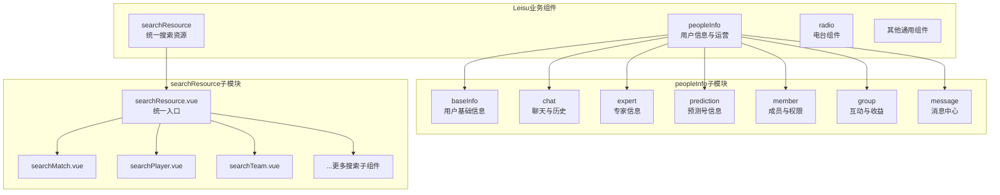
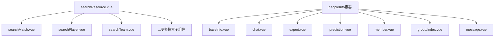
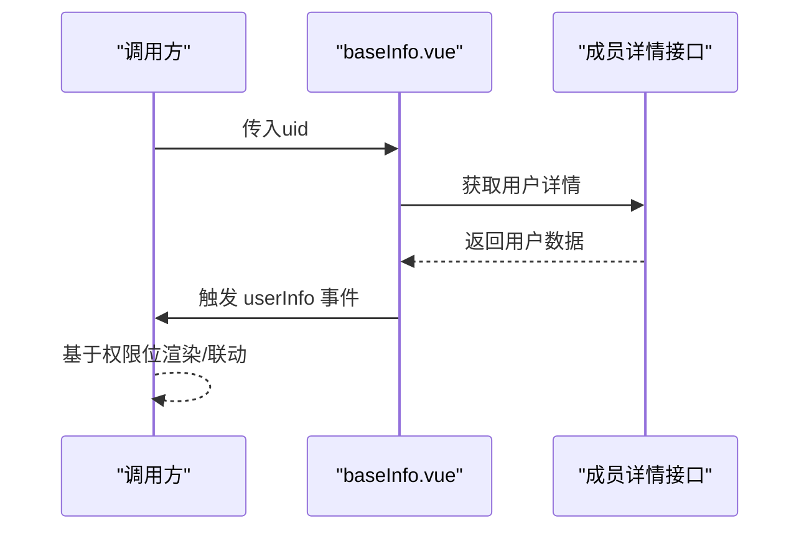
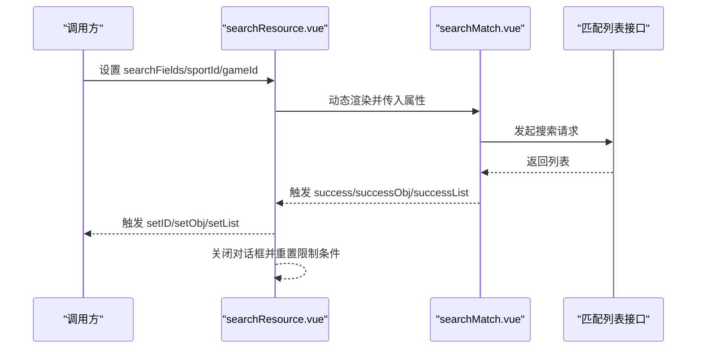
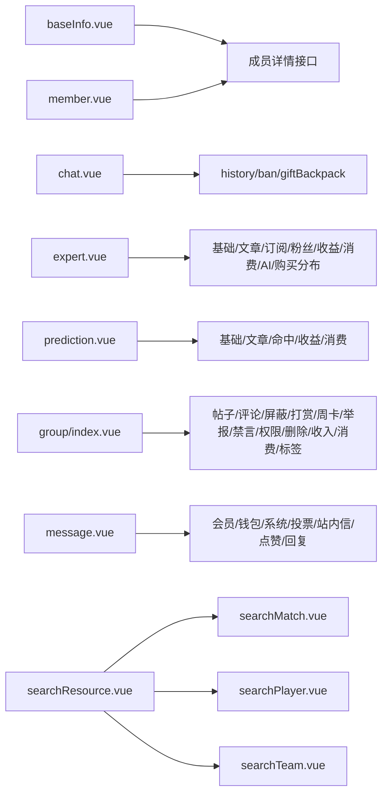

# Leisu业务组件

<cite>
**本文引用的文件**
- [peopleInfo/baseInfo.vue](file://src/components/leisu/peopleInfo/baseInfo.vue)
- [peopleInfo/chat/chat.vue](file://src/components/leisu/peopleInfo/chat/chat.vue)
- [peopleInfo/expert/expert.vue](file://src/components/leisu/peopleInfo/expert/expert.vue)
- [peopleInfo/member/member.vue](file://src/components/leisu/peopleInfo/member/member.vue)
- [peopleInfo/prediction/prediction.vue](file://src/components/leisu/peopleInfo/prediction/prediction.vue)
- [peopleInfo/group/index.vue](file://src/components/leisu/peopleInfo/group/index.vue)
- [peopleInfo/message/message.vue](file://src/components/leisu/peopleInfo/message/message.vue)
- [searchResource/searchResource.vue](file://src/components/leisu/searchResource/searchResource.vue)
- [searchResource/searchDependence/searchMatch.vue](file://src/components/leisu/searchResource/searchDependence/searchMatch.vue)
- [searchResource/searchDependence/searchPlayer.vue](file://src/components/leisu/searchResource/searchDependence/searchPlayer.vue)
- [searchResource/searchDependence/searchTeam.vue](file://src/components/leisu/searchResource/searchDependence/searchTeam.vue)
- [radio/lsAnchor.vue](file://src/components/leisu/radio/lsAnchor.vue)
- [peopleInfo/trail/trail.vue](file://src/components/leisu/peopleInfo/trail/trail.vue)
</cite>

## 目录
1. [引言](#引言)
2. [项目结构](#项目结构)
3. [核心组件](#核心组件)
4. [架构总览](#架构总览)
5. [详细组件分析](#详细组件分析)
6. [依赖分析](#依赖分析)
7. [性能考虑](#性能考虑)
8. [故障排查指南](#故障排查指南)
9. [结论](#结论)
10. [附录](#附录)

## 引言
本文件面向Leisu Admin项目的业务组件体系，聚焦于Leisu业务组件的设计与实现，覆盖用户信息组件、专家组件、预测组件、聊天组件、搜索组件、电台组件、追踪组件等。文档从架构设计、数据流、组件间通信、状态管理、API与事件处理、错误处理等方面进行系统化梳理，并提供可扩展性与最佳实践建议。

## 项目结构
Leisu业务组件主要位于 src/components/leisu 下，按功能域划分为：
- peopleInfo：用户信息与运营相关能力（聊天、专家、预测、成员、消息、群组等）
- searchResource：统一搜索资源入口，内部聚合多种搜索子组件
- radio：电台相关展示组件
- 其他通用业务组件：如匹配信息、状态展示等

图表来源
- [peopleInfo/baseInfo.vue:1-199](file://src/components/leisu/peopleInfo/baseInfo.vue#L1-L199)
- [peopleInfo/chat/chat.vue:1-75](file://src/components/leisu/peopleInfo/chat/chat.vue#L1-L75)
- [peopleInfo/expert/expert.vue:1-150](file://src/components/leisu/peopleInfo/expert/expert.vue#L1-L150)
- [peopleInfo/prediction/prediction.vue:1-139](file://src/components/leisu/peopleInfo/prediction/prediction.vue#L1-L139)
- [peopleInfo/member/member.vue:1-1297](file://src/components/leisu/peopleInfo/member/member.vue#L1-L1297)
- [peopleInfo/group/index.vue:1-140](file://src/components/leisu/peopleInfo/group/index.vue#L1-L140)
- [peopleInfo/message/message.vue:1-82](file://src/components/leisu/peopleInfo/message/message.vue#L1-L82)
- [searchResource/searchResource.vue:1-497](file://src/components/leisu/searchResource/searchResource.vue#L1-L497)
- [searchResource/searchDependence/searchMatch.vue:1-532](file://src/components/leisu/searchResource/searchDependence/searchMatch.vue#L1-L532)
- [searchResource/searchDependence/searchPlayer.vue:1-315](file://src/components/leisu/searchResource/searchDependence/searchPlayer.vue#L1-L315)
- [searchResource/searchDependence/searchTeam.vue:1-574](file://src/components/leisu/searchResource/searchDependence/searchTeam.vue#L1-L574)
- [radio/lsAnchor.vue:1-39](file://src/components/leisu/radio/lsAnchor.vue#L1-L39)

章节来源
- [searchResource/searchResource.vue:1-497](file://src/components/leisu/searchResource/searchResource.vue#L1-L497)

## 核心组件
- peopleInfo/baseInfo.vue：用户基础信息展示与权限校验，支持头像、等级、徽章、VIP标识、角色标签等渲染，并对外发射用户信息事件。
- peopleInfo/chat/chat.vue：聊天与历史、禁言记录、礼物背包等子功能的容器，基于标签页切换与子组件初始化。
- peopleInfo/expert/expert.vue：专家侧信息与运营能力聚合，含基础信息、文章、订阅、粉丝、收益、消费、AI销售、购买分布等。
- peopleInfo/prediction/prediction.vue：预测号侧信息与运营能力聚合，含基础信息、单关/串关/足彩文章、命中率、申请、变更、操作日志、收益、消费等。
- peopleInfo/member/member.vue：成员详情与权限控制，含基础资料、实名、封禁、关注/粉丝、备注、登录/注册日志、审核、荣誉、申诉、反馈、分组变更等。
- peopleInfo/group/index.vue：用户在社区内的互动与收益聚合，含帖子/评论/屏蔽、打赏/被赏、铁粉、周卡、举报、禁言、权限日志、删除历史、收入/消费、兴趣标签等。
- peopleInfo/message/message.vue：消息中心聚合，含会员/钱包/系统/投票消息、站内信、点赞与回复等。
- searchResource/searchResource.vue：统一搜索资源入口，按资源类型动态加载对应搜索子组件，支持成功回调事件（ID/对象/列表）。
- searchResource/searchDependence/searchMatch.vue：比赛搜索，支持多运动类型、状态筛选、时间范围、关键字搜索、批量选择等。
- searchResource/searchDependence/searchPlayer.vue：球员搜索，支持精确/模糊、多运动类型、批量选择等。
- searchResource/searchDependence/searchTeam.vue：队伍搜索，支持多运动类型、国家/联赛/教练等维度展示与筛选。
- radio/lsAnchor.vue：电台主播展示组件，结合头像与用户信息提示。
- peopleInfo/trail/trail.vue：追踪组件（文件存在，具体实现以源码为准）。

章节来源
- [peopleInfo/baseInfo.vue:161-199](file://src/components/leisu/peopleInfo/baseInfo.vue#L161-L199)
- [peopleInfo/chat/chat.vue:36-75](file://src/components/leisu/peopleInfo/chat/chat.vue#L36-L75)
- [peopleInfo/expert/expert.vue:97-150](file://src/components/leisu/peopleInfo/expert/expert.vue#L97-L150)
- [peopleInfo/prediction/prediction.vue:87-139](file://src/components/leisu/peopleInfo/prediction/prediction.vue#L87-L139)
- [peopleInfo/member/member.vue:765-1297](file://src/components/leisu/peopleInfo/member/member.vue#L765-L1297)
- [peopleInfo/group/index.vue:59-140](file://src/components/leisu/peopleInfo/group/index.vue#L59-L140)
- [peopleInfo/message/message.vue:47-82](file://src/components/leisu/peopleInfo/message/message.vue#L47-L82)
- [searchResource/searchResource.vue:260-497](file://src/components/leisu/searchResource/searchResource.vue#L260-L497)
- [searchResource/searchDependence/searchMatch.vue:161-532](file://src/components/leisu/searchResource/searchDependence/searchMatch.vue#L161-L532)
- [searchResource/searchDependence/searchPlayer.vue:194-315](file://src/components/leisu/searchResource/searchDependence/searchPlayer.vue#L194-L315)
- [searchResource/searchDependence/searchTeam.vue:291-574](file://src/components/leisu/searchResource/searchDependence/searchTeam.vue#L291-L574)
- [radio/lsAnchor.vue:19-39](file://src/components/leisu/radio/lsAnchor.vue#L19-L39)

## 架构总览
Leisu业务组件采用“容器+子组件”的分层模式：
- 容器组件负责权限校验、布局、标签页切换、高度适配、子组件初始化与事件转发。
- 子组件负责具体业务逻辑与数据交互，通过事件向上抛出结果（ID/对象/列表），由容器统一处理。
- 统一搜索资源通过动态组件按资源类型渲染，减少耦合，提升可维护性。

图表来源
- [searchResource/searchResource.vue:260-409](file://src/components/leisu/searchResource/searchResource.vue#L260-L409)
- [peopleInfo/chat/chat.vue:36-75](file://src/components/leisu/peopleInfo/chat/chat.vue#L36-L75)
- [peopleInfo/expert/expert.vue:97-150](file://src/components/leisu/peopleInfo/expert/expert.vue#L97-L150)
- [peopleInfo/prediction/prediction.vue:87-139](file://src/components/leisu/peopleInfo/prediction/prediction.vue#L87-L139)
- [peopleInfo/member/member.vue:765-1297](file://src/components/leisu/peopleInfo/member/member.vue#L765-L1297)
- [peopleInfo/group/index.vue:59-140](file://src/components/leisu/peopleInfo/group/index.vue#L59-L140)
- [peopleInfo/message/message.vue:47-82](file://src/components/leisu/peopleInfo/message/message.vue#L47-L82)

## 详细组件分析

### peopleInfo 用户信息组件体系
- 权限与渲染
  - baseInfo.vue：根据权限位渲染用户头像、UID、昵称、VIP/广告VIP标识、角色标签、粉丝/关注数、等级与徽章、单价等；对外发射 userInfo 事件。
  - member.vue：在权限允许下渲染完整成员详情，含基础资料、实名、封禁、关注/粉丝、备注、登录/注册日志、审核、荣誉、申诉、反馈、分组变更等；提供批量操作与弹窗组件。
  - group/index.vue：围绕用户在社区内的互动与收益聚合，含帖子/评论/屏蔽、打赏/被赏、铁粉、周卡、举报、禁言、权限日志、删除历史、收入/消费、兴趣标签等。
  - message/message.vue：消息中心聚合，按消息类型分页签展示。
  - chat/chat.vue：聊天与历史、禁言记录、礼物背包等子功能容器，支持标签页切换与子组件初始化。
  - expert/prediction：专家与预测号侧信息与运营能力聚合，均以标签页组织，按权限位显示不同面板。

- 数据流与事件
  - baseInfo.vue 在获取用户详情后，通过事件向外广播用户信息，供上层容器组件做权限判断与页面联动。
  - chat.vue 通过 init 方法向子组件传递初始化参数，实现子组件生命周期内的数据准备。
  - expert/prediction/group/message 等容器组件根据权限位决定显示内容与交互能力。

- 状态管理与高度适配
  - 多个容器组件引入高度混入，动态计算内容区域高度，保证复杂表单与表格的可视体验。

图表来源
- [peopleInfo/baseInfo.vue:181-196](file://src/components/leisu/peopleInfo/baseInfo.vue#L181-L196)

章节来源
- [peopleInfo/baseInfo.vue:161-199](file://src/components/leisu/peopleInfo/baseInfo.vue#L161-L199)
- [peopleInfo/chat/chat.vue:36-75](file://src/components/leisu/peopleInfo/chat/chat.vue#L36-L75)
- [peopleInfo/expert/expert.vue:97-150](file://src/components/leisu/peopleInfo/expert/expert.vue#L97-L150)
- [peopleInfo/prediction/prediction.vue:87-139](file://src/components/leisu/peopleInfo/prediction/prediction.vue#L87-L139)
- [peopleInfo/member/member.vue:765-1297](file://src/components/leisu/peopleInfo/member/member.vue#L765-L1297)
- [peopleInfo/group/index.vue:59-140](file://src/components/leisu/peopleInfo/group/index.vue#L59-L140)
- [peopleInfo/message/message.vue:47-82](file://src/components/leisu/peopleInfo/message/message.vue#L47-L82)

### searchResource 搜索组件体系
- 统一入口与动态渲染
  - searchResource.vue：根据 searchFields 动态渲染对应搜索子组件，支持 match、player、team、competition、user、intelligence、vote 等资源类型；提供成功回调事件（success、successObj、successList），并自动关闭对话框。
  - 支持 sportId、gameId、catalogId 等限制条件，且在对话框关闭时重置，避免污染后续搜索。

- 搜索子组件示例
  - searchMatch.vue：支持多运动类型、状态筛选、时间范围、关键字搜索、批量选择；按 sportId 分支调用不同接口；支持“批量设置”与“单条设置”两种返回方式。
  - searchPlayer.vue：支持精确/模糊搜索、多运动类型、批量选择；按 sport_id 分支调用不同接口。
  - searchTeam.vue：支持多运动类型、国家/联赛/教练等维度展示与筛选；支持批量选择与“合并ID”。

图表来源
- [searchResource/searchResource.vue:433-496](file://src/components/leisu/searchResource/searchResource.vue#L433-L496)
- [searchResource/searchDependence/searchMatch.vue:432-529](file://src/components/leisu/searchResource/searchDependence/searchMatch.vue#L432-L529)

章节来源
- [searchResource/searchResource.vue:260-497](file://src/components/leisu/searchResource/searchResource.vue#L260-L497)
- [searchResource/searchDependence/searchMatch.vue:161-532](file://src/components/leisu/searchResource/searchDependence/searchMatch.vue#L161-L532)
- [searchResource/searchDependence/searchPlayer.vue:194-315](file://src/components/leisu/searchResource/searchDependence/searchPlayer.vue#L194-L315)
- [searchResource/searchDependence/searchTeam.vue:291-574](file://src/components/leisu/searchResource/searchDependence/searchTeam.vue#L291-L574)

### radio 电台组件
- lsAnchor.vue：展示电台主播头像与名称，结合权限位控制显示，提供基础交互封装。

章节来源
- [radio/lsAnchor.vue:19-39](file://src/components/leisu/radio/lsAnchor.vue#L19-L39)

### trail 追踪组件
- trail.vue：追踪组件（文件存在，具体实现以源码为准）。通常用于记录与回放用户行为轨迹，便于审计与复盘。

章节来源
- [peopleInfo/trail/trail.vue](file://src/components/leisu/peopleInfo/trail/trail.vue)

## 依赖分析
- 组件内聚与耦合
  - peopleInfo 容器组件与子组件通过 props 与事件解耦，容器负责权限与布局，子组件负责具体业务，降低耦合度。
  - searchResource 将搜索逻辑集中于入口组件，通过动态组件按资源类型渲染，避免重复代码与分散逻辑。
- 外部依赖
  - API 层：各搜索子组件依赖 match、member 等 API 接口；容器组件依赖成员详情接口。
  - 工具与字典：使用格式化、时间转换、运动类型映射等工具函数与字典配置。
- 可能的循环依赖
  - 当前结构以容器组件为主导，子组件较少相互引用，未见明显循环依赖迹象。

图表来源
- [peopleInfo/baseInfo.vue:161-199](file://src/components/leisu/peopleInfo/baseInfo.vue#L161-L199)
- [peopleInfo/chat/chat.vue:36-75](file://src/components/leisu/peopleInfo/chat/chat.vue#L36-L75)
- [peopleInfo/expert/expert.vue:97-150](file://src/components/leisu/peopleInfo/expert/expert.vue#L97-L150)
- [peopleInfo/prediction/prediction.vue:87-139](file://src/components/leisu/peopleInfo/prediction/prediction.vue#L87-L139)
- [peopleInfo/member/member.vue:765-1297](file://src/components/leisu/peopleInfo/member/member.vue#L765-L1297)
- [peopleInfo/group/index.vue:59-140](file://src/components/leisu/peopleInfo/group/index.vue#L59-L140)
- [peopleInfo/message/message.vue:47-82](file://src/components/leisu/peopleInfo/message/message.vue#L47-L82)
- [searchResource/searchResource.vue:260-409](file://src/components/leisu/searchResource/searchResource.vue#L260-L409)

## 性能考虑
- 列表分页与懒加载：搜索子组件普遍采用分页组件，建议在大数据量场景下启用服务端分页与防抖搜索，减少不必要的请求。
- 表格渲染优化：容器组件使用高度混入与固定高度，避免频繁重排；搜索子组件在表格中仅渲染必要列，减少 DOM 节点数量。
- 动态组件按需渲染：searchResource.vue 仅在打开对话框时渲染对应搜索子组件，降低初始开销。
- 事件与状态最小化：容器组件通过事件向上抛出结果，避免在多个子组件之间共享复杂状态。

## 故障排查指南
- 权限不足导致内容为空
  - 现象：容器组件未渲染或仅显示“无权限”提示。
  - 排查：确认权限位是否正确传入；检查 hasPwer 调用与权限字典配置。
- 搜索无结果或条件无效
  - 现象：搜索无数据或提示“请填写搜索条件”。
  - 排查：核对 searchFields 与 sportId/gameId 是否匹配；检查时间范围、关键字是否合法；确认外部传入的限制条件是否被重置。
- 对话框关闭后污染后续搜索
  - 现象：再次打开搜索对话框时出现上次搜索条件残留。
  - 排查：searchResource.vue 在对话框关闭时会重置限制条件，确认未手动覆盖该逻辑。
- 子组件初始化失败
  - 现象：chat.vue 等容器组件无法正确初始化子组件。
  - 排查：确认 init 方法调用时机与子组件 ref 是否正确；确保传入的 options 参数有效。

章节来源
- [searchResource/searchResource.vue:484-496](file://src/components/leisu/searchResource/searchResource.vue#L484-L496)
- [peopleInfo/chat/chat.vue:62-72](file://src/components/leisu/peopleInfo/chat/chat.vue#L62-L72)

## 结论
Leisu业务组件通过清晰的分层与职责划分，实现了用户信息、聊天、专家、预测、成员、消息、搜索、电台与追踪等核心能力的模块化与可扩展化。容器组件承担权限与布局，子组件专注业务细节，统一搜索入口以动态组件实现高内聚低耦合。配合完善的事件与状态管理策略，整体具备良好的可维护性与扩展性。

## 附录
- 组件配置与扩展建议
  - 容器组件：建议统一引入高度混入与权限校验，确保一致的交互体验与安全边界。
  - 搜索组件：建议在外部传参时明确限制条件，避免跨次调用污染；对高频搜索增加防抖与缓存策略。
  - 事件规范：统一使用 success/successObj/successList 三类事件，便于上层统一处理。
  - 错误处理：在 API 请求失败时统一提示与重试策略，避免静默失败。