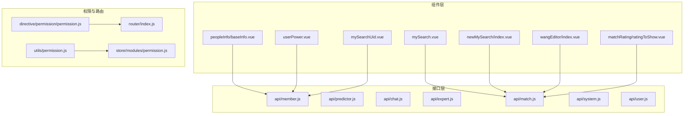
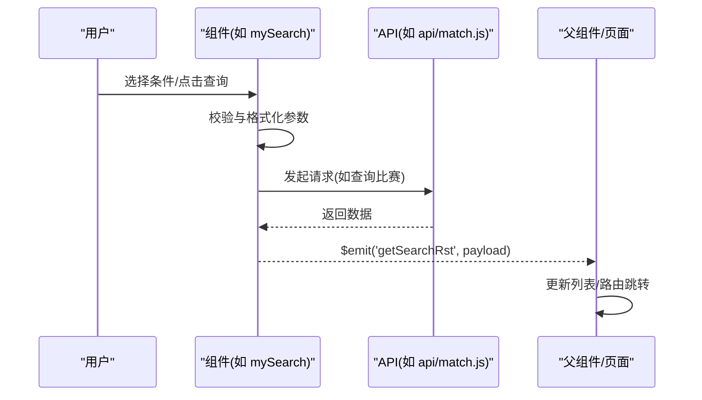
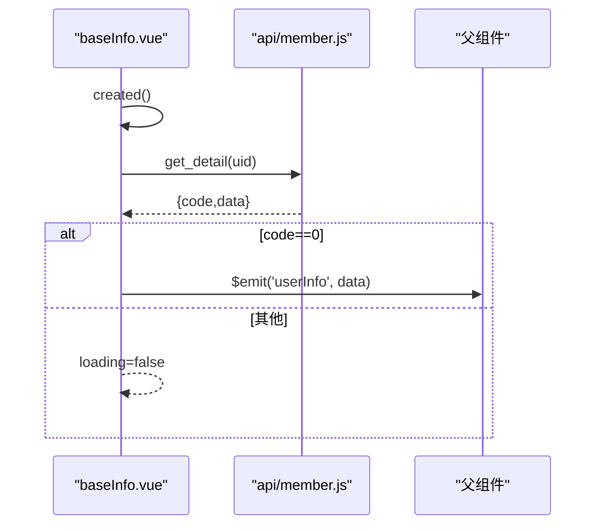
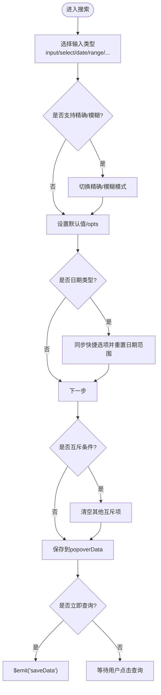
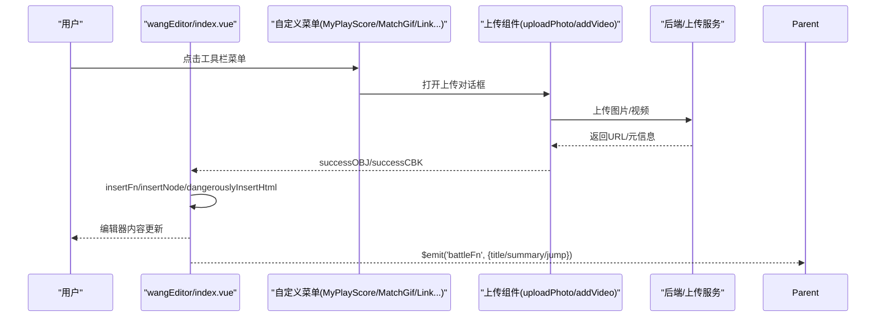
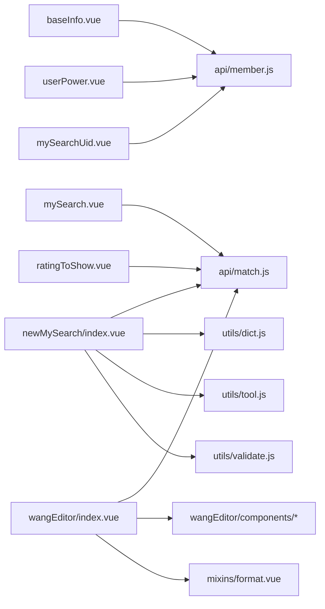

# 业务组件

<cite>
**本文引用的文件**
- [src/components/leisu/peopleInfo/baseInfo.vue](file://src/components/leisu/peopleInfo/baseInfo.vue)
- [src/components/leisu/userPower.vue](file://src/components/leisu/userPower.vue)
- [src/components/leisu/mySearch.vue](file://src/components/leisu/mySearch.vue)
- [src/components/leisu/mySearchUid.vue](file://src/components/leisu/mySearchUid.vue)
- [src/components/newMySearch/index.vue](file://src/components/newMySearch/index.vue)
- [src/components/matchRating/ratingToShow.vue](file://src/components/matchRating/ratingToShow.vue)
- [src/components/wangEditor/index.vue](file://src/components/wangEditor/index.vue)
- [src/components/wangEditor/components/templateString.js](file://src/components/wangEditor/components/templateString.js)
- [src/components/wangEditor/components/battleReportTemplate.vue](file://src/components/wangEditor/components/battleReportTemplate.vue)
- [src/components/wangEditor/components/firstReportTemplate.vue](file://src/components/wangEditor/components/firstReportTemplate.vue)
- [src/components/wangEditor/components/matchEventImg.vue](file://src/components/wangEditor/components/matchEventImg.vue)
- [src/components/wangEditor/components/scoreImgTc.vue](file://src/components/wangEditor/components/scoreImgTc.vue)
- [src/components/wangEditor/components/matchGifTc.vue](file://src/components/wangEditor/components/matchGifTc.vue)
- [src/components/wangEditor/components/addVideo.vue](file://src/components/wangEditor/components/addVideo.vue)
- [src/components/wangEditor/components/addJumpLink.vue](file://src/components/wangEditor/components/addJumpLink.vue)
- [src/components/wangEditor/components/scoreCanvas.vue](file://src/components/wangEditor/components/scoreCanvas.vue)
- [src/directive/permission/permission.js](file://src/directive/permission/permission.js)
- [src/utils/permission.js](file://src/utils/permission.js)
- [src/router/index.js](file://src/router/index.js)
- [src/store/modules/permission.js](file://src/store/modules/permission.js)
- [src/api/member.js](file://src/api/member.js)
- [src/api/predictor.js](file://src/api/predictor.js)
- [src/api/chat.js](file://src/api/chat.js)
- [src/api/expert.js](file://src/api/expert.js)
- [src/api/match.js](file://src/api/match.js)
- [src/api/system.js](file://src/api/system.js)
- [src/api/user.js](file://src/api/user.js)
- [src/views/intelligence/components/searchData/searchMatchJump.vue](file://src/views/intelligence/components/searchData/searchMatchJump.vue)
- [src/components/leisu/playVideo.vue](file://src/components/leisu/playVideo.vue)
- [src/components/leisu/tableStatus.vue](file://src/components/leisu/tableStatus.vue)
- [src/mixins/format.vue](file://src/mixins/format.vue)
- [src/utils/dict.js](file://src/utils/dict.js)
- [src/utils/tool.js](file://src/utils/tool.js)
- [src/utils/validate.js](file://src/utils/validate.js)
- [src/components/leisu/ExpertScore.vue](file://src/components/leisu/ExpertScore.vue)
- [src/components/leisu/ExpertScoreTc.vue](file://src/components/leisu/ExpertScoreTc.vue)
- [src/components/leisu/matchInfo.vue](file://src/components/leisu/matchInfo.vue)
- [src/components/leisu/comment_detail.vue](file://src/components/leisu/comment_detail.vue)
- [src/components/leisu/createAiComment.vue](file://src/components/leisu/createAiComment.vue)
- [src/components/leisu/addComment.vue](file://src/components/leisu/addComment.vue)
- [src/components/leisu/pub_drewRst.vue](file://src/components/leisu/pub_drewRst.vue)
- [src/components/leisu/sliderSide.vue](file://src/components/leisu/sliderSide.vue)
- [src/components/leisu/tableStatus.vue](file://src/components/leisu/tableStatus.vue)
- [src/components/leisu/mactchStatus.vue](file://src/components/leisu/mactchStatus.vue)
- [src/components/leisu/mystatus.vue](file://src/components/leisu/mystatus.vue)
- [src/components/leisu/level.vue](file://src/components/leisu/level.vue)
- [src/components/leisu/lslevel.vue](file://src/components/leisu/lslevel.vue)
- [src/components/leisu/choiceColor.vue](file://src/components/leisu/choiceColor.vue)
- [src/components/leisu/randomUser.vue](file://src/components/leisu/randomUser.vue)
- [src/components/leisu/refund.vue](file://src/components/leisu/refund.vue)
- [src/components/leisu/reportBarChart.vue](file://src/components/leisu/reportBarChart.vue)
- [src/components/leisu/reportLineChart.vue](file://src/components/leisu/reportLineChart.vue)
- [src/components/leisu/videoHtml.vue](file://src/components/leisu/videoHtml.vue)
- [src/components/leisu/videoObj.vue](file://src/components/leisu/videoObj.vue)
- [src/components/leisu/myCropper/vue-cropper.vue](file://src/components/myCropper/vue-cropper.vue)
- [src/components/leisu/uploadPhoto/components/MyImgCut.vue](file://src/components/leisu/uploadPhoto/components/MyImgCut.vue)
- [src/components/leisu/uploadPhoto/components/corpper.vue](file://src/components/leisu/uploadPhoto/components/corpper.vue)
- [src/components/leisu/uploadPhoto/components/createdCovernew.js](file://src/components/leisu/uploadPhoto/components/createdCovernew.js)
- [src/components/leisu/general/date-picker.vue](file://src/components/leisu/general/date-picker.vue)
- [src/components/leisu/general/date-quick-selector.vue](file://src/components/leisu/general/date-quick-selector.vue)
- [src/components/leisu/general/new-date-picker.vue](file://src/components/leisu/general/new-date-picker.vue)
- [src/components/leisu/general/new-date-picker-one-pick.vue](file://src/components/leisu/general/new-date-picker-one-pick.vue)
- [src/components/leisu/general/chart.vue](file://src/components/leisu/general/chart.vue)
- [src/components/leisu/general/line-chart.vue](file://src/components/leisu/general/line-chart.vue)
- [src/components/leisu/general/fans-trend.vue](file://src/components/leisu/general/fans-trend.vue)
- [src/components/leisu/general/query-uid.vue](file://src/components/leisu/general/query-uid.vue)
- [src/components/leisu/general/richEditor.vue](file://src/components/leisu/general/richEditor.vue)
- [src/components/leisu/general/status-seal.vue](file://src/components/leisu/general/status-seal.vue)
- [src/components/leisu/general/type-icon.js](file://src/components/leisu/general/type-icon.js)
- [src/components/leisu/general/unsuccessful-ones.vue](file://src/components/leisu/general/unsuccessful-ones.vue)
- [src/components/leisu/general/unsuccessfulReasonContent.vue](file://src/components/leisu/general/unsuccessfulReasonContent.vue)
- [src/components/leisu/general/avatar-list.vue](file://src/components/leisu/general/avatar-list.vue)
- [src/components/leisu/general/emoticon-popover.vue](file://src/components/leisu/general/emoticon-popover.vue)
- [src/components/leisu/general/memberTagSelect.vue](file://src/components/leisu/general/memberTagSelect.vue)
- [src/components/leisu/general/page.vue](file://src/components/leisu/general/page.vue)
- [src/components/leisu/general/platform-icon.vue](file://src/components/leisu/general/platform-icon.vue)
- [src/components/leisu/general/needReason.vue](file://src/components/leisu/general/needReason.vue)
- [src/components/leisu/general/index.js](file://src/components/leisu/general/index.js)
- [src/components/leisu/general/query_match_info.js](file://src/components/leisu/general/query_match_info.js)
- [src/components/leisu/general/index.js](file://src/components/leisu/general/index.js)
- [src/components/leisu/general/index.js](file://src/components/leisu/general/index.js)
</cite>

## 目录
1. [简介](#简介)
2. [项目结构](#项目结构)
3. [核心组件](#核心组件)
4. [架构总览](#架构总览)
5. [组件详解](#组件详解)
6. [依赖关系分析](#依赖关系分析)
7. [性能考量](#性能考量)
8. [故障排查指南](#故障排查指南)
9. [结论](#结论)
10. [附录](#附录)

## 简介
本文件系统化梳理 Leisu Admin 业务组件体系，围绕用户信息、专家、预测、聊天、富文本编辑器、比赛评分、搜索、权限控制等模块，给出架构设计、数据流、状态管理、事件处理、配置项与扩展点，帮助开发者快速理解与复用。

## 项目结构
- 业务组件主要集中在 src/components 下，按功能域划分：
  - leisu 业务域组件：用户信息、权限展示、搜索、富文本、评分、图表等
  - wangEditor 富文本组件：基于 wangeditor 的二次封装
  - newMySearch 智能搜索组件：统一的多条件筛选与历史/收藏管理
  - matchRating 比赛评分组件：评分录入、历史与展示
  - directive/permission 权限指令：按钮/菜单级权限控制
  - store/modules/permission 权限状态：路由与菜单动态生成
  - api/* 接口层：与后端交互的模块化 API
  - views/* 页面：业务页面与组件组合使用

**图表来源**
- [src/components/leisu/peopleInfo/baseInfo.vue:161-198](file://src/components/leisu/peopleInfo/baseInfo.vue#L161-L198)
- [src/components/leisu/userPower.vue:51-61](file://src/components/leisu/userPower.vue#L51-L61)
- [src/components/leisu/mySearch.vue:161-410](file://src/components/leisu/mySearch.vue#L161-L410)
- [src/components/leisu/mySearchUid.vue:135-230](file://src/components/leisu/mySearchUid.vue#L135-L230)
- [src/components/newMySearch/index.vue:322-800](file://src/components/newMySearch/index.vue#L322-L800)
- [src/components/wangEditor/index.vue:76-1336](file://src/components/wangEditor/index.vue#L76-L1336)
- [src/components/matchRating/ratingToShow.vue:46-67](file://src/components/matchRating/ratingToShow.vue#L46-L67)
- [src/directive/permission/permission.js](file://src/directive/permission/permission.js)
- [src/utils/permission.js](file://src/utils/permission.js)
- [src/store/modules/permission.js](file://src/store/modules/permission.js)
- [src/router/index.js](file://src/router/index.js)

**章节来源**
- [src/components/leisu/peopleInfo/baseInfo.vue:161-198](file://src/components/leisu/peopleInfo/baseInfo.vue#L161-L198)
- [src/components/leisu/userPower.vue:51-61](file://src/components/leisu/userPower.vue#L51-L61)
- [src/components/leisu/mySearch.vue:161-410](file://src/components/leisu/mySearch.vue#L161-L410)
- [src/components/leisu/mySearchUid.vue:135-230](file://src/components/leisu/mySearchUid.vue#L135-L230)
- [src/components/newMySearch/index.vue:322-800](file://src/components/newMySearch/index.vue#L322-L800)
- [src/components/wangEditor/index.vue:76-1336](file://src/components/wangEditor/index.vue#L76-L1336)
- [src/components/matchRating/ratingToShow.vue:46-67](file://src/components/matchRating/ratingToShow.vue#L46-L67)
- [src/directive/permission/permission.js](file://src/directive/permission/permission.js)
- [src/utils/permission.js](file://src/utils/permission.js)
- [src/store/modules/permission.js](file://src/store/modules/permission.js)
- [src/router/index.js](file://src/router/index.js)

## 核心组件
- 用户信息组件：封装用户头像、等级、徽章、状态标签等，支持权限校验与详情加载
- 权限控制组件：以图标/标签形式展示用户拥有的权限位，便于在列表中直观呈现
- 搜索组件：提供传统多条件搜索与新一代“弹出式+历史/收藏”的智能搜索体验
- 富文本编辑器：基于 wangeditor 的深度定制，支持上传、模板、跳转、评分图、事件图等
- 比赛评分组件：评分录入、展示、编辑与删除，支持多运动类型与跳转
- 权限控制：指令级按钮/菜单权限与路由/菜单状态管理

**章节来源**
- [src/components/leisu/peopleInfo/baseInfo.vue:91-159](file://src/components/leisu/peopleInfo/baseInfo.vue#L91-L159)
- [src/components/leisu/userPower.vue:18-49](file://src/components/leisu/userPower.vue#L18-L49)
- [src/components/leisu/mySearch.vue:100-158](file://src/components/leisu/mySearch.vue#L100-L158)
- [src/components/leisu/mySearchUid.vue:99-133](file://src/components/leisu/mySearchUid.vue#L99-L133)
- [src/components/newMySearch/index.vue:140-308](file://src/components/newMySearch/index.vue#L140-L308)
- [src/components/wangEditor/index.vue:1-120](file://src/components/wangEditor/index.vue#L1-L120)
- [src/components/matchRating/ratingToShow.vue:22-44](file://src/components/matchRating/ratingToShow.vue#L22-L44)

## 架构总览
- 数据流：组件通过 props 接收配置，内部状态由 data/computed/watch 管理，通过事件向父组件回传查询条件或操作结果；富文本编辑器通过 v-model 与事件双向通信
- 状态管理：权限状态由 store/modules/permission 管理，结合路由与菜单动态生成；搜索组件通过本地存储维护历史/收藏
- 事件处理：组件通过 $emit 触发事件，父组件监听并发起 API 请求或路由跳转
- 权限控制：指令(permission)与工具(permission.js)配合，结合后端返回的权限集合进行按钮/菜单显隐

**图表来源**
- [src/components/leisu/mySearch.vue:311-341](file://src/components/leisu/mySearch.vue#L311-L341)
- [src/api/match.js](file://src/api/match.js)
- [src/components/newMySearch/index.vue:461-618](file://src/components/newMySearch/index.vue#L461-L618)

**章节来源**
- [src/components/leisu/mySearch.vue:311-341](file://src/components/leisu/mySearch.vue#L311-L341)
- [src/components/newMySearch/index.vue:461-618](file://src/components/newMySearch/index.vue#L461-L618)

## 组件详解

### 用户信息组件（peopleInfo/baseInfo）
- 功能要点
  - 加载用户基础信息，展示头像、UID、昵称、VIP/年卡/广告 VIP 标识、用户组徽章、粉丝/关注数、头像挂件、单价等
  - 权限校验：仅当具备 member_list 权限时才渲染详情区域
  - 与 tableStatus 组件联动展示状态标签
- 数据流
  - created 生命周期内调用 get_detail(uid) 获取详情
  - 成功后通过 userInfo 事件向上抛出数据
- 性能与健壮性
  - loading 状态避免闪烁
  - 错误捕获防止异常冒泡

**图表来源**
- [src/components/leisu/peopleInfo/baseInfo.vue:178-195](file://src/components/leisu/peopleInfo/baseInfo.vue#L178-L195)
- [src/api/member.js](file://src/api/member.js)

**章节来源**
- [src/components/leisu/peopleInfo/baseInfo.vue:91-159](file://src/components/leisu/peopleInfo/baseInfo.vue#L91-L159)
- [src/components/leisu/tableStatus.vue](file://src/components/leisu/tableStatus.vue)

### 权限控制组件（userPower）
- 功能要点
  - 以图标/标签展示用户权限位：永久封禁、封号、雷速号、预测号、打赏、直播、付费、铁粉等
  - 点击用户名触发 newclick 事件供父组件处理
- 设计特点
  - 通过 v-if/v-else-if 展示不同徽章，tooltip 提示含义
  - 结合等级组件 lslevel 展示用户等级

**章节来源**
- [src/components/leisu/userPower.vue:18-49](file://src/components/leisu/userPower.vue#L18-L49)

### 搜索组件（mySearch / mySearchUid / newMySearch）
- mySearch（传统多条件）
  - 支持 input/select/cascader/date/slider/radio 等多种输入类型
  - 支持空值搜索（allowEmpty），日期/区间值拼接为分隔符字符串
  - 支持资源检索弹窗，映射字段到具体资源类型
- mySearchUid（用户搜索）
  - 支持精确/模糊两种搜索模式，模糊时展示候选列表
  - 通过 member_list 拉取用户列表并回填
- newMySearch（新一代智能搜索）
  - 弹出式面板，支持外部快捷条件拖拽排序
  - 历史/收藏标签页，支持默认条件设置
  - 组件化配置：input/select/date/range/button 等
  - 本地存储历史与收藏，支持互斥条件与精确/模糊切换

**图表来源**
- [src/components/leisu/mySearch.vue:277-341](file://src/components/leisu/mySearch.vue#L277-L341)
- [src/components/leisu/mySearchUid.vue:166-202](file://src/components/leisu/mySearchUid.vue#L166-L202)
- [src/components/newMySearch/index.vue:554-618](file://src/components/newMySearch/index.vue#L554-L618)

**章节来源**
- [src/components/leisu/mySearch.vue:100-158](file://src/components/leisu/mySearch.vue#L100-L158)
- [src/components/leisu/mySearchUid.vue:99-133](file://src/components/leisu/mySearchUid.vue#L99-L133)
- [src/components/newMySearch/index.vue:140-308](file://src/components/newMySearch/index.vue#L140-L308)

### 富文本编辑器（wangEditor）
- 集成与定制
  - 基于 @wangeditor/editor-for-vue，注册自定义菜单与渲染元素
  - 工具栏可按 source（post/intelligence/creator/question/news）动态裁剪
  - 支持上传图片/视频、插入跳转、评分图、事件图、比赛 GIF、模板（战报/早报）、源码查看
- 关键能力
  - 自定义菜单：MyButtonLink/MyButtonLinkTab/MyButtonLinkSearch/MyButtonCode/MyPlayScore/MyPlayMatchGif/MyMatchEventImg/MyDropPanelMenu/MyAddNew
  - 自定义渲染：spanVideo/spanLink，HTML 与模型互转
  - 上传流程：showCropper/showVideo -> 上传组件 -> 回调 insertFn/insertNode -> 插入编辑器
  - 模板与跳转：battleFn 事件向外抛出标题/摘要/跳转信息
- 数据与事件
  - v-model 绑定 newHtml，onChange/onFocus/onBlur/onDestroyed/onMaxLength
  - init 方法兼容旧数据结构（jumpLink/newsVedioPlayerBlock/img）

**图表来源**
- [src/components/wangEditor/index.vue:291-668](file://src/components/wangEditor/index.vue#L291-L668)
- [src/components/wangEditor/components/templateString.js](file://src/components/wangEditor/components/templateString.js)
- [src/components/wangEditor/components/scoreImgTc.vue](file://src/components/wangEditor/components/scoreImgTc.vue)
- [src/components/wangEditor/components/matchGifTc.vue](file://src/components/wangEditor/components/matchGifTc.vue)
- [src/components/wangEditor/components/addVideo.vue](file://src/components/wangEditor/components/addVideo.vue)
- [src/components/wangEditor/components/battleReportTemplate.vue](file://src/components/wangEditor/components/battleReportTemplate.vue)
- [src/components/wangEditor/components/firstReportTemplate.vue](file://src/components/wangEditor/components/firstReportTemplate.vue)
- [src/components/wangEditor/components/matchEventImg.vue](file://src/components/wangEditor/components/matchEventImg.vue)

**章节来源**
- [src/components/wangEditor/index.vue:1-120](file://src/components/wangEditor/index.vue#L1-L120)
- [src/components/wangEditor/index.vue:291-668](file://src/components/wangEditor/index.vue#L291-L668)

### 比赛评分组件（matchRating）
- 功能要点
  - 展示评分记录：运动类型、比赛ID、时间、评分ID
  - 支持编辑与删除，按 sport_id/game_id 决定跳转路径
- 交互
  - 通过 $emit('edit'/'delJump') 通知父组件执行对应操作

**章节来源**
- [src/components/matchRating/ratingToShow.vue:22-44](file://src/components/matchRating/ratingToShow.vue#L22-L44)

### 权限控制（指令/工具/状态）
- 指令级控制：通过 v-permission 指令控制按钮显隐
- 工具函数：permission.js 提供权限判断工具
- 菜单/路由：store/modules/permission 管理菜单树与动态路由，router/index.js 注入动态路由
- 实践建议
  - 在按钮/菜单上使用 v-permission
  - 在 created/生命周期中根据权限决定是否渲染子树
  - 与后端约定权限位，前端统一校验

**章节来源**
- [src/directive/permission/permission.js](file://src/directive/permission/permission.js)
- [src/utils/permission.js](file://src/utils/permission.js)
- [src/store/modules/permission.js](file://src/store/modules/permission.js)
- [src/router/index.js](file://src/router/index.js)

## 依赖关系分析

**图表来源**
- [src/components/leisu/peopleInfo/baseInfo.vue:161-198](file://src/components/leisu/peopleInfo/baseInfo.vue#L161-L198)
- [src/components/leisu/userPower.vue:51-61](file://src/components/leisu/userPower.vue#L51-L61)
- [src/components/leisu/mySearch.vue:185-222](file://src/components/leisu/mySearch.vue#L185-L222)
- [src/components/leisu/mySearchUid.vue:136-153](file://src/components/leisu/mySearchUid.vue#L136-L153)
- [src/components/newMySearch/index.vue:310-321](file://src/components/newMySearch/index.vue#L310-L321)
- [src/components/wangEditor/index.vue:76-93](file://src/components/wangEditor/index.vue#L76-L93)
- [src/components/matchRating/ratingToShow.vue:46-67](file://src/components/matchRating/ratingToShow.vue#L46-L67)
- [src/utils/dict.js](file://src/utils/dict.js)
- [src/utils/tool.js](file://src/utils/tool.js)
- [src/utils/validate.js](file://src/utils/validate.js)
- [src/mixins/format.vue](file://src/mixins/format.vue)

**章节来源**
- [src/components/leisu/mySearch.vue:185-222](file://src/components/leisu/mySearch.vue#L185-L222)
- [src/components/newMySearch/index.vue:310-321](file://src/components/newMySearch/index.vue#L310-L321)
- [src/components/wangEditor/index.vue:76-93](file://src/components/wangEditor/index.vue#L76-L93)

## 性能考量
- 搜索组件
  - 新版 newMySearch 使用本地存储缓存历史/收藏，减少重复请求
  - 互斥条件即时清理，避免无效查询
- 富文本编辑器
  - 上传采用 insertFn 回调，避免 DOM 重建
  - init 兼容旧数据结构，减少额外转换成本
- 用户信息与权限组件
  - 条件渲染与懒加载，避免不必要的 API 调用
  - 图标/徽章按需展示，减少 DOM 负担

## 故障排查指南
- 富文本编辑器
  - 上传失败：检查上传组件回调与 insertFn 是否正确设置
  - 菜单不显示：确认 source 参数与 toolbarKeys 裁剪逻辑
  - 旧数据无法识别：确认 init 中对 jumpLink/newsVedioPlayerBlock/img 的兼容处理
- 搜索组件
  - 日期/区间为空：确认 allowEmpty 与空值处理分支
  - 互斥条件冲突：检查 mutualKeyList 与 changeComponentData 的清理逻辑
- 权限控制
  - 按钮不显示：检查 v-permission 值与后端权限位
  - 菜单不出现：核对 store/modules/permission 生成的菜单树与路由注入

**章节来源**
- [src/components/wangEditor/index.vue:791-800](file://src/components/wangEditor/index.vue#L791-L800)
- [src/components/newMySearch/index.vue:572-578](file://src/components/newMySearch/index.vue#L572-L578)
- [src/directive/permission/permission.js](file://src/directive/permission/permission.js)

## 结论
Leisu Admin 的业务组件以“可配置、可扩展、可复用”为核心设计原则：搜索组件提供灵活的查询体验；富文本编辑器深度定制满足内容生产需求；用户信息与权限组件提升可观测性与安全性；权限控制贯穿指令、工具与状态管理，形成完整的安全闭环。建议在新业务中优先复用现有组件，遵循统一的数据流与事件协议，确保一致性与可维护性。

## 附录
- 配置项与扩展点
  - 富文本编辑器：toolbarKeys/MENU_CONF/hoverbarKeys/renderElems/elemToHtml/parseElemsHtml
  - 搜索组件：source、isDrawer、isReport、isAdd、outParameter、displayHistory、noUseHistoryData、noDefaultData
  - 用户信息：uid、price、hasPwer('member_list')
  - 权限控制：v-permission、permission.js 工具、store/modules/permission
- 实际应用场景
  - 内容生产：资讯/公告/评论模板化与媒体素材插入
  - 数据检索：多维度筛选、历史/收藏复用、快捷条件拖拽
  - 用户运营：用户画像展示、权限位可视化、批量操作
  - 比赛管理：评分录入与历史追溯、事件图与比分图插入