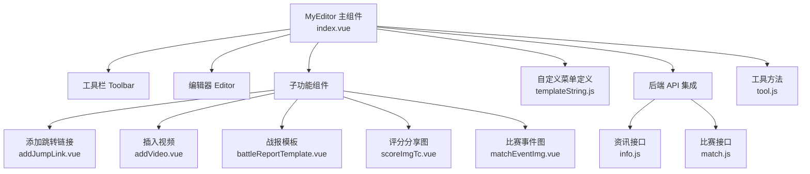
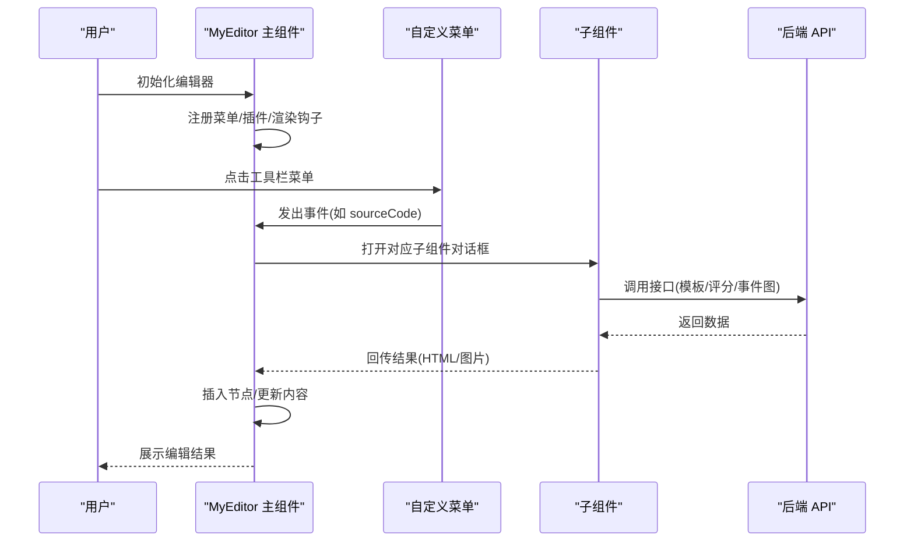
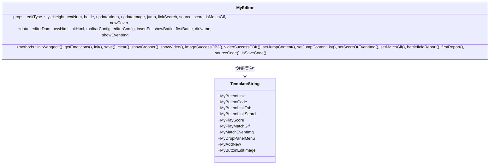
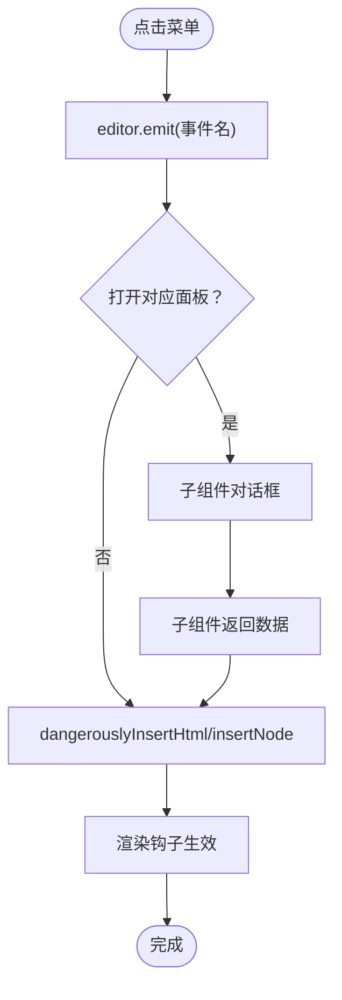
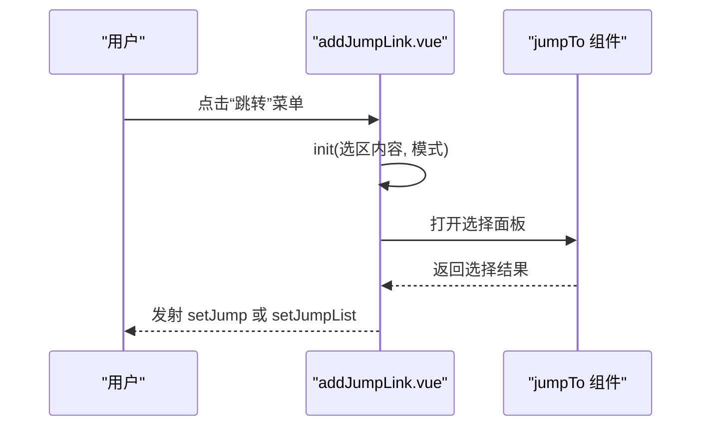
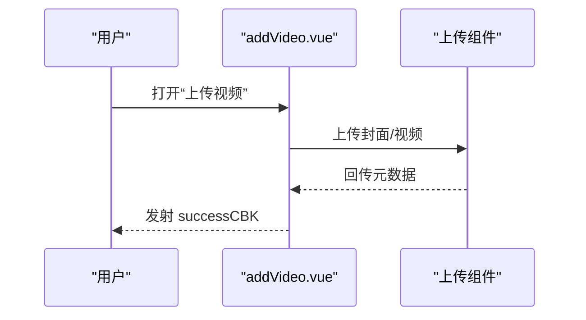
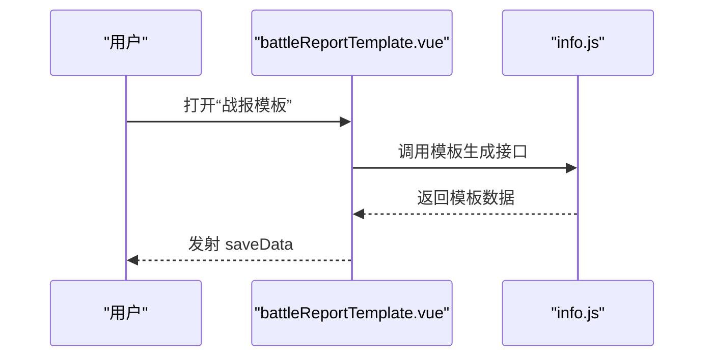
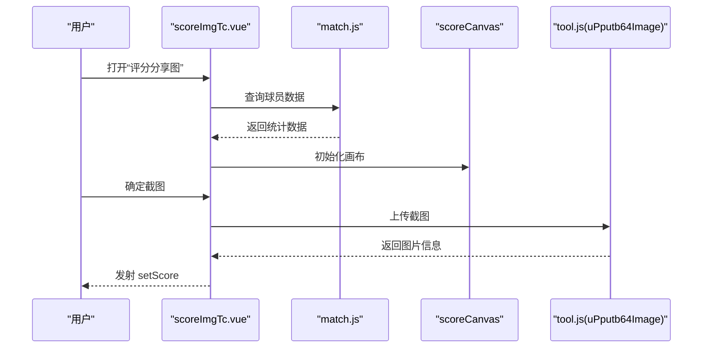
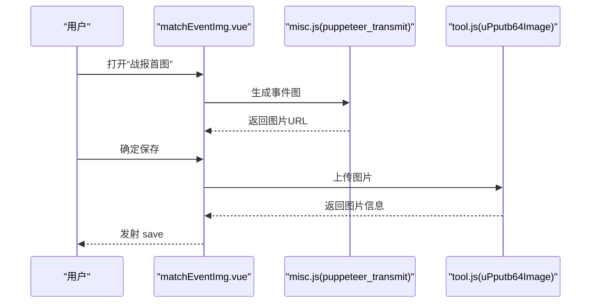
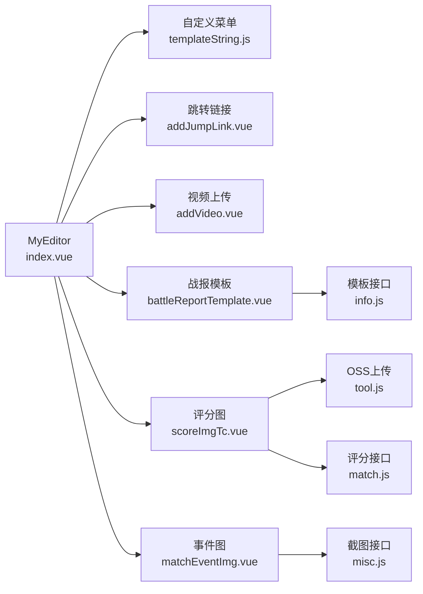

# 富文本编辑器组件

<cite>
**本文档引用的文件**
- [index.vue](file://src/components/wangEditor/index.vue)
- [templateString.js](file://src/components/wangEditor/components/templateString.js)
- [addJumpLink.vue](file://src/components/wangEditor/components/addJumpLink.vue)
- [addVideo.vue](file://src/components/wangEditor/components/addVideo.vue)
- [battleReportTemplate.vue](file://src/components/wangEditor/components/battleReportTemplate.vue)
- [scoreImgTc.vue](file://src/components/wangEditor/components/scoreImgTc.vue)
- [matchEventImg.vue](file://src/components/wangEditor/components/matchEventImg.vue)
- [info.js](file://src/api/info.js)
- [match.js](file://src/api/match.js)
- [tool.js](file://src/utils/tool.js)
</cite>

## 目录
1. [简介](#简介)
2. [项目结构](#项目结构)
3. [核心组件](#核心组件)
4. [架构总览](#架构总览)
5. [详细组件分析](#详细组件分析)
6. [依赖关系分析](#依赖关系分析)
7. [性能考虑](#性能考虑)
8. [故障排查指南](#故障排查指南)
9. [结论](#结论)
10. [附录](#附录)

## 简介
本文件面向 Leisu Admin 项目的富文本编辑器组件，系统性解析基于 wangEditor 的定制化实现。重点覆盖编辑器初始化配置、工具栏定制、内容处理、事件机制、内容保存与加载、模板字符串与自定义模板、以及与后端 API 的集成（图片上传、内容同步）。同时提供配置项、扩展方法与最佳实践，帮助开发者快速上手并高效维护。

## 项目结构
富文本编辑器位于组件目录的 wangEditor 子模块中，核心由一个主组件与若干功能子组件构成，配合自定义菜单与渲染钩子，形成完整的编辑体验。

图表来源
- [index.vue:1-120](file://src/components/wangEditor/index.vue#L1-L120)
- [templateString.js:1-120](file://src/components/wangEditor/components/templateString.js#L1-L120)
- [addJumpLink.vue:1-94](file://src/components/wangEditor/components/addJumpLink.vue#L1-L94)
- [addVideo.vue:1-140](file://src/components/wangEditor/components/addVideo.vue#L1-L140)
- [battleReportTemplate.vue:1-60](file://src/components/wangEditor/components/battleReportTemplate.vue#L1-L60)
- [scoreImgTc.vue:1-80](file://src/components/wangEditor/components/scoreImgTc.vue#L1-L80)
- [matchEventImg.vue:1-80](file://src/components/wangEditor/components/matchEventImg.vue#L1-L80)
- [info.js:570-590](file://src/api/info.js#L570-L590)
- [match.js:1-40](file://src/api/match.js#L1-L40)
- [tool.js:110-140](file://src/utils/tool.js#L110-L140)

章节来源
- [index.vue:1-120](file://src/components/wangEditor/index.vue#L1-L120)
- [templateString.js:1-120](file://src/components/wangEditor/components/templateString.js#L1-L120)

## 核心组件
- MyEditor 主组件：负责编辑器初始化、工具栏配置、菜单注册、内容加载与保存、事件处理、子组件调度。
- 自定义菜单模块：通过工厂模式注册跳转、源代码、评分分享图、比赛 GIF、事件图、表情包、快讯等菜单。
- 功能子组件：跳转链接、视频上传、战报模板、评分分享图、比赛事件图等，提供专用 UI 与业务逻辑。
- 后端集成：通过 info.js 与 match.js 提供模板生成、比赛数据查询、评分统计等能力；通过工具方法完成图片上传与 OSS 传输。

章节来源
- [index.vue:95-170](file://src/components/wangEditor/index.vue#L95-L170)
- [templateString.js:1-490](file://src/components/wangEditor/components/templateString.js#L1-L490)

## 架构总览
编辑器采用“主组件 + 自定义菜单 + 子功能组件 + 后端 API”的分层架构。主组件负责生命周期与事件桥接，自定义菜单扩展工具栏能力，子组件承载复杂交互，API 层提供数据支撑。

图表来源
- [index.vue:291-448](file://src/components/wangEditor/index.vue#L291-L448)
- [templateString.js:152-186](file://src/components/wangEditor/components/templateString.js#L152-L186)
- [battleReportTemplate.vue:110-130](file://src/components/wangEditor/components/battleReportTemplate.vue#L110-L130)
- [scoreImgTc.vue:134-161](file://src/components/wangEditor/components/scoreImgTc.vue#L134-L161)
- [matchEventImg.vue:202-227](file://src/components/wangEditor/components/matchEventImg.vue#L202-L227)

## 详细组件分析

### 主组件 MyEditor（index.vue）
- 初始化与配置
  - 工具栏定制：通过 toolbarKeys 控制显示/隐藏菜单项，按 source 动态过滤。
  - 编辑器配置：MENU_CONF 中自定义图片与视频上传行为，hoverbarKeys 控制图片右键菜单。
  - 模块注册：在 Boot.registerModule 中一次性注册菜单、插件与渲染钩子，确保全局生效。
- 内容兼容与迁移
  - init 方法对历史数据进行兼容处理，将旧版 jumpLink、视频容器与图片节点转换为当前编辑器可识别的 spanLink/spanVideo/img 结构。
- 事件与回调
  - 通过 emit/on 系列钩子与子组件通信，如 addJumpLinkInit、buttonLinkTab、sourceCode、sourceScore、sourceMatchGif、sourceMatchEventImage、editImage。
- 专用功能调用
  - showCropper/showVideo：触发图片/视频上传流程，回调 insertFn 插入节点。
  - setJumpContent/setJumpContentList：插入跳转链接节点。
  - setScoreOrEventImg：插入评分/事件图。
  - setMatchGif：批量插入视频/GIF。
  - battlefieldReport/firstReport：打开战报/早报模板。
  - save/clear：保存与清空内容。

图表来源
- [index.vue:105-170](file://src/components/wangEditor/index.vue#L105-L170)
- [index.vue:189-284](file://src/components/wangEditor/index.vue#L189-L284)
- [index.vue:291-448](file://src/components/wangEditor/index.vue#L291-L448)
- [templateString.js:1-490](file://src/components/wangEditor/components/templateString.js#L1-L490)

章节来源
- [index.vue:172-284](file://src/components/wangEditor/index.vue#L172-L284)
- [index.vue:291-448](file://src/components/wangEditor/index.vue#L291-L448)
- [index.vue:679-797](file://src/components/wangEditor/index.vue#L679-L797)

### 自定义菜单与渲染钩子（templateString.js）
- 菜单类
  - MyButtonLink：插入/编辑跳转链接节点，支持从选区文本生成默认标题。
  - MyButtonEditImage：编辑图片节点（替换）。
  - MyButtonLinkTab：打开“跳转”面板。
  - MyButtonLinkSearch：打开“搜索资料库”面板。
  - MyButtonCode：打开源代码对话框。
  - MyPlayScore：打开评分分享图生成器。
  - MyPlayMatchGif：打开比赛 GIF 选择器。
  - MyMatchEventImg：打开比赛事件图生成器。
  - MyDropPanelMenu：表情包面板，支持多级分类与点击插入。
  - MyAddNew：打开快讯生成器。
- 渲染与序列化
  - renderElemConf/elemsToHtml/parseElemsHtml：将自定义节点（spanLink/spanVideo）与 HTML 互转，确保内容持久化与回显。

图表来源
- [templateString.js:44-49](file://src/components/wangEditor/components/templateString.js#L44-L49)
- [templateString.js:120-123](file://src/components/wangEditor/components/templateString.js#L120-L123)
- [templateString.js:182-185](file://src/components/wangEditor/components/templateString.js#L182-L185)
- [templateString.js:240-243](file://src/components/wangEditor/components/templateString.js#L240-L243)
- [templateString.js:268-273](file://src/components/wangEditor/components/templateString.js#L268-L273)
- [templateString.js:305-308](file://src/components/wangEditor/components/templateString.js#L305-L308)
- [templateString.js:485-488](file://src/components/wangEditor/components/templateString.js#L485-L488)

章节来源
- [templateString.js:1-490](file://src/components/wangEditor/components/templateString.js#L1-L490)

### 添加跳转链接（addJumpLink.vue）
- 功能概述
  - 支持两种模式：文本模式（可自定义标题）与标签模式（批量选择）。
  - 通过 jumpTo 组件选择目标资源，返回跳转对象并触发父组件 setJump 或 setJumpList。
- 关键流程
  - init：根据选区内容与模式初始化 activeJumpTo。
  - saveData：校验必填，组装跳转对象并发射 setJump。
  - batchAddJump：批量选择后发射 setJumpList。

图表来源
- [addJumpLink.vue:62-90](file://src/components/wangEditor/components/addJumpLink.vue#L62-L90)

章节来源
- [addJumpLink.vue:1-94](file://src/components/wangEditor/components/addJumpLink.vue#L1-L94)

### 插入视频（addVideo.vue）
- 功能概述
  - 支持封面上传与视频上传，生成视频节点（spanVideo）并携带宽高、时长、尺寸等元数据。
  - 提供“集锦视频”搜索能力，绑定比赛跳转。
- 关键流程
  - videoHandleSuccess：回填视频与封面元数据。
  - save：校验必填项，发射 successCBK 并关闭对话框。
  - showVideoList：打开搜索资源对话框。

图表来源
- [addVideo.vue:206-264](file://src/components/wangEditor/components/addVideo.vue#L206-L264)

章节来源
- [addVideo.vue:142-268](file://src/components/wangEditor/components/addVideo.vue#L142-L268)

### 战报模板（battleReportTemplate.vue）
- 功能概述
  - 支持查找比赛、生成战报/半场战报模板，自动绑定跳转比赛。
- 关键流程
  - init：根据 isHalf 决定标题与模板类型，尝试从 jumpList 推断 match_id 与 sport_id。
  - getReport/getHalfReport：调用 create_match_report/create_match_half_report 生成模板数据。
  - setobj：选择比赛后刷新模板内容。

图表来源
- [battleReportTemplate.vue:110-130](file://src/components/wangEditor/components/battleReportTemplate.vue#L110-L130)
- [info.js:577-590](file://src/api/info.js#L577-L590)

章节来源
- [battleReportTemplate.vue:1-139](file://src/components/wangEditor/components/battleReportTemplate.vue#L1-L139)
- [info.js:577-590](file://src/api/info.js#L577-L590)

### 评分分享图（scoreImgTc.vue）
- 功能概述
  - 通过 matchRatingDialog 选择比赛与球员，调用相应接口获取统计数据，使用 scoreCanvas 绘制评分图，最终通过 html2canvas 截图并上传至 OSS。
- 关键流程
  - init：从 jumpList 推断 matchData。
  - showRatingData：打开评分对话框。
  - saveMatchRating：根据 sport_id 获取球员数据并初始化画布。
  - updatecover：截图 -> 上传 OSS -> 发射 setScore。

图表来源
- [scoreImgTc.vue:69-161](file://src/components/wangEditor/components/scoreImgTc.vue#L69-L161)
- [match.js:1-40](file://src/api/match.js#L1-L40)
- [tool.js:110-140](file://src/utils/tool.js#L110-L140)

章节来源
- [scoreImgTc.vue:1-165](file://src/components/wangEditor/components/scoreImgTc.vue#L1-L165)
- [match.js:1-40](file://src/api/match.js#L1-L40)
- [tool.js:110-140](file://src/utils/tool.js#L110-L140)

### 比赛事件图（matchEventImg.vue）
- 功能概述
  - 通过 puppeteer_transmit 接口生成事件图，支持选择主队/客队/赛事颜色或自定义颜色，支持上传背景图，最终上传 OSS 并插入编辑器。
- 关键流程
  - init：从 jumpList 推断 match_id 与 sport_id。
  - getNodeImage：调用 puppeteer_transmit 生成图片。
  - save：上传图片并发射 save 事件。

图表来源
- [matchEventImg.vue:202-227](file://src/components/wangEditor/components/matchEventImg.vue#L202-L227)
- [tool.js:110-140](file://src/utils/tool.js#L110-L140)

章节来源
- [matchEventImg.vue:1-231](file://src/components/wangEditor/components/matchEventImg.vue#L1-L231)
- [tool.js:110-140](file://src/utils/tool.js#L110-L140)

## 依赖关系分析
- 组件耦合
  - MyEditor 作为中枢，依赖自定义菜单模块与各子组件；子组件之间低耦合，通过事件与回调交互。
- 外部依赖
  - wangEditor 核心库与 Vue 组件封装。
  - 工具方法提供 OSS 上传与 Base64 处理。
  - API 层提供模板生成、比赛数据与媒体资源。

图表来源
- [index.vue:76-98](file://src/components/wangEditor/index.vue#L76-L98)
- [templateString.js:1-490](file://src/components/wangEditor/components/templateString.js#L1-L490)
- [scoreImgTc.vue:25-31](file://src/components/wangEditor/components/scoreImgTc.vue#L25-L31)
- [battleReportTemplate.vue:49](file://src/components/wangEditor/components/battleReportTemplate.vue#L49)
- [match.js:1-40](file://src/api/match.js#L1-L40)
- [info.js:577-590](file://src/api/info.js#L577-L590)
- [tool.js:110-140](file://src/utils/tool.js#L110-L140)

章节来源
- [index.vue:76-98](file://src/components/wangEditor/index.vue#L76-L98)
- [scoreImgTc.vue:25-31](file://src/components/wangEditor/components/scoreImgTc.vue#L25-L31)
- [battleReportTemplate.vue:49](file://src/components/wangEditor/components/battleReportTemplate.vue#L49)
- [match.js:1-40](file://src/api/match.js#L1-L40)
- [info.js:577-590](file://src/api/info.js#L577-L590)
- [tool.js:110-140](file://src/utils/tool.js#L110-L140)

## 性能考虑
- 表情包异步加载：主组件在获取表情包后再初始化编辑器，避免菜单工厂异步导致的空白问题。
- DOM 操作最小化：通过 dangerouslyInsertHtml 与 insertNode 直接插入，减少不必要的重绘。
- 图片上传与截图：评分图与事件图采用 html2canvas 截图并上传 OSS，注意 scale 与 dip 参数以平衡清晰度与性能。
- 模板生成：战报模板通过后端接口生成，前端仅负责展示与绑定跳转，降低前端计算压力。

## 故障排查指南
- 工具栏菜单缺失
  - 检查 source 与 notoolbarKeys 过滤逻辑，确认对应菜单是否被隐藏。
- 跳转链接无法插入
  - 确认 MyButtonLink.exec 是否正确触发 addJumpLinkInit 事件。
- 视频节点显示异常
  - 检查 spanVideo 的 data-* 属性是否完整，回显时是否被转换为当前编辑器节点。
- 评分图生成失败
  - 确认 match_id 与 sport_id 正确，接口返回数据结构符合预期。
- 事件图生成失败
  - 检查 puppeteer_transmit 接口可用性与参数完整性。

章节来源
- [index.vue:291-329](file://src/components/wangEditor/index.vue#L291-L329)
- [index.vue:549-578](file://src/components/wangEditor/index.vue#L549-L578)
- [index.vue:679-797](file://src/components/wangEditor/index.vue#L679-L797)
- [scoreImgTc.vue:73-130](file://src/components/wangEditor/components/scoreImgTc.vue#L73-L130)
- [matchEventImg.vue:202-227](file://src/components/wangEditor/components/matchEventImg.vue#L202-L227)

## 结论
本富文本编辑器组件通过自定义菜单与子功能组件，实现了跳转链接、视频、战报模板、评分分享图、事件图等专业能力，并与后端 API 紧密集成。主组件负责统一调度与兼容处理，子组件承担具体业务交互，整体架构清晰、扩展性强，适合在内容运营与资讯编辑场景中稳定使用。

## 附录
- 配置选项
  - editType：新增/编辑模式切换
  - styleHeight：编辑器高度
  - battle：是否启用战报模板
  - updataVideo/updataImage：是否启用视频/图片上传
  - jump/linkSearch：是否启用跳转/资料库搜索
  - source：内容来源（post/intelligence/creator/question/news）
  - score/isMatchGif/newCover：评分图/比赛 GIF/封面图支持
- 扩展方法
  - 在 Boot.registerModule 中注册新的菜单与渲染钩子
  - 通过 editor.emit 与子组件通信
  - 使用 dangerouslyInsertHtml/insertNode 插入自定义节点
- 最佳实践
  - 先加载表情包再初始化编辑器
  - 严格校验上传文件的尺寸、格式与大小
  - 模板生成后及时绑定跳转，保持内容一致性
  - 截图与上传分离，避免阻塞 UI