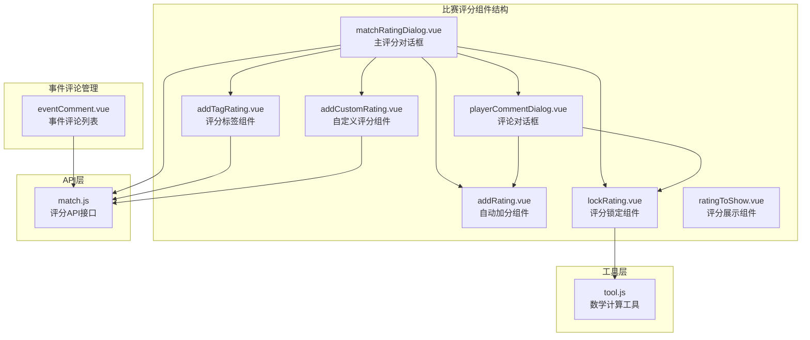
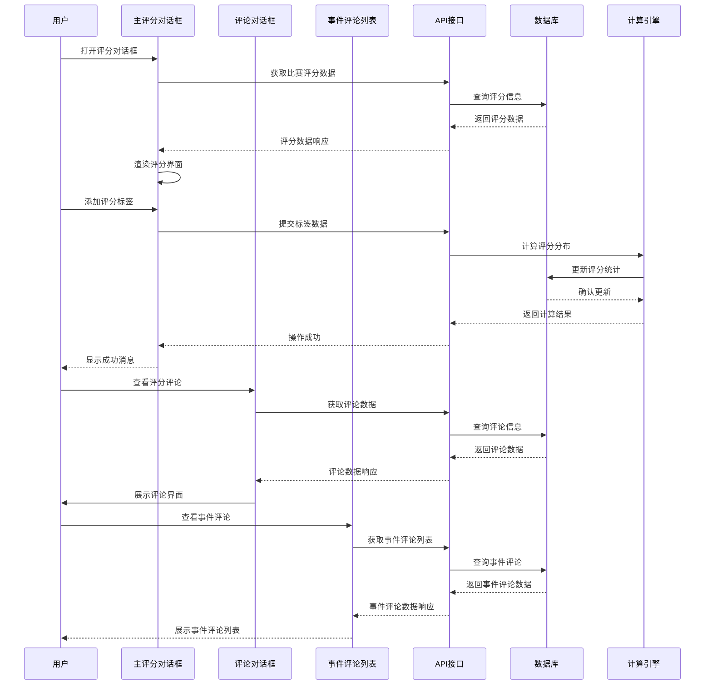
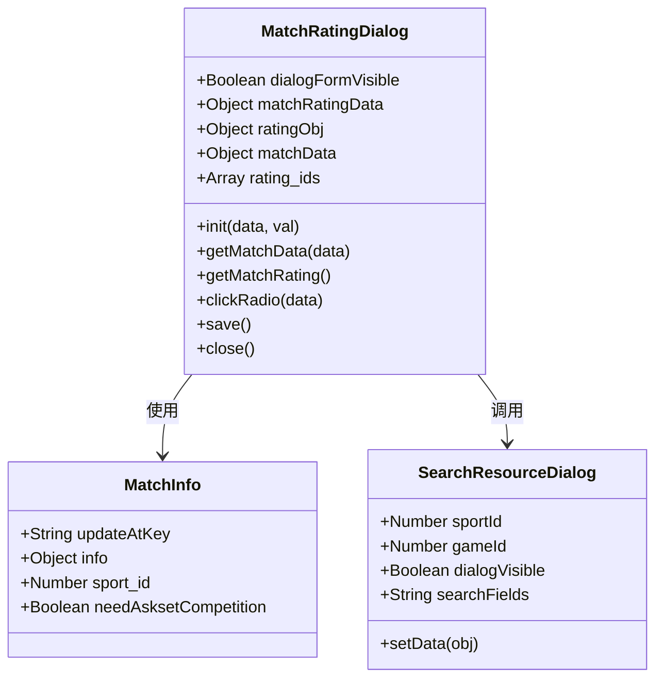
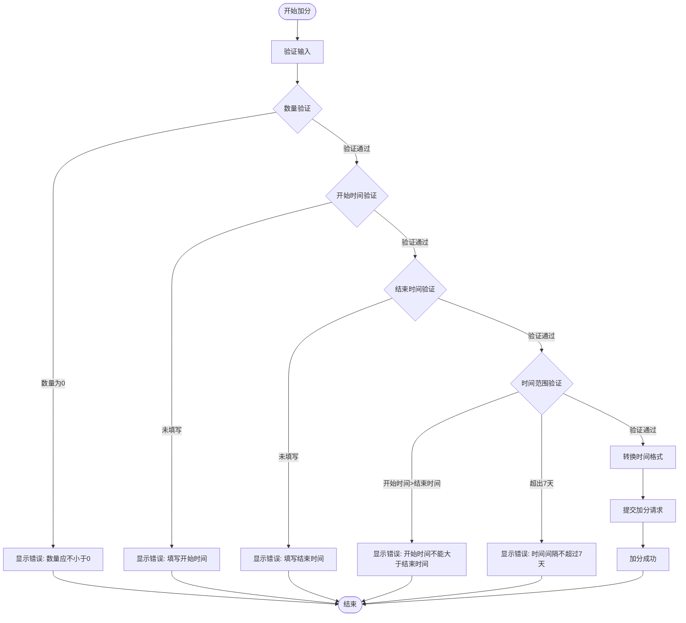
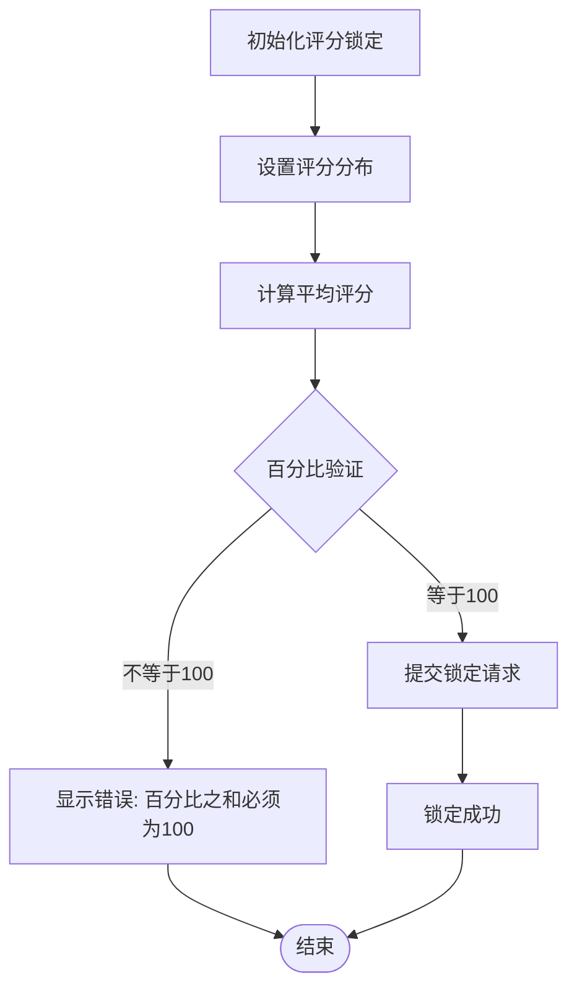
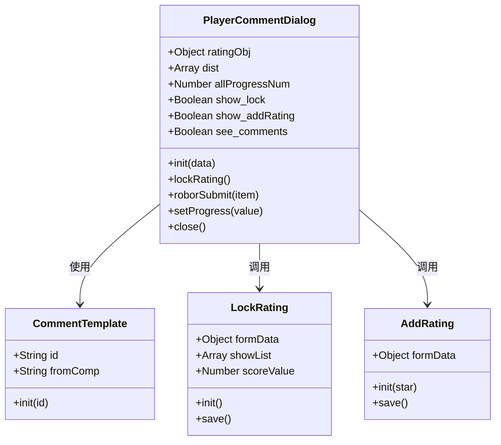
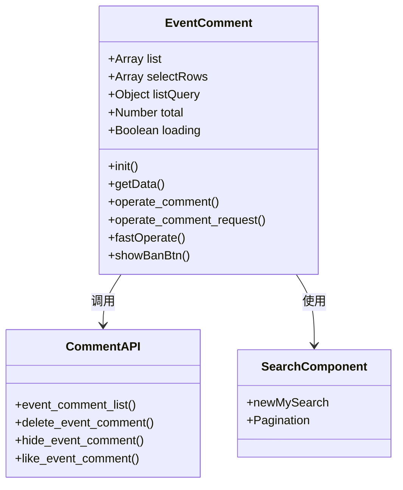
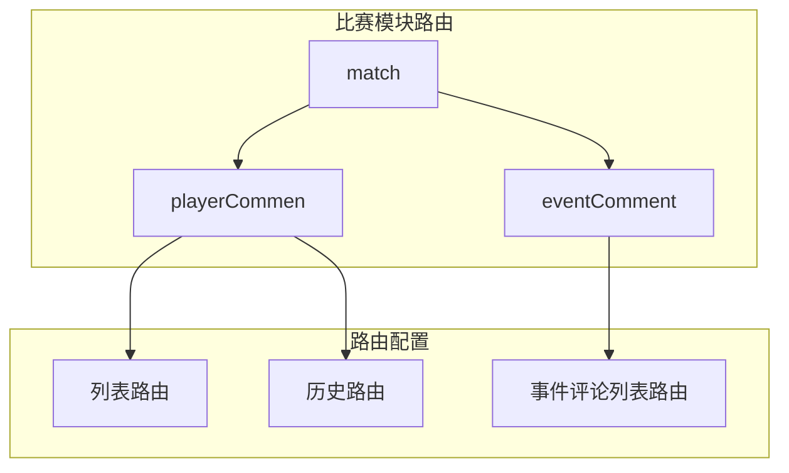
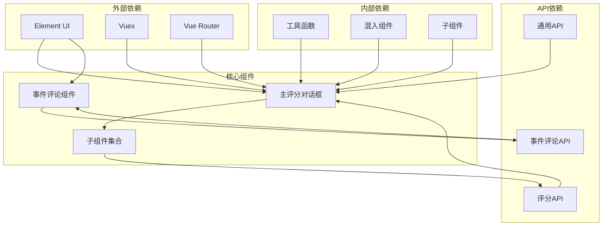

# 比赛评分组件

<cite>
**本文档引用的文件**
- [matchRatingDialog.vue](file://src/components/matchRating/matchRatingDialog.vue)
- [addRating.vue](file://src/components/matchRating/addRating.vue)
- [addCustomRating.vue](file://src/components/matchRating/addCustomRating.vue)
- [addTagRating.vue](file://src/components/matchRating/addTagRating.vue)
- [lockRating.vue](file://src/components/matchRating/lockRating.vue)
- [playerCommentDialog.vue](file://src/components/matchRating/playerCommentDialog.vue)
- [ratingToShow.vue](file://src/components/matchRating/ratingToShow.vue)
- [eventComment.vue](file://src/views/match/eventComment/eventComment.vue)
- [match.js](file://src/api/match.js)
- [tool.js](file://src/utils/tool.js)
- [playerCommen.js](file://src/router/children/match/children/playerCommen.js)
</cite>

## 目录
1. [简介](#简介)
2. [项目结构](#项目结构)
3. [核心组件](#核心组件)
4. [架构概览](#架构概览)
5. [详细组件分析](#详细组件分析)
6. [新增功能：比赛事件评论管理](#新增功能比赛事件评论管理)
7. [依赖关系分析](#依赖关系分析)
8. [性能考虑](#性能考虑)
9. [故障排除指南](#故障排除指南)
10. [结论](#结论)
11. [附录](#附录)

## 简介

Leisu Admin项目的比赛评分组件是一套完整的体育赛事评分管理系统，涵盖了从评分录入、历史记录查询到统计分析的全流程功能。该组件设计用于管理员对各类体育比赛进行评分管理，支持多种运动类型（足球、篮球、网球、电竞等）和评分模式。

**更新**：系统现已集成了比赛事件评论管理功能，与评分组件形成完整的比赛内容管理体系，实现了从评分到评论的全方位内容管理。

组件采用模块化设计，包含评分对话框、评分录入、历史记录、统计分析等多个子组件，通过统一的API接口与后端服务交互，实现了评分数据的完整生命周期管理。

## 项目结构

比赛评分组件位于`src/components/matchRating/`目录下，包含以下核心文件：



**图表来源**
- [matchRatingDialog.vue:1-1131](file://src/components/matchRating/matchRatingDialog.vue#L1-L1131)
- [eventComment.vue:1-312](file://src/views/match/eventComment/eventComment.vue#L1-L312)
- [match.js:1102-1142](file://src/api/match.js#L1102-L1142)

**章节来源**
- [matchRatingDialog.vue:1-1131](file://src/components/matchRating/matchRatingDialog.vue#L1-L1131)
- [eventComment.vue:1-312](file://src/views/match/eventComment/eventComment.vue#L1-L312)
- [match.js:1102-1142](file://src/api/match.js#L1102-L1142)

## 核心组件

### 主评分对话框组件

主评分对话框是整个评分系统的核心组件，负责：
- 比赛信息展示和搜索
- 评分数据的获取和展示
- 不同运动类型的评分界面适配
- 评分操作的入口管理

### 评分录入组件

系统提供三种不同的评分录入方式：

1. **自动加分组件** (`addRating.vue`)
   - 支持批量加分操作
   - 时间范围限制（最多7天）
   - 星级评分设置

2. **自定义评分组件** (`addCustomRating.vue`)
   - 支持自定义评分项创建
   - 头像上传和配置
   - 多运动类型支持

3. **评分标签组件** (`addTagRating.vue`)
   - 评分标签的添加和管理
   - 标签颜色分类（正向、负向、中性）

### 评分管理组件

- **评分锁定组件** (`lockRating.vue`)
  - 百分比分配计算
  - 精确的数学运算
  - 评分分布锁定

- **评论对话框组件** (`playerCommentDialog.vue`)
  - 评分评论的查看和管理
  - 评分分布统计展示
  - 锁分和加分操作入口

**章节来源**
- [matchRatingDialog.vue:220-675](file://src/components/matchRating/matchRatingDialog.vue#L220-L675)
- [addRating.vue:29-89](file://src/components/matchRating/addRating.vue#L29-L89)
- [addCustomRating.vue:108-223](file://src/components/matchRating/addCustomRating.vue#L108-L223)
- [addTagRating.vue:32-75](file://src/components/matchRating/addTagRating.vue#L32-L75)
- [lockRating.vue:35-110](file://src/components/matchRating/lockRating.vue#L35-L110)
- [playerCommentDialog.vue:140-207](file://src/components/matchRating/playerCommentDialog.vue#L140-L207)

## 架构概览

比赛评分组件采用分层架构设计，实现了清晰的关注点分离：

```mermaid
graph TB
subgraph "视图层"
UI[用户界面组件]
MRD[主评分对话框]
PCD[评论对话框]
EC[事件评论列表]
end
subgraph "业务逻辑层"
BL[业务逻辑处理]
VALID[数据验证]
CALC[数据计算]
END
subgraph "数据访问层"
API[API接口调用]
CACHE[数据缓存]
end
subgraph "数据层"
DB[(评分数据库)]
LOG[(操作日志)]
EVENT_DB[(事件评论数据库)]
end
UI --> MRD
UI --> PCD
UI --> EC
MRD --> BL
PCD --> BL
EC --> BL
BL --> VALID
BL --> CALC
BL --> API
API --> DB
API --> LOG
API --> EVENT_DB
CALC --> DB
```

**图表来源**
- [matchRatingDialog.vue:706-1131](file://src/components/matchRating/matchRatingDialog.vue#L706-L1131)
- [eventComment.vue:141-307](file://src/views/match/eventComment/eventComment.vue#L141-L307)
- [match.js:1102-1142](file://src/api/match.js#L1102-L1142)

### 数据流架构



**图表来源**
- [matchRatingDialog.vue:912-959](file://src/components/matchRating/matchRatingDialog.vue#L912-L959)
- [playerCommentDialog.vue:171-180](file://src/components/matchRating/playerCommentDialog.vue#L171-L180)
- [eventComment.vue:276-302](file://src/views/match/eventComment/eventComment.vue#L276-L302)
- [match.js:1102-1142](file://src/api/match.js#L1102-L1142)

**章节来源**
- [matchRatingDialog.vue:706-1131](file://src/components/matchRating/matchRatingDialog.vue#L706-L1131)
- [eventComment.vue:141-307](file://src/views/match/eventComment/eventComment.vue#L141-L307)
- [match.js:1102-1142](file://src/api/match.js#L1102-L1142)

## 详细组件分析

### 主评分对话框组件分析

主评分对话框组件是整个评分系统的核心，具有以下特点：

#### 组件架构



**图表来源**
- [matchRatingDialog.vue:706-1131](file://src/components/matchRating/matchRatingDialog.vue#L706-L1131)

#### 功能特性

1. **多运动类型支持**
   - 足球、篮球、网球、电竞等
   - 不同运动类型的评分界面适配
   - 特殊运动（如网球双打）的专门处理

2. **智能评分数据获取**
   ```javascript
   // 根据运动类型动态选择API
   if (this.matchData.sport_id == 1) {
       res = await football_match_rating(this.matchData.match_id)
   } else if (this.matchData.sport_id == 2) {
       res = await basketball_match_rating(this.matchData.match_id)
   }
   ```

3. **评分数据绑定**
   - 实时评分数据更新
   - 评分颜色分级显示
   - 评分统计信息展示

**章节来源**
- [matchRatingDialog.vue:912-959](file://src/components/matchRating/matchRatingDialog.vue#L912-L959)
- [matchRatingDialog.vue:984-1003](file://src/components/matchRating/matchRatingDialog.vue#L984-L1003)

### 评分录入组件分析

#### 自动加分组件

自动加分组件提供了便捷的批量评分功能：



**图表来源**
- [addRating.vue:55-82](file://src/components/matchRating/addRating.vue#L55-L82)

#### 自定义评分组件

自定义评分组件支持创建个性化的评分项：

1. **多运动类型配置**
   - 足球、篮球、网球、电竞
   - 电竞类型细分（LOL、CSGO、DOTA、KOG）

2. **评分项配置**
   - 名称和头像设置
   - 位置选择（主场、客场、场外）
   - 备注信息

3. **数据验证**
   - 必填字段检查
   - 文件上传验证
   - 配置完整性检查

**章节来源**
- [addRating.vue:55-82](file://src/components/matchRating/addRating.vue#L55-L82)
- [addCustomRating.vue:181-202](file://src/components/matchRating/addCustomRating.vue#L181-L202)

### 评分管理组件分析

#### 评分锁定组件

评分锁定组件实现了精确的评分分布计算：



**图表来源**
- [lockRating.vue:92-102](file://src/components/matchRating/lockRating.vue#L92-L102)

#### 数学计算精度保障

评分锁定组件使用专门的数学计算工具确保精度：

1. **高精度计算**
   - 使用Decimal.js进行浮点运算
   - 精确的乘法、除法、加法计算
   - 避免浮点数精度丢失

2. **评分计算公式**
   ```
   平均评分 = Σ(评分比例 × 评分星级 × 2) / 100
   ```

**章节来源**
- [lockRating.vue:68-84](file://src/components/matchRating/lockRating.vue#L68-L84)
- [tool.js:458-510](file://src/utils/tool.js#L458-L510)

### 评论对话框组件分析

评论对话框组件提供了完整的评分评论管理功能：

#### 组件结构



**图表来源**
- [playerCommentDialog.vue:140-207](file://src/components/matchRating/playerCommentDialog.vue#L140-L207)

#### 功能特性

1. **评分分布统计**
   - 5星到1星的分布展示
   - 百分比进度条显示
   - 平均评分计算

2. **评论管理**
   - 评分评论的查看
   - 评论的添加和管理
   - 评论点赞功能

3. **操作集成**
   - 锁分操作入口
   - 自动加分入口
   - 评分标签管理

**章节来源**
- [playerCommentDialog.vue:110-136](file://src/components/matchRating/playerCommentDialog.vue#L110-L136)
- [playerCommentDialog.vue:158-204](file://src/components/matchRating/playerCommentDialog.vue#L158-L204)

## 新增功能：比赛事件评论管理

**更新**：系统新增了比赛事件评论管理功能，与评分组件形成完整的比赛内容管理体系。

### 事件评论列表组件

事件评论列表组件提供了全面的事件评论管理功能：

#### 组件架构



**图表来源**
- [eventComment.vue:152-307](file://src/views/match/eventComment/eventComment.vue#L152-L307)

#### 功能特性

1. **事件评论管理**
   - 事件卡片ID关联
   - 用户信息展示
   - 评论内容查看
   - 状态管理（正常、隐藏、删除）

2. **批量操作**
   - 批量隐藏/取消隐藏
   - 批量删除/取消删除
   - 多选操作支持

3. **高级功能**
   - 发布时间排序
   - 点赞数统计
   - 楼层和PID管理
   - 归属地和渠道追踪

4. **数据展示**
   - 评论内容预览
   - IP地址和地理位置
   - 平台信息展示
   - 渠道来源追踪

**章节来源**
- [eventComment.vue:20-139](file://src/views/match/eventComment/eventComment.vue#L20-L139)
- [eventComment.vue:207-307](file://src/views/match/eventComment/eventComment.vue#L207-L307)

### API接口支持

事件评论管理功能通过以下API接口实现：

1. **事件评论列表**
   - `event_comment_list()` - 获取事件评论列表
   - 支持分页、排序、筛选

2. **事件评论操作**
   - `delete_event_comment()` - 删除事件评论
   - `hide_event_comment()` - 隐藏事件评论
   - `like_event_comment()` - 点赞事件评论

3. **事件评论编辑**
   - `save_event_comment()` - 新增/编辑事件评论

**章节来源**
- [match.js:1102-1142](file://src/api/match.js#L1102-L1142)

### 路由配置

事件评论管理功能通过路由系统集成：



**图表来源**
- [playerCommen.js:3-31](file://src/router/children/match/children/playerCommen.js#L3-L31)

**章节来源**
- [playerCommen.js:3-31](file://src/router/children/match/children/playerCommen.js#L3-L31)

## 依赖关系分析

比赛评分组件的依赖关系体现了清晰的分层架构：



**图表来源**
- [matchRatingDialog.vue:696-708](file://src/components/matchRating/matchRatingDialog.vue#L696-L708)
- [eventComment.vue:147-148](file://src/views/match/eventComment/eventComment.vue#L147-L148)
- [match.js:1102-1142](file://src/api/match.js#L1102-L1142)

### 组件间通信

组件间的通信主要通过以下方式实现：

1. **Props传递**
   - 父组件向子组件传递数据
   - 子组件向父组件传递状态变化

2. **事件发射**
   - 子组件通过$emit向父组件传递事件
   - 父组件监听并处理子组件事件

3. **API调用**
   - 组件通过API接口与后端交互
   - 统一的数据处理和错误处理

4. **路由集成**
   - 事件评论通过路由系统访问
   - 权限控制和菜单集成

**章节来源**
- [matchRatingDialog.vue:746-771](file://src/components/matchRating/matchRatingDialog.vue#L746-L771)
- [matchRatingDialog.vue:972-983](file://src/components/matchRating/matchRatingDialog.vue#L972-L983)
- [playerCommen.js:3-31](file://src/router/children/match/children/playerCommen.js#L3-L31)

## 性能考虑

### 数据加载优化

1. **懒加载策略**
   - 评分对话框按需加载
   - 子组件延迟初始化
   - 图片资源按需加载

2. **缓存机制**
   - 评分数据缓存
   - API响应缓存
   - 用户操作历史缓存

3. **虚拟滚动**
   - 大数据量列表的虚拟滚动
   - 滚动性能优化
   - 内存使用优化

### 计算性能优化

1. **数学计算优化**
   - 高精度计算工具
   - 浮点数运算优化
   - 大数据量计算缓存

2. **渲染性能优化**
   - 组件懒加载
   - DOM操作最小化
   - 事件委托优化

3. **网络性能优化**
   - 请求合并
   - 数据压缩
   - 静态资源CDN

### 事件评论性能优化

**更新**：事件评论管理功能采用了专门的性能优化策略：

1. **分页加载**
   - 默认每页15条记录
   - 支持自定义分页大小
   - 懒加载机制

2. **批量操作优化**
   - 多选操作减少请求次数
   - 批量状态切换
   - 操作确认机制

3. **数据缓存**
   - 列表数据缓存
   - 搜索条件缓存
   - 排序状态缓存

**章节来源**
- [tool.js:458-510](file://src/utils/tool.js#L458-L510)
- [matchRatingDialog.vue:912-959](file://src/components/matchRating/matchRatingDialog.vue#L912-L959)
- [eventComment.vue:169-176](file://src/views/match/eventComment/eventComment.vue#L169-L176)

## 故障排除指南

### 常见问题及解决方案

#### 评分数据获取失败

**问题描述**: 评分数据无法正常获取

**可能原因**:
1. 网络连接问题
2. API接口异常
3. 比赛ID无效
4. 权限不足

**解决方案**:
```javascript
// 检查API响应状态
if (res && res.code == 0) {
    this.ratingObj = JSON.parse(JSON.stringify(res.data))
} else {
    this.$message.error(res && res.msg)
}
```

#### 评分操作失败

**问题描述**: 评分操作（加分、锁分、标签添加）失败

**可能原因**:
1. 数据验证失败
2. 时间范围限制
3. 权限不足
4. 系统异常

**解决方案**:
```javascript
// 加分操作验证
if (!obj.nums) {
    this.$message.error("数量应不小于0")
    return
} else if (obj.end - 86400000 * 7 > obj.start) {
    this.$message.error("开始时间和结束时间间隔不超过7天")
    return
}
```

#### 事件评论管理问题

**更新**：新增事件评论管理功能的常见问题：

**问题描述**: 事件评论列表加载失败

**可能原因**:
1. 网络连接问题
2. API接口异常
3. 权限不足
4. 搜索条件无效

**解决方案**:
```javascript
// 检查事件评论API响应
try {
    const res = await event_comment_list(processInKeys(data))
    if (res.code == 0) {
        this.total = res.total
        this.list = JSON.parse(JSON.stringify(res.data))
    }
} catch (error) {
    this.list = []
    this.total = 0
}
```

#### 性能问题

**问题描述**: 页面加载缓慢或操作卡顿

**可能原因**:
1. 数据量过大
2. 组件渲染过多
3. API请求频繁
4. 资源加载慢

**解决方案**:
1. 实施数据分页加载
2. 优化组件渲染逻辑
3. 合并API请求
4. 使用缓存机制

**章节来源**
- [addRating.vue:55-82](file://src/components/matchRating/addRating.vue#L55-L82)
- [matchRatingDialog.vue:955-958](file://src/components/matchRating/matchRatingDialog.vue#L955-L958)
- [eventComment.vue:289-301](file://src/views/match/eventComment/eventComment.vue#L289-L301)

### 错误处理机制

组件采用了多层次的错误处理机制：

1. **前端验证**
   - 输入数据格式验证
   - 业务逻辑验证
   - 用户体验优化

2. **API错误处理**
   - 统一的错误响应处理
   - 错误信息本地化
   - 用户友好的错误提示

3. **系统级错误处理**
   - 全局错误捕获
   - 日志记录
   - 故障恢复机制

4. **事件评论错误处理**
   **更新**：事件评论管理功能的专门错误处理：
   - 操作确认机制
   - 批量操作错误处理
   - 权限验证错误处理

**章节来源**
- [addRating.vue:55-82](file://src/components/matchRating/addRating.vue#L55-L82)
- [match.js:1102-1142](file://src/api/match.js#L1102-L1142)
- [eventComment.vue:208-274](file://src/views/match/eventComment/eventComment.vue#L208-L274)

## 结论

Leisu Admin项目的比赛评分组件是一个设计精良、功能完整的评分管理系统。组件采用了现代化的Vue.js技术栈，实现了良好的代码组织和可维护性。

**更新**：系统现已集成了比赛事件评论管理功能，与评分组件形成了完整的比赛内容管理体系，进一步提升了系统的功能完整性和实用性。

### 主要优势

1. **模块化设计**: 组件职责明确，便于维护和扩展
2. **多运动类型支持**: 覆盖主流体育项目
3. **高精度计算**: 确保评分计算的准确性
4. **用户体验优化**: 流畅的操作流程和反馈机制
5. **性能优化**: 有效的数据加载和渲染优化
6. **内容管理完整**: 评分与事件评论的双重管理机制

### 技术亮点

1. **分层架构**: 清晰的架构层次，便于理解和维护
2. **数据验证**: 多层次的数据验证机制
3. **错误处理**: 完善的错误处理和恢复机制
4. **性能优化**: 多种性能优化策略的综合运用
5. **路由集成**: 完善的路由系统和权限控制

### 改进建议

1. **国际化支持**: 增加多语言支持
2. **移动端适配**: 优化移动端用户体验
3. **实时更新**: 实现实时评分和评论数据更新
4. **高级分析**: 增加更详细的统计分析功能
5. **内容推荐**: 基于评分和评论的智能推荐系统

## 附录

### API接口参考

| 接口名称 | 方法 | 描述 |
|---------|------|------|
| init_match_rating | POST | 初始化比赛评分 |
| playerDeleteRating | POST | 删除评分 |
| add_custom_rating | POST | 添加自定义评分 |
| add_custom_rating_dist | POST | 评分分布锁定 |
| add_robot_submit_rating | POST | 机器人自动加分 |
| add_rating_tags | POST | 设置评分标签 |
| event_comment_list | POST | 事件评论列表 |
| save_event_comment | POST | 新增/编辑事件评论 |
| delete_event_comment | POST | 删除事件评论 |
| hide_event_comment | POST | 隐藏事件评论 |
| like_event_comment | POST | 点赞事件评论 |

### 配置选项

1. **评分时间范围**: 最多7天
2. **评分星级**: 1-5星
3. **评分数量**: 非负数
4. **标签长度**: 最多5个字符
5. **事件评论分页**: 默认每页15条

### 扩展方法

1. **自定义评分项**: 支持创建个性化评分
2. **评分标签**: 支持多类型标签分类
3. **批量操作**: 支持批量评分管理
4. **统计分析**: 提供详细的评分统计
5. **事件评论管理**: 支持事件评论的完整生命周期管理
6. **路由集成**: 完整的路由系统和权限控制

**章节来源**
- [match.js:1102-1142](file://src/api/match.js#L1102-L1142)
- [playerCommen.js:3-31](file://src/router/children/match/children/playerCommen.js#L3-L31)