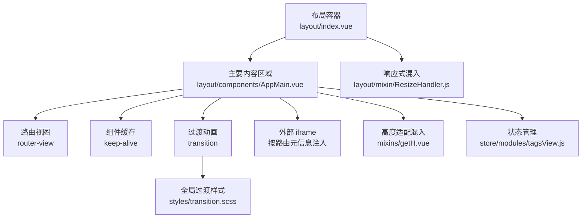
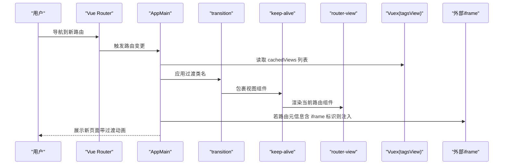
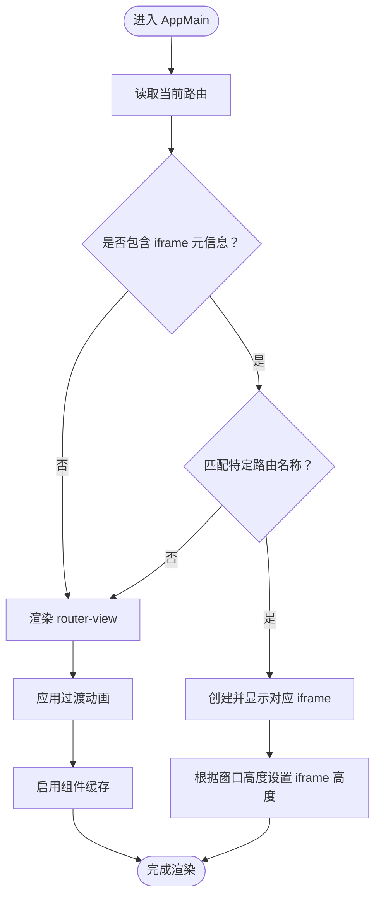
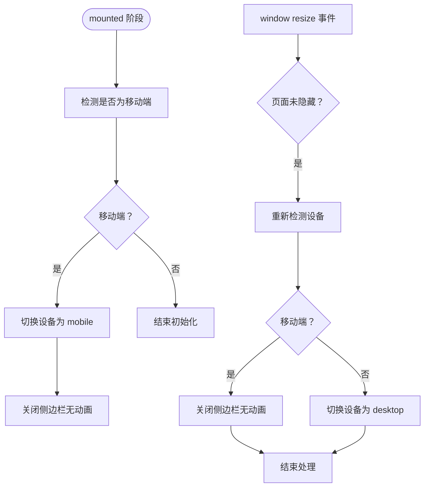
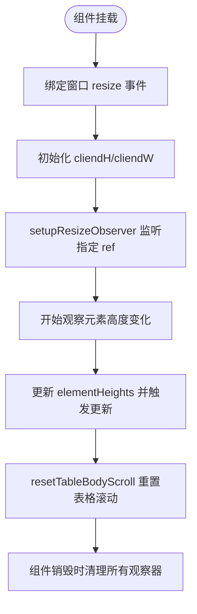
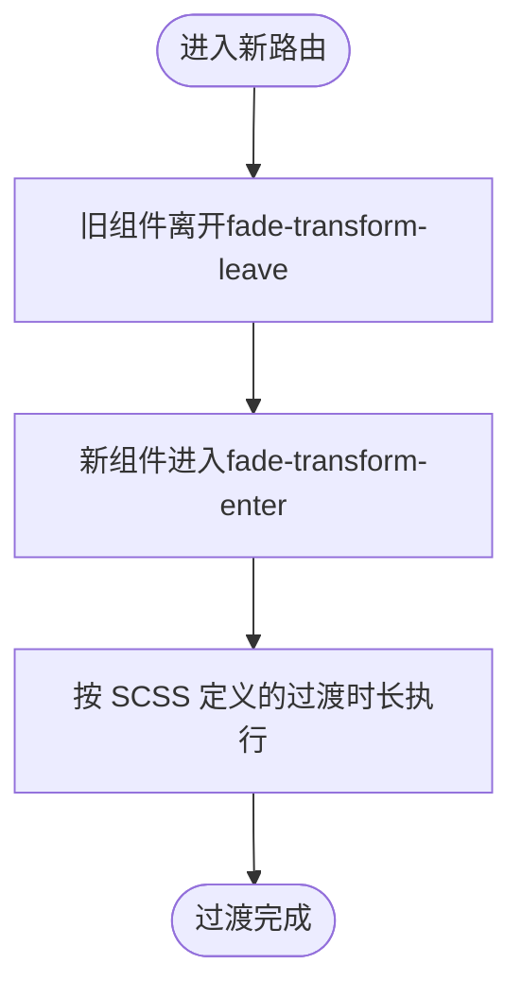
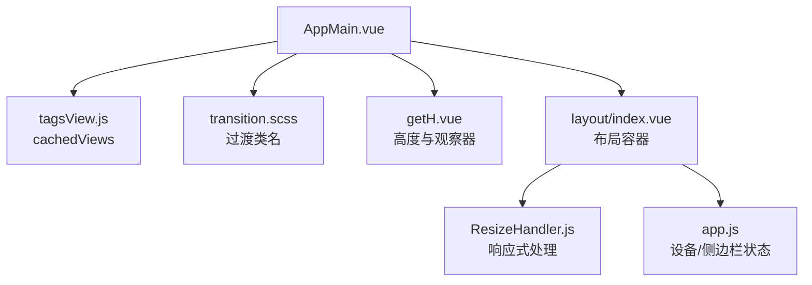

# AppMain主要内容区域

<cite>
**本文档引用的文件**
- [AppMain.vue](file://src/layout/components/AppMain.vue)
- [ResizeHandler.js](file://src/layout/mixin/ResizeHandler.js)
- [getH.vue](file://src/mixins/getH.vue)
- [transition.scss](file://src/styles/transition.scss)
- [index.vue](file://src/layout/index.vue)
- [app.js](file://src/store/modules/app.js)
- [tagsView.js](file://src/store/modules/tagsView.js)
- [routerView/index.vue](file://src/components/routerView/index.vue)
- [overview.vue](file://src/views/dashboard/overview.vue)
</cite>

## 目录
1. [简介](#简介)
2. [项目结构](#项目结构)
3. [核心组件](#核心组件)
4. [架构总览](#架构总览)
5. [详细组件分析](#详细组件分析)
6. [依赖关系分析](#依赖关系分析)
7. [性能考虑](#性能考虑)
8. [故障排除指南](#故障排除指南)
9. [结论](#结论)
10. [附录](#附录)

## 简介
本文件聚焦 Leisu Admin 项目的 AppMain 主要内容区域，系统性解析其设计架构与实现细节，涵盖：
- 路由视图渲染机制：RouterView 的嵌套、组件缓存（keep-alive）、动态加载与 iframe 嵌入策略
- 动画过渡效果：页面切换动画、过渡类名与性能优化
- 内容区域管理：高度适配、滚动控制、ResizeObserver 观察与清理
- 响应式处理：ResizeHandler 混入的窗口尺寸监听、设备状态切换、移动端优化
- 状态管理：缓存视图列表、加载状态、错误处理与空状态展示
- 样式定制与布局优化：SCSS 变量、固定头部与标签页视图的适配
- 配置选项、扩展方法与最佳实践

## 项目结构
AppMain 位于布局组件层，作为路由视图的主要承载容器，与布局父组件、状态管理、过渡样式协同工作。

图表来源
- [index.vue:1-124](file://src/layout/index.vue#L1-L124)
- [AppMain.vue:1-122](file://src/layout/components/AppMain.vue#L1-L122)
- [getH.vue:1-103](file://src/mixins/getH.vue#L1-L103)
- [ResizeHandler.js:1-46](file://src/layout/mixin/ResizeHandler.js#L1-L46)
- [tagsView.js:1-182](file://src/store/modules/tagsView.js#L1-L182)
- [transition.scss:1-49](file://src/styles/transition.scss#L1-L49)

章节来源
- [index.vue:1-124](file://src/layout/index.vue#L1-L124)
- [AppMain.vue:1-122](file://src/layout/components/AppMain.vue#L1-L122)

## 核心组件
- AppMain：负责渲染当前路由视图、应用过渡动画、启用组件缓存、根据路由元信息动态加载 iframe
- ResizeHandler 混入：监听窗口尺寸变化，自动切换设备状态并关闭侧边栏，确保移动端体验
- getH 混入：提供窗口尺寸监听、表格滚动重置、基于 ResizeObserver 的动态高度计算与清理
- 过渡样式：定义 fade-transform 等过渡类名，统一页面切换动画
- 状态管理：tagsView 缓存视图列表，app 模块维护设备与侧边栏状态

章节来源
- [AppMain.vue:19-72](file://src/layout/components/AppMain.vue#L19-L72)
- [ResizeHandler.js:6-45](file://src/layout/mixin/ResizeHandler.js#L6-L45)
- [getH.vue:4-101](file://src/mixins/getH.vue#L4-L101)
- [transition.scss:3-28](file://src/styles/transition.scss#L3-L28)
- [tagsView.js:1-182](file://src/store/modules/tagsView.js#L1-L182)
- [app.js:1-65](file://src/store/modules/app.js#L1-L65)

## 架构总览
AppMain 通过 Vue Router 的 RouterView 承载当前路由组件，并在顶层包裹 transition 与 keep-alive，实现平滑过渡与组件缓存。同时，依据路由元信息（meta）决定是否以 iframe 形式加载外部资源，满足特定业务场景。布局父组件负责响应式处理与设备状态切换，getH 混入提供高度适配能力，过渡样式统一动画表现。

图表来源
- [AppMain.vue:4-16](file://src/layout/components/AppMain.vue#L4-L16)
- [tagsView.js:36-41](file://src/store/modules/tagsView.js#L36-L41)
- [transition.scss:14-28](file://src/styles/transition.scss#L14-L28)

## 详细组件分析

### AppMain 组件分析
- 路由视图渲染
  - 使用 transition 与 keep-alive 包裹 router-view，实现页面切换过渡与组件缓存
  - key 基于路由路径生成，确保路由参数变化时强制刷新
  - 通过 store 获取缓存视图列表，避免不必要组件重建
- 动态 iframe 注入
  - 根据路由元信息（如 name）判断是否以 iframe 加载外部站点
  - 支持多平台标识（如 ylh、sevenfish、ks、bdtj、ym），按需创建并显示
  - 高度根据 getH 提供的窗口高度动态计算
- 状态与生命周期
  - 监听路由变化，对特定路由名称执行额外逻辑（如打开新窗口）
  - 与 getH 混入协作，获取窗口尺寸并用于 iframe 高度设置
- 样式与布局
  - 定义 .app-main 的高度、宽度、溢出策略
  - 与 fixed-header、hasTagsView 类结合，适配不同布局模式下的顶部间距

图表来源
- [AppMain.vue:4-16](file://src/layout/components/AppMain.vue#L4-L16)
- [AppMain.vue:43-70](file://src/layout/components/AppMain.vue#L43-L70)
- [getH.vue:88-93](file://src/mixins/getH.vue#L88-L93)

章节来源
- [AppMain.vue:1-122](file://src/layout/components/AppMain.vue#L1-L122)

### ResizeHandler 混入分析
- 设备检测与切换
  - 基于窗口宽度阈值判断移动设备，切换 app/device 状态
  - 在移动端自动关闭侧边栏，提升交互一致性
- 路由联动
  - 监听路由变化，若当前为移动端且侧边栏打开，则关闭侧边栏
- 生命周期绑定
  - 在 beforeMount 绑定 resize 事件，在 beforeDestroy 解绑
  - 在 mounted 时进行初始设备检测与侧边栏状态调整

图表来源
- [ResizeHandler.js:14-43](file://src/layout/mixin/ResizeHandler.js#L14-L43)
- [app.js:28-30](file://src/store/modules/app.js#L28-L30)
- [app.js:23-27](file://src/store/modules/app.js#L23-L27)

章节来源
- [ResizeHandler.js:1-46](file://src/layout/mixin/ResizeHandler.js#L1-L46)
- [app.js:1-65](file://src/store/modules/app.js#L1-L65)

### getH 混入分析
- 窗口尺寸监听
  - 监听 window resize 事件，更新 cliendH/cliendW
  - 使用 passive 事件提升滚动性能
- 表格滚动重置
  - 提供 resetTableBodyScroll 方法，支持在组件内重置表格滚动位置
- 动态高度计算
  - 通过 setupResizeObserver 为指定 ref 建立 ResizeObserver，记录元素实时高度
  - heightTableMixins 基于元素高度与窗口高度计算表格可用高度
- 资源清理
  - destroyed 生命周期中清理所有 ResizeObserver 实例，防止内存泄漏

图表来源
- [getH.vue:18-100](file://src/mixins/getH.vue#L18-L100)

章节来源
- [getH.vue:1-103](file://src/mixins/getH.vue#L1-L103)

### 过渡与动画机制
- 过渡类名
  - fade-transform：定义页面切换时的位移与透明度过渡
  - fade、breadcrumb 等：提供其他过渡场景的类名
- 动画配置
  - AppMain 中 transition 的 mode="out-in" 确保先离开再进入，避免闪烁
  - 过渡时长与缓动曲线在 SCSS 中集中定义，便于统一风格

图表来源
- [AppMain.vue:4](file://src/layout/components/AppMain.vue#L4)
- [transition.scss:14-28](file://src/styles/transition.scss#L14-L28)

章节来源
- [transition.scss:1-49](file://src/styles/transition.scss#L1-L49)
- [AppMain.vue:4-8](file://src/layout/components/AppMain.vue#L4-L8)

### 内容区域状态管理
- 缓存视图列表
  - tagsView.cachedViews 作为 keep-alive include 列表，避免频繁销毁重建
  - 支持添加、删除、清空缓存视图，以及仅保留当前视图或全部视图
- 加载状态与错误处理
  - AppMain 未直接管理加载状态；可通过路由组件内部状态或 store 的 loading 字段配合实现
  - 错误边界建议在路由组件层面处理，AppMain 保持稳定渲染
- 空状态展示
  - 可在具体路由组件中根据数据状态渲染空状态，AppMain 仅负责承载

章节来源
- [tagsView.js:36-41](file://src/store/modules/tagsView.js#L36-L41)
- [tagsView.js:102-123](file://src/store/modules/tagsView.js#L102-L123)
- [AppMain.vue:35-41](file://src/layout/components/AppMain.vue#L35-L41)

### 样式定制与布局优化
- 固定头部与标签页适配
  - .fixed-header + .app-main：在固定头部时增加顶部内边距
  - .hasTagsView：当开启标签页时，调整 app-main 高度与内边距
- 滚动与溢出
  - .app-main > div：设置溢出滚动，避免内容溢出
  - overview 视图：针对特定页面提供独立滚动策略
- 过渡样式
  - 统一的过渡类名减少重复样式，便于主题切换与动画定制

章节来源
- [AppMain.vue:74-121](file://src/layout/components/AppMain.vue#L74-L121)
- [overview.vue:1-44](file://src/views/dashboard/overview.vue#L1-L44)

### 配置选项、扩展方法与最佳实践
- 配置选项
  - 路由元信息：通过 meta.iframe 控制是否以 iframe 加载
  - 缓存策略：通过 tagsView.ADD_CACHED_VIEW 控制哪些组件参与缓存
- 扩展方法
  - 在路由组件中使用 getH 混入提供的 heightTableMixins 与 setupResizeObserver，实现复杂表格的高度自适应
  - 结合 ResizeHandler 自动切换移动端布局，确保侧边栏在移动端自动收起
- 最佳实践
  - 对频繁切换的页面启用 keep-alive 缓存，减少初始化开销
  - 使用 transition 的 out-in 模式保证过渡流畅
  - 在 iframe 场景下，合理设置高度并避免阻塞主流程
  - 为表格类组件提供滚动重置与高度计算工具，提升用户体验

章节来源
- [AppMain.vue:4-16](file://src/layout/components/AppMain.vue#L4-L16)
- [getH.vue:47-52](file://src/mixins/getH.vue#L47-L52)
- [ResizeHandler.js:8-12](file://src/layout/mixin/ResizeHandler.js#L8-L12)

## 依赖关系分析
AppMain 与多个模块存在耦合关系，形成清晰的职责边界：

图表来源
- [AppMain.vue:35-41](file://src/layout/components/AppMain.vue#L35-L41)
- [tagsView.js:1-182](file://src/store/modules/tagsView.js#L1-L182)
- [transition.scss:1-49](file://src/styles/transition.scss#L1-L49)
- [getH.vue:1-103](file://src/mixins/getH.vue#L1-L103)
- [index.vue:18-78](file://src/layout/index.vue#L18-L78)
- [ResizeHandler.js:1-46](file://src/layout/mixin/ResizeHandler.js#L1-L46)
- [app.js:1-65](file://src/store/modules/app.js#L1-L65)

章节来源
- [AppMain.vue:19-72](file://src/layout/components/AppMain.vue#L19-L72)
- [index.vue:18-78](file://src/layout/index.vue#L18-L78)

## 性能考虑
- 组件缓存：通过 keep-alive 与 tagsView.cachedViews 减少组件重建，降低初始化成本
- 过渡动画：使用 transform 与 opacity，避免触发布局抖动
- ResizeObserver：按需观察指定元素，避免全页面监听带来的性能损耗
- 事件绑定：passive 事件与生命周期解绑，防止内存泄漏与多余计算

## 故障排除指南
- 页面切换闪烁
  - 检查 transition 的 mode 是否为 out-in，确认过渡类名正确
  - 确认 keep-alive include 列表与路由组件 name 一致
- iframe 高度异常
  - 确认 getH 已正确计算 cliendH，并在路由组件中使用该高度
  - 检查 AppMain 的 iframe 高度计算逻辑与窗口尺寸监听
- 移动端侧边栏未关闭
  - 检查 ResizeHandler 的 $_resizeHandler 是否被调用
  - 确认 app/device 状态切换与侧边栏关闭动作是否执行
- 表格滚动位置未重置
  - 确认在路由切换后调用 resetTableBodyScroll 或在组件销毁时清理观察器

章节来源
- [AppMain.vue:4-16](file://src/layout/components/AppMain.vue#L4-L16)
- [getH.vue:36-45](file://src/mixins/getH.vue#L36-L45)
- [ResizeHandler.js:34-43](file://src/layout/mixin/ResizeHandler.js#L34-L43)

## 结论
AppMain 通过 RouterView、transition、keep-alive 的组合，实现了稳定而流畅的内容区域渲染；结合 ResizeHandler 与 getH 混入，提供了完善的响应式与高度适配能力；借助 tagsView 的缓存策略与布局容器的设备状态管理，整体具备良好的可维护性与扩展性。遵循本文的最佳实践，可在保证性能的同时提升用户体验。

## 附录
- 相关文件路径与用途
  - layout/index.vue：布局容器，协调 AppMain、Navbar、TagsView、Sidebar 等组件
  - layout/components/AppMain.vue：主要内容区域，承载路由视图与过渡动画
  - layout/mixin/ResizeHandler.js：响应式处理混入，监听窗口尺寸变化
  - mixins/getH.vue：高度适配混入，提供 ResizeObserver 与滚动重置能力
  - styles/transition.scss：全局过渡样式，定义页面切换动画
  - store/modules/tagsView.js：缓存视图列表，控制 keep-alive include
  - store/modules/app.js：设备与侧边栏状态管理
  - components/routerView/index.vue：轻量级 router-view 容器
  - views/dashboard/overview.vue：示例视图，展示高度适配与滚动控制的实际应用