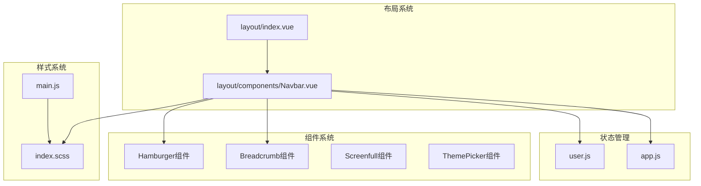
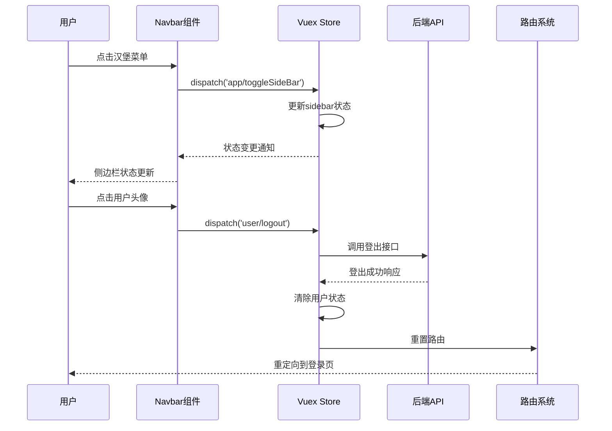
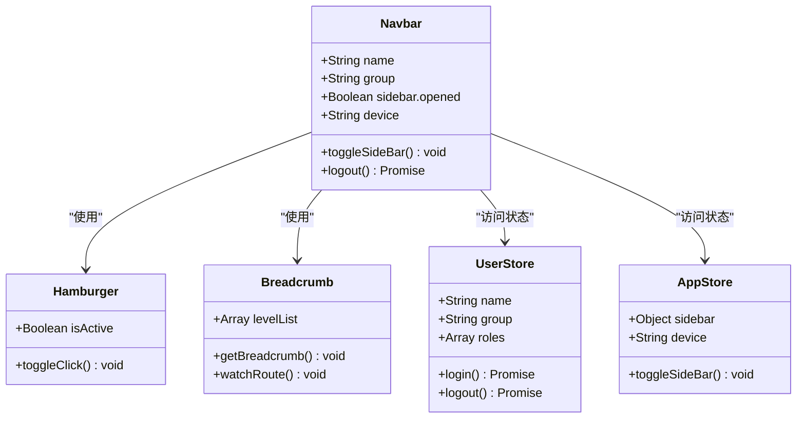
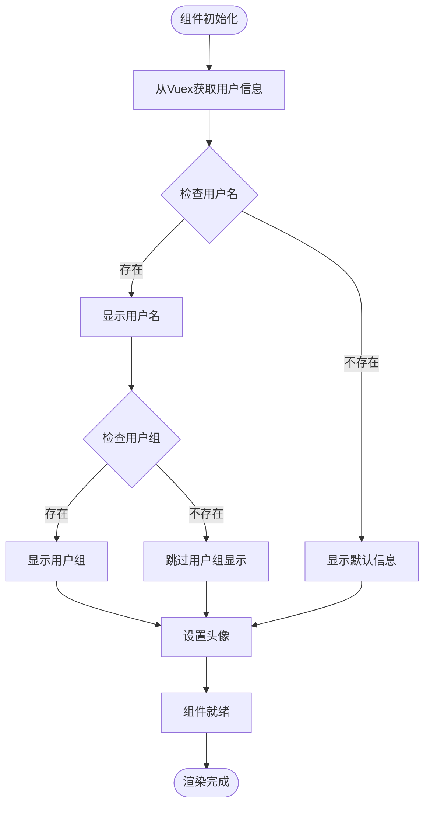
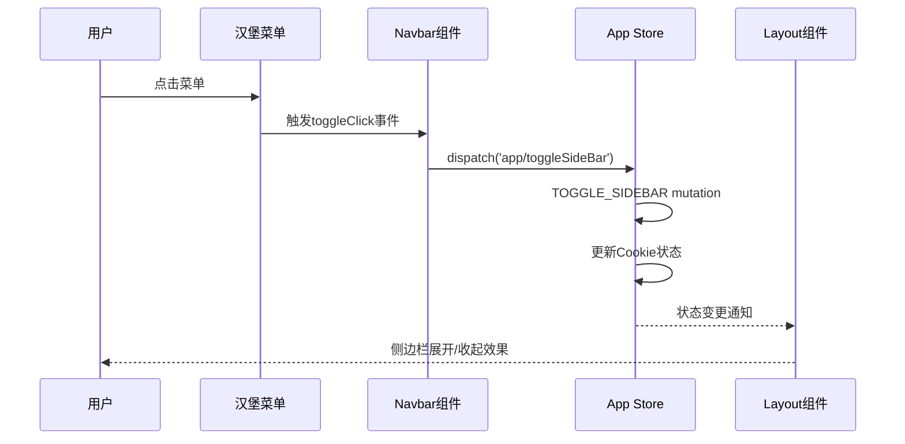
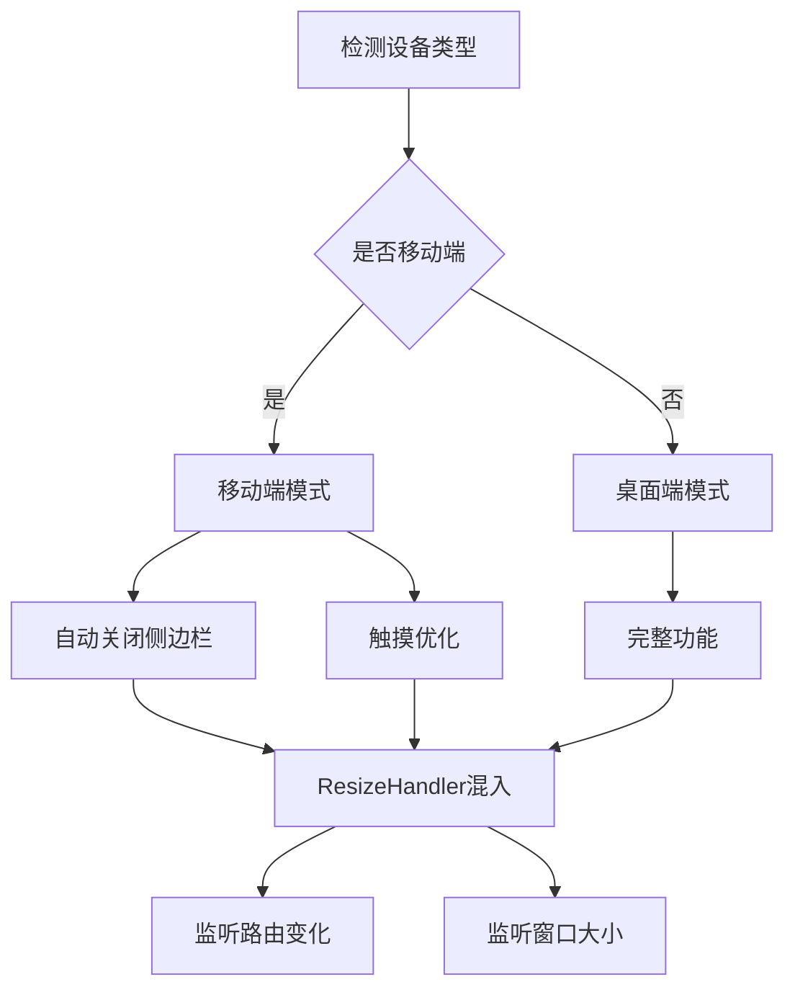
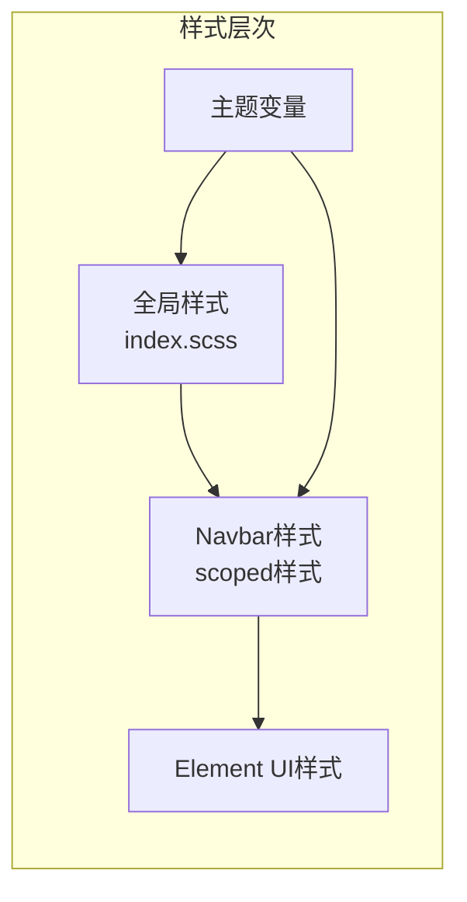
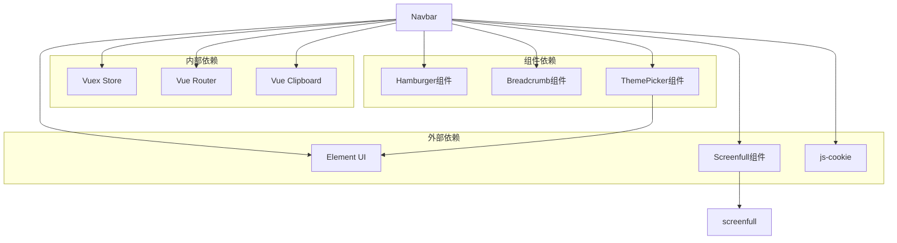

# Navbar顶部导航组件

<cite>
**本文档引用的文件**
- [Navbar.vue](file://src/layout/components/Navbar.vue)
- [user.js](file://src/store/modules/user.js)
- [app.js](file://src/store/modules/app.js)
- [index.vue](file://src/components/Hamburger/index.vue)
- [index.vue](file://src/components/Breadcrumb/index.vue)
- [ResizeHandler.js](file://src/layout/mixin/ResizeHandler.js)
- [index.vue](file://src/components/Screenfull/index.vue)
- [index.vue](file://src/components/ThemePicker/index.vue)
- [index.vue](file://src/layout/index.vue)
- [index.scss](file://src/styles/index.scss)
- [main.js](file://src/main.js)
</cite>

## 目录
1. [简介](#简介)
2. [项目结构](#项目结构)
3. [核心组件](#核心组件)
4. [架构概览](#架构概览)
5. [详细组件分析](#详细组件分析)
6. [依赖关系分析](#依赖关系分析)
7. [性能考虑](#性能考虑)
8. [故障排除指南](#故障排除指南)
9. [结论](#结论)

## 简介

Navbar顶部导航组件是Leisu Admin项目的核心界面组件之一，负责提供系统的顶部导航栏功能。该组件集成了用户信息展示、侧边栏切换、面包屑导航、用户头像下拉菜单等多个功能模块，为管理员提供了便捷的操作入口和信息展示。

## 项目结构

Navbar组件位于项目的布局系统中，采用模块化的架构设计：

**图表来源**
- [index.vue:1-124](file://src/layout/index.vue#L1-L124)
- [Navbar.vue:1-148](file://src/layout/components/Navbar.vue#L1-L148)

**章节来源**
- [index.vue:1-124](file://src/layout/index.vue#L1-L124)
- [Navbar.vue:1-148](file://src/layout/components/Navbar.vue#L1-L148)

## 核心组件

Navbar组件采用简洁而功能丰富的设计，主要包含以下核心功能模块：

### 用户信息展示模块
- **用户名显示**：实时显示当前登录用户的姓名
- **角色信息展示**：显示用户所属的用户组或角色名称
- **头像展示**：提供用户头像的可视化展示

### 导航控制模块
- **侧边栏切换**：通过汉堡菜单图标控制侧边栏的展开/收起
- **面包屑导航**：动态生成页面层级导航路径
- **设备适配**：根据设备类型自动调整布局

### 用户交互模块
- **下拉菜单**：提供用户相关的操作选项
- **退出登录**：安全地注销当前用户会话

**章节来源**
- [Navbar.vue:6-23](file://src/layout/components/Navbar.vue#L6-L23)
- [user.js:13-76](file://src/store/modules/user.js#L13-L76)

## 架构概览

Navbar组件采用了MVVM架构模式，结合Vuex状态管理和Element UI组件库：

**图表来源**
- [Navbar.vue:42-51](file://src/layout/components/Navbar.vue#L42-L51)
- [app.js:40-57](file://src/store/modules/app.js#L40-L57)
- [user.js:341-361](file://src/store/modules/user.js#L341-L361)

## 详细组件分析

### 组件结构与模板

Navbar组件采用Vue单文件组件格式，包含模板、脚本和样式三个部分：

**图表来源**
- [Navbar.vue:33-53](file://src/layout/components/Navbar.vue#L33-L53)
- [index.vue:16-30](file://src/components/Hamburger/index.vue#L16-L30)
- [index.vue:11-29](file://src/components/Breadcrumb/index.vue#L11-L29)

### 用户信息展示逻辑

用户信息的展示遵循以下流程：

**图表来源**
- [Navbar.vue:6-12](file://src/layout/components/Navbar.vue#L6-L12)
- [user.js:175-339](file://src/store/modules/user.js#L175-L339)

### 侧边栏切换机制

侧边栏切换功能通过Vuex状态管理实现：

**图表来源**
- [Navbar.vue:42-45](file://src/layout/components/Navbar.vue#L42-L45)
- [index.vue:25-29](file://src/components/Hamburger/index.vue#L25-L29)
- [app.js:13-22](file://src/store/modules/app.js#L13-L22)

### 设备响应式适配

Navbar组件实现了完整的响应式设计：

**图表来源**
- [ResizeHandler.js:28-44](file://src/layout/mixin/ResizeHandler.js#L28-L44)
- [index.vue:34-51](file://src/layout/index.vue#L34-L51)

### 样式系统与主题支持

Navbar组件的样式系统基于SCSS预处理器：

**图表来源**
- [index.scss:1-311](file://src/styles/index.scss#L1-L311)
- [Navbar.vue:56-147](file://src/layout/components/Navbar.vue#L56-L147)

**章节来源**
- [Navbar.vue:1-148](file://src/layout/components/Navbar.vue#L1-L148)
- [user.js:175-339](file://src/store/modules/user.js#L175-L339)
- [app.js:1-65](file://src/store/modules/app.js#L1-L65)
- [index.vue:1-45](file://src/components/Hamburger/index.vue#L1-L45)
- [index.vue:1-85](file://src/components/Breadcrumb/index.vue#L1-L85)
- [ResizeHandler.js:1-46](file://src/layout/mixin/ResizeHandler.js#L1-L46)

## 依赖关系分析

Navbar组件的依赖关系体现了清晰的分层架构：

**图表来源**
- [Navbar.vue:29-31](file://src/layout/components/Navbar.vue#L29-L31)
- [index.vue](file://src/components/Screenfull/index.vue#L8)
- [index.vue:1-175](file://src/components/ThemePicker/index.vue#L1-L175)

**章节来源**
- [Navbar.vue:29-31](file://src/layout/components/Navbar.vue#L29-L31)
- [index.vue:1-61](file://src/components/Screenfull/index.vue#L1-L61)
- [index.vue:1-175](file://src/components/ThemePicker/index.vue#L1-L175)

## 性能考虑

Navbar组件在设计时充分考虑了性能优化：

### 渲染优化
- **条件渲染**：使用计算属性避免不必要的DOM更新
- **事件防抖**：窗口大小变化监听采用防抖处理
- **懒加载**：组件按需加载，减少初始包体积

### 状态管理优化
- **局部状态**：只维护必要的组件状态
- **持久化存储**：使用Cookie存储侧边栏状态
- **内存管理**：组件销毁时清理事件监听器

### 样式优化
- **作用域样式**：使用scoped避免样式冲突
- **CSS变量**：支持主题动态切换
- **响应式设计**：自适应不同屏幕尺寸

## 故障排除指南

### 常见问题及解决方案

**用户信息不显示**
- 检查Vuex状态是否正确初始化
- 验证用户登录状态
- 确认API接口调用成功

**侧边栏切换失效**
- 检查Vuex action是否正确dispatch
- 验证mutation是否正确执行
- 确认Cookie设置权限

**设备适配问题**
- 检查ResizeHandler混入是否正确引入
- 验证媒体查询断点设置
- 确认CSS单位使用正确

**样式冲突问题**
- 检查scoped样式的优先级
- 验证全局样式的覆盖规则
- 确认主题变量的正确引用

**章节来源**
- [Navbar.vue:46-51](file://src/layout/components/Navbar.vue#L46-L51)
- [app.js:13-22](file://src/store/modules/app.js#L13-L22)
- [ResizeHandler.js:34-44](file://src/layout/mixin/ResizeHandler.js#L34-L44)

## 结论

Navbar顶部导航组件作为Leisu Admin项目的核心界面组件，展现了优秀的架构设计和实现质量。组件通过模块化的设计、清晰的状态管理、完善的响应式支持和良好的性能优化，为用户提供了流畅的使用体验。

组件的主要优势包括：
- **模块化设计**：功能分离明确，便于维护和扩展
- **状态管理**：采用Vuex实现集中状态管理
- **响应式支持**：完整的移动端适配方案
- **性能优化**：合理的渲染策略和资源管理
- **可扩展性**：清晰的接口设计支持功能扩展

未来可以考虑的功能增强方向：
- 添加通知中心功能
- 实现多语言支持
- 增强主题定制能力
- 优化无障碍访问支持