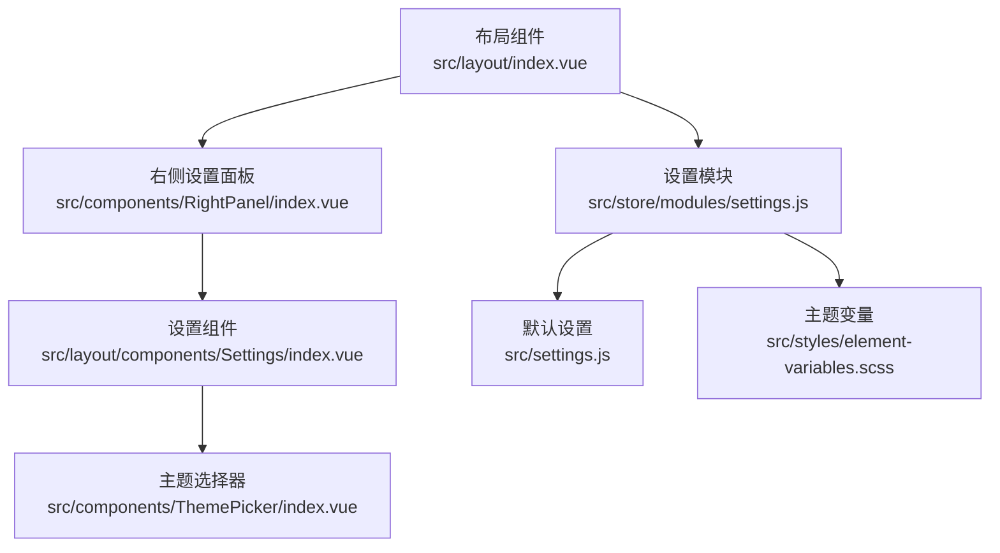
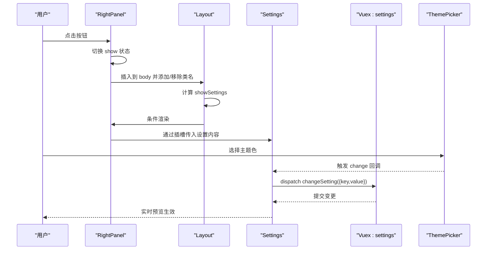
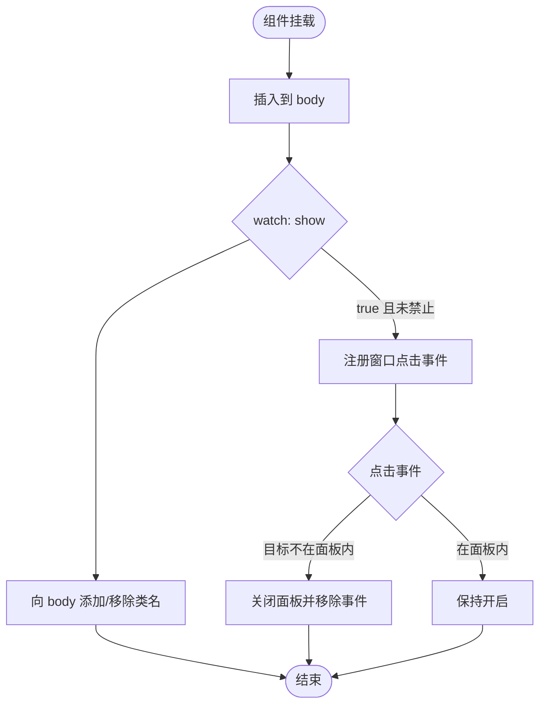
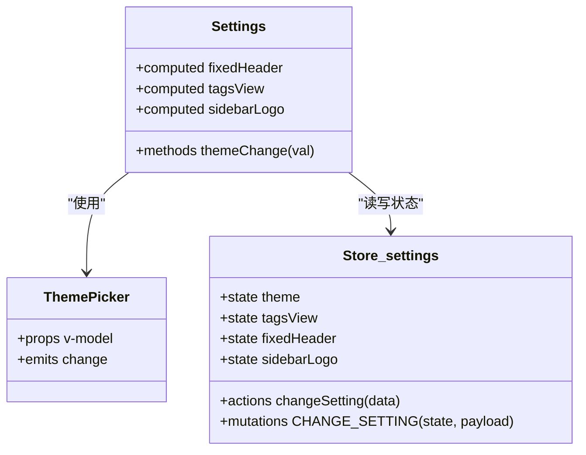
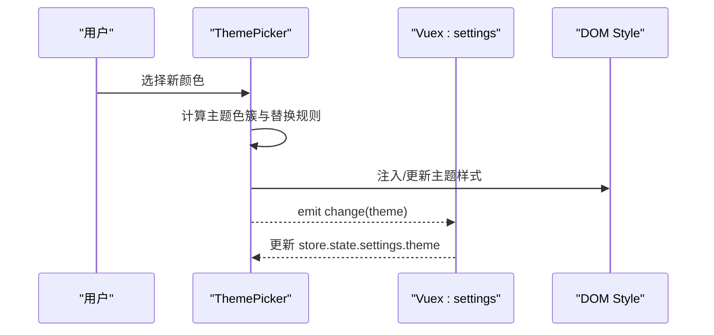
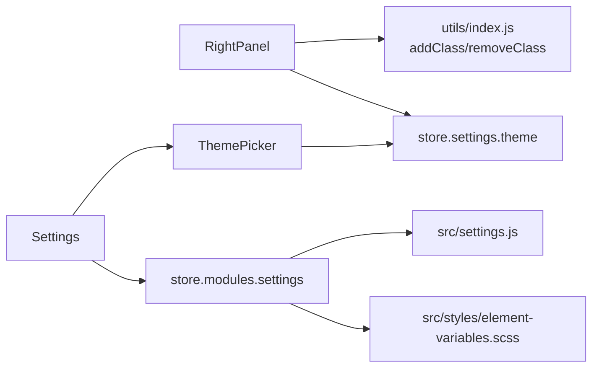

# RightPanel右侧设置面板

<cite>
**本文档引用的文件**
- [src/components/RightPanel/index.vue](file://src/components/RightPanel/index.vue)
- [src/layout/index.vue](file://src/layout/index.vue)
- [src/layout/components/Settings/index.vue](file://src/layout/components/Settings/index.vue)
- [src/store/modules/settings.js](file://src/store/modules/settings.js)
- [src/settings.js](file://src/settings.js)
- [src/styles/element-variables.scss](file://src/styles/element-variables.scss)
- [src/styles/drawer-container.scss](file://src/styles/drawer-container.scss)
- [src/components/ThemePicker/index.vue](file://src/components/ThemePicker/index.vue)
- [src/utils/index.js](file://src/utils/index.js)
</cite>

## 目录
1. [简介](#简介)
2. [项目结构](#项目结构)
3. [核心组件](#核心组件)
4. [架构总览](#架构总览)
5. [详细组件分析](#详细组件分析)
6. [依赖关系分析](#依赖关系分析)
7. [性能考虑](#性能考虑)
8. [故障排查指南](#故障排查指南)
9. [结论](#结论)
10. [附录](#附录)

## 简介
本文件系统性解析 Leisu Admin 项目的 RightPanel 右侧设置面板与 Settings 设置组件的设计与实现，覆盖以下关键主题：
- RightPanel 的显示/隐藏控制、内容渲染、交互行为与动画机制
- Settings 设置组件的主题配置、布局开关、标签页配置等模块
- 动画效果（滑入滑出、遮罩层、焦点管理）
- 数据绑定与状态管理（Vuex）、实时预览与持久化策略
- 响应式设计与移动端适配
- 样式定制、功能扩展与用户体验优化建议
- 配置选项、事件处理与最佳实践

## 项目结构
RightPanel 与 Settings 在布局层组合使用，RightPanel 作为容器承载 Settings 内容，并通过 Vuex 状态驱动其展示与行为。

图表来源
- [src/layout/index.vue:11-13](file://src/layout/index.vue#L11-L13)
- [src/components/RightPanel/index.vue:1-146](file://src/components/RightPanel/index.vue#L1-L146)
- [src/layout/components/Settings/index.vue:1-109](file://src/layout/components/Settings/index.vue#L1-L109)
- [src/store/modules/settings.js:1-35](file://src/store/modules/settings.js#L1-L35)
- [src/settings.js:1-36](file://src/settings.js#L1-L36)
- [src/styles/element-variables.scss:1-32](file://src/styles/element-variables.scss#L1-L32)

章节来源
- [src/layout/index.vue:11-13](file://src/layout/index.vue#L11-L13)
- [src/components/RightPanel/index.vue:1-146](file://src/components/RightPanel/index.vue#L1-L146)
- [src/layout/components/Settings/index.vue:1-109](file://src/layout/components/Settings/index.vue#L1-L109)
- [src/store/modules/settings.js:1-35](file://src/store/modules/settings.js#L1-L35)
- [src/settings.js:1-36](file://src/settings.js#L1-L36)
- [src/styles/element-variables.scss:1-32](file://src/styles/element-variables.scss#L1-L32)

## 核心组件
- RightPanel：负责右侧抽屉式设置面板的挂载、显示/隐藏、点击外部关闭、遮罩层与滚动锁定等交互。
- Settings：提供主题色、标签页、固定头部、侧边栏 Logo 等设置项的双向绑定与变更分发。
- ThemePicker：基于 Element-UI 主题变量的动态主题编译与注入，支持预定义颜色与实时编译提示。
- Store(settings)：集中管理页面样式与布局相关配置的状态、变更动作与持久化策略。
- 全局设置与主题变量：提供默认开关值与 SCSS 主题变量导出，供组件读取与主题切换使用。

章节来源
- [src/components/RightPanel/index.vue:18-76](file://src/components/RightPanel/index.vue#L18-L76)
- [src/layout/components/Settings/index.vue:30-81](file://src/layout/components/Settings/index.vue#L30-L81)
- [src/components/ThemePicker/index.vue:14-156](file://src/components/ThemePicker/index.vue#L14-L156)
- [src/store/modules/settings.js:6-33](file://src/store/modules/settings.js#L6-L33)
- [src/settings.js:1-36](file://src/settings.js#L1-L36)
- [src/styles/element-variables.scss:29-31](file://src/styles/element-variables.scss#L29-L31)

## 架构总览
RightPanel 作为容器组件，通过插槽接收 Settings 内容；Layout 层根据 settings 模块的 showSettings 控制是否渲染 RightPanel；Settings 通过计算属性与 Vuex 动作完成对主题与布局的即时修改。

图表来源
- [src/layout/index.vue:11-13](file://src/layout/index.vue#L11-L13)
- [src/components/RightPanel/index.vue:40-50](file://src/components/RightPanel/index.vue#L40-L50)
- [src/layout/components/Settings/index.vue:74-79](file://src/layout/components/Settings/index.vue#L74-L79)
- [src/store/modules/settings.js:22-25](file://src/store/modules/settings.js#L22-L25)

## 详细组件分析

### RightPanel 组件分析
- 设计要点
  - 使用 fixed 定位与 transform 实现从右侧滑入/滑出，配合透明遮罩层增强层级感。
  - 通过监听 show 状态在首次打开时注册窗口点击事件，实现“点击外部关闭”。
  - 打开时向 body 添加类名以禁用主区域滚动并微调宽度，避免滚动条跳变。
  - 支持自定义按钮位置与是否阻止点击外部关闭。
- 关键数据与方法
  - props: clickNotClose（是否阻止点击外部关闭）、buttonTop（按钮垂直定位）。
  - data: show（面板显隐状态）。
  - computed: theme（从 store 获取当前主题色，用于按钮背景）。
  - methods: addEventClick、closeSidebar（外部点击关闭逻辑）、insertToBody（将面板插入到 body 第一个子节点）。
- 样式与动画
  - 面板初始 transform 为向右偏移，show 类下恢复原位。
  - 遮罩层透明度从 0 变为 1，z-index 层级高于面板背景但低于面板本身，保证点击穿透与视觉层次。
  - 打开/关闭均采用缓动曲线，提升触感与一致性。

图表来源
- [src/components/RightPanel/index.vue:52-75](file://src/components/RightPanel/index.vue#L52-L75)
- [src/components/RightPanel/index.vue:40-50](file://src/components/RightPanel/index.vue#L40-L50)
- [src/utils/index.js:324-338](file://src/utils/index.js#L324-L338)

章节来源
- [src/components/RightPanel/index.vue:18-76](file://src/components/RightPanel/index.vue#L18-L76)
- [src/utils/index.js:324-338](file://src/utils/index.js#L324-L338)

### Settings 设置组件分析
- 功能模块
  - 主题色：通过 ThemePicker 组件选择颜色，派发 changeSetting 动作更新 theme。
  - 标签页：开关 tagsView，影响顶部标签页视图是否显示。
  - 固定头部：开关 fixedHeader，决定导航栏是否固定。
  - 侧边栏 Logo：开关 sidebarLogo，控制侧边栏品牌 Logo 显示。
- 数据绑定与状态管理
  - 使用计算属性的 get/set 形式，实现 v-model 的双向绑定。
  - set 中统一 dispatch('settings/changeSetting', { key, value })，由 store 写入 state。
- 渲染与布局
  - 使用 SCSS 作用域样式，提供抽屉式容器与标题、开关项的基础排版。
  - 抽屉容器样式可结合全局 drawer-container.scss 进行扩展。

图表来源
- [src/layout/components/Settings/index.vue:30-81](file://src/layout/components/Settings/index.vue#L30-L81)
- [src/components/ThemePicker/index.vue:14-156](file://src/components/ThemePicker/index.vue#L14-L156)
- [src/store/modules/settings.js:6-33](file://src/store/modules/settings.js#L6-L33)

章节来源
- [src/layout/components/Settings/index.vue:1-109](file://src/layout/components/Settings/index.vue#L1-L109)
- [src/styles/drawer-container.scss:1-31](file://src/styles/drawer-container.scss#L1-L31)

### ThemePicker 主题选择器分析
- 实现机制
  - 读取当前主题色，默认值来自 store.settings.theme。
  - 监听主题色变化，异步拉取 Element-UI 的主题样式文本，生成主题色簇，替换已有样式中的颜色值。
  - 动态创建或复用 style 标签，注入编译后的主题样式。
  - 发出 change 事件，通知上层组件（Settings）进行状态同步。
- 性能与体验
  - 编译过程通过消息提示告知用户，避免界面卡顿感知。
  - 使用预定义颜色列表，减少无效请求与样式污染。
- 与全局主题变量的关系
  - 默认主题变量由 element-variables.scss 导出，供组件读取与主题切换使用。

图表来源
- [src/components/ThemePicker/index.vue:26-86](file://src/components/ThemePicker/index.vue#L26-L86)
- [src/store/modules/settings.js:14-19](file://src/store/modules/settings.js#L14-L19)
- [src/styles/element-variables.scss:29-31](file://src/styles/element-variables.scss#L29-L31)

章节来源
- [src/components/ThemePicker/index.vue:14-156](file://src/components/ThemePicker/index.vue#L14-L156)
- [src/store/modules/settings.js:14-19](file://src/store/modules/settings.js#L14-L19)
- [src/styles/element-variables.scss:29-31](file://src/styles/element-variables.scss#L29-L31)

### 布局集成与条件渲染
- Layout 层通过 mapState 读取 settings 模块的 showSettings，决定是否渲染 RightPanel。
- RightPanel 通过插槽接收 Settings 内容，形成“容器-内容”的组合模式。
- 该模式便于扩展更多设置项或替换为其他设置面板。

章节来源
- [src/layout/index.vue:35-42](file://src/layout/index.vue#L35-L42)
- [src/layout/index.vue:11-13](file://src/layout/index.vue#L11-L13)

## 依赖关系分析
- RightPanel 依赖
  - 工具函数 addClass/removeClass（用于 body 滚动控制）。
  - store.settings.theme（用于按钮背景色）。
- Settings 依赖
  - ThemePicker（主题选择）。
  - store.settings（读取与写入各项设置）。
- ThemePicker 依赖
  - Element-UI 版本号与主题样式资源。
  - store.settings.theme（作为默认主题色）。
- Store(settings) 依赖
  - 默认设置 src/settings.js。
  - 主题变量导出 src/styles/element-variables.scss。

图表来源
- [src/components/RightPanel/index.vue:16](file://src/components/RightPanel/index.vue#L16)
- [src/utils/index.js:324-338](file://src/utils/index.js#L324-L338)
- [src/layout/components/Settings/index.vue:31](file://src/layout/components/Settings/index.vue#L31)
- [src/components/ThemePicker/index.vue:11](file://src/components/ThemePicker/index.vue#L11)
- [src/store/modules/settings.js:4](file://src/store/modules/settings.js#L4)
- [src/styles/element-variables.scss:29-31](file://src/styles/element-variables.scss#L29-L31)

章节来源
- [src/components/RightPanel/index.vue:16](file://src/components/RightPanel/index.vue#L16)
- [src/utils/index.js:324-338](file://src/utils/index.js#L324-L338)
- [src/layout/components/Settings/index.vue:31](file://src/layout/components/Settings/index.vue#L31)
- [src/components/ThemePicker/index.vue:11](file://src/components/ThemePicker/index.vue#L11)
- [src/store/modules/settings.js:4](file://src/store/modules/settings.js#L4)
- [src/styles/element-variables.scss:29-31](file://src/styles/element-variables.scss#L29-L31)

## 性能考虑
- 动画性能
  - transform 与 opacity 的 GPU 加速路径更优，RightPanel 的 transform 与遮罩层透明度过渡使用缓动曲线，保证流畅度。
- 样式注入
  - ThemePicker 仅在主题变更时注入/更新 style 标签，避免重复编译与 DOM 抖动。
- 事件绑定
  - 仅在面板打开且允许时注册窗口点击事件，关闭后及时移除，降低全局事件开销。
- 滚动优化
  - 通过向 body 添加类名控制滚动，避免频繁重排与滚动条宽度变化带来的布局抖动。

[本节为通用性能讨论，不直接分析具体文件]

## 故障排查指南
- 面板无法关闭
  - 检查 props clickNotClose 是否为 true，导致阻止了外部点击关闭。
  - 确认窗口点击事件是否被正确移除。
- 遮罩层不显示
  - 确认 show 类是否正确应用，以及遮罩层 z-index 与透明度过渡是否生效。
- 主题切换无效
  - 检查 store.settings.theme 是否被成功更新，ThemePicker 是否正确注入样式。
  - 确认 element-variables.scss 的主题变量导出是否可用。
- 移动端滚动异常
  - 确认 body 类名添加/移除逻辑是否执行，避免主区域滚动被错误锁定。

章节来源
- [src/components/RightPanel/index.vue:20-28](file://src/components/RightPanel/index.vue#L20-L28)
- [src/components/RightPanel/index.vue:60-69](file://src/components/RightPanel/index.vue#L60-L69)
- [src/components/ThemePicker/index.vue:82](file://src/components/ThemePicker/index.vue#L82)
- [src/styles/element-variables.scss:29-31](file://src/styles/element-variables.scss#L29-L31)

## 结论
RightPanel 与 Settings 通过清晰的职责分离与统一的状态管理，实现了灵活、可扩展的右侧设置面板方案。RightPanel 负责交互与动画，Settings 负责配置项与状态写入，ThemePicker 提供主题动态编译能力。整体架构具备良好的可维护性与扩展性，适合在复杂后台系统中持续演进。

[本节为总结性内容，不直接分析具体文件]

## 附录

### 配置选项与事件
- RightPanel
  - props
    - clickNotClose: 是否阻止点击外部关闭（布尔）
    - buttonTop: 按钮垂直位置（数值）
  - 事件
    - 无直接对外事件，内部通过关闭逻辑与 body 类名控制实现交互
- Settings
  - 事件
    - themeChange: 当主题色改变时触发（由 ThemePicker 发出）

章节来源
- [src/components/RightPanel/index.vue:20-28](file://src/components/RightPanel/index.vue#L20-L28)
- [src/layout/components/Settings/index.vue:74-79](file://src/layout/components/Settings/index.vue#L74-L79)

### 最佳实践
- 将设置项按功能拆分至多个子组件，通过插槽组合，提升可维护性。
- 对于高频变更的设置（如主题），尽量采用局部样式注入而非全量刷新。
- 在移动端优先使用 transform 进行显隐控制，避免阻塞主线程。
- 为设置项提供默认值与回退策略，确保在不同环境下的稳定性。

[本节为通用实践建议，不直接分析具体文件]