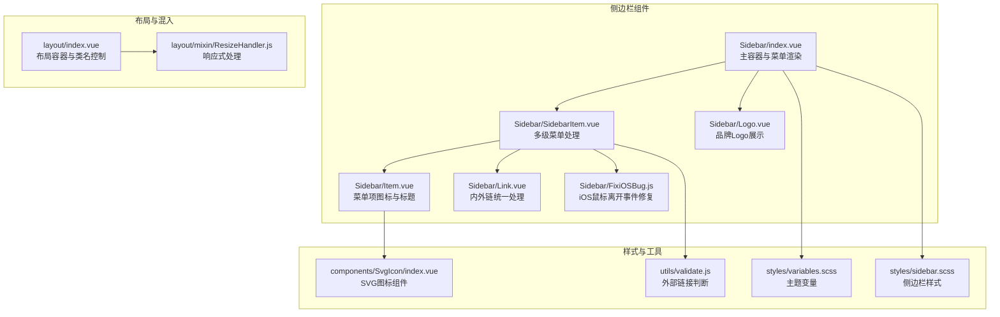
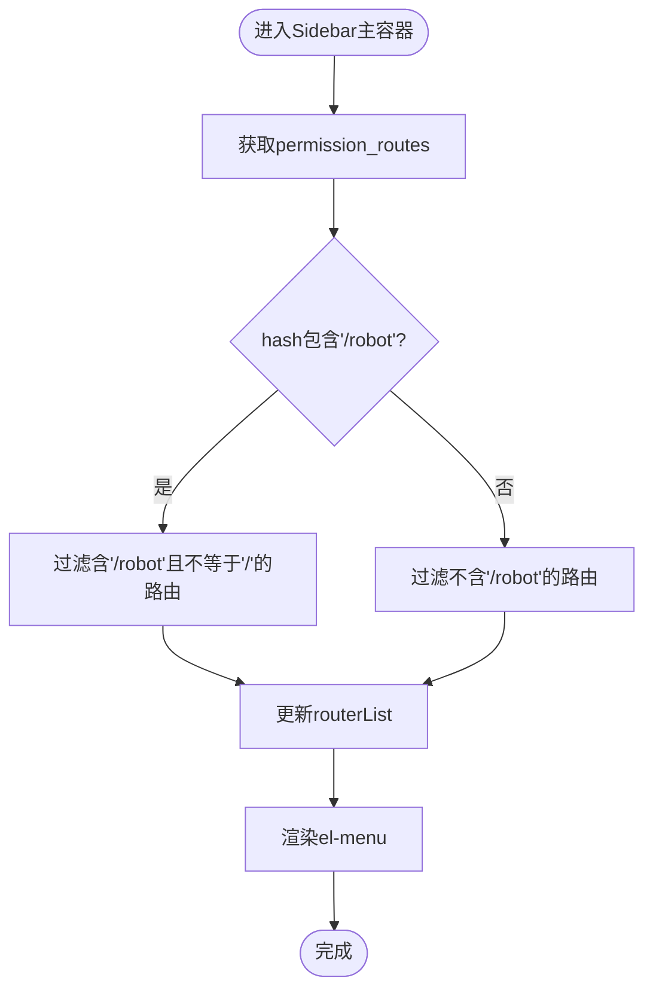
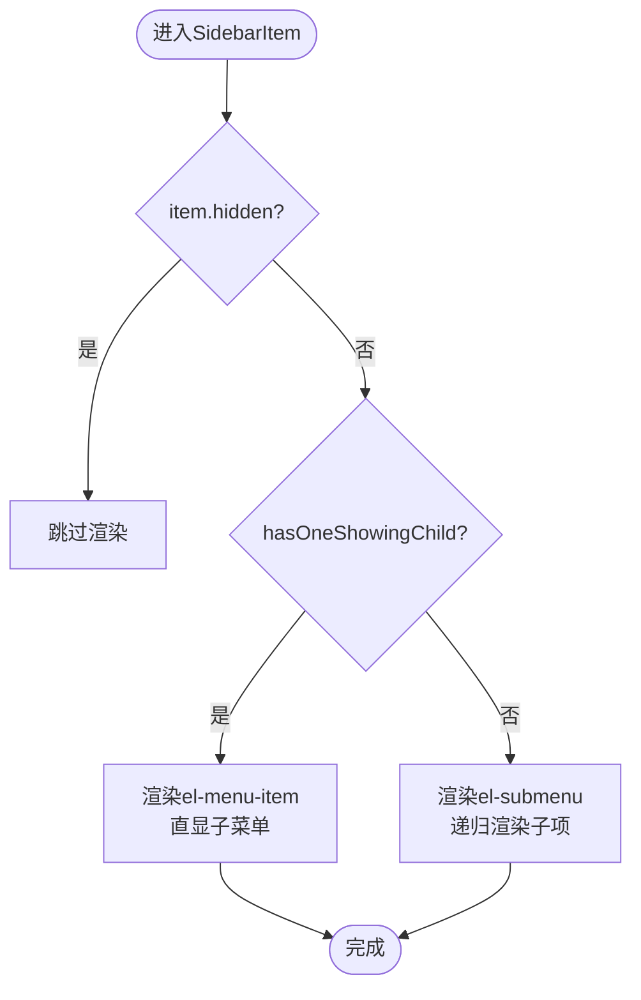
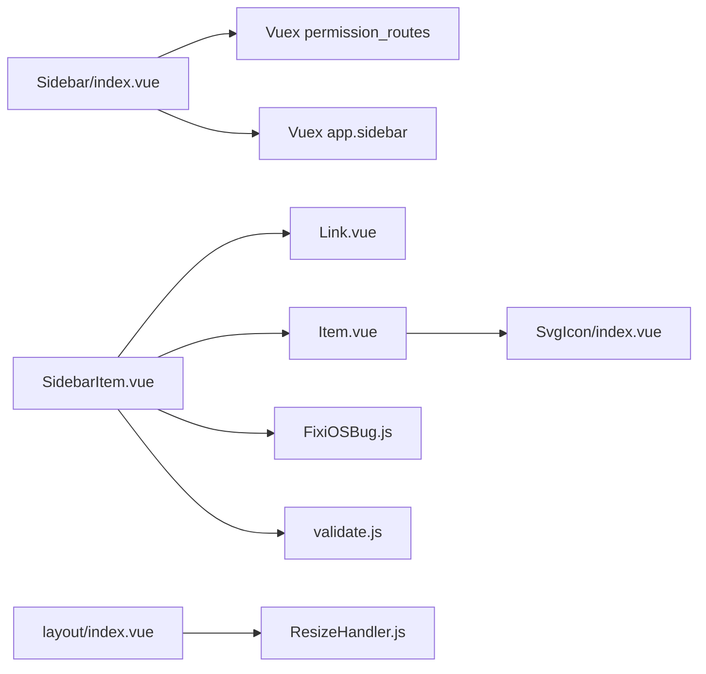

# Sidebar侧边栏组件

<cite>
**本文档引用的文件**
- [index.vue](file://src/layout/components/Sidebar/index.vue)
- [SidebarItem.vue](file://src/layout/components/Sidebar/SidebarItem.vue)
- [Item.vue](file://src/layout/components/Sidebar/Item.vue)
- [FixiOSBug.js](file://src/layout/components/Sidebar/FixiOSBug.js)
- [Logo.vue](file://src/layout/components/Sidebar/Logo.vue)
- [Link.vue](file://src/layout/components/Sidebar/Link.vue)
- [sidebar.scss](file://src/styles/sidebar.scss)
- [variables.scss](file://src/styles/variables.scss)
- [ResizeHandler.js](file://src/layout/mixin/ResizeHandler.js)
- [index.vue](file://src/layout/index.vue)
- [validate.js](file://src/utils/validate.js)
- [SvgIcon/index.vue](file://src/components/SvgIcon/index.vue)
</cite>

## 目录
1. [简介](#简介)
2. [项目结构](#项目结构)
3. [核心组件](#核心组件)
4. [架构总览](#架构总览)
5. [详细组件分析](#详细组件分析)
6. [依赖关系分析](#依赖关系分析)
7. [性能考虑](#性能考虑)
8. [故障排除指南](#故障排除指南)
9. [结论](#结论)
10. [附录](#附录)

## 简介
本文件为 Leisu Admin 项目的 Sidebar 侧边栏组件提供系统化技术文档。重点解析：
- 菜单项渲染与路由导航机制
- 权限控制与动态菜单生成
- 移动端适配与响应式设计
- SidebarItem 子组件的多级菜单处理、图标显示与激活状态管理
- Item 组件的交互逻辑（点击事件、路由跳转、菜单展开收起）
- FixiOSBug.js 的 iOS 兼容性处理方案
- Logo 组件的品牌展示功能
- 侧边栏配置选项、样式定制与最佳实践

## 项目结构
Sidebar 组件位于布局层的侧边栏目录中，采用模块化设计，由多个子组件协同完成菜单渲染、链接处理、图标显示与兼容性修复。



图表来源
- [index.vue:1-82](file://src/layout/components/Sidebar/index.vue#L1-L82)
- [SidebarItem.vue:1-206](file://src/layout/components/Sidebar/SidebarItem.vue#L1-L206)
- [Item.vue:1-30](file://src/layout/components/Sidebar/Item.vue#L1-L30)
- [Link.vue:1-37](file://src/layout/components/Sidebar/Link.vue#L1-L37)
- [Logo.vue:1-77](file://src/layout/components/Sidebar/Logo.vue#L1-L77)
- [FixiOSBug.js:1-27](file://src/layout/components/Sidebar/FixiOSBug.js#L1-L27)
- [sidebar.scss:1-210](file://src/styles/sidebar.scss#L1-L210)
- [variables.scss:1-36](file://src/styles/variables.scss#L1-L36)
- [validate.js:1-88](file://src/utils/validate.js#L1-L88)
- [SvgIcon/index.vue:1-63](file://src/components/SvgIcon/index.vue#L1-L63)
- [index.vue:1-124](file://src/layout/index.vue#L1-L124)
- [ResizeHandler.js:1-46](file://src/layout/mixin/ResizeHandler.js#L1-L46)

章节来源
- [index.vue:1-82](file://src/layout/components/Sidebar/index.vue#L1-L82)
- [sidebar.scss:1-210](file://src/styles/sidebar.scss#L1-L210)

## 核心组件
- Sidebar 主容器：负责菜单数据源、激活态计算、折叠状态与动态路由过滤。
- SidebarItem：递归渲染菜单树，处理单子菜单直显、多子菜单下拉、外部链接与内部路由跳转、收藏功能。
- Item：函数式组件，统一渲染图标与标题。
- Link：根据是否外部链接选择 router-link 或 a 标签。
- Logo：品牌 Logo 展示，支持折叠动画。
- FixiOSBug：修复 iOS 设备上 SubMenu 鼠标离开触发问题。

章节来源
- [index.vue:21-82](file://src/layout/components/Sidebar/index.vue#L21-L82)
- [SidebarItem.vue:55-206](file://src/layout/components/Sidebar/SidebarItem.vue#L55-L206)
- [Item.vue:1-30](file://src/layout/components/Sidebar/Item.vue#L1-L30)
- [Link.vue:1-37](file://src/layout/components/Sidebar/Link.vue#L1-L37)
- [Logo.vue:1-77](file://src/layout/components/Sidebar/Logo.vue#L1-L77)
- [FixiOSBug.js:1-27](file://src/layout/components/Sidebar/FixiOSBug.js#L1-L27)

## 架构总览
Sidebar 的整体工作流如下：
- 布局容器根据设备类型与侧边栏状态设置类名，控制样式与动画。
- Sidebar 主容器从 Vuex 获取权限路由表，按当前路由路径进行过滤，决定显示机器人相关或非机器人菜单。
- 渲染时通过 SidebarItem 递归处理路由树，根据条件选择直显或下拉模式。
- Link 统一处理内外链，Item 负责图标与标题渲染，FixiOSBug 修复特定平台交互问题。

```mermaid
sequenceDiagram
participant Layout as "布局容器"
participant Sidebar as "Sidebar主容器"
participant Store as "Vuex"
participant Router as "路由表"
participant Item as "SidebarItem"
participant Link as "Link"
participant Menu as "Element菜单"
Layout->>Sidebar : 初始化
Sidebar->>Store : 读取permission_routes
Sidebar->>Router : 过滤机器人/非机器人路由
Sidebar->>Menu : 渲染el-menu
Menu->>Item : 传入路由对象
Item->>Link : 判断是否外部链接
Link-->>Item : 返回router-link或a标签
Item-->>Menu : 渲染图标与标题
Note over Sidebar,Item : 多级菜单递归渲染
```

图表来源
- [index.vue:55-79](file://src/layout/components/Sidebar/index.vue#L55-L79)
- [SidebarItem.vue:124-161](file://src/layout/components/Sidebar/SidebarItem.vue#L124-L161)
- [Link.vue:19-34](file://src/layout/components/Sidebar/Link.vue#L19-L34)
- [index.vue:1-124](file://src/layout/index.vue#L1-L124)

## 详细组件分析

### Sidebar 主容器（index.vue）
- 功能要点
  - 计算激活菜单：优先使用路由 meta.activeMenu，否则使用当前路径。
  - 折叠状态：基于 store.app.sidebar.opened 控制。
  - 动态路由过滤：根据当前 hash 是否包含“/robot”决定过滤结果。
  - 菜单样式：绑定主题变量，关闭垂直折叠过渡以提升性能。
- 关键属性与方法
  - activeMenu：激活态计算。
  - isCollapse：折叠状态映射。
  - routerSwitch：路由列表过滤与更新。
  - watch：监听路由变化，实时刷新菜单。



图表来源
- [index.vue:55-79](file://src/layout/components/Sidebar/index.vue#L55-L79)

章节来源
- [index.vue:21-82](file://src/layout/components/Sidebar/index.vue#L21-L82)

### SidebarItem 子组件（SidebarItem.vue）
- 功能要点
  - 单子菜单直显：当仅有一个可见子菜单时，直接渲染为 el-menu-item。
  - 多子菜单下拉：使用 el-submenu，并递归渲染子项。
  - 外链与内链：通过 isExternal 判断，分别渲染 a 标签或 router-link。
  - 收藏功能：本地存储用户收藏的菜单项，支持添加与移除。
  - iOS 兼容：通过 mixin 修复鼠标离开事件在移动设备上的异常。
- 关键算法
  - hasOneShowingChild：筛选可见子菜单，用于决定直显或下拉。
  - resolvePath：拼接基础路径与子路径，支持外部链接直接返回。
- 数据与状态
  - myfavds：本地收藏缓存。
  - is_in_flag：当前项是否已收藏。
  - onlyOneChild：临时存储唯一子菜单。



图表来源
- [SidebarItem.vue:124-147](file://src/layout/components/Sidebar/SidebarItem.vue#L124-L147)

章节来源
- [SidebarItem.vue:55-206](file://src/layout/components/Sidebar/SidebarItem.vue#L55-L206)
- [validate.js:9-11](file://src/utils/validate.js#L9-L11)

### Item 函数式组件（Item.vue）
- 功能要点
  - 接收 icon 与 title 属性。
  - 若存在 icon，则渲染 SvgIcon；若存在 title，则渲染标题文本。
  - 使用 render 函数实现轻量渲染。
- 交互逻辑
  - 作为纯展示组件，无事件处理，点击事件由父组件处理。

章节来源
- [Item.vue:1-30](file://src/layout/components/Sidebar/Item.vue#L1-L30)
- [SvgIcon/index.vue:1-63](file://src/components/SvgIcon/index.vue#L1-L63)

### Link 组件（Link.vue）
- 功能要点
  - 根据是否外部链接动态选择渲染组件：
    - 外部链接：渲染 a 标签（target="_blank"，rel="noopener"）。
    - 内部链接：渲染 router-link。
- 适用场景
  - 在 SidebarItem 中统一处理内外链跳转，避免重复判断。

章节来源
- [Link.vue:1-37](file://src/layout/components/Sidebar/Link.vue#L1-L37)
- [validate.js:9-11](file://src/utils/validate.js#L9-L11)

### FixiOSBug 混入（FixiOSBug.js）
- 功能要点
  - 在 mounted 生命周期中重写 SubMenu 的 handleMouseleave 方法。
  - 当设备为 mobile 时，阻止默认的鼠标离开行为，避免误触导致菜单关闭。
- 作用范围
  - 仅影响 SubMenu 的鼠标离开事件，不影响其他交互。

章节来源
- [FixiOSBug.js:1-27](file://src/layout/components/Sidebar/FixiOSBug.js#L1-L27)

### Logo 组件（Logo.vue）
- 功能要点
  - 折叠状态下使用过渡动画显示/隐藏。
  - 支持通过 to="/" 实现首页跳转。
  - 样式包含折叠时的布局调整。
- 与主容器的关系
  - Sidebar 主容器根据 settings.sidebarLogo 决定是否渲染 Logo。

章节来源
- [Logo.vue:1-77](file://src/layout/components/Sidebar/Logo.vue#L1-L77)

### 样式与主题（sidebar.scss、variables.scss）
- 样式要点
  - 固定定位与尺寸控制，支持折叠与展开动画。
  - 滚动条样式与 hover 效果。
  - 移动端响应式：transform 与 pointer-events 控制抽屉效果。
  - 嵌套菜单样式：子菜单背景色与悬停效果。
- 主题变量
  - 菜单背景、文字颜色、激活态颜色、子菜单颜色等。
  - 侧边栏宽度与过渡时间。

章节来源
- [sidebar.scss:1-210](file://src/styles/sidebar.scss#L1-L210)
- [variables.scss:1-36](file://src/styles/variables.scss#L1-L36)

### 响应式与布局（ResizeHandler.js、layout/index.vue）
- ResizeHandler 混入
  - 监听窗口 resize 事件，自动切换设备类型（mobile/desktop）。
  - 移动端自动关闭侧边栏，避免遮挡内容。
- 布局容器
  - 根据 sidebar.opened 与 device 设置类名，控制侧边栏与主内容区域的宽度与位置。
  - 移动端点击遮罩关闭侧边栏。

章节来源
- [ResizeHandler.js:1-46](file://src/layout/mixin/ResizeHandler.js#L1-L46)
- [index.vue:1-124](file://src/layout/index.vue#L1-L124)

## 依赖关系分析
- 组件耦合
  - Sidebar 主容器依赖 Vuex 的 permission_routes 与 app.sidebar。
  - SidebarItem 依赖 Link、Item、FixiOSBug 与 validate 工具。
  - Item 依赖 SvgIcon 组件。
- 外部依赖
  - Element UI 的 el-menu、el-submenu、el-scrollbar。
  - Vue Router 的 router-link。
  - SCSS 变量与样式文件。



图表来源
- [index.vue:22-54](file://src/layout/components/Sidebar/index.vue#L22-L54)
- [SidebarItem.vue:57-65](file://src/layout/components/Sidebar/SidebarItem.vue#L57-L65)
- [Item.vue:1-30](file://src/layout/components/Sidebar/Item.vue#L1-L30)
- [Link.vue:1-37](file://src/layout/components/Sidebar/Link.vue#L1-L37)
- [FixiOSBug.js:1-27](file://src/layout/components/Sidebar/FixiOSBug.js#L1-L27)
- [validate.js:1-88](file://src/utils/validate.js#L1-L88)
- [SvgIcon/index.vue:1-63](file://src/components/SvgIcon/index.vue#L1-L63)
- [index.vue:1-124](file://src/layout/index.vue#L1-L124)
- [ResizeHandler.js:1-46](file://src/layout/mixin/ResizeHandler.js#L1-L46)

## 性能考虑
- 菜单渲染优化
  - 关闭 el-menu 折叠过渡（collapse-transition=false），减少动画开销。
  - 仅在必要时重新计算 routerList，避免频繁过滤。
- 图标渲染
  - Item 为函数式组件，render 函数轻量高效。
  - SvgIcon 使用 use 标签复用 SVG 定义，减少 DOM 结构。
- 移动端体验
  - 移动端自动关闭侧边栏，避免不必要的层级叠加。
  - iOS 兼容性修复避免误触导致的菜单异常关闭。

[本节为通用性能建议，无需具体文件分析]

## 故障排除指南
- iOS 下拉菜单异常关闭
  - 现象：点击菜单项后菜单意外关闭。
  - 解决：确保 SidebarItem 混入了 FixiOSBug，其 mounted 时会重写 handleMouseleave。
- 外链无法打开新窗口
  - 现象：点击外部链接未在新窗口打开。
  - 解决：确认 Link.vue 的 isExternal 判断与 linkProps 返回值正确。
- 菜单不随路由变化更新
  - 现象：切换路由后菜单未刷新。
  - 解决：检查 Sidebar 主容器的 watch 对 $route.path 的监听与 routerSwitch 调用。
- Logo 不显示
  - 现象：侧边栏顶部无 Logo。
  - 解决：确认 settings.sidebarLogo 为 true，且 Logo 组件被正确引入。

章节来源
- [FixiOSBug.js:7-24](file://src/layout/components/Sidebar/FixiOSBug.js#L7-L24)
- [Link.vue:19-34](file://src/layout/components/Sidebar/Link.vue#L19-L34)
- [index.vue:74-79](file://src/layout/components/Sidebar/index.vue#L74-L79)
- [Logo.vue:1-77](file://src/layout/components/Sidebar/Logo.vue#L1-L77)

## 结论
Sidebar 侧边栏组件通过清晰的职责划分与模块化设计，实现了：
- 动态菜单渲染与权限控制
- 多级菜单的递归处理与图标展示
- 内外链统一跳转与激活态管理
- iOS 兼容性修复与移动端响应式适配
- 可定制的主题样式与布局控制

该组件体系具备良好的扩展性与可维护性，适合在复杂后台管理系统中作为核心导航组件使用。

[本节为总结性内容，无需具体文件分析]

## 附录

### 配置选项与样式定制
- 主题变量
  - 菜单文字颜色、激活颜色、背景色、子菜单颜色等。
  - 侧边栏宽度与过渡时间。
- 样式覆盖
  - 通过 sidebar.scss 覆盖 Element UI 默认样式。
  - 折叠状态下的图标间距与箭头显示控制。
- 响应式参数
  - 移动端断点与抽屉式侧边栏行为。

章节来源
- [variables.scss:11-22](file://src/styles/variables.scss#L11-L22)
- [sidebar.scss:10-87](file://src/styles/sidebar.scss#L10-L87)
- [ResizeHandler.js:3-4](file://src/layout/mixin/ResizeHandler.js#L3-L4)

### 最佳实践
- 菜单结构设计
  - 合理组织 meta.icon 与 meta.title，确保图标与标题一致。
  - 对于多级菜单，避免过度嵌套，保持可读性。
- 权限控制
  - 使用 meta.roles 控制菜单可见性，结合权限模块生成路由表。
- 性能优化
  - 避免在菜单渲染中执行重型计算，尽量使用计算属性与缓存。
  - 合理使用折叠状态与过渡动画，减少不必要的重排重绘。
- 兼容性
  - 在 iOS 设备上测试 SubMenu 行为，确保 FixiOSBug 生效。
  - 外链跳转时设置 rel="noopener"，防止安全风险。

[本节为通用最佳实践，无需具体文件分析]