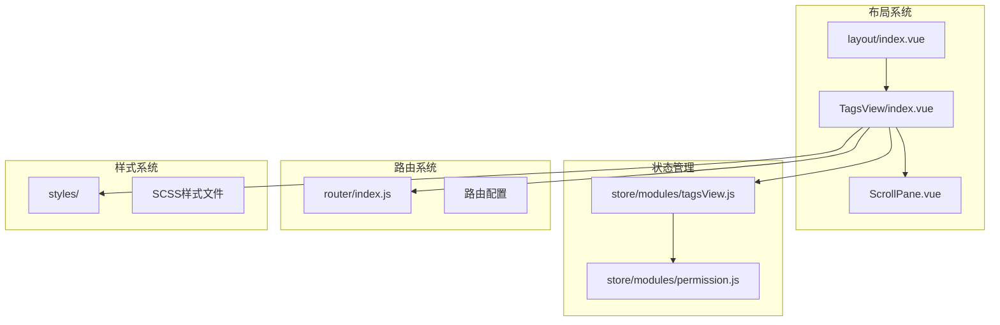
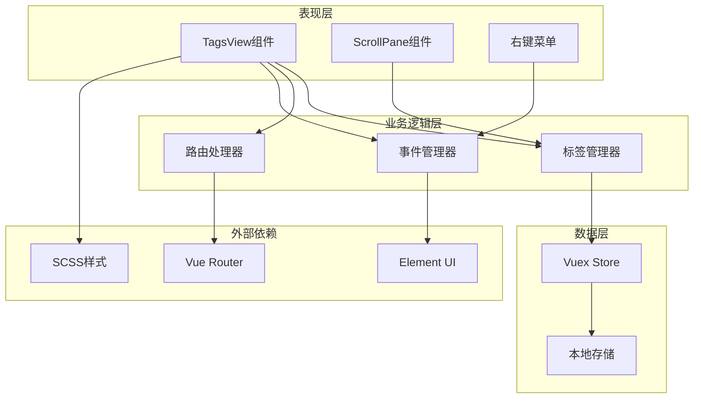
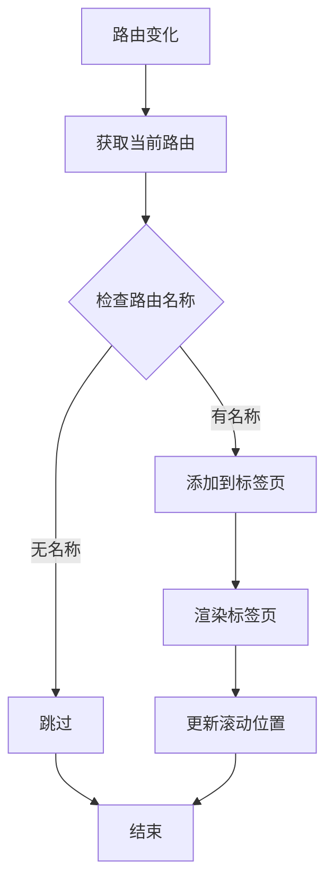
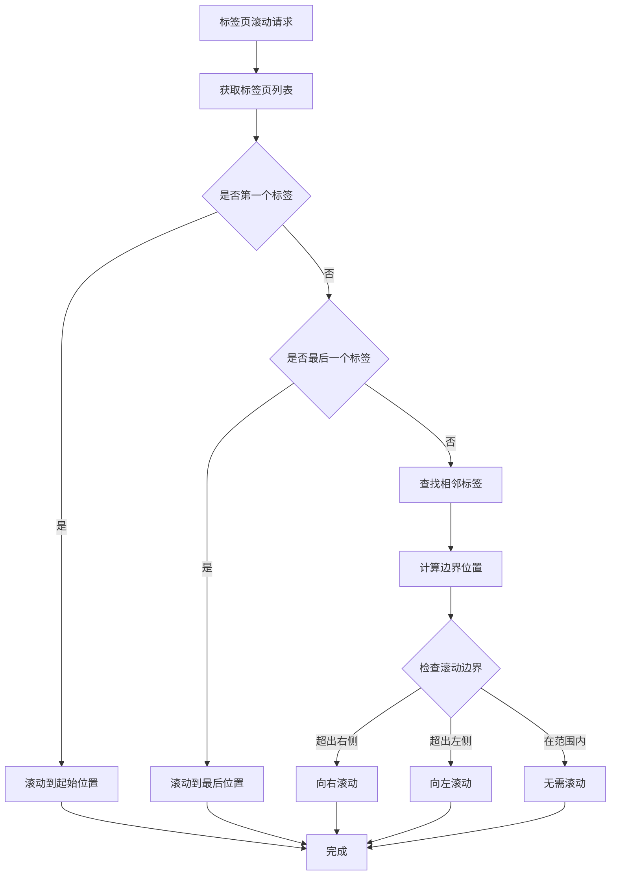
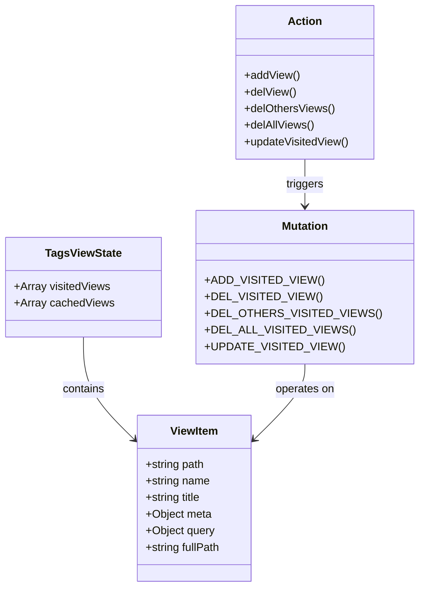
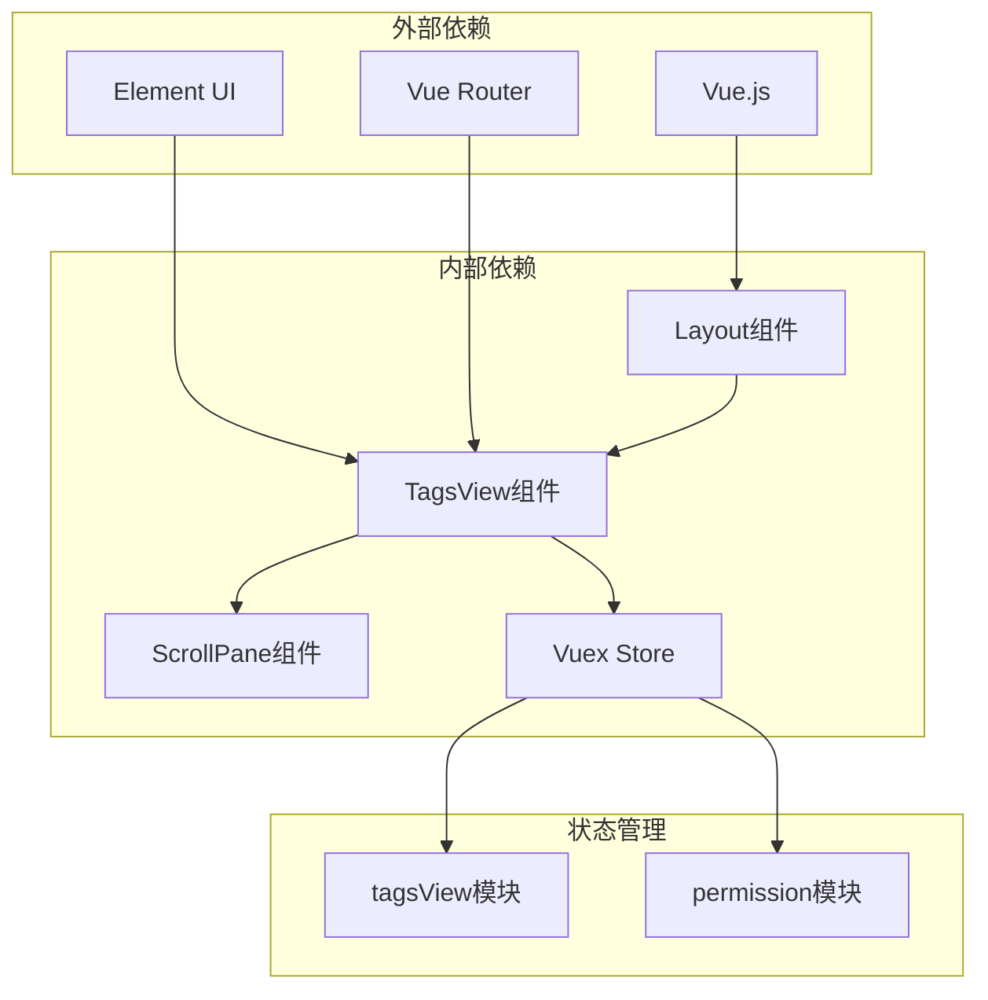
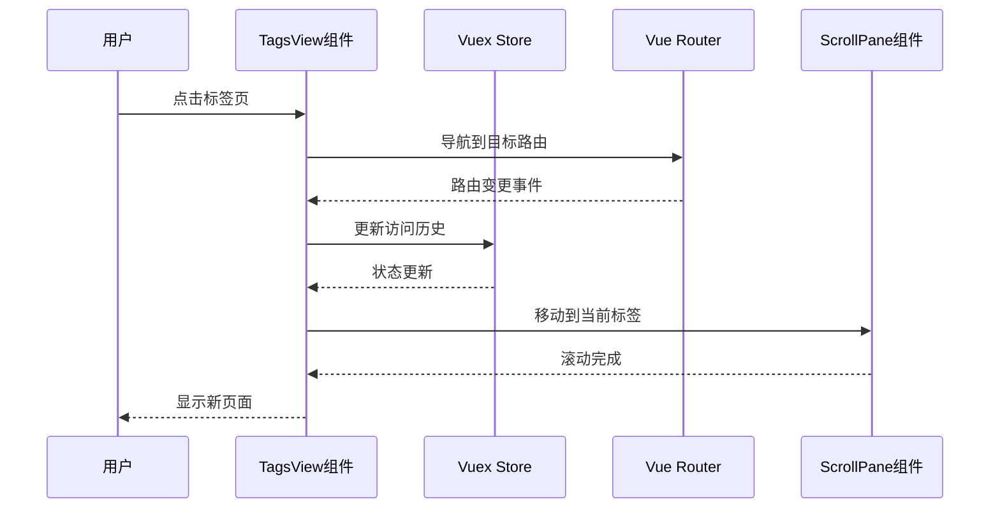

# TagsView标签页组件

<cite>
**本文档引用的文件**
- [src/layout/components/TagsView/index.vue](file://src/layout/components/TagsView/index.vue)
- [src/layout/components/TagsView/ScrollPane.vue](file://src/layout/components/TagsView/ScrollPane.vue)
- [src/store/modules/tagsView.js](file://src/store/modules/tagsView.js)
- [src/layout/index.vue](file://src/layout/index.vue)
- [src/router/index.js](file://src/router/index.js)
- [src/store/modules/permission.js](file://src/store/modules/permission.js)
- [src/styles/tags-color.scss](file://src/styles/tags-color.scss)
- [src/styles/element-ui.scss](file://src/styles/element-ui.scss)
- [src/styles/variables.scss](file://src/styles/variables.scss)
</cite>

## 目录
1. [简介](#简介)
2. [项目结构](#项目结构)
3. [核心组件](#核心组件)
4. [架构概览](#架构概览)
5. [详细组件分析](#详细组件分析)
6. [依赖关系分析](#依赖关系分析)
7. [性能考虑](#性能考虑)
8. [故障排除指南](#故障排除指南)
9. [结论](#结论)
10. [附录](#附录)

## 简介

TagsView标签页组件是Leisu Admin项目中的核心导航组件，提供了动态标签页管理、滚动控制、右键菜单等高级功能。该组件实现了现代化的多标签页浏览体验，支持标签页的动态增删、智能滚动定位、丰富的右键操作菜单以及优雅的视觉反馈。

组件采用Vue.js框架构建，结合Vuex状态管理，实现了标签页数据的持久化存储和状态同步。通过Element UI的滚动条组件，提供了流畅的横向滚动体验，并集成了丰富的交互功能，如中间点击关闭、右键菜单、刷新操作等。

## 项目结构

TagsView组件位于项目布局系统的组件目录中，与主布局紧密集成：

**图表来源**
- [src/layout/index.vue:1-124](file://src/layout/index.vue#L1-L124)
- [src/layout/components/TagsView/index.vue:1-294](file://src/layout/components/TagsView/index.vue#L1-L294)
- [src/store/modules/tagsView.js:1-182](file://src/store/modules/tagsView.js#L1-L182)

**章节来源**
- [src/layout/index.vue:1-124](file://src/layout/index.vue#L1-L124)
- [src/layout/components/TagsView/index.vue:1-294](file://src/layout/components/TagsView/index.vue#L1-L294)

## 核心组件

### TagsView 主组件

TagsView组件是整个标签页系统的核心，负责标签页的渲染、交互和状态管理。主要功能包括：

- **动态标签渲染**：基于路由信息动态生成标签页
- **标签状态管理**：跟踪激活状态、缓存状态
- **右键菜单系统**：提供刷新、关闭、关闭其他、关闭所有等操作
- **滚动控制**：与ScrollPane组件协作实现智能滚动定位
- **事件处理**：处理点击、右键、滚轮等用户交互

### ScrollPane 滚动容器

ScrollPane组件封装了Element UI的滚动条，提供了专门的滚动控制逻辑：

- **横向滚动**：支持水平方向的鼠标滚轮滚动
- **智能定位**：自动将当前标签滚动到可视区域内
- **边界检测**：处理滚动边界和溢出情况
- **标签间距计算**：精确计算标签间的间距和偏移

### Vuex 状态管理

tagsView模块负责标签页数据的持久化存储：

- **访问历史**：维护用户访问过的页面列表
- **缓存策略**：管理组件缓存状态
- **批量操作**：支持关闭其他、关闭所有等批量操作
- **参数路由处理**：特殊处理带参数的路由

**章节来源**
- [src/layout/components/TagsView/index.vue:28-198](file://src/layout/components/TagsView/index.vue#L28-L198)
- [src/layout/components/TagsView/ScrollPane.vue:7-67](file://src/layout/components/TagsView/ScrollPane.vue#L7-L67)
- [src/store/modules/tagsView.js:1-182](file://src/store/modules/tagsView.js#L1-L182)

## 架构概览

TagsView组件采用了分层架构设计，各层职责明确，耦合度低：

**图表来源**
- [src/layout/components/TagsView/index.vue:1-294](file://src/layout/components/TagsView/index.vue#L1-L294)
- [src/store/modules/tagsView.js:1-182](file://src/store/modules/tagsView.js#L1-L182)

## 详细组件分析

### TagsView 组件详细分析

#### 标签页渲染机制

组件通过`v-for`指令遍历`visitedViews`状态，为每个路由项生成对应的标签页：

**图表来源**
- [src/layout/components/TagsView/index.vue:106-127](file://src/layout/components/TagsView/index.vue#L106-L127)

#### 右键菜单系统

右键菜单提供了丰富的标签页操作功能：

| 功能 | 触发方式 | 实现逻辑 |
|------|----------|----------|
| 刷新当前标签 | 右键菜单 | 调用`refreshSelectedTag`方法 |
| 关闭当前标签 | 右键菜单 | 调用`closeSelectedTag`方法 |
| 关闭其他标签 | 右键菜单 | 调用`closeOthersTags`方法 |
| 关闭所有标签 | 右键菜单 | 调用`closeAllTags`方法 |

#### 交互事件处理

组件支持多种用户交互模式：

- **点击切换**：通过`router-link`实现页面跳转
- **中间点击关闭**：支持鼠标中键关闭标签
- **右键菜单**：提供上下文操作菜单
- **滚轮滚动**：支持鼠标滚轮横向滚动

**章节来源**
- [src/layout/components/TagsView/index.vue:174-196](file://src/layout/components/TagsView/index.vue#L174-L196)
- [src/layout/components/TagsView/index.vue:128-158](file://src/layout/components/TagsView/index.vue#L128-L158)

### ScrollPane 滚动容器分析

#### 滚动控制算法

ScrollPane组件实现了智能的滚动定位算法：

**图表来源**
- [src/layout/components/TagsView/ScrollPane.vue:28-65](file://src/layout/components/TagsView/ScrollPane.vue#L28-L65)

#### 滚动事件处理

组件通过`handleScroll`方法处理鼠标滚轮事件：

- **滚轮增量计算**：将滚轮事件转换为滚动增量
- **平滑滚动**：通过除法运算实现平滑的滚动效果
- **边界保护**：防止滚动超出有效范围

**章节来源**
- [src/layout/components/TagsView/ScrollPane.vue:23-27](file://src/layout/components/TagsView/ScrollPane.vue#L23-L27)
- [src/layout/components/TagsView/ScrollPane.vue:48-63](file://src/layout/components/TagsView/ScrollPane.vue#L48-L63)

### Vuex 状态管理系统

#### 数据结构设计

tagsView模块的状态管理采用简洁高效的数据结构：

**图表来源**
- [src/store/modules/tagsView.js:1-182](file://src/store/modules/tagsView.js#L1-L182)

#### 特殊路由处理

组件实现了对特殊路由类型的智能处理：

- **参数路由**：使用`params_main`标识，确保同一参数组的路由只保留最新实例
- **机器人路由**：自动过滤`/robot`路径的路由，避免重复显示
- **固定标签**：通过`affix`元数据标记固定标签页

**章节来源**
- [src/store/modules/tagsView.js:7-35](file://src/store/modules/tagsView.js#L7-L35)
- [src/store/modules/tagsView.js:25-29](file://src/store/modules/tagsView.js#L25-L29)

## 依赖关系分析

### 组件间依赖关系

**图表来源**
- [src/layout/components/TagsView/index.vue:29](file://src/layout/components/TagsView/index.vue#L29)
- [src/layout/index.vue:20](file://src/layout/index.vue#L20)

### 数据流分析

组件的数据流遵循单向数据流原则：

**图表来源**
- [src/layout/components/TagsView/index.vue:55-67](file://src/layout/components/TagsView/index.vue#L55-L67)
- [src/layout/components/TagsView/index.vue:113-127](file://src/layout/components/TagsView/index.vue#L113-L127)

**章节来源**
- [src/layout/components/TagsView/index.vue:1-294](file://src/layout/components/TagsView/index.vue#L1-L294)
- [src/store/modules/tagsView.js:90-174](file://src/store/modules/tagsView.js#L90-L174)

## 性能考虑

### 内存管理优化

组件在内存管理方面采用了多项优化措施：

- **懒加载策略**：标签页按需渲染，避免一次性渲染大量DOM元素
- **事件监听清理**：右键菜单关闭时自动移除事件监听器
- **滚动性能优化**：使用requestAnimationFrame优化滚动动画
- **缓存策略**：合理管理组件缓存，避免内存泄漏

### 渲染性能优化

- **虚拟滚动**：对于大量标签页场景，可考虑实现虚拟滚动
- **防抖处理**：对频繁触发的操作进行防抖处理
- **CSS优化**：使用硬件加速的CSS属性提升渲染性能

### 用户体验优化

- **即时反馈**：所有操作都有即时的视觉反馈
- **无障碍支持**：支持键盘导航和屏幕阅读器
- **响应式设计**：适配不同屏幕尺寸和设备类型

## 故障排除指南

### 常见问题及解决方案

#### 标签页不显示问题

**症状**：新打开的页面没有对应的标签页

**可能原因**：
- 路由缺少`name`属性
- 路由配置错误
- 权限限制导致路由不可访问

**解决方法**：
1. 检查路由配置中的`name`属性
2. 验证路由的`meta`属性配置
3. 确认用户权限允许访问该路由

#### 滚动异常问题

**症状**：标签页无法正确滚动到可视区域

**可能原因**：
- DOM元素尚未渲染完成
- 标签页宽度计算错误
- 滚动容器尺寸变化

**解决方法**：
1. 使用`$nextTick`确保DOM更新完成
2. 检查标签页的CSS样式
3. 监听窗口尺寸变化事件

#### 右键菜单问题

**症状**：右键菜单无法正常显示或操作无效

**可能原因**：
- 事件冒泡冲突
- 菜单项状态错误
- 权限验证失败

**解决方法**：
1. 检查事件处理函数的调用链
2. 验证菜单项的显示条件
3. 确认权限验证逻辑

**章节来源**
- [src/layout/components/TagsView/index.vue:193-196](file://src/layout/components/TagsView/index.vue#L193-L196)
- [src/layout/components/TagsView/ScrollPane.vue:28-65](file://src/layout/components/TagsView/ScrollPane.vue#L28-L65)

## 结论

TagsView标签页组件是一个设计精良、功能完整的前端组件，它成功地解决了多标签页浏览的核心需求。组件采用了现代化的架构设计，具有以下特点：

- **模块化设计**：清晰的组件分离和职责划分
- **状态管理**：完善的Vuex状态管理机制
- **用户体验**：丰富的交互功能和优雅的视觉效果
- **性能优化**：合理的性能考虑和优化策略
- **可扩展性**：良好的扩展接口和配置选项

该组件为Leisu Admin项目提供了强大的导航能力，支持复杂的业务场景和用户需求。通过持续的优化和改进，可以进一步提升组件的性能和用户体验。

## 附录

### 配置选项

| 选项名称 | 类型 | 默认值 | 描述 |
|----------|------|--------|------|
| affix | Boolean | false | 是否固定标签页（不可关闭） |
| noCache | Boolean | false | 是否缓存组件（影响刷新行为） |
| params_main | String | null | 参数路由标识符 |
| roles | Array | [] | 访问权限角色数组 |

### 扩展方法

- **自定义右键菜单**：通过修改模板中的菜单项实现
- **添加新的标签页操作**：在methods中添加新的处理函数
- **自定义滚动行为**：修改ScrollPane组件的滚动算法
- **样式定制**：通过SCSS变量和混入实现主题定制

### 最佳实践

1. **路由配置规范**：确保所有可访问路由都有正确的`meta`配置
2. **性能监控**：定期监控组件的渲染性能和内存使用
3. **用户体验测试**：在不同设备和浏览器上测试组件功能
4. **代码维护**：保持代码的可读性和可维护性