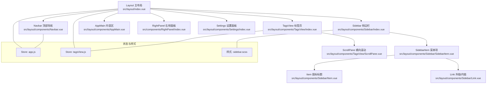
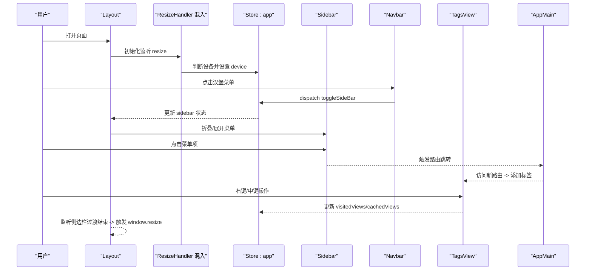
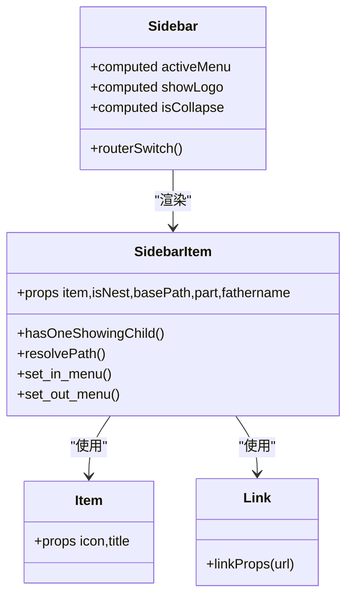
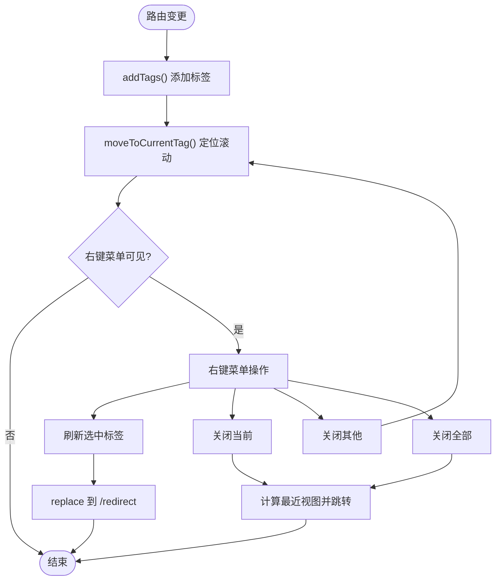
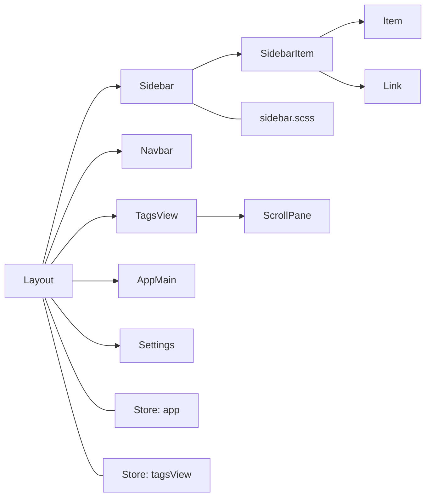

# 布局组件

<cite>
**本文引用的文件**
- [src/layout/index.vue](file://src/layout/index.vue)
- [src/layout/components/index.js](file://src/layout/components/index.js)
- [src/layout/mixin/ResizeHandler.js](file://src/layout/mixin/ResizeHandler.js)
- [src/layout/components/AppMain.vue](file://src/layout/components/AppMain.vue)
- [src/layout/components/Navbar.vue](file://src/layout/components/Navbar.vue)
- [src/layout/components/Sidebar/index.vue](file://src/layout/components/Sidebar/index.vue)
- [src/layout/components/Sidebar/SidebarItem.vue](file://src/layout/components/Sidebar/SidebarItem.vue)
- [src/layout/components/Sidebar/Item.vue](file://src/layout/components/Sidebar/Item.vue)
- [src/layout/components/Sidebar/Link.vue](file://src/layout/components/Sidebar/Link.vue)
- [src/layout/components/TagsView/index.vue](file://src/layout/components/TagsView/index.vue)
- [src/layout/components/TagsView/ScrollPane.vue](file://src/layout/components/TagsView/ScrollPane.vue)
- [src/layout/components/Settings/index.vue](file://src/layout/components/Settings/index.vue)
- [src/styles/sidebar.scss](file://src/styles/sidebar.scss)
- [src/store/modules/app.js](file://src/store/modules/app.js)
- [src/store/modules/tagsView.js](file://src/store/modules/tagsView.js)
</cite>

## 目录
1. [简介](#简介)
2. [项目结构](#项目结构)
3. [核心组件](#核心组件)
4. [架构总览](#架构总览)
5. [组件详解](#组件详解)
6. [依赖关系分析](#依赖关系分析)
7. [性能与可维护性](#性能与可维护性)
8. [故障排查指南](#故障排查指南)
9. [结论](#结论)
10. [附录：配置项与扩展建议](#附录配置项与扩展建议)

## 简介
本文件面向 Leisu Admin 的布局体系，系统化梳理 Layout 主布局、Sidebar 侧边栏、Navbar 顶部导航、TagsView 标签页、AppMain 内容区与 Settings 设置面板的实现与协作机制。重点覆盖响应式布局、侧边栏控制、移动端适配、路由导航、权限过滤、标签页增删改查与滚动控制、右侧面板开关与主题设置等能力，并给出生命周期管理、事件处理、样式定制与扩展实践。

## 项目结构
布局相关代码集中于 src/layout 目录，采用“主布局 + 子组件 + 混入 + 样式 + Store 模块”的分层组织方式：
- 主布局：负责容器结构、设备检测、侧边栏遮罩、固定头部、设置面板开关
- 子组件：Sidebar、Navbar、TagsView、AppMain、Settings
- 混入：ResizeHandler 负责窗口尺寸变化与移动端检测
- 样式：sidebar.scss 提供侧边栏与响应式布局样式
- Store：app.js 控制侧边栏与设备状态；tagsView.js 管理标签页集合与缓存

图表来源
- [src/layout/index.vue:1-124](file://src/layout/index.vue#L1-L124)
- [src/layout/components/Sidebar/index.vue:1-82](file://src/layout/components/Sidebar/index.vue#L1-L82)
- [src/layout/components/Navbar.vue:1-148](file://src/layout/components/Navbar.vue#L1-L148)
- [src/layout/components/TagsView/index.vue:1-294](file://src/layout/components/TagsView/index.vue#L1-L294)
- [src/layout/components/AppMain.vue:1-122](file://src/layout/components/AppMain.vue#L1-L122)
- [src/layout/components/Settings/index.vue:1-109](file://src/layout/components/Settings/index.vue#L1-L109)
- [src/layout/components/Sidebar/SidebarItem.vue:1-206](file://src/layout/components/Sidebar/SidebarItem.vue#L1-L206)
- [src/layout/components/Sidebar/Item.vue:1-30](file://src/layout/components/Sidebar/Item.vue#L1-L30)
- [src/layout/components/Sidebar/Link.vue:1-37](file://src/layout/components/Sidebar/Link.vue#L1-L37)
- [src/layout/components/TagsView/ScrollPane.vue:1-86](file://src/layout/components/TagsView/ScrollPane.vue#L1-L86)
- [src/styles/sidebar.scss:1-210](file://src/styles/sidebar.scss#L1-L210)
- [src/store/modules/app.js:1-65](file://src/store/modules/app.js#L1-L65)
- [src/store/modules/tagsView.js:1-182](file://src/store/modules/tagsView.js#L1-L182)

章节来源
- [src/layout/index.vue:1-124](file://src/layout/index.vue#L1-L124)
- [src/layout/components/index.js:1-6](file://src/layout/components/index.js#L1-L6)

## 核心组件
- Layout 主布局：统一容器、类名动态切换、移动端遮罩、固定头部宽度计算、设置面板开关、监听侧边栏过渡结束以触发 resize
- Sidebar 侧边栏：基于 Element Menu 渲染，支持折叠、图标标题、外链/内链跳转、按路由权限过滤、收藏菜单（本地存储）
- Navbar 顶部导航：汉堡菜单、面包屑、用户信息与登出
- TagsView 标签页：访问历史记录、滚动控制、右键上下文菜单、刷新/关闭当前/关闭其他/关闭全部
- AppMain 内容区：路由视图渲染、keep-alive 缓存、iframe 嵌入（特定路由名）
- Settings 设置面板：主题色、是否开启 TagsView、固定头部、侧边栏 Logo 开关

章节来源
- [src/layout/index.vue:18-78](file://src/layout/index.vue#L18-L78)
- [src/layout/components/Sidebar/index.vue:21-80](file://src/layout/components/Sidebar/index.vue#L21-L80)
- [src/layout/components/Navbar.vue:28-53](file://src/layout/components/Navbar.vue#L28-L53)
- [src/layout/components/TagsView/index.vue:32-198](file://src/layout/components/TagsView/index.vue#L32-L198)
- [src/layout/components/AppMain.vue:19-71](file://src/layout/components/AppMain.vue#L19-L71)
- [src/layout/components/Settings/index.vue:30-81](file://src/layout/components/Settings/index.vue#L30-L81)

## 架构总览
布局组件围绕“状态驱动 + 组件解耦 + 样式隔离”设计，通过 Vuex 管理侧边栏与设备状态，通过路由元信息驱动菜单与标签页行为，通过混入统一处理窗口尺寸变化与移动端适配。

图表来源
- [src/layout/index.vue:52-77](file://src/layout/index.vue#L52-L77)
- [src/layout/mixin/ResizeHandler.js:14-44](file://src/layout/mixin/ResizeHandler.js#L14-L44)
- [src/store/modules/app.js:40-57](file://src/store/modules/app.js#L40-L57)
- [src/layout/components/Navbar.vue:42-52](file://src/layout/components/Navbar.vue#L42-L52)
- [src/layout/components/TagsView/index.vue:106-158](file://src/layout/components/TagsView/index.vue#L106-L158)
- [src/layout/components/AppMain.vue:43-70](file://src/layout/components/AppMain.vue#L43-L70)

## 组件详解

### Layout 主布局
- 结构与职责
  - 容器类名根据 sidebar 状态与设备类型动态切换，控制侧边栏显隐与动画
  - 移动端下拉遮罩点击关闭侧边栏
  - 固定头部宽度随侧边栏展开/收起自适应
  - 条件渲染 TagsView 与 Settings
- 关键逻辑
  - 监听 classObj 变化，在侧边栏过渡结束后触发 window.resize，确保子组件正确响应
  - 通过 mapState 获取 sidebar/device/showSettings/needTagsView/fixedHeader 等状态
- 样式要点
  - 侧边栏宽度、移动端 transform、无动画模式等由 sidebar.scss 控制

章节来源
- [src/layout/index.vue:18-78](file://src/layout/index.vue#L18-L78)
- [src/styles/sidebar.scss:89-173](file://src/styles/sidebar.scss#L89-L173)

### Sidebar 侧边栏
- 菜单渲染
  - 基于 permission_routes 过滤生成 routerList，支持按路径包含“/robot”进行分流
  - 使用 El-Menu 垂直模式，唯一展开、背景/文字/激活色由变量注入
- 展开/收起
  - isCollapse 由 sidebar.opened 反向控制
  - 支持关闭过渡动画（withoutAnimation）以实现无动画收起
- 菜单项
  - SidebarItem 递归渲染，支持二级嵌套、外链/内链自动识别
  - Item 为轻量函数式组件，负责图标与标题
  - Link 自动判断外链并使用 a 标签或 router-link
- 收藏菜单
  - 通过本地存储记录用户收藏的菜单项，支持添加/移除
  - 与 post 模块联动，接收删除回调以同步 UI

图表来源
- [src/layout/components/Sidebar/index.vue:27-80](file://src/layout/components/Sidebar/index.vue#L27-L80)
- [src/layout/components/Sidebar/SidebarItem.vue:62-204](file://src/layout/components/Sidebar/SidebarItem.vue#L62-L204)
- [src/layout/components/Sidebar/Item.vue:1-30](file://src/layout/components/Sidebar/Item.vue#L1-L30)
- [src/layout/components/Sidebar/Link.vue:9-36](file://src/layout/components/Sidebar/Link.vue#L9-L36)

章节来源
- [src/layout/components/Sidebar/index.vue:21-80](file://src/layout/components/Sidebar/index.vue#L21-L80)
- [src/layout/components/Sidebar/SidebarItem.vue:124-190](file://src/layout/components/Sidebar/SidebarItem.vue#L124-L190)
- [src/layout/components/Sidebar/Link.vue:19-35](file://src/layout/components/Sidebar/Link.vue#L19-L35)

### Navbar 顶部导航
- 功能点
  - 汉堡菜单：调用 app/toggleSideBar 切换侧边栏
  - 面包屑：集成 Breadcrumb 组件
  - 用户信息：显示名称与分组，头像下拉登出
- 登出流程
  - 调用 user/logout 后强制刷新页面，确保状态清空

章节来源
- [src/layout/components/Navbar.vue:28-53](file://src/layout/components/Navbar.vue#L28-L53)

### TagsView 标签页
- 生命周期与初始化
  - mounted 时扫描权限路由中的 affix 标签并写入 visitedViews
  - 每次路由变更触发 addTags 并滚动到当前标签
- 标签页操作
  - 中键关闭、右键菜单：刷新、关闭当前、关闭其他、关闭全部
  - 刷新通过替换路由至 /redirect 实现缓存失效与重建
- 滚动控制
  - ScrollPane 提供横向滚动与目标标签定位，避免溢出不可见
- 状态管理
  - visitedViews/cachedViews 由 tagsView 模块维护，支持 params 路由去重与机器人路由隔离

图表来源
- [src/layout/components/TagsView/index.vue:106-173](file://src/layout/components/TagsView/index.vue#L106-L173)
- [src/layout/components/TagsView/ScrollPane.vue:22-66](file://src/layout/components/TagsView/ScrollPane.vue#L22-L66)
- [src/store/modules/tagsView.js:90-174](file://src/store/modules/tagsView.js#L90-L174)

章节来源
- [src/layout/components/TagsView/index.vue:32-198](file://src/layout/components/TagsView/index.vue#L32-L198)
- [src/layout/components/TagsView/ScrollPane.vue:8-86](file://src/layout/components/TagsView/ScrollPane.vue#L8-L86)
- [src/store/modules/tagsView.js:1-182](file://src/store/modules/tagsView.js#L1-L182)

### AppMain 内容区
- 路由视图渲染
  - 使用 keep-alive 缓存 visitedViews 中的组件，提升切换性能
  - 通过 key 与路由 path 强关联，保证路径变化时重新渲染
- iframe 嵌入
  - 特定路由名（如 ylh、sevenfish、ks、bdtj、ym）在 AppMain 中以 iframe 加载外部资源
- 样式适配
  - 与固定头部、TagsView 共同决定内容区高度与内边距

章节来源
- [src/layout/components/AppMain.vue:19-71](file://src/layout/components/AppMain.vue#L19-L71)
- [src/styles/sidebar.scss:101-112](file://src/styles/sidebar.scss#L101-L112)

### Settings 设置面板
- 功能
  - 主题色选择器联动 settings 模块
  - 开关：TagsView、固定头部、侧边栏 Logo
- 数据流
  - computed getter/setter 将 UI 状态映射到 store.settings.changeSetting 动作

章节来源
- [src/layout/components/Settings/index.vue:30-81](file://src/layout/components/Settings/index.vue#L30-L81)

## 依赖关系分析
- 组件耦合
  - Layout 对 Sidebar/Navbar/TagsView/AppMain/Settings 的组合依赖清晰，通过 props 与 store 解耦
  - Sidebar 与 SidebarItem 为父子组件，Link/Item 为通用子组件
  - TagsView 与 ScrollPane 为组合关系，内部通过 ref 协作
- 状态依赖
  - app 模块提供 sidebar/device 状态；tagsView 模块提供 visitedViews/cachedViews
- 样式依赖
  - sidebar.scss 与 Layout/Navbar/Sidebar 的类名强相关，影响布局宽度与移动端行为

图表来源
- [src/layout/index.vue:18-34](file://src/layout/index.vue#L18-L34)
- [src/layout/components/Sidebar/index.vue:22-28](file://src/layout/components/Sidebar/index.vue#L22-L28)
- [src/layout/components/TagsView/index.vue:29-33](file://src/layout/components/TagsView/index.vue#L29-L33)
- [src/styles/sidebar.scss:1-210](file://src/styles/sidebar.scss#L1-L210)
- [src/store/modules/app.js:1-65](file://src/store/modules/app.js#L1-L65)
- [src/store/modules/tagsView.js:1-182](file://src/store/modules/tagsView.js#L1-L182)

章节来源
- [src/layout/components/index.js:1-6](file://src/layout/components/index.js#L1-L6)

## 性能与可维护性
- 性能优化
  - AppMain 使用 keep-alive 缓存组件，减少重复渲染
  - TagsView 仅缓存必要组件，且支持按路由元信息去重
  - Sidebar 关闭过渡动画时设置 withoutAnimation，避免多余动画成本
- 可维护性
  - SidebarItem 通过 hasOneShowingChild 与 resolvePath 简化分支逻辑
  - ResizeHandler 混入集中处理设备检测与 resize 事件，降低重复代码
  - Settings 通过 store.settings.changeSetting 统一配置入口

[本节为通用指导，无需列出具体文件来源]

## 故障排查指南
- 侧边栏无法收起/展开
  - 检查 app.toggleSideBar/actions 是否被调用，确认 cookies 中 sidebarStatus 是否正确写入
  - 确认 Layout 的 classObj 是否触发 window_resize 以刷新布局
- 移动端点击遮罩无效
  - 确认 Layout.handleClickOutside 是否调用 app.closeSideBar
- 标签页不显示或无法关闭
  - 检查 tagsView.addView/delView 系列动作是否执行，affix 标签是否被意外清理
  - 右键菜单未出现：检查 visible 监听与 document.body 事件绑定
- 菜单不显示或显示异常
  - 检查 permission_routes 与 routerList 过滤逻辑，确认路由 path/meta 配置
  - 收藏菜单不同步：检查 localStorage 读写与 delfavd 监听

章节来源
- [src/store/modules/app.js:40-57](file://src/store/modules/app.js#L40-L57)
- [src/layout/index.vue:68-70](file://src/layout/index.vue#L68-L70)
- [src/store/modules/tagsView.js:90-174](file://src/store/modules/tagsView.js#L90-L174)
- [src/layout/components/TagsView/index.vue:174-196](file://src/layout/components/TagsView/index.vue#L174-L196)
- [src/layout/components/Sidebar/index.vue:59-72](file://src/layout/components/Sidebar/index.vue#L59-L72)

## 结论
Leisu Admin 的布局体系以 Layout 为核心，通过 Sidebar/Navbar/TagsView/AppMain/Settings 的协同，实现了响应式、可配置、可扩展的后台管理界面骨架。借助 Vuex 状态管理与混入机制，布局在设备切换、菜单导航、标签页管理等方面具备良好的一致性与可维护性。建议在实际业务中遵循现有命名与数据流规范，保持路由元信息与标签页缓存策略的一致性。

[本节为总结性内容，无需列出具体文件来源]

## 附录：配置项与扩展建议
- 布局配置项（来自 Settings 与 Store）
  - fixedHeader：是否固定头部
  - tagsView：是否启用标签页
  - sidebarLogo：是否显示侧边栏 Logo
  - theme：主题色（通过 ThemePicker 设置）
- 扩展建议
  - 新增菜单：在路由 meta 中配置 icon/title/affix/activeMenu 等字段，确保 SidebarItem 正确渲染
  - 自定义标签页行为：在 tagsView 模块中扩展 mutations/actions，以满足业务特定的缓存策略
  - 移动端体验：结合 ResizeHandler 的设备检测，对关键区域做最小宽度限制与滚动优化
  - 主题与样式：通过 sidebar.scss 的变量与类名控制布局外观，避免硬编码样式

章节来源
- [src/layout/components/Settings/index.vue:38-80](file://src/layout/components/Settings/index.vue#L38-L80)
- [src/store/modules/app.js:3-11](file://src/store/modules/app.js#L3-L11)
- [src/styles/sidebar.scss:1-210](file://src/styles/sidebar.scss#L1-L210)