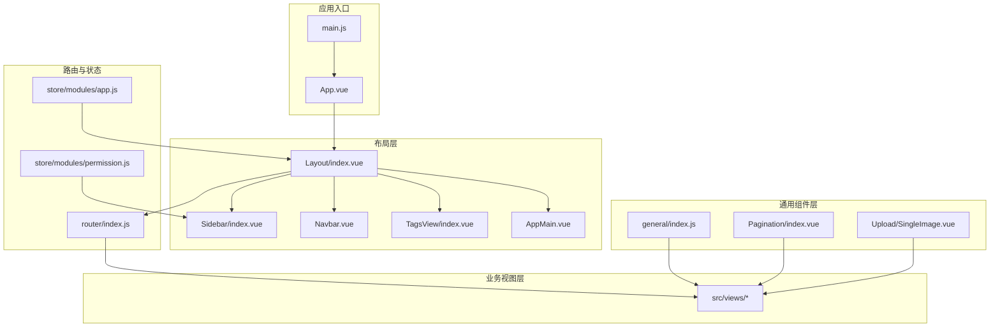
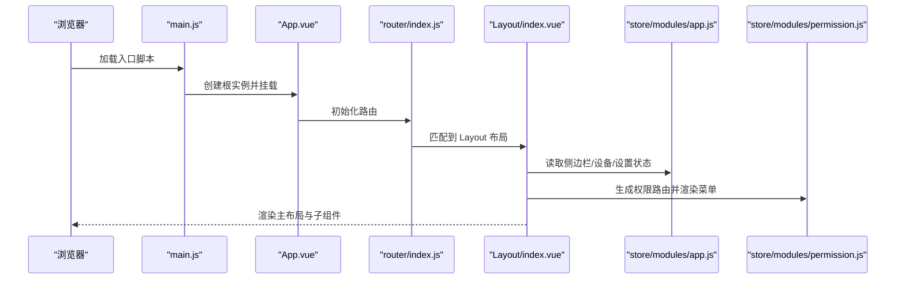
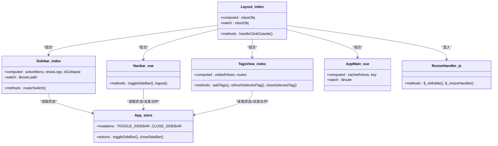
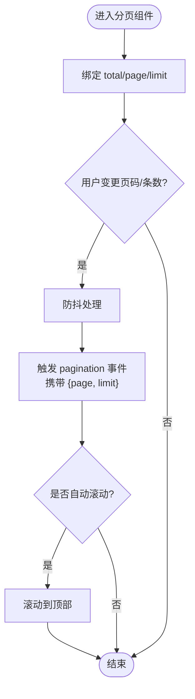
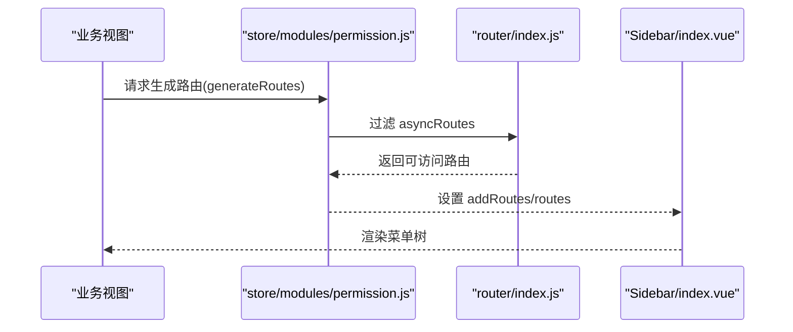
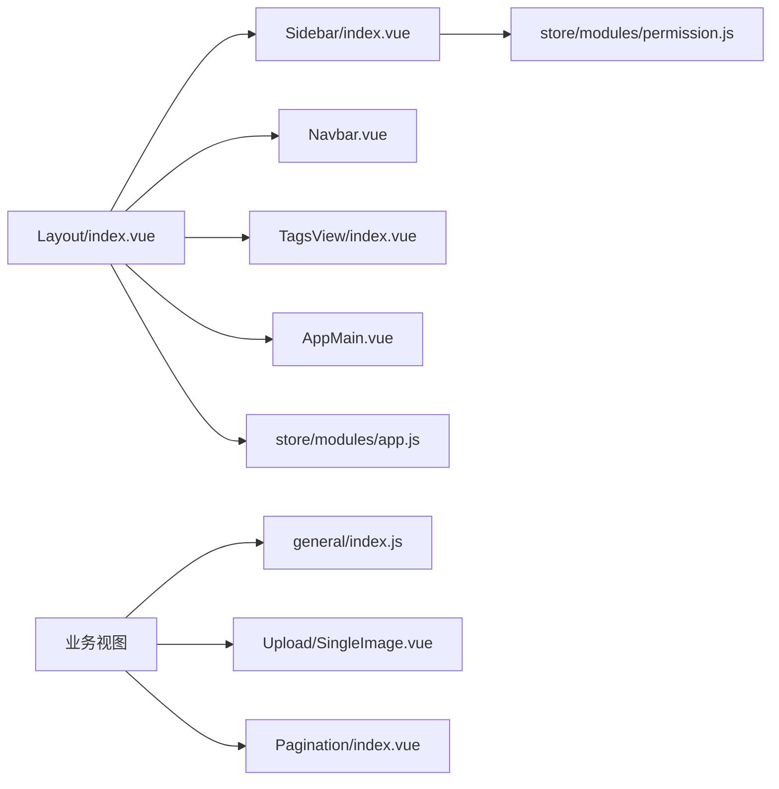

# 组件架构

<cite>
**本文引用的文件**
- [src/layout/index.vue](file://src/layout/index.vue)
- [src/App.vue](file://src/App.vue)
- [src/main.js](file://src/main.js)
- [src/layout/components/index.js](file://src/layout/components/index.js)
- [src/layout/mixin/ResizeHandler.js](file://src/layout/mixin/ResizeHandler.js)
- [src/layout/components/Sidebar/index.vue](file://src/layout/components/Sidebar/index.vue)
- [src/layout/components/Navbar.vue](file://src/layout/components/Navbar.vue)
- [src/layout/components/TagsView/index.vue](file://src/layout/components/TagsView/index.vue)
- [src/layout/components/AppMain.vue](file://src/layout/components/AppMain.vue)
- [src/store/modules/app.js](file://src/store/modules/app.js)
- [src/components/Pagination/index.vue](file://src/components/Pagination/index.vue)
- [src/components/Upload/SingleImage.vue](file://src/components/Upload/SingleImage.vue)
- [src/components/general/index.js](file://src/components/general/index.js)
- [src/router/index.js](file://src/router/index.js)
- [src/store/modules/permission.js](file://src/store/modules/permission.js)
</cite>

## 目录
1. [引言](#引言)
2. [项目结构](#项目结构)
3. [核心组件](#核心组件)
4. [架构总览](#架构总览)
5. [详细组件分析](#详细组件分析)
6. [依赖分析](#依赖分析)
7. [性能考虑](#性能考虑)
8. [故障排查指南](#故障排查指南)
9. [结论](#结论)
10. [附录](#附录)

## 引言
本文件面向 Leisu Admin 项目的前端开发与维护人员，系统性梳理基于 Vue.js 的组件化架构设计，重点覆盖以下方面：
- 布局组件层次：Layout 主布局、Sidebar 侧边栏、Navbar 顶部导航、TagsView 标签页、AppMain 内容区域
- 通用组件设计：表格/分页、表单控件、图表、上传等组件的抽象与复用策略
- 业务组件架构：用户管理、内容管理、权限控制等业务域的组件封装与职责边界
- 组件通信机制：props 传递、events 触发、slots 插槽、provide/inject 依赖注入
- 生命周期管理：组件创建、更新、销毁阶段的关键钩子与行为
- 架构图与关系图：帮助开发者快速把握整体设计与交互

## 项目结构
Leisu Admin 采用“布局层 + 通用组件层 + 业务视图层”的分层组织方式：
- 布局层：位于 src/layout，负责全局容器、导航与内容区域的统一承载
- 通用组件层：位于 src/components，包含可跨业务复用的通用 UI 组件与业务通用组件
- 业务视图层：位于 src/views 下各功能域，通过路由挂载到布局容器内
- 路由与状态：src/router 定义路由表，src/store 管理应用状态与权限

**图示来源**
- [src/App.vue:1-18](file://src/App.vue#L1-L18)
- [src/main.js:1-526](file://src/main.js#L1-L526)
- [src/layout/index.vue:1-124](file://src/layout/index.vue#L1-L124)
- [src/layout/components/Sidebar/index.vue:1-82](file://src/layout/components/Sidebar/index.vue#L1-L82)
- [src/layout/components/Navbar.vue:1-148](file://src/layout/components/Navbar.vue#L1-L148)
- [src/layout/components/TagsView/index.vue:1-294](file://src/layout/components/TagsView/index.vue#L1-L294)
- [src/layout/components/AppMain.vue:1-122](file://src/layout/components/AppMain.vue#L1-L122)
- [src/components/Pagination/index.vue:1-113](file://src/components/Pagination/index.vue#L1-L113)
- [src/components/Upload/SingleImage.vue:1-135](file://src/components/Upload/SingleImage.vue#L1-L135)
- [src/components/general/index.js:1-41](file://src/components/general/index.js#L1-L41)
- [src/router/index.js:1-177](file://src/router/index.js#L1-L177)
- [src/store/modules/app.js:1-65](file://src/store/modules/app.js#L1-L65)
- [src/store/modules/permission.js:1-66](file://src/store/modules/permission.js#L1-L66)

**章节来源**
- [src/layout/index.vue:1-124](file://src/layout/index.vue#L1-L124)
- [src/App.vue:1-18](file://src/App.vue#L1-L18)
- [src/main.js:1-526](file://src/main.js#L1-L526)
- [src/layout/components/index.js:1-6](file://src/layout/components/index.js#L1-L6)
- [src/layout/mixin/ResizeHandler.js:1-46](file://src/layout/mixin/ResizeHandler.js#L1-L46)
- [src/router/index.js:1-177](file://src/router/index.js#L1-L177)

## 核心组件
本节聚焦布局与通用组件的核心职责与交互。

- Layout 主布局
  - 负责容器布局、移动端遮罩、右侧设置面板、固定头部与标签页的集成
  - 通过 ResizeMixin 实现响应式设备切换与侧边栏自动收起
  - 通过 Vuex 状态映射控制侧边栏开关、设备类型、设置显示与标签页开关

- Sidebar 侧边栏
  - 基于 Element UI Menu 渲染动态路由菜单树
  - 根据当前路由动态过滤机器人相关路由，实现菜单差异化展示
  - 与权限模块联动，仅渲染有权限的路由项

- Navbar 顶部导航
  - 展示用户名与用户组信息
  - 提供汉堡菜单切换侧边栏、面包屑导航、下拉头像菜单（含退出登录）

- TagsView 标签页
  - 记录已访问路由，支持刷新、关闭当前、关闭其他、关闭全部
  - 支持右键上下文菜单与中间点击关闭
  - 自动滚动至当前标签，处理查询参数变化时的缓存更新

- AppMain 内容区域
  - 使用 keep-alive 缓存路由组件，提升切换性能
  - 支持 iframe 嵌入场景（如统计与广告平台），按路由名称动态加载

- 通用组件
  - 分页组件：支持页码与每页大小双向绑定、防抖事件、布局自定义
  - 单图上传组件：基于 Element Upload，支持拖拽、预览、删除与七牛 Token 获取

**章节来源**
- [src/layout/index.vue:18-78](file://src/layout/index.vue#L18-L78)
- [src/layout/mixin/ResizeHandler.js:6-45](file://src/layout/mixin/ResizeHandler.js#L6-L45)
- [src/layout/components/Sidebar/index.vue:27-80](file://src/layout/components/Sidebar/index.vue#L27-L80)
- [src/layout/components/Navbar.vue:28-53](file://src/layout/components/Navbar.vue#L28-L53)
- [src/layout/components/TagsView/index.vue:32-198](file://src/layout/components/TagsView/index.vue#L32-L198)
- [src/layout/components/AppMain.vue:19-71](file://src/layout/components/AppMain.vue#L19-L71)
- [src/components/Pagination/index.vue:26-101](file://src/components/Pagination/index.vue#L26-L101)
- [src/components/Upload/SingleImage.vue:31-77](file://src/components/Upload/SingleImage.vue#L31-L77)

## 架构总览
下图展示从应用入口到布局容器、再到通用组件与业务视图的整体调用链路与数据流向。

**图示来源**
- [src/main.js:18-526](file://src/main.js#L18-L526)
- [src/App.vue:1-18](file://src/App.vue#L1-L18)
- [src/router/index.js:31-177](file://src/router/index.js#L31-L177)
- [src/layout/index.vue:18-78](file://src/layout/index.vue#L18-L78)
- [src/store/modules/app.js:1-65](file://src/store/modules/app.js#L1-L65)
- [src/store/modules/permission.js:1-66](file://src/store/modules/permission.js#L1-L66)

## 详细组件分析

### 布局组件架构
- 组件关系
  - Layout 作为根容器，组合 Sidebar、Navbar、TagsView、AppMain
  - 通过 Vuex 管理侧边栏状态与设备类型，通过 ResizeMixin 处理窗口尺寸变化
  - 通过路由与权限模块决定菜单与可见性

**图示来源**
- [src/layout/index.vue:24-78](file://src/layout/index.vue#L24-L78)
- [src/layout/components/Sidebar/index.vue:27-80](file://src/layout/components/Sidebar/index.vue#L27-L80)
- [src/layout/components/Navbar.vue:28-53](file://src/layout/components/Navbar.vue#L28-L53)
- [src/layout/components/TagsView/index.vue:32-198](file://src/layout/components/TagsView/index.vue#L32-L198)
- [src/layout/components/AppMain.vue:19-71](file://src/layout/components/AppMain.vue#L19-L71)
- [src/layout/mixin/ResizeHandler.js:6-45](file://src/layout/mixin/ResizeHandler.js#L6-L45)
- [src/store/modules/app.js:13-57](file://src/store/modules/app.js#L13-L57)

**章节来源**
- [src/layout/index.vue:18-78](file://src/layout/index.vue#L18-L78)
- [src/layout/mixin/ResizeHandler.js:14-43](file://src/layout/mixin/ResizeHandler.js#L14-L43)
- [src/layout/components/Sidebar/index.vue:55-79](file://src/layout/components/Sidebar/index.vue#L55-L79)
- [src/layout/components/Navbar.vue:42-52](file://src/layout/components/Navbar.vue#L42-L52)
- [src/layout/components/TagsView/index.vue:106-173](file://src/layout/components/TagsView/index.vue#L106-L173)
- [src/layout/components/AppMain.vue:34-70](file://src/layout/components/AppMain.vue#L34-L70)
- [src/store/modules/app.js:3-38](file://src/store/modules/app.js#L3-L38)

### 通用组件设计
- 分页组件（Pagination）
  - 设计要点：支持 total/page/limit 的双向绑定；layout 可配置；支持自动滚动；防抖优化
  - 适用场景：列表数据分页、搜索结果分页、报表导出等

- 单图上传组件（SingleImage）
  - 设计要点：基于 Element Upload，支持拖拽上传；上传前获取 Token 与 Key；成功后回填值
  - 适用场景：头像上传、封面图上传、商品主图上传

**图示来源**
- [src/components/Pagination/index.vue:68-100](file://src/components/Pagination/index.vue#L68-L100)

**章节来源**
- [src/components/Pagination/index.vue:26-101](file://src/components/Pagination/index.vue#L26-L101)
- [src/components/Upload/SingleImage.vue:31-77](file://src/components/Upload/SingleImage.vue#L31-L77)

### 业务组件架构
- 权限控制组件
  - 路由级权限：通过 permission 模块根据角色过滤异步路由，生成可访问路由表
  - 元信息控制：路由 meta 中的 roles 控制访问；affix 固定标签页
  - 侧边栏菜单：根据当前路由动态筛选机器人相关菜单项

- 业务视图与通用组件协作
  - 业务视图通过通用组件实现统一的数据输入、分页与上传能力
  - 通用组件通过 props 与 events 与业务视图解耦，便于复用

**图示来源**
- [src/store/modules/permission.js:49-58](file://src/store/modules/permission.js#L49-L58)
- [src/router/index.js:74-160](file://src/router/index.js#L74-L160)
- [src/layout/components/Sidebar/index.vue:55-79](file://src/layout/components/Sidebar/index.vue#L55-L79)

**章节来源**
- [src/store/modules/permission.js:1-66](file://src/store/modules/permission.js#L1-L66)
- [src/router/index.js:74-160](file://src/router/index.js#L74-L160)
- [src/layout/components/Sidebar/index.vue:55-79](file://src/layout/components/Sidebar/index.vue#L55-L79)

### 组件通信机制
- Props 传递
  - Pagination 通过 props 接收 total、page、limit、layout 等配置
  - Upload 组件通过 props 接收 value 并在成功时回填

- Events 触发
  - Pagination 触发 pagination 事件，携带 {page, limit}
  - Upload 组件在上传成功后触发 input 事件回填值

- Slots 插槽
  - 通用组件未大量使用具名插槽，主要通过 props 与事件实现扩展

- Provide/Inject 依赖注入
  - 未发现集中式的 provide/inject 使用模式；更多通过 Vuex 与 props 注入

**章节来源**
- [src/components/Pagination/index.vue:28-84](file://src/components/Pagination/index.vue#L28-L84)
- [src/components/Upload/SingleImage.vue:33-59](file://src/components/Upload/SingleImage.vue#L33-L59)

### 组件生命周期管理
- 创建阶段
  - Layout 通过 ResizeMixin 在 beforeMount/destroy 期间注册/移除 resize 监听
  - Sidebar 在 created 时执行 routerSwitch，根据路由动态过滤菜单
  - TagsView 在 mounted 时初始化固定标签与添加当前标签

- 更新阶段
  - Layout 通过 watch 监听 classObj，在过渡结束后触发 window.resize
  - TagsView 监听 $route，动态添加/更新标签并滚动至当前项
  - AppMain 监听 $route，按路由名称动态创建 iframe

- 销毁阶段
  - ResizeHandler 在 beforeDestroy 移除全局 resize 事件
  - TagsView 在 visible 变化时动态增删 body 上的点击事件监听

**章节来源**
- [src/layout/mixin/ResizeHandler.js:14-43](file://src/layout/mixin/ResizeHandler.js#L14-L43)
- [src/layout/components/Sidebar/index.vue:55-79](file://src/layout/components/Sidebar/index.vue#L55-L79)
- [src/layout/components/TagsView/index.vue:55-67](file://src/layout/components/TagsView/index.vue#L55-L67)
- [src/layout/components/AppMain.vue:43-70](file://src/layout/components/AppMain.vue#L43-L70)

## 依赖分析
- 组件耦合与内聚
  - 布局组件高度内聚于 Layout，通过组件组合实现低耦合的职责划分
  - 通用组件以 props + 事件为主，避免与具体业务强绑定

- 直接与间接依赖
  - Layout 依赖 Vuex（app、settings）与路由（permission）
  - Sidebar 依赖 permission 模块与路由元信息
  - TagsView 依赖 tagsView 模块与路由元信息

- 外部依赖与集成点
  - Element UI 作为基础 UI 库
  - Vuex 管理全局状态与权限
  - 路由模块负责菜单与页面跳转

**图示来源**
- [src/layout/index.vue:18-33](file://src/layout/index.vue#L18-L33)
- [src/layout/components/Sidebar/index.vue:27-54](file://src/layout/components/Sidebar/index.vue#L27-L54)
- [src/layout/components/TagsView/index.vue:47-54](file://src/layout/components/TagsView/index.vue#L47-L54)
- [src/layout/components/AppMain.vue:34-41](file://src/layout/components/AppMain.vue#L34-L41)
- [src/store/modules/permission.js:37-47](file://src/store/modules/permission.js#L37-L47)
- [src/store/modules/app.js:3-38](file://src/store/modules/app.js#L3-L38)
- [src/components/general/index.js:22-40](file://src/components/general/index.js#L22-L40)
- [src/components/Upload/SingleImage.vue:31-77](file://src/components/Upload/SingleImage.vue#L31-L77)
- [src/components/Pagination/index.vue:26-101](file://src/components/Pagination/index.vue#L26-L101)

**章节来源**
- [src/layout/components/index.js:1-6](file://src/layout/components/index.js#L1-L6)
- [src/components/general/index.js:1-41](file://src/components/general/index.js#L1-L41)

## 性能考虑
- Keep-alive 缓存
  - AppMain 对路由组件启用 keep-alive，减少重复渲染与请求开销
- 防抖优化
  - Pagination 对页码与每页大小变更进行防抖，降低频繁触发带来的性能压力
- 动态菜单过滤
  - Sidebar 根据路由动态过滤菜单，避免渲染无权限或无关菜单项
- 响应式处理
  - ResizeHandler 在移动设备自动关闭侧边栏，减少不必要的 DOM 结构与样式计算

**章节来源**
- [src/layout/components/AppMain.vue:4-8](file://src/layout/components/AppMain.vue#L4-L8)
- [src/components/Pagination/index.vue:87-99](file://src/components/Pagination/index.vue#L87-L99)
- [src/layout/components/Sidebar/index.vue:59-72](file://src/layout/components/Sidebar/index.vue#L59-L72)
- [src/layout/mixin/ResizeHandler.js:20-43](file://src/layout/mixin/ResizeHandler.js#L20-L43)

## 故障排查指南
- 侧边栏无法展开/收起
  - 检查 app 模块中的 TOGGLE_SIDEBAR/CLOSE_SIDEBAR 是否被正确调用
  - 确认 Cookies 中 sidebarStatus 是否被正确写入/读取

- 标签页不显示或无法关闭
  - 检查 tagsView 模块的 visitedViews 与 cachedViews 是否同步更新
  - 确认路由 meta 中的 affix 与 name 配置是否正确

- 菜单不随路由变化而切换
  - 检查 permission 模块的 generateRoutes 与 Sidebar 的 routerSwitch 逻辑
  - 确认路由元信息中是否包含正确的 activeMenu 或 path

- 分页事件未触发
  - 检查 Pagination 的 update:page/update:limit 事件绑定与防抖参数
  - 确认父组件是否正确接收 pagination 事件并处理分页参数

**章节来源**
- [src/store/modules/app.js:13-38](file://src/store/modules/app.js#L13-L38)
- [src/layout/components/TagsView/index.vue:47-173](file://src/layout/components/TagsView/index.vue#L47-L173)
- [src/layout/components/Sidebar/index.vue:55-79](file://src/layout/components/Sidebar/index.vue#L55-L79)
- [src/components/Pagination/index.vue:68-100](file://src/components/Pagination/index.vue#L68-L100)

## 结论
Leisu Admin 的组件架构以 Layout 为核心容器，结合 Sidebar、Navbar、TagsView、AppMain 形成清晰的布局体系；通过通用组件与业务视图的解耦设计，实现了高复用与可维护性；配合 Vuex 与路由的权限控制，确保了菜单与页面访问的安全可控。建议在后续迭代中：
- 明确 provide/inject 的使用边界，减少隐式依赖
- 对复杂业务组件引入更细粒度的拆分与单元测试
- 持续优化 ResizeHandler 与 Keep-alive 的性能表现

## 附录
- 术语说明
  - Affix：固定标签页，不可关闭
  - Keep-alive：Vue 内置缓存机制，用于保存组件状态
  - 防抖：在高频事件中限制触发频率，提升性能与体验