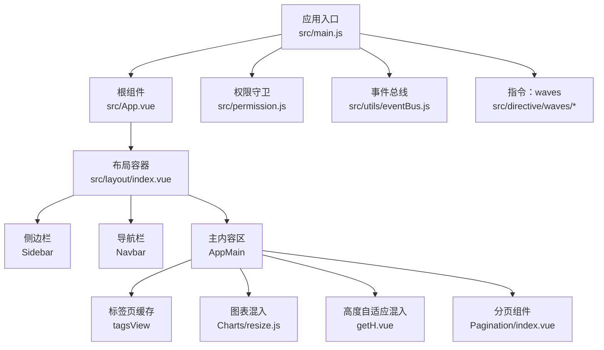
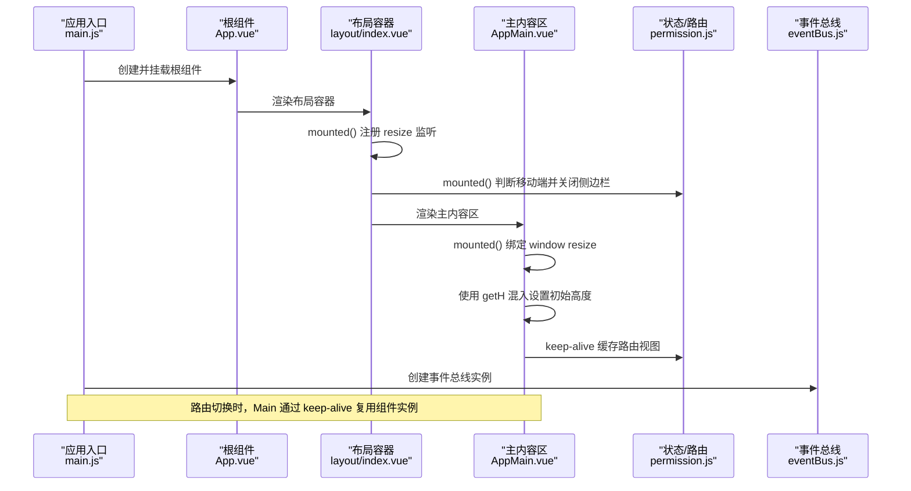
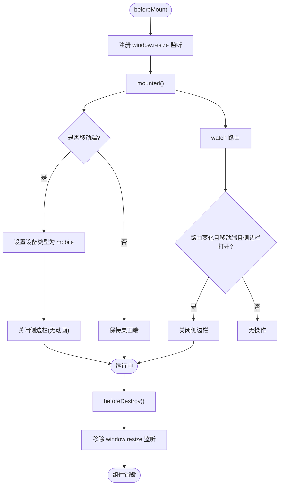
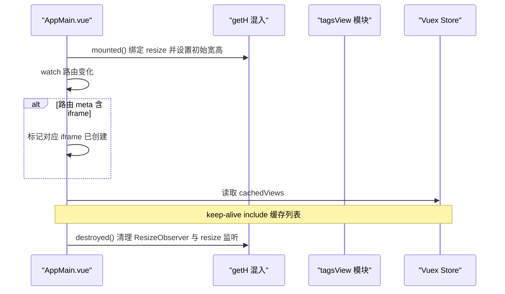
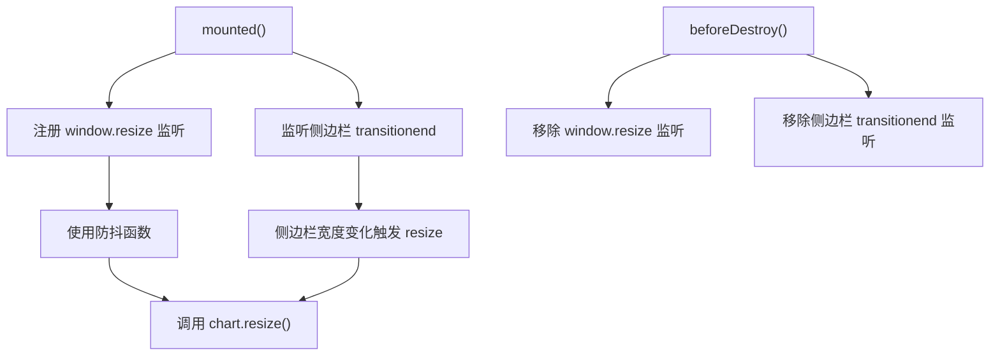
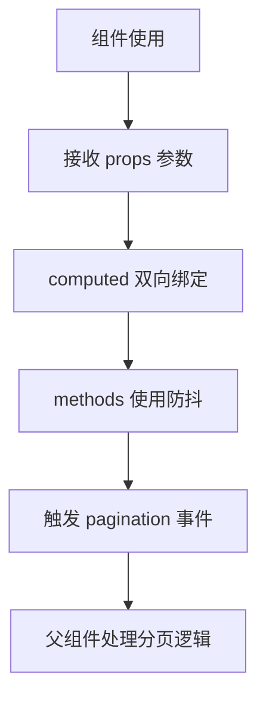
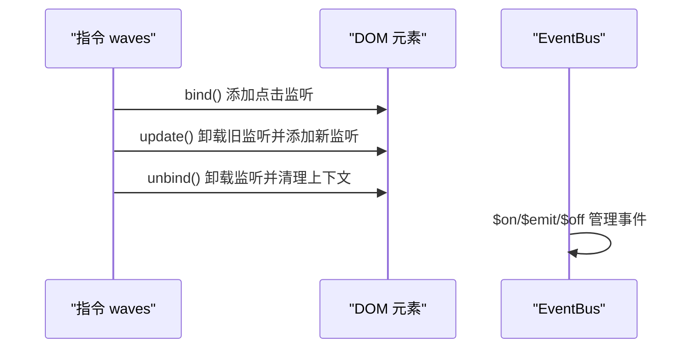
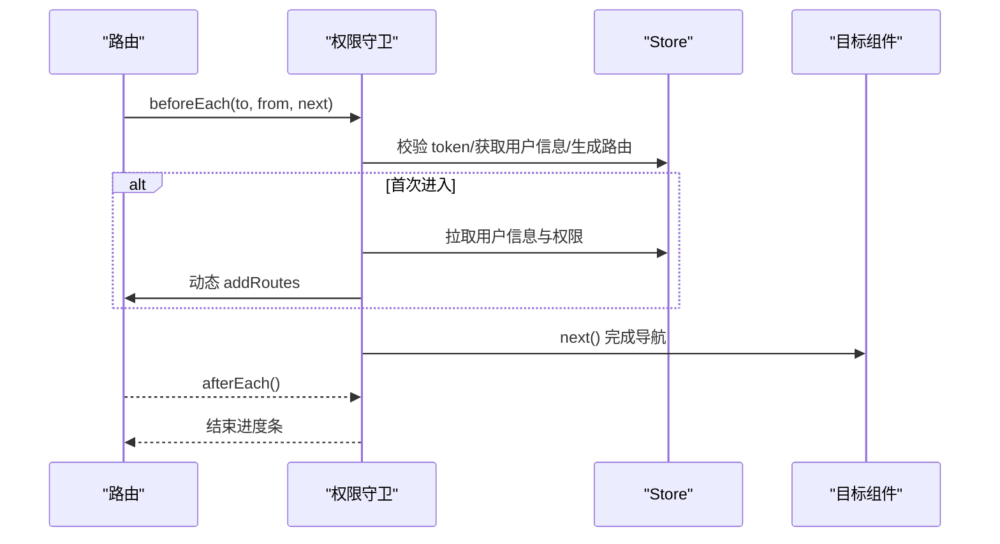
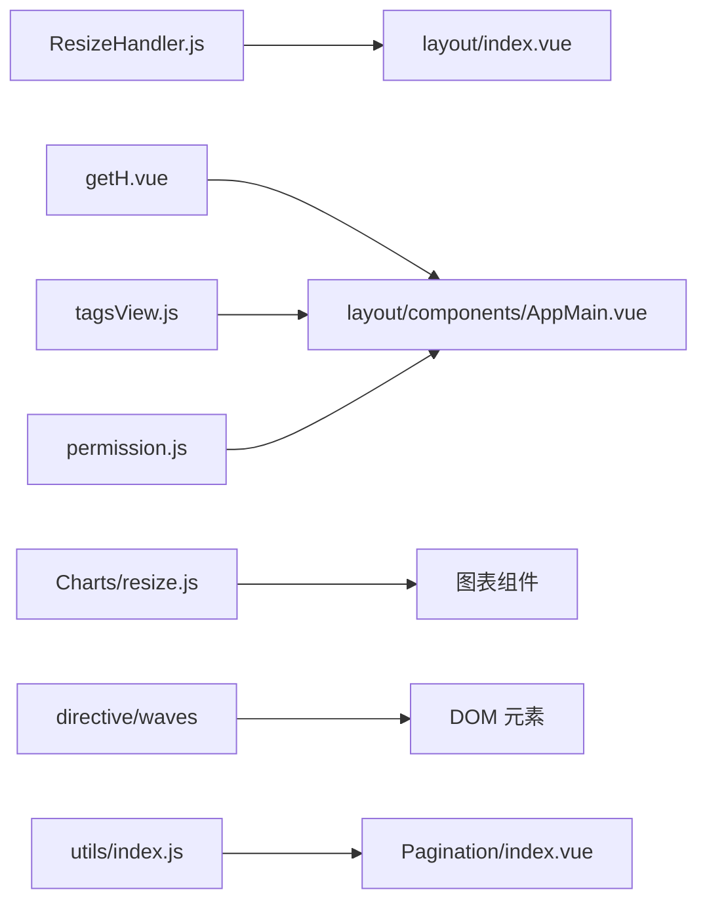

# 组件生命周期

<cite>
**本文引用的文件**
- [src/main.js](file://src/main.js)
- [src/App.vue](file://src/App.vue)
- [src/layout/index.vue](file://src/layout/index.vue)
- [src/layout/components/AppMain.vue](file://src/layout/components/AppMain.vue)
- [src/layout/mixin/ResizeHandler.js](file://src/layout/mixin/ResizeHandler.js)
- [src/mixins/getH.vue](file://src/mixins/getH.vue)
- [src/components/Charts/mixins/resize.js](file://src/components/Charts/mixins/resize.js)
- [src/components/Pagination/index.vue](file://src/components/Pagination/index.vue)
- [src/utils/eventBus.js](file://src/utils/eventBus.js)
- [src/utils/index.js](file://src/utils/index.js)
- [src/permission.js](file://src/permission.js)
- [src/directive/waves/waves.js](file://src/directive/waves/waves.js)
- [src/directive/waves/index.js](file://src/directive/waves/index.js)
- [src/store/modules/tagsView.js](file://src/store/modules/tagsView.js)
</cite>

## 目录
1. [简介](#简介)
2. [项目结构](#项目结构)
3. [核心组件](#核心组件)
4. [架构总览](#架构总览)
5. [详细组件分析](#详细组件分析)
6. [依赖关系分析](#依赖关系分析)
7. [性能考量](#性能考量)
8. [故障排查指南](#故障排查指南)
9. [结论](#结论)
10. [附录](#附录)

## 简介
本文件围绕 Leisu Admin 项目的 Vue.js 组件生命周期展开，系统梳理组件从创建、挂载、更新到销毁的关键节点，结合项目中的布局组件、图表组件、分页组件以及混入（mixin）与指令的实际使用，解释 data 初始化、computed 计算、watch 监听、事件绑定与清理、路由守卫与标签页缓存等机制，并给出调试技巧、性能优化建议与常见问题排查方法。

## 项目结构
- 应用入口与全局初始化位于入口文件，负责注册全局组件、指令、过滤器、插件与事件总线，随后挂载根组件。
- 布局层通过布局容器、侧边栏、导航栏、主内容区与右侧设置面板构成，配合 ResizeHandler 混入实现响应式与侧边栏交互。
- 主内容区通过 keep-alive 缓存路由视图，结合 tagsView 模块管理缓存列表，支持路由切换时的内存复用。
- 图表与通用组件通过混入注入 resize 监听与清理逻辑，确保图表尺寸随窗口或侧边栏宽度变化而自适应。
- 权限模块在路由层面拦截导航，按需生成可访问路由并控制页面进入流程。

**图表来源**
- [src/main.js:1-526](file://src/main.js#L1-L526)
- [src/App.vue:1-18](file://src/App.vue#L1-L18)
- [src/layout/index.vue:1-124](file://src/layout/index.vue#L1-L124)
- [src/layout/components/AppMain.vue:1-122](file://src/layout/components/AppMain.vue#L1-L122)
- [src/store/modules/tagsView.js:1-181](file://src/store/modules/tagsView.js#L1-L181)
- [src/components/Charts/mixins/resize.js:1-35](file://src/components/Charts/mixins/resize.js#L1-L35)
- [src/mixins/getH.vue:1-103](file://src/mixins/getH.vue#L1-L103)
- [src/components/Pagination/index.vue:1-113](file://src/components/Pagination/index.vue#L1-L113)
- [src/permission.js:1-82](file://src/permission.js#L1-L82)
- [src/utils/eventBus.js:1-55](file://src/utils/eventBus.js#L1-L55)
- [src/directive/waves/waves.js:48-72](file://src/directive/waves/waves.js#L48-L72)

**章节来源**
- [src/main.js:1-526](file://src/main.js#L1-L526)
- [src/App.vue:1-18](file://src/App.vue#L1-L18)
- [src/layout/index.vue:1-124](file://src/layout/index.vue#L1-L124)
- [src/layout/components/AppMain.vue:1-122](file://src/layout/components/AppMain.vue#L1-L122)
- [src/store/modules/tagsView.js:1-181](file://src/store/modules/tagsView.js#L1-L181)

## 核心组件
- 应用入口与全局初始化：注册全局组件、指令、过滤器、插件；创建事件总线；挂载根组件。
- 根组件：承载全屏加载状态与路由视图。
- 布局容器：组合侧边栏、导航栏、主内容区与设置面板；集成 ResizeHandler 混入实现移动端设备检测与侧边栏关闭。
- 主内容区：基于 keep-alive 缓存路由视图；根据路由 meta 控制 iframe 场景；集成 getH 混入实现高度自适应与 ResizeObserver 管理。
- 图表混入：在 mounted 时注册窗口 resize 与侧边栏 transitionend 监听，在 beforeDestroy 清理；提供 chart.resize 调用。
- 分页组件：通过 props 接收 total/page/limit 等参数，computed 双向绑定，方法中使用防抖优化高频变更。
- 权限守卫：在路由 beforeEach 中校验 token、拉取用户信息、动态注入路由并完成导航。

**章节来源**
- [src/main.js:1-526](file://src/main.js#L1-L526)
- [src/App.vue:1-18](file://src/App.vue#L1-L18)
- [src/layout/index.vue:1-124](file://src/layout/index.vue#L1-L124)
- [src/layout/mixin/ResizeHandler.js:1-46](file://src/layout/mixin/ResizeHandler.js#L1-L46)
- [src/layout/components/AppMain.vue:1-122](file://src/layout/components/AppMain.vue#L1-L122)
- [src/mixins/getH.vue:1-103](file://src/mixins/getH.vue#L1-L103)
- [src/components/Charts/mixins/resize.js:1-35](file://src/components/Charts/mixins/resize.js#L1-L35)
- [src/components/Pagination/index.vue:1-113](file://src/components/Pagination/index.vue#L1-L113)
- [src/permission.js:1-82](file://src/permission.js#L1-L82)

## 架构总览
下图展示从应用启动到路由切换期间，组件生命周期与外部系统（权限、缓存、事件总线、指令）的交互关系。

**图表来源**
- [src/main.js:1-526](file://src/main.js#L1-L526)
- [src/App.vue:1-18](file://src/App.vue#L1-L18)
- [src/layout/index.vue:1-124](file://src/layout/index.vue#L1-L124)
- [src/layout/mixin/ResizeHandler.js:14-26](file://src/layout/mixin/ResizeHandler.js#L14-L26)
- [src/layout/components/AppMain.vue:1-122](file://src/layout/components/AppMain.vue#L1-L122)
- [src/utils/eventBus.js:1-55](file://src/utils/eventBus.js#L1-L55)
- [src/store/modules/tagsView.js:1-181](file://src/store/modules/tagsView.js#L1-L181)

## 详细组件分析

### 布局容器与 ResizeHandler 混入
- 生命周期要点
  - beforeMount：注册 window resize 监听，用于设备检测与侧边栏宽度切换。
  - mounted：判断是否移动端，设置设备类型并关闭侧边栏（无动画）。
  - beforeDestroy：移除 window resize 监听，避免内存泄漏。
  - watch 路由：当设备为 mobile 且侧边栏打开时，切换路由自动关闭侧边栏。
- 设备适配与侧边栏交互
  - 通过 ResizeHandler 混入维护设备类型与侧边栏状态，保证移动端体验一致。
- 与布局容器的协作
  - 布局容器在 classObj 变化时监听过渡结束事件，触发 window resize，确保布局正确响应。

**图表来源**
- [src/layout/mixin/ResizeHandler.js:14-44](file://src/layout/mixin/ResizeHandler.js#L14-L44)
- [src/layout/index.vue:52-77](file://src/layout/index.vue#L52-L77)

**章节来源**
- [src/layout/mixin/ResizeHandler.js:1-46](file://src/layout/mixin/ResizeHandler.js#L1-L46)
- [src/layout/index.vue:1-124](file://src/layout/index.vue#L1-L124)

### 主内容区与 keep-alive 缓存
- 生命周期要点
  - mounted：绑定 window resize 事件，初始化客户端宽高。
  - watch 路由：根据路由 meta 动态创建特定 iframe 或标记已创建状态。
  - destroyed：清理所有 ResizeObserver 与 window resize 监听。
- 高度自适应与 ResizeObserver
  - 通过 getH 混入提供的方法，计算表格等区域高度；在组件销毁时统一清理 ResizeObserver，防止内存泄漏。
- 与标签页缓存的协作
  - 通过 store 中 cachedViews 列表决定 keep-alive include，实现路由视图复用与内存优化。

**图表来源**
- [src/layout/components/AppMain.vue:19-71](file://src/layout/components/AppMain.vue#L19-L71)
- [src/mixins/getH.vue:18-100](file://src/mixins/getH.vue#L18-L100)
- [src/store/modules/tagsView.js:35-41](file://src/store/modules/tagsView.js#L35-L41)

**章节来源**
- [src/layout/components/AppMain.vue:1-122](file://src/layout/components/AppMain.vue#L1-L122)
- [src/mixins/getH.vue:1-103](file://src/mixins/getH.vue#L1-L103)
- [src/store/modules/tagsView.js:1-181](file://src/store/modules/tagsView.js#L1-L181)

### 图表组件与 resize 混入
- 生命周期要点
  - mounted：注册 window resize 与侧边栏 transitionend 监听，使用防抖优化 resize 回调。
  - beforeDestroy：移除监听，避免内存泄漏。
  - methods：提供侧边栏宽度变化时的 resize 触发逻辑。
- 性能与兼容性
  - 使用防抖减少频繁 resize 导致的重绘开销；监听侧边栏 transitionend 确保布局稳定后再调整图表尺寸。

**图表来源**
- [src/components/Charts/mixins/resize.js:9-34](file://src/components/Charts/mixins/resize.js#L9-L34)

**章节来源**
- [src/components/Charts/mixins/resize.js:1-35](file://src/components/Charts/mixins/resize.js#L1-L35)

### 分页组件与防抖
- 生命周期要点
  - 组件未显式声明 created/mounted，但通过 props 接收 total/page/limit 等参数，computed 提供双向绑定，methods 中使用防抖优化 size-change 与 current-change 事件。
- 性能优化
  - 使用工具函数提供的防抖实现，降低频繁分页请求与滚动行为带来的性能压力。

**图表来源**
- [src/components/Pagination/index.vue:68-99](file://src/components/Pagination/index.vue#L68-L99)
- [src/utils/index.js:235-268](file://src/utils/index.js#L235-L268)

**章节来源**
- [src/components/Pagination/index.vue:1-113](file://src/components/Pagination/index.vue#L1-L113)
- [src/utils/index.js:235-268](file://src/utils/index.js#L235-L268)

### 指令与事件总线
- 指令（waves）
  - bind/update/unbind：在元素上注册/更新/移除点击事件监听，避免重复绑定与内存泄漏。
- 事件总线（EventBus）
  - 提供 $on/$emit/$off 三类方法，便于组件间解耦通信；注意在组件销毁时及时清理监听，避免悬挂回调。

**图表来源**
- [src/directive/waves/waves.js:59-72](file://src/directive/waves/waves.js#L59-L72)
- [src/utils/eventBus.js:17-52](file://src/utils/eventBus.js#L17-L52)

**章节来源**
- [src/directive/waves/waves.js:1-72](file://src/directive/waves/waves.js#L1-L72)
- [src/directive/waves/index.js:1-13](file://src/directive/waves/index.js#L1-L13)
- [src/utils/eventBus.js:1-55](file://src/utils/eventBus.js#L1-L55)

### 权限守卫与路由生命周期
- 生命周期要点
  - beforeEach：在导航前校验 token、设置页面标题、按角色生成可访问路由并动态注入；首次进入时拉取用户信息与权限。
  - afterEach：导航完成后关闭进度条。
- 与组件的关系
  - 路由切换即触发组件卸载与新组件挂载；keep-alive 与 tagsView 决定是否复用实例。

**图表来源**
- [src/permission.js:13-81](file://src/permission.js#L13-L81)

**章节来源**
- [src/permission.js:1-82](file://src/permission.js#L1-L82)

## 依赖关系分析
- 组件与混入
  - ResizeHandler 混入被布局容器使用；getH 混入被主内容区使用；图表混入被图表组件使用。
- 组件与状态
  - AppMain 通过 store 的 cachedViews 控制 keep-alive include；tagsView 模块维护 visitedViews 与 cachedViews。
- 组件与指令/工具
  - 指令在元素级别注册/更新/卸载事件；工具函数提供防抖等通用能力。
- 组件与路由/权限
  - 权限守卫在导航阶段生效，影响组件的创建与销毁顺序。

**图表来源**
- [src/layout/mixin/ResizeHandler.js:1-46](file://src/layout/mixin/ResizeHandler.js#L1-L46)
- [src/layout/index.vue:21-34](file://src/layout/index.vue#L21-L34)
- [src/mixins/getH.vue:1-103](file://src/mixins/getH.vue#L1-L103)
- [src/layout/components/AppMain.vue:19-41](file://src/layout/components/AppMain.vue#L19-L41)
- [src/components/Charts/mixins/resize.js:1-35](file://src/components/Charts/mixins/resize.js#L1-L35)
- [src/store/modules/tagsView.js:1-181](file://src/store/modules/tagsView.js#L1-L181)
- [src/permission.js:1-82](file://src/permission.js#L1-L82)
- [src/directive/waves/waves.js:1-72](file://src/directive/waves/waves.js#L1-L72)
- [src/utils/index.js:235-268](file://src/utils/index.js#L235-L268)

**章节来源**
- [src/layout/mixin/ResizeHandler.js:1-46](file://src/layout/mixin/ResizeHandler.js#L1-L46)
- [src/layout/components/AppMain.vue:1-122](file://src/layout/components/AppMain.vue#L1-L122)
- [src/store/modules/tagsView.js:1-181](file://src/store/modules/tagsView.js#L1-L181)
- [src/permission.js:1-82](file://src/permission.js#L1-L82)
- [src/directive/waves/waves.js:1-72](file://src/directive/waves/waves.js#L1-L72)
- [src/utils/index.js:235-268](file://src/utils/index.js#L235-L268)

## 性能考量
- 防抖与节流
  - 图表 resize 与分页事件均采用防抖，减少高频触发导致的重排与重绘。
- keep-alive 与缓存策略
  - 通过 tagsView 的 cachedViews 控制 keep-alive include，避免频繁创建/销毁实例。
- 事件清理
  - 组件销毁时统一移除 window resize、transitionend、ResizeObserver 等监听，防止内存泄漏。
- 进度与资源
  - 权限守卫中使用进度条，避免长时间阻塞；路由切换时尽量减少不必要的副作用。

[本节为通用指导，无需列出具体文件来源]

## 故障排查指南
- 现象：图表尺寸不随窗口变化而调整
  - 检查图表组件是否使用 resize 混入；确认 mounted 是否注册监听、beforeDestroy 是否移除监听。
  - 参考：[src/components/Charts/mixins/resize.js:9-34](file://src/components/Charts/mixins/resize.js#L9-L34)
- 现象：移动端侧边栏无法自动关闭或布局错位
  - 检查 ResizeHandler 混入的 mounted 与 beforeDestroy 生命周期钩子是否正确执行；确认路由 watch 是否触发关闭逻辑。
  - 参考：[src/layout/mixin/ResizeHandler.js:14-44](file://src/layout/mixin/ResizeHandler.js#L14-L44)
- 现象：组件销毁后内存未释放或 CPU 占用异常
  - 确认 destroyed 钩子中是否清理了 ResizeObserver、window resize、transitionend、事件总线监听等。
  - 参考：[src/mixins/getH.vue:96-100](file://src/mixins/getH.vue#L96-L100)
- 现象：分页频繁请求或滚动抖动
  - 检查分页组件是否使用防抖；确认父组件对高频事件的处理是否合理。
  - 参考：[src/components/Pagination/index.vue:87-99](file://src/components/Pagination/index.vue#L87-L99), [src/utils/index.js:235-268](file://src/utils/index.js#L235-L268)
- 现象：组件间通信失效或内存泄漏
  - 检查事件总线的订阅与取消订阅是否成对出现；避免在组件销毁后仍持有回调引用。
  - 参考：[src/utils/eventBus.js:17-52](file://src/utils/eventBus.js#L17-L52)
- 现象：指令点击无效或重复触发
  - 检查指令的 bind/update/unbind 流程，确保每次 update 前先移除旧监听再绑定新监听。
  - 参考：[src/directive/waves/waves.js:59-72](file://src/directive/waves/waves.js#L59-L72)

**章节来源**
- [src/components/Charts/mixins/resize.js:9-34](file://src/components/Charts/mixins/resize.js#L9-L34)
- [src/layout/mixin/ResizeHandler.js:14-44](file://src/layout/mixin/ResizeHandler.js#L14-L44)
- [src/mixins/getH.vue:96-100](file://src/mixins/getH.vue#L96-L100)
- [src/components/Pagination/index.vue:87-99](file://src/components/Pagination/index.vue#L87-L99)
- [src/utils/index.js:235-268](file://src/utils/index.js#L235-L268)
- [src/utils/eventBus.js:17-52](file://src/utils/eventBus.js#L17-L52)
- [src/directive/waves/waves.js:59-72](file://src/directive/waves/waves.js#L59-L72)

## 结论
Leisu Admin 项目在组件生命周期管理上遵循“创建—挂载—更新—销毁”的完整闭环：通过混入与指令在关键生命周期钩子中完成事件绑定与清理；通过 keep-alive 与 tagsView 实现缓存复用；通过权限守卫在路由层面控制组件的进入与离开。结合防抖、ResizeObserver 与统一清理策略，项目在功能完整性与性能稳定性之间取得平衡。建议在新增组件时遵循现有模式，确保生命周期钩子职责清晰、事件清理彻底、性能优化到位。

[本节为总结性内容，无需列出具体文件来源]

## 附录
- 生命周期钩子使用时机与最佳实践
  - created：轻量初始化（非 DOM），避免在此处访问 $el。
  - mounted：DOM 已就绪，适合注册 window/全局事件、图表 resize、定时器、第三方库初始化。
  - updated：谨慎使用，优先考虑 computed/watch；必要时使用 $nextTick。
  - beforeDestroy：必须清理所有事件监听、定时器、ResizeObserver、过渡监听等。
- 调试技巧
  - 使用浏览器开发者工具断点定位生命周期钩子执行顺序。
  - 对高频事件（resize、scroll、input）使用防抖/节流。
  - 在组件销毁时打印日志，验证清理逻辑是否执行。
- 常见问题
  - 忘记移除事件监听导致内存泄漏。
  - 在 keep-alive 复用场景中未正确处理 props 变化或数据重置。
  - 图表未随布局变化自适应，需检查 resize 混入与 transitionend 监听。

[本节为通用指导，无需列出具体文件来源]