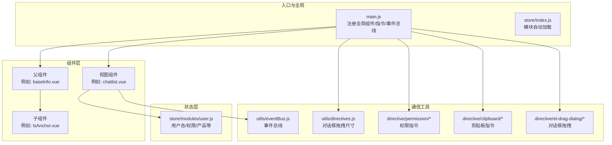
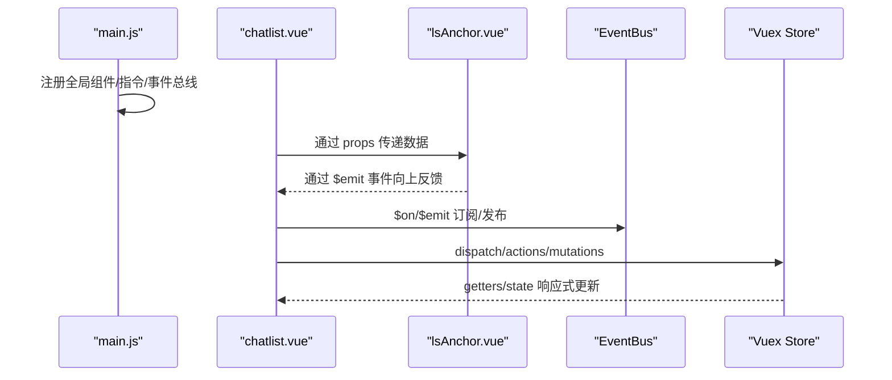
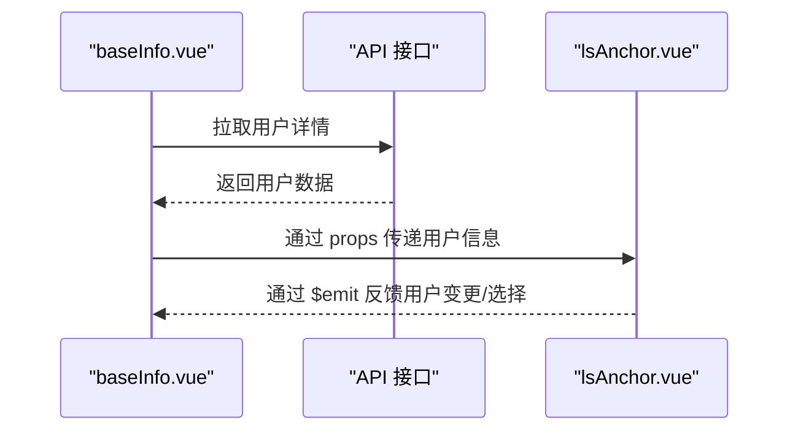
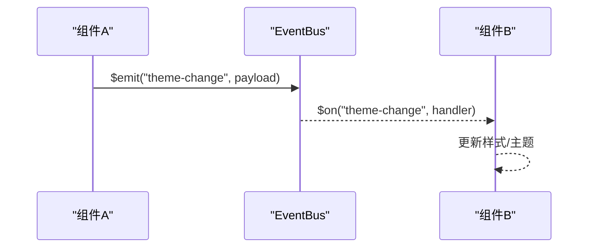
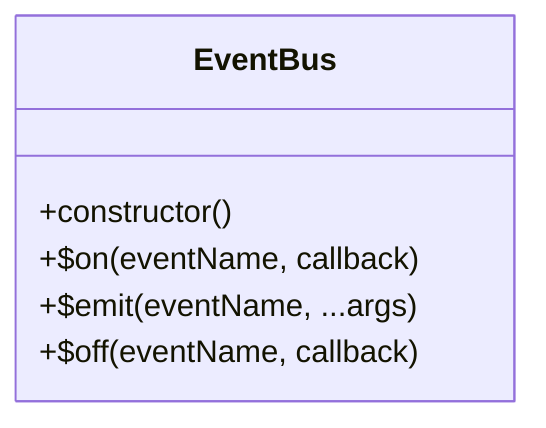
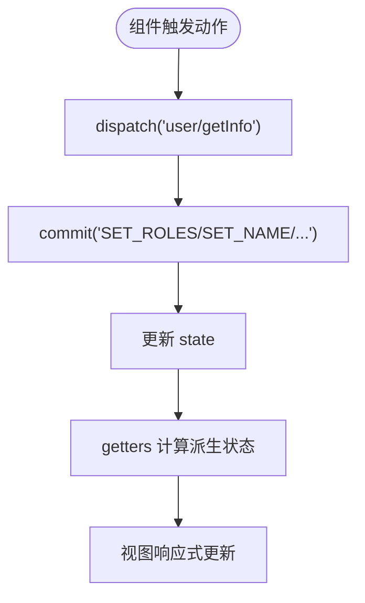
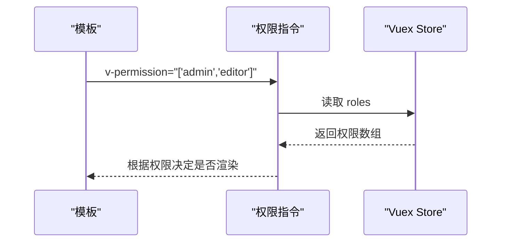
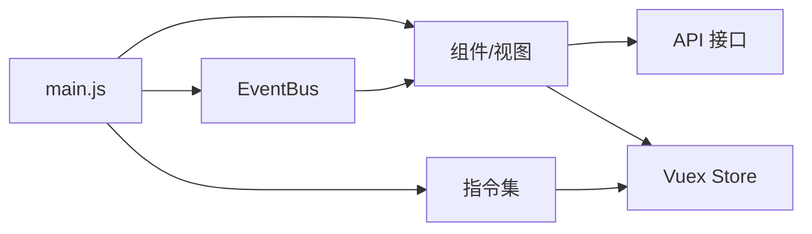

# 组件通信机制

<cite>
**本文引用的文件**
- [eventBus.js](file://src/utils/eventBus.js)
- [main.js](file://src/main.js)
- [directives.js](file://src/utils/directives.js)
- [permission/index.js](file://src/directive/permission/index.js)
- [permission/permission.js](file://src/directive/permission/permission.js)
- [clipboard/index.js](file://src/directive/clipboard/index.js)
- [clipboard/clipboard.js](file://src/directive/clipboard/clipboard.js)
- [drag.js](file://src/directive/el-drag-dialog/drag.js)
- [index.js](file://src/store/index.js)
- [user.js](file://src/store/modules/user.js)
- [baseInfo.vue](file://src/components/leisu/peopleInfo/baseInfo.vue)
- [lsAnchor.vue](file://src/components/leisu/radio/lsAnchor.vue)
- [chatlist.vue](file://src/views/chat_room/chatlist.vue)
</cite>

## 目录
1. [简介](#简介)
2. [项目结构](#项目结构)
3. [核心组件](#核心组件)
4. [架构总览](#架构总览)
5. [详细组件分析](#详细组件分析)
6. [依赖关系分析](#依赖关系分析)
7. [性能考量](#性能考量)
8. [故障排查指南](#故障排查指南)
9. [结论](#结论)
10. [附录](#附录)

## 简介
本文件系统性梳理 Leisu Admin 项目的组件通信机制，覆盖以下主题：
- 父子组件通信：props 与事件、双向绑定、事件透传
- 兄弟组件通信：通过共同父组件或事件总线
- 跨层级通信：provide/inject、事件总线、Vuex
- 事件总线设计与使用：发布/订阅、作用域与内存泄漏防护
- Vuex 状态管理：模块化、状态共享、动作触发、订阅监听
- 自定义指令：权限控制、复制、对话框拖拽等
- 最佳实践、性能优化与常见问题

## 项目结构
本项目采用 Vue 2 + Vuex 的前端架构，组件以功能域划分，状态集中于 store/modules 下，全局工具与指令在 utils 与 directive 目录中注册。

图表来源
- [main.js:1-526](file://src/main.js#L1-L526)
- [index.js:1-26](file://src/store/index.js#L1-L26)
- [user.js:1-541](file://src/store/modules/user.js#L1-L541)
- [eventBus.js:1-56](file://src/utils/eventBus.js#L1-L56)
- [directives.js:1-74](file://src/utils/directives.js#L1-L74)
- [permission/index.js:1-14](file://src/directive/permission/index.js#L1-L14)
- [permission/permission.js:1-23](file://src/directive/permission/permission.js#L1-L23)
- [clipboard/index.js:1-14](file://src/directive/clipboard/index.js#L1-L14)
- [clipboard/clipboard.js:1-50](file://src/directive/clipboard/clipboard.js#L1-L50)
- [drag.js:1-78](file://src/directive/el-drag-dialog/drag.js#L1-L78)
- [baseInfo.vue:1-199](file://src/components/leisu/peopleInfo/baseInfo.vue#L1-L199)
- [lsAnchor.vue:1-39](file://src/components/leisu/radio/lsAnchor.vue#L1-L39)
- [chatlist.vue:1-1302](file://src/views/chat_room/chatlist.vue#L1-L1302)

章节来源
- [main.js:1-526](file://src/main.js#L1-L526)
- [index.js:1-26](file://src/store/index.js#L1-L26)

## 核心组件
- 事件总线 EventBus：轻量级发布/订阅，支持 $on/$emit/$off
- 全局指令：权限指令、剪贴板指令、对话框拖拽指令
- Vuex Store：模块化状态管理，自动加载 modules
- 组件示例：父子组件通信（props/事件）、跨组件共享（Vuex/事件总线）

章节来源
- [eventBus.js:1-56](file://src/utils/eventBus.js#L1-L56)
- [main.js:1-526](file://src/main.js#L1-L526)
- [index.js:1-26](file://src/store/index.js#L1-L26)
- [user.js:1-541](file://src/store/modules/user.js#L1-L541)

## 架构总览
下图展示从入口到组件、指令、状态与事件总线的整体交互：

图表来源
- [main.js:515-518](file://src/main.js#L515-L518)
- [chatlist.vue:1-1302](file://src/views/chat_room/chatlist.vue#L1-L1302)
- [lsAnchor.vue:1-39](file://src/components/leisu/radio/lsAnchor.vue#L1-L39)
- [eventBus.js:1-56](file://src/utils/eventBus.js#L1-L56)
- [index.js:1-26](file://src/store/index.js#L1-L26)

## 详细组件分析

### 父子组件通信（props 与事件）
- 父向子传递：通过 props 向子组件传递数据（如 uid、price）
- 子向父反馈：子组件通过 $emit 触发自定义事件，父组件在模板中监听
- 示例参考：
  - 父组件：baseInfo.vue（接收 uid/price，发起 API 请求，$emit 用户信息）
  - 子组件：lsAnchor.vue（接收 row，渲染用户头像与昵称）

图表来源
- [baseInfo.vue:167-196](file://src/components/leisu/peopleInfo/baseInfo.vue#L167-L196)
- [lsAnchor.vue:21-38](file://src/components/leisu/radio/lsAnchor.vue#L21-L38)

章节来源
- [baseInfo.vue:167-196](file://src/components/leisu/peopleInfo/baseInfo.vue#L167-L196)
- [lsAnchor.vue:21-38](file://src/components/leisu/radio/lsAnchor.vue#L21-L38)

### 兄弟组件通信（通过共同父组件或事件总线）
- 共同父组件：通过父组件作为中介，接收一个子组件事件后再向另一个子组件派发
- 事件总线：兄弟组件各自订阅/发布事件，实现松耦合通信
- 示例参考：
  - chatlist.vue 中通过事件总线进行主题色切换、礼物列表等跨组件联动

图表来源
- [chatlist.vue:664-726](file://src/views/chat_room/chatlist.vue#L664-L726)
- [eventBus.js:31-36](file://src/utils/eventBus.js#L31-L36)

章节来源
- [chatlist.vue:664-726](file://src/views/chat_room/chatlist.vue#L664-L726)
- [eventBus.js:1-56](file://src/utils/eventBus.js#L1-L56)

### 跨层级组件通信（provide/inject 与事件总线）
- provide/inject：在祖先组件提供共享上下文，后代组件按需注入
- 事件总线：适用于任意层级的组件通信，便于解耦
- 本项目未显式使用 provide/inject；但可结合事件总线实现跨层级共享

章节来源
- [eventBus.js:1-56](file://src/utils/eventBus.js#L1-L56)

### 事件总线 EventBus 设计与使用
- 设计要点：事件表存储、订阅/发布/取消订阅
- 使用模式：在入口注册为 Vue.prototype.$eventBus，组件中通过 $on/$emit/$off 管理
- 内存泄漏防护：组件销毁时应取消订阅（见 chatlist.vue 的 destroyed 生命周期中取消 MQTT 订阅，可借鉴此策略清理事件订阅）

图表来源
- [eventBus.js:5-53](file://src/utils/eventBus.js#L5-L53)

章节来源
- [eventBus.js:1-56](file://src/utils/eventBus.js#L1-L56)
- [main.js:515-518](file://src/main.js#L515-L518)
- [chatlist.vue:547-559](file://src/views/chat_room/chatlist.vue#L547-L559)

### Vuex 状态管理在组件通信中的应用
- 模块化：store/index.js 自动加载 modules 目录下的模块
- 用户模块：user.js 提供登录、权限、产品列表等状态与动作
- 组件使用：通过 $store.dispatch、$store.commit、$store.getters 访问状态与动作
- 示例参考：chatlist.vue 中使用 $store.getters.mangeid、user 模块的 actions

图表来源
- [index.js:8-18](file://src/store/index.js#L8-L18)
- [user.js:139-335](file://src/store/modules/user.js#L139-L335)
- [chatlist.vue:586-592](file://src/views/chat_room/chatlist.vue#L586-L592)

章节来源
- [index.js:1-26](file://src/store/index.js#L1-L26)
- [user.js:1-541](file://src/store/modules/user.js#L1-L541)
- [chatlist.vue:586-592](file://src/views/chat_room/chatlist.vue#L586-L592)

### 自定义指令在组件通信中的作用
- 权限指令：v-permission 根据用户角色动态显示/隐藏 DOM
- 剪贴板指令：v-clipboard/v-cut，封装复制/剪切逻辑并回调成功/失败
- 对话框拖拽指令：v-dialogDrag/v-dialogDragWidth，实现弹窗拖拽与宽度调整
- 入口注册：main.js 中引入并注册指令

图表来源
- [permission/index.js:1-14](file://src/directive/permission/index.js#L1-L14)
- [permission/permission.js:1-23](file://src/directive/permission/permission.js#L1-L23)
- [main.js:492-497](file://src/main.js#L492-L497)

章节来源
- [permission/index.js:1-14](file://src/directive/permission/index.js#L1-L14)
- [permission/permission.js:1-23](file://src/directive/permission/permission.js#L1-L23)
- [clipboard/index.js:1-14](file://src/directive/clipboard/index.js#L1-L14)
- [clipboard/clipboard.js:1-50](file://src/directive/clipboard/clipboard.js#L1-L50)
- [drag.js:1-78](file://src/directive/el-drag-dialog/drag.js#L1-L78)
- [directives.js:1-74](file://src/utils/directives.js#L1-L74)
- [main.js:83-96](file://src/main.js#L83-L96)

## 依赖关系分析
- 入口依赖：main.js 注入全局组件、指令、事件总线、过滤器、Element UI
- 组件依赖：视图组件依赖 API、工具方法、事件总线、Vuex、第三方库
- 指令依赖：权限/剪贴板/拖拽指令依赖 store 与外部库
- 状态依赖：用户模块依赖 API 与路由，提供角色、产品、渠道等数据

图表来源
- [main.js:1-526](file://src/main.js#L1-L526)
- [index.js:1-26](file://src/store/index.js#L1-L26)
- [eventBus.js:1-56](file://src/utils/eventBus.js#L1-L56)

章节来源
- [main.js:1-526](file://src/main.js#L1-L526)
- [index.js:1-26](file://src/store/index.js#L1-L26)

## 性能考量
- 事件总线订阅清理：组件销毁时务必取消订阅，避免内存泄漏
- 指令生命周期：确保在 unbind 钩子中释放外部资源（如 clipboard 实例）
- Vuex 动作异步：避免在 actions 中阻塞主线程，合理拆分与并发
- 组件渲染：减少不必要的 props 传递与深层嵌套，使用计算属性与缓存

## 故障排查指南
- 事件总线无效
  - 检查是否在入口正确挂载到 Vue.prototype
  - 确认组件生命周期内订阅/取消订阅成对出现
  - 参考：[main.js:515-518](file://src/main.js#L515-L518)，[eventBus.js:1-56](file://src/utils/eventBus.js#L1-L56)
- 权限指令不生效
  - 确认 v-permission 传入数组且角色存在于 store.getters.roles
  - 参考：[permission/permission.js:1-23](file://src/directive/permission/permission.js#L1-L23)
- 剪贴板指令无响应
  - 确认 clipboard 库已安装并在指令中正确引用
  - 参考：[clipboard/clipboard.js:1-50](file://src/directive/clipboard/clipboard.js#L1-L50)
- 对话框拖拽异常
  - 检查 .el-dialog 与 .el-dialog__header 选择器是否存在
  - 参考：[drag.js:1-78](file://src/directive/el-drag-dialog/drag.js#L1-L78)
- Vuex 状态未更新
  - 确认 actions/mutations 是否正确提交，命名空间是否一致
  - 参考：[index.js:1-26](file://src/store/index.js#L1-L26)，[user.js:1-541](file://src/store/modules/user.js#L1-L541)

章节来源
- [main.js:515-518](file://src/main.js#L515-L518)
- [eventBus.js:1-56](file://src/utils/eventBus.js#L1-L56)
- [permission/permission.js:1-23](file://src/directive/permission/permission.js#L1-L23)
- [clipboard/clipboard.js:1-50](file://src/directive/clipboard/clipboard.js#L1-L50)
- [drag.js:1-78](file://src/directive/el-drag-dialog/drag.js#L1-L78)
- [index.js:1-26](file://src/store/index.js#L1-L26)
- [user.js:1-541](file://src/store/modules/user.js#L1-L541)

## 结论
Leisu Admin 通过“入口统一注册 + 组件 props/事件 + 事件总线 + Vuex + 自定义指令”的组合，实现了灵活而清晰的组件通信体系。建议在复杂场景优先考虑 Vuex 与事件总线，保持组件边界清晰；在权限控制与常用交互上使用指令提升复用性与一致性。

## 附录
- 通信机制选择指南
  - 父子通信：props + $emit
  - 兄弟通信：共同父组件或事件总线
  - 跨层级：事件总线或 Vuex
  - 权限控制：v-permission 指令
  - 复制/剪切：v-clipboard 指令
  - 对话框拖拽：v-dialogDrag / v-dialogDragWidth
- 使用示例路径
  - 事件总线：[main.js:515-518](file://src/main.js#L515-L518)，[eventBus.js:1-56](file://src/utils/eventBus.js#L1-L56)
  - 权限指令：[permission/index.js:1-14](file://src/directive/permission/index.js#L1-L14)，[permission/permission.js:1-23](file://src/directive/permission/permission.js#L1-L23)
  - 剪贴板指令：[clipboard/index.js:1-14](file://src/directive/clipboard/index.js#L1-L14)，[clipboard/clipboard.js:1-50](file://src/directive/clipboard/clipboard.js#L1-L50)
  - 对话框拖拽：[drag.js:1-78](file://src/directive/el-drag-dialog/drag.js#L1-L78)，[directives.js:1-74](file://src/utils/directives.js#L1-L74)
  - Vuex：[index.js:1-26](file://src/store/index.js#L1-L26)，[user.js:1-541](file://src/store/modules/user.js#L1-L541)
  - 父子通信示例：[baseInfo.vue:167-196](file://src/components/leisu/peopleInfo/baseInfo.vue#L167-L196)，[lsAnchor.vue:21-38](file://src/components/leisu/radio/lsAnchor.vue#L21-L38)
  - 视图组件通信示例：[chatlist.vue:586-726](file://src/views/chat_room/chatlist.vue#L586-L726)