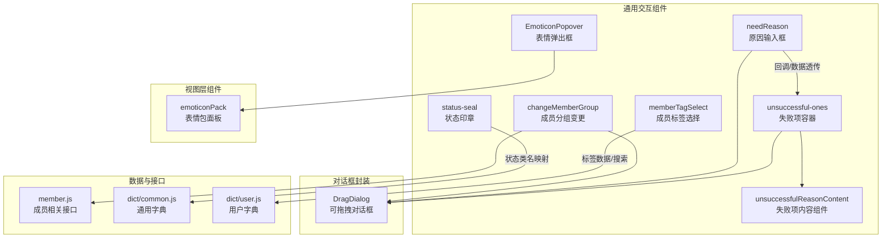
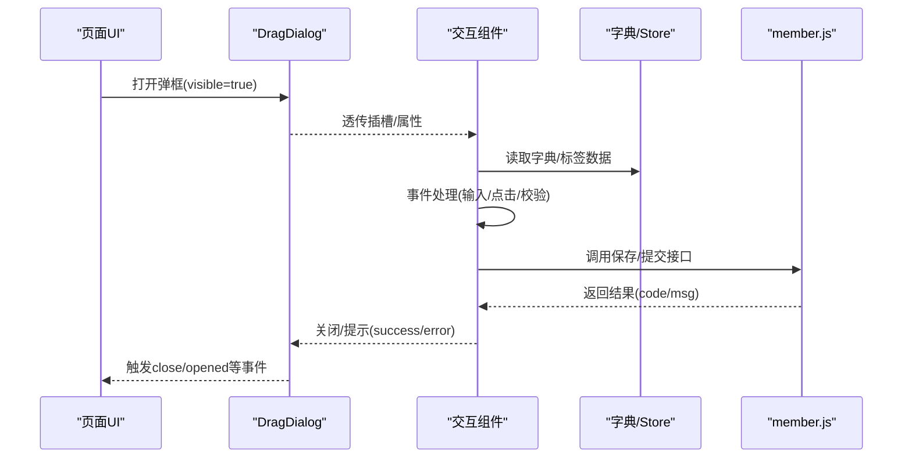
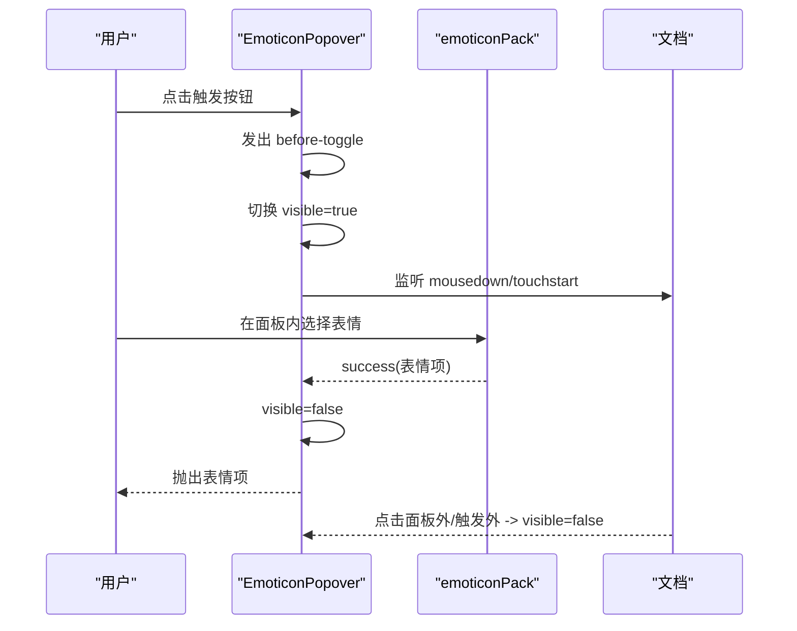
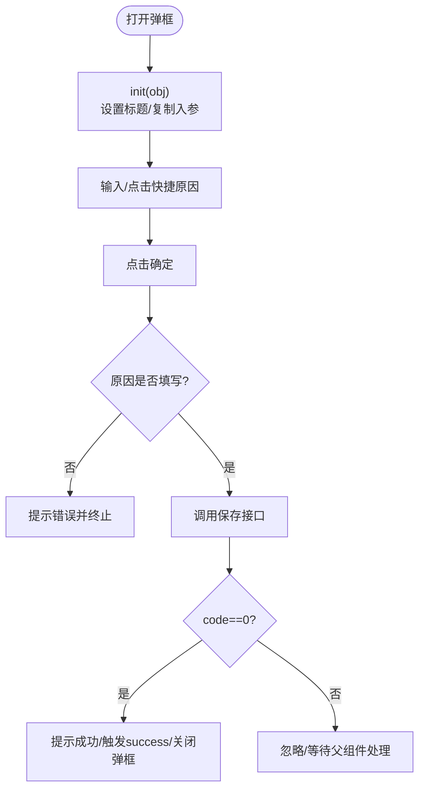
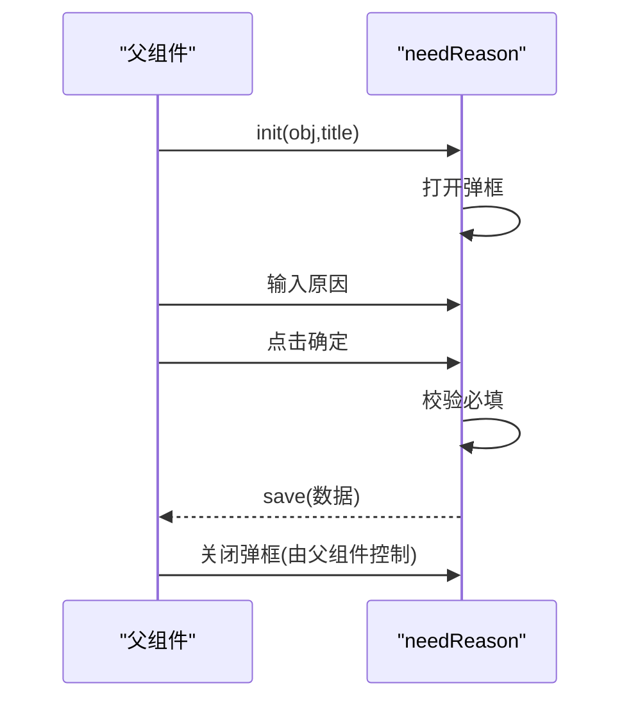
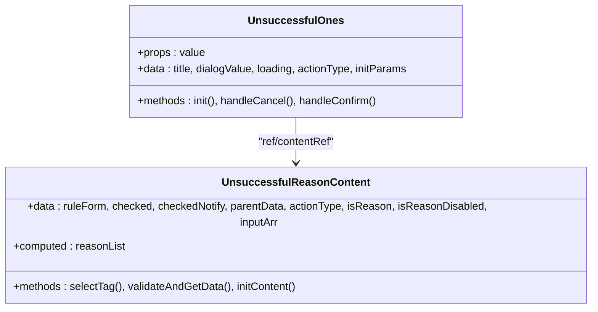
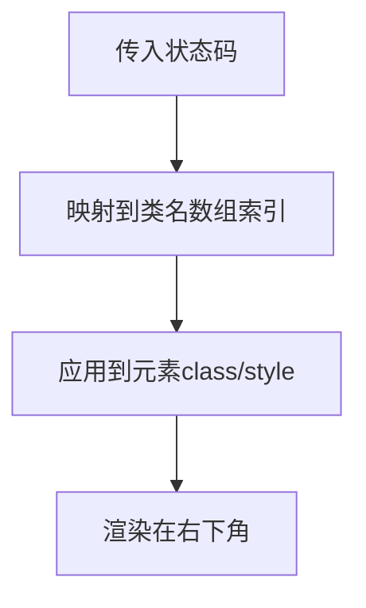
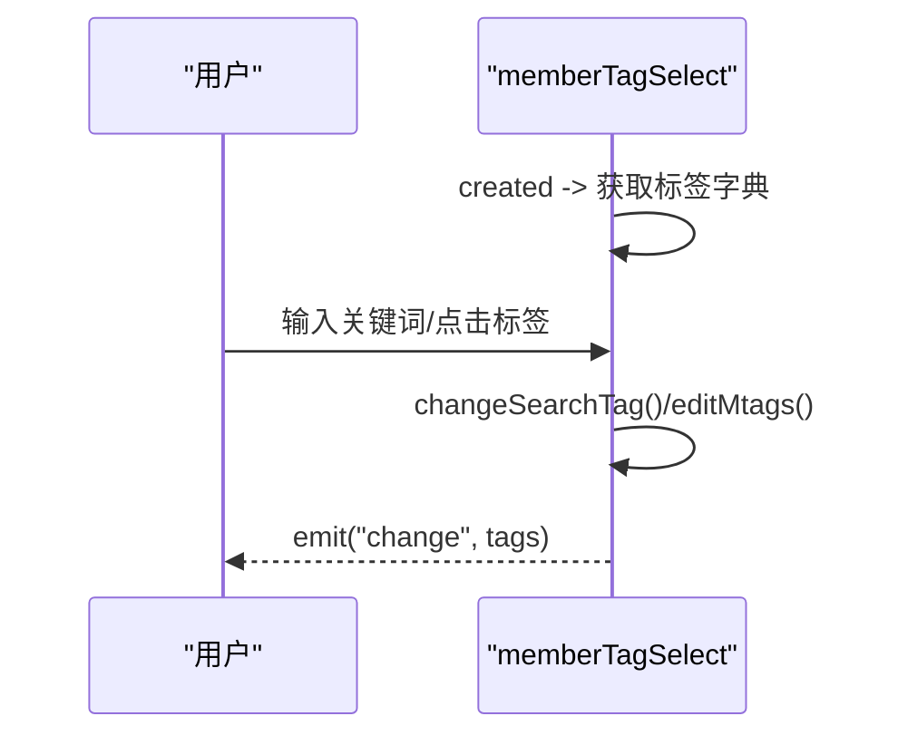
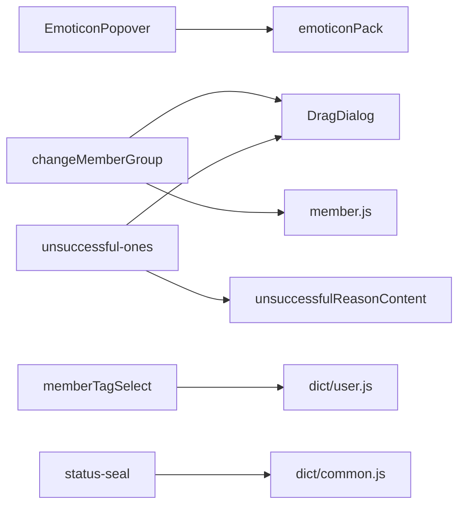

# 交互组件

<cite>
**本文引用的文件**
- [EmoticonPopover.vue](file://src/components/general/EmoticonPopover.vue)
- [emoticonPack.vue](file://src/views/chat_room/emoticonPack.vue)
- [changeMemberGroup.vue](file://src/components/general/changeMemberGroup.vue)
- [needReason.vue](file://src/components/general/needReason.vue)
- [unsuccessful-ones.vue](file://src/components/general/unsuccessful-ones.vue)
- [unsuccessfulReasonContent.vue](file://src/components/general/unsuccessfulReasonContent.vue)
- [status-seal.vue](file://src/components/general/status-seal.vue)
- [memberTagSelect.vue](file://src/components/general/memberTagSelect.vue)
- [DragDialog/index.vue](file://src/components/DragDialog/index.vue)
- [member.js](file://src/api/member.js)
- [dict/common.js](file://src/utils/dict/common.js)
- [dict/user.js](file://src/utils/dict/user.js)
</cite>

## 目录
1. [简介](#简介)
2. [项目结构](#项目结构)
3. [核心组件](#核心组件)
4. [架构总览](#架构总览)
5. [详细组件分析](#详细组件分析)
6. [依赖分析](#依赖分析)
7. [性能考量](#性能考量)
8. [故障排查指南](#故障排查指南)
9. [结论](#结论)
10. [附录](#附录)

## 简介
本文件聚焦 Leisu Admin 项目的交互组件，围绕以下主题展开：
- 表情弹出框的交互设计与事件处理
- 成员分组变更的流程控制与原因收集
- 原因输入框的验证机制与反馈策略
- 状态标识的视觉设计与语义化映射
- 失败项处理的容器化封装与内容组件解耦
- 成员标签选择的交互模式与数据联动
- 组件在业务流程中的作用与协作关系

目标是帮助开发者与产品同学理解组件的设计原则、使用场景、配置项与扩展方法，并提供排障与优化建议。

## 项目结构
交互组件主要分布在通用组件目录与视图层特定组件中，配合对话框封装、API 与字典数据实现完整的交互闭环。

图表来源
- [EmoticonPopover.vue:1-87](file://src/components/general/EmoticonPopover.vue#L1-L87)
- [emoticonPack.vue:1-601](file://src/views/chat_room/emoticonPack.vue#L1-L601)
- [changeMemberGroup.vue:1-107](file://src/components/general/changeMemberGroup.vue#L1-L107)
- [needReason.vue:1-75](file://src/components/general/needReason.vue#L1-L75)
- [unsuccessful-ones.vue:1-98](file://src/components/general/unsuccessful-ones.vue#L1-L98)
- [unsuccessfulReasonContent.vue:1-135](file://src/components/general/unsuccessfulReasonContent.vue#L1-L135)
- [status-seal.vue:1-55](file://src/components/general/status-seal.vue#L1-L55)
- [memberTagSelect.vue:1-117](file://src/components/general/memberTagSelect.vue#L1-L117)
- [DragDialog/index.vue:1-47](file://src/components/DragDialog/index.vue#L1-L47)
- [member.js:1-814](file://src/api/member.js#L1-L814)
- [dict/common.js:332-352](file://src/utils/dict/common.js#L332-L352)
- [dict/user.js:1-32](file://src/utils/dict/user.js#L1-L32)

章节来源
- [EmoticonPopover.vue:1-87](file://src/components/general/EmoticonPopover.vue#L1-L87)
- [changeMemberGroup.vue:1-107](file://src/components/general/changeMemberGroup.vue#L1-L107)
- [needReason.vue:1-75](file://src/components/general/needReason.vue#L1-L75)
- [unsuccessful-ones.vue:1-98](file://src/components/general/unsuccessful-ones.vue#L1-L98)
- [unsuccessfulReasonContent.vue:1-135](file://src/components/general/unsuccessfulReasonContent.vue#L1-L135)
- [status-seal.vue:1-55](file://src/components/general/status-seal.vue#L1-L55)
- [memberTagSelect.vue:1-117](file://src/components/general/memberTagSelect.vue#L1-L117)
- [DragDialog/index.vue:1-47](file://src/components/DragDialog/index.vue#L1-L47)
- [member.js:127-134](file://src/api/member.js#L127-L134)
- [dict/common.js:332-352](file://src/utils/dict/common.js#L332-L352)
- [dict/user.js:1-32](file://src/utils/dict/user.js#L1-L32)

## 核心组件
- 表情弹出框（EmoticonPopover + emoticonPack）
  - 设计要点：手动控制显隐、点击空白区域关闭、触发前先通知父组件锁定选区、支持禁用态与标签页隐藏
  - 事件链：触发按钮 -> 切换 visible -> 面板点击捕获 -> 文档点击捕获 -> 选择成功回调
- 成员分组变更（changeMemberGroup）
  - 流程控制：弹框输入原因 -> 标签快速填充 -> 提交调用保存接口 -> 成功提示与关闭
  - 数据来源：用户分组字典与变更原因字典
- 原因输入框（needReason）
  - 单一用途：弹框收集原因，必填校验，通过事件向外抛出数据
- 失败项处理（unsuccessful-ones + unsuccessfulReasonContent）
  - 容器化设计：仅负责弹框与按钮状态，具体校验与数据组装在内容组件内
  - 功能：原因输入、快捷标签、是否通知用户、删除原图等开关
- 状态印章（status-seal）
  - 视觉设计：基于状态码映射不同类名，绝对定位叠加在元素右下角
- 成员标签选择（memberTagSelect）
  - 交互模式：点击触发弹出标签页，支持搜索、多选、全量/去全量切换、标签移除
  - 数据联动：从全局状态获取标签字典，双向绑定标签集合

章节来源
- [EmoticonPopover.vue:19-79](file://src/components/general/EmoticonPopover.vue#L19-L79)
- [emoticonPack.vue:302-599](file://src/views/chat_room/emoticonPack.vue#L302-L599)
- [changeMemberGroup.vue:34-94](file://src/components/general/changeMemberGroup.vue#L34-L94)
- [needReason.vue:29-71](file://src/components/general/needReason.vue#L29-L71)
- [unsuccessful-ones.vue:20-85](file://src/components/general/unsuccessful-ones.vue#L20-L85)
- [unsuccessfulReasonContent.vue:23-116](file://src/components/general/unsuccessfulReasonContent.vue#L23-L116)
- [status-seal.vue:6-46](file://src/components/general/status-seal.vue#L6-L46)
- [memberTagSelect.vue:56-116](file://src/components/general/memberTagSelect.vue#L56-L116)

## 架构总览
交互组件与对话框、API、字典之间的协作关系如下：

图表来源
- [DragDialog/index.vue:3-12](file://src/components/DragDialog/index.vue#L3-L12)
- [changeMemberGroup.vue:73-92](file://src/components/general/changeMemberGroup.vue#L73-L92)
- [member.js:127-134](file://src/api/member.js#L127-L134)
- [dict/user.js:1-32](file://src/utils/dict/user.js#L1-L32)

## 详细组件分析

### 表情弹出框（EmoticonPopover + emoticonPack）
- 交互设计
  - 手动显隐：通过 v-model 控制 visible，避免与 Element 的自动行为冲突
  - 点击外部关闭：监听文档级 mousedown/touchstart，若点击不在触发元素与面板内则关闭
  - 锁定选区：在切换显隐前发出 before-toggle 事件，确保富文本编辑器不丢失焦点
  - 面板交互：面板内嵌 emoticonPack，支持分类/分组/表情的拖拽排序与编辑
- 事件处理
  - 触发按钮：onTriggerMousedown -> 切换 visible -> 发出 before-toggle
  - 面板点击：onPanelMousedown -> 若点击非面板区域则关闭
  - 文档点击：onDocumentMousedown -> 若点击非触发/面板区域则关闭
  - 选择成功：onPackSuccess -> 关闭面板并向上抛出所选表情项
- 性能与可用性
  - 使用计算属性与本地状态控制可见性，减少不必要的渲染
  - 面板内大量 DOM 由 emoticonPack 管理，保持组件职责清晰

图表来源
- [EmoticonPopover.vue:44-77](file://src/components/general/EmoticonPopover.vue#L44-L77)
- [emoticonPack.vue:326-331](file://src/views/chat_room/emoticonPack.vue#L326-L331)

章节来源
- [EmoticonPopover.vue:19-79](file://src/components/general/EmoticonPopover.vue#L19-L79)
- [emoticonPack.vue:302-599](file://src/views/chat_room/emoticonPack.vue#L302-L599)

### 成员分组变更（changeMemberGroup）
- 流程控制
  - 初始化：init(obj) 设置标题、打开弹框、复制入参
  - 输入校验：保存前检查原因字段，未填写则提示错误
  - 提交流程：将 data(reason 可选) 通过 save_member_group 调用接口
  - 结果处理：成功返回后提示成功、触发 success 事件并关闭弹框
- 字典与原因
  - 标题来源于用户分组字典 userGroupObj
  - 快捷原因来源于 userGroupObjReason，点击后追加到输入框
- 事件与状态
  - 外部通过 v-model 控制显示隐藏
  - 通过 close 与 success 事件与父组件通信

图表来源
- [changeMemberGroup.vue:68-92](file://src/components/general/changeMemberGroup.vue#L68-L92)
- [member.js:127-134](file://src/api/member.js#L127-L134)
- [dict/user.js:1-32](file://src/utils/dict/user.js#L1-L32)

章节来源
- [changeMemberGroup.vue:34-94](file://src/components/general/changeMemberGroup.vue#L34-L94)
- [member.js:127-134](file://src/api/member.js#L127-L134)
- [dict/user.js:1-32](file://src/utils/dict/user.js#L1-L32)

### 原因输入框（needReason）
- 用途：通用原因收集弹框，适用于多种业务场景
- 校验：必填校验，未填写则提示错误
- 数据：将包含 reason 的对象通过 save 事件向外抛出，父组件负责后续关闭弹框

图表来源
- [needReason.vue:52-69](file://src/components/general/needReason.vue#L52-L69)

章节来源
- [needReason.vue:29-71](file://src/components/general/needReason.vue#L29-L71)

### 失败项处理（unsuccessful-ones + unsuccessfulReasonContent）
- 容器化设计
  - unsuccessful-ones 仅负责弹框与按钮状态，不包含业务逻辑
  - 通过 v-if 控制内容组件销毁/重建，避免状态残留
  - 通过 $emit("on-save", data) 向父组件传递最终数据
- 内容组件职责
  - unsuccessfulReasonContent 负责：
    - 原因输入与占位文案
    - 快捷标签（删除原因字典）与“其他”自定义输入
    - 是否通知用户、删除原图等开关
    - validateAndGetData 统一校验与组装数据
- 参数透传
  - 容器通过 init(title, data, type, isReason) 将参数转交给内容组件
  - 内容组件通过 initContent 完成内部初始化

图表来源
- [unsuccessful-ones.vue:23-85](file://src/components/general/unsuccessful-ones.vue#L23-L85)
- [unsuccessfulReasonContent.vue:26-116](file://src/components/general/unsuccessfulReasonContent.vue#L26-L116)
- [dict/common.js:332-352](file://src/utils/dict/common.js#L332-L352)

章节来源
- [unsuccessful-ones.vue:20-85](file://src/components/general/unsuccessful-ones.vue#L20-L85)
- [unsuccessfulReasonContent.vue:23-116](file://src/components/general/unsuccessfulReasonContent.vue#L23-L116)
- [dict/common.js:332-352](file://src/utils/dict/common.js#L332-L352)

### 状态印章（status-seal）
- 视觉设计：基于状态码映射不同类名，支持宽高与定位定制
- 使用场景：在列表/卡片右下角叠加状态标识，如命中、未命中、封禁、半赢等

图表来源
- [status-seal.vue:38-46](file://src/components/general/status-seal.vue#L38-L46)
- [dict/common.js:332-352](file://src/utils/dict/common.js#L332-L352)

章节来源
- [status-seal.vue:6-46](file://src/components/general/status-seal.vue#L6-L46)
- [dict/common.js:332-352](file://src/utils/dict/common.js#L332-L352)

### 成员标签选择（memberTagSelect）
- 交互模式
  - 弹出式标签选择，支持搜索、多选、全量/去全量切换
  - 已选标签可关闭移除，标签来自全局状态
- 数据联动
  - created 生命周期中通过 dispatch("user/setMemberTagMsg") 获取标签字典
  - 通过 emit("change", tags) 向父组件传递最新标签集合

图表来源
- [memberTagSelect.vue:69-114](file://src/components/general/memberTagSelect.vue#L69-L114)

章节来源
- [memberTagSelect.vue:56-116](file://src/components/general/memberTagSelect.vue#L56-L116)

## 依赖分析
- 组件耦合
  - EmoticonPopover 依赖 emoticonPack 与字典/Store，耦合度适中
  - changeMemberGroup 依赖 DragDialog 与 member.js，职责清晰
  - unsuccessful-ones 与 unsuccessfulReasonContent 通过 ref 与事件解耦
- 外部依赖
  - Element UI 的对话框、表单、标签、按钮等组件
  - API 层的成员相关接口
  - 字典层的用户/通用原因等枚举

图表来源
- [EmoticonPopover.vue:17-21](file://src/components/general/EmoticonPopover.vue#L17-L21)
- [changeMemberGroup.vue:35-36](file://src/components/general/changeMemberGroup.vue#L35-L36)
- [unsuccessful-ones.vue:21](file://src/components/general/unsuccessful-ones.vue#L21)
- [memberTagSelect.vue:73-82](file://src/components/general/memberTagSelect.vue#L73-L82)
- [status-seal.vue:40](file://src/components/general/status-seal.vue#L40)
- [member.js:127-134](file://src/api/member.js#L127-L134)
- [dict/user.js:1-32](file://src/utils/dict/user.js#L1-L32)
- [dict/common.js:332-352](file://src/utils/dict/common.js#L332-L352)

章节来源
- [DragDialog/index.vue:15-46](file://src/components/DragDialog/index.vue#L15-L46)
- [member.js:127-134](file://src/api/member.js#L127-L134)

## 性能考量
- DOM 销毁与重建
  - unsuccessful-ones 通过 v-if 控制内容组件生命周期，避免状态残留与重复渲染
- 事件监听
  - EmoticonPopover 在 mounted 中注册文档级事件，在 beforeDestroy 中清理，防止内存泄漏
- 数据获取
  - memberTagSelect 在 created 中一次性获取标签字典，减少重复请求
- 交互反馈
  - 统一使用 $message 提示，避免额外 UI 开销

## 故障排查指南
- 表情弹出框无法关闭
  - 检查是否正确监听文档点击事件，确认点击区域判断逻辑
  - 确保面板点击捕获不会阻止外部关闭
- 成员分组变更未触发保存
  - 确认原因字段是否为空，必要时增加必填提示
  - 检查 save_member_group 返回码与 msg
- 失败项弹框未关闭
  - 确认父组件在收到 on-save 后是否主动设置 dialogValue=false
  - 检查 validateAndGetData 的返回值与校验逻辑
- 标签选择异常
  - 确认标签字典是否成功获取
  - 检查 emit("change", tags) 是否被父组件正确接收

章节来源
- [EmoticonPopover.vue:40-43](file://src/components/general/EmoticonPopover.vue#L40-L43)
- [changeMemberGroup.vue:73-92](file://src/components/general/changeMemberGroup.vue#L73-L92)
- [unsuccessful-ones.vue:44-67](file://src/components/general/unsuccessful-ones.vue#L44-L67)
- [memberTagSelect.vue:73-82](file://src/components/general/memberTagSelect.vue#L73-L82)

## 结论
上述交互组件通过明确的职责划分、容器化与内容组件分离、以及与字典与 API 的松耦合集成，实现了高可用、易扩展的交互体验。建议在业务扩展时遵循：
- 容器仅负责弹框与状态，内容组件负责校验与数据组装
- 事件与数据尽量单向流动，避免跨组件直接共享状态
- 严格使用统一的消息提示与错误处理，提升一致性

## 附录
- 使用场景
  - 表情弹出框：聊天室、富文本编辑器插入表情
  - 成员分组变更：后台对用户身份/权限进行调整
  - 原因输入框：通用审批/处理场景收集原因
  - 失败项处理：删除/隐藏/举报回复等需要原因与通知的流程
  - 状态印章：列表/卡片中标注命中/封禁等状态
  - 成员标签选择：筛选用户、打标签
- 配置选项
  - EmoticonPopover：width、unEdit、triggerType、triggerSize、triggerText、btnNameDisabled、hideTab
  - DragDialog：visible、title/footer 插槽、v-dialogDrag
  - unsuccessful-ones：value（控制销毁/重建）、init(title, data, type, isReason)
  - status-seal：width、height、status、position
  - memberTagSelect：option、mtags（双向绑定）
- 扩展方法
  - 在容器组件中新增按钮事件与 loading 状态
  - 在内容组件中新增校验规则与数据字段
  - 在字典中补充枚举值，驱动 UI 与校验逻辑