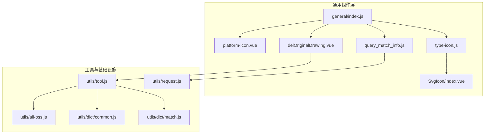
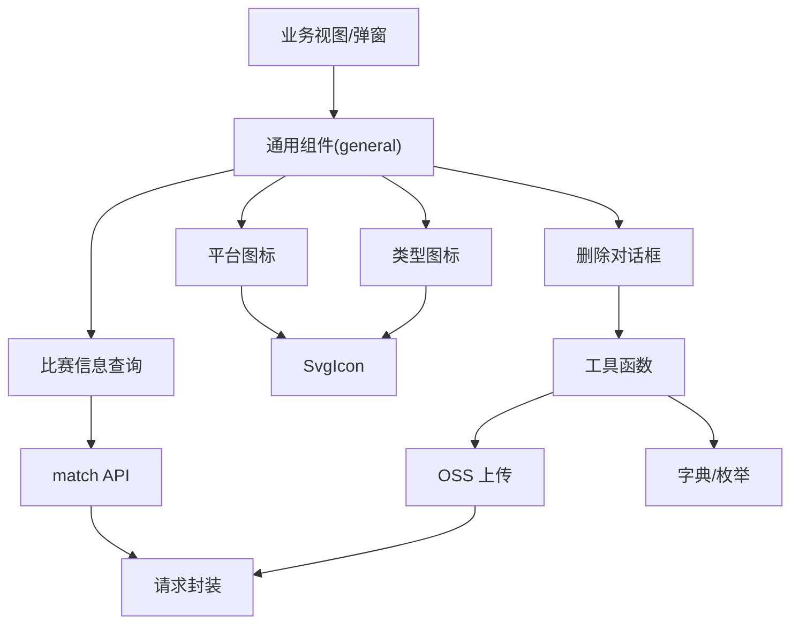
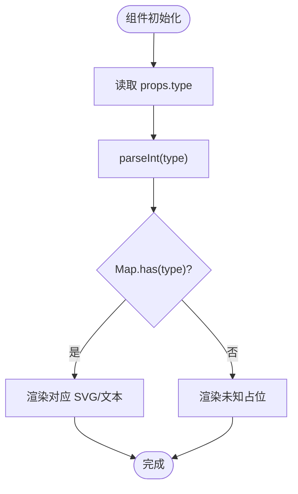
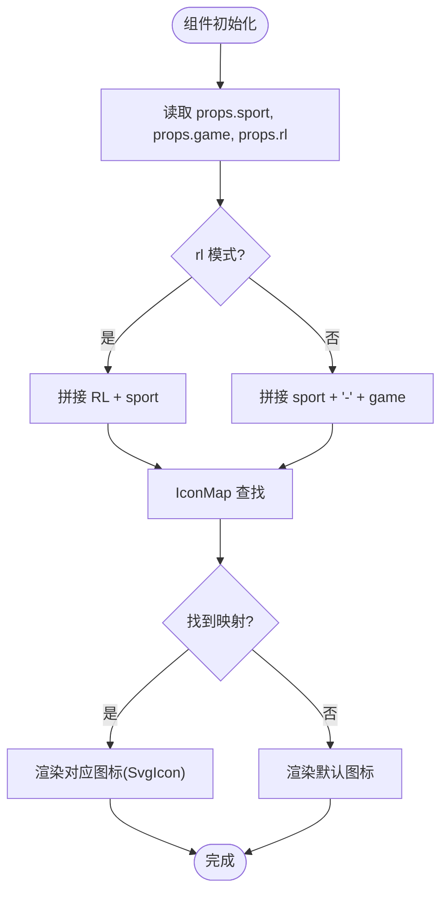
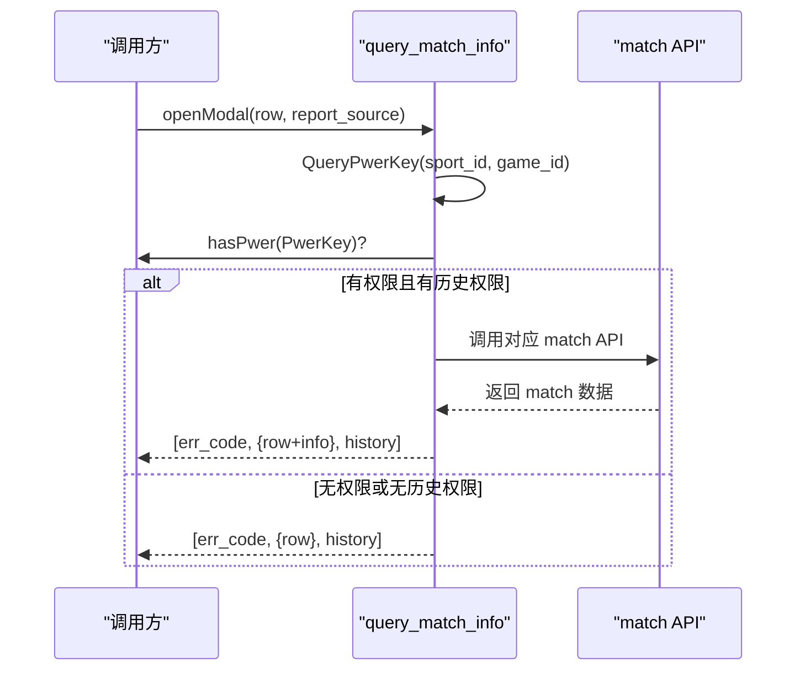
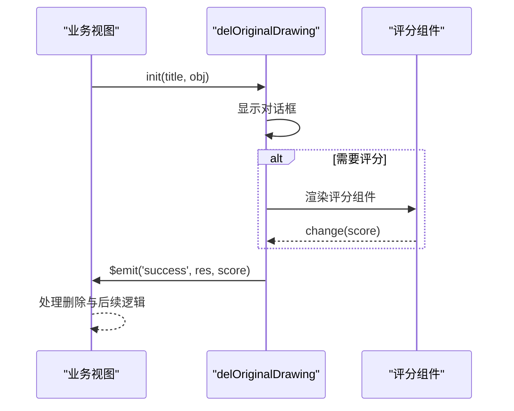
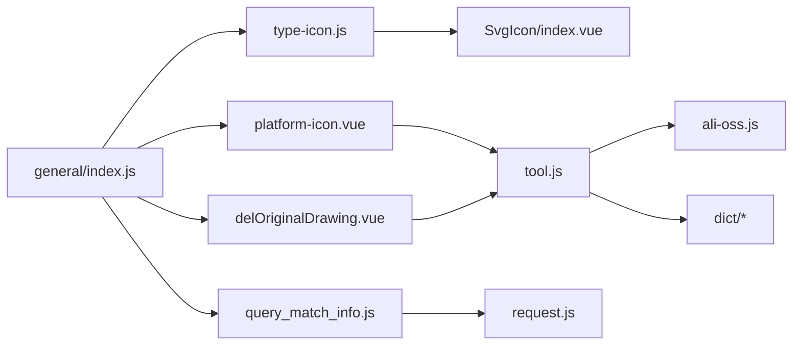

# 工具组件

<cite>
**本文引用的文件**
- [platform-icon.vue](file://src/components/general/platform-icon.vue)
- [type-icon.js](file://src/components/general/type-icon.js)
- [query_match_info.js](file://src/components/general/query_match_info.js)
- [delOriginalDrawing.vue](file://src/components/general/delOriginalDrawing.vue)
- [SvgIcon/index.vue](file://src/components/SvgIcon/index.vue)
- [tool.js](file://src/utils/tool.js)
- [request.js](file://src/utils/request.js)
- [ali-oss.js](file://src/utils/ali-oss.js)
- [dict/common.js](file://src/utils/dict/common.js)
- [dict/match.js](file://src/utils/dict/match.js)
- [general/index.js](file://src/components/general/index.js)
</cite>

## 目录
1. [简介](#简介)
2. [项目结构](#项目结构)
3. [核心组件](#核心组件)
4. [架构总览](#架构总览)
5. [详细组件分析](#详细组件分析)
6. [依赖关系分析](#依赖关系分析)
7. [性能考量](#性能考量)
8. [故障排查指南](#故障排查指南)
9. [结论](#结论)
10. [附录](#附录)

## 简介
本文件面向 Leisu Admin 项目的“工具组件”，系统梳理平台图标组件、类型图标映射、比赛信息查询封装、原始草稿删除对话框等通用工具的能力边界、设计原则、使用方法与扩展能力。文档同时给出配置示例、集成方案与维护建议，解释这些工具组件如何在系统中提供支撑作用并与各模块协同工作。

## 项目结构
工具组件主要分布在以下位置：
- 通用组件注册与导出：src/components/general/index.js
- 平台图标组件：src/components/general/platform-icon.vue
- 类型图标组件：src/components/general/type-icon.js
- 比赛信息查询封装：src/components/general/query_match_info.js
- 原始草稿删除对话框：src/components/general/delOriginalDrawing.vue
- SVG 图标渲染组件：src/components/SvgIcon/index.vue
- 通用工具函数：src/utils/tool.js
- 请求封装与拦截：src/utils/request.js
- 阿里 OSS 上传工具：src/utils/ali-oss.js
- 字典与枚举：src/utils/dict/common.js、src/utils/dict/match.js

图表来源
- [general/index.js:1-41](file://src/components/general/index.js#L1-L41)
- [platform-icon.vue:1-91](file://src/components/general/platform-icon.vue#L1-L91)
- [type-icon.js:1-50](file://src/components/general/type-icon.js#L1-L50)
- [query_match_info.js:1-191](file://src/components/general/query_match_info.js#L1-L191)
- [delOriginalDrawing.vue:1-83](file://src/components/general/delOriginalDrawing.vue#L1-L83)
- [SvgIcon/index.vue:1-63](file://src/components/SvgIcon/index.vue#L1-L63)
- [tool.js:1-800](file://src/utils/tool.js#L1-L800)
- [request.js:1-130](file://src/utils/request.js#L1-L130)
- [ali-oss.js:1-809](file://src/utils/ali-oss.js#L1-L809)
- [dict/common.js:1-723](file://src/utils/dict/common.js#L1-L723)
- [dict/match.js:1-635](file://src/utils/dict/match.js#L1-L635)

章节来源
- [general/index.js:1-41](file://src/components/general/index.js#L1-L41)

## 核心组件
- 平台图标组件：以 Map 映射平台类型到 SVG，支持 label 与 svg 两种输出形态，便于统一展示与文案标注。
- 类型图标组件：根据 sport/game 组合或 RL 模式动态选择对应图标，图标来源于 SvgIcon 组件。
- 比赛信息查询封装：根据 report_source/sport_id/game_id 动态选择对应 API，统一返回弹窗头部信息与权限键。
- 原始草稿删除对话框：提供删除确认、是否删除原图、专家/预测号评分联动保存等能力，统一删除流程与数据回传。
- 通用工具函数：提供平台图标解析、权限格式化、OSS 上传、Base64 处理、时间格式化、数值计算等常用能力。
- 请求封装：统一环境切换、Token 注入、响应拦截与错误提示。
- OSS 上传：Web 直传与 SDK 分片上传、并发控制、取消与中止、进度回调。
- 字典与枚举：平台、比赛状态、跳转类型、来源等多维枚举与映射。

章节来源
- [platform-icon.vue:1-91](file://src/components/general/platform-icon.vue#L1-L91)
- [type-icon.js:1-50](file://src/components/general/type-icon.js#L1-L50)
- [query_match_info.js:1-191](file://src/components/general/query_match_info.js#L1-L191)
- [delOriginalDrawing.vue:1-83](file://src/components/general/delOriginalDrawing.vue#L1-L83)
- [tool.js:1-800](file://src/utils/tool.js#L1-L800)
- [request.js:1-130](file://src/utils/request.js#L1-L130)
- [ali-oss.js:1-809](file://src/utils/ali-oss.js#L1-L809)
- [dict/common.js:1-723](file://src/utils/dict/common.js#L1-L723)
- [dict/match.js:1-635](file://src/utils/dict/match.js#L1-L635)

## 架构总览
工具组件在系统中的定位：
- 通用层：提供跨模块复用的 UI 组件与工具函数，降低重复开发成本。
- 基础设施层：封装网络请求、文件上传、字典枚举，保证一致性与可维护性。
- 业务支撑层：通过统一的查询与权限判定，支撑弹窗头部信息展示与操作控制。

图表来源
- [platform-icon.vue:1-91](file://src/components/general/platform-icon.vue#L1-L91)
- [type-icon.js:1-50](file://src/components/general/type-icon.js#L1-L50)
- [query_match_info.js:1-191](file://src/components/general/query_match_info.js#L1-L191)
- [delOriginalDrawing.vue:1-83](file://src/components/general/delOriginalDrawing.vue#L1-L83)
- [SvgIcon/index.vue:1-63](file://src/components/SvgIcon/index.vue#L1-L63)
- [tool.js:1-800](file://src/utils/tool.js#L1-L800)
- [ali-oss.js:1-809](file://src/utils/ali-oss.js#L1-L809)
- [dict/common.js:1-723](file://src/utils/dict/common.js#L1-L723)
- [dict/match.js:1-635](file://src/utils/dict/match.js#L1-L635)
- [request.js:1-130](file://src/utils/request.js#L1-L130)

## 详细组件分析

### 平台图标组件（platform-icon）
- 设计原则
  - 以 Map 统一管理平台类型到 SVG 的映射，支持 label 与 svg 两种输出形态，满足文案与图标双需求。
  - 支持未知类型兜底，保证 UI 稳定性。
- 使用方法
  - 通过 type 属性传入平台类型，组件内部解析并渲染对应 SVG 或文本。
  - 可结合工具函数 platformSVG 获取 label 或 svg。
- 扩展能力
  - 新增平台类型时，在 Map 中追加键值对即可。
  - 若需国际化或动态文案，可在 props 中增加 label 映射。
- 配置示例
  - 在业务中直接使用组件，传入 type。
  - 或通过工具函数 platformSVG(v, l) 获取 label(svg=false) 或 svg(svg=true)。

图表来源
- [platform-icon.vue:38-87](file://src/components/general/platform-icon.vue#L38-L87)
- [tool.js:11-17](file://src/utils/tool.js#L11-L17)

章节来源
- [platform-icon.vue:1-91](file://src/components/general/platform-icon.vue#L1-L91)
- [tool.js:11-17](file://src/utils/tool.js#L11-L17)

### 类型图标组件（type-icon）
- 设计原则
  - 以 Map 将 sport-game 组合映射到具体图标，支持 RL 模式快速匹配。
  - 默认兜底为通用问号图标，保证异常情况不中断。
- 使用方法
  - 传入 sport 与 game，或开启 rl 模式传入 sport，组件自动选择图标。
  - 图标最终通过 SvgIcon 渲染，确保样式一致。
- 扩展能力
  - 新增组合时在 IconMap 中追加映射。
  - 可扩展 RL 模式下的 sport 到图标映射。
- 配置示例
  - 在业务组件中引入 TypeIcon，传入 sport 与 game 即可。

图表来源
- [type-icon.js:16-48](file://src/components/general/type-icon.js#L16-L48)
- [SvgIcon/index.vue:1-63](file://src/components/SvgIcon/index.vue#L1-L63)

章节来源
- [type-icon.js:1-50](file://src/components/general/type-icon.js#L1-L50)
- [SvgIcon/index.vue:1-63](file://src/components/SvgIcon/index.vue#L1-L63)

### 比赛信息查询封装（query_match_info）
- 设计原则
  - 以 Map 将 report_source-sport-game 组合映射到对应 API，统一查询入口。
  - 提供 QueryModalHeaderInfo 与 QueryPwerKey 两个对外接口，分别负责查询与权限键生成。
- 使用方法
  - openModal(row, report_source)：综合权限校验与查询，返回头部信息与历史记录标记。
  - QueryPwerKey：根据输入参数返回对应权限键，用于权限判断。
- 扩展能力
  - 新增业务来源或游戏类型时，在 MatchMap 与 PwerKeyMap 中追加映射。
  - 支持 program 类型节目单查询。
- 集成方案
  - 在弹窗打开前先调用 QueryPwerKey 判断权限，再调用 QueryModalHeaderInfo 获取数据。
  - openModal 内部已做权限与历史记录判断，简化调用方逻辑。

图表来源
- [query_match_info.js:129-188](file://src/components/general/query_match_info.js#L129-L188)
- [query_match_info.js:149-162](file://src/components/general/query_match_info.js#L149-L162)

章节来源
- [query_match_info.js:1-191](file://src/components/general/query_match_info.js#L1-L191)

### 原始草稿删除对话框（delOriginalDrawing）
- 设计原则
  - 统一删除确认流程，支持是否删除原图选项与专家/预测号评分联动保存。
  - 通过事件回传删除结果与评分数据，便于上层处理。
- 使用方法
  - 通过 props 传入 expertScore/predictorScore/score/needShowDeletePhoto 等参数。
  - 调用 init(title, obj) 打开对话框，保存后通过 success 事件接收结果。
- 扩展能力
  - 可扩展更多评分组件或删除条件。
  - 可增加二次确认或撤销机制。
- 集成方案
  - 在业务中监听删除操作，调用该组件进行二次确认与数据收集，再统一发起删除请求。

图表来源
- [delOriginalDrawing.vue:53-71](file://src/components/general/delOriginalDrawing.vue#L53-L71)

章节来源
- [delOriginalDrawing.vue:1-83](file://src/components/general/delOriginalDrawing.vue#L1-L83)

### 通用工具函数（tool.js）
- 能力概览
  - 平台图标解析：platformSVG(v, l)
  - 权限格式化：formatPermissions(allRoles, myRoles, editGroupId)
  - OSS 上传：uploadFileToOss、uPputb64Image
  - Base64 处理：cleanBase64Prefix、fixInvalidBase64、base64ToBinary、getImageExtFromBase64、onlineImageSetBase64、preprocessAllImages
  - 数值计算：decimalNumberPower、decimalNumberMul、decimalAddCount、decimalSubCount、decimalDivideCount、NumberMul、addCount、subCount、divideCount
  - 时间处理：getTimeToText、getTimeToTextObj、timeToTextS、getTimeToTextS、getCreatedAtRangeSeconds
  - 其他：delKey、isTrueValue、isObjectEqual 等
- 设计原则
  - 单一职责：每个函数聚焦一类能力，便于测试与复用。
  - 兼容性：对 Base64、Canvas、跨域等复杂场景提供健壮处理。
- 使用建议
  - 在上传前统一进行 Base64 清洗与修复，避免 atob 报错。
  - 数值计算优先使用 Decimal 或 BigDecimal，避免浮点误差。

章节来源
- [tool.js:1-800](file://src/utils/tool.js#L1-L800)

### 请求封装与拦截（request.js）
- 能力概览
  - 根据环境变量切换 baseURL，注入 token，统一响应拦截与错误提示。
- 设计原则
  - 统一入口：所有 HTTP 请求通过该封装，便于集中治理。
  - 错误友好：对常见状态码给出明确提示。
- 使用建议
  - 业务层无需关心 token 注入与错误提示，直接调用封装后的 API。

章节来源
- [request.js:1-130](file://src/utils/request.js#L1-L130)

### 阿里 OSS 上传工具（ali-oss.js）
- 能力概览
  - Web 直传与 SDK 分片上传、并发控制、取消与中止、进度回调、失败处理。
  - 支持 APK、视频等大文件策略与 MD5 校验。
- 设计原则
  - 任务追踪：通过 activeUploadTasks 与控制器对象管理任务生命周期。
  - 可中断：支持单任务取消与全部停止，保障用户体验。
- 使用建议
  - 并发数建议 3-6，避免浏览器连接数限制。
  - 大文件优先 SDK 分片，小文件走 Web 直传。

章节来源
- [ali-oss.js:1-809](file://src/utils/ali-oss.js#L1-L809)

### 字典与枚举（dict）
- 能力概览
  - 平台枚举与 SVG：ParsePlatformObj、dir_list
  - 比赛类型与状态：sportTypeName、sportGameTypeName、matchTypeStatusName、matchLiveUrlStatus 等
  - 跳转类型与来源：type2jump、fromCompUserObj、complainTypeObj 等
- 设计原则
  - 结构化：将分散的枚举与映射集中管理，便于维护与扩展。
  - 可复用：在多个模块共享，减少重复代码。
- 使用建议
  - 新增枚举时同步更新字典文件，保持一致性。

章节来源
- [dict/common.js:1-723](file://src/utils/dict/common.js#L1-L723)
- [dict/match.js:1-635](file://src/utils/dict/match.js#L1-L635)

## 依赖关系分析
- 组件依赖
  - TypeIcon 依赖 SvgIcon 实现图标渲染。
  - platform-icon 与 tool.js 的 platformSVG 形成互补：前者用于 UI 展示，后者用于解析 label/svg。
  - query_match_info 依赖 request.js 与各 match API。
  - delOriginalDrawing 依赖工具函数与评分组件。
- 工具函数依赖
  - tool.js 依赖 dict 与 ali-oss。
  - ali-oss 依赖 request.js 与 OSS API。
- 导出与聚合
  - general/index.js 聚合通用组件，便于统一导入与按需使用。

图表来源
- [general/index.js:1-41](file://src/components/general/index.js#L1-L41)
- [type-icon.js:1-50](file://src/components/general/type-icon.js#L1-L50)
- [SvgIcon/index.vue:1-63](file://src/components/SvgIcon/index.vue#L1-L63)
- [platform-icon.vue:1-91](file://src/components/general/platform-icon.vue#L1-L91)
- [tool.js:1-800](file://src/utils/tool.js#L1-L800)
- [ali-oss.js:1-809](file://src/utils/ali-oss.js#L1-L809)
- [request.js:1-130](file://src/utils/request.js#L1-L130)
- [dict/common.js:1-723](file://src/utils/dict/common.js#L1-L723)
- [dict/match.js:1-635](file://src/utils/dict/match.js#L1-L635)

## 性能考量
- 图标渲染
  - 使用 Map 快速查找，避免多重 if/else，提升渲染效率。
  - SvgIcon 采用 use 标签复用，减少 DOM 体积。
- 图片与上传
  - Base64 预处理采用分块并发，避免阻塞主线程。
  - OSS 上传支持并发控制与进度回调，提升用户体验。
- 请求与错误
  - 统一拦截与错误提示，减少重复处理逻辑。
- 建议
  - 对高频调用的查询接口增加本地缓存策略。
  - 对大文件上传建议使用 SDK 分片并合理设置并发数。

## 故障排查指南
- 平台图标不显示
  - 检查 type 是否为合法数字或字符串，Map 中是否存在该键。
  - 确认 platformSVG(v, l) 的 l 参数是否正确。
- 类型图标不匹配
  - 检查 sport 与 game 组合是否在 IconMap 中存在映射。
  - RL 模式下确认 RL + sport 的键是否存在。
- 比赛信息查询失败
  - 确认 report_source 与 sport_id/game_id 组合是否在 MatchMap/PwerKeyMap 中。
  - 检查权限键是否正确，hasPwer 返回是否为真。
- 删除对话框无响应
  - 确认 props 传入是否正确，事件监听是否绑定。
  - 检查评分组件是否正确回传数据。
- OSS 上传失败
  - 检查并发数与分片策略，确认网络与权限。
  - 使用 cancelSingleUpload/stopAllUploads 主动中止异常任务。

章节来源
- [platform-icon.vue:38-87](file://src/components/general/platform-icon.vue#L38-L87)
- [type-icon.js:16-48](file://src/components/general/type-icon.js#L16-L48)
- [query_match_info.js:129-188](file://src/components/general/query_match_info.js#L129-L188)
- [delOriginalDrawing.vue:53-71](file://src/components/general/delOriginalDrawing.vue#L53-L71)
- [ali-oss.js:185-240](file://src/utils/ali-oss.js#L185-L240)

## 结论
工具组件通过统一的图标映射、查询封装、删除对话框与通用工具函数，显著提升了系统的可维护性与开发效率。它们在 UI 展示、权限控制、数据查询与文件上传等方面提供了坚实支撑，建议在新功能开发中优先复用现有组件与工具，确保风格一致与行为可控。

## 附录
- 集成清单
  - 在业务视图中引入通用组件：import { PlatformIcon, TypeIcon, delOriginalDrawing } from '@/components/general'
  - 使用工具函数：import { platformSVG, uploadFileToOss, preprocessAllImages } from '@/utils/tool'
  - 使用 OSS：import { uploadFiles, cancelSingleUpload, stopAllUploads } from '@/utils/ali-oss'
  - 使用字典：import { ParsePlatformObj, matchTypeStatusName } from '@/utils/dict/common'