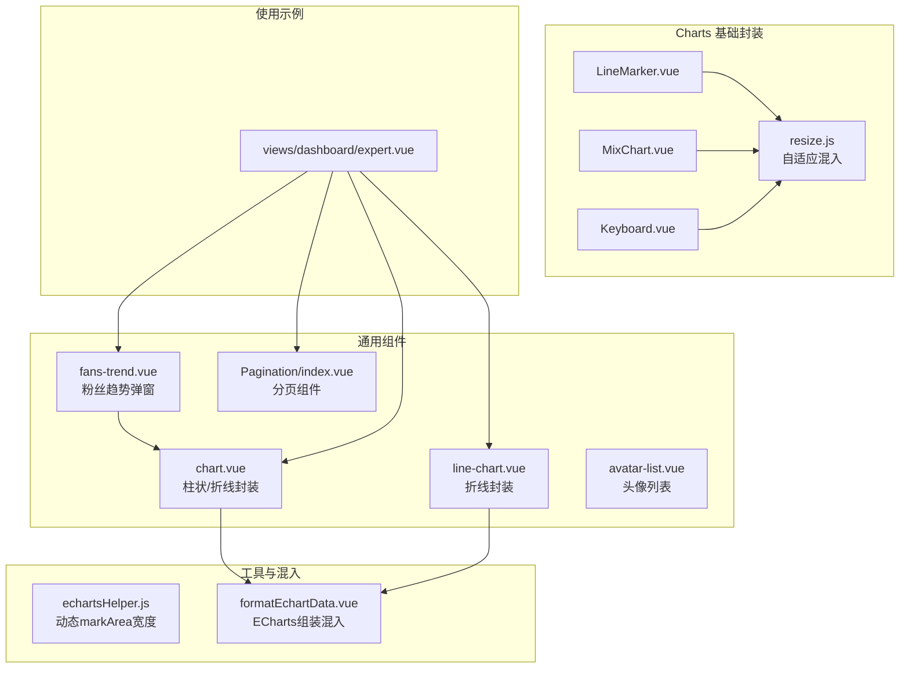
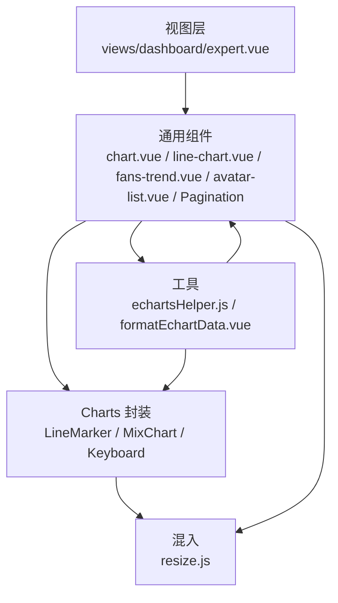
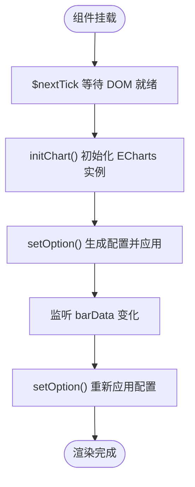
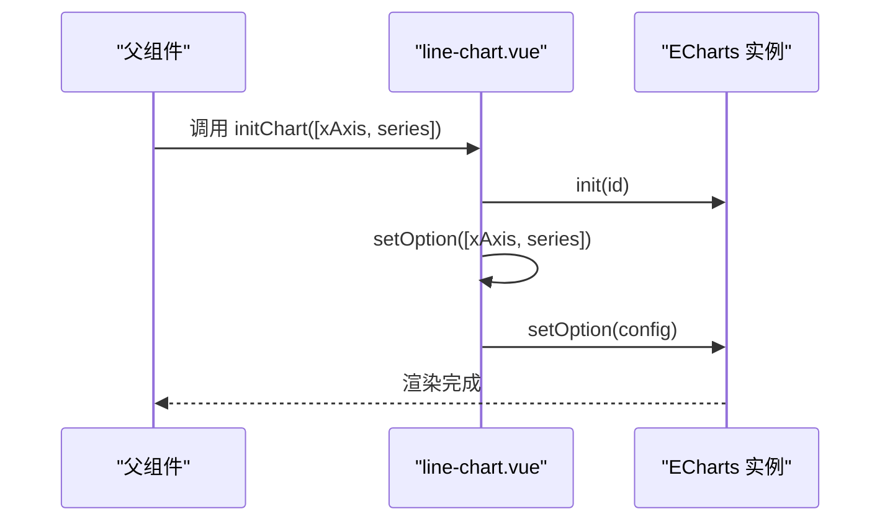
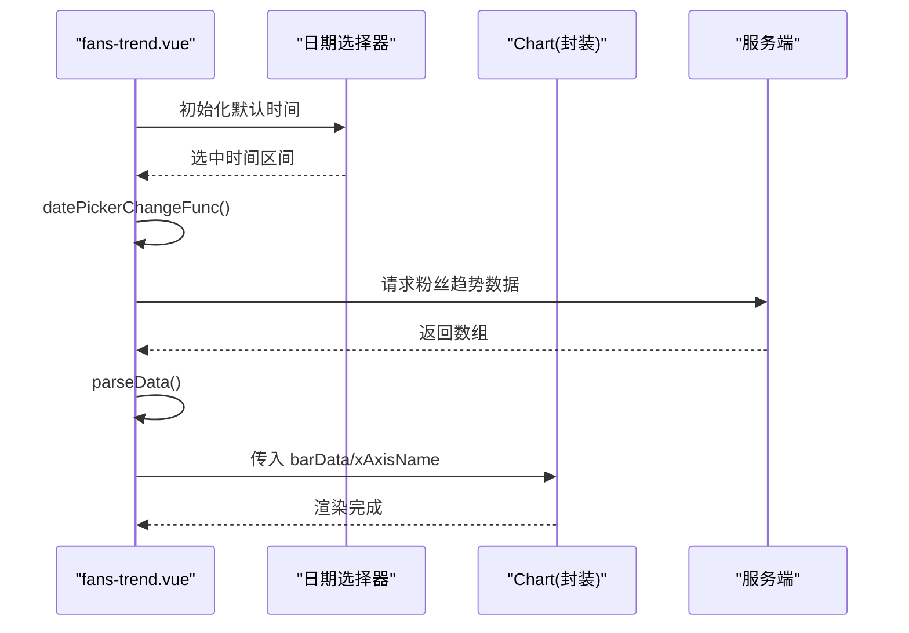
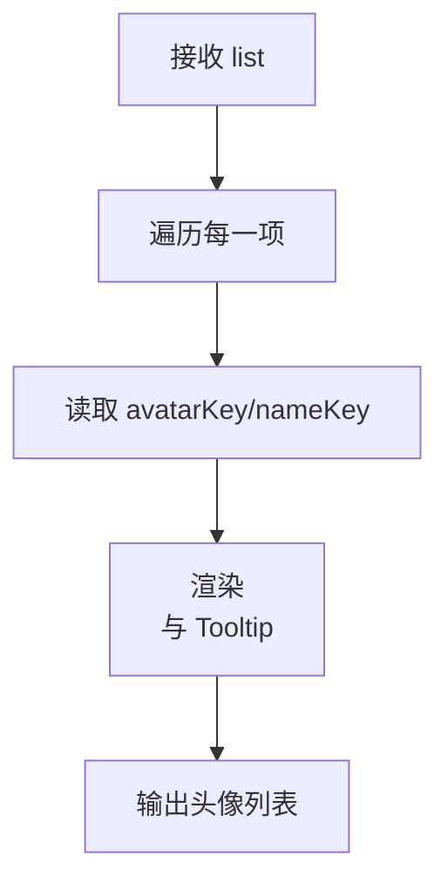
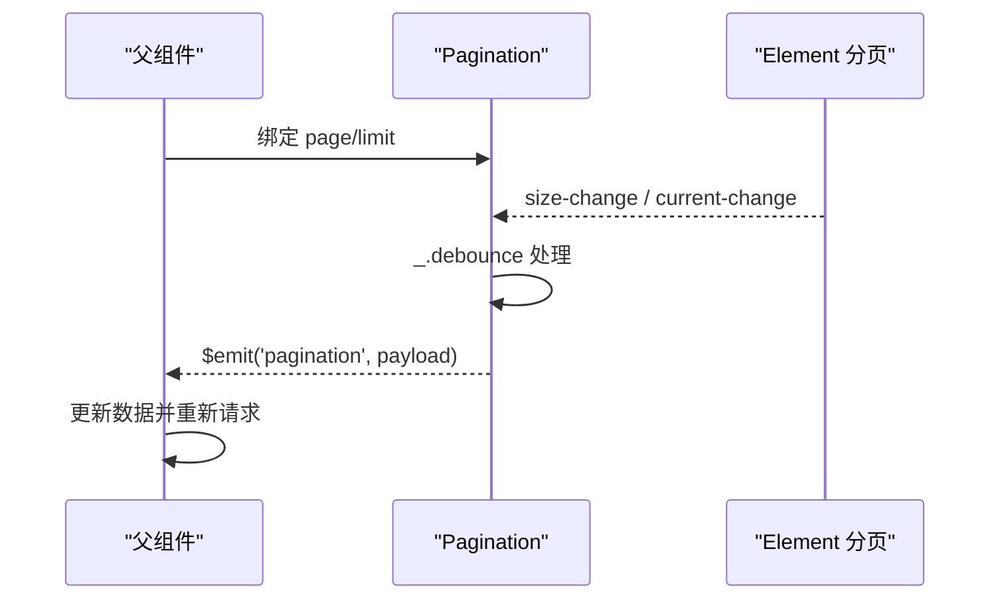
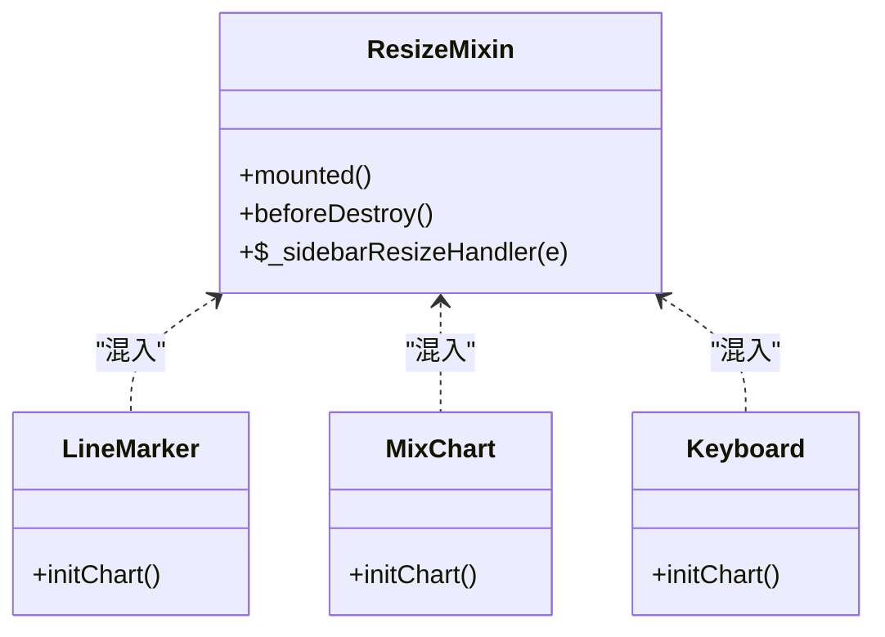
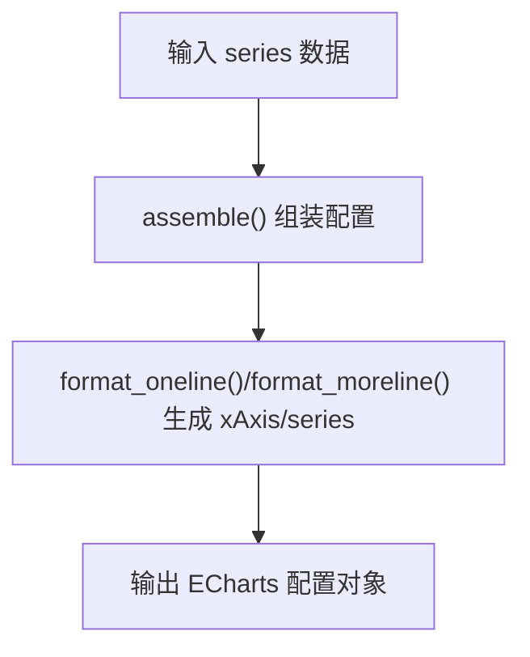
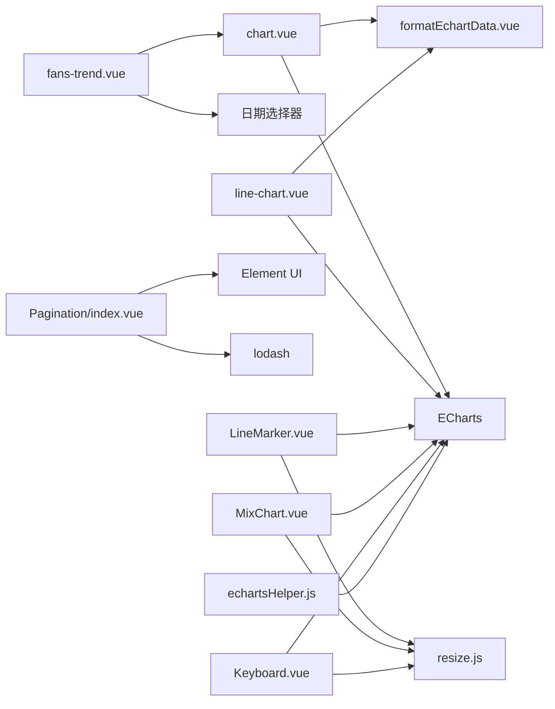

# 数据展示组件

<cite>
**本文引用的文件**
- [chart.vue](file://src/components/general/chart.vue)
- [line-chart.vue](file://src/components/general/line-chart.vue)
- [fans-trend.vue](file://src/components/general/fans-trend.vue)
- [avatar-list.vue](file://src/components/general/avatar-list.vue)
- [Pagination/index.vue](file://src/components/Pagination/index.vue)
- [formatEchartData.vue](file://src/mixins/formatEchartData.vue)
- [echartsHelper.js](file://src/utils/echartsHelper.js)
- [LineMarker.vue](file://src/components/Charts/LineMarker.vue)
- [MixChart.vue](file://src/components/Charts/MixChart.vue)
- [Keyboard.vue](file://src/components/Charts/Keyboard.vue)
- [resize.js](file://src/components/Charts/mixins/resize.js)
- [general/index.js](file://src/components/general/index.js)
- [expert.vue](file://src/views/dashboard/expert.vue)
</cite>

## 目录
1. [简介](#简介)
2. [项目结构](#项目结构)
3. [核心组件](#核心组件)
4. [架构总览](#架构总览)
5. [组件详解](#组件详解)
6. [依赖关系分析](#依赖关系分析)
7. [性能考量](#性能考量)
8. [故障排查指南](#故障排查指南)
9. [结论](#结论)
10. [附录](#附录)

## 简介
本文件系统性梳理 Leisu Admin 中的数据展示组件体系，覆盖基础图表封装、折线图组件、粉丝趋势可视化、头像列表展示以及分页导航等模块。文档从设计思路、实现方式、数据绑定机制、图表配置选项、样式定制、交互行为、使用场景、配置示例与性能优化策略等方面展开，并解释组件与数据源的对接流程。

## 项目结构
围绕数据展示的相关目录与文件如下：
- 通用图表组件：src/components/general 下的 chart.vue、line-chart.vue、fans-trend.vue、avatar-list.vue、Pagination/index.vue 等
- ECharts 基础封装与混入：src/components/Charts 下的 LineMarker.vue、MixChart.vue、Keyboard.vue 以及混入 resize.js
- ECharts 工具与混入：src/utils/echartsHelper.js、src/mixins/formatEchartData.vue
- 组件导出入口：src/components/general/index.js
- 使用示例：src/views/dashboard/expert.vue 展示了多种图表组件的组合使用

**图表来源**
- [chart.vue:1-119](file://src/components/general/chart.vue#L1-L119)
- [line-chart.vue:1-104](file://src/components/general/line-chart.vue#L1-L104)
- [fans-trend.vue:1-116](file://src/components/general/fans-trend.vue#L1-L116)
- [avatar-list.vue:1-61](file://src/components/general/avatar-list.vue#L1-L61)
- [Pagination/index.vue:1-113](file://src/components/Pagination/index.vue#L1-L113)
- [LineMarker.vue:1-228](file://src/components/Charts/LineMarker.vue#L1-L228)
- [MixChart.vue:1-272](file://src/components/Charts/MixChart.vue#L1-L272)
- [Keyboard.vue:1-157](file://src/components/Charts/Keyboard.vue#L1-L157)
- [resize.js:1-35](file://src/components/Charts/mixins/resize.js#L1-L35)
- [formatEchartData.vue:1-252](file://src/mixins/formatEchartData.vue#L1-L252)
- [echartsHelper.js:1-138](file://src/utils/echartsHelper.js#L1-L138)
- [expert.vue:1-256](file://src/views/dashboard/expert.vue#L1-L256)

**章节来源**
- [general/index.js:1-41](file://src/components/general/index.js#L1-L41)
- [expert.vue:1-256](file://src/views/dashboard/expert.vue#L1-L256)

## 核心组件
- 基础图表封装：chart.vue 提供柱状/折线的基础封装，支持数据监听与 ECharts 初始化、配置与销毁。
- 折线图组件：line-chart.vue 提供折线图封装，支持传入 x 轴与 series 数据并生成 legend、dataZoom、tooltip 等配置。
- 粉丝趋势组件：fans-trend.vue 以弹窗形式展示粉丝趋势，内置日期选择器联动，负责数据解析与图表渲染。
- 头像列表组件：avatar-list.vue 渲染头像列表，支持通过属性指定字段键名，具备 Tooltip 提示与图片懒加载友好布局。
- 分页组件：Pagination/index.vue 对 Element UI 的分页进行二次封装，支持双向绑定、防抖回调与自动滚动。

**章节来源**
- [chart.vue:1-119](file://src/components/general/chart.vue#L1-L119)
- [line-chart.vue:1-104](file://src/components/general/line-chart.vue#L1-L104)
- [fans-trend.vue:1-116](file://src/components/general/fans-trend.vue#L1-L116)
- [avatar-list.vue:1-61](file://src/components/general/avatar-list.vue#L1-L61)
- [Pagination/index.vue:1-113](file://src/components/Pagination/index.vue#L1-L113)

## 架构总览
整体采用“通用组件 + ECharts 封装 + 工具混入”的分层设计：
- 通用组件层：提供业务常用的数据展示组件，如图表、列表、分页等
- ECharts 封装层：在基础图表上增加主题、布局、交互与响应式能力
- 工具与混入层：提供 ECharts 配置组装、动态样式调整与窗口尺寸变化处理
- 视图层：在具体页面中组合使用上述组件，完成数据拉取、格式化与渲染

**图表来源**
- [expert.vue:1-256](file://src/views/dashboard/expert.vue#L1-L256)
- [chart.vue:1-119](file://src/components/general/chart.vue#L1-L119)
- [line-chart.vue:1-104](file://src/components/general/line-chart.vue#L1-L104)
- [fans-trend.vue:1-116](file://src/components/general/fans-trend.vue#L1-L116)
- [avatar-list.vue:1-61](file://src/components/general/avatar-list.vue#L1-L61)
- [Pagination/index.vue:1-113](file://src/components/Pagination/index.vue#L1-L113)
- [LineMarker.vue:1-228](file://src/components/Charts/LineMarker.vue#L1-L228)
- [MixChart.vue:1-272](file://src/components/Charts/MixChart.vue#L1-L272)
- [Keyboard.vue:1-157](file://src/components/Charts/Keyboard.vue#L1-L157)
- [resize.js:1-35](file://src/components/Charts/mixins/resize.js#L1-L35)
- [formatEchartData.vue:1-252](file://src/mixins/formatEchartData.vue#L1-L252)
- [echartsHelper.js:1-138](file://src/utils/echartsHelper.js#L1-L138)

## 组件详解

### 基础图表组件 chart.vue
- 设计思路：对 ECharts 进行轻量封装，统一初始化、配置与销毁流程；通过 props 接收数据与配置，通过 watch 监听数据变化并重新 setOption。
- 关键点：
  - 初始化：在 $nextTick 后执行初始化，避免 DOM 未就绪导致的渲染问题
  - 配置项：包含 grid、dataZoom、tooltip、xAxis、yAxis、series 等
  - 生命周期：beforeDestroy 中释放实例，防止内存泄漏
- 数据绑定机制：通过 barData、xAxisName 两个 props 接收数据；watch 深度监听 barData 变化并刷新图表
- 样式定制：通过 scoped 样式控制容器尺寸与布局
- 交互行为：支持 dataZoom 滑块缩放、tooltip 悬浮提示

**图表来源**
- [chart.vue:35-51](file://src/components/general/chart.vue#L35-L51)
- [chart.vue:109-116](file://src/components/general/chart.vue#L109-L116)

**章节来源**
- [chart.vue:1-119](file://src/components/general/chart.vue#L1-L119)

### 折线图组件 line-chart.vue
- 设计思路：面向折线图场景的轻量封装，支持传入二维数组 [xAxis, series]，自动提取 series 名称生成 legend
- 关键点：
  - 参数约定：接收 [xAxis, series] 数组，series 中每项可设置 barMaxWidth
  - 配置项：legend、grid、tooltip、dataZoom、xAxis、yAxis、series
  - 自动去重：通过 Set 提取唯一 series 名称
- 数据绑定机制：通过方法 initChart(data) 与 setOption([xAxis, series]) 完成数据注入与渲染
- 交互行为：支持 dataZoom、tooltip、legend 切换

**图表来源**
- [line-chart.vue:19-22](file://src/components/general/line-chart.vue#L19-L22)
- [line-chart.vue:23-99](file://src/components/general/line-chart.vue#L23-L99)

**章节来源**
- [line-chart.vue:1-104](file://src/components/general/line-chart.vue#L1-L104)

### 粉丝趋势组件 fans-trend.vue
- 设计思路：以弹窗形式展示粉丝趋势，内置日期选择器，支持默认时间范围与重置逻辑，负责将服务端数据转换为 ECharts 所需格式
- 关键点：
  - 日期选择：支持默认时间与重置按钮，回调向外抛出时间区间
  - 数据解析：parseData 将服务端数组转换为折线与柱状两条系列及 x 轴名称数组
  - 图表联动：内部引用 chart.vue 并通过 barData 与 xAxisName 传递数据
- 数据绑定机制：setData 注入原始数据，parseData 输出 xName 与 barOption，父组件通过 v-model 或事件接收时间变更
- 交互行为：弹窗打开、日期选择、数据重绘

**图表来源**
- [fans-trend.vue:88-93](file://src/components/general/fans-trend.vue#L88-L93)
- [fans-trend.vue:78-86](file://src/components/general/fans-trend.vue#L78-L86)
- [chart.vue:52-107](file://src/components/general/chart.vue#L52-L107)

**章节来源**
- [fans-trend.vue:1-116](file://src/components/general/fans-trend.vue#L1-L116)

### 头像列表组件 avatar-list.vue
- 设计思路：渲染头像列表，支持通过属性指定头像字段与名称字段，结合 Element UI Tooltip 提供悬浮提示
- 关键点：
  - 属性：list（必填）、avatarKey（默认头像字段）、nameKey（默认名称字段）
  - 样式：紧凑布局、圆角边框、遮罩溢出，适合在卡片或列表中展示
- 数据绑定机制：v-for 遍历 list，按字段键名读取头像与名称
- 交互行为：Tooltip 悬浮展示名称

**图表来源**
- [avatar-list.vue:4-12](file://src/components/general/avatar-list.vue#L4-L12)

**章节来源**
- [avatar-list.vue:1-61](file://src/components/general/avatar-list.vue#L1-L61)

### 分页组件 Pagination/index.vue
- 设计思路：对 Element UI 分页进行二次封装，支持双向绑定、布局自定义、防抖回调与自动滚动
- 关键点：
  - 属性：total、page、limit、pageSizes、layout、background、autoScroll、hidden、pagerCount
  - 双向绑定：通过 computed getter/setter 将 page/limit 与父组件同步
  - 防抖：对 size-change 与 current-change 使用 lodash.debounce
  - 回调：统一发出 pagination 事件，便于父组件处理分页逻辑
- 数据绑定机制：v-model 形式的 page/limit 双向绑定
- 交互行为：切换页码与条数时触发回调并可自动滚动至顶部

**图表来源**
- [Pagination/index.vue:68-84](file://src/components/Pagination/index.vue#L68-L84)
- [Pagination/index.vue:87-99](file://src/components/Pagination/index.vue#L87-L99)

**章节来源**
- [Pagination/index.vue:1-113](file://src/components/Pagination/index.vue#L1-L113)

### ECharts 基础封装与混入
- LineMarker.vue / MixChart.vue / Keyboard.vue：提供不同风格的 ECharts 图表示例，包含主题、网格、图例、dataZoom、tooltip 等配置
- resize.js：提供窗口与侧边栏切换的自适应处理，避免图表尺寸异常
- 使用建议：在通用组件中复用这些封装，减少重复配置；在复杂图表场景中可直接引入对应组件

**图表来源**
- [resize.js:1-35](file://src/components/Charts/mixins/resize.js#L1-L35)
- [LineMarker.vue:44-224](file://src/components/Charts/LineMarker.vue#L44-L224)
- [MixChart.vue:44-268](file://src/components/Charts/MixChart.vue#L44-L268)
- [Keyboard.vue:44-152](file://src/components/Charts/Keyboard.vue#L44-L152)

**章节来源**
- [LineMarker.vue:1-228](file://src/components/Charts/LineMarker.vue#L1-L228)
- [MixChart.vue:1-272](file://src/components/Charts/MixChart.vue#L1-L272)
- [Keyboard.vue:1-157](file://src/components/Charts/Keyboard.vue#L1-L157)
- [resize.js:1-35](file://src/components/Charts/mixins/resize.js#L1-L35)

### ECharts 工具与混入
- formatEchartData.vue：提供 assemble、format_oneline、format_moreline 等方法，统一生成 ECharts 配置、legend、tooltip、xAxis/yAxis、series 等
- echartsHelper.js：提供动态 markArea 边框宽度计算与更新，根据 dataZoom 的可见数据点数量动态调整 markArea 边框粗细，提升可读性

**图表来源**
- [formatEchartData.vue:38-147](file://src/mixins/formatEchartData.vue#L38-L147)
- [formatEchartData.vue:148-248](file://src/mixins/formatEchartData.vue#L148-L248)

**章节来源**
- [formatEchartData.vue:1-252](file://src/mixins/formatEchartData.vue#L1-L252)
- [echartsHelper.js:1-138](file://src/utils/echartsHelper.js#L1-L138)

## 依赖关系分析
- 通用组件依赖关系：
  - fans-trend.vue 依赖 chart.vue 与日期选择器组件
  - chart.vue 与 line-chart.vue 依赖 ECharts 库
  - Pagination/index.vue 依赖 Element UI 与工具库（lodash）
- ECharts 封装依赖：
  - LineMarker.vue / MixChart.vue / Keyboard.vue 依赖 ECharts 与 resize 混入
- 工具与混入：
  - formatEchartData.vue 作为混入被通用组件复用
  - echartsHelper.js 作为工具函数被图表实例使用

**图表来源**
- [fans-trend.vue:1-116](file://src/components/general/fans-trend.vue#L1-L116)
- [chart.vue:1-119](file://src/components/general/chart.vue#L1-L119)
- [line-chart.vue:1-104](file://src/components/general/line-chart.vue#L1-L104)
- [Pagination/index.vue:1-113](file://src/components/Pagination/index.vue#L1-L113)
- [LineMarker.vue:1-228](file://src/components/Charts/LineMarker.vue#L1-L228)
- [MixChart.vue:1-272](file://src/components/Charts/MixChart.vue#L1-L272)
- [Keyboard.vue:1-157](file://src/components/Charts/Keyboard.vue#L1-L157)
- [resize.js:1-35](file://src/components/Charts/mixins/resize.js#L1-L35)
- [formatEchartData.vue:1-252](file://src/mixins/formatEchartData.vue#L1-L252)
- [echartsHelper.js:1-138](file://src/utils/echartsHelper.js#L1-L138)

**章节来源**
- [general/index.js:1-41](file://src/components/general/index.js#L1-L41)

## 性能考量
- 图表渲染优化
  - 使用 $nextTick 确保 DOM 就绪后再初始化 ECharts，避免无效渲染
  - 在通用组件中仅在数据变化时 setOption，避免频繁重建实例
  - 对大数据集启用 dataZoom，减少一次性渲染压力
- 内存管理
  - 在 beforeDestroy 中 dispose 实例，防止内存泄漏
- 交互体验
  - Pagination 使用防抖处理分页事件，降低高频切换带来的请求压力
  - resize 混入通过节流/防抖处理窗口变化，避免频繁 resize 导致的性能损耗
- 可读性与可维护性
  - 通过 echartsHelper.js 的动态 markArea 边框宽度，提升大数据可视化的可读性

[本节为通用性能建议，不直接分析特定文件]

## 故障排查指南
- 图表不显示或尺寸异常
  - 检查容器是否已设置高度；确认在 mounted 后再初始化图表
  - 若存在侧边栏折叠，确保混入 resize 正常工作
- 数据未更新
  - 确认通过 props 传入的数据结构符合组件约定（如 chart.vue 的 barData、line-chart.vue 的 [xAxis, series]）
  - 检查 watch 是否生效，必要时强制触发 setOption
- 分页无效或跳转异常
  - 检查父组件是否正确绑定 page/limit，确认 v-model 与 update:page/update:limit 的配合
  - 确认 pagination 事件回调中是否正确处理分页参数
- 弹窗内图表渲染错位
  - 确认弹窗打开后再初始化图表，或在 visible 改变后触发 setOption

**章节来源**
- [chart.vue:35-51](file://src/components/general/chart.vue#L35-L51)
- [line-chart.vue:19-22](file://src/components/general/line-chart.vue#L19-L22)
- [Pagination/index.vue:68-84](file://src/components/Pagination/index.vue#L68-L84)
- [resize.js:9-18](file://src/components/Charts/mixins/resize.js#L9-L18)

## 结论
Leisu Admin 的数据展示组件体系以通用组件为核心，结合 ECharts 封装与工具混入，形成“可配置、可扩展、易维护”的可视化方案。通过标准化的数据绑定、配置组装与生命周期管理，组件在保证开发效率的同时兼顾性能与用户体验。建议在实际业务中优先使用通用组件与混入，按需引入基础封装组件，以获得一致的交互与视觉体验。

[本节为总结性内容，不直接分析特定文件]

## 附录
- 组件导出入口：通过 general/index.js 统一导出常用组件，便于按需引入
- 使用示例：dashboard/expert.vue 展示了多种图表组件的组合使用，可作为参考模板

**章节来源**
- [general/index.js:1-41](file://src/components/general/index.js#L1-L41)
- [expert.vue:1-256](file://src/views/dashboard/expert.vue#L1-L256)