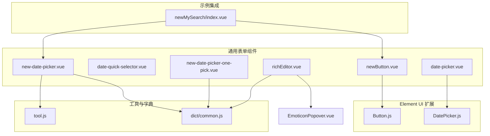
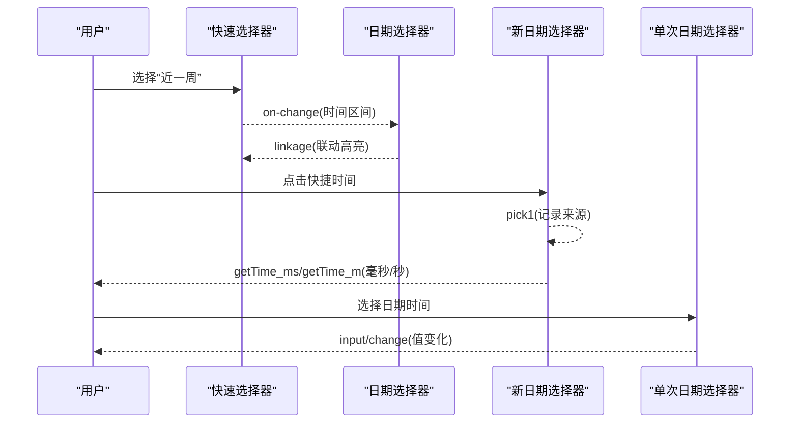
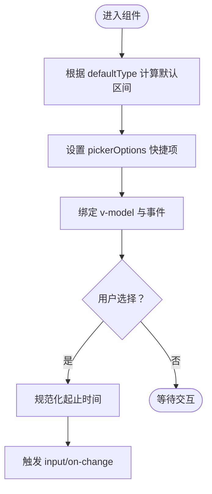
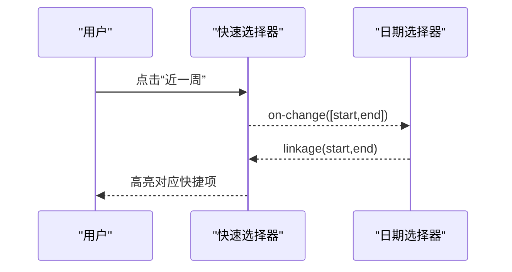
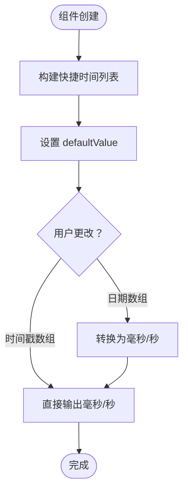
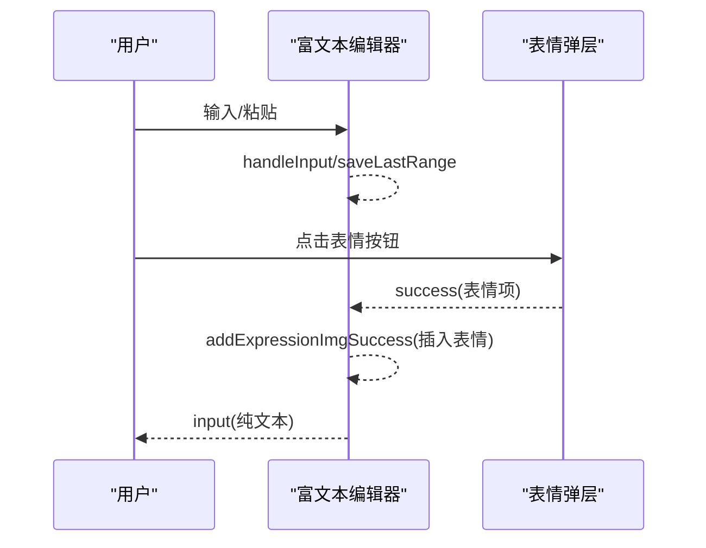
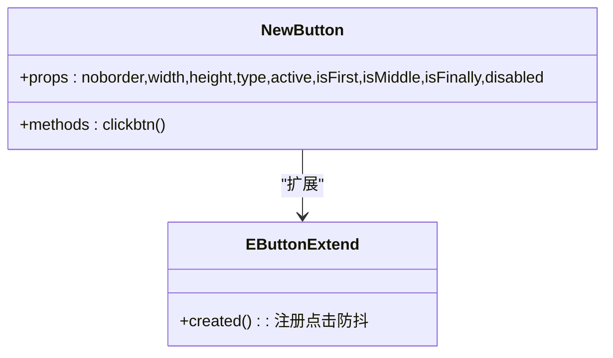
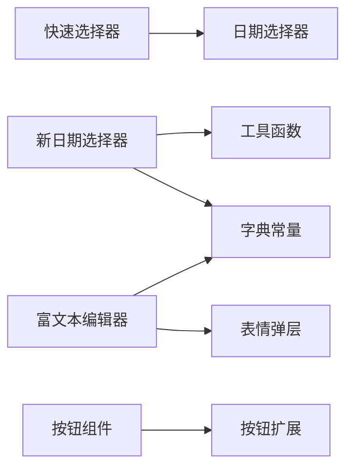

# 表单组件

<cite>
**本文引用的文件**
- [src/components/general/date-picker.vue](file://src/components/general/date-picker.vue)
- [src/components/general/date-quick-selector.vue](file://src/components/general/date-quick-selector.vue)
- [src/components/general/richEditor.vue](file://src/components/general/richEditor.vue)
- [src/components/general/newButton.vue](file://src/components/general/newButton.vue)
- [src/components/general/new-date-picker.vue](file://src/components/general/new-date-picker.vue)
- [src/components/general/new-date-picker-one-pick.vue](file://src/components/general/new-date-picker-one-pick.vue)
- [src/components/leisu/elementUi_extend/Button.js](file://src/components/leisu/elementUi_extend/Button.js)
- [src/components/leisu/elementUi_extend/DatePicker.js](file://src/components/leisu/elementUi_extend/DatePicker.js)
- [src/utils/tool.js](file://src/utils/tool.js)
- [src/utils/dict/common.js](file://src/utils/dict/common.js)
- [src/components/general/EmoticonPopover.vue](file://src/components/general/EmoticonPopover.vue)
- [src/components/newMySearch/index.vue](file://src/components/newMySearch/index.vue)
</cite>

## 目录
1. [简介](#简介)
2. [项目结构](#项目结构)
3. [核心组件](#核心组件)
4. [架构总览](#架构总览)
5. [详细组件分析](#详细组件分析)
6. [依赖分析](#依赖分析)
7. [性能考虑](#性能考虑)
8. [故障排查指南](#故障排查指南)
9. [结论](#结论)
10. [附录](#附录)

## 简介
本文件面向 Leisu Admin 项目的表单组件，围绕日期选择器、快速选择器、富文本编辑器与按钮组件展开，系统阐述设计理念、实现细节、属性配置、事件处理、数据绑定与验证规则，提供使用示例、最佳实践与性能优化建议，并解释组件间的协作关系与数据流转机制，同时给出常见问题解决方案与调试技巧。

## 项目结构
- 表单相关通用组件集中于 src/components/general 下，包含日期选择器、快速选择器、富文本编辑器、自定义按钮等。
- Element UI 的扩展组件位于 src/components/leisu/elementUi_extend，对原生组件进行二次封装以增强交互体验。
- 工具与字典位于 src/utils，提供时间格式化、快捷时间文本列表、表情正则等支撑能力。
- 示例与集成场景可在 src/components/newMySearch/index.vue 中看到按钮与日期控件的组合使用。

图表来源
- [src/components/general/date-picker.vue:1-338](file://src/components/general/date-picker.vue#L1-L338)
- [src/components/general/date-quick-selector.vue:1-114](file://src/components/general/date-quick-selector.vue#L1-L114)
- [src/components/general/richEditor.vue:1-220](file://src/components/general/richEditor.vue#L1-L220)
- [src/components/general/newButton.vue:1-114](file://src/components/general/newButton.vue#L1-L114)
- [src/components/general/new-date-picker.vue:1-191](file://src/components/general/new-date-picker.vue#L1-L191)
- [src/components/general/new-date-picker-one-pick.vue:1-153](file://src/components/general/new-date-picker-one-pick.vue#L1-L153)
- [src/components/leisu/elementUi_extend/Button.js:1-27](file://src/components/leisu/elementUi_extend/Button.js#L1-L27)
- [src/components/leisu/elementUi_extend/DatePicker.js:1-55](file://src/components/leisu/elementUi_extend/DatePicker.js#L1-L55)
- [src/utils/tool.js:1-1216](file://src/utils/tool.js#L1-L1216)
- [src/utils/dict/common.js:1-723](file://src/utils/dict/common.js#L1-L723)
- [src/components/general/EmoticonPopover.vue:1-87](file://src/components/general/EmoticonPopover.vue#L1-L87)
- [src/components/newMySearch/index.vue:253-271](file://src/components/newMySearch/index.vue#L253-L271)

章节来源
- [src/components/general/date-picker.vue:1-338](file://src/components/general/date-picker.vue#L1-L338)
- [src/components/general/date-quick-selector.vue:1-114](file://src/components/general/date-quick-selector.vue#L1-L114)
- [src/components/general/richEditor.vue:1-220](file://src/components/general/richEditor.vue#L1-L220)
- [src/components/general/newButton.vue:1-114](file://src/components/general/newButton.vue#L1-L114)
- [src/components/general/new-date-picker.vue:1-191](file://src/components/general/new-date-picker.vue#L1-L191)
- [src/components/general/new-date-picker-one-pick.vue:1-153](file://src/components/general/new-date-picker-one-pick.vue#L1-L153)
- [src/components/leisu/elementUi_extend/Button.js:1-27](file://src/components/leisu/elementUi_extend/Button.js#L1-L27)
- [src/components/leisu/elementUi_extend/DatePicker.js:1-55](file://src/components/leisu/elementUi_extend/DatePicker.js#L1-L55)
- [src/utils/tool.js:1-1216](file://src/utils/tool.js#L1-L1216)
- [src/utils/dict/common.js:1-723](file://src/utils/dict/common.js#L1-L723)
- [src/components/general/EmoticonPopover.vue:1-87](file://src/components/general/EmoticonPopover.vue#L1-L87)
- [src/components/newMySearch/index.vue:253-271](file://src/components/newMySearch/index.vue#L253-L271)

## 核心组件
- 日期选择器（通用）：支持区间与单日选择、快捷时间、默认值初始化、联动与重置。
- 快速选择器：基于单选按钮组，提供“近X日/月/年”等常用时间段，支持与日期选择器联动。
- 富文本编辑器：基于 contenteditable，集成表情选择、表情映射、光标定位、纯文本输出。
- 按钮组件：自定义按钮样式与边框拼接，支持禁用态与激活态，扩展 Element UI 按钮防抖点击。
- 新日期选择器：封装 Element UI 的日期/日期时间选择器，内置快捷时间列表、默认时间、禁用未来时间等。
- 新单次日期选择器：单次日期/时间选择，支持快捷选项与格式化输出。

章节来源
- [src/components/general/date-picker.vue:1-338](file://src/components/general/date-picker.vue#L1-L338)
- [src/components/general/date-quick-selector.vue:1-114](file://src/components/general/date-quick-selector.vue#L1-L114)
- [src/components/general/richEditor.vue:1-220](file://src/components/general/richEditor.vue#L1-L220)
- [src/components/general/newButton.vue:1-114](file://src/components/general/newButton.vue#L1-L114)
- [src/components/general/new-date-picker.vue:1-191](file://src/components/general/new-date-picker.vue#L1-L191)
- [src/components/general/new-date-picker-one-pick.vue:1-153](file://src/components/general/new-date-picker-one-pick.vue#L1-L153)

## 架构总览
表单组件围绕 Element UI 的基础控件进行二次封装，通过 props 与事件实现数据流的单向传递与回调触发，配合工具函数与字典常量实现快捷时间、表情映射与格式化逻辑。

图表来源
- [src/components/general/date-quick-selector.vue:93-110](file://src/components/general/date-quick-selector.vue#L93-L110)
- [src/components/general/date-picker.vue:311-324](file://src/components/general/date-picker.vue#L311-L324)
- [src/components/general/new-date-picker.vue:130-171](file://src/components/general/new-date-picker.vue#L130-L171)
- [src/components/general/new-date-picker-one-pick.vue:121-125](file://src/components/general/new-date-picker-one-pick.vue#L121-L125)

## 详细组件分析

### 日期选择器（通用）
- 设计理念
  - 基于 Element UI el-date-picker，提供快捷时间、默认区间、联动与重置能力。
  - 支持“当天/间隔X天/区间/月区间/上月/本年度”等默认类型。
- 关键属性
  - defaultType：默认类型（0~5、10等）。
  - typeValue：兜底毫秒值。
  - init：是否初始化触发事件。
  - type：选择类型（daterange、datetimerange、monthrange 等）。
  - nowMonth：月份偏移数组 [起始偏移, 结束偏移]。
  - size、clearable、picker-options 等透传。
- 事件与数据绑定
  - input：双向绑定 v-model。
  - on-change/on-init：变更与初始化回调。
  - methods：setData/reset/changefunc。
- 验证与边界
  - 区间起止自动规范化为当日00:00:00/23:59:59。
  - 闰年与上月天数计算。
- 使用示例
  - 在查询面板中作为筛选条件，结合快速选择器实现“近X日”快捷切换。
- 最佳实践
  - 合理设置 defaultType 与 nowMonth，避免跨月/跨年边界问题。
  - 使用 on-init 与 on-change 区分初始化与用户交互。
- 性能优化
  - 避免频繁重算 typeMap，可缓存计算结果。
  - 快捷项过多时可按需渲染。

图表来源
- [src/components/general/date-picker.vue:66-100](file://src/components/general/date-picker.vue#L66-L100)
- [src/components/general/date-picker.vue:311-324](file://src/components/general/date-picker.vue#L311-L324)

章节来源
- [src/components/general/date-picker.vue:1-338](file://src/components/general/date-picker.vue#L1-L338)

### 快速选择器
- 设计理念
  - 基于 el-radio-group + el-radio-button，提供“近X日/月/年”等常用时间段。
  - 支持扩展列表与默认列表叠加，支持与日期选择器联动高亮。
- 关键属性
  - defaultSelected：默认选中索引。
  - extendList：扩展时间段列表 [{label, value}]。
  - default：是否启用默认列表（昨天/今天）。
- 事件与数据绑定
  - on-change：返回 [start, end]。
  - linkage：接收外部时间戳，联动高亮对应快捷项。
  - init/linkage/reset 等方法。
- 使用示例
  - 与日期选择器组合，点击快捷项自动填充日期区间。
- 最佳实践
  - 保持 label 与 value 的一致性，value 为毫秒差或 [start,end]。
  - 使用 linkage 保持 UI 与数据一致。

图表来源
- [src/components/general/date-quick-selector.vue:93-110](file://src/components/general/date-quick-selector.vue#L93-L110)
- [src/components/general/date-picker.vue:290-310](file://src/components/general/date-picker.vue#L290-L310)

章节来源
- [src/components/general/date-quick-selector.vue:1-114](file://src/components/general/date-quick-selector.vue#L1-L114)

### 新日期选择器
- 设计理念
  - 封装 Element UI 日期/日期时间选择器，内置快捷时间列表与默认时间。
  - 支持禁用未来时间、月区间结束时间规范化、多格式输出（毫秒/秒）。
- 关键属性
  - startPlaceholder/endPlaceholder、clearable、size、type、defaultTime、format、unlinkPanels。
  - defaultValue、maxtime。
- 事件与数据绑定
  - getTime_ms/getTime_m：输出毫秒/秒时间戳。
  - clear：清空事件。
  - methods：setData/reset/changefunc。
- 使用示例
  - 查询面板中作为日期范围选择器，结合快捷时间快速筛选。
- 最佳实践
  - 使用 maxtime 限制可选日期范围。
  - 月区间时注意结束时间规范化为月末最后一刻。

图表来源
- [src/components/general/new-date-picker.vue:107-171](file://src/components/general/new-date-picker.vue#L107-L171)
- [src/utils/dict/common.js](file://src/utils/dict/common.js#L229)

章节来源
- [src/components/general/new-date-picker.vue:1-191](file://src/components/general/new-date-picker.vue#L1-L191)
- [src/utils/dict/common.js](file://src/utils/dict/common.js#L229)

### 单次日期选择器
- 设计理念
  - 面向单次日期/时间选择，支持快捷选项与格式化输出。
- 关键属性
  - placeholder、clearable、size、type、format、valueFormat、value。
- 事件与数据绑定
  - input/change：值变化回调。
  - methods：setData/reset/changefunc。
- 使用示例
  - 作为独立控件使用，或嵌入复杂表单。

章节来源
- [src/components/general/new-date-picker-one-pick.vue:1-153](file://src/components/general/new-date-picker-one-pick.vue#L1-L153)

### 富文本编辑器
- 设计理念
  - 基于 contenteditable，集成表情选择、表情映射、光标定位、纯文本输出。
  - 支持异步加载表情包，渲染时替换雷速梗与 Emoji。
- 关键属性
  - value：双向绑定。
- 事件与数据绑定
  - input：输出纯文本。
  - 事件：handleInput/handleBlur/saveLastRange/updateValue。
  - 子组件：EmoticonPopover。
- 使用示例
  - 内容发布、评论编辑、公告撰写等场景。
- 最佳实践
  - 通过 getPlainText 输出纯文本，避免 HTML 污染。
  - 使用 saveLastRange 保持光标位置，提升编辑体验。

图表来源
- [src/components/general/richEditor.vue:164-175](file://src/components/general/richEditor.vue#L164-L175)
- [src/components/general/EmoticonPopover.vue:74-77](file://src/components/general/EmoticonPopover.vue#L74-L77)
- [src/utils/dict/common.js](file://src/utils/dict/common.js#L14)

章节来源
- [src/components/general/richEditor.vue:1-220](file://src/components/general/richEditor.vue#L1-L220)
- [src/components/general/EmoticonPopover.vue:1-87](file://src/components/general/EmoticonPopover.vue#L1-L87)
- [src/utils/dict/common.js](file://src/utils/dict/common.js#L14)

### 按钮组件
- 设计理念
  - 自定义按钮样式与边框拼接，支持禁用态与激活态。
  - 扩展 Element UI 按钮，增加防抖点击能力。
- 关键属性
  - noborder、width、height、type、active、isFirst/isMiddle/isFinally、disabled。
- 事件与数据绑定
  - click：点击事件（禁用时拦截）。
- 使用示例
  - 查询面板中的“添加/报表/多条件选择”等按钮。

图表来源
- [src/components/general/newButton.vue:1-114](file://src/components/general/newButton.vue#L1-L114)
- [src/components/leisu/elementUi_extend/Button.js:1-27](file://src/components/leisu/elementUi_extend/Button.js#L1-L27)

章节来源
- [src/components/general/newButton.vue:1-114](file://src/components/general/newButton.vue#L1-L114)
- [src/components/leisu/elementUi_extend/Button.js:1-27](file://src/components/leisu/elementUi_extend/Button.js#L1-L27)

## 依赖分析
- 组件耦合
  - 日期选择器与快速选择器通过事件实现松耦合联动。
  - 富文本编辑器依赖表情弹层与表情映射字典。
  - 新日期选择器依赖工具函数与字典常量。
- 外部依赖
  - Element UI：el-date-picker、el-radio-group、el-popover、el-button 等。
  - 工具函数：时间格式化、快捷时间文本列表、表情正则等。

图表来源
- [src/components/general/date-quick-selector.vue:93-110](file://src/components/general/date-quick-selector.vue#L93-L110)
- [src/components/general/date-picker.vue:311-324](file://src/components/general/date-picker.vue#L311-L324)
- [src/components/general/new-date-picker.vue:107-171](file://src/components/general/new-date-picker.vue#L107-L171)
- [src/utils/tool.js:1-1216](file://src/utils/tool.js#L1-L1216)
- [src/utils/dict/common.js](file://src/utils/dict/common.js#L229)
- [src/components/general/richEditor.vue:1-220](file://src/components/general/richEditor.vue#L1-L220)
- [src/components/general/EmoticonPopover.vue:1-87](file://src/components/general/EmoticonPopover.vue#L1-L87)
- [src/components/general/newButton.vue:1-114](file://src/components/general/newButton.vue#L1-L114)
- [src/components/leisu/elementUi_extend/Button.js:1-27](file://src/components/leisu/elementUi_extend/Button.js#L1-L27)

章节来源
- [src/components/general/date-quick-selector.vue:1-114](file://src/components/general/date-quick-selector.vue#L1-L114)
- [src/components/general/date-picker.vue:1-338](file://src/components/general/date-picker.vue#L1-L338)
- [src/components/general/new-date-picker.vue:1-191](file://src/components/general/new-date-picker.vue#L1-L191)
- [src/utils/tool.js:1-1216](file://src/utils/tool.js#L1-L1216)
- [src/utils/dict/common.js:1-723](file://src/utils/dict/common.js#L1-L723)
- [src/components/general/richEditor.vue:1-220](file://src/components/general/richEditor.vue#L1-L220)
- [src/components/general/EmoticonPopover.vue:1-87](file://src/components/general/EmoticonPopover.vue#L1-L87)
- [src/components/general/newButton.vue:1-114](file://src/components/general/newButton.vue#L1-L114)
- [src/components/leisu/elementUi_extend/Button.js:1-27](file://src/components/leisu/elementUi_extend/Button.js#L1-L27)

## 性能考虑
- 渲染优化
  - 快捷时间列表按需构建，避免每次渲染重复计算。
  - 富文本编辑器仅在表情加载完成后渲染，减少闪烁。
- 交互优化
  - 按钮组件防抖点击，避免重复提交。
  - 日期选择器联动时仅更新高亮，不触发额外逻辑。
- 数据处理
  - 日期规范化在变更时进行，避免多次格式化。
  - 表情替换采用正则与映射表，尽量减少 DOM 操作次数。

## 故障排查指南
- 日期选择器
  - 快捷项不生效：检查 defaultType 与 typeMap 映射是否正确。
  - 区间边界异常：确认 changefunc 中起止时间规范化逻辑。
- 快速选择器
  - 无法联动高亮：确认 linkage 传入的时间戳格式与 list 中的 value 一致。
- 富文本编辑器
  - 表情不显示：检查表情映射是否加载完成，以及正则匹配是否正确。
  - 光标丢失：确认 saveLastRange 是否在输入/焦点事件中调用。
- 按钮组件
  - 点击无效：检查 disabled 属性与 clickbtn 中的拦截逻辑。
- 新日期选择器
  - 月区间结束时间不正确：确认 changefunc 中月末最后时刻的计算。
  - 快捷时间不显示：检查 quickTimeTextList 与 setClickShortcutsTime 的配合。

章节来源
- [src/components/general/date-picker.vue:311-324](file://src/components/general/date-picker.vue#L311-L324)
- [src/components/general/date-quick-selector.vue:98-105](file://src/components/general/date-quick-selector.vue#L98-L105)
- [src/components/general/richEditor.vue:48-60](file://src/components/general/richEditor.vue#L48-L60)
- [src/components/general/richEditor.vue:110-118](file://src/components/general/richEditor.vue#L110-L118)
- [src/components/general/newButton.vue:55-60](file://src/components/general/newButton.vue#L55-L60)
- [src/components/general/new-date-picker.vue:153-158](file://src/components/general/new-date-picker.vue#L153-L158)
- [src/utils/dict/common.js](file://src/utils/dict/common.js#L229)

## 结论
Leisu Admin 的表单组件通过轻量封装与工具函数支撑，实现了快捷时间、联动高亮、表情集成与防抖点击等关键能力。遵循本文的属性配置、事件处理、数据绑定与验证规则，可高效构建稳定可靠的查询与编辑界面。建议在复杂场景中进一步抽象公共逻辑，统一事件命名与数据格式，持续优化渲染与交互性能。

## 附录
- 使用示例参考
  - 查询面板中的按钮与日期控件组合：[src/components/newMySearch/index.vue:253-271](file://src/components/newMySearch/index.vue#L253-L271)
- 相关工具与字典
  - 时间格式化与快捷时间文本列表：[src/utils/tool.js:582-651](file://src/utils/tool.js#L582-L651), [src/utils/dict/common.js](file://src/utils/dict/common.js#L229)
- Element UI 扩展
  - 按钮防抖与日期快捷项：[src/components/leisu/elementUi_extend/Button.js:1-27](file://src/components/leisu/elementUi_extend/Button.js#L1-L27), [src/components/leisu/elementUi_extend/DatePicker.js:1-55](file://src/components/leisu/elementUi_extend/DatePicker.js#L1-L55)