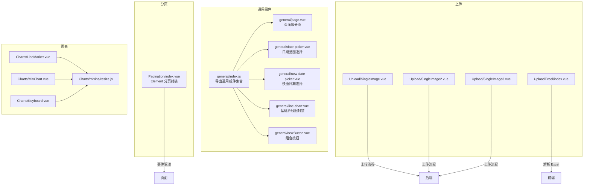
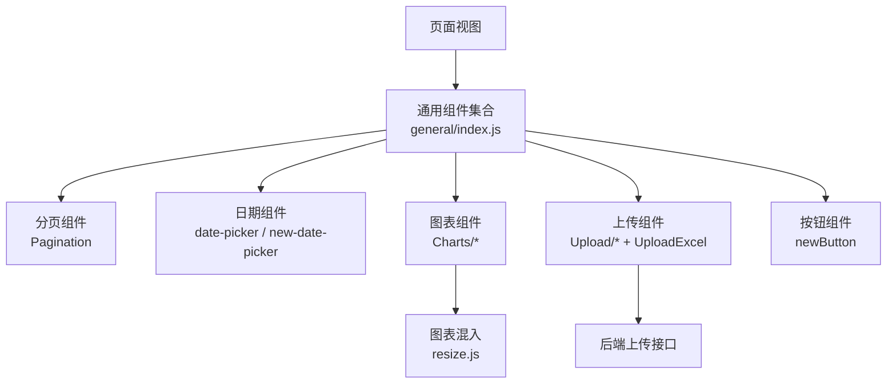
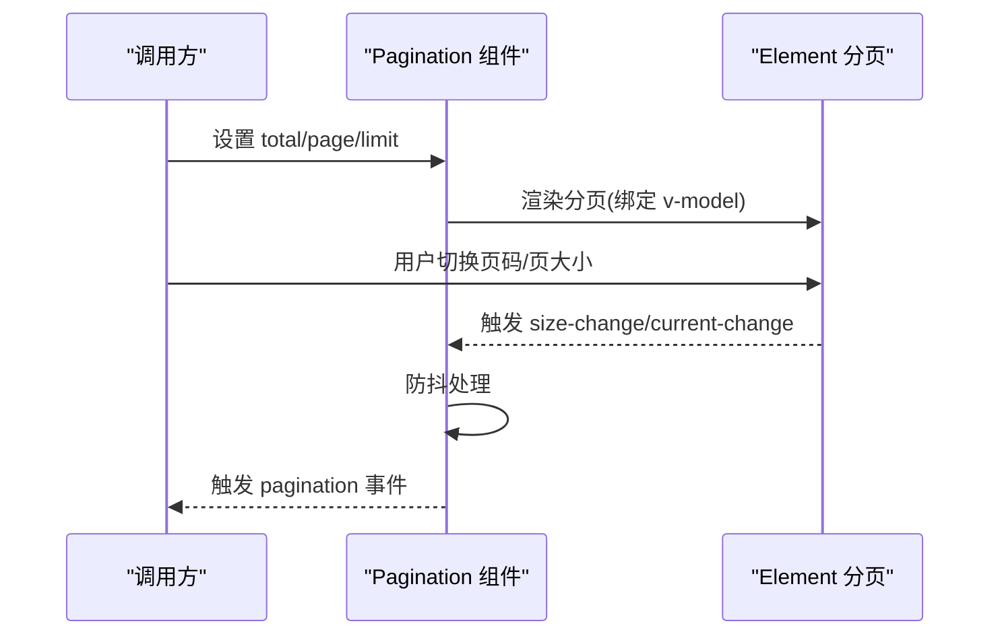
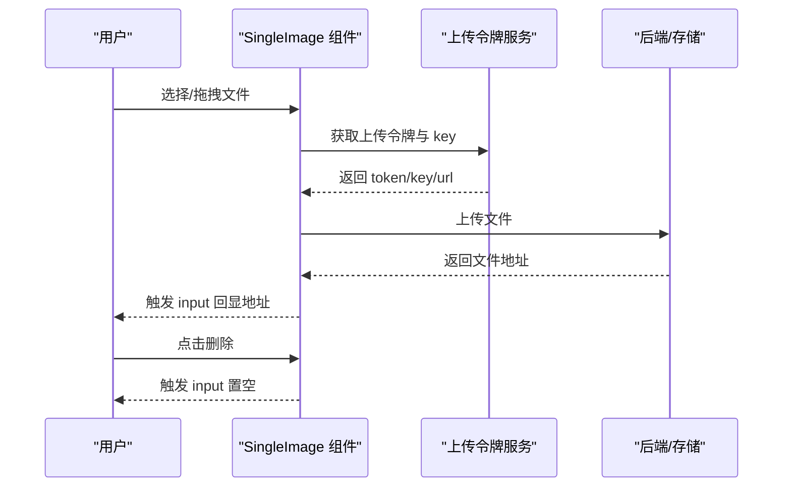
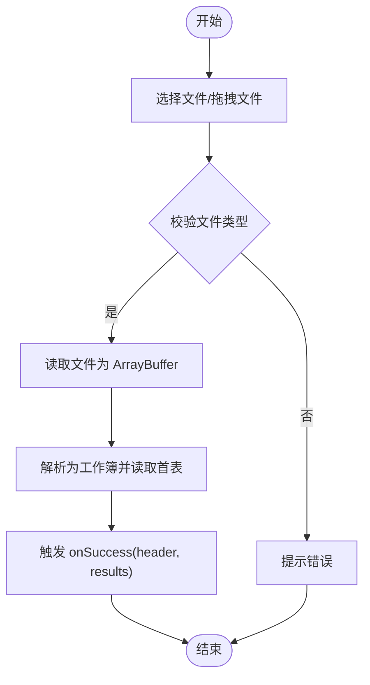
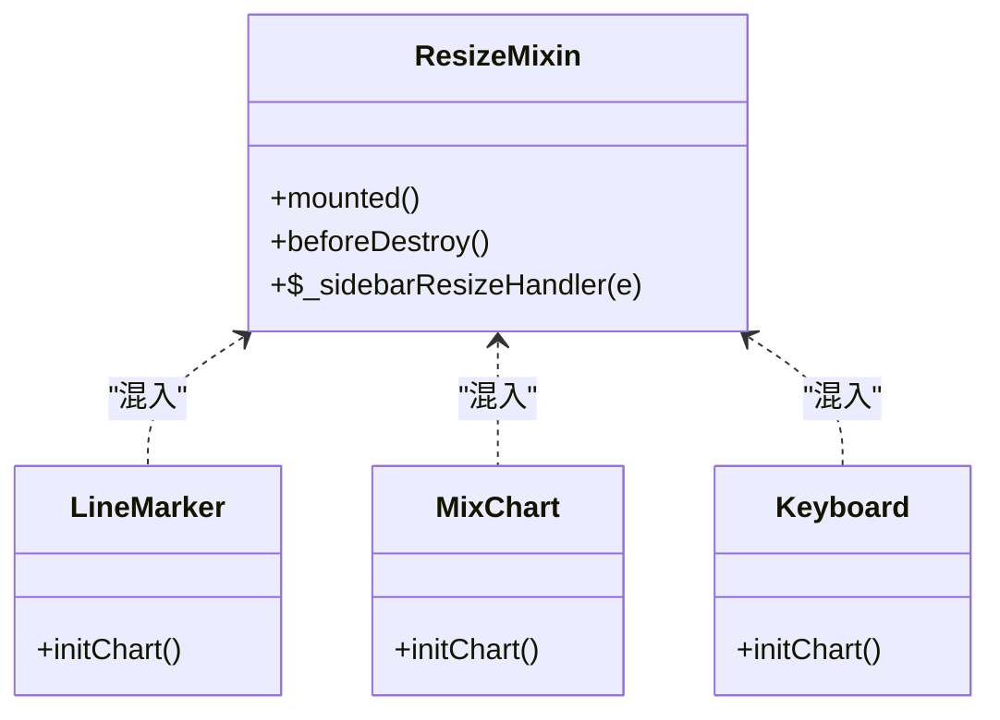
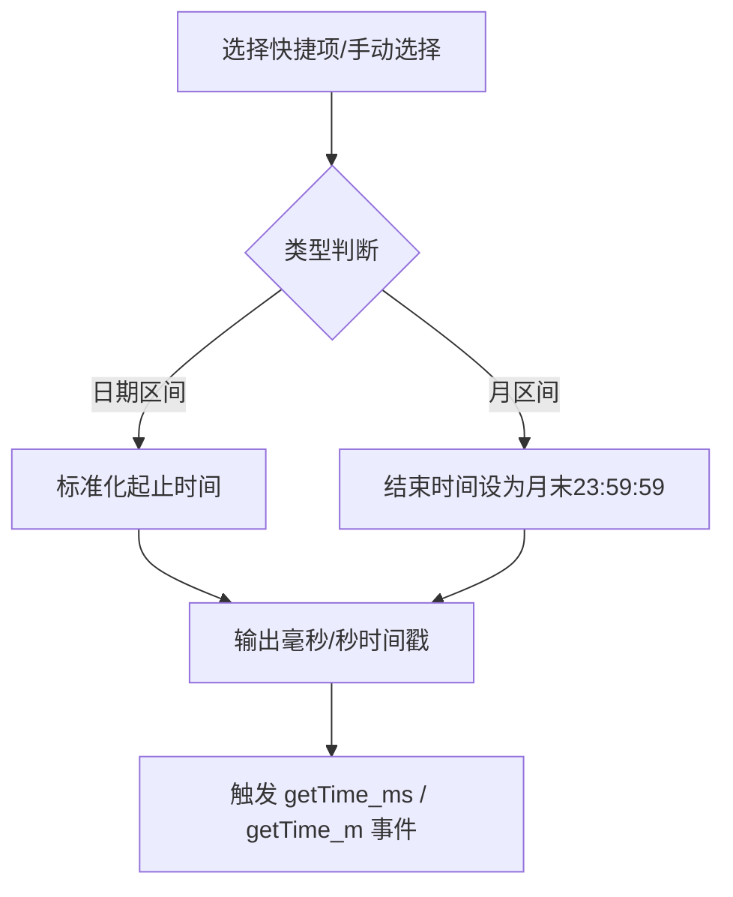
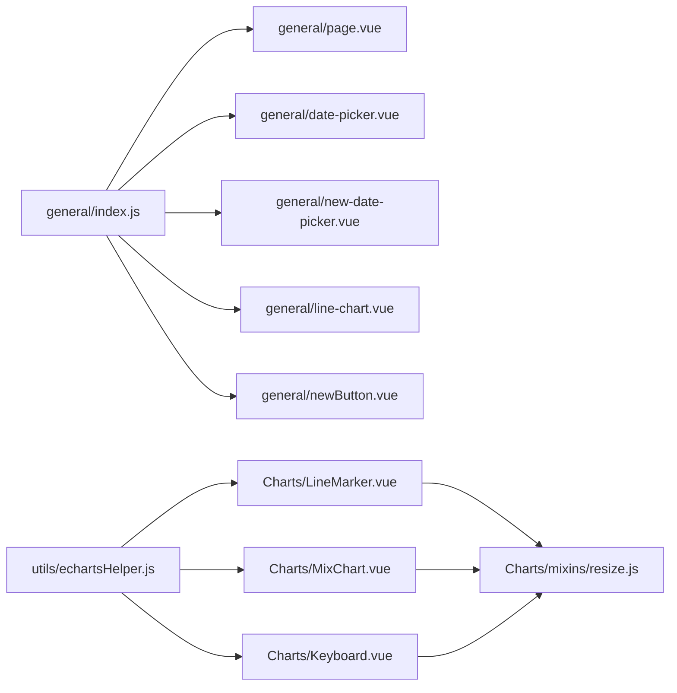

# 通用组件

<cite>
**本文引用的文件**   
- [src/components/general/index.js](file://src/components/general/index.js)
- [src/components/Pagination/index.vue](file://src/components/Pagination/index.vue)
- [src/components/Upload/SingleImage.vue](file://src/components/Upload/SingleImage.vue)
- [src/components/Upload/SingleImage2.vue](file://src/components/Upload/SingleImage2.vue)
- [src/components/Upload/SingleImage3.vue](file://src/components/Upload/SingleImage3.vue)
- [src/components/UploadExcel/index.vue](file://src/components/UploadExcel/index.vue)
- [src/components/Charts/LineMarker.vue](file://src/components/Charts/LineMarker.vue)
- [src/components/Charts/MixChart.vue](file://src/components/Charts/MixChart.vue)
- [src/components/Charts/Keyboard.vue](file://src/components/Charts/Keyboard.vue)
- [src/components/Charts/mixins/resize.js](file://src/components/Charts/mixins/resize.js)
- [src/components/general/date-picker.vue](file://src/components/general/date-picker.vue)
- [src/components/general/new-date-picker.vue](file://src/components/general/new-date-picker.vue)
- [src/components/general/page.vue](file://src/components/general/page.vue)
- [src/components/general/line-chart.vue](file://src/components/general/line-chart.vue)
- [src/components/general/newButton.vue](file://src/components/general/newButton.vue)
- [src/utils/echartsHelper.js](file://src/utils/echartsHelper.js)
</cite>

## 目录
1. [简介](#简介)
2. [项目结构](#项目结构)
3. [核心组件](#核心组件)
4. [架构总览](#架构总览)
5. [详细组件分析](#详细组件分析)
6. [依赖关系分析](#依赖关系分析)
7. [性能考量](#性能考量)
8. [故障排查指南](#故障排查指南)
9. [结论](#结论)
10. [附录](#附录)

## 简介
本文件面向 Leisu Admin 项目的通用组件，系统化梳理组件设计理念与抽象原则（可复用、可配置、可扩展），并围绕以下主题展开：表格组件（数据展示、排序筛选、分页、行选择）、表单组件（表单项、校验、布局）、图表组件（ECharts 封装、数据绑定、交互）、上传组件（文件上传、进度、格式限制、预览）、分页组件（页码计算、跳转、数据加载）。同时提供 API 属性、事件回调、使用示例、性能优化建议与常见问题解决方案。

## 项目结构
通用组件主要分布在以下目录：
- 通用业务组件：src/components/general
- 分页组件：src/components/Pagination
- 上传组件：src/components/Upload、src/components/UploadExcel
- 图表组件：src/components/Charts 及其混入 resize
- 图表工具：src/utils/echartsHelper

**图表来源**
- [src/components/general/index.js:1-41](file://src/components/general/index.js#L1-L41)
- [src/components/Pagination/index.vue:1-113](file://src/components/Pagination/index.vue#L1-L113)
- [src/components/Upload/SingleImage.vue:1-135](file://src/components/Upload/SingleImage.vue#L1-L135)
- [src/components/Upload/SingleImage2.vue:1-131](file://src/components/Upload/SingleImage2.vue#L1-L131)
- [src/components/Upload/SingleImage3.vue:1-158](file://src/components/Upload/SingleImage3.vue#L1-L158)
- [src/components/UploadExcel/index.vue:1-139](file://src/components/UploadExcel/index.vue#L1-L139)
- [src/components/Charts/LineMarker.vue:1-228](file://src/components/Charts/LineMarker.vue#L1-L228)
- [src/components/Charts/MixChart.vue:1-272](file://src/components/Charts/MixChart.vue#L1-L272)
- [src/components/Charts/Keyboard.vue:1-157](file://src/components/Charts/Keyboard.vue#L1-L157)
- [src/components/Charts/mixins/resize.js:1-35](file://src/components/Charts/mixins/resize.js#L1-L35)

**章节来源**
- [src/components/general/index.js:1-41](file://src/components/general/index.js#L1-L41)
- [src/components/Pagination/index.vue:1-113](file://src/components/Pagination/index.vue#L1-L113)

## 核心组件
- 通用组件集合导出：通过统一入口导出通用业务组件，便于按需引入与复用。
- 分页组件：基于 Element UI 的分页，支持同步页码/页大小、防抖事件、自动滚动等。
- 上传组件：单图上传（多种样式版本）与 Excel 导入，支持拖拽、校验、成功回调。
- 图表组件：基于 ECharts 的折线、混合柱线、键盘风格图，内置响应式处理。
- 日期组件：通用日期范围与快捷日期选择，支持多种时间粒度与默认值策略。
- 按钮组件：组合按钮样式与状态，支持禁用、激活、边框组合。

**章节来源**
- [src/components/general/index.js:1-41](file://src/components/general/index.js#L1-L41)
- [src/components/Pagination/index.vue:26-101](file://src/components/Pagination/index.vue#L26-L101)
- [src/components/Upload/SingleImage.vue:31-77](file://src/components/Upload/SingleImage.vue#L31-L77)
- [src/components/Upload/SingleImage2.vue:31-77](file://src/components/Upload/SingleImage2.vue#L31-L77)
- [src/components/Upload/SingleImage3.vue:39-85](file://src/components/Upload/SingleImage3.vue#L39-L85)
- [src/components/UploadExcel/index.vue:16-118](file://src/components/UploadExcel/index.vue#L16-L118)
- [src/components/Charts/LineMarker.vue:9-43](file://src/components/Charts/LineMarker.vue#L9-L43)
- [src/components/Charts/MixChart.vue:9-43](file://src/components/Charts/MixChart.vue#L9-L43)
- [src/components/Charts/Keyboard.vue:9-43](file://src/components/Charts/Keyboard.vue#L9-L43)
- [src/components/Charts/mixins/resize.js:9-34](file://src/components/Charts/mixins/resize.js#L9-L34)
- [src/components/general/date-picker.vue:18-325](file://src/components/general/date-picker.vue#L18-L325)
- [src/components/general/new-date-picker.vue:25-173](file://src/components/general/new-date-picker.vue#L25-L173)
- [src/components/general/page.vue:18-52](file://src/components/general/page.vue#L18-L52)
- [src/components/general/line-chart.vue:8-101](file://src/components/general/line-chart.vue#L8-L101)
- [src/components/general/newButton.vue:9-62](file://src/components/general/newButton.vue#L9-L62)

## 架构总览
通用组件遵循“低耦合、高内聚”的设计原则，通过统一导出与事件驱动实现跨页面复用；图表组件通过混入实现响应式适配；上传组件通过外部令牌与后端对接，保证安全与灵活性。

**图表来源**
- [src/components/general/index.js:22-40](file://src/components/general/index.js#L22-L40)
- [src/components/Pagination/index.vue:5-18](file://src/components/Pagination/index.vue#L5-L18)
- [src/components/Charts/mixins/resize.js:9-34](file://src/components/Charts/mixins/resize.js#L9-L34)
- [src/components/Upload/SingleImage.vue:3-16](file://src/components/Upload/SingleImage.vue#L3-L16)
- [src/components/UploadExcel/index.vue:3-9](file://src/components/UploadExcel/index.vue#L3-L9)

## 详细组件分析

### 分页组件（Pagination）
- 设计理念：对 Element UI 分页进行二次封装，统一事件命名与参数结构，支持防抖与自动滚动。
- 关键属性
  - total：总数
  - page：当前页（双向绑定）
  - limit：每页条数（双向绑定）
  - pageSizes：页大小选项
  - layout：布局字符串
  - background：是否显示背景
  - autoScroll：切换页码后是否滚动
  - hidden：是否隐藏
  - pagerCount：页码按钮数量（奇数，5~21）
- 关键事件
  - pagination：{page, limit, pageSize?}，其中 pageSize 仅在 size-change 时携带
- 处理逻辑
  - 使用计算属性将 page/limit 映射到 Element 的 v-model
  - 对 size-change/current-change 进行防抖，降低频繁触发
  - 支持外部 attrs 透传给 Element 分页

**图表来源**
- [src/components/Pagination/index.vue:5-18](file://src/components/Pagination/index.vue#L5-L18)
- [src/components/Pagination/index.vue:87-99](file://src/components/Pagination/index.vue#L87-L99)

**章节来源**
- [src/components/Pagination/index.vue:26-101](file://src/components/Pagination/index.vue#L26-L101)

### 上传组件（SingleImage/SingleImage2/SingleImage3）
- 设计理念：基于 Element Upload，统一封装上传前置参数（如 token/key）、成功回调与预览。
- 共同点
  - 支持拖拽上传、隐藏文件列表
  - 上传前通过 getToken 获取临时凭证与目标 key
  - 成功回调后回填图片地址并触发 input 事件
  - 提供删除操作
- 差异点
  - SingleImage：预览尺寸固定（200x200），支持缩略图参数
  - SingleImage2：全尺寸预览，容器自适应
  - SingleImage3：双预览区（应用封面与普通预览）

**图表来源**
- [src/components/Upload/SingleImage.vue:57-76](file://src/components/Upload/SingleImage.vue#L57-L76)
- [src/components/Upload/SingleImage2.vue:57-76](file://src/components/Upload/SingleImage2.vue#L57-L76)
- [src/components/Upload/SingleImage3.vue:65-85](file://src/components/Upload/SingleImage3.vue#L65-L85)

**章节来源**
- [src/components/Upload/SingleImage.vue:31-77](file://src/components/Upload/SingleImage.vue#L31-L77)
- [src/components/Upload/SingleImage2.vue:31-77](file://src/components/Upload/SingleImage2.vue#L31-L77)
- [src/components/Upload/SingleImage3.vue:39-85](file://src/components/Upload/SingleImage3.vue#L39-L85)

### 上传组件（UploadExcel）
- 设计理念：提供拖拽/浏览两种方式导入 Excel，解析首表头与数据，输出标准结构。
- 关键点
  - 仅接受 .xlsx/.xls/.csv
  - 读取首张工作表，提取表头与 JSON 数据
  - 支持 beforeUpload/onSuccess 钩子，便于自定义校验与处理
- 输出结构
  - header：数组
  - results：对象数组

**图表来源**
- [src/components/UploadExcel/index.vue:36-118](file://src/components/UploadExcel/index.vue#L36-L118)

**章节来源**
- [src/components/UploadExcel/index.vue:16-118](file://src/components/UploadExcel/index.vue#L16-L118)

### 图表组件（Charts）
- 设计理念：以 ECharts 为基础，封装常用图表类型，并通过混入实现窗口变化自适应。
- 组件族
  - LineMarker：带面积与标记的折线图
  - MixChart：柱线混合图，含 dataZoom
  - Keyboard：视觉风格化柱状图
- 共同特性
  - 通过 mixin resize 在窗口/侧边栏收起时重绘
  - 组件销毁时释放实例
- 工具函数（echartsHelper）
  - 动态调整 markArea 边框宽度，随 dataZoom 调整
  - 提供创建带动态 markArea 的 series 配置

**图表来源**
- [src/components/Charts/mixins/resize.js:9-34](file://src/components/Charts/mixins/resize.js#L9-L34)
- [src/components/Charts/LineMarker.vue:34-43](file://src/components/Charts/LineMarker.vue#L34-L43)
- [src/components/Charts/MixChart.vue:34-43](file://src/components/Charts/MixChart.vue#L34-L43)
- [src/components/Charts/Keyboard.vue:34-43](file://src/components/Charts/Keyboard.vue#L34-L43)

**章节来源**
- [src/components/Charts/LineMarker.vue:9-43](file://src/components/Charts/LineMarker.vue#L9-L43)
- [src/components/Charts/MixChart.vue:9-43](file://src/components/Charts/MixChart.vue#L9-L43)
- [src/components/Charts/Keyboard.vue:9-43](file://src/components/Charts/Keyboard.vue#L9-L43)
- [src/components/Charts/mixins/resize.js:9-34](file://src/components/Charts/mixins/resize.js#L9-L34)
- [src/utils/echartsHelper.js:71-103](file://src/utils/echartsHelper.js#L71-L103)

### 日期组件（date-picker / new-date-picker）
- 设计理念：提供快捷时间范围与默认值策略，统一输出时间戳与文本标识。
- date-picker
  - 支持多种默认类型（当天/近N天/月/上月/半年/一年/本年度等）
  - 内置快捷面板，支持初始化与变更事件
  - 输出毫秒时间戳数组
- new-date-picker
  - 支持日期/日期时间区间、默认时间、格式化、禁用未来时间
  - 输出毫秒与秒两种时间戳格式，并附带快捷文案标识

**图表来源**
- [src/components/general/date-picker.vue:104-234](file://src/components/general/date-picker.vue#L104-L234)
- [src/components/general/new-date-picker.vue:92-172](file://src/components/general/new-date-picker.vue#L92-L172)

**章节来源**
- [src/components/general/date-picker.vue:18-325](file://src/components/general/date-picker.vue#L18-L325)
- [src/components/general/new-date-picker.vue:25-173](file://src/components/general/new-date-picker.vue#L25-L173)

### 页面级分页（page）
- 设计理念：简化场景下的分页展示，仅提供总数、上一页、页码、下一页。
- 关键点
  - 默认 page_size 固定为 15
  - 提供 reset 重置方法
  - 输出 on-change([page, size])

**章节来源**
- [src/components/general/page.vue:18-52](file://src/components/general/page.vue#L18-L52)

### 折线图封装（line-chart）
- 设计理念：对外暴露 initChart(data) 与 setOption([xAxis, series])，内部统一网格、提示、缩放与坐标轴配置。
- 关键点
  - series 统一设置最大柱宽
  - 自动去重 legend
  - 提供双 Y 轴占位（便于扩展）

**章节来源**
- [src/components/general/line-chart.vue:8-101](file://src/components/general/line-chart.vue#L8-L101)

### 组合按钮（newButton）
- 设计理念：支持禁用、激活、多按钮组合（首/中/尾）的边框样式，统一点击事件。
- 关键点
  - 支持 width/height/type/active/noborder/disabled
  - 首/中/尾按钮通过类名控制圆角合并

**章节来源**
- [src/components/general/newButton.vue:9-62](file://src/components/general/newButton.vue#L9-L62)

## 依赖关系分析
- 通用组件导出集中于 general/index.js，便于按需引入与 Tree Shaking。
- 图表组件依赖 resize 混入实现响应式；echartsHelper 提供图表增强能力。
- 上传组件依赖后端令牌服务，确保上传安全可控。
- 分页组件依赖 lodash 防抖，减少事件风暴。

**图表来源**
- [src/components/general/index.js:22-40](file://src/components/general/index.js#L22-L40)
- [src/components/Charts/mixins/resize.js:9-34](file://src/components/Charts/mixins/resize.js#L9-L34)
- [src/utils/echartsHelper.js:71-103](file://src/utils/echartsHelper.js#L71-L103)

**章节来源**
- [src/components/general/index.js:1-41](file://src/components/general/index.js#L1-L41)
- [src/utils/echartsHelper.js:1-138](file://src/utils/echartsHelper.js#L1-L138)

## 性能考量
- 防抖与节流
  - 分页组件对 size-change/current-change 使用防抖，避免频繁请求
  - 图表 resize 使用防抖，减少窗口变化时的重绘压力
- 资源释放
  - 图表组件在 beforeDestroy 中 dispose 实例，防止内存泄漏
- 上传安全
  - 上传前获取临时令牌与 key，避免直接暴露后端密钥
- 渲染优化
  - 日期组件与分页组件尽量使用 v-model 与事件解耦，减少不必要的重渲染

[本节为通用指导，无需特定文件引用]

## 故障排查指南
- 上传失败
  - 检查 getToken 接口返回的 token/key 是否正确下发
  - 确认 action 地址与后端 CORS 配置
  - 查看控制台网络请求与后端返回
- 图表不显示或尺寸异常
  - 确保容器有明确宽高
  - 检查 resize 混入是否生效（窗口变化/侧边栏收起）
- 分页无效或频繁刷新
  - 检查 pagination 事件参数结构是否符合预期
  - 确认 total 与 page/limit 的初始值设置
- Excel 导入报错
  - 确认文件后缀与 MIME 类型
  - 检查首表是否为空或表头重复

**章节来源**
- [src/components/Pagination/index.vue:87-99](file://src/components/Pagination/index.vue#L87-L99)
- [src/components/Charts/mixins/resize.js:9-34](file://src/components/Charts/mixins/resize.js#L9-L34)
- [src/components/Upload/SingleImage.vue:60-76](file://src/components/Upload/SingleImage.vue#L60-L76)
- [src/components/UploadExcel/index.vue:114-118](file://src/components/UploadExcel/index.vue#L114-L118)

## 结论
Leisu Admin 的通用组件体系以“可复用、可配置、可扩展”为核心，覆盖分页、上传、图表、日期、按钮等高频场景。通过统一导出、事件驱动与混入机制，既保证了组件的独立性，又提升了跨页面的一致性与开发效率。建议在业务中优先使用这些通用组件，并结合自身需求进行二次封装与扩展。

[本节为总结，无需特定文件引用]

## 附录

### 通用组件 API 一览（要点）
- Pagination
  - 属性：total, page(v-model), limit(v-model), pageSizes, layout, background, autoScroll, hidden, pagerCount
  - 事件：pagination({page, limit, pageSize?})
- SingleImage/SingleImage2/SingleImage3
  - 属性：value(String)
  - 事件：input(String)
  - 方法：rmImage()
- UploadExcel
  - 属性：beforeUpload(Function), onSuccess(Function)
  - 方法：handleDrop, handleDragover, handleUpload, handleClick, upload, readerData, getHeaderRow, isExcel
- Charts（LineMarker/MixChart/Keyboard）
  - 属性：className, id, width, height
  - 生命周期：initChart -> setOption
  - 混入：resize（window/sidebar 变化时自动 resize）
- date-picker/new-date-picker
  - 事件：on-init(Array), on-change(Array), input(Array)
  - 方法：setData(Array), reset()
- page
  - 事件：on-change([page, size])
  - 方法：reset()
- line-chart
  - 方法：initChart(data), setOption([xAxis, series])
- newButton
  - 事件：click
  - 属性：width, height, type, active, noborder, isFirst, isMiddle, isFinally, disabled

**章节来源**
- [src/components/Pagination/index.vue:28-101](file://src/components/Pagination/index.vue#L28-L101)
- [src/components/Upload/SingleImage.vue:33-77](file://src/components/Upload/SingleImage.vue#L33-L77)
- [src/components/Upload/SingleImage2.vue:33-77](file://src/components/Upload/SingleImage2.vue#L33-L77)
- [src/components/Upload/SingleImage3.vue:41-85](file://src/components/Upload/SingleImage3.vue#L41-L85)
- [src/components/UploadExcel/index.vue:17-118](file://src/components/UploadExcel/index.vue#L17-L118)
- [src/components/Charts/LineMarker.vue:11-43](file://src/components/Charts/LineMarker.vue#L11-L43)
- [src/components/Charts/MixChart.vue:11-43](file://src/components/Charts/MixChart.vue#L11-L43)
- [src/components/Charts/Keyboard.vue:11-43](file://src/components/Charts/Keyboard.vue#L11-L43)
- [src/components/Charts/mixins/resize.js:9-34](file://src/components/Charts/mixins/resize.js#L9-L34)
- [src/components/general/date-picker.vue:20-325](file://src/components/general/date-picker.vue#L20-L325)
- [src/components/general/new-date-picker.vue:27-173](file://src/components/general/new-date-picker.vue#L27-L173)
- [src/components/general/page.vue:20-52](file://src/components/general/page.vue#L20-L52)
- [src/components/general/line-chart.vue:10-101](file://src/components/general/line-chart.vue#L10-L101)
- [src/components/general/newButton.vue:11-62](file://src/components/general/newButton.vue#L11-L62)