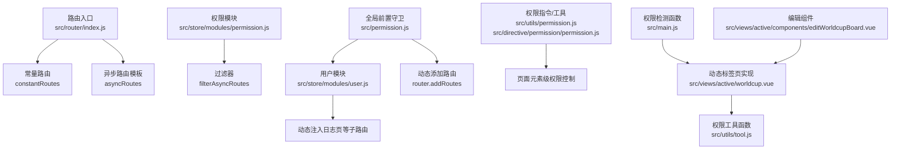
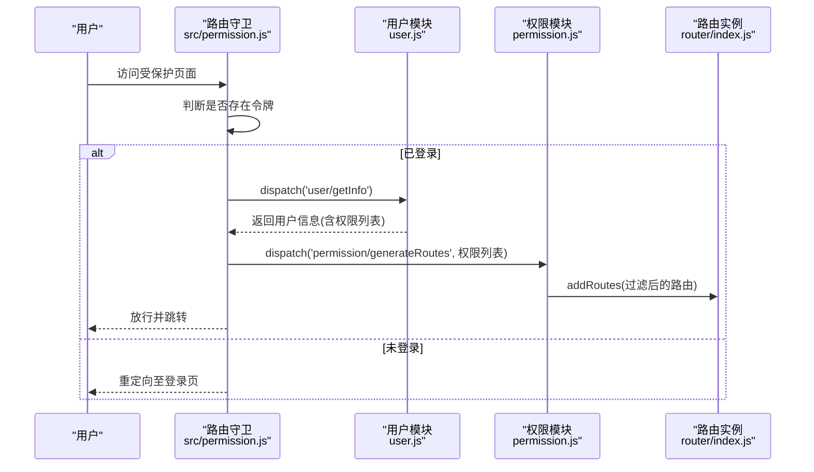
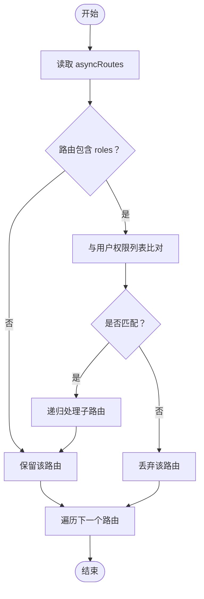
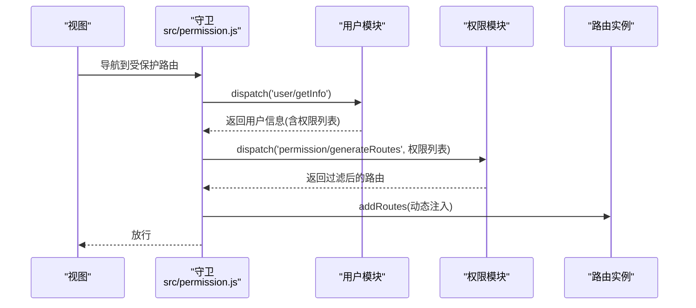
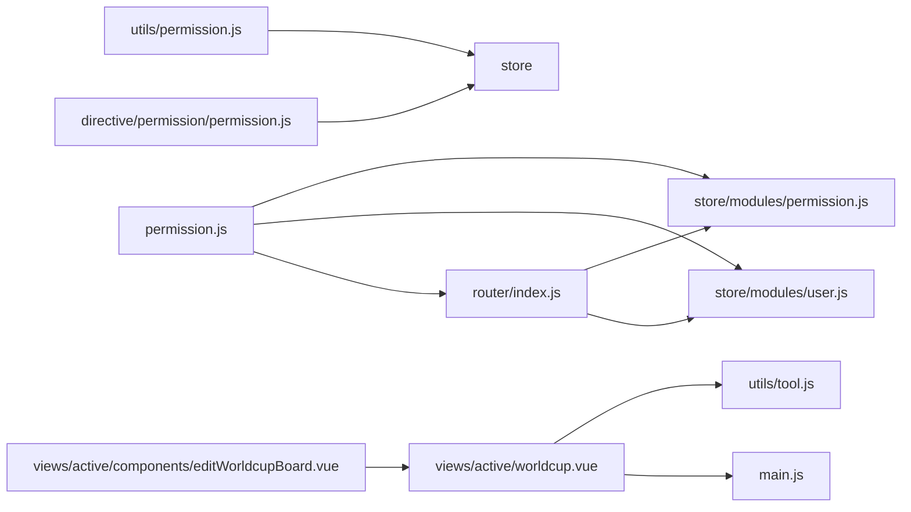

# 动态路由

<cite>
**本文引用的文件**
- [src/router/index.js](file://src/router/index.js)
- [src/store/modules/permission.js](file://src/store/modules/permission.js)
- [src/permission.js](file://src/permission.js)
- [src/store/modules/user.js](file://src/store/modules/user.js)
- [src/router/children/member.js](file://src/router/children/member.js)
- [src/router/children/forum/index.js](file://src/router/children/forum/index.js)
- [src/router/children/forum/active.js](file://src/router/children/forum/active.js)
- [src/router/children/match/index.js](file://src/router/children/match/index.js)
- [src/router/children/robot.js](file://src/router/children/robot.js)
- [src/router/children/overview.js](file://src/router/children/overview.js)
- [src/router/children/intelligence.js](file://src/router/children/intelligence.js)
- [src/utils/auth.js](file://src/utils/auth.js)
- [src/utils/permission.js](file://src/utils/permission.js)
- [src/directive/permission/permission.js](file://src/directive/permission/permission.js)
- [src/views/active/worldcup.vue](file://src/views/active/worldcup.vue)
- [src/views/active/components/editWorldcupBoard.vue](file://src/views/active/components/editWorldcupBoard.vue)
- [src/utils/tool.js](file://src/utils/tool.js)
- [src/main.js](file://src/main.js)
- [mock/role/routes.js](file://mock/role/routes.js)
</cite>

## 更新摘要
**所做更改**
- 新增世界杯组件动态标签页实现章节，展示基于用户权限的动态内容渲染模式
- 更新动态路由与权限系统集成章节，增加基于权限的动态标签页生成机制
- 新增动态标签页权限控制示例，包括标签页可见性控制和内容权限验证
- 扩展权限工具函数说明，涵盖getFirstPermissionTab等工具函数的使用

## 目录
1. [简介](#简介)
2. [项目结构](#项目结构)
3. [核心组件](#核心组件)
4. [架构总览](#架构总览)
5. [详细组件分析](#详细组件分析)
6. [依赖关系分析](#依赖关系分析)
7. [性能考量](#性能考量)
8. [故障排查指南](#故障排查指南)
9. [结论](#结论)
10. [附录](#附录)

## 简介
本文件系统性阐述 Leisu Admin 的动态路由机制，围绕以下目标展开：
- 动态路由概念与实现原理：基于用户角色在运行时生成可访问路由集合，并与菜单、权限指令联动。
- asyncRoutes 结构设计：模块化路由配置、路由分组管理、权限控制集成。
- 加载流程：登录后路由生成、菜单权限匹配、路由表合并策略。
- 路由模块化设计：功能模块路由、子路由组织、路由参数传递。
- 权限系统集成：权限判断逻辑、路由过滤机制、菜单生成算法。
- 动态标签页实现：基于用户权限的动态内容渲染模式，展示标签页的动态生成与权限控制。
- 配置示例与扩展方法：帮助开发者实现灵活的权限控制和动态内容渲染。

## 项目结构
动态路由相关的核心位置集中在：
- 路由定义与入口：src/router/index.js
- 权限过滤与状态管理：src/store/modules/permission.js
- 全局前置守卫：src/permission.js
- 用户信息与动态路由注入：src/store/modules/user.js
- 各功能模块路由：src/router/children/*
- 权限指令与工具：src/utils/permission.js、src/directive/permission/permission.js
- 动态标签页实现：src/views/active/worldcup.vue、src/views/active/components/editWorldcupBoard.vue
- 权限工具函数：src/utils/tool.js
- 示例与对比：mock/role/routes.js

**图表来源**
- [src/router/index.js:1-177](file://src/router/index.js#L1-L177)
- [src/store/modules/permission.js:1-66](file://src/store/modules/permission.js#L1-L66)
- [src/permission.js:1-82](file://src/permission.js#L1-L82)
- [src/store/modules/user.js:1-542](file://src/store/modules/user.js#L1-L542)
- [src/utils/permission.js:1-26](file://src/utils/permission.js#L1-L26)
- [src/directive/permission/permission.js:1-23](file://src/directive/permission/permission.js#L1-L23)
- [src/views/active/worldcup.vue:1-180](file://src/views/active/worldcup.vue#L1-L180)
- [src/utils/tool.js:1030-1045](file://src/utils/tool.js#L1030-L1045)
- [src/main.js:179-192](file://src/main.js#L179-L192)
- [src/views/active/components/editWorldcupBoard.vue:1-198](file://src/views/active/components/editWorldcupBoard.vue#L1-L198)

**章节来源**
- [src/router/index.js:1-177](file://src/router/index.js#L1-L177)
- [src/store/modules/permission.js:1-66](file://src/store/modules/permission.js#L1-L66)
- [src/permission.js:1-82](file://src/permission.js#L1-L82)
- [src/store/modules/user.js:1-542](file://src/store/modules/user.js#L1-L542)
- [src/utils/permission.js:1-26](file://src/utils/permission.js#L1-L26)
- [src/directive/permission/permission.js:1-23](file://src/directive/permission/permission.js#L1-L23)
- [src/views/active/worldcup.vue:1-180](file://src/views/active/worldcup.vue#L1-L180)
- [src/utils/tool.js:1030-1045](file://src/utils/tool.js#L1030-L1045)
- [src/main.js:179-192](file://src/main.js#L179-L192)
- [src/views/active/components/editWorldcupBoard.vue:1-198](file://src/views/active/components/editWorldcupBoard.vue#L1-L198)

## 核心组件
- 异步路由模板 asyncRoutes：集中定义所有可按角色动态加载的功能模块路由，包含路径、组件、元信息（含权限键）、以及子路由。
- 权限过滤模块 permission：提供递归过滤函数，依据用户角色集合筛选可访问路由。
- 全局前置守卫 permission.js：在路由跳转前拉取用户信息、生成可访问路由并动态注入。
- 用户模块 user：负责获取用户详情、拼接报表等附加权限、必要时向 asyncRoutes 注入临时子路由。
- 权限指令与工具：v-permission 指令与工具函数用于页面元素级权限控制。
- 动态标签页组件：基于用户权限动态生成标签页，实现内容的按权限渲染。

**章节来源**
- [src/router/index.js:74-160](file://src/router/index.js#L74-L160)
- [src/store/modules/permission.js:8-35](file://src/store/modules/permission.js#L8-L35)
- [src/permission.js:13-76](file://src/permission.js#L13-L76)
- [src/store/modules/user.js:173-335](file://src/store/modules/user.js#L173-L335)
- [src/utils/permission.js:8-25](file://src/utils/permission.js#L8-L25)
- [src/directive/permission/permission.js:4-22](file://src/directive/permission/permission.js#L4-L22)
- [src/views/active/worldcup.vue:46-124](file://src/views/active/worldcup.vue#L46-L124)

## 架构总览
动态路由从"用户登录"到"菜单渲染"的关键链路如下：

**图表来源**
- [src/permission.js:13-76](file://src/permission.js#L13-L76)
- [src/store/modules/user.js:173-335](file://src/store/modules/user.js#L173-L335)
- [src/store/modules/permission.js:50-57](file://src/store/modules/permission.js#L50-L57)
- [src/router/index.js:162-176](file://src/router/index.js#L162-L176)

## 详细组件分析

### asyncRoutes 结构设计
- 模块化路由配置：每个功能模块以独立文件导出路由对象，包含父级布局、标题、图标、权限键与子路由数组。
- 路由分组管理：通过统一的 asyncRoutes 汇总，便于集中过滤与注入。
- 权限控制集成：路由元信息 meta 中包含 roles 字段，作为权限判断依据；部分模块还包含额外字段（如 source_type、str 等）用于菜单或页面参数传递。

示例参考：
- 用户模块路由：[src/router/children/member.js:131-165](file://src/router/children/member.js#L131-L165)
- 社区模块路由：[src/router/children/forum/index.js:165-229](file://src/router/children/forum/index.js#L165-L229)
- 活动子模块路由：[src/router/children/forum/active.js:60-69](file://src/router/children/forum/active.js#L60-L69)
- 比赛模块路由：[src/router/children/match/index.js:80-276](file://src/router/children/match/index.js#L80-L276)
- 自媒体机器人路由：[src/router/children/robot.js:24-32](file://src/router/children/robot.js#L24-L32)
- 仪表盘路由：[src/router/children/overview.js:56-62](file://src/router/children/overview.js#L56-L62)
- 世界杯路由：[src/router/children/intelligence.js:150-155](file://src/router/children/intelligence.js#L150-L155)

**章节来源**
- [src/router/index.js:74-160](file://src/router/index.js#L74-L160)
- [src/router/children/member.js:131-165](file://src/router/children/member.js#L131-L165)
- [src/router/children/forum/index.js:165-229](file://src/router/children/forum/index.js#L165-L229)
- [src/router/children/forum/active.js:60-69](file://src/router/children/forum/active.js#L60-L69)
- [src/router/children/match/index.js:80-276](file://src/router/children/match/index.js#L80-L276)
- [src/router/children/robot.js:24-32](file://src/router/children/robot.js#L24-L32)
- [src/router/children/overview.js:56-62](file://src/router/children/overview.js#L56-L62)
- [src/router/children/intelligence.js:150-155](file://src/router/children/intelligence.js#L150-L155)

### 权限过滤与路由生成
- 递归过滤：根据路由元信息中的 roles 字段与用户权限列表进行匹配，若不满足则剔除；对存在 children 的节点递归处理。
- 路由合并：将过滤后的异步路由与常量路由合并，形成最终可用路由表。
- 动态注入：在用户获取信息阶段，可能向 asyncRoutes 注入临时子路由（如日志页面），随后再参与过滤。

**图表来源**
- [src/store/modules/permission.js:8-35](file://src/store/modules/permission.js#L8-L35)

**章节来源**
- [src/store/modules/permission.js:8-35](file://src/store/modules/permission.js#L8-L35)
- [src/store/modules/permission.js:42-47](file://src/store/modules/permission.js#L42-L47)
- [src/store/modules/permission.js:49-57](file://src/store/modules/permission.js#L49-L57)

### 登录后路由生成与菜单匹配
- 登录后守卫：已登录但未获取用户信息时，先拉取用户详情，再生成可访问路由并动态注入。
- 菜单匹配：路由元信息中的 title、icon、roles 等字段用于生成侧边栏菜单；部分模块通过 roles 组合多个权限键。
- 参数传递：部分路由携带自定义 meta 字段（如 source_type、str），用于页面内部逻辑或菜单展示。

**图表来源**
- [src/permission.js:38-54](file://src/permission.js#L38-L54)
- [src/store/modules/permission.js:50-57](file://src/store/modules/permission.js#L50-L57)
- [src/router/index.js:162-176](file://src/router/index.js#L162-L176)

**章节来源**
- [src/permission.js:13-76](file://src/permission.js#L13-L76)
- [src/store/modules/user.js:173-335](file://src/store/modules/user.js#L173-L335)
- [src/store/modules/permission.js:49-57](file://src/store/modules/permission.js#L49-L57)

### 路由模块化设计
- 功能模块划分：用户、社区、比赛、仪表盘、机器人、支付、系统、运维工具等模块各自维护独立的路由文件。
- 子路由组织：父级路由定义 meta（title/icon/roles）与 children 数组，子路由聚焦具体页面。
- 路由参数传递：通过 meta 字段扩展参数（如 source_type、str），在页面中读取使用。

**章节来源**
- [src/router/children/member.js:1-165](file://src/router/children/member.js#L1-L165)
- [src/router/children/forum/index.js:1-230](file://src/router/children/forum/index.js#L1-L230)
- [src/router/children/match/index.js:1-277](file://src/router/children/match/index.js#L1-L277)
- [src/router/children/robot.js:1-33](file://src/router/children/robot.js#L1-L33)
- [src/router/children/overview.js:1-63](file://src/router/children/overview.js#L1-L63)
- [src/router/children/intelligence.js:158-194](file://src/router/children/intelligence.js#L158-L194)

### 动态路由与权限系统的集成
- 页面级权限：v-permission 指令与工具函数检查当前用户是否拥有指定权限集合，无权限则隐藏元素或抛出错误。
- 路由级权限：通过 meta.roles 与过滤器实现，确保仅显示用户具备访问权限的菜单项与页面。
- 菜单生成算法：以路由树为基础，遍历节点并根据 meta 字段生成菜单树，支持多级嵌套。
- 动态标签页权限控制：基于用户权限动态生成标签页，实现内容的按权限渲染。

**更新** 新增动态标签页权限控制机制，展示基于权限的动态内容渲染模式

**章节来源**
- [src/utils/permission.js:8-25](file://src/utils/permission.js#L8-L25)
- [src/directive/permission/permission.js:4-22](file://src/directive/permission/permission.js#L4-L22)
- [src/store/modules/permission.js:8-35](file://src/store/modules/permission.js#L8-L35)
- [src/views/active/worldcup.vue:67-79](file://src/views/active/worldcup.vue#L67-L79)
- [src/utils/tool.js:1030-1045](file://src/utils/tool.js#L1030-L1045)

### 用户信息与动态路由注入
- 获取用户信息：在守卫中调用用户模块获取详情，其中包含权限列表。
- 动态注入：根据权限条件向 asyncRoutes 注入临时子路由（例如日志页面），随后参与过滤与注入。

**章节来源**
- [src/permission.js:38-54](file://src/permission.js#L38-L54)
- [src/store/modules/user.js:194-230](file://src/store/modules/user.js#L194-L230)

### 世界杯组件动态标签页实现
- 动态标签页生成：根据用户权限动态生成英雄谱和告别榜标签页，权限不足时不显示相应标签。
- 权限检测：使用 hasPwer 方法检测用户权限，决定标签页的显示和编辑按钮的权限。
- 内容渲染：不同标签页加载不同的数据API，实现按权限的内容渲染。
- 编辑功能：根据当前标签页类型调用相应的保存API，实现权限控制的编辑功能。

**新增** 世界杯组件展示了完整的动态标签页实现模式

**章节来源**
- [src/views/active/worldcup.vue:67-79](file://src/views/active/worldcup.vue#L67-L79)
- [src/views/active/worldcup.vue:87-97](file://src/views/active/worldcup.vue#L87-L97)
- [src/views/active/worldcup.vue:112-122](file://src/views/active/worldcup.vue#L112-L122)
- [src/views/active/components/editWorldcupBoard.vue:126-139](file://src/views/active/components/editWorldcupBoard.vue#L126-L139)

### 权限工具函数与动态标签页
- getFirstPermissionTab：根据权限数组和默认标签确定实际显示的标签页。
- hasPwer函数：全局权限检测函数，支持动态标签页的权限控制。
- 标签页权限配置：每个标签页配置对应的权限键，实现细粒度的权限控制。

**新增** 权限工具函数支持动态标签页的权限判断

**章节来源**
- [src/utils/tool.js:1030-1045](file://src/utils/tool.js#L1030-L1045)
- [src/main.js:179-192](file://src/main.js#L179-L192)

### 示例与扩展方法
- 基于角色的路由过滤：参考权限模块的过滤函数与元信息 roles 字段。
- 动态注入子路由：参考用户模块在获取信息阶段对 asyncRoutes 的扩展。
- 页面级权限控制：参考 v-permission 指令与工具函数的使用方式。
- 动态标签页实现：参考世界杯组件的动态标签页生成和权限控制模式。
- 权限工具函数使用：参考 getFirstPermissionTab 等工具函数的权限判断逻辑。

**章节来源**
- [src/store/modules/permission.js:8-35](file://src/store/modules/permission.js#L8-L35)
- [src/store/modules/user.js:194-230](file://src/store/modules/user.js#L194-L230)
- [src/utils/permission.js:8-25](file://src/utils/permission.js#L8-L25)
- [src/directive/permission/permission.js:4-22](file://src/directive/permission/permission.js#L4-L22)
- [src/views/active/worldcup.vue:46-124](file://src/views/active/worldcup.vue#L46-L124)
- [src/utils/tool.js:1030-1045](file://src/utils/tool.js#L1030-L1045)

## 依赖关系分析
- 路由入口依赖：常量路由与异步路由模板共同构成完整路由表。
- 权限模块依赖：依赖 asyncRoutes 与用户角色集合，输出可访问路由。
- 守卫依赖：依赖用户模块获取角色、依赖权限模块生成路由、依赖路由实例动态注入。
- 用户模块依赖：依赖 API 获取用户信息、可能动态扩展 asyncRoutes。
- 权限指令与工具：依赖全局 store 的角色状态。
- 动态标签页依赖：依赖权限检测函数和工具函数实现动态内容渲染。

**图表来源**
- [src/router/index.js:1-177](file://src/router/index.js#L1-L177)
- [src/store/modules/permission.js:1-66](file://src/store/modules/permission.js#L1-L66)
- [src/permission.js:1-82](file://src/permission.js#L1-L82)
- [src/store/modules/user.js:1-542](file://src/store/modules/user.js#L1-L542)
- [src/utils/permission.js:1-26](file://src/utils/permission.js#L1-L26)
- [src/directive/permission/permission.js:1-23](file://src/directive/permission/permission.js#L1-L23)
- [src/views/active/worldcup.vue:1-180](file://src/views/active/worldcup.vue#L1-L180)
- [src/utils/tool.js:1030-1045](file://src/utils/tool.js#L1030-L1045)
- [src/main.js:179-192](file://src/main.js#L179-L192)
- [src/views/active/components/editWorldcupBoard.vue:1-198](file://src/views/active/components/editWorldcupBoard.vue#L1-L198)

**章节来源**
- [src/router/index.js:1-177](file://src/router/index.js#L1-L177)
- [src/store/modules/permission.js:1-66](file://src/store/modules/permission.js#L1-L66)
- [src/permission.js:1-82](file://src/permission.js#L1-L82)
- [src/store/modules/user.js:1-542](file://src/store/modules/user.js#L1-L542)
- [src/utils/permission.js:1-26](file://src/utils/permission.js#L1-L26)
- [src/directive/permission/permission.js:1-23](file://src/directive/permission/permission.js#L1-L23)
- [src/views/active/worldcup.vue:1-180](file://src/views/active/worldcup.vue#L1-L180)
- [src/utils/tool.js:1030-1045](file://src/utils/tool.js#L1030-L1045)
- [src/main.js:179-192](file://src/main.js#L179-L192)
- [src/views/active/components/editWorldcupBoard.vue:1-198](file://src/views/active/components/editWorldcupBoard.vue#L1-L198)

## 性能考量
- 路由过滤复杂度：递归过滤的时间复杂度与路由树规模成正比，建议控制模块数量与层级深度。
- 动态注入成本：首次登录后一次性 addRoutes，后续切换角色需 resetRouter 并重新注入，注意避免频繁切换导致的重复注入。
- 组件懒加载：路由组件采用动态导入，配合 webpack 分包，减少首屏体积。
- 权限指令开销：页面元素级权限控制在插入时执行一次判断，通常影响较小。
- 动态标签页性能：标签页切换时按需加载数据，避免不必要的组件渲染。

## 故障排查指南
- 登录后仍无法访问页面
  - 检查用户信息中权限列表是否包含对应路由的 roles。
  - 确认权限过滤是否正确执行，路由是否被 addRoutes 注入。
  - 参考：[src/permission.js:38-54](file://src/permission.js#L38-L54)、[src/store/modules/permission.js:50-57](file://src/store/modules/permission.js#L50-L57)
- 页面元素未显示
  - 检查 v-permission 指令传参是否正确，或工具函数调用是否传入了正确的权限数组。
  - 参考：[src/utils/permission.js:8-25](file://src/utils/permission.js#L8-L25)、[src/directive/permission/permission.js:4-22](file://src/directive/permission/permission.js#L4-L22)
- 令牌问题
  - 确认令牌存储与读取逻辑一致，令牌过期或丢失会导致重定向至登录页。
  - 参考：[src/utils/auth.js:5-16](file://src/utils/auth.js#L5-L16)、[src/permission.js:20-21](file://src/permission.js#L20-L21)
- 动态注入异常
  - 若出现路由重复或失效，尝试 resetRouter 后重新注入。
  - 参考：[src/store/modules/user.js:346-347](file://src/store/modules/user.js#L346-L347)、[src/router/index.js:171-174](file://src/router/index.js#L171-L174)
- 动态标签页权限问题
  - 检查 hasPwer 函数是否正确返回权限状态。
  - 确认标签页权限配置是否与用户权限匹配。
  - 参考：[src/views/active/worldcup.vue:67-79](file://src/views/active/worldcup.vue#L67-L79)、[src/main.js:179-192](file://src/main.js#L179-L192)

**章节来源**
- [src/permission.js:20-21](file://src/permission.js#L20-L21)
- [src/store/modules/permission.js:50-57](file://src/store/modules/permission.js#L50-L57)
- [src/store/modules/user.js:346-347](file://src/store/modules/user.js#L346-L347)
- [src/router/index.js:171-174](file://src/router/index.js#L171-L174)
- [src/utils/auth.js:5-16](file://src/utils/auth.js#L5-L16)
- [src/utils/permission.js:8-25](file://src/utils/permission.js#L8-L25)
- [src/directive/permission/permission.js:4-22](file://src/directive/permission/permission.js#L4-L22)
- [src/views/active/worldcup.vue:67-79](file://src/views/active/worldcup.vue#L67-L79)
- [src/main.js:179-192](file://src/main.js#L179-L192)

## 结论
Leisu Admin 的动态路由通过"异步路由模板 + 权限过滤 + 全局守卫 + 用户信息注入"的组合，实现了灵活可控的权限驱动路由体系。其模块化设计使功能边界清晰，权限集成点明确，既保证了前端体验，也便于后续扩展与维护。

**更新** 新增的动态标签页实现进一步丰富了权限控制的场景，展示了基于用户权限的动态内容渲染模式，为类似需求提供了完整的实现参考。

## 附录
- 对比参考：mock/role/routes.js 展示了另一种基于角色的路由示例，可作为理解 meta.roles 与权限控制的参考。
- 扩展建议：
  - 在新增模块时，遵循现有模块的 meta 结构（title/icon/roles），并在用户模块中按需扩展动态注入逻辑。
  - 对于需要参数传递的页面，合理利用 meta 字段并在页面中读取使用。
  - 如需更细粒度的权限控制，可在页面内结合 v-permission 指令与工具函数进行元素级权限判断。
  - 动态标签页实现可参考世界杯组件的模式，使用 hasPwer 函数和工具函数实现权限控制的标签页生成。
  - 使用 getFirstPermissionTab 等工具函数简化权限判断逻辑，提高代码复用性。

**章节来源**
- [mock/role/routes.js:75-525](file://mock/role/routes.js#L75-L525)
- [src/views/active/worldcup.vue:46-124](file://src/views/active/worldcup.vue#L46-L124)
- [src/utils/tool.js:1030-1045](file://src/utils/tool.js#L1030-L1045)
- [src/main.js:179-192](file://src/main.js#L179-L192)