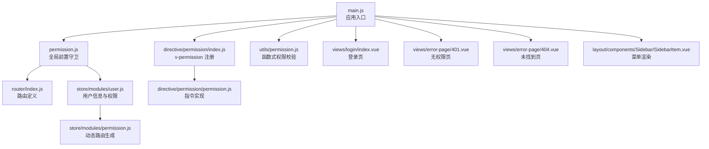
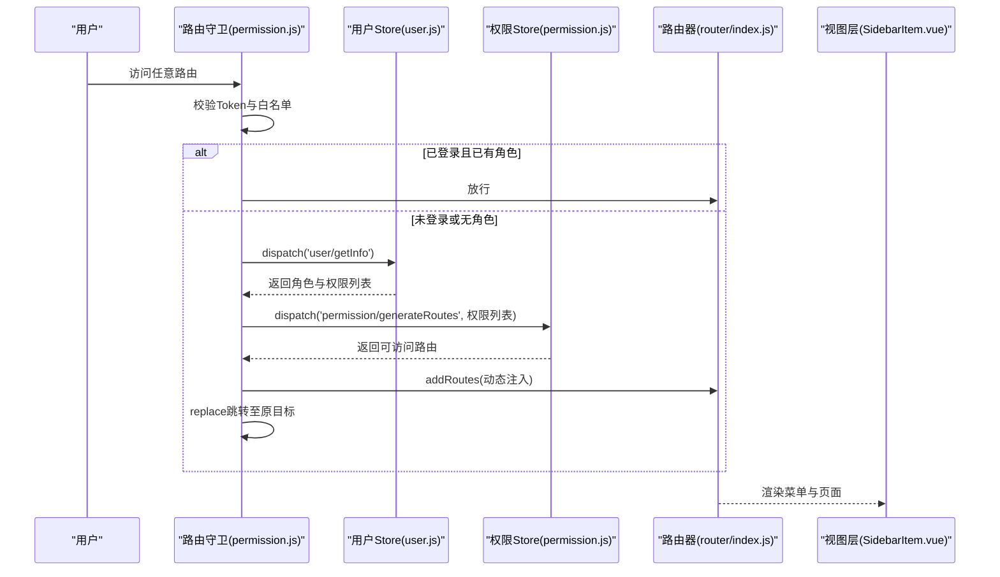
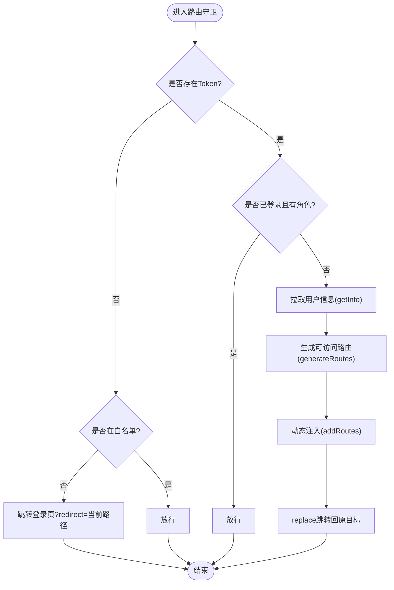
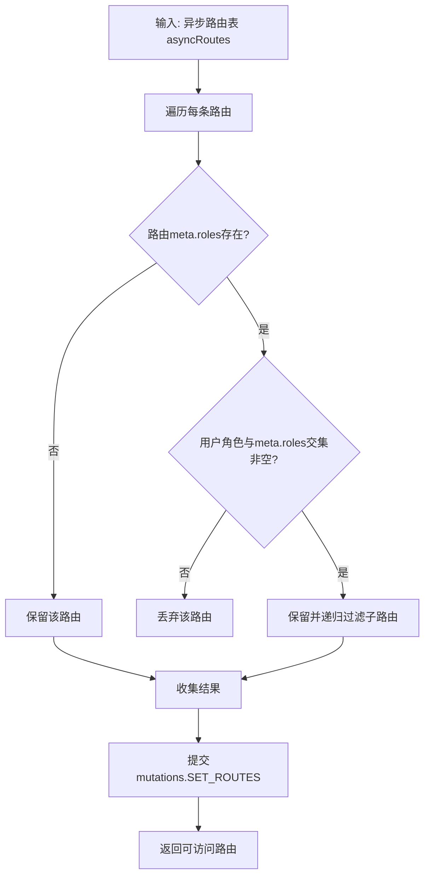
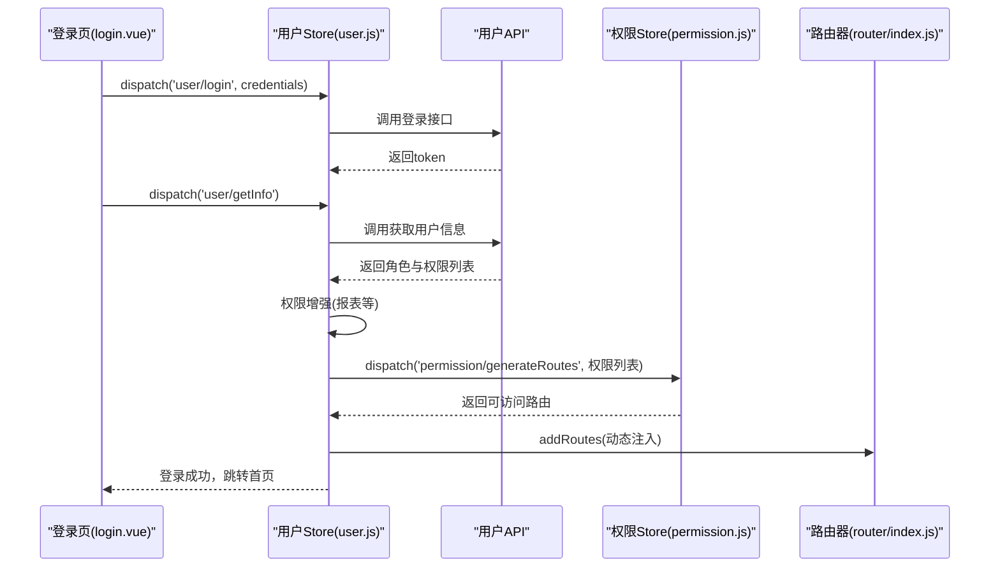
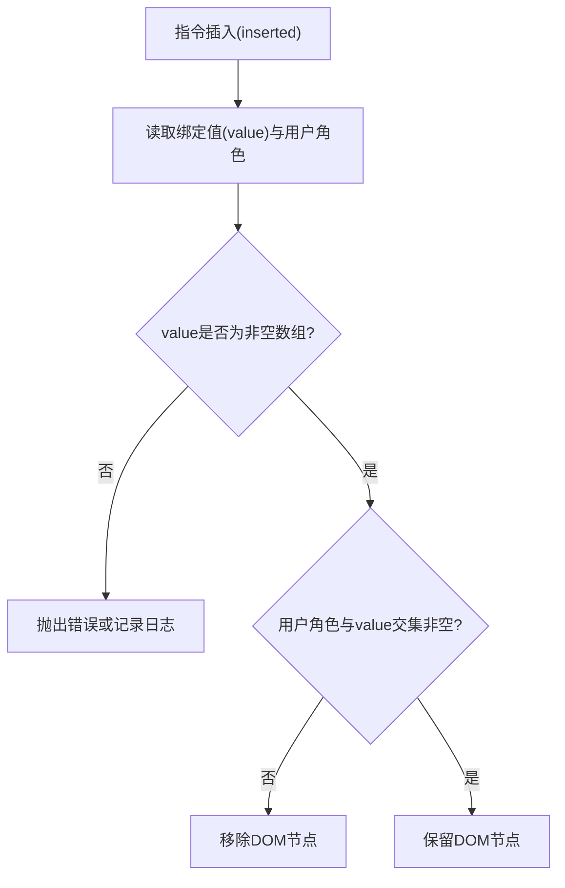
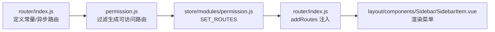
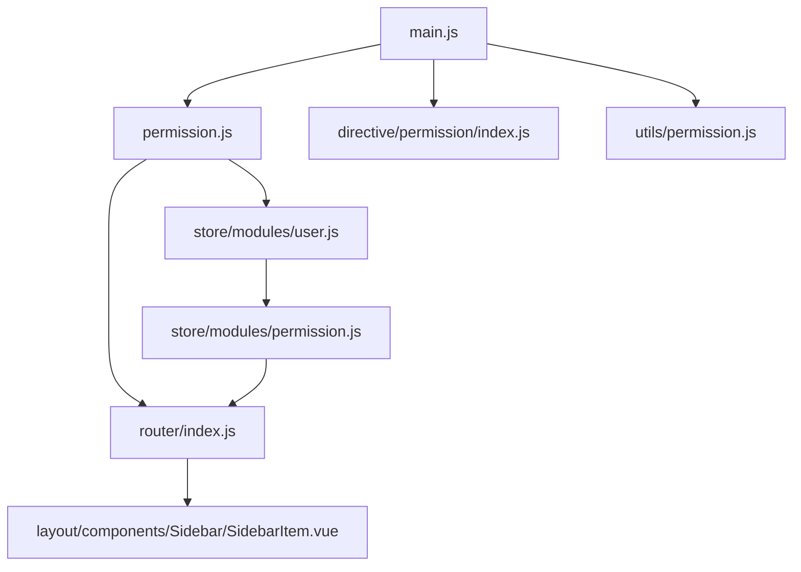

# 权限控制

<cite>
**本文引用的文件**
- [src/permission.js](file://src/permission.js)
- [src/router/index.js](file://src/router/index.js)
- [src/store/modules/permission.js](file://src/store/modules/permission.js)
- [src/store/modules/user.js](file://src/store/modules/user.js)
- [src/utils/permission.js](file://src/utils/permission.js)
- [src/directive/permission/permission.js](file://src/directive/permission/permission.js)
- [src/directive/permission/index.js](file://src/directive/permission/index.js)
- [src/main.js](file://src/main.js)
- [src/views/login/index.vue](file://src/views/login/index.vue)
- [src/views/error-page/401.vue](file://src/views/error-page/401.vue)
- [src/views/error-page/404.vue](file://src/views/error-page/404.vue)
- [src/layout/components/Sidebar/SidebarItem.vue](file://src/layout/components/Sidebar/SidebarItem.vue)
- [mock/role/routes.js](file://mock/role/routes.js)
- [mock/role/index.js](file://mock/role/index.js)
</cite>

## 目录
1. [简介](#简介)
2. [项目结构](#项目结构)
3. [核心组件](#核心组件)
4. [架构总览](#架构总览)
5. [详细组件分析](#详细组件分析)
6. [依赖关系分析](#依赖关系分析)
7. [性能考量](#性能考量)
8. [故障排查指南](#故障排查指南)
9. [结论](#结论)
10. [附录](#附录)

## 简介
本文件面向 Leisu Admin 项目的权限控制体系，围绕“基于角色的权限控制（RBAC）”展开，覆盖以下主题：
- 登录状态验证与白名单机制
- 角色与权限判断逻辑
- 菜单与路由的动态生成与显示控制
- 全局前置守卫的实现与执行流程
- 权限数据的获取、存储与缓存策略
- 权限指令与按钮级权限控制
- 配置示例与调试方法

## 项目结构
权限相关的关键文件分布如下：
- 路由与菜单：src/router/index.js 定义常量路由与异步路由；各业务模块路由在 children 下组织
- 权限守卫：src/permission.js 实现全局前置守卫
- 权限状态：src/store/modules/permission.js 管理可访问路由集合；src/store/modules/user.js 维护用户角色与权限列表
- 指令与工具：src/directive/permission/ 提供 v-permission 指令；src/utils/permission.js 提供函数式权限校验
- 登录与错误页：src/views/login/index.vue；401/404 错误页
- 主入口：src/main.js 引入权限守卫与全局指令

图表来源
- [src/main.js:1-526](file://src/main.js#L1-L526)
- [src/permission.js:1-82](file://src/permission.js#L1-L82)
- [src/router/index.js:1-177](file://src/router/index.js#L1-L177)
- [src/store/modules/user.js:1-542](file://src/store/modules/user.js#L1-L542)
- [src/store/modules/permission.js:1-66](file://src/store/modules/permission.js#L1-L66)
- [src/directive/permission/index.js:1-14](file://src/directive/permission/index.js#L1-L14)
- [src/directive/permission/permission.js:1-23](file://src/directive/permission/permission.js#L1-L23)
- [src/utils/permission.js:1-26](file://src/utils/permission.js#L1-L26)
- [src/views/login/index.vue:1-263](file://src/views/login/index.vue#L1-L263)
- [src/views/error-page/401.vue:1-100](file://src/views/error-page/401.vue#L1-L100)
- [src/views/error-page/404.vue:1-229](file://src/views/error-page/404.vue#L1-L229)
- [src/layout/components/Sidebar/SidebarItem.vue:1-206](file://src/layout/components/Sidebar/SidebarItem.vue#L1-L206)

章节来源
- [src/main.js:1-526](file://src/main.js#L1-L526)
- [src/router/index.js:1-177](file://src/router/index.js#L1-L177)

## 核心组件
- 全局前置守卫（路由守卫）
  - 负责登录态校验、白名单放行、权限角色拉取、动态路由注入与替换跳转
  - 关键实现：[src/permission.js:13-76](file://src/permission.js#L13-L76)
- 动态路由与权限过滤
  - 基于用户角色过滤异步路由表，生成可访问路由并注入到路由器
  - 关键实现：[src/store/modules/permission.js:8-57](file://src/store/modules/permission.js#L8-L57)
- 用户权限与信息
  - 登录成功后拉取用户信息，解析角色与权限列表，并做权限增强（如报表权限聚合）
  - 关键实现：[src/store/modules/user.js:173-335](file://src/store/modules/user.js#L173-L335)
- 权限指令与函数式校验
  - v-permission 指令用于 DOM 层面的元素显隐控制；函数式校验用于逻辑分支判断
  - 关键实现：[src/directive/permission/permission.js:1-23](file://src/directive/permission/permission.js#L1-L23)，[src/utils/permission.js:1-26](file://src/utils/permission.js#L1-L26)
- 登录页与错误页
  - 登录页触发用户登录动作；401/404 用于无权限或路由不存在场景
  - 关键实现：[src/views/login/index.vue:103-120](file://src/views/login/index.vue#L103-L120)，[src/views/error-page/401.vue:1-100](file://src/views/error-page/401.vue#L1-L100)，[src/views/error-page/404.vue:1-229](file://src/views/error-page/404.vue#L1-L229)

章节来源
- [src/permission.js:13-76](file://src/permission.js#L13-L76)
- [src/store/modules/permission.js:8-57](file://src/store/modules/permission.js#L8-L57)
- [src/store/modules/user.js:173-335](file://src/store/modules/user.js#L173-L335)
- [src/directive/permission/permission.js:1-23](file://src/directive/permission/permission.js#L1-L23)
- [src/utils/permission.js:1-26](file://src/utils/permission.js#L1-L26)
- [src/views/login/index.vue:103-120](file://src/views/login/index.vue#L103-L120)
- [src/views/error-page/401.vue:1-100](file://src/views/error-page/401.vue#L1-L100)
- [src/views/error-page/404.vue:1-229](file://src/views/error-page/404.vue#L1-L229)

## 架构总览
下图展示从用户访问到路由渲染、菜单生成与权限控制的整体流程。

图表来源
- [src/permission.js:13-76](file://src/permission.js#L13-L76)
- [src/store/modules/user.js:173-335](file://src/store/modules/user.js#L173-L335)
- [src/store/modules/permission.js:49-57](file://src/store/modules/permission.js#L49-L57)
- [src/router/index.js:162-176](file://src/router/index.js#L162-L176)
- [src/layout/components/Sidebar/SidebarItem.vue:1-206](file://src/layout/components/Sidebar/SidebarItem.vue#L1-L206)

## 详细组件分析

### 路由守卫与登录态验证
- 白名单：包含登录与授权回调等无需鉴权的路径
- 登录态：通过工具读取 Token 判断是否已登录
- 已登录但无角色：拉取用户信息，生成可访问路由并注入，随后 replace 跳转回原目标
- 未登录：跳转登录页并携带 redirect 参数
- 进度条与标题：每次导航开始启动进度条，结束时完成

图表来源
- [src/permission.js:13-76](file://src/permission.js#L13-L76)

章节来源
- [src/permission.js:11-76](file://src/permission.js#L11-L76)

### 动态路由与权限过滤
- 过滤规则：若路由 meta.roles 存在，则要求用户角色集合与其交集非空才允许访问
- 递归过滤：支持多级子路由的逐层过滤
- 结果合并：将常量路由与动态路由合并，形成最终路由表

图表来源
- [src/store/modules/permission.js:8-57](file://src/store/modules/permission.js#L8-L57)

章节来源
- [src/store/modules/permission.js:8-57](file://src/store/modules/permission.js#L8-L57)

### 用户权限信息与权限增强
- 登录成功后调用获取用户信息接口，解析角色与权限列表
- 权限增强：根据特定权限组合自动补充报表类权限，确保功能可用性
- 其他初始化：拉取商品、渠道、标签等数据并写入本地缓存

图表来源
- [src/views/login/index.vue:103-120](file://src/views/login/index.vue#L103-L120)
- [src/store/modules/user.js:173-335](file://src/store/modules/user.js#L173-L335)
- [src/store/modules/permission.js:49-57](file://src/store/modules/permission.js#L49-L57)
- [src/router/index.js:162-176](file://src/router/index.js#L162-L176)

章节来源
- [src/views/login/index.vue:103-120](file://src/views/login/index.vue#L103-L120)
- [src/store/modules/user.js:173-335](file://src/store/modules/user.js#L173-L335)

### 权限指令与按钮级控制
- v-permission 指令：在 DOM 层面根据用户角色决定元素是否渲染
- 函数式校验：在逻辑层使用工具函数进行权限判断，避免直接依赖 DOM

图表来源
- [src/directive/permission/permission.js:1-23](file://src/directive/permission/permission.js#L1-L23)
- [src/utils/permission.js:1-26](file://src/utils/permission.js#L1-L26)

章节来源
- [src/directive/permission/permission.js:1-23](file://src/directive/permission/permission.js#L1-L23)
- [src/utils/permission.js:1-26](file://src/utils/permission.js#L1-L26)

### 菜单与路由的关联
- 路由定义：常量路由与异步路由在 router/index.js 中声明
- 菜单渲染：SidebarItem.vue 根据路由元信息渲染菜单项与子菜单
- 权限控制：通过权限过滤后的路由决定菜单是否显示

图表来源
- [src/router/index.js:31-160](file://src/router/index.js#L31-L160)
- [src/store/modules/permission.js:42-47](file://src/store/modules/permission.js#L42-L47)
- [src/permission.js:47-54](file://src/permission.js#L47-L54)
- [src/layout/components/Sidebar/SidebarItem.vue:1-206](file://src/layout/components/Sidebar/SidebarItem.vue#L1-L206)

章节来源
- [src/router/index.js:31-160](file://src/router/index.js#L31-L160)
- [src/layout/components/Sidebar/SidebarItem.vue:1-206](file://src/layout/components/Sidebar/SidebarItem.vue#L1-L206)

### 权限数据的获取、存储与缓存策略
- 获取：登录后调用获取用户信息接口，解析角色与权限列表
- 存储：Vuex 状态管理中保存 token、角色、权限列表等
- 缓存：部分数据写入 localStorage（如分类、标签、渠道等），减少重复请求
- 重置：退出登录时清空 token、角色并重置路由

章节来源
- [src/store/modules/user.js:173-335](file://src/store/modules/user.js#L173-L335)
- [src/store/modules/user.js:339-358](file://src/store/modules/user.js#L339-L358)

### 权限控制的执行流程（登录验证、权限检查、路由跳转、错误处理）
- 登录验证：登录页触发登录动作，成功后写入 token 并跳转首页
- 权限检查：路由守卫检查 Token 与角色；若无角色则拉取用户信息并生成路由
- 路由跳转：动态注入后 replace 回原目标；白名单直接放行
- 错误处理：异常时重置 token 并提示错误，跳转登录页

章节来源
- [src/views/login/index.vue:103-120](file://src/views/login/index.vue#L103-L120)
- [src/permission.js:13-76](file://src/permission.js#L13-L76)
- [src/views/error-page/401.vue:1-100](file://src/views/error-page/401.vue#L1-L100)
- [src/views/error-page/404.vue:1-229](file://src/views/error-page/404.vue#L1-L229)

### 权限与菜单的关联、动态菜单生成与显示控制
- 路由元信息：菜单标题、图标、角色白名单等由路由 meta 字段定义
- 动态生成：根据用户权限过滤异步路由，注入路由器
- 显示控制：菜单组件依据过滤后的路由渲染，未通过权限的角色不会看到对应菜单项

章节来源
- [src/router/index.js:74-160](file://src/router/index.js#L74-L160)
- [src/store/modules/permission.js:8-57](file://src/store/modules/permission.js#L8-L57)
- [src/layout/components/Sidebar/SidebarItem.vue:1-206](file://src/layout/components/Sidebar/SidebarItem.vue#L1-L206)

### 配置示例与调试方法
- 路由元信息示例（角色白名单）
  - 参考：[mock/role/routes.js:75-114](file://mock/role/routes.js#L75-L114)
- v-permission 指令使用
  - 示例：在模板中使用 v-permission="['admin','editor']" 控制元素显隐
  - 实现参考：[src/directive/permission/permission.js:1-23](file://src/directive/permission/permission.js#L1-L23)
- 函数式权限校验
  - 示例：在逻辑中调用工具函数进行权限判断
  - 实现参考：[src/utils/permission.js:1-26](file://src/utils/permission.js#L1-L26)
- 登录页调试
  - 登录成功后会携带 redirect 参数跳转首页，便于测试权限拦截与放行
  - 实现参考：[src/views/login/index.vue:103-120](file://src/views/login/index.vue#L103-L120)
- 权限过滤调试
  - 在浏览器控制台查看 Vuex 状态中的 roles 与 addRoutes，确认过滤结果
  - 实现参考：[src/store/modules/permission.js:42-47](file://src/store/modules/permission.js#L42-L47)

章节来源
- [mock/role/routes.js:75-114](file://mock/role/routes.js#L75-L114)
- [src/directive/permission/permission.js:1-23](file://src/directive/permission/permission.js#L1-L23)
- [src/utils/permission.js:1-26](file://src/utils/permission.js#L1-L26)
- [src/views/login/index.vue:103-120](file://src/views/login/index.vue#L103-L120)
- [src/store/modules/permission.js:42-47](file://src/store/modules/permission.js#L42-L47)

## 依赖关系分析
- main.js 引入权限守卫与全局指令，确保应用启动即启用权限控制
- permission.js 依赖 router、store、auth 工具与进度条库
- user.js 依赖 API 与路由重置能力，负责权限数据拉取与增强
- permission.js 依赖 asyncRoutes 与用户角色，生成可访问路由
- SidebarItem.vue 依赖路由元信息渲染菜单

图表来源
- [src/main.js:1-526](file://src/main.js#L1-L526)
- [src/permission.js:1-82](file://src/permission.js#L1-L82)
- [src/store/modules/user.js:1-542](file://src/store/modules/user.js#L1-L542)
- [src/store/modules/permission.js:1-66](file://src/store/modules/permission.js#L1-L66)
- [src/router/index.js:1-177](file://src/router/index.js#L1-L177)
- [src/layout/components/Sidebar/SidebarItem.vue:1-206](file://src/layout/components/Sidebar/SidebarItem.vue#L1-L206)

章节来源
- [src/main.js:1-526](file://src/main.js#L1-L526)
- [src/permission.js:1-82](file://src/permission.js#L1-L82)
- [src/store/modules/user.js:1-542](file://src/store/modules/user.js#L1-L542)
- [src/store/modules/permission.js:1-66](file://src/store/modules/permission.js#L1-L66)
- [src/router/index.js:1-177](file://src/router/index.js#L1-L177)
- [src/layout/components/Sidebar/SidebarItem.vue:1-206](file://src/layout/components/Sidebar/SidebarItem.vue#L1-L206)

## 性能考量
- 动态路由注入：仅在首次获取用户信息后执行一次，避免重复注入
- 菜单渲染：通过权限过滤后的路由渲染，减少不必要的 DOM 节点
- 缓存策略：将常用数据写入 localStorage，降低重复请求开销
- 进度条：在导航开始时启动，结束时完成，避免阻塞用户交互

## 故障排查指南
- 登录后仍被重定向到登录页
  - 检查 Token 是否正确写入与读取
  - 确认白名单路径是否包含当前路径
  - 参考：[src/permission.js:11-12](file://src/permission.js#L11-L12)
- 无法访问某些页面或菜单
  - 检查用户角色与路由 meta.roles 的交集
  - 确认权限增强逻辑是否生效
  - 参考：[src/store/modules/permission.js:8-14](file://src/store/modules/permission.js#L8-L14)，[src/store/modules/user.js:232-250](file://src/store/modules/user.js#L232-L250)
- 按钮不显示
  - 检查 v-permission 的绑定值是否正确
  - 参考：[src/directive/permission/permission.js:8-20](file://src/directive/permission/permission.js#L8-L20)
- 401/404 页面出现
  - 401：无权限访问；404：路由不存在
  - 参考：[src/views/error-page/401.vue:1-100](file://src/views/error-page/401.vue#L1-L100)，[src/views/error-page/404.vue:1-229](file://src/views/error-page/404.vue#L1-L229)

章节来源
- [src/permission.js:11-12](file://src/permission.js#L11-L12)
- [src/store/modules/permission.js:8-14](file://src/store/modules/permission.js#L8-L14)
- [src/store/modules/user.js:232-250](file://src/store/modules/user.js#L232-L250)
- [src/directive/permission/permission.js:8-20](file://src/directive/permission/permission.js#L8-L20)
- [src/views/error-page/401.vue:1-100](file://src/views/error-page/401.vue#L1-L100)
- [src/views/error-page/404.vue:1-229](file://src/views/error-page/404.vue#L1-L229)

## 结论
Leisu Admin 的权限控制以“路由守卫 + 动态路由 + 权限指令”为核心，结合 Vuex 状态管理与本地缓存，实现了从登录态校验到菜单渲染的全链路权限控制。通过 meta.roles 与用户角色的交集判断，既能保证页面级访问控制，也能在 DOM 层面实现细粒度的按钮级权限。建议在开发过程中：
- 严格维护路由 meta.roles 与权限列表
- 对权限增强逻辑进行单元测试
- 使用 v-permission 与函数式校验相结合，确保逻辑与视图一致
- 借助 mock 数据与控制台调试快速定位问题

## 附录
- 路由与菜单
  - 常量路由与异步路由定义：[src/router/index.js:31-160](file://src/router/index.js#L31-L160)
  - 菜单渲染组件：[src/layout/components/Sidebar/SidebarItem.vue:1-206](file://src/layout/components/Sidebar/SidebarItem.vue#L1-L206)
- 权限过滤与注入
  - 权限过滤函数：[src/store/modules/permission.js:8-35](file://src/store/modules/permission.js#L8-L35)
  - 动态注入路由：[src/store/modules/permission.js:49-57](file://src/store/modules/permission.js#L49-L57)
  - 守卫注入：[src/permission.js:47-54](file://src/permission.js#L47-L54)
- 登录与错误页
  - 登录页：[src/views/login/index.vue:103-120](file://src/views/login/index.vue#L103-L120)
  - 401/404：[src/views/error-page/401.vue:1-100](file://src/views/error-page/401.vue#L1-L100)，[src/views/error-page/404.vue:1-229](file://src/views/error-page/404.vue#L1-L229)
- 指令与工具
  - v-permission 注册：[src/directive/permission/index.js:1-14](file://src/directive/permission/index.js#L1-L14)
  - 指令实现：[src/directive/permission/permission.js:1-23](file://src/directive/permission/permission.js#L1-L23)
  - 函数式校验：[src/utils/permission.js:1-26](file://src/utils/permission.js#L1-L26)
- 主入口
  - 权限守卫与全局指令引入：[src/main.js:23-24](file://src/main.js#L23-L24)，[src/main.js:492-497](file://src/main.js#L492-L497)