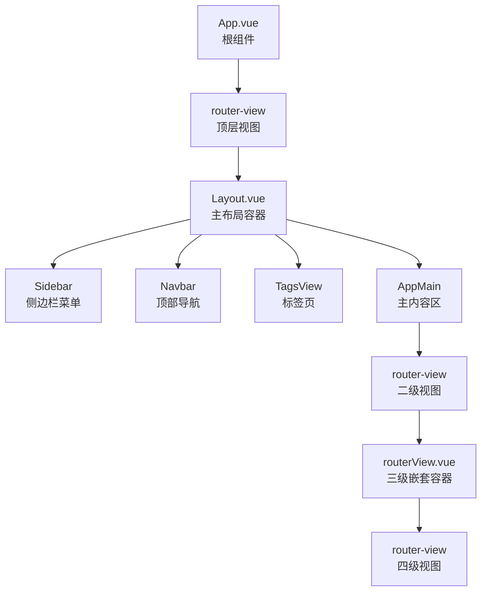
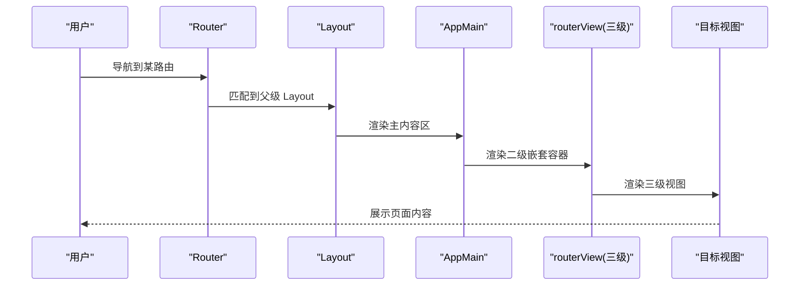
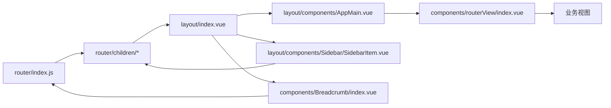

# 路由嵌套

<cite>
**本文引用的文件**
- [src/router/index.js](file://src/router/index.js)
- [src/router/children/member.js](file://src/router/children/member.js)
- [src/router/children/match/index.js](file://src/router/children/match/index.js)
- [src/router/children/match/children/analysis.js](file://src/router/children/match/children/analysis.js)
- [src/router/children/match/children/ball/football.js](file://src/router/children/match/children/ball/football.js)
- [src/layout/index.vue](file://src/layout/index.vue)
- [src/layout/components/AppMain.vue](file://src/layout/components/AppMain.vue)
- [src/layout/components/Sidebar/SidebarItem.vue](file://src/layout/components/Sidebar/SidebarItem.vue)
- [src/components/Breadcrumb/index.vue](file://src/components/Breadcrumb/index.vue)
- [src/components/routerView/index.vue](file://src/components/routerView/index.vue)
- [src/App.vue](file://src/App.vue)
- [src/main.js](file://src/main.js)
</cite>

## 目录
1. [简介](#简介)
2. [项目结构](#项目结构)
3. [核心组件](#核心组件)
4. [架构总览](#架构总览)
5. [详细组件分析](#详细组件分析)
6. [依赖关系分析](#依赖关系分析)
7. [性能考量](#性能考量)
8. [故障排查指南](#故障排查指南)
9. [结论](#结论)
10. [附录](#附录)

## 简介
本文件围绕 Leisu Admin 的 Vue Router 嵌套路由机制展开，系统性阐述父子路由关系、嵌套视图渲染、Layout 布局与侧边栏/面包屑的协同工作方式，并结合项目中 routerView 的三级嵌套支持，给出配置要点、使用场景与最佳实践，帮助开发者构建清晰、可维护的路由结构。

## 项目结构
- 路由入口与常量/异步路由定义集中在 src/router/index.js 中。
- 各业务模块的子路由拆分为独立文件，位于 src/router/children 下，便于模块化管理。
- 布局层通过 Layout 组件包裹，内部包含侧边栏、顶部导航、标签页、主内容区等。
- 主内容区 AppMain 使用 keep-alive 包裹 router-view，实现页面缓存与过渡动画。
- 侧边栏菜单 SidebarItem 递归渲染，支持多级嵌套菜单。
- 面包屑 Breadcrumb 基于 $route.matched 生成层级标题。
- routerView 组件提供三级嵌套所需的 router-view 容器。

图表来源
- [src/App.vue:1-18](file://src/App.vue#L1-L18)
- [src/layout/index.vue:1-124](file://src/layout/index.vue#L1-L124)
- [src/layout/components/AppMain.vue:1-122](file://src/layout/components/AppMain.vue#L1-L122)
- [src/components/routerView/index.vue:1-13](file://src/components/routerView/index.vue#L1-L13)

章节来源
- [src/router/index.js:31-160](file://src/router/index.js#L31-L160)
- [src/layout/index.vue:1-124](file://src/layout/index.vue#L1-L124)
- [src/layout/components/AppMain.vue:1-122](file://src/layout/components/AppMain.vue#L1-L122)
- [src/components/routerView/index.vue:1-13](file://src/components/routerView/index.vue#L1-L13)

## 核心组件
- 路由入口与模块化子路由
  - 入口文件集中定义常量路由与异步路由，将各模块子路由以独立文件导入并挂载到根路由下，形成清晰的模块边界。
- Layout 布局
  - 作为所有业务路由的父级容器，负责侧边栏、顶部导航、标签页与主内容区的整体布局。
- AppMain 主内容区
  - 使用 keep-alive 缓存已访问页面，配合路由 key 实现切换动画；支持 iframe 场景注入。
- SidebarItem 侧边栏菜单
  - 递归渲染，支持单子项自动展开、多子项下拉菜单、以及“收藏”功能。
- Breadcrumb 面包屑
  - 基于 $route.matched 生成层级标题，支持最多三层的面包屑展示。
- routerView 三级嵌套容器
  - 在多级嵌套场景下提供额外的 router-view，确保深层视图正确渲染。

章节来源
- [src/router/index.js:31-160](file://src/router/index.js#L31-L160)
- [src/layout/index.vue:1-124](file://src/layout/index.vue#L1-L124)
- [src/layout/components/AppMain.vue:1-122](file://src/layout/components/AppMain.vue#L1-L122)
- [src/layout/components/Sidebar/SidebarItem.vue:1-206](file://src/layout/components/Sidebar/SidebarItem.vue#L1-L206)
- [src/components/Breadcrumb/index.vue:1-85](file://src/components/Breadcrumb/index.vue#L1-L85)
- [src/components/routerView/index.vue:1-13](file://src/components/routerView/index.vue#L1-L13)

## 架构总览
下图展示了从 App.vue 到 Layout、再到主内容区与多级嵌套视图的渲染流程，体现典型的嵌套路由结构与视图切换机制。

图表来源
- [src/App.vue:1-18](file://src/App.vue#L1-L18)
- [src/layout/index.vue:1-124](file://src/layout/index.vue#L1-L124)
- [src/layout/components/AppMain.vue:1-122](file://src/layout/components/AppMain.vue#L1-L122)
- [src/components/routerView/index.vue:1-13](file://src/components/routerView/index.vue#L1-L13)

## 详细组件分析

### 嵌套路由与父子关系
- 父路由与子路由
  - 父路由通常指向 Layout，子路由在父路由的 children 中定义，每个子路由对应一个业务模块或页面集合。
  - 子路由可进一步包含自己的 children，形成多级嵌套。
- 重定向与默认页
  - 父路由可设置 redirect，将访问父路径时重定向到某个子路由，默认展示该子路由页面。
- 路由元信息
  - 通过 meta 字段定义标题、图标、权限角色、是否缓存等属性，用于菜单渲染与页面控制。

章节来源
- [src/router/index.js:74-160](file://src/router/index.js#L74-L160)
- [src/router/children/member.js:131-165](file://src/router/children/member.js#L131-L165)
- [src/router/children/match/index.js:80-277](file://src/router/children/match/index.js#L80-L277)

### 嵌套视图与 routerView
- 顶层 router-view
  - 在 App.vue 中，顶层 router-view 承载所有路由匹配到的组件。
- 二级 router-view
  - 在 Layout 中，AppMain 作为主内容区承载二级 router-view，用于渲染模块级页面。
- 三级 routerView
  - 在某些复杂模块中，routerView 组件提供额外的 router-view，满足更深层次的嵌套视图渲染需求。
- 视图切换与缓存
  - AppMain 使用 keep-alive 包裹 router-view，结合路由 key 实现切换动画与缓存；meta 中的 iframe 可用于特殊场景的外链展示。

章节来源
- [src/App.vue:1-18](file://src/App.vue#L1-L18)
- [src/layout/index.vue:1-124](file://src/layout/index.vue#L1-L124)
- [src/layout/components/AppMain.vue:1-122](file://src/layout/components/AppMain.vue#L1-L122)
- [src/components/routerView/index.vue:1-13](file://src/components/routerView/index.vue#L1-L13)

### Layout 布局与侧边栏菜单
- Layout 布局
  - 包含侧边栏、顶部导航、标签页与主内容区，整体采用响应式布局，支持移动端与桌面端。
- 侧边栏菜单
  - SidebarItem 递归渲染，支持单子项自动展开、多子项下拉菜单、图标与标题显示。
  - 支持“收藏”功能，将常用菜单保存至本地存储，并通过状态同步更新。
- 面包屑导航
  - Breadcrumb 基于 $route.matched 生成层级标题，最多展示三层，避免过长的面包屑链路。

章节来源
- [src/layout/index.vue:1-124](file://src/layout/index.vue#L1-L124)
- [src/layout/components/Sidebar/SidebarItem.vue:1-206](file://src/layout/components/Sidebar/SidebarItem.vue#L1-L206)
- [src/components/Breadcrumb/index.vue:1-85](file://src/components/Breadcrumb/index.vue#L1-L85)

### 路由配置示例与最佳实践
- 父路由设置
  - 父路由 component 指向 Layout，meta 中定义标题与图标，children 中挂载子路由。
- 子路由定义
  - 子路由 component 指向具体视图，name 与 path 唯一标识路由，meta 中定义标题与权限。
- 路由重定向
  - 父路由可设置 redirect，将访问父路径时重定向到某个子路由，保证默认展示。
- 三级嵌套
  - 在需要深层嵌套的模块中，使用 routerView 作为中间容器，确保深层视图正确渲染。
- 权限与缓存
  - 通过 meta.roles 控制菜单显示与页面访问；通过 meta.keepAlive 或 AppMain 的缓存策略控制页面缓存。

章节来源
- [src/router/index.js:74-160](file://src/router/index.js#L74-L160)
- [src/router/children/match/index.js:80-277](file://src/router/children/match/index.js#L80-L277)
- [src/router/children/match/children/analysis.js:12-20](file://src/router/children/match/children/analysis.js#L12-L20)
- [src/router/children/match/children/ball/football.js:128-159](file://src/router/children/match/children/ball/football.js#L128-L159)

## 依赖关系分析
- 路由与布局
  - App.vue -> Layout -> AppMain -> routerView -> 目标视图
- 菜单与路由
  - SidebarItem 读取路由配置，递归渲染菜单树，与路由 meta 对应。
- 面包屑与路由
  - Breadcrumb 基于 $route.matched 生成层级标题，与路由层级一一对应。

图表来源
- [src/router/index.js:31-160](file://src/router/index.js#L31-L160)
- [src/layout/index.vue:1-124](file://src/layout/index.vue#L1-L124)
- [src/layout/components/AppMain.vue:1-122](file://src/layout/components/AppMain.vue#L1-L122)
- [src/components/routerView/index.vue:1-13](file://src/components/routerView/index.vue#L1-L13)
- [src/layout/components/Sidebar/SidebarItem.vue:1-206](file://src/layout/components/Sidebar/SidebarItem.vue#L1-L206)
- [src/components/Breadcrumb/index.vue:1-85](file://src/components/Breadcrumb/index.vue#L1-L85)

章节来源
- [src/router/index.js:31-160](file://src/router/index.js#L31-L160)
- [src/layout/index.vue:1-124](file://src/layout/index.vue#L1-L124)
- [src/layout/components/AppMain.vue:1-122](file://src/layout/components/AppMain.vue#L1-L122)
- [src/components/routerView/index.vue:1-13](file://src/components/routerView/index.vue#L1-L13)
- [src/layout/components/Sidebar/SidebarItem.vue:1-206](file://src/layout/components/Sidebar/SidebarItem.vue#L1-L206)
- [src/components/Breadcrumb/index.vue:1-85](file://src/components/Breadcrumb/index.vue#L1-L85)

## 性能考量
- 页面缓存
  - AppMain 使用 keep-alive 缓存已访问页面，减少重复渲染开销；可通过 meta 控制是否缓存。
- 路由懒加载
  - 子路由组件采用动态导入，实现按需加载，降低首屏体积。
- 动画与过渡
  - AppMain 使用过渡动画提升页面切换体验，但需注意复杂动画对性能的影响。
- iframe 注入
  - 特殊场景下通过 meta.iframe 注入 iframe，需谨慎控制其生命周期与资源占用。

章节来源
- [src/layout/components/AppMain.vue:1-122](file://src/layout/components/AppMain.vue#L1-L122)
- [src/router/index.js:31-160](file://src/router/index.js#L31-L160)

## 故障排查指南
- 路由无法匹配
  - 检查父路由是否指向 Layout，子路由 path 是否正确拼接；确认 meta.title 与菜单一致。
- 嵌套视图不显示
  - 确认中间层是否使用 routerView 容器；检查 children 层级是否正确挂载。
- 面包屑不显示
  - 确认 $route.matched 中存在 meta.title 的路由层级；检查面包屑过滤逻辑。
- 侧边栏菜单不显示
  - 检查 meta.roles 是否包含当前用户角色；确认 SidebarItem 递归渲染逻辑。
- 页面缓存异常
  - 检查 AppMain 的 keep-alive include 与路由 key；确认 meta.keepAlive 设置。

章节来源
- [src/layout/components/Sidebar/SidebarItem.vue:1-206](file://src/layout/components/Sidebar/SidebarItem.vue#L1-L206)
- [src/components/Breadcrumb/index.vue:1-85](file://src/components/Breadcrumb/index.vue#L1-L85)
- [src/layout/components/AppMain.vue:1-122](file://src/layout/components/AppMain.vue#L1-L122)

## 结论
Leisu Admin 的路由体系通过父子路由与多级嵌套视图，实现了模块化页面结构与灵活的布局组合。Layout 作为统一容器，配合 Sidebar、TagsView、AppMain 与 routerView，形成了清晰的导航、菜单与视图渲染链路。通过 meta 控制权限、缓存与默认页，结合面包屑与侧边栏的联动，能够快速构建复杂而易维护的后台管理系统。

## 附录
- 常见使用场景
  - 模块化页面结构：将不同业务模块拆分为独立子路由文件，便于团队协作与维护。
  - 复杂页面布局：通过 Layout 与 AppMain 的组合，实现头部、侧边栏、主内容区的统一布局。
  - 多级菜单：利用 SidebarItem 的递归渲染，支持多级嵌套菜单与收藏功能。
- 最佳实践
  - 父路由统一指向 Layout，子路由明确命名与路径，meta 字段完整。
  - 合理使用 redirect 与默认页，确保用户首次访问即进入正确页面。
  - 在需要深层嵌套的模块中引入 routerView，保持视图层级清晰。
  - 通过 meta.roles 控制菜单与页面访问，结合 keep-alive 提升性能。

章节来源
- [src/router/index.js:74-160](file://src/router/index.js#L74-L160)
- [src/layout/index.vue:1-124](file://src/layout/index.vue#L1-L124)
- [src/layout/components/AppMain.vue:1-122](file://src/layout/components/AppMain.vue#L1-L122)
- [src/layout/components/Sidebar/SidebarItem.vue:1-206](file://src/layout/components/Sidebar/SidebarItem.vue#L1-L206)
- [src/components/Breadcrumb/index.vue:1-85](file://src/components/Breadcrumb/index.vue#L1-L85)
- [src/components/routerView/index.vue:1-13](file://src/components/routerView/index.vue#L1-L13)