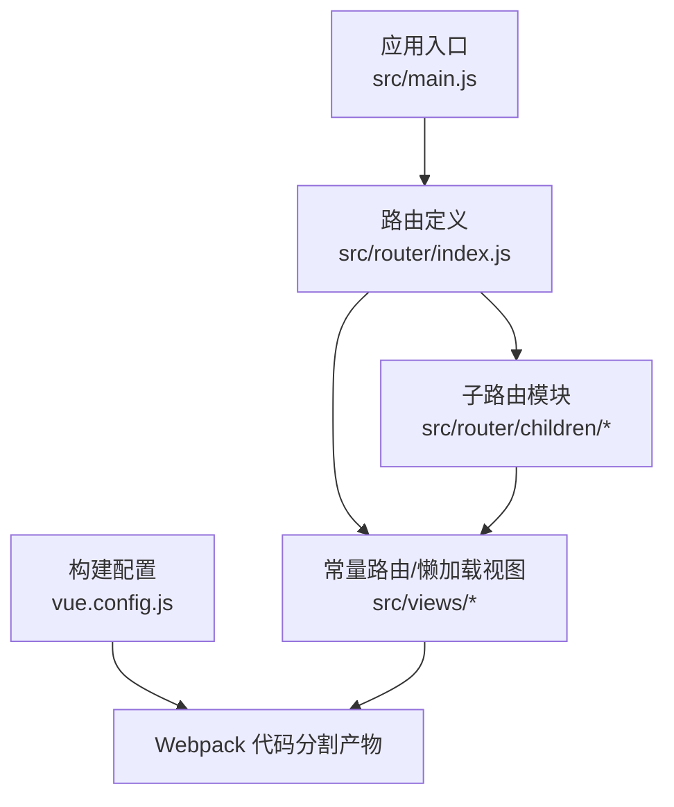
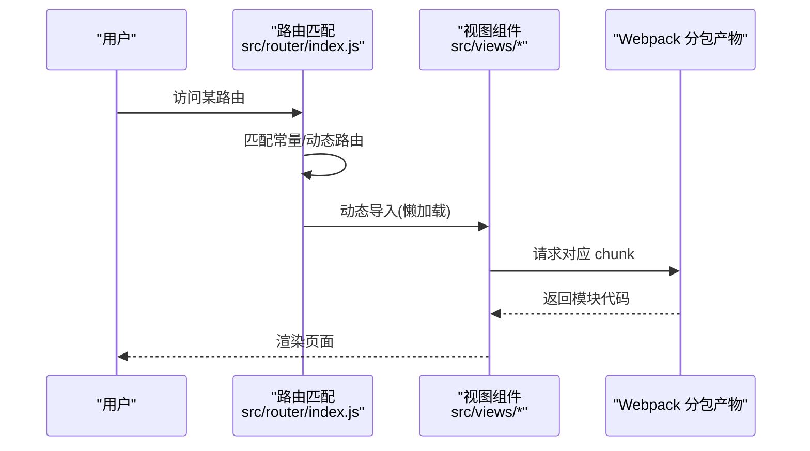
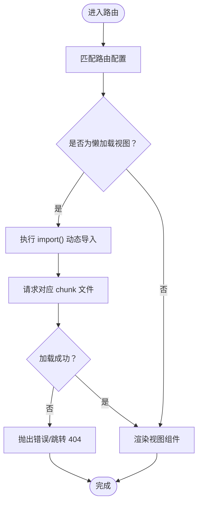
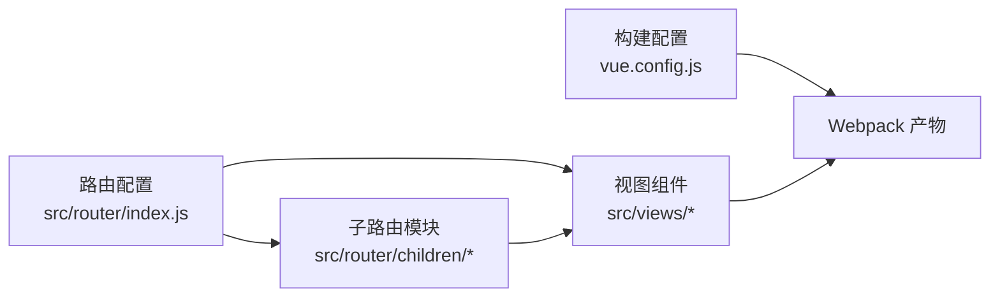

# 路由懒加载

<cite>
**本文引用的文件**   
- [src/router/index.js](file://src/router/index.js)
- [src/router/children/forum/index.js](file://src/router/children/forum/index.js)
- [src/router/children/match/index.js](file://src/router/children/match/index.js)
- [src/main.js](file://src/main.js)
- [vue.config.js](file://vue.config.js)
- [package.json](file://package.json)
- [src/views/login/ding_login.vue](file://src/views/login/ding_login.vue)
- [src/views/error-page/404.vue](file://src/views/error-page/404.vue)
- [src/views/sitemaps.vue](file://src/views/sitemaps.vue)
- [src/views/icons/index.vue](file://src/views/icons/index.vue)
</cite>

## 目录
1. [引言](#引言)
2. [项目结构](#项目结构)
3. [核心组件](#核心组件)
4. [架构总览](#架构总览)
5. [详细组件分析](#详细组件分析)
6. [依赖分析](#依赖分析)
7. [性能考量](#性能考量)
8. [故障排查指南](#故障排查指南)
9. [结论](#结论)
10. [附录](#附录)

## 引言
本篇文档围绕 Leisu Admin 项目的“路由懒加载”展开，系统阐述其概念、实现原理、配置方式与性能影响，并结合项目现有代码给出最佳实践与优化建议。读者无需深入前端打包机制即可理解如何在本项目中落地懒加载，以降低首屏体积、提升交互体验。

## 项目结构
Leisu Admin 使用 Vue 2 + vue-router 的传统单页应用架构，路由采用“常量路由 + 动态路由”的设计，配合 Webpack 的代码分割能力实现按需加载。项目关键位置如下：
- 路由入口与常量/动态路由定义：src/router/index.js
- 子路由模块（按业务域拆分）：src/router/children/*
- 视图组件（被懒加载的页面）：src/views/*
- 构建配置（含代码分割策略）：vue.config.js
- 应用入口（注册路由与全局组件）：src/main.js

图表来源
- [src/main.js:18-20](file://src/main.js#L18-L20)
- [src/router/index.js:31-160](file://src/router/index.js#L31-L160)
- [vue.config.js:115-152](file://vue.config.js#L115-L152)

章节来源
- [src/router/index.js:31-160](file://src/router/index.js#L31-L160)
- [vue.config.js:115-152](file://vue.config.js#L115-L152)

## 核心组件
- 路由定义与懒加载
  - 常量路由中的视图组件均通过动态导入实现懒加载，例如登录页、错误页、图标页等。
  - 动态路由（asyncRoutes）同样采用动态导入，按模块拆分为多个子路由文件。
- 子路由模块
  - 以业务域划分，如论坛、比赛、支付等，每个子路由文件内部也大量使用动态导入。
- 构建配置
  - 生产模式下启用 runtimeChunk 与 splitChunks，配合 import() 实现按需分包。
  - 删除了默认的 preload/prefetch 插件，避免预拉取造成带宽浪费。

章节来源
- [src/router/index.js:31-160](file://src/router/index.js#L31-L160)
- [src/router/children/forum/index.js:4-163](file://src/router/children/forum/index.js#L4-L163)
- [src/router/children/match/index.js:25-78](file://src/router/children/match/index.js#L25-L78)
- [vue.config.js:77-152](file://vue.config.js#L77-L152)

## 架构总览
下图展示从用户访问到页面渲染的关键流程，重点标注懒加载触发点与代码分割产物：

图表来源
- [src/router/index.js:39-66](file://src/router/index.js#L39-L66)
- [src/router/children/forum/index.js:7-13](file://src/router/children/forum/index.js#L7-L13)
- [vue.config.js:127-149](file://vue.config.js#L127-L149)

## 详细组件分析

### 路由懒加载实现概览
- 动态导入语法
  - 在路由配置中，视图组件通过箭头函数返回 import() 调用，实现按需加载。
  - 示例路径参考：[src/router/index.js:39-66](file://src/router/index.js#L39-L66)、[src/router/children/forum/index.js:7-13](file://src/router/children/forum/index.js#L7-L13)。
- 异步组件与代码分割
  - import() 返回 Promise，Webpack 将其标记为独立 chunk；生产构建时自动分包并命名。
  - 可通过注释指定 chunk 名称（如 webpackChunkName），便于调试与缓存控制。
  - 示例路径参考：[src/router/children/forum/index.js:66-68](file://src/router/children/forum/index.js#L66-L68)、[src/router/children/forum/index.js:135-141](file://src/router/children/forum/index.js#L135-L141)。

章节来源
- [src/router/index.js:39-66](file://src/router/index.js#L39-L66)
- [src/router/children/forum/index.js:7-13](file://src/router/children/forum/index.js#L7-L13)
- [src/router/children/forum/index.js:66-68](file://src/router/children/forum/index.js#L66-L68)
- [src/router/children/forum/index.js:135-141](file://src/router/children/forum/index.js#L135-L141)

### 路由级别懒加载
- 常量路由
  - 登录页、错误页、图标页等均采用动态导入，避免首屏引入无关模块。
  - 示例路径参考：[src/router/index.js:49-56](file://src/router/index.js#L49-L56)、[src/router/index.js:59-66](file://src/router/index.js#L59-L66)。
- 动态路由
  - 仪表盘、社区、比赛、支付等模块通过子路由文件集中管理，内部继续使用 import()。
  - 示例路径参考：[src/router/index.js:92-129](file://src/router/index.js#L92-L129)、[src/router/children/match/index.js:25-78](file://src/router/children/match/index.js#L25-L78)。

章节来源
- [src/router/index.js:49-56](file://src/router/index.js#L49-L56)
- [src/router/index.js:59-66](file://src/router/index.js#L59-L66)
- [src/router/index.js:92-129](file://src/router/index.js#L92-L129)
- [src/router/children/match/index.js:25-78](file://src/router/children/match/index.js#L25-L78)

### 组件级别懒加载
- 项目中存在大量全局组件注册，这些组件本身并非路由懒加载对象；但路由视图组件通过 import() 实现按需加载，间接降低了初始包体。
- 若未来需要对某些大型组件进行懒加载，可在路由视图内使用异步组件或在组件内部使用动态 import()。

章节来源
- [src/main.js:33-50](file://src/main.js#L33-L50)

### 第三方库懒加载
- 项目构建配置中已对部分运行时外部依赖进行 externals 处理，减少打包体积。
- 对于体量较大的第三方库，可在路由视图内按需动态引入，避免污染公共包。

章节来源
- [vue.config.js:31-35](file://vue.config.js#L31-L35)

### 代码分割策略与性能优化
- 生产模式下的分包策略
  - runtimeChunk: single，将运行时抽离为独立 chunk，利于浏览器缓存复用。
  - splitChunks：按需拆分第三方库、通用组件与业务模块，减少重复依赖。
- 预加载与预取
  - 默认删除了 preload/prefetch 插件，避免对低优先级资源进行预拉取，从而降低首屏竞争带宽。
- 缓存与命名
  - 通过 webpackChunkName 注释为关键路由分配稳定 chunk 名称，提升缓存命中率。

章节来源
- [vue.config.js:115-152](file://vue.config.js#L115-L152)
- [vue.config.js:127-149](file://vue.config.js#L127-L149)
- [src/router/children/forum/index.js:66-68](file://src/router/children/forum/index.js#L66-L68)
- [src/router/children/forum/index.js:135-141](file://src/router/children/forum/index.js#L135-L141)

### 懒加载流程图（算法实现）

图表来源
- [src/router/index.js:39-66](file://src/router/index.js#L39-L66)
- [src/router/children/forum/index.js:7-13](file://src/router/children/forum/index.js#L7-L13)
- [src/views/error-page/404.vue:1-32](file://src/views/error-page/404.vue#L1-L32)

## 依赖分析
- 路由与视图的耦合关系
  - 路由层仅负责声明懒加载，不直接依赖具体视图内容，降低耦合度。
- 构建期依赖
  - Webpack 通过 import() 识别代码分割点；vue.config.js 的 splitChunks/runtimeChunk 配置决定最终产物形态。
- 运行时依赖
  - 浏览器按需下载对应 chunk；若网络异常或路径错误，将触发 404 页面。

图表来源
- [src/router/index.js:31-160](file://src/router/index.js#L31-L160)
- [src/router/children/forum/index.js:4-163](file://src/router/children/forum/index.js#L4-L163)
- [vue.config.js:115-152](file://vue.config.js#L115-L152)

章节来源
- [src/router/index.js:31-160](file://src/router/index.js#L31-L160)
- [src/router/children/forum/index.js:4-163](file://src/router/children/forum/index.js#L4-L163)
- [vue.config.js:115-152](file://vue.config.js#L115-L152)

## 性能考量
- 首屏加载时间
  - 通过路由懒加载显著减少初始包体积，缩短首屏白屏时间。
- 内存占用
  - 按需加载意味着只在访问时加载模块，降低峰值内存占用。
- 用户体验
  - 关键页面（如登录页）采用懒加载，避免非关键功能阻塞主流程。
- 缓存与回源
  - runtimeChunk 与 splitChunks 有助于浏览器缓存命中，减少重复下载。

章节来源
- [vue.config.js:115-152](file://vue.config.js#L115-L152)
- [src/router/index.js:39-66](file://src/router/index.js#L39-L66)

## 故障排查指南
- 404 页面
  - 当懒加载的 chunk 无法找到或路径错误时，会跳转至 404 页面。可检查构建输出与路由路径一致性。
  - 参考路径：[src/router/index.js:59-66](file://src/router/index.js#L59-L66)、[src/views/error-page/404.vue:1-32](file://src/views/error-page/404.vue#L1-L32)。
- 登录页异常
  - 登录页采用动态导入，若网络问题导致加载失败，页面会提示错误。可检查网络与跨域配置。
  - 参考路径：[src/router/index.js:49-56](file://src/router/index.js#L49-L56)、[src/views/login/ding_login.vue:1-32](file://src/views/login/ding_login.vue#L1-L32)。
- 图标页空白
  - 图标页为静态展示，若出现空白，检查图标资源与样式是否正确加载。
  - 参考路径：[src/router/index.js:153-156](file://src/router/index.js#L153-L156)、[src/views/icons/index.vue:1-36](file://src/views/icons/index.vue#L1-L36)。

章节来源
- [src/router/index.js:49-56](file://src/router/index.js#L49-L56)
- [src/router/index.js:59-66](file://src/router/index.js#L59-L66)
- [src/views/error-page/404.vue:1-32](file://src/views/error-page/404.vue#L1-L32)
- [src/views/login/ding_login.vue:1-32](file://src/views/login/ding_login.vue#L1-L32)
- [src/router/index.js:153-156](file://src/router/index.js#L153-L156)
- [src/views/icons/index.vue:1-36](file://src/views/icons/index.vue#L1-L36)

## 结论
Leisu Admin 已在路由层广泛采用 import() 实现懒加载，并通过 vue.config.js 的分包策略进一步优化性能。建议在后续迭代中：
- 对体量较大且使用频率较低的视图继续采用懒加载；
- 合理命名 chunk，提升缓存命中；
- 避免过度拆分导致 chunk 数过多，影响并发与缓存收益；
- 对第三方库按需动态引入，减少公共包体积。

## 附录
- 配置示例与参考路径
  - 路由懒加载示例：[src/router/index.js:39-66](file://src/router/index.js#L39-L66)、[src/router/children/forum/index.js:7-13](file://src/router/children/forum/index.js#L7-L13)
  - 自定义 chunk 名称：[src/router/children/forum/index.js:66-68](file://src/router/children/forum/index.js#L66-L68)、[src/router/children/forum/index.js:135-141](file://src/router/children/forum/index.js#L135-L141)
  - 生产分包策略：[vue.config.js:127-149](file://vue.config.js#L127-L149)
  - 运行时抽离：[vue.config.js:150](file://vue.config.js#L150)
  - 删除预加载插件：[vue.config.js:77-79](file://vue.config.js#L77-L79)
- 最佳实践清单
  - 路由层统一使用 import() 懒加载；
  - 为关键路由指定稳定 chunk 名称；
  - 控制分包粒度，避免碎片化；
  - 对第三方库按需动态引入；
  - 结合服务端部署策略，确保 chunk 可被正确缓存与回源。