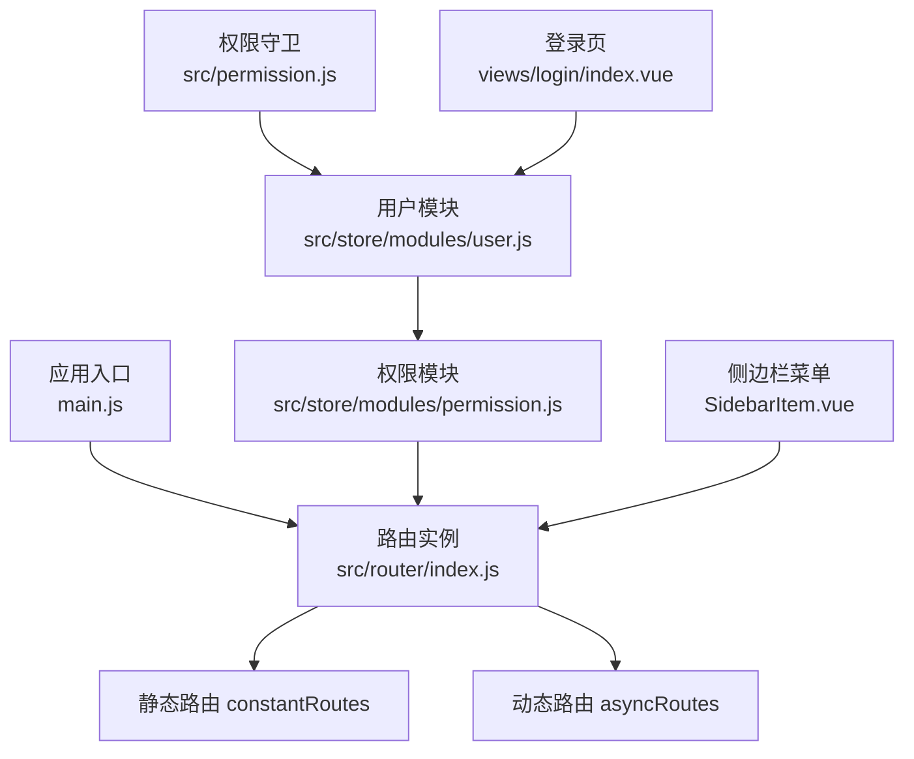
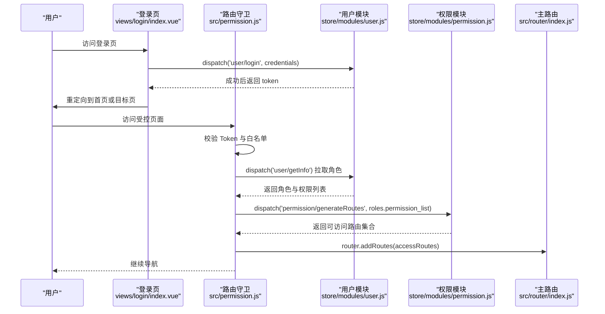
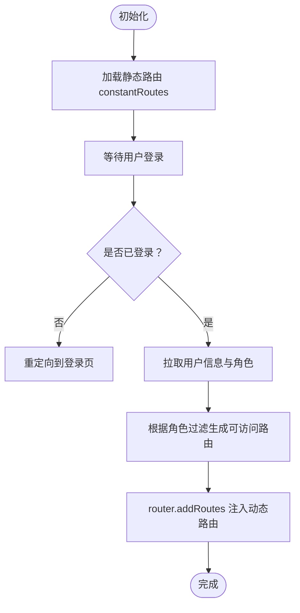
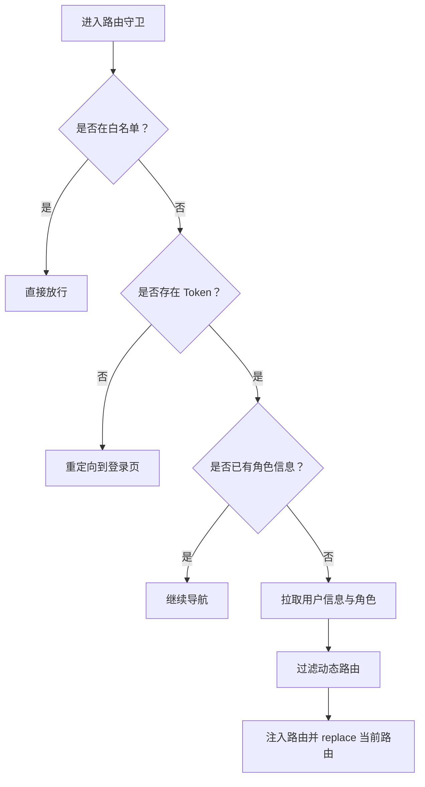
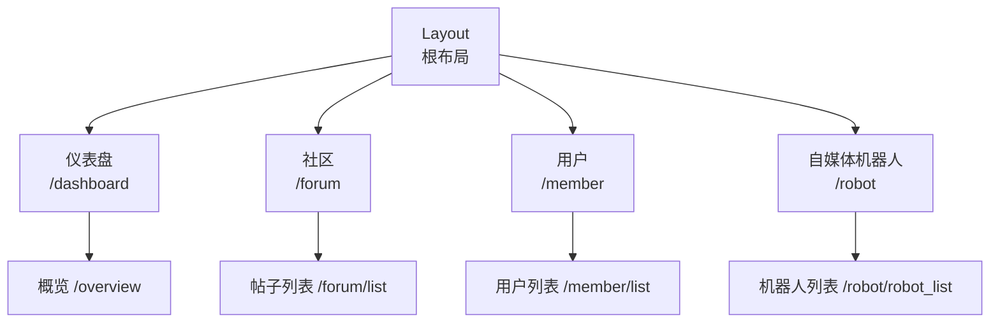
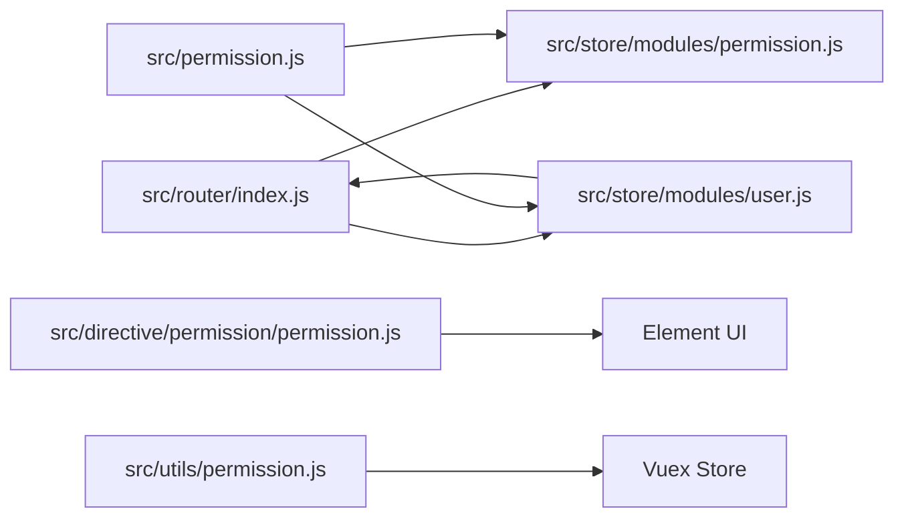

# 路由架构

<cite>
**本文引用的文件**
- [src/router/index.js](file://src/router/index.js)
- [src/permission.js](file://src/permission.js)
- [src/store/modules/permission.js](file://src/store/modules/permission.js)
- [src/store/modules/user.js](file://src/store/modules/user.js)
- [src/utils/permission.js](file://src/utils/permission.js)
- [src/directive/permission/permission.js](file://src/directive/permission/permission.js)
- [src/router/children/member.js](file://src/router/children/member.js)
- [src/router/children/forum/index.js](file://src/router/children/forum/index.js)
- [src/router/children/overview.js](file://src/router/children/overview.js)
- [src/router/children/robot.js](file://src/router/children/robot.js)
- [src/layout/components/Sidebar/SidebarItem.vue](file://src/layout/components/Sidebar/SidebarItem.vue)
- [src/layout/index.vue](file://src/layout/index.vue)
- [src/views/login/index.vue](file://src/views/login/index.vue)
- [package.json](file://package.json)
- [mock/role/routes.js](file://mock/role/routes.js)
</cite>

## 目录
1. [引言](#引言)
2. [项目结构](#项目结构)
3. [核心组件](#核心组件)
4. [架构总览](#架构总览)
5. [详细组件分析](#详细组件分析)
6. [依赖分析](#依赖分析)
7. [性能考虑](#性能考虑)
8. [故障排查指南](#故障排查指南)
9. [结论](#结论)
10. [附录](#附录)

## 引言
本文件面向 Leisu Admin 项目的前端路由体系，围绕 Vue Router 3.0.2 的设计与实现，系统性梳理静态路由与动态路由的配置方式、权限控制机制（基于角色的权限验证、导航守卫、动态菜单生成）、路由懒加载策略（组件按需加载、代码分割、性能优化）、路由嵌套结构（父子路由关系、嵌套路由实现、路由参数传递），并给出路由架构图与权限控制流程图，帮助开发者快速理解与维护该路由系统。

## 项目结构
- 路由入口与常量/异步路由定义：位于 src/router/index.js，包含 constantRoutes（静态路由）与 asyncRoutes（动态路由）。
- 权限守卫与白名单：位于 src/permission.js，负责登录态校验、角色拉取、动态注入路由、导航后处理。
- 权限模块（Vuex）：位于 src/store/modules/permission.js，提供根据角色过滤路由的能力，并合并到全局路由表。
- 用户模块（Vuex）：位于 src/store/modules/user.js，负责登录、获取用户信息（含权限列表）、动态扩展路由（如“日志页面”等）。
- 权限指令与工具：位于 src/utils/permission.js 与 src/directive/permission/permission.js，用于模板层的按钮级权限控制。
- 子路由模块：位于 src/router/children/*，每个业务域以独立模块导出路由树，统一被主路由聚合。
- 布局与侧边栏：位于 src/layout/* 与 src/layout/components/Sidebar/SidebarItem.vue，负责菜单渲染与嵌套展示。
- 登录页：位于 src/views/login/index.vue，触发登录流程并重定向至首页或目标页。
- 依赖版本：Vue Router 版本为 3.0.2，见 package.json。

**图表来源**
- [src/router/index.js:1-177](file://src/router/index.js#L1-L177)
- [src/permission.js:1-82](file://src/permission.js#L1-L82)
- [src/store/modules/permission.js:1-66](file://src/store/modules/permission.js#L1-L66)
- [src/store/modules/user.js:1-542](file://src/store/modules/user.js#L1-L542)
- [src/layout/components/Sidebar/SidebarItem.vue:1-206](file://src/layout/components/Sidebar/SidebarItem.vue#L1-L206)
- [src/views/login/index.vue:1-263](file://src/views/login/index.vue#L1-L263)

**章节来源**
- [src/router/index.js:1-177](file://src/router/index.js#L1-L177)
- [package.json:1-139](file://package.json#L1-L139)

## 核心组件
- 路由器与路由表
  - 静态路由：登录、重定向、错误页等不受权限控制的基础路由。
  - 动态路由：业务模块路由，按用户权限动态注入。
  - 路由模式：hash 模式；滚动行为：回到顶部。
- 权限守卫
  - 白名单：登录与授权回调页无需登录即可访问。
  - 登录态：通过 Cookie 中的 Token 判断；若已登录且访问登录页则重定向首页。
  - 角色拉取：首次进入时通过用户模块拉取角色信息，再基于角色过滤动态路由并注入。
  - 导航后处理：完成进度条。
- 权限模块
  - hasPermission：依据路由 meta.roles 与用户角色集合进行匹配。
  - filterAsyncRoutes：递归过滤子路由，保留可访问项。
  - generateRoutes：对外暴露的动作，返回可注入的路由集合。
- 用户模块
  - getInfo：拉取用户信息与权限列表，必要时动态扩展 asyncRoutes（如“日志页面”）。
  - logout/resetToken/changeRoles：重置路由与视图缓存，确保权限变更生效。
- 权限指令与工具
  - v-permission 指令：在 DOM 层面隐藏无权限元素。
  - 工具函数：校验当前用户是否具备某权限集合。

**章节来源**
- [src/router/index.js:31-160](file://src/router/index.js#L31-L160)
- [src/permission.js:13-76](file://src/permission.js#L13-L76)
- [src/store/modules/permission.js:8-57](file://src/store/modules/permission.js#L8-L57)
- [src/store/modules/user.js:173-335](file://src/store/modules/user.js#L173-L335)
- [src/utils/permission.js:8-25](file://src/utils/permission.js#L8-L25)
- [src/directive/permission/permission.js:4-22](file://src/directive/permission/permission.js#L4-L22)

## 架构总览
下图展示了从用户访问到路由注入、菜单渲染的整体流程，以及权限控制的关键节点。

**图表来源**
- [src/views/login/index.vue:103-120](file://src/views/login/index.vue#L103-L120)
- [src/permission.js:13-76](file://src/permission.js#L13-L76)
- [src/store/modules/user.js:173-335](file://src/store/modules/user.js#L173-L335)
- [src/store/modules/permission.js:50-57](file://src/store/modules/permission.js#L50-L57)
- [src/router/index.js:162-176](file://src/router/index.js#L162-L176)

## 详细组件分析

### 静态路由与动态路由配置
- 静态路由（constantRoutes）
  - 包含登录、重定向、错误页等基础页面，始终存在。
  - 采用异步组件加载，配合 Webpack 实现按需打包。
- 动态路由（asyncRoutes）
  - 业务模块路由集合，按用户角色动态注入。
  - 主路由在初始化时仅加载静态路由，动态路由在登录后按权限注入。
- 路由重置
  - 退出登录或切换角色时，通过 resetRouter 重建路由实例，避免重复注入。

**图表来源**
- [src/router/index.js:31-160](file://src/router/index.js#L31-L160)
- [src/permission.js:38-54](file://src/permission.js#L38-L54)
- [src/store/modules/permission.js:50-57](file://src/store/modules/permission.js#L50-L57)

**章节来源**
- [src/router/index.js:31-160](file://src/router/index.js#L31-L160)
- [src/router/index.js:171-176](file://src/router/index.js#L171-L176)

### 权限控制机制
- 基于角色的权限验证
  - 路由层面：通过路由 meta.roles 与用户角色集合比对，决定是否允许访问。
  - 模板层面：通过 v-permission 指令或工具函数隐藏/显示元素。
- 导航守卫实现
  - 白名单放行；登录态校验；首次进入拉取角色；动态注入路由；异常处理与登出。
- 动态菜单生成
  - 侧边栏根据当前用户可访问的路由树渲染菜单项，支持多级嵌套与图标标题。

**图表来源**
- [src/permission.js:13-76](file://src/permission.js#L13-L76)
- [src/store/modules/permission.js:8-35](file://src/store/modules/permission.js#L8-L35)
- [src/directive/permission/permission.js:4-22](file://src/directive/permission/permission.js#L4-L22)

**章节来源**
- [src/permission.js:13-76](file://src/permission.js#L13-L76)
- [src/store/modules/permission.js:8-35](file://src/store/modules/permission.js#L8-L35)
- [src/utils/permission.js:8-25](file://src/utils/permission.js#L8-L25)
- [src/directive/permission/permission.js:4-22](file://src/directive/permission/permission.js#L4-L22)

### 路由懒加载策略
- 组件按需加载
  - 所有页面组件均采用异步导入，结合 Webpack 的魔法注释实现代码分割。
- 典型示例
  - 子路由模块中的页面组件普遍使用异步导入与命名块（如 “fail”）。
- 性能优化建议
  - 合理拆分路由模块，避免单个路由包含过多页面。
  - 对高频访问但体量较大的页面可单独成块，提升首屏加载体验。

**章节来源**
- [src/router/children/forum/index.js:66-141](file://src/router/children/forum/index.js#L66-L141)
- [src/router/children/robot.js:7-21](file://src/router/children/robot.js#L7-L21)

### 路由嵌套结构
- 布局与容器
  - Layout 作为根布局，承载侧边栏、头部、主内容区与标签页视图。
  - SidebarItem 支持多级嵌套，自动处理“仅一个子路由时直连”与“父级菜单展开”的场景。
- 父子路由关系
  - 业务模块路由以 Layout 为父级，children 定义具体页面。
  - 仪表盘、社区、用户、机器人等模块均遵循此结构。
- 路由参数传递
  - 在子路由中可通过 params/query 传递参数，结合 keep-alive 与缓存策略使用。

**图表来源**
- [src/layout/index.vue:1-124](file://src/layout/index.vue#L1-L124)
- [src/layout/components/Sidebar/SidebarItem.vue:29-51](file://src/layout/components/Sidebar/SidebarItem.vue#L29-L51)
- [src/router/children/overview.js:56-62](file://src/router/children/overview.js#L56-L62)
- [src/router/children/forum/index.js:165-229](file://src/router/children/forum/index.js#L165-L229)
- [src/router/children/member.js:131-164](file://src/router/children/member.js#L131-L164)
- [src/router/children/robot.js:24-32](file://src/router/children/robot.js#L24-L32)

**章节来源**
- [src/layout/index.vue:1-124](file://src/layout/index.vue#L1-L124)
- [src/layout/components/Sidebar/SidebarItem.vue:29-51](file://src/layout/components/Sidebar/SidebarItem.vue#L29-L51)
- [src/router/children/overview.js:56-62](file://src/router/children/overview.js#L56-L62)
- [src/router/children/forum/index.js:165-229](file://src/router/children/forum/index.js#L165-L229)
- [src/router/children/member.js:131-164](file://src/router/children/member.js#L131-L164)
- [src/router/children/robot.js:24-32](file://src/router/children/robot.js#L24-L32)

### 权限路由系统
- 路由元信息配置
  - meta.roles：声明该路由所需的角色集合。
  - meta.title/icon/affix/noCache 等：用于菜单渲染与标签页行为控制。
- 权限判断逻辑
  - hasPermission：若路由未声明 roles，则默认放行；否则要求用户角色集合与路由 roles 存在交集。
  - filterAsyncRoutes：递归过滤子路由，保留可访问项。
- 路由跳转控制
  - 守卫中根据角色生成可访问路由并注入；异常时清除 token 并重定向登录页。

**章节来源**
- [src/store/modules/permission.js:8-35](file://src/store/modules/permission.js#L8-L35)
- [src/router/children/member.js:8](file://src/router/children/member.js#L8)
- [src/router/children/forum/index.js:9](file://src/router/children/forum/index.js#L9)

### 路由与权限的集成
- 登录状态检查
  - 通过 getToken 判断；白名单放行；登录成功后重定向目标页。
- 角色权限验证
  - 首次进入拉取用户信息与权限列表；动态扩展 asyncRoutes（如“日志页面”）。
- 菜单权限控制
  - 侧边栏根据用户可访问路由渲染菜单；支持收藏与高亮。

**章节来源**
- [src/permission.js:20-61](file://src/permission.js#L20-L61)
- [src/store/modules/user.js:194-230](file://src/store/modules/user.js#L194-L230)
- [src/layout/components/Sidebar/SidebarItem.vue:22-51](file://src/layout/components/Sidebar/SidebarItem.vue#L22-L51)

## 依赖分析
- 路由与状态管理
  - 路由守卫依赖用户模块获取角色；权限模块依赖路由表进行过滤；最终通过 router.addRoutes 注入。
- 第三方依赖
  - Vue Router 3.0.2；Element UI 进度条 NProgress；Cookie 工具 js-cookie。
- Mock 数据对比
  - mock/role/routes.js 提供了标准的权限路由示例（静态/动态/嵌套/权限字段），可作为参考对照。

**图表来源**
- [src/router/index.js:1-177](file://src/router/index.js#L1-L177)
- [src/store/modules/permission.js:1-66](file://src/store/modules/permission.js#L1-L66)
- [src/store/modules/user.js:1-542](file://src/store/modules/user.js#L1-L542)
- [src/permission.js:1-82](file://src/permission.js#L1-L82)
- [src/directive/permission/permission.js:1-23](file://src/directive/permission/permission.js#L1-L23)
- [src/utils/permission.js:1-26](file://src/utils/permission.js#L1-L26)

**章节来源**
- [package.json:90-95](file://package.json#L90-L95)
- [mock/role/routes.js:3-526](file://mock/role/routes.js#L3-L526)

## 性能考虑
- 代码分割
  - 使用异步组件与魔法注释（如 “fail”）将页面拆分为独立 chunk，减少首屏体积。
- 路由缓存与标签页
  - 结合 keep-alive 与标签页视图，避免频繁重新渲染。
- 导航性能
  - NProgress 控制导航进度；路由守卫中尽量减少同步阻塞操作，异步拉取权限与注入路由。

[本节为通用指导，无需特定文件引用]

## 故障排查指南
- 登录后无法访问页面
  - 检查 getToken 是否正确；确认 getInfo 是否返回角色与权限列表；确认权限模块是否成功过滤并注入路由。
- 菜单不显示或显示异常
  - 检查路由 meta.roles 是否与用户角色匹配；确认侧边栏渲染逻辑与 Layout 布局是否正常。
- 退出登录后仍可访问
  - 确认 logout 是否调用了 resetRouter 并清除了 token 与角色；确认标签页视图是否清理。
- 动态扩展路由未生效
  - 检查用户模块中动态扩展逻辑（如“日志页面”）是否正确拼接 children 并更新 asyncRoutes。

**章节来源**
- [src/permission.js:55-61](file://src/permission.js#L55-L61)
- [src/store/modules/user.js:339-358](file://src/store/modules/user.js#L339-L358)
- [src/store/modules/user.js:224-230](file://src/store/modules/user.js#L224-L230)

## 结论
Leisu Admin 的路由系统以 Vue Router 3.0.2 为基础，采用“静态路由 + 动态路由”的组合模式，结合 Vuex 权限模块与导航守卫，实现了完善的权限控制与动态菜单生成。通过异步组件与代码分割，兼顾了可维护性与性能。整体架构清晰、职责分离明确，适合在大型后台管理系统中推广与演进。

## 附录
- 关键文件路径与作用
  - src/router/index.js：路由入口与静态/动态路由定义
  - src/permission.js：导航守卫与权限控制
  - src/store/modules/permission.js：路由权限过滤与生成
  - src/store/modules/user.js：用户信息与权限拉取、动态扩展
  - src/utils/permission.js 与 src/directive/permission/permission.js：模板层权限控制
  - src/layout/* 与 SidebarItem.vue：菜单渲染与嵌套展示
  - src/views/login/index.vue：登录流程与重定向
  - package.json：依赖版本（Vue Router 3.0.2）

[本节为汇总说明，无需特定文件引用]