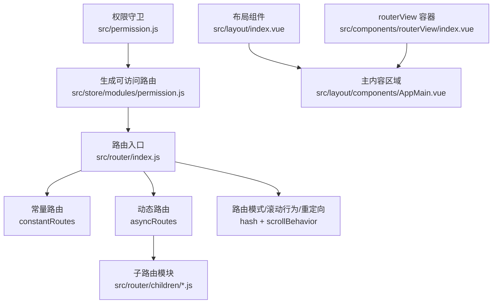
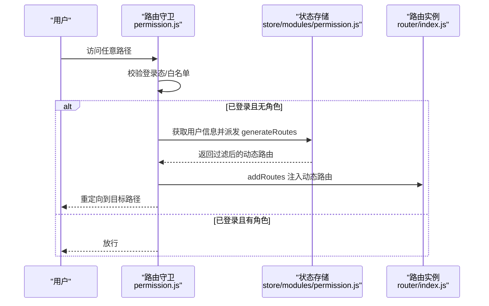
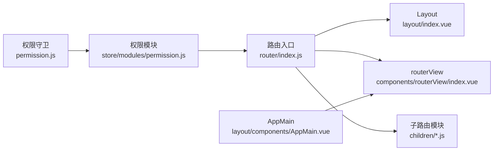

# 路由配置

<cite>
**本文引用的文件**
- [src/router/index.js](file://src/router/index.js)
- [src/router/children/member.js](file://src/router/children/member.js)
- [src/router/children/forum/index.js](file://src/router/children/forum/index.js)
- [src/router/children/match/index.js](file://src/router/children/match/index.js)
- [src/layout/index.vue](file://src/layout/index.vue)
- [src/layout/components/AppMain.vue](file://src/layout/components/AppMain.vue)
- [src/components/routerView/index.vue](file://src/components/routerView/index.vue)
- [src/permission.js](file://src/permission.js)
- [src/store/modules/permission.js](file://src/store/modules/permission.js)
- [src/views/redirect/index.vue](file://src/views/redirect/index.vue)
- [src/views/sitemaps.vue](file://src/views/sitemaps.vue)
- [src/views/dashboard/overview.vue](file://src/views/dashboard/overview.vue)
</cite>

## 目录
1. [简介](#简介)
2. [项目结构](#项目结构)
3. [核心组件](#核心组件)
4. [架构总览](#架构总览)
5. [详细组件分析](#详细组件分析)
6. [依赖关系分析](#依赖关系分析)
7. [性能考量](#性能考量)
8. [故障排查指南](#故障排查指南)
9. [结论](#结论)
10. [附录](#附录)

## 简介
本文件面向 Leisu Admin 项目的前端路由体系，系统性阐述静态路由 constantRoutes 与动态路由 asyncRoutes 的设计理念、实现方式与最佳实践。内容覆盖：
- 路由基础配置：路由模式（hash）、滚动行为、重定向规则
- 路由组件结构：Layout 布局、routerView、嵌套路由
- 路由导入机制：静态导入与动态导入、代码分割与懒加载
- 路由命名规范：路由名称、路径命名、元信息（meta）配置
- 路由权限与动态注入：基于角色的权限过滤与动态路由挂载
- 实际示例与扩展建议：如何新增模块、如何优化加载性能

## 项目结构
路由相关的核心文件集中在 src/router 目录，并与布局组件、权限控制、视图页面协同工作：
- 路由入口与常量/动态路由定义：src/router/index.js
- 动态子路由模块：src/router/children/*.js
- 布局与视图容器：src/layout、src/components/routerView
- 权限与路由注入：src/permission.js、src/store/modules/permission.js
- 视图页面：src/views 下各模块页面

图表来源
- [src/router/index.js:162-177](file://src/router/index.js#L162-L177)
- [src/permission.js:13-76](file://src/permission.js#L13-L76)
- [src/store/modules/permission.js:49-57](file://src/store/modules/permission.js#L49-L57)

章节来源
- [src/router/index.js:31-160](file://src/router/index.js#L31-L160)
- [src/router/children/member.js:131-165](file://src/router/children/member.js#L131-L165)
- [src/router/children/forum/index.js:165-230](file://src/router/children/forum/index.js#L165-L230)
- [src/router/children/match/index.js:80-277](file://src/router/children/match/index.js#L80-L277)

## 核心组件
- 路由入口与配置
  - 路由模式：hash
  - 滚动行为：滚动至顶部
  - 重定向规则：通配符兜底到 404；登录后重定向到首页
- 常量路由（constantRoutes）
  - 登录页、授权回调、404/401 错误页、重定向页等
- 动态路由（asyncRoutes）
  - 业务模块集合，按角色动态注入
- 权限守卫（permission.js）
  - 登录态判断、白名单放行、动态注入路由、错误处理与进度条
- 权限过滤（store/modules/permission.js）
  - 递归过滤含角色元信息的路由树

章节来源
- [src/router/index.js:162-177](file://src/router/index.js#L162-L177)
- [src/router/index.js:31-160](file://src/router/index.js#L31-L160)
- [src/permission.js:13-76](file://src/permission.js#L13-L76)
- [src/store/modules/permission.js:8-35](file://src/store/modules/permission.js#L8-L35)

## 架构总览
路由系统围绕“常量路由 + 动态路由 + 权限过滤 + 动态注入”的闭环运行，配合 Layout 布局与 AppMain 主视图容器，形成清晰的页面渲染链路。

图表来源
- [src/permission.js:13-76](file://src/permission.js#L13-L76)
- [src/store/modules/permission.js:49-57](file://src/store/modules/permission.js#L49-L57)
- [src/router/index.js:169-174](file://src/router/index.js#L169-L174)

## 详细组件分析

### 静态路由 constantRoutes 设计与实现
- 设计理念
  - 将与用户身份无关的基础页面（登录、授权回调、错误页、重定向）放入常量路由，确保无需鉴权即可访问
- 实现要点
  - 登录页、授权回调、404/401 错误页、重定向页均以异步组件形式引入，便于按需加载
  - 重定向页通过动态参数传递，最终跳转到目标路径
- 典型路径
  - 登录页：/login
  - 授权回调：/auth-redirect
  - 错误页：/404、/401
  - 重定向：/redirect/:path*

章节来源
- [src/router/index.js:31-68](file://src/router/index.js#L31-L68)
- [src/views/redirect/index.vue:1-13](file://src/views/redirect/index.vue#L1-L13)

### 动态路由 asyncRoutes 设计与实现
- 设计理念
  - 将业务模块路由作为动态路由，依据用户角色进行过滤，仅注入其具备权限的路由
- 实现要点
  - 采用模块化拆分，每个业务模块一个子路由文件，集中导入到 asyncRoutes
  - 子路由文件统一以 Layout 为父级容器，内部 children 为具体页面
  - 子路由文件在 meta 中声明 roles，用于权限过滤
- 典型模块
  - 用户模块：/member
  - 社区模块：/forum
  - 比赛模块：/match
  - 其他模块：支付、游戏、系统、运维工具、内容安全等

章节来源
- [src/router/index.js:74-160](file://src/router/index.js#L74-L160)
- [src/router/children/member.js:131-165](file://src/router/children/member.js#L131-L165)
- [src/router/children/forum/index.js:165-230](file://src/router/children/forum/index.js#L165-L230)
- [src/router/children/match/index.js:80-277](file://src/router/children/match/index.js#L80-L277)

### 路由基础配置：模式、滚动行为、重定向
- 路由模式
  - 使用 hash 模式，避免服务端配置压力
- 滚动行为
  - 每次路由切换滚动至顶部，提升用户体验
- 重定向规则
  - 通配符兜底到 404
  - 登录成功后重定向到首页
  - 重定向页通过参数透传实现精准跳转

章节来源
- [src/router/index.js:162-177](file://src/router/index.js#L162-L177)
- [src/router/index.js:159](file://src/router/index.js#L159)
- [src/views/redirect/index.vue:1-13](file://src/views/redirect/index.vue#L1-L13)

### 路由组件结构：Layout、routerView、嵌套路由
- Layout 布局
  - 提供侧边栏、顶部导航、标签页、右侧设置面板等容器能力
  - AppMain 作为主内容区，结合 keep-alive 缓存与 iframe 支持
- routerView 容器
  - 三层及以上嵌套时，通过权限守卫裁剪 matched，避免缓存异常
- 嵌套路由
  - 子路由模块统一以 Layout 包裹，children 为具体页面
  - 通过 meta.roles 控制可见性，支持多层级权限

章节来源
- [src/layout/index.vue:1-124](file://src/layout/index.vue#L1-L124)
- [src/layout/components/AppMain.vue:1-122](file://src/layout/components/AppMain.vue#L1-L122)
- [src/components/routerView/index.vue:1-13](file://src/components/routerView/index.vue#L1-L13)
- [src/permission.js:24-27](file://src/permission.js#L24-L27)

### 路由导入机制：静态导入与动态导入、代码分割、懒加载
- 静态导入
  - 常量路由与部分基础页面以静态导入方式引入，保证首屏关键路径稳定
- 动态导入
  - 动态路由与大量业务页面采用动态导入（异步组件），实现按需加载
  - 子路由模块文件本身即为动态导入的聚合，便于模块化维护
- 代码分割与懒加载
  - 使用 Webpack 的魔法注释（如 webpackChunkName）为特定页面生成独立 chunk，提升缓存命中率
  - 示例：部分论坛列表页使用魔法注释进行分包

章节来源
- [src/router/index.js:12-29](file://src/router/index.js#L12-L29)
- [src/router/index.js:39](file://src/router/index.js#L39)
- [src/router/children/forum/index.js:66](file://src/router/children/forum/index.js#L66)
- [src/router/children/forum/index.js:135-154](file://src/router/children/forum/index.js#L135-L154)

### 路由命名规范：名称、路径、元信息
- 路由名称（name）
  - 建议使用小驼峰或下划线风格，语义明确，避免重复
  - 示例：member_list、post_list、forumModeration、match
- 路径命名（path）
  - 建议使用短横线分隔的全小写路径，与模块目录一致
  - 示例：/member、/forum、/match
- 元信息（meta）
  - title：页面标题，用于面包屑与浏览器标题
  - icon：侧边栏图标
  - roles：权限标识数组，用于权限过滤
  - affix：固定标签页
  - noCache：是否缓存
  - iframe：是否以 iframe 打开外部链接
  - redirect：默认跳转路径

章节来源
- [src/router/children/member.js:7-128](file://src/router/children/member.js#L7-L128)
- [src/router/children/forum/index.js:22-161](file://src/router/children/forum/index.js#L22-L161)
- [src/router/children/match/index.js:85-273](file://src/router/children/match/index.js#L85-L273)
- [src/router/index.js:79](file://src/router/index.js#L79)
- [src/layout/components/AppMain.vue:5](file://src/layout/components/AppMain.vue#L5)

### 路由配置示例与最佳实践
- 新增模块步骤
  - 在 src/router/children 下新建模块文件（如 mymodule.js），以 Layout 为父容器，children 为页面
  - 在 src/router/index.js 的 asyncRoutes 中引入该模块并挂载
  - 在 store/modules/permission.js 的 meta.roles 中补充对应权限标识
- 性能优化
  - 对高频但体量较大的页面使用动态导入与魔法注释分包
  - 合理使用 keep-alive 缓存，避免不必要的缓存
  - 三层及以上嵌套时，遵循权限守卫中的 matched 裁剪逻辑
- 可扩展性
  - 保持 meta 字段一致性，便于统一处理（标题、图标、权限、缓存等）
  - 将权限标识与后端接口返回的角色列表保持一致，减少耦合

章节来源
- [src/router/index.js:74-160](file://src/router/index.js#L74-L160)
- [src/store/modules/permission.js:8-35](file://src/store/modules/permission.js#L8-L35)
- [src/permission.js:24-27](file://src/permission.js#L24-L27)

## 依赖关系分析
- 路由入口依赖
  - Layout 与 routerView 组件
  - 各子路由模块文件
- 权限控制依赖
  - permission.js 依赖 store/modules/permission.js 的 generateRoutes
  - generateRoutes 依赖 asyncRoutes 与 meta.roles
- 视图页面依赖
  - AppMain 结合 keep-alive 与缓存列表，支持 iframe 场景

图表来源
- [src/router/index.js:6-9](file://src/router/index.js#L6-L9)
- [src/router/index.js:12-29](file://src/router/index.js#L12-L29)
- [src/permission.js:13-76](file://src/permission.js#L13-L76)
- [src/store/modules/permission.js:49-57](file://src/store/modules/permission.js#L49-L57)
- [src/layout/components/AppMain.vue:5](file://src/layout/components/AppMain.vue#L5)

章节来源
- [src/router/index.js:6-9](file://src/router/index.js#L6-L9)
- [src/permission.js:13-76](file://src/permission.js#L13-L76)
- [src/store/modules/permission.js:49-57](file://src/store/modules/permission.js#L49-L57)

## 性能考量
- 懒加载与代码分割
  - 动态导入与魔法注释可显著降低首屏体积，提升加载速度
- keep-alive 缓存
  - AppMain 中使用 cachedViews 控制缓存列表，避免频繁重建
- 三层及以上嵌套
  - 权限守卫中对 matched 进行裁剪，防止缓存异常与内存泄漏
- 进度条与错误处理
  - NProgress 提升感知，错误消息提示与自动重定向提升健壮性

章节来源
- [src/router/children/forum/index.js:66](file://src/router/children/forum/index.js#L66)
- [src/layout/components/AppMain.vue:5](file://src/layout/components/AppMain.vue#L5)
- [src/permission.js:24-27](file://src/permission.js#L24-L27)
- [src/permission.js:55-61](file://src/permission.js#L55-L61)

## 故障排查指南
- 登录后无法进入页面
  - 检查权限守卫是否正确派发 generateRoutes 并注入动态路由
  - 确认用户角色列表包含对应 meta.roles
- 三级及以上嵌套页面缓存异常
  - 确认权限守卫已裁剪 matched，避免多余层级参与缓存
- 页面空白或报错
  - 检查动态导入路径是否正确，chunk 名称是否冲突
  - 确认 404/401 页面是否正确挂载
- iframe 外链无法打开
  - 检查 AppMain 中 meta.iframe 与对应 name 是否匹配

章节来源
- [src/permission.js:13-76](file://src/permission.js#L13-L76)
- [src/store/modules/permission.js:49-57](file://src/store/modules/permission.js#L49-L57)
- [src/layout/components/AppMain.vue:11-15](file://src/layout/components/AppMain.vue#L11-L15)

## 结论
Leisu Admin 的路由系统通过“常量路由 + 动态路由 + 权限过滤 + 动态注入”的设计，实现了灵活、可扩展且性能友好的前端路由架构。配合 Layout 与 AppMain 的组件化结构，以及合理的懒加载与缓存策略，能够满足复杂后台系统的导航与权限需求。建议在新增模块时严格遵循命名规范与元信息配置，持续优化代码分割与缓存策略，以获得更佳的用户体验与开发效率。

## 附录
- 关键视图页面参考
  - 导航首页：/（重定向到 /sitemaps）
  - 仪表盘概览：/overview
  - 站点地图：/sitemaps

章节来源
- [src/router/index.js:74-90](file://src/router/index.js#L74-L90)
- [src/views/dashboard/overview.vue:135-161](file://src/views/dashboard/overview.vue#L135-L161)
- [src/views/sitemaps.vue:48-177](file://src/views/sitemaps.vue#L48-L177)