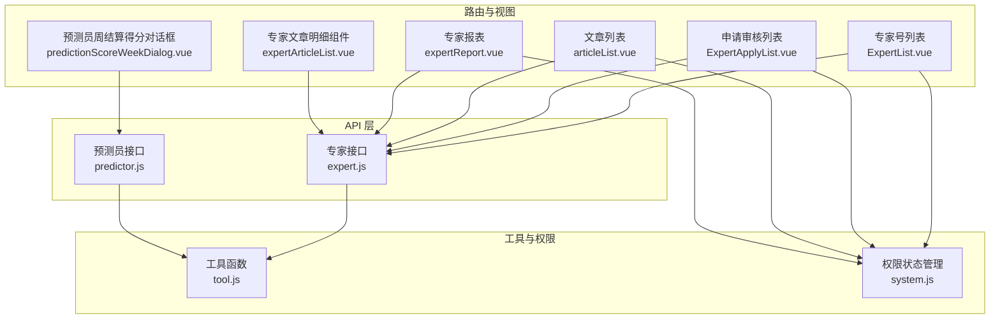
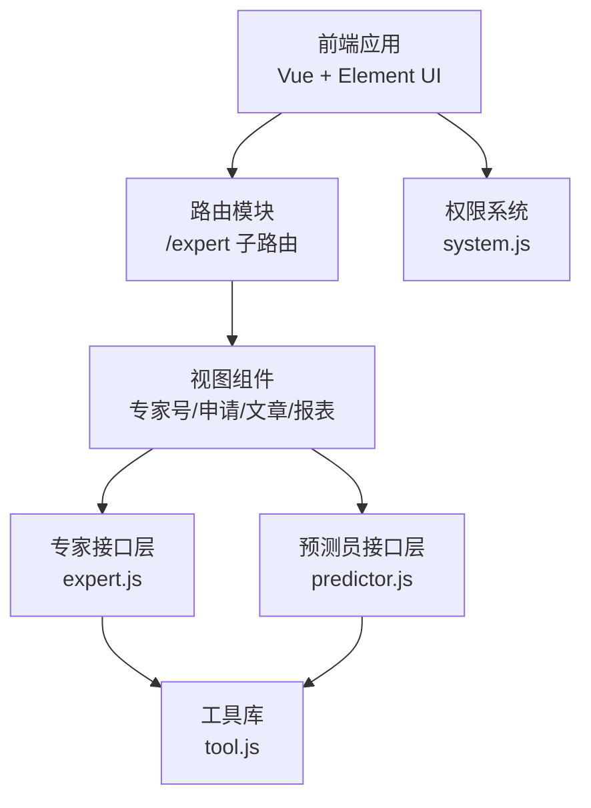
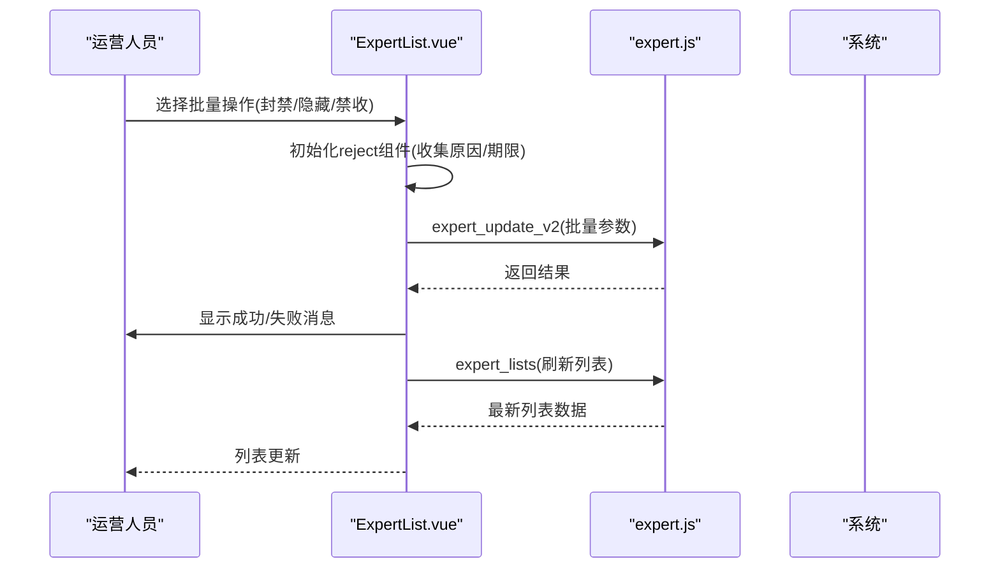
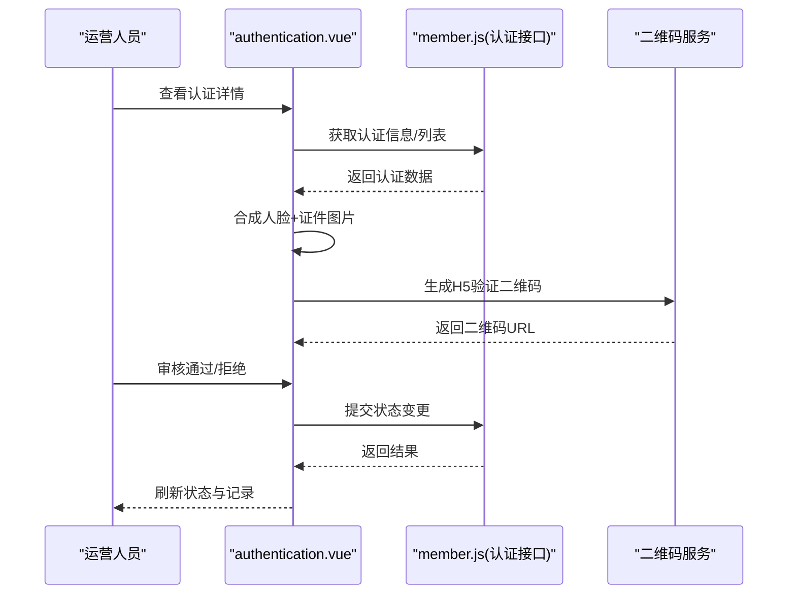
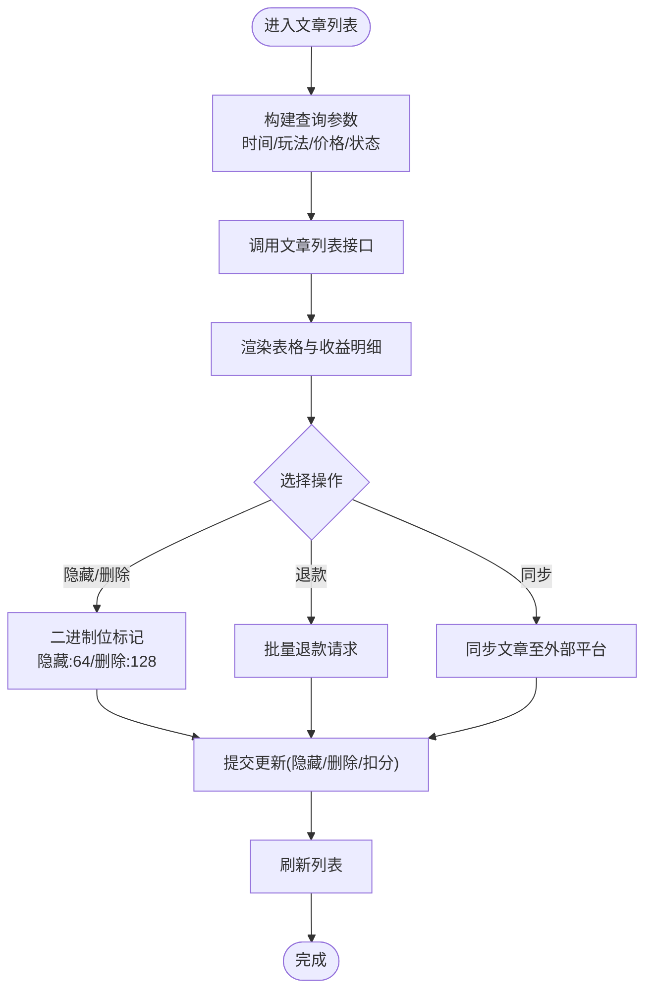
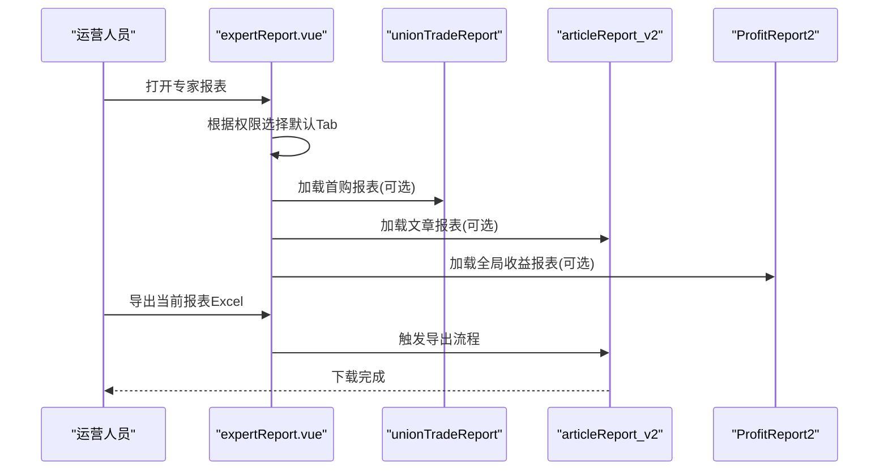
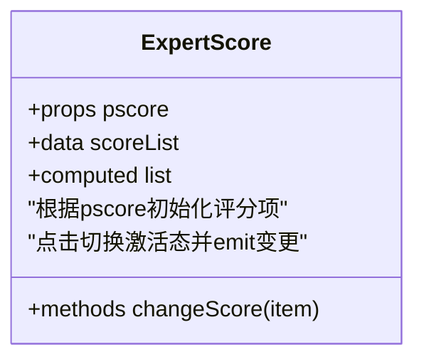
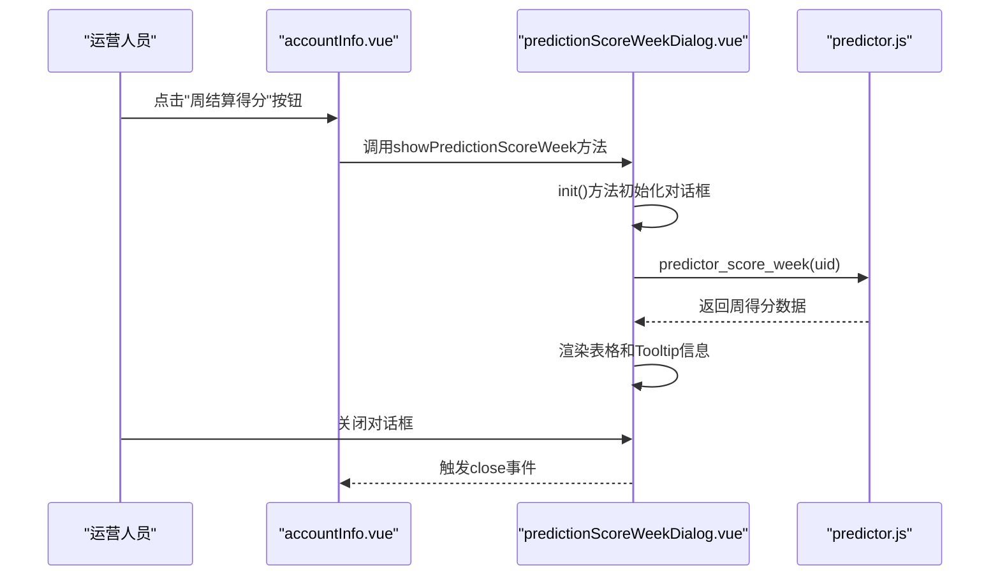
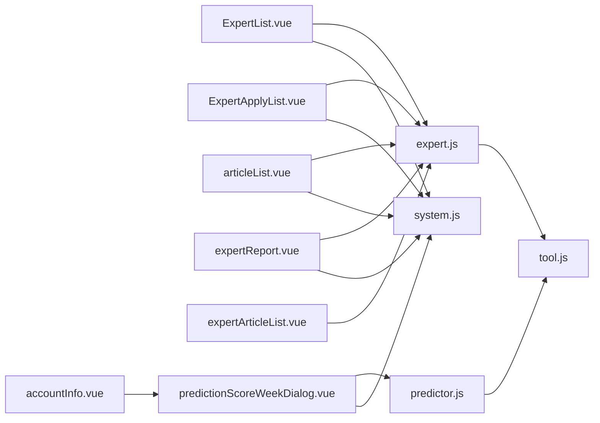

# 专家系统模块

<cite>
**本文引用的文件**   
- [expert.js](file://src/api/expert.js)
- [expert.js](file://src/router/children/expert.js)
- [ExpertList.vue](file://src/views/expert/ExpertList.vue)
- [ExpertApplyList.vue](file://src/views/expert/ExpertApplyList.vue)
- [articleList.vue](file://src/views/expert/articleList.vue)
- [expertReport.vue](file://src/views/expert/expertReport.vue)
- [expertArticleList.vue](file://src/components/leisu/peopleInfo/expert/components/expertArticleList.vue)
- [authentication.vue](file://src/components/leisu/peopleInfo/authentication/authentication.vue)
- [tool.js](file://src/utils/tool.js)
- [system.js](file://src/store/modules/system.js)
- [ExpertScore.vue](file://src/views/predictor/components/ExpertScore.vue)
- [predictionScoreWeekDialog.vue](file://src/views/predictor/components/predictionScoreWeekDialog.vue)
- [accountInfo.vue](file://src/components/leisu/peopleInfo/predictor/components/accountInfo.vue)
- [predictor.js](file://src/api/predictor.js)
</cite>

## 更新摘要
**变更内容**   
- 新增专家预测员周结算得分功能：在专家预测员界面中添加了"周结算得分"按钮
- 集成predictionScoreWeekDialog.vue组件，提供专家预测员的周绩效评估功能
- 新增predictor_score_week API接口，支持按UID查询专家周结算得分详情
- 在专家账户信息界面中集成周结算得分查看功能

## 目录
1. [引言](#引言)
2. [项目结构](#项目结构)
3. [核心组件](#核心组件)
4. [架构总览](#架构总览)
5. [详细组件分析](#详细组件分析)
6. [依赖关系分析](#依赖关系分析)
7. [性能考量](#性能考量)
8. [故障排查指南](#故障排查指南)
9. [结论](#结论)
10. [附录](#附录)

## 引言
本技术文档围绕"专家系统模块"展开，覆盖专家号管理、预测内容审核、专家收益统计等核心能力，并深入解析专家认证流程（申请审核、资质验证、等级评定）、预测内容管理机制（文章发布、审核流程、质量评估、用户评价）、专家收益计算与结算机制（分成比例、统计报表、提现管理）。同时给出业务流程设计、前后端分离与数据同步、实时通信等架构要点，以及最佳实践建议与关键代码示例路径，帮助开发者快速理解与扩展专家系统功能。

**更新** 新增专家预测员周结算得分功能，提供更精细化的专家绩效评估能力。

## 项目结构
专家系统模块在前端采用 Vue + Element UI 架构，路由按"专家号"维度组织，视图组件负责列表查询、审核、报表、收益统计等功能；API 层封装专家相关接口；工具库提供通用算法与格式化方法；权限系统通过用户角色与权限组控制页面与操作可见性。

**图表来源**
- [expert.js:1-123](file://src/router/children/expert.js#L1-L123)
- [ExpertList.vue:1-412](file://src/views/expert/ExpertList.vue#L1-L412)
- [ExpertApplyList.vue:1-487](file://src/views/expert/ExpertApplyList.vue#L1-L487)
- [articleList.vue:1-800](file://src/views/expert/articleList.vue#L1-L800)
- [expertReport.vue:1-103](file://src/views/expert/expertReport.vue#L1-L103)
- [expertArticleList.vue:1-800](file://src/components/leisu/peopleInfo/expert/components/expertArticleList.vue#L1-L800)
- [predictionScoreWeekDialog.vue:1-98](file://src/views/predictor/components/predictionScoreWeekDialog.vue#L1-L98)
- [expert.js:1-677](file://src/api/expert.js#L1-L677)
- [predictor.js:1025-1031](file://src/api/predictor.js#L1025-L1031)
- [tool.js:504-531](file://src/utils/tool.js#L504-L531)
- [system.js:1-186](file://src/store/modules/system.js#L1-L186)

**章节来源**
- [expert.js:1-123](file://src/router/children/expert.js#L1-L123)
- [ExpertList.vue:1-412](file://src/views/expert/ExpertList.vue#L1-L412)
- [ExpertApplyList.vue:1-487](file://src/views/expert/ExpertApplyList.vue#L1-L487)
- [articleList.vue:1-800](file://src/views/expert/articleList.vue#L1-L800)
- [expertReport.vue:1-103](file://src/views/expert/expertReport.vue#L1-L103)
- [expertArticleList.vue:1-800](file://src/components/leisu/peopleInfo/expert/components/expertArticleList.vue#L1-L800)
- [predictionScoreWeekDialog.vue:1-98](file://src/views/predictor/components/predictionScoreWeekDialog.vue#L1-L98)
- [expert.js:1-677](file://src/api/expert.js#L1-L677)
- [predictor.js:1025-1031](file://src/api/predictor.js#L1025-L1031)
- [tool.js:504-531](file://src/utils/tool.js#L504-L531)
- [system.js:1-186](file://src/store/modules/system.js#L1-L186)

## 核心组件
- 专家号列表与批量操作：支持筛选、排序、封禁/隐藏/禁收等快捷操作，批量处理与弹窗确认。
- 申请审核：多维检索、图片预览、敏感词高亮、批量/单项通过/拒绝。
- 文章管理：按时间/玩法/价格/状态筛选，支持隐藏/删除与退款，收益明细可视化。
- 专家报表：首购、文章、赛事、队伍、消费对比、销售、全局收益等多维度报表。
- 认证与权限：实名认证卡片、状态标签、二维码核验、权限组与角色控制。
- 收益与结算：收益/消费报表、提现通道与税费计算工具。
- **周结算得分**：专家预测员周绩效评估功能，提供详细的周得分构成分析。

**更新** 新增周结算得分功能，支持查看专家预测员的周绩效评估详情。

**章节来源**
- [ExpertList.vue:144-410](file://src/views/expert/ExpertList.vue#L144-L410)
- [ExpertApplyList.vue:220-486](file://src/views/expert/ExpertApplyList.vue#L220-L486)
- [articleList.vue:318-800](file://src/views/expert/articleList.vue#L318-L800)
- [expertReport.vue:66-102](file://src/views/expert/expertReport.vue#L66-L102)
- [authentication.vue:154-281](file://src/components/leisu/peopleInfo/authentication/authentication.vue#L154-L281)
- [system.js:21-186](file://src/store/modules/system.js#L21-L186)
- [predictionScoreWeekDialog.vue:1-98](file://src/views/predictor/components/predictionScoreWeekDialog.vue#L1-L98)

## 架构总览
专家系统采用前后端分离，前端通过路由模块"expert"统一承载专家号相关页面；API 层集中于 expert.js 和 predictor.js 提供专家号、文章、报表、收益、申诉、AI 分析等接口；工具库提供通用计算与格式化；权限系统通过用户角色与权限组动态控制页面与按钮级权限。

**图表来源**
- [expert.js:1-123](file://src/router/children/expert.js#L1-L123)
- [expert.js:1-677](file://src/api/expert.js#L1-L677)
- [predictor.js:1-1031](file://src/api/predictor.js#L1-L1031)
- [tool.js:504-531](file://src/utils/tool.js#L504-L531)
- [system.js:1-186](file://src/store/modules/system.js#L1-L186)

## 详细组件分析

### 专家号管理
- 功能点
  - 列表查询：按预测号名称、分组、粉丝数、ID、创建时间等筛选；支持排序与重置。
  - 快捷操作：封禁/解封、隐藏/取消隐藏、禁止收费/取消禁收；批量与单项操作。
  - 配置与禁收名单：支持打开禁收名单弹窗。
- 关键实现
  - 列表查询与分页：调用专家列表接口，支持多字段组合查询与排序。
  - 快捷操作弹窗：通过 reject 组件收集原因与期限，调用批量更新接口。
  - 权限控制：根据按钮级权限决定是否显示操作按钮。

**图表来源**
- [ExpertList.vue:130-410](file://src/views/expert/ExpertList.vue#L130-L410)
- [expert.js:644-650](file://src/api/expert.js#L644-L650)

**章节来源**
- [ExpertList.vue:144-410](file://src/views/expert/ExpertList.vue#L144-L410)
- [expert.js:644-650](file://src/api/expert.js#L644-L650)

### 专家认证流程
- 功能点
  - 实名认证卡片：展示姓名、身份证号、人脸/证件图片、状态标签、更新时间、认证记录与额外数据。
  - 二维码核验：生成 H5 验证链接二维码，辅助线下核验。
  - 审核状态：支持"待审核/已通过/未通过"状态切换与操作。
- 关键实现
  - 认证数据初始化：合并人脸与证件图片，区分"待审核"状态下旧/新证件号。
  - 二维码生成：基于认证 H5 链接生成二维码。
  - 审核操作：通过 changeStatusTemp 组件触发状态变更与回调刷新。

**图表来源**
- [authentication.vue:154-281](file://src/components/leisu/peopleInfo/authentication/authentication.vue#L154-L281)

**章节来源**
- [authentication.vue:154-281](file://src/components/leisu/peopleInfo/authentication/authentication.vue#L154-L281)

### 预测内容管理机制
- 功能点
  - 文章列表：按时间范围、玩法、价格、状态、平台等筛选；查看比赛信息、玩法选项、标题与内容摘要。
  - 收益明细：按平台拆分展示 Web/IOS/Android 收益与总收益。
  - 审核与处置：隐藏/取消隐藏、删除/取消删除、批量退款；支持同步与导出。
- 关键实现
  - 查询参数构建：时间戳转换、字段过滤、价格多选处理。
  - 二进制位标记：隐藏(64)、删除(128)、退款(32)等位运算判断。
  - 扣分与批量处理：通过 cut_score 组件收集扣分后统一提交。

**图表来源**
- [articleList.vue:423-748](file://src/views/expert/articleList.vue#L423-L748)
- [expert.js:115-122](file://src/api/expert.js#L115-L122)
- [expert.js:178-193](file://src/api/expert.js#L178-L193)

**章节来源**
- [articleList.vue:318-800](file://src/views/expert/articleList.vue#L318-L800)
- [expert.js:115-122](file://src/api/expert.js#L115-L122)
- [expert.js:178-193](file://src/api/expert.js#L178-L193)

### 专家收益统计与结算
- 功能点
  - 报表维度：首购、文章、赛事、队伍、消费对比、销售、全局收益等。
  - 结算口径：按创建/结算时间排序，支持导出 Excel。
- 关键实现
  - 报表组件：根据权限动态选择默认 Tab 与可用报表。
  - 收益计算：收益明细按平台拆分汇总，支持退款标识与总收益计算。

**图表来源**
- [expertReport.vue:66-102](file://src/views/expert/expertReport.vue#L66-L102)

**章节来源**
- [expertReport.vue:66-102](file://src/views/expert/expertReport.vue#L66-L102)

### 专家达人评分与等级
- 功能点
  - 达人评分项：头像、昵称、简介等评分维度，支持勾选/取消。
  - 评分联动：根据勾选状态生成评分对象并向上级组件 emit。
- 关键实现
  - 计算属性：根据传入评分对象动态渲染激活态。
  - 事件回传：change 事件携带更新后的评分对象。

**图表来源**
- [ExpertScore.vue:1-94](file://src/views/predictor/components/ExpertScore.vue#L1-L94)

**章节来源**
- [ExpertScore.vue:1-94](file://src/views/predictor/components/ExpertScore.vue#L1-L94)

### 专家预测员周结算得分功能
- 功能点
  - 周绩效评估：提供专家预测员的周结算得分详情，包括周期、本周达人分、各维度得分构成。
  - 多维度分析：AI方案得分、战绩得分、胜率得分、返还率得分、发布数得分等。
  - 详细信息展示：通过Tooltip展示各维度的详细计算信息和统计说明。
- 关键实现
  - 组件集成：在专家账户信息界面中添加"周结算得分"按钮，点击后弹出对话框。
  - 数据获取：通过 predictor_score_week API 接口按 UID 获取周得分详情。
  - 表格展示：使用 Element UI 表格组件展示周得分明细，支持拖拽对话框。
  - 交互设计：支持加载状态、错误处理和对话框关闭事件。

**图表来源**
- [accountInfo.vue:360-365](file://src/components/leisu/peopleInfo/predictor/components/accountInfo.vue#L360-L365)
- [predictionScoreWeekDialog.vue:80-95](file://src/views/predictor/components/predictionScoreWeekDialog.vue#L80-L95)
- [predictor.js:1025-1031](file://src/api/predictor.js#L1025-L1031)

**章节来源**
- [predictionScoreWeekDialog.vue:1-98](file://src/views/predictor/components/predictionScoreWeekDialog.vue#L1-L98)
- [accountInfo.vue:360-365](file://src/components/leisu/peopleInfo/predictor/components/accountInfo.vue#L360-L365)
- [predictor.js:1025-1031](file://src/api/predictor.js#L1025-L1031)

## 依赖关系分析
- 组件耦合
  - 视图组件强依赖 expert.js 和 predictor.js 接口；部分组件依赖工具库与权限系统。
  - articleList 与 expertArticleList 在"文章管理"场景下职责互补，前者面向运营后台，后者面向专家侧明细。
  - **新增** predictionScoreWeekDialog 组件依赖 predictor.js 中的 predictor_score_week 接口。
- 权限控制
  - system.js 提供权限组与角色过滤，影响路由可见性与按钮级权限。
- 数据流
  - 查询参数经组件组装后传递给 API，响应数据驱动表格渲染与分页。

**图表来源**
- [expert.js:1-677](file://src/api/expert.js#L1-L677)
- [predictor.js:1025-1031](file://src/api/predictor.js#L1025-L1031)
- [tool.js:504-531](file://src/utils/tool.js#L504-L531)
- [system.js:1-186](file://src/store/modules/system.js#L1-L186)

**章节来源**
- [expert.js:1-677](file://src/api/expert.js#L1-L677)
- [predictor.js:1025-1031](file://src/api/predictor.js#L1025-L1031)
- [tool.js:504-531](file://src/utils/tool.js#L504-L531)
- [system.js:1-186](file://src/store/modules/system.js#L1-L186)

## 性能考量
- 列表查询优化
  - 合理使用分页与排序字段，避免一次性加载过多数据。
  - 对时间范围与价格多选进行参数清洗，减少无效请求。
- 渲染优化
  - 表格列宽与固定列策略，减少滚动重绘。
  - 图片懒加载与缩略图模式，提升大图场景体验。
- 接口调用
  - 批量操作前进行二次确认，避免频繁调用导致抖动。
  - 对退款、隐藏/删除等高风险操作增加本地校验与提示。
- **新增** 周结算得分功能优化
  - 对话框组件采用懒加载方式，仅在需要时初始化。
  - 支持加载状态显示，避免长时间无响应。
  - Tooltip信息按需展示，减少DOM节点数量。

## 故障排查指南
- 权限问题
  - 若按钮不可见，请检查当前用户角色是否具备相应权限组与按钮级权限。
- 列表无数据
  - 检查查询参数是否正确（时间范围、价格、状态、筛选字段）。
- 操作失败
  - 查看网络面板与接口返回码；确认原因输入框非空且符合要求。
- 收益统计异常
  - 确认报表时间范围与结算时间字段；导出前确保当前列表数据完整。
- **新增** 周结算得分功能问题
  - 检查 UID 参数是否正确传递到 predictor_score_week 接口。
  - 确认对话框组件是否正确初始化和渲染。
  - 查看网络请求状态，确认 API 接口返回的数据格式。

**章节来源**
- [system.js:21-186](file://src/store/modules/system.js#L21-L186)
- [articleList.vue:423-748](file://src/views/expert/articleList.vue#L423-L748)
- [predictionScoreWeekDialog.vue:80-95](file://src/views/predictor/components/predictionScoreWeekDialog.vue#L80-L95)

## 结论
专家系统模块通过清晰的路由与视图划分、完善的专家号管理与认证流程、严谨的内容审核与收益统计体系，实现了从"专家准入—内容治理—收益结算"的闭环。结合权限系统与工具库，既保证了运营效率，也兼顾了数据安全与用户体验。

**更新** 新增的专家预测员周结算得分功能进一步完善了专家绩效管理体系，提供了更精细化的评估工具，有助于运营人员更好地监控和管理专家预测员的表现。后续可在报表性能、批量操作体验与实时通知等方面持续优化。

## 附录

### 专家系统业务流程设计
- 专家号管理
  - 申请审核：多维检索、敏感词高亮、批量/单项通过/拒绝。
  - 日常运营：封禁/隐藏/禁收、批量处理、禁收名单维护。
- 内容管理
  - 发布与审核：按玩法/价格/状态筛选，支持隐藏/删除与退款。
  - 质量评估：收益明细与退款标识，辅助质量监控。
- 数据统计
  - 多维度报表：首购、文章、赛事、队伍、消费对比、销售、全局收益。
- 收益与结算
  - 报表与导出：按平台拆分收益与总收益；支持导出 Excel。
  - 提现与税费：结合工具库计算税费与手续费。
- **新增** 周结算评估
  - 绩效监控：按周维度评估专家预测员表现，提供详细得分构成分析。
  - 数据驱动：基于AI方案、战绩、胜率、返还率、发布数等维度综合评估。

**章节来源**
- [ExpertApplyList.vue:220-486](file://src/views/expert/ExpertApplyList.vue#L220-L486)
- [ExpertList.vue:144-410](file://src/views/expert/ExpertList.vue#L144-L410)
- [articleList.vue:318-800](file://src/views/expert/articleList.vue#L318-L800)
- [expertReport.vue:66-102](file://src/views/expert/expertReport.vue#L66-L102)
- [tool.js:504-531](file://src/utils/tool.js#L504-L531)
- [predictionScoreWeekDialog.vue:1-98](file://src/views/predictor/components/predictionScoreWeekDialog.vue#L1-L98)

### 专家系统架构设计要点
- 前后端分离
  - 前端路由统一承载专家号相关页面；API 层集中管理专家相关接口。
- 数据同步
  - 文章同步与导出流程，确保数据一致性与可审计性。
- 实时通信
  - 可结合现有 MQTT/消息通道进行实时状态推送（如同步结果、审核状态变更）。
- **新增** 组件化设计
  - 采用组件化架构，支持独立的功能模块开发与复用。
  - 对话框组件支持懒加载，提升页面初始加载性能。

**章节来源**
- [expert.js:1-123](file://src/router/children/expert.js#L1-L123)
- [articleList.vue:666-718](file://src/views/expert/articleList.vue#L666-L718)
- [predictionScoreWeekDialog.vue:1-98](file://src/views/predictor/components/predictionScoreWeekDialog.vue#L1-L98)

### 专家管理最佳实践
- 内容质量控制
  - 建议引入 AI/人工双审机制，对敏感词与违规内容进行预警与拦截。
- 用户体验优化
  - 提供图片预览与缩略图模式，优化长列表滚动性能。
- 数据安全保护
  - 对认证与敏感数据访问进行权限控制与审计日志记录。
- **新增** 绩效评估优化
  - 建议定期查看专家预测员的周结算得分，及时发现问题并提供指导。
  - 基于得分构成分析，制定针对性的培训和激励措施。

**章节来源**
- [authentication.vue:154-281](file://src/components/leisu/peopleInfo/authentication/authentication.vue#L154-L281)
- [system.js:21-186](file://src/store/modules/system.js#L21-L186)
- [predictionScoreWeekDialog.vue:1-98](file://src/views/predictor/components/predictionScoreWeekDialog.vue#L1-L98)

### 关键代码示例与配置说明
- 专家号列表与批量操作
  - [ExpertList.vue:144-410](file://src/views/expert/ExpertList.vue#L144-L410)
  - [expert.js:644-650](file://src/api/expert.js#L644-L650)
- 申请审核与敏感词高亮
  - [ExpertApplyList.vue:220-486](file://src/views/expert/ExpertApplyList.vue#L220-L486)
- 文章列表与收益明细
  - [articleList.vue:318-800](file://src/views/expert/articleList.vue#L318-L800)
  - [expert.js:115-122](file://src/api/expert.js#L115-L122)
  - [expert.js:178-193](file://src/api/expert.js#L178-L193)
- 专家报表
  - [expertReport.vue:66-102](file://src/views/expert/expertReport.vue#L66-L102)
- 认证与权限
  - [authentication.vue:154-281](file://src/components/leisu/peopleInfo/authentication/authentication.vue#L154-L281)
  - [system.js:21-186](file://src/store/modules/system.js#L21-L186)
- 收益与税费计算
  - [tool.js:504-531](file://src/utils/tool.js#L504-L531)
- **新增** 周结算得分功能
  - [predictionScoreWeekDialog.vue:1-98](file://src/views/predictor/components/predictionScoreWeekDialog.vue#L1-L98)
  - [accountInfo.vue:360-365](file://src/components/leisu/peopleInfo/predictor/components/accountInfo.vue#L360-L365)
  - [predictor.js:1025-1031](file://src/api/predictor.js#L1025-L1031)