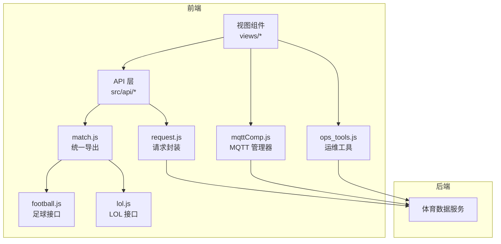
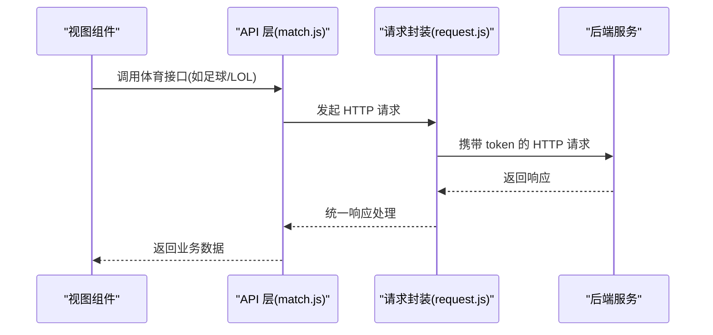
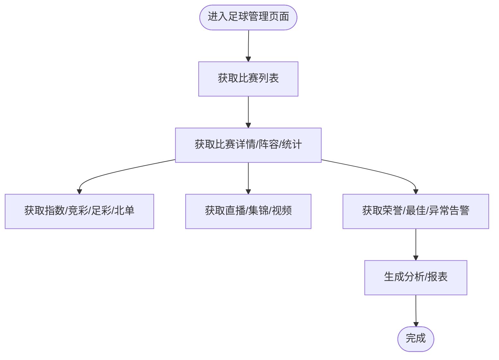
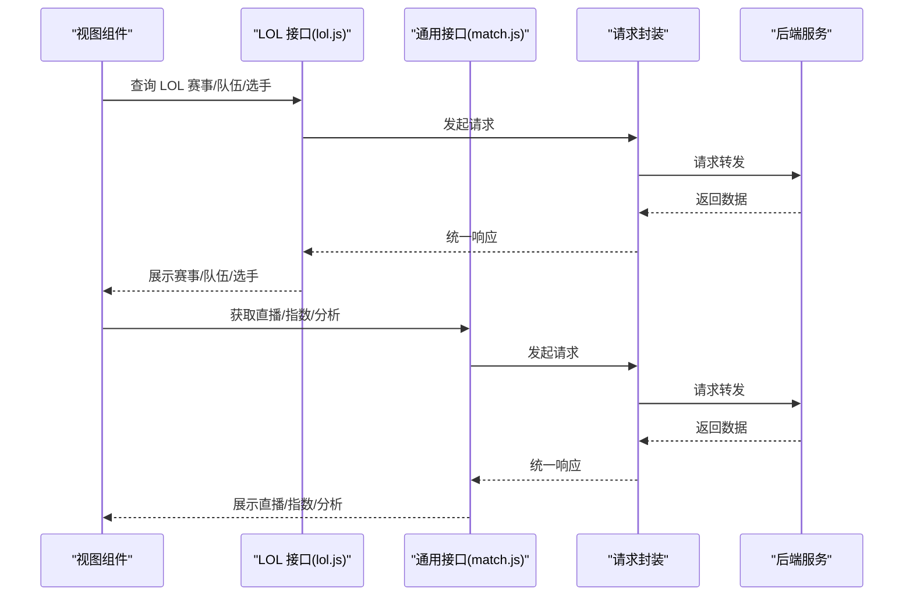
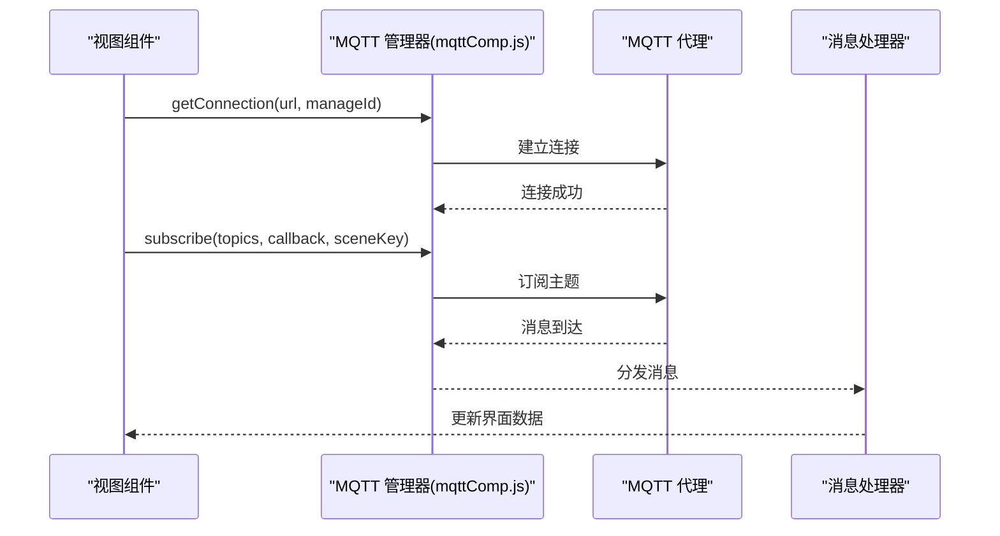
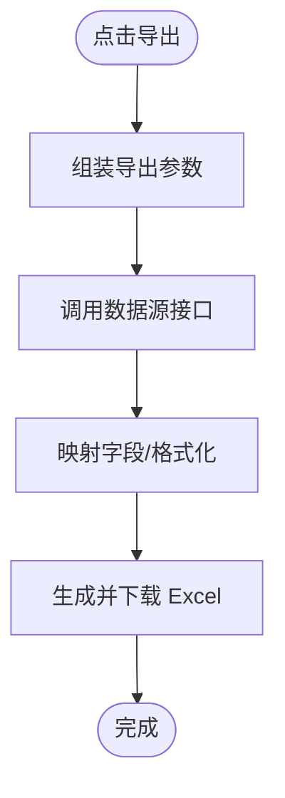
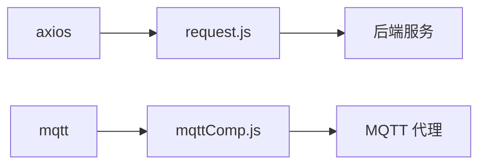

# 体育数据管理模块

<cite>
**本文档引用的文件**
- [public/mqttMsg.md](file://public/mqttMsg.md)
- [src/api/match.js](file://src/api/match.js)
- [src/api/matchapi/ball/football.js](file://src/api/matchapi/ball/football.js)
- [src/api/matchapi/game/lol.js](file://src/api/matchapi/game/lol.js)
- [src/utils/request.js](file://src/utils/request.js)
- [src/utils/mqttComp.js](file://src/utils/mqttComp.js)
- [src/api/ops_tools.js](file://src/api/ops_tools.js)
- [src/views/ops_tools/football_send.vue](file://src/views/ops_tools/football_send.vue)
- [src/views/chat_room/chatlist.vue](file://src/views/chat_room/chatlist.vue)
- [package.json](file://package.json)
</cite>

## 目录
1. [简介](#简介)
2. [项目结构](#项目结构)
3. [核心组件](#核心组件)
4. [架构总览](#架构总览)
5. [详细组件分析](#详细组件分析)
6. [依赖关系分析](#依赖关系分析)
7. [性能考虑](#性能考虑)
8. [故障排除指南](#故障排除指南)
9. [结论](#结论)
10. [附录](#附录)

## 简介
本模块面向多体育项目（足球、篮球、网球、羽毛球、棒球、电竞（LOL、DOTA、CSGO、王者荣耀）等）的赛事数据管理，覆盖数据模型（比赛、球队、球员、教练、裁判等）、数据导入导出、实时数据更新（直播、比分、统计、指数）、以及运维工具（缓存刷新、日志查询、MQTT 推送）。系统采用前后端分离架构，前端通过统一请求封装与后端交互，同时集成 MQTT 实时订阅以接收直播与指数变更。

## 项目结构
围绕体育数据管理的关键目录与文件：
- API 层：集中于 src/api，按体育类型拆分子模块，统一导出至 match.js，便于页面按需引入
- 实时通信：src/utils/mqttComp.js 提供 MQTT 连接池与场景化订阅管理
- 请求封装：src/utils/request.js 统一处理环境切换、鉴权头注入、响应拦截与错误提示
- 运维工具：src/api/ops_tools.js 提供缓存刷新、日志查询、MQTT 推送等能力
- 实时消息规范：public/mqttMsg.md 定义了各类体育的 MQTT 主题与消息格式

**图表来源**
- [src/api/match.js:1-18](file://src/api/match.js#L1-L18)
- [src/api/matchapi/ball/football.js:1-20](file://src/api/matchapi/ball/football.js#L1-L20)
- [src/api/matchapi/game/lol.js:1-20](file://src/api/matchapi/game/lol.js#L1-L20)
- [src/utils/request.js:1-30](file://src/utils/request.js#L1-L30)
- [src/utils/mqttComp.js:1-40](file://src/utils/mqttComp.js#L1-L40)
- [src/api/ops_tools.js:1-20](file://src/api/ops_tools.js#L1-L20)

**章节来源**
- [src/api/match.js:1-18](file://src/api/match.js#L1-L18)
- [src/utils/request.js:1-30](file://src/utils/request.js#L1-L30)
- [src/utils/mqttComp.js:1-40](file://src/utils/mqttComp.js#L1-L40)
- [src/api/ops_tools.js:1-20](file://src/api/ops_tools.js#L1-L20)

## 核心组件
- 统一 API 导出：match.js 将各体育接口统一导出，便于页面按需引入，避免重复 import
- 体育接口模块：football.js、lol.js 等分别提供对应项目的列表、详情、统计、荣誉、积分等接口
- 请求封装：request.js 根据运行环境选择不同基础 URL，注入 token，统一处理错误与提示
- MQTT 管理：mqttComp.js 提供连接池、场景化订阅、通配符匹配、回调去重、自动销毁等能力
- 运维工具：ops_tools.js 提供缓存刷新、日志查询、MQTT 推送等后台运维能力

**章节来源**
- [src/api/match.js:1-18](file://src/api/match.js#L1-L18)
- [src/api/matchapi/ball/football.js:1-20](file://src/api/matchapi/ball/football.js#L1-L20)
- [src/api/matchapi/game/lol.js:1-20](file://src/api/matchapi/game/lol.js#L1-L20)
- [src/utils/request.js:1-30](file://src/utils/request.js#L1-L30)
- [src/utils/mqttComp.js:1-40](file://src/utils/mqttComp.js#L1-L40)
- [src/api/ops_tools.js:1-20](file://src/api/ops_tools.js#L1-L20)

## 架构总览
系统采用“前端 API 层 + 请求封装 + MQTT 实时订阅 + 后端服务”的分层架构。前端通过 match.js 统一聚合各体育接口，请求封装负责环境与鉴权；MQTT 管理器负责长连接与主题订阅；运维工具提供缓存与日志支撑。

**图表来源**
- [src/api/match.js:1-18](file://src/api/match.js#L1-L18)
- [src/utils/request.js:28-68](file://src/utils/request.js#L28-L68)

**章节来源**
- [src/api/match.js:1-18](file://src/api/match.js#L1-L18)
- [src/utils/request.js:28-68](file://src/utils/request.js#L28-L68)

## 详细组件分析

### 足球数据管理
- 接口覆盖：比赛列表、队伍/球员/教练/裁判/荣誉、赛事阶段/赛季、积分/最佳、阵容/统计、异常与状态告警、竞彩/足彩/北单指数等
- 典型流程：通过 football.js 中的列表与详情接口获取数据，结合 match.js 的通用接口（如指数、视频、分析）完善展示

**图表来源**
- [src/api/matchapi/ball/football.js:1-20](file://src/api/matchapi/ball/football.js#L1-L20)
- [src/api/match.js:126-150](file://src/api/match.js#L126-L150)

**章节来源**
- [src/api/matchapi/ball/football.js:1-20](file://src/api/matchapi/ball/football.js#L1-L20)
- [src/api/match.js:126-150](file://src/api/match.js#L126-L150)

### 电竞（LOL）数据管理
- 接口覆盖：比赛/队伍/选手/赛事/英雄/天赋/技能/装备/国家、活跃比赛定位、直播详情、积分/统计/事件、热门赛事、评分等
- 典型流程：通过 lol.js 获取赛事与队伍信息，结合 match.js 的通用接口完善直播、指数与分析

**图表来源**
- [src/api/matchapi/game/lol.js:1-20](file://src/api/matchapi/game/lol.js#L1-L20)
- [src/api/match.js:126-150](file://src/api/match.js#L126-L150)
- [src/utils/request.js:28-68](file://src/utils/request.js#L28-L68)

**章节来源**
- [src/api/matchapi/game/lol.js:1-20](file://src/api/matchapi/game/lol.js#L1-L20)
- [src/api/match.js:126-150](file://src/api/match.js#L126-L150)
- [src/utils/request.js:28-68](file://src/utils/request.js#L28-L68)

### 实时数据更新机制（MQTT）
- 主题规范：public/mqttMsg.md 定义了各体育的 MQTT 主题（如足球/篮球/网球/电竞等）与消息格式
- 订阅管理：mqttComp.js 提供连接池、场景化订阅、通配符匹配、回调去重、自动销毁等能力
- 使用示例：chatlist.vue 与 football_send.vue 展示了如何初始化 MQTT 并订阅主题，football_send.vue 还演示了通过运维工具推送消息

**图表来源**
- [src/utils/mqttComp.js:14-97](file://src/utils/mqttComp.js#L14-L97)
- [src/views/chat_room/chatlist.vue:588-606](file://src/views/chat_room/chatlist.vue#L588-L606)
- [public/mqttMsg.md:1-88](file://public/mqttMsg.md#L1-L88)

**章节来源**
- [src/utils/mqttComp.js:14-97](file://src/utils/mqttComp.js#L14-L97)
- [src/views/chat_room/chatlist.vue:588-606](file://src/views/chat_room/chatlist.vue#L588-L606)
- [public/mqttMsg.md:1-88](file://public/mqttMsg.md#L1-L88)

### 数据导入导出机制
- 导出流程：exportExcel 组件与 helpers 提供按数据源组装参数、请求数据、映射字段、导出 Excel 的完整链路
- 导入流程：仓库未发现 CSV 导入组件，建议基于现有导出机制扩展（如上传文件、解析、调用批量更新接口）

**图表来源**
- [src/components/exportExcel/index.vue:160-193](file://src/components/exportExcel/index.vue#L160-L193)
- [src/components/exportExcel/exportExcelHelpers.js:132-160](file://src/components/exportExcel/exportExcelHelpers.js#L132-L160)

**章节来源**
- [src/components/exportExcel/index.vue:160-193](file://src/components/exportExcel/index.vue#L160-L193)
- [src/components/exportExcel/exportExcelHelpers.js:132-160](file://src/components/exportExcel/exportExcelHelpers.js#L132-L160)

### 缓存与性能优化
- 缓存刷新：ops_tools.js 提供刷新缓存、预热缓存、任务信息查询等接口，配合前端组件进行可视化操作
- 性能建议：合理使用 MQTT 通配符订阅减少订阅数量；对高频接口做本地缓存与节流；批量更新时采用分页与并发控制

**章节来源**
- [src/api/ops_tools.js:50-87](file://src/api/ops_tools.js#L50-L87)

## 依赖关系分析
- 依赖关系：前端通过 axios 发起 HTTP 请求，request.js 注入 token 并统一处理响应；MQTT 依赖 mqtt 库，通过 mqttComp.js 管理连接与订阅；package.json 显示依赖版本

**图表来源**
- [package.json:69-95](file://package.json#L69-L95)
- [src/utils/request.js:1-10](file://src/utils/request.js#L1-L10)
- [src/utils/mqttComp.js:1-10](file://src/utils/mqttComp.js#L1-L10)

**章节来源**
- [package.json:69-95](file://package.json#L69-L95)
- [src/utils/request.js:1-10](file://src/utils/request.js#L1-L10)
- [src/utils/mqttComp.js:1-10](file://src/utils/mqttComp.js#L1-L10)

## 性能考虑
- 请求层面：统一超时时间、错误提示与状态码处理，避免阻塞 UI
- 实时层面：MQTT 采用连接池与场景化订阅，减少重复订阅与消息分发成本
- 缓存层面：提供缓存刷新与预热接口，结合业务场景进行热点数据缓存

[本节为通用指导，无需具体文件分析]

## 故障排除指南
- 请求错误：request.js 对常见 HTTP 状态码进行提示，便于快速定位问题
- MQTT 连接：mqttComp.js 提供连接状态检查、错误回调与自动销毁能力，便于排查订阅问题
- 运维工具：ops_tools.js 提供日志查询与 MQTT 推送，可用于验证实时数据通道

**章节来源**
- [src/utils/request.js:46-127](file://src/utils/request.js#L46-L127)
- [src/utils/mqttComp.js:512-561](file://src/utils/mqttComp.js#L512-L561)
- [src/api/ops_tools.js:155-161](file://src/api/ops_tools.js#L155-L161)

## 结论
本模块通过清晰的分层设计与统一的接口封装，实现了多体育项目的赛事数据管理与实时更新。借助 MQTT 实时订阅与运维工具，系统具备良好的扩展性与可观测性。建议后续补充 CSV 导入能力与更完善的缓存策略，以满足更大规模的数据管理需求。

[本节为总结性内容，无需具体文件分析]

## 附录

### 业务场景示例
- 赛事安排：通过 match.js 通用接口与各体育接口组合，完成比赛列表、直播、指数与分析的统一展示
- 数据分析：利用实时分析接口与报表接口，生成比赛分析与收入报表
- 统计报表：结合各体育接口的统计与荣誉数据，输出团队/选手/赛事的综合报表

**章节来源**
- [src/api/match.js:460-520](file://src/api/match.js#L460-L520)
- [src/api/matchapi/ball/football.js:470-535](file://src/api/matchapi/ball/football.js#L470-L535)

### 代码示例与配置说明
- 请求封装：在 request.js 中根据运行环境选择 baseURL，注入 token，统一处理响应与错误
- MQTT 管理：在 mqttComp.js 中通过 getConnection、subscribe、unsubscribe 管理连接与订阅
- 运维工具：在 ops_tools.js 中调用缓存刷新与日志查询接口，或通过 football_send.vue 推送测试消息

**章节来源**
- [src/utils/request.js:10-30](file://src/utils/request.js#L10-L30)
- [src/utils/mqttComp.js:14-97](file://src/utils/mqttComp.js#L14-L97)
- [src/api/ops_tools.js:50-87](file://src/api/ops_tools.js#L50-L87)
- [src/views/ops_tools/football_send.vue:61-81](file://src/views/ops_tools/football_send.vue#L61-L81)