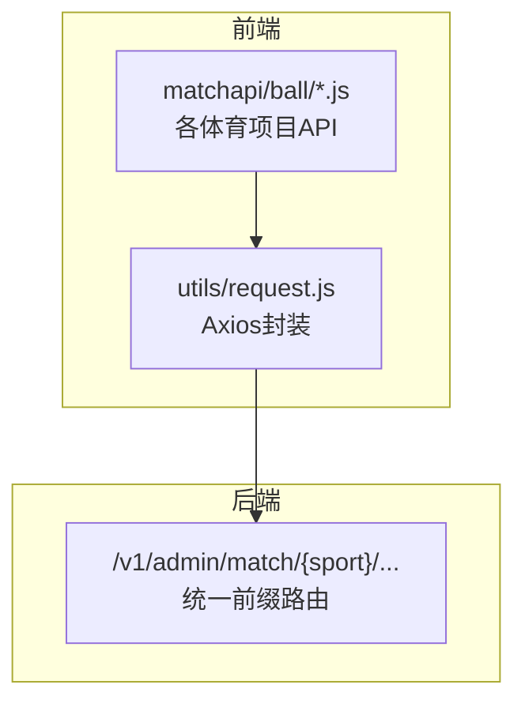
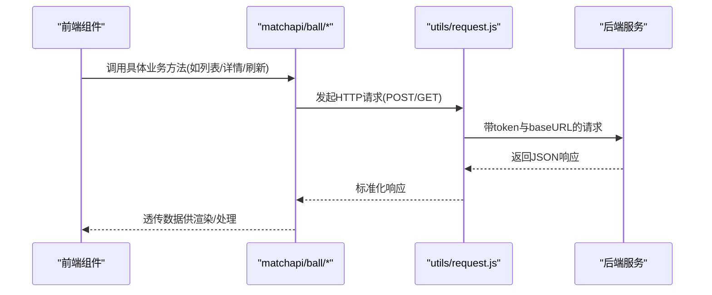
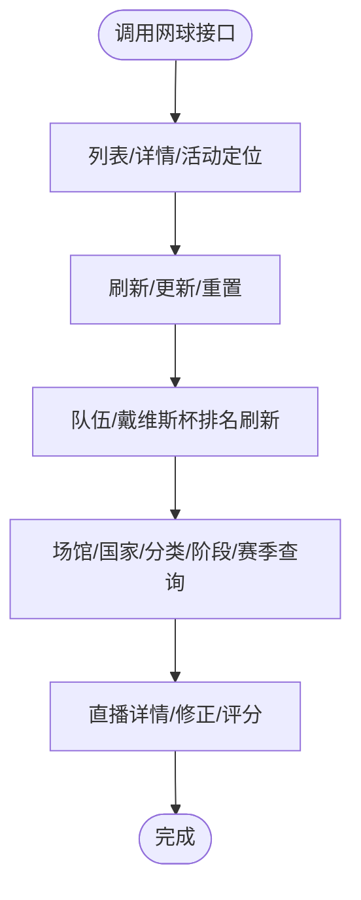
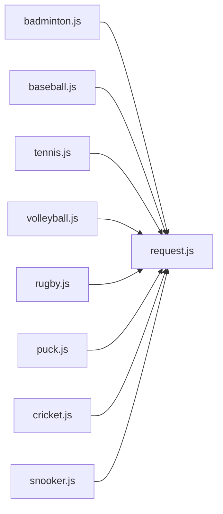

# 其他体育项目管理

<cite>
**本文引用的文件**
- [badminton.js](file://src/api/matchapi/ball/badminton.js)
- [baseball.js](file://src/api/matchapi/ball/baseball.js)
- [tennis.js](file://src/api/matchapi/ball/tennis.js)
- [volleyball.js](file://src/api/matchapi/ball/volleyball.js)
- [rugby.js](file://src/api/matchapi/ball/rugby.js)
- [puck.js](file://src/api/matchapi/ball/puck.js)
- [cricket.js](file://src/api/matchapi/ball/cricket.js)
- [snooker.js](file://src/api/matchapi/ball/snooker.js)
- [request.js](file://src/utils/request.js)
</cite>

## 目录
1. [简介](#简介)
2. [项目结构](#项目结构)
3. [核心组件](#核心组件)
4. [架构总览](#架构总览)
5. [详细组件分析](#详细组件分析)
6. [依赖分析](#依赖分析)
7. [性能考虑](#性能考虑)
8. [故障排查指南](#故障排查指南)
9. [结论](#结论)
10. [附录](#附录)

## 简介
本技术文档面向“其他体育项目”的数据管理与统一处理，覆盖网球、排球、棒球、橄榄球、冰球、板球、羽毛球、斯诺克等项目。文档从系统架构、数据模型特点、通用与差异化处理模式、数据库设计建议、标准化处理方案、实现示例与最佳实践等方面进行深入说明，帮助开发者快速理解并扩展多体育项目的数据管理能力。

## 项目结构
- 后端接口通过统一的 axios 封装发起请求，按体育项目分模块组织在 matchapi/ball 下，每个项目一个 API 文件，导出若干业务方法用于查询/刷新/更新/重置等操作。
- 请求封装位于 utils/request.js，负责环境切换、超时控制、鉴权头注入以及错误提示。

图表来源
- [badminton.js:1-156](file://src/api/matchapi/ball/badminton.js#L1-L156)
- [baseball.js:1-165](file://src/api/matchapi/ball/baseball.js#L1-L165)
- [tennis.js:1-183](file://src/api/matchapi/ball/tennis.js#L1-L183)
- [volleyball.js:1-147](file://src/api/matchapi/ball/volleyball.js#L1-L147)
- [rugby.js:1-202](file://src/api/matchapi/ball/rugby.js#L1-L202)
- [puck.js:1-202](file://src/api/matchapi/ball/puck.js#L1-L202)
- [cricket.js:1-201](file://src/api/matchapi/ball/cricket.js#L1-L201)
- [snooker.js:1-115](file://src/api/matchapi/ball/snooker.js#L1-L115)
- [request.js:1-130](file://src/utils/request.js#L1-L130)

章节来源
- [badminton.js:1-156](file://src/api/matchapi/ball/badminton.js#L1-L156)
- [baseball.js:1-165](file://src/api/matchapi/ball/baseball.js#L1-L165)
- [tennis.js:1-183](file://src/api/matchapi/ball/tennis.js#L1-L183)
- [volleyball.js:1-147](file://src/api/matchapi/ball/volleyball.js#L1-L147)
- [rugby.js:1-202](file://src/api/matchapi/ball/rugby.js#L1-L202)
- [puck.js:1-202](file://src/api/matchapi/ball/puck.js#L1-L202)
- [cricket.js:1-201](file://src/api/matchapi/ball/cricket.js#L1-L201)
- [snooker.js:1-115](file://src/api/matchapi/ball/snooker.js#L1-L115)
- [request.js:1-130](file://src/utils/request.js#L1-L130)

## 核心组件
- 统一请求封装：负责环境识别（admin-w.leisu.com、admin.leisudata.com）、基础 URL 切换、超时设置、鉴权头注入、响应错误提示。
- 体育项目 API：每个项目以函数形式暴露常用业务接口，如列表查询、详情修正、活动定位、刷新/更新/重置、国家/队伍/阶段/分类/赛季/场馆等。

章节来源
- [request.js:1-130](file://src/utils/request.js#L1-L130)
- [badminton.js:1-156](file://src/api/matchapi/ball/badminton.js#L1-L156)
- [baseball.js:1-165](file://src/api/matchapi/ball/baseball.js#L1-L165)
- [tennis.js:1-183](file://src/api/matchapi/ball/tennis.js#L1-L183)
- [volleyball.js:1-147](file://src/api/matchapi/ball/volleyball.js#L1-L147)
- [rugby.js:1-202](file://src/api/matchapi/ball/rugby.js#L1-L202)
- [puck.js:1-202](file://src/api/matchapi/ball/puck.js#L1-L202)
- [cricket.js:1-201](file://src/api/matchapi/ball/cricket.js#L1-L201)
- [snooker.js:1-115](file://src/api/matchapi/ball/snooker.js#L1-L115)

## 架构总览
前端通过 matchapi/ball 下的各项目 API 调用后端统一前缀的接口，请求经由 utils/request.js 进行统一拦截与错误处理，返回数据在前端组件中渲染或进一步处理。

图表来源
- [request.js:1-130](file://src/utils/request.js#L1-L130)
- [badminton.js:1-156](file://src/api/matchapi/ball/badminton.js#L1-L156)
- [baseball.js:1-165](file://src/api/matchapi/ball/baseball.js#L1-L165)
- [tennis.js:1-183](file://src/api/matchapi/ball/tennis.js#L1-L183)
- [volleyball.js:1-147](file://src/api/matchapi/ball/volleyball.js#L1-L147)
- [rugby.js:1-202](file://src/api/matchapi/ball/rugby.js#L1-L202)
- [puck.js:1-202](file://src/api/matchapi/ball/puck.js#L1-L202)
- [cricket.js:1-201](file://src/api/matchapi/ball/cricket.js#L1-L201)
- [snooker.js:1-115](file://src/api/matchapi/ball/snooker.js#L1-L115)

## 详细组件分析

### 网球（tennis）
- 数据模型与统计要点
  - 支持队伍、赛事、国家、阶段、分类、赛季、场馆等维度查询。
  - 提供队伍/戴维斯杯排名刷新与发布时间查询。
  - 支持直播详情、活动定位、详情修正、晋级图等。
- 差异化处理
  - 队伍/阶段/赛事的“刷新”“更新”“重置”三类维护操作分离，便于精细化治理。
  - 排名刷新接口独立，便于定时任务或手动触发。
- 关键接口路径
  - [tennis_match_list:3-8](file://src/api/matchapi/ball/tennis.js#L3-L8)
  - [tennis_team_list:11-16](file://src/api/matchapi/ball/tennis.js#L11-L16)
  - [tennis_competition_list:19-24](file://src/api/matchapi/ball/tennis.js#L19-L24)
  - [tennis_active_match:27-32](file://src/api/matchapi/ball/tennis.js#L27-L32)
  - [tennis_fix_detail:35-40](file://src/api/matchapi/ball/tennis.js#L35-L40)
  - [tennis_season_list:43-48](file://src/api/matchapi/ball/tennis.js#L43-L48)
  - [tennis_stage_list:51-56](file://src/api/matchapi/ball/tennis.js#L51-L56)
  - [tennis_country_list:59-64](file://src/api/matchapi/ball/tennis.js#L59-L64)
  - [tennis_venue_list:67-72](file://src/api/matchapi/ball/tennis.js#L67-L72)
  - [tennis_category_list:75-79](file://src/api/matchapi/ball/tennis.js#L75-L79)
  - [tennis_team_ranking_v5:82-87](file://src/api/matchapi/ball/tennis.js#L82-L87)
  - [tennis_davis_ranking_v5:90-95](file://src/api/matchapi/ball/tennis.js#L90-L95)
  - [tennis_davis_pub_time:98-102](file://src/api/matchapi/ball/tennis.js#L98-L102)
  - [tennis_match_detail:105-110](file://src/api/matchapi/ball/tennis.js#L105-L110)
  - [tennis_stage_team_list_v5:114-119](file://src/api/matchapi/ball/tennis.js#L114-L119)
  - [tennis_fix_davis_ranking_v5:122-126](file://src/api/matchapi/ball/tennis.js#L122-L126)
  - [tennis_fix_team_ranking_v5:129-133](file://src/api/matchapi/ball/tennis.js#L129-L133)
  - [tennis_refresh_team:136-141](file://src/api/matchapi/ball/tennis.js#L136-L141)
  - [tennis_refresh_stage:144-149](file://src/api/matchapi/ball/tennis.js#L144-L149)
  - [tennis_bracket:152-157](file://src/api/matchapi/ball/tennis.js#L152-L157)
  - [tennis_match_rating:160-164](file://src/api/matchapi/ball/tennis.js#L160-L164)
  - [tennis_update_comp:168-173](file://src/api/matchapi/ball/tennis.js#L168-L173)
  - [tennis_reset_comp:176-181](file://src/api/matchapi/ball/tennis.js#L176-L181)

图表来源
- [tennis.js:1-183](file://src/api/matchapi/ball/tennis.js#L1-L183)

章节来源
- [tennis.js:1-183](file://src/api/matchapi/ball/tennis.js#L1-L183)

### 排球（volleyball）
- 数据模型与统计要点
  - 支持国家、赛事、队伍、分类、赛季、积分榜、阶段等。
  - 提供活动定位、详情修正、直播详情。
- 差异化处理
  - 队伍/赛事的“刷新”“更新”“重置”三类维护操作分离。
- 关键接口路径
  - [volleyball_match_list:3-8](file://src/api/matchapi/ball/volleyball.js#L3-L8)
  - [volleyball_country_list:11-16](file://src/api/matchapi/ball/volleyball.js#L11-L16)
  - [volleyball_competition_list:19-24](file://src/api/matchapi/ball/volleyball.js#L19-L24)
  - [volleyball_team_list:27-32](file://src/api/matchapi/ball/volleyball.js#L27-L32)
  - [volleyball_category_list:35-40](file://src/api/matchapi/ball/volleyball.js#L35-L40)
  - [volleyball_season_list:43-48](file://src/api/matchapi/ball/volleyball.js#L43-L48)
  - [volleyball_season_table_list:51-56](file://src/api/matchapi/ball/volleyball.js#L51-L56)
  - [volleyball_active_match:59-64](file://src/api/matchapi/ball/volleyball.js#L59-L64)
  - [volleyball_fix_detail:67-72](file://src/api/matchapi/ball/volleyball.js#L67-L72)
  - [volleyball_match_detail:75-80](file://src/api/matchapi/ball/volleyball.js#L75-L80)
  - [volleyball_reset_team:83-88](file://src/api/matchapi/ball/volleyball.js#L83-L88)
  - [volleyball_refresh_team:91-96](file://src/api/matchapi/ball/volleyball.js#L91-L96)
  - [volleyball_update_team:99-104](file://src/api/matchapi/ball/volleyball.js#L99-L104)
  - [volleyball_refresh_comp:107-112](file://src/api/matchapi/ball/volleyball.js#L107-L112)
  - [volleyball_update_comp:115-120](file://src/api/matchapi/ball/volleyball.js#L115-L120)
  - [volleyball_reset_comp:123-128](file://src/api/matchapi/ball/volleyball.js#L123-L128)
  - [volleyball_update_country:132-137](file://src/api/matchapi/ball/volleyball.js#L132-L137)
  - [volleyball_reset_country:140-145](file://src/api/matchapi/ball/volleyball.js#L140-L145)

章节来源
- [volleyball.js:1-147](file://src/api/matchapi/ball/volleyball.js#L1-L147)

### 棒球（baseball）
- 数据模型与统计要点
  - 支持国家、赛事、队伍、分类、赛季、积分榜、场馆、活动定位、详情修正、直播详情。
- 差异化处理
  - 队伍/赛事的“刷新”“更新”“重置”三类维护操作分离；国家维度也支持更新/重置。
- 关键接口路径
  - [baseball_match_list:5-10](file://src/api/matchapi/ball/baseball.js#L5-L10)
  - [baseball_country_list:14-19](file://src/api/matchapi/ball/baseball.js#L14-L19)
  - [baseball_competition_list:23-28](file://src/api/matchapi/ball/baseball.js#L23-L28)
  - [baseball_team_list:32-37](file://src/api/matchapi/ball/baseball.js#L32-L37)
  - [baseball_category_list:41-46](file://src/api/matchapi/ball/baseball.js#L41-L46)
  - [baseball_season_list:50-55](file://src/api/matchapi/ball/baseball.js#L50-L55)
  - [baseball_season_table_list:58-63](file://src/api/matchapi/ball/baseball.js#L58-L63)
  - [baseball_venue_list:67-72](file://src/api/matchapi/ball/baseball.js#L67-L72)
  - [baseball_active_match:76-81](file://src/api/matchapi/ball/baseball.js#L76-L81)
  - [baseball_fix_detail:85-90](file://src/api/matchapi/ball/baseball.js#L85-L90)
  - [baseball_match_detail:93-98](file://src/api/matchapi/ball/baseball.js#L93-L98)
  - [baseball_reset_team:101-106](file://src/api/matchapi/ball/baseball.js#L101-L106)
  - [baseball_refresh_team:109-114](file://src/api/matchapi/ball/baseball.js#L109-L114)
  - [baseball_update_team:117-122](file://src/api/matchapi/ball/baseball.js#L117-L122)
  - [baseball_refresh_comp:125-130](file://src/api/matchapi/ball/baseball.js#L125-L130)
  - [baseball_update_comp:133-138](file://src/api/matchapi/ball/baseball.js#L133-L138)
  - [baseball_reset_comp:141-146](file://src/api/matchapi/ball/baseball.js#L141-L146)
  - [baseball_update_country:150-155](file://src/api/matchapi/ball/baseball.js#L150-L155)
  - [baseball_reset_country:158-163](file://src/api/matchapi/ball/baseball.js#L158-L163)

章节来源
- [baseball.js:1-165](file://src/api/matchapi/ball/baseball.js#L1-L165)

### 羽毛球（badminton）
- 数据模型与统计要点
  - 支持国家、赛事、队伍、分类、阶段、赛季、积分榜、场馆、活动定位、详情修正、直播详情。
- 差异化处理
  - 队伍/赛事的“刷新”“更新”“重置”三类维护操作分离；国家维度也支持更新/重置。
- 关键接口路径
  - [badminton_match_list:3-8](file://src/api/matchapi/ball/badminton.js#L3-L8)
  - [badminton_competition_list:11-16](file://src/api/matchapi/ball/badminton.js#L11-L16)
  - [badminton_update_comp:19-24](file://src/api/matchapi/ball/badminton.js#L19-L24)
  - [badminton_reset_comp:27-32](file://src/api/matchapi/ball/badminton.js#L27-L32)
  - [badminton_match_detail:35-40](file://src/api/matchapi/ball/badminton.js#L35-L40)
  - [badminton_country_list:44-49](file://src/api/matchapi/ball/badminton.js#L44-L49)
  - [badminton_refresh_comp:53-58](file://src/api/matchapi/ball/badminton.js#L53-L58)
  - [badminton_team_list:62-67](file://src/api/matchapi/ball/badminton.js#L62-L67)
  - [badminton_refresh_team:70-75](file://src/api/matchapi/ball/badminton.js#L70-L75)
  - [badminton_update_team:78-83](file://src/api/matchapi/ball/badminton.js#L78-L83)
  - [badminton_reset_team:86-91](file://src/api/matchapi/ball/badminton.js#L86-L91)
  - [badminton_category_list:94-99](file://src/api/matchapi/ball/badminton.js#L94-L99)
  - [badminton_stage_list:103-108](file://src/api/matchapi/ball/badminton.js#L103-L108)
  - [badminton_season_list:111-116](file://src/api/matchapi/ball/badminton.js#L111-L116)
  - [badminton_active_match:119-124](file://src/api/matchapi/ball/badminton.js#L119-L124)
  - [badminton_season_table_list:127-132](file://src/api/matchapi/ball/badminton.js#L127-L132)
  - [badminton_fix_detail:135-140](file://src/api/matchapi/ball/badminton.js#L135-L140)
  - [badminton_venue_list:143-148](file://src/api/matchapi/ball/badminton.js#L143-L148)

章节来源
- [badminton.js:1-156](file://src/api/matchapi/ball/badminton.js#L1-L156)

### 橄榄球（rugby）
- 数据模型与统计要点
  - 支持国家、赛事、队伍、分类、阶段、赛季、积分榜、场馆、活动定位、详情修正、直播详情、球员列表。
- 差异化处理
  - 队伍/赛事/球员的“刷新”“更新”“重置”三类维护操作分离；国家维度也支持更新/重置。
- 关键接口路径
  - [rugby_match_list:3-8](file://src/api/matchapi/ball/rugby.js#L3-L8)
  - [rugby_country_list:12-17](file://src/api/matchapi/ball/rugby.js#L12-L17)
  - [rugby_competition_list:21-26](file://src/api/matchapi/ball/rugby.js#L21-L26)
  - [rugby_team_list:30-35](file://src/api/matchapi/ball/rugby.js#L30-L35)
  - [rugby_category_list:39-44](file://src/api/matchapi/ball/rugby.js#L39-L44)
  - [rugby_stage_list:48-53](file://src/api/matchapi/ball/rugby.js#L48-L53)
  - [rugby_season_list:56-61](file://src/api/matchapi/ball/rugby.js#L56-L61)
  - [rugby_season_table_list:64-69](file://src/api/matchapi/ball/rugby.js#L64-L69)
  - [rugby_venue_list:72-77](file://src/api/matchapi/ball/rugby.js#L72-L77)
  - [rugby_active_match:81-86](file://src/api/matchapi/ball/rugby.js#L81-L86)
  - [rugby_fix_detail:90-95](file://src/api/matchapi/ball/rugby.js#L90-L95)
  - [rugby_match_detail:98-103](file://src/api/matchapi/ball/rugby.js#L98-L103)
  - [rugby_player_list:106-111](file://src/api/matchapi/ball/rugby.js#L106-L111)
  - [rugby_reset_team:114-119](file://src/api/matchapi/ball/rugby.js#L114-L119)
  - [rugby_refresh_team:122-127](file://src/api/matchapi/ball/rugby.js#L122-L127)
  - [rugby_update_team:131-135](file://src/api/matchapi/ball/rugby.js#L131-L135)
  - [rugby_refresh_player:138-143](file://src/api/matchapi/ball/rugby.js#L138-L143)
  - [rugby_update_player:147-151](file://src/api/matchapi/ball/rugby.js#L147-L151)
  - [rugby_reset_player:154-159](file://src/api/matchapi/ball/rugby.js#L154-L159)
  - [rugby_refresh_comp:162-167](file://src/api/matchapi/ball/rugby.js#L162-L167)
  - [rugby_update_comp:171-175](file://src/api/matchapi/ball/rugby.js#L171-L175)
  - [rugby_reset_comp:179-183](file://src/api/matchapi/ball/rugby.js#L179-L183)
  - [rugby_update_country:188-192](file://src/api/matchapi/ball/rugby.js#L188-L192)
  - [rugby_reset_country:196-200](file://src/api/matchapi/ball/rugby.js#L196-L200)

章节来源
- [rugby.js:1-202](file://src/api/matchapi/ball/rugby.js#L1-L202)

### 冰球（puck）
- 数据模型与统计要点
  - 支持国家、赛事、队伍、分类、阶段、赛季、积分榜、场馆、活动定位、详情修正、球员列表、直播详情。
- 差异化处理
  - 队伍/赛事/球员的“刷新”“更新”“重置”三类维护操作分离；国家维度也支持更新/重置。
- 关键接口路径
  - [puck_match_list:3-8](file://src/api/matchapi/ball/puck.js#L3-L8)
  - [puck_country_list:12-17](file://src/api/matchapi/ball/puck.js#L12-L17)
  - [puck_competition_list:21-26](file://src/api/matchapi/ball/puck.js#L21-L26)
  - [puck_team_list:30-35](file://src/api/matchapi/ball/puck.js#L30-L35)
  - [puck_category_list:39-44](file://src/api/matchapi/ball/puck.js#L39-L44)
  - [puck_stage_list:48-53](file://src/api/matchapi/ball/puck.js#L48-L53)
  - [puck_season_list:56-61](file://src/api/matchapi/ball/puck.js#L56-L61)
  - [puck_season_table_list:64-69](file://src/api/matchapi/ball/puck.js#L64-L69)
  - [puck_venue_list:72-77](file://src/api/matchapi/ball/puck.js#L72-L77)
  - [puck_active_match:81-86](file://src/api/matchapi/ball/puck.js#L81-L86)
  - [puck_fix_detail:90-95](file://src/api/matchapi/ball/puck.js#L90-L95)
  - [puck_player_list:98-103](file://src/api/matchapi/ball/puck.js#L98-L103)
  - [puck_match_detail:106-111](file://src/api/matchapi/ball/puck.js#L106-L111)
  - [puck_reset_team:114-119](file://src/api/matchapi/ball/puck.js#L114-L119)
  - [puck_refresh_team:122-127](file://src/api/matchapi/ball/puck.js#L122-L127)
  - [puck_update_team:131-135](file://src/api/matchapi/ball/puck.js#L131-L135)
  - [puck_refresh_player:138-143](file://src/api/matchapi/ball/puck.js#L138-L143)
  - [puck_update_player:147-151](file://src/api/matchapi/ball/puck.js#L147-L151)
  - [puck_reset_player:154-159](file://src/api/matchapi/ball/puck.js#L154-L159)
  - [puck_refresh_comp:162-167](file://src/api/matchapi/ball/puck.js#L162-L167)
  - [puck_update_comp:171-175](file://src/api/matchapi/ball/puck.js#L171-L175)
  - [puck_reset_comp:179-183](file://src/api/matchapi/ball/puck.js#L179-L183)
  - [puck_update_country:188-192](file://src/api/matchapi/ball/puck.js#L188-L192)
  - [puck_reset_country:196-200](file://src/api/matchapi/ball/puck.js#L196-L200)

章节来源
- [puck.js:1-202](file://src/api/matchapi/ball/puck.js#L1-L202)

### 板球（cricket）
- 数据模型与统计要点
  - 支持国家、赛事、队伍、球员、分类、阶段、赛季、积分榜、场馆、活动定位、详情修正、直播详情。
- 差异化处理
  - 队伍/赛事/球员的“刷新”“更新”“重置”三类维护操作分离；国家维度也支持更新/重置。
- 关键接口路径
  - [cricket_match_list:3-8](file://src/api/matchapi/ball/cricket.js#L3-L8)
  - [cricket_country_list:12-17](file://src/api/matchapi/ball/cricket.js#L12-L17)
  - [cricket_competition_list:21-26](file://src/api/matchapi/ball/cricket.js#L21-L26)
  - [cricket_season_list:29-34](file://src/api/matchapi/ball/cricket.js#L29-L34)
  - [cricket_season_table_list:37-42](file://src/api/matchapi/ball/cricket.js#L37-L42)
  - [cricket_team_list:45-50](file://src/api/matchapi/ball/cricket.js#L45-L50)
  - [cricket_player_list:53-58](file://src/api/matchapi/ball/cricket.js#L53-L58)
  - [cricket_category_list:62-67](file://src/api/matchapi/ball/cricket.js#L62-L67)
  - [cricket_stage_list:71-76](file://src/api/matchapi/ball/cricket.js#L71-L76)
  - [cricket_venue_list:79-84](file://src/api/matchapi/ball/cricket.js#L79-L84)
  - [cricket_active_match:88-93](file://src/api/matchapi/ball/cricket.js#L88-L93)
  - [cricket_fix_detail:97-102](file://src/api/matchapi/ball/cricket.js#L97-L102)
  - [cricket_match_detail:105-110](file://src/api/matchapi/ball/cricket.js#L105-L110)
  - [cricket_reset_team:113-118](file://src/api/matchapi/ball/cricket.js#L113-L118)
  - [cricket_refresh_team:121-126](file://src/api/matchapi/ball/cricket.js#L121-L126)
  - [cricket_update_team:129-134](file://src/api/matchapi/ball/cricket.js#L129-L134)
  - [cricket_refresh_player:137-142](file://src/api/matchapi/ball/cricket.js#L137-L142)
  - [cricket_update_player:145-150](file://src/api/matchapi/ball/cricket.js#L145-L150)
  - [cricket_reset_player:153-158](file://src/api/matchapi/ball/cricket.js#L153-L158)
  - [cricket_refresh_comp:161-166](file://src/api/matchapi/ball/cricket.js#L161-L166)
  - [cricket_update_comp:169-174](file://src/api/matchapi/ball/cricket.js#L169-L174)
  - [cricket_reset_comp:177-182](file://src/api/matchapi/ball/cricket.js#L177-L182)
  - [cricket_update_country:187-191](file://src/api/matchapi/ball/cricket.js#L187-L191)
  - [cricket_reset_country:194-199](file://src/api/matchapi/ball/cricket.js#L194-L199)

章节来源
- [cricket.js:1-201](file://src/api/matchapi/ball/cricket.js#L1-L201)

### 斯诺克（snooker）
- 数据模型与统计要点
  - 支持赛事、队伍、分类、阶段、赛季、活动定位、详情修正。
- 差异化处理
  - 赛事/队伍的“刷新”“更新”“重置”三类维护操作分离。
- 关键接口路径
  - [snooker_match_list:3-8](file://src/api/matchapi/ball/snooker.js#L3-L8)
  - [snooker_active_match:11-16](file://src/api/matchapi/ball/snooker.js#L11-L16)
  - [snooker_fix_detail:19-24](file://src/api/matchapi/ball/snooker.js#L19-L24)
  - [snooker_competition_list:28-33](file://src/api/matchapi/ball/snooker.js#L28-L33)
  - [snooker_refresh_comp:36-41](file://src/api/matchapi/ball/snooker.js#L36-L41)
  - [snooker_reset_comp:44-49](file://src/api/matchapi/ball/snooker.js#L44-L49)
  - [snooker_update_comp:52-57](file://src/api/matchapi/ball/snooker.js#L52-L57)
  - [snooker_team_list:60-65](file://src/api/matchapi/ball/snooker.js#L60-L65)
  - [snooker_update_team:68-73](file://src/api/matchapi/ball/snooker.js#L68-L73)
  - [snooker_reset_team:76-81](file://src/api/matchapi/ball/snooker.js#L76-L81)
  - [snooker_refresh_team:84-89](file://src/api/matchapi/ball/snooker.js#L84-L89)
  - [snooker_category_list:92-97](file://src/api/matchapi/ball/snooker.js#L92-L97)
  - [snooker_stage_list:100-105](file://src/api/matchapi/ball/snooker.js#L100-L105)
  - [snooker_season_list:108-113](file://src/api/matchapi/ball/snooker.js#L108-L113)

章节来源
- [snooker.js:1-115](file://src/api/matchapi/ball/snooker.js#L1-L115)

## 依赖分析
- 组件耦合
  - 各 sport API 文件仅依赖 utils/request.js，保持低耦合与高内聚。
  - 请求封装对环境变量敏感，避免硬编码，提升可移植性。
- 外部依赖
  - axios 作为 HTTP 客户端，统一拦截器处理鉴权与错误提示。
- 可能的循环依赖
  - 当前结构为单向依赖（API -> Request），无循环依赖风险。

图表来源
- [badminton.js:1-156](file://src/api/matchapi/ball/badminton.js#L1-L156)
- [baseball.js:1-165](file://src/api/matchapi/ball/baseball.js#L1-L165)
- [tennis.js:1-183](file://src/api/matchapi/ball/tennis.js#L1-L183)
- [volleyball.js:1-147](file://src/api/matchapi/ball/volleyball.js#L1-L147)
- [rugby.js:1-202](file://src/api/matchapi/ball/rugby.js#L1-L202)
- [puck.js:1-202](file://src/api/matchapi/ball/puck.js#L1-L202)
- [cricket.js:1-201](file://src/api/matchapi/ball/cricket.js#L1-L201)
- [snooker.js:1-115](file://src/api/matchapi/ball/snooker.js#L1-L115)
- [request.js:1-130](file://src/utils/request.js#L1-L130)

章节来源
- [request.js:1-130](file://src/utils/request.js#L1-L130)
- [badminton.js:1-156](file://src/api/matchapi/ball/badminton.js#L1-L156)
- [baseball.js:1-165](file://src/api/matchapi/ball/baseball.js#L1-L165)
- [tennis.js:1-183](file://src/api/matchapi/ball/tennis.js#L1-L183)
- [volleyball.js:1-147](file://src/api/matchapi/ball/volleyball.js#L1-L147)
- [rugby.js:1-202](file://src/api/matchapi/ball/rugby.js#L1-L202)
- [puck.js:1-202](file://src/api/matchapi/ball/puck.js#L1-L202)
- [cricket.js:1-201](file://src/api/matchapi/ball/cricket.js#L1-L201)
- [snooker.js:1-115](file://src/api/matchapi/ball/snooker.js#L1-L115)

## 性能考虑
- 请求超时与并发
  - 统一超时时间有助于避免长时间阻塞，建议在业务层控制并发数量，避免过多请求同时发送。
- 错误处理
  - 统一的响应拦截器可减少重复错误处理代码，建议在组件层补充业务级错误提示与重试机制。
- 环境切换
  - 通过环境变量自动切换 baseURL，避免手动配置带来的错误，建议在 CI/CD 中正确注入环境变量。

## 故障排查指南
- 常见问题
  - 401 未授权：检查 token 注入与后端鉴权策略。
  - 404 接口不存在：核对 URL 前缀与方法名是否匹配。
  - 500 服务器错误：查看后端日志与接口入参。
- 建议流程
  - 打印请求 URL 与参数，确认接口前缀与路径。
  - 检查响应 code 与 msg 字段，结合后端文档定位问题。
  - 对于超时场景，适当增大超时阈值或拆分请求。

章节来源
- [request.js:46-127](file://src/utils/request.js#L46-L127)

## 结论
该系统通过统一的 axios 封装与按项目拆分的 API 文件，实现了多体育项目数据管理的清晰架构。各项目在通用维度（国家/赛事/队伍/分类/阶段/赛季/场馆）基础上，提供了差异化的维护与查询能力。建议在后续扩展中继续遵循现有命名与职责划分规范，确保系统的一致性与可维护性。

## 附录
- 实现示例与最佳实践
  - 统一使用 utils/request.js 发起请求，避免直接引入 axios。
  - 在组件中按需导入对应 sport 的 API 方法，减少打包体积。
  - 对于高频接口，建议增加本地缓存与失效策略，降低后端压力。
  - 对于批量维护操作（刷新/更新/重置），建议提供进度反馈与失败重试。