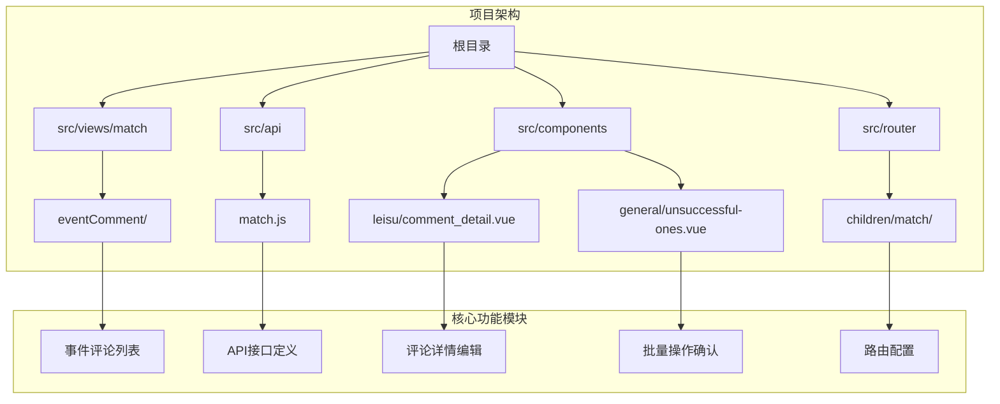
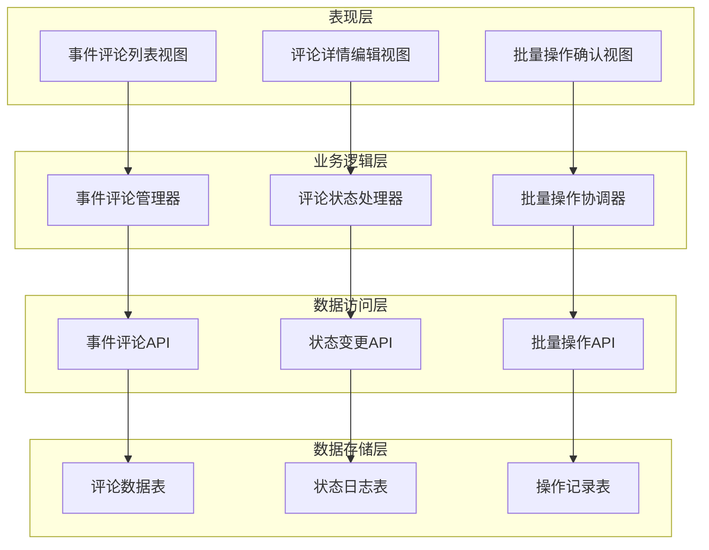
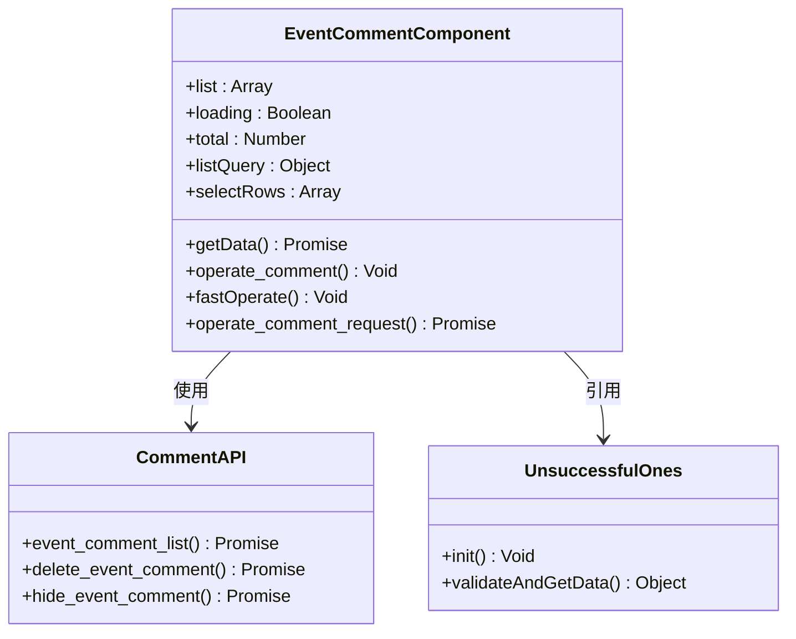
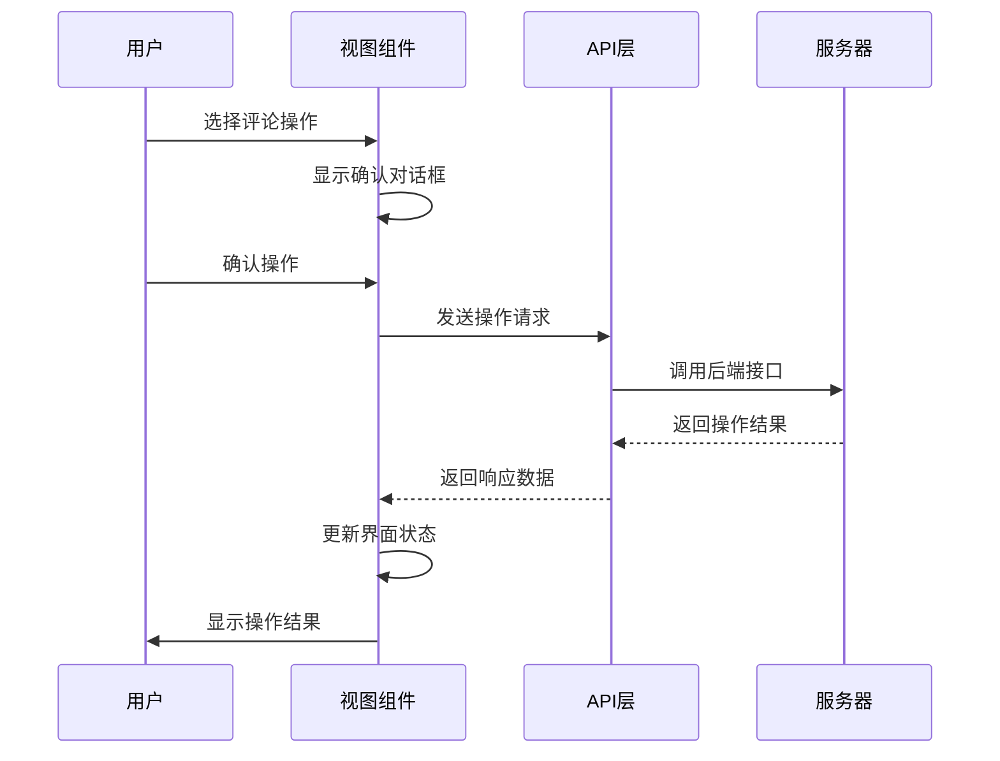
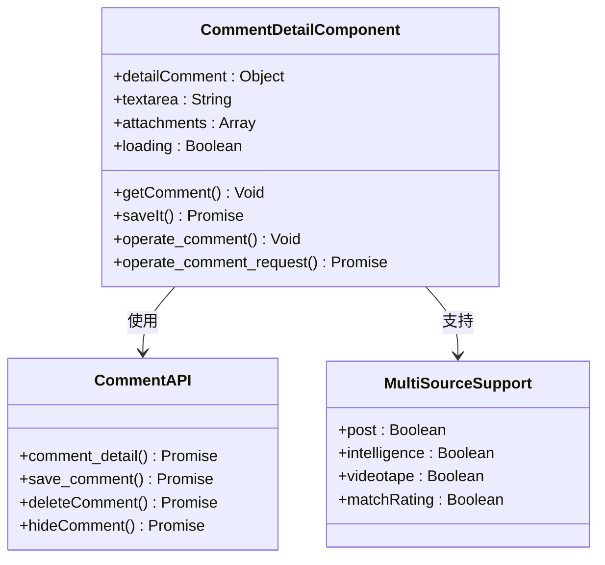
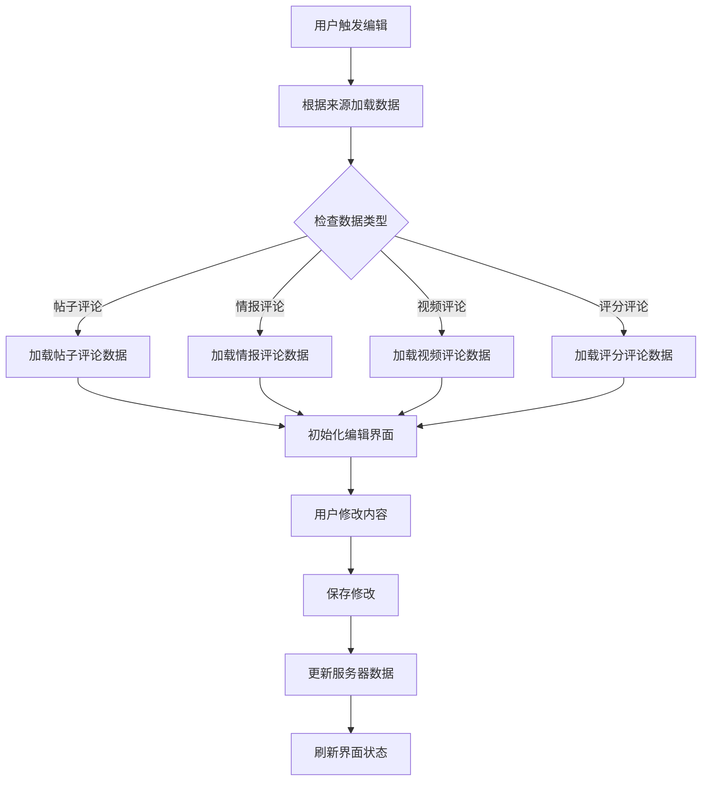
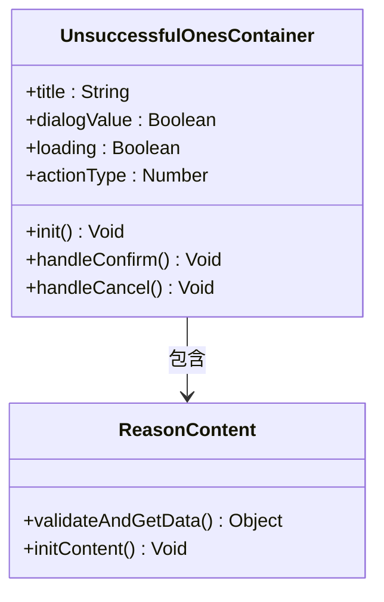
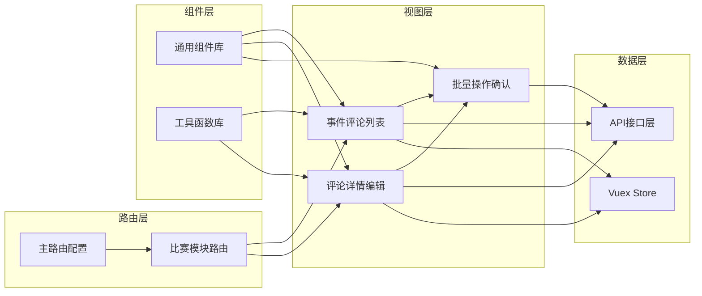

# 比赛事件评论管理

<cite>
**本文档引用的文件**
- [eventComment.vue](file://src/views/match/eventComment/eventComment.vue)
- [match.js](file://src/api/match.js)
- [comment_detail.vue](file://src/components/leisu/comment_detail.vue)
- [unsuccessful-ones.vue](file://src/components/general/unsuccessful-ones.vue)
- [index.js](file://src/router/children/match/index.js)
- [index.js](file://src/router/index.js)
- [index.js](file://src/store/index.js)
</cite>

## 目录
1. [简介](#简介)
2. [项目结构](#项目结构)
3. [核心组件](#核心组件)
4. [架构概览](#架构概览)
5. [详细组件分析](#详细组件分析)
6. [依赖关系分析](#依赖关系分析)
7. [性能考虑](#性能考虑)
8. [故障排除指南](#故障排除指南)
9. [结论](#结论)

## 简介

比赛事件评论管理系统是雷速体育后台管理平台中的一个核心功能模块，专门用于管理和监控比赛过程中的实时评论内容。该系统提供了完整的评论生命周期管理，包括评论的查看、编辑、删除、隐藏等操作，支持批量操作和精细化的权限控制。

系统采用现代化的前端技术栈，基于Vue.js框架构建，结合Element UI组件库，实现了响应式的设计和良好的用户体验。通过RESTful API与后端服务进行数据交互，确保了系统的可扩展性和维护性。

## 项目结构

比赛事件评论管理模块在整体项目架构中占据重要位置，主要分布在以下目录结构中：

**图表来源**
- [eventComment.vue:1-312](file://src/views/match/eventComment/eventComment.vue#L1-L312)
- [match.js:1102-1141](file://src/api/match.js#L1102-L1141)
- [comment_detail.vue:1-478](file://src/components/leisu/comment_detail.vue#L1-L478)

**章节来源**
- [eventComment.vue:1-312](file://src/views/match/eventComment/eventComment.vue#L1-L312)
- [match.js:1-800](file://src/api/match.js#L1-L800)

## 核心组件

### 事件评论列表组件

事件评论列表组件是整个系统的核心界面组件，提供了完整的评论管理功能：

- **数据展示**：支持分页加载、排序、筛选等功能
- **批量操作**：提供批量隐藏、批量删除、批量取消操作
- **状态标识**：通过颜色区分评论的不同状态（正常、隐藏、删除）
- **实时更新**：支持动态刷新评论列表数据

### API接口层

系统通过统一的API接口层管理所有与比赛事件评论相关的后端通信：

- **事件评论列表**：获取指定条件下的评论数据
- **删除操作**：支持单个或批量删除评论
- **隐藏操作**：支持单个或批量隐藏评论
- **状态管理**：提供完整的评论状态变更接口

### 评论详情编辑组件

评论详情编辑组件提供了丰富的编辑功能：

- **内容编辑**：支持富文本编辑和附件上传
- **状态管理**：提供删除和隐藏状态的切换
- **批量操作**：支持通过确认对话框进行批量操作
- **数据验证**：确保编辑操作的数据完整性

**章节来源**
- [eventComment.vue:141-308](file://src/views/match/eventComment/eventComment.vue#L141-L308)
- [match.js:1102-1141](file://src/api/match.js#L1102-L1141)
- [comment_detail.vue:196-478](file://src/components/leisu/comment_detail.vue#L196-L478)

## 架构概览

系统采用分层架构设计，确保了各组件间的松耦合和高内聚：

**图表来源**
- [eventComment.vue:193-307](file://src/views/match/eventComment/eventComment.vue#L193-L307)
- [comment_detail.vue:248-402](file://src/components/leisu/comment_detail.vue#L248-L402)

系统的核心流程包括：

1. **数据获取**：通过API接口从服务器获取评论数据
2. **状态管理**：维护评论的当前状态和历史记录
3. **用户交互**：提供直观的操作界面和反馈机制
4. **数据持久化**：确保所有操作都被正确记录和保存

## 详细组件分析

### 事件评论列表组件

事件评论列表组件是系统的主要入口点，具有以下关键特性：

**图表来源**
- [eventComment.vue:152-308](file://src/views/match/eventComment/eventComment.vue#L152-L308)
- [match.js:1102-1141](file://src/api/match.js#L1102-L1141)

#### 核心功能实现

组件通过以下方式实现核心功能：

1. **数据加载机制**：使用分页查询确保大数据量下的性能
2. **状态管理**：通过Vuex store管理全局状态
3. **批量操作**：提供高效的批量选择和批量处理功能
4. **实时更新**：支持操作后的数据刷新和状态更新

#### 操作流程

**图表来源**
- [eventComment.vue:207-274](file://src/views/match/eventComment/eventComment.vue#L207-L274)

**章节来源**
- [eventComment.vue:193-307](file://src/views/match/eventComment/eventComment.vue#L193-L307)

### 评论详情编辑组件

评论详情编辑组件提供了精细化的评论管理功能：

**图表来源**
- [comment_detail.vue:214-478](file://src/components/leisu/comment_detail.vue#L214-L478)

#### 多源支持机制

组件支持多种评论来源，包括：

- **帖子评论**：来自社区帖子的评论
- **情报评论**：来自新闻资讯的评论
- **视频评论**：来自比赛视频的评论
- **评分评论**：来自球员评分系统的评论

#### 数据处理流程

**图表来源**
- [comment_detail.vue:249-311](file://src/components/leisu/comment_detail.vue#L249-L311)

**章节来源**
- [comment_detail.vue:196-478](file://src/components/leisu/comment_detail.vue#L196-L478)

### 批量操作确认组件

批量操作确认组件提供了安全的操作保障机制：

**图表来源**
- [unsuccessful-ones.vue:23-85](file://src/components/general/unsuccessful-ones.vue#L23-L85)

#### 安全操作机制

组件通过以下方式确保操作的安全性：

1. **双重确认**：所有危险操作都需要二次确认
2. **原因收集**：要求操作者填写操作原因
3. **状态验证**：检查操作前后的状态变化
4. **错误处理**：提供完善的错误处理和回滚机制

**章节来源**
- [unsuccessful-ones.vue:1-98](file://src/components/general/unsuccessful-ones.vue#L1-L98)

## 依赖关系分析

系统各组件间的依赖关系体现了清晰的分层架构：

**图表来源**
- [index.js:31-177](file://src/router/index.js#L31-L177)
- [index.js:80-277](file://src/router/children/match/index.js#L80-L277)
- [index.js:1-26](file://src/store/index.js#L1-L26)

### 组件耦合度分析

系统在设计时充分考虑了组件间的解耦：

- **低耦合**：各组件间通过明确的接口进行通信
- **高内聚**：每个组件专注于特定的功能领域
- **可测试性**：组件设计便于单元测试和集成测试
- **可维护性**：清晰的职责划分便于后期维护

**章节来源**
- [index.js:1-177](file://src/router/index.js#L1-L177)
- [index.js:1-26](file://src/store/index.js#L1-L26)

## 性能考虑

系统在性能优化方面采用了多项策略：

### 数据加载优化

- **分页加载**：默认每页15条记录，避免一次性加载大量数据
- **懒加载**：评论详情在需要时才进行数据加载
- **缓存机制**：合理利用浏览器缓存减少重复请求

### 响应式设计

- **虚拟滚动**：对于大量数据的场景，考虑使用虚拟滚动技术
- **防抖处理**：对频繁触发的操作进行防抖处理
- **异步渲染**：长任务采用异步处理避免阻塞UI

### 网络优化

- **请求合并**：多个相关请求进行合并处理
- **超时控制**：设置合理的请求超时时间
- **错误重试**：网络异常时提供智能重试机制

## 故障排除指南

### 常见问题及解决方案

#### 评论列表加载失败

**问题现象**：事件评论列表无法加载或显示空白

**可能原因**：
1. 网络连接异常
2. API接口返回错误
3. 权限不足

**解决步骤**：
1. 检查网络连接状态
2. 查看浏览器开发者工具中的网络请求
3. 验证用户权限是否足够

#### 评论操作失败

**问题现象**：删除或隐藏评论操作无响应

**可能原因**：
1. 服务器响应超时
2. 操作权限不足
3. 数据状态冲突

**解决步骤**：
1. 检查操作确认对话框是否正确显示
2. 验证评论状态是否发生变化
3. 查看控制台是否有错误信息

#### 批量操作异常

**问题现象**：批量删除或隐藏操作失败

**可能原因**：
1. 选中项状态不一致
2. 服务器处理超时
3. 操作原因填写不完整

**解决步骤**：
1. 检查选中项的状态一致性
2. 确认操作原因字段已填写
3. 重新尝试操作

**章节来源**
- [eventComment.vue:207-274](file://src/views/match/eventComment/eventComment.vue#L207-L274)
- [comment_detail.vue:357-402](file://src/components/leisu/comment_detail.vue#L357-L402)

## 结论

比赛事件评论管理系统是一个功能完善、架构清晰的后台管理模块。系统通过合理的组件划分和接口设计，实现了评论管理的完整生命周期。

### 主要优势

1. **功能完整性**：涵盖了评论管理的所有核心功能
2. **用户体验良好**：提供直观的操作界面和及时的反馈
3. **安全性保障**：通过多重确认机制确保操作安全
4. **可扩展性强**：模块化设计便于功能扩展和维护

### 技术特点

- 采用Vue.js + Element UI的技术栈
- 实现了响应式和移动端适配
- 提供了完善的错误处理机制
- 支持多源评论数据的统一管理

### 改进建议

1. **性能优化**：可以考虑实现虚拟滚动以提升大数据量场景下的性能
2. **功能增强**：可以增加评论搜索和过滤功能
3. **监控完善**：可以增加操作日志和审计功能
4. **用户体验**：可以优化批量操作的反馈机制

该系统为雷速体育平台提供了可靠的评论管理能力，为内容运营和用户互动提供了强有力的技术支撑。