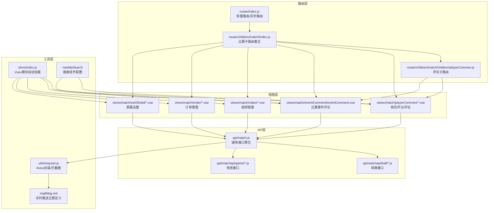
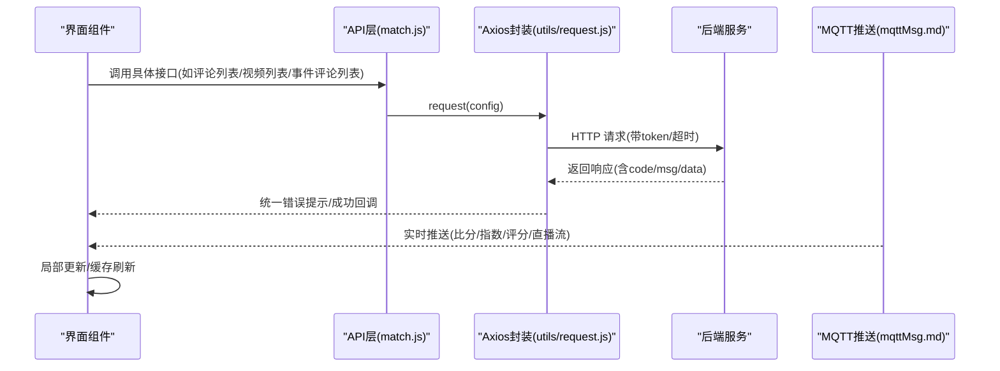
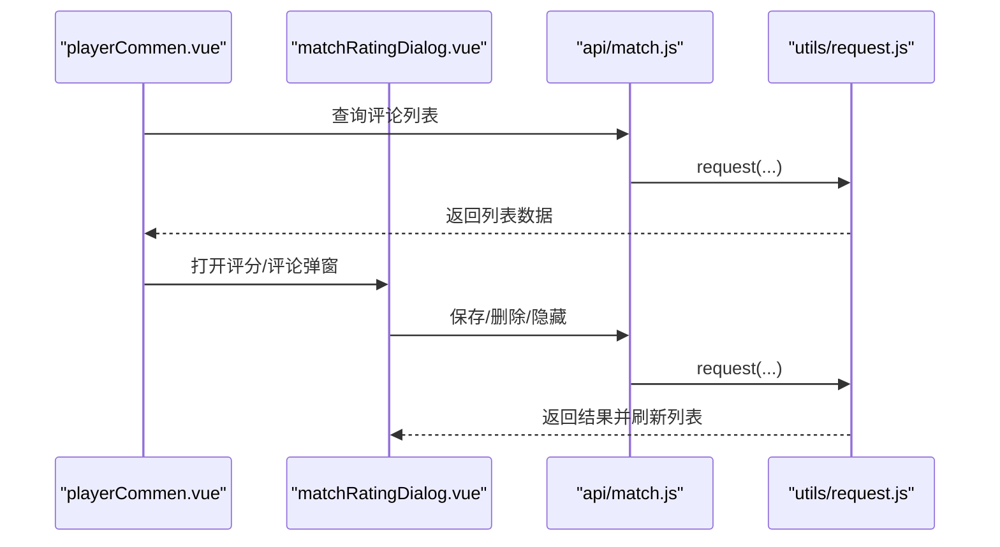
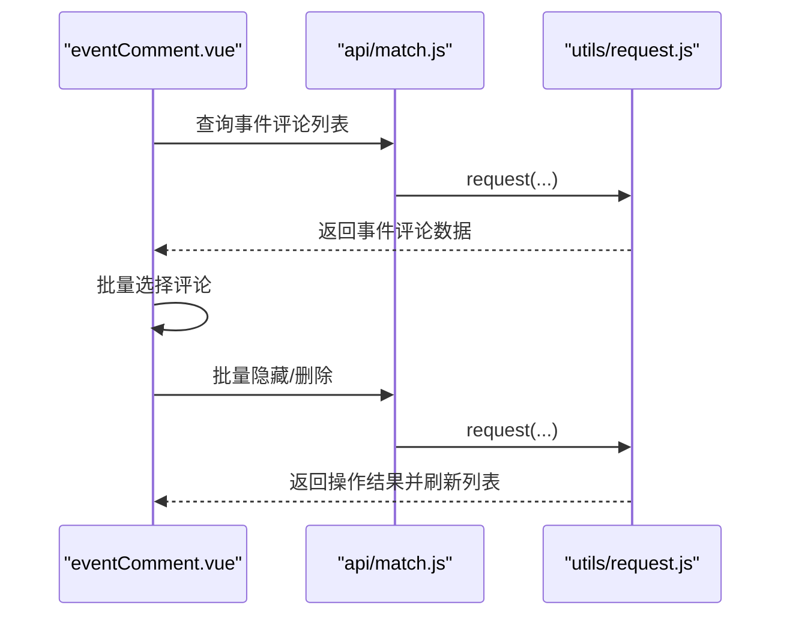
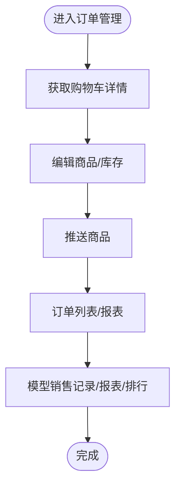
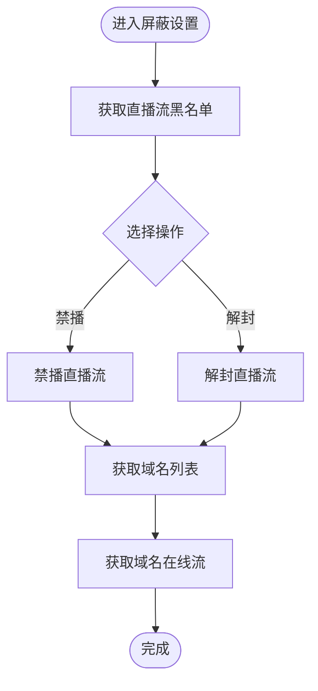
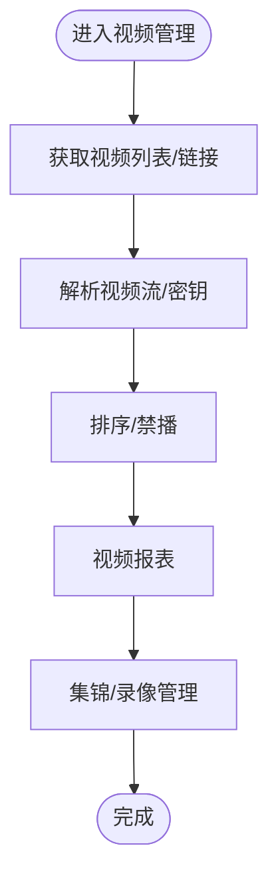
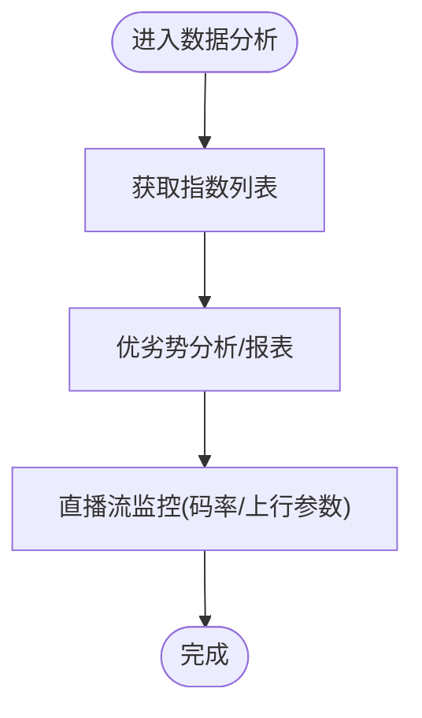
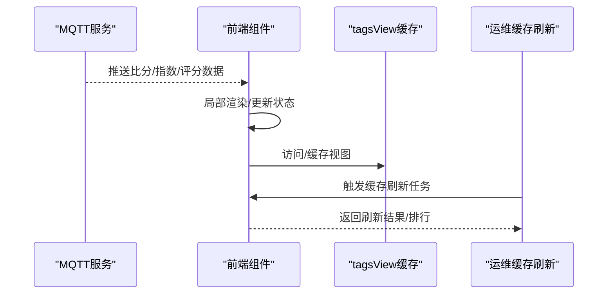
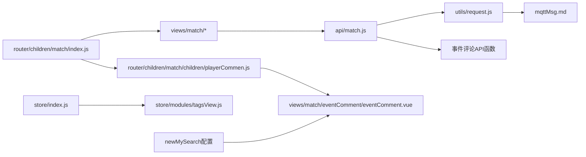

# 比赛数据操作

<cite>
**本文引用的文件**   
- [src/api/match.js](file://src/api/match.js)
- [src/api/matchapi/ball/football.js](file://src/api/matchapi/ball/football.js)
- [src/api/matchapi/ball/basketball.js](file://src/api/matchapi/ball/basketball.js)
- [src/api/matchapi/ball/volleyball.js](file://src/api/matchapi/ball/volleyball.js)
- [src/api/matchapi/ball/tennis.js](file://src/api/matchapi/ball/tennis.js)
- [src/api/matchapi/ball/pingpong.js](file://src/api/matchapi/ball/pingpong.js)
- [src/api/matchapi/ball/rugby.js](file://src/api/matchapi/ball/rugby.js)
- [src/api/matchapi/ball/baseball.js](file://src/api/matchapi/ball/baseball.js)
- [src/api/matchapi/ball/puck.js](file://src/api/matchapi/ball/puck.js)
- [src/api/matchapi/ball/cricket.js](file://src/api/matchapi/ball/cricket.js)
- [src/api/matchapi/ball/badminton.js](file://src/api/matchapi/ball/badminton.js)
- [src/api/matchapi/ball/snooker.js](file://src/api/matchapi/ball/snooker.js)
- [src/api/matchapi/game/lol.js](file://src/api/matchapi/game/lol.js)
- [src/api/matchapi/game/dota.js](file://src/api/matchapi/game/dota.js)
- [src/api/matchapi/game/csgo.js](file://src/api/matchapi/game/csgo.js)
- [src/api/matchapi/game/kog.js](file://src/api/matchapi/game/kog.js)
- [src/router/index.js](file://src/router/index.js)
- [src/router/children/match/index.js](file://src/router/children/match/index.js)
- [src/router/children/match/children/playerCommen.js](file://src/router/children/match/children/playerCommen.js)
- [src/utils/request.js](file://src/utils/request.js)
- [src/views/match/playerCommen/playerCommen.vue](file://src/views/match/playerCommen/playerCommen.vue)
- [src/views/match/playerCommen/player_commen_history.vue](file://src/views/match/playerCommen/player_commen_history.vue)
- [src/views/match/eventComment/eventComment.vue](file://src/views/match/eventComment/eventComment.vue)
- [src/components/matchRating/matchRatingDialog.vue](file://src/components/matchRating/matchRatingDialog.vue)
- [src/components/matchRating/playerCommentDialog.vue](file://src/components/matchRating/playerCommentDialog.vue)
- [public/mqttMsg.md](file://public/mqttMsg.md)
- [src/store/index.js](file://src/store/index.js)
- [src/store/modules/tagsView.js](file://src/store/modules/tagsView.js)
- [src/views/ops_tools/cacheRefresh.vue](file://src/views/ops_tools/cacheRefresh.vue)
- [src/api/matchapi/ball/cricket.js](file://src/api/matchapi/ball/cricket.js)
- [src/components/jumpTo/jumpTc.vue](file://src/components/jumpTo/jumpTc.vue)
- [src/views/intelligence/intelligence.vue](file://src/views/intelligence/intelligence.vue)
- [src/components/newMySearch/components/searchKey/compKey/match.js](file://src/components/newMySearch/components/searchKey/compKey/match.js)
</cite>

## 更新摘要
**变更内容**   
- 新增比赛事件评论管理功能模块
- 扩展评论管理能力，包含事件评论与球员评分评论
- 增加事件评论的API接口与路由配置
- 完善评论管理的搜索与筛选功能

## 目录
1. [简介](#简介)
2. [项目结构](#项目结构)
3. [核心组件](#核心组件)
4. [架构总览](#架构总览)
5. [详细组件分析](#详细组件分析)
6. [依赖分析](#依赖分析)
7. [性能考虑](#性能考虑)
8. [故障排查指南](#故障排查指南)
9. [结论](#结论)
10. [附录](#附录)

## 简介
本技术文档围绕"比赛数据操作"主题，系统梳理前端对比赛数据的综合管理能力，涵盖以下方面：
- 球员评分与评论：查看、编辑、删除、隐藏、导出、报表、批量操作
- **新增** 比赛事件评论管理：事件卡片评论的统一管理与控制
- 订单管理（购物车/直播购买）：订单列表、报表、销售记录
- 屏蔽设置：直播流黑名单、禁播/解封、域名级在线流管理
- 视频管理：视频源列表、解析、排序、禁播、报表、集锦/录像管理
- 数据分析：指数（欧指/亚指/半场）、优劣势分析、直播流质量监控
- 实时更新与缓存：MQTT 实时推送、页面缓存刷新工具
- API 设计：RESTful 接口规范、参数校验、错误处理
- 业务场景示例：典型操作流程与最佳实践

## 项目结构
该系统采用前端模块化组织，围绕"比赛"子路由聚合各类体育与电竞的管理能力；API 层统一通过 axios 封装的 request 发起请求；实时数据通过 MQTT 主题推送。

**图表来源**
- [src/router/index.js:1-177](file://src/router/index.js#L1-L177)
- [src/router/children/match/index.js:1-277](file://src/router/children/match/index.js#L1-L277)
- [src/router/children/match/children/playerCommen.js:1-30](file://src/router/children/match/children/playerCommen.js#L1-L30)
- [src/api/match.js:1-1142](file://src/api/match.js#L1-L1142)
- [src/utils/request.js:1-130](file://src/utils/request.js#L1-L130)
- [public/mqttMsg.md:1-88](file://public/mqttMsg.md#L1-L88)
- [src/store/index.js:1-26](file://src/store/index.js#L1-L26)

**章节来源**
- [src/router/index.js:1-177](file://src/router/index.js#L1-L177)
- [src/router/children/match/index.js:1-277](file://src/router/children/match/index.js#L1-L277)
- [src/router/children/match/children/playerCommen.js:1-30](file://src/router/children/match/children/playerCommen.js#L1-L30)
- [src/api/match.js:1-1142](file://src/api/match.js#L1-L1142)
- [src/utils/request.js:1-130](file://src/utils/request.js#L1-L130)
- [public/mqttMsg.md:1-88](file://public/mqttMsg.md#L1-L88)
- [src/store/index.js:1-26](file://src/store/index.js#L1-L26)

## 核心组件
- 球员评分与评论
  - 列表展示、筛选、排序、批量操作（隐藏/删除/取消）
  - 详情弹窗、编辑、导出、报表
  - 关联接口：评论列表、保存、删除、隐藏、点赞详情、评分评论相关
- **新增** 比赛事件评论管理
  - 事件卡片评论的统一管理，支持按事件卡片ID筛选
  - 用户信息展示、内容预览、状态管理（正常/隐藏/删除）
  - 批量操作：批量隐藏、批量删除、批量取消隐藏、批量取消删除
  - 点赞统计、楼层标识、IP归属地显示
  - 关联接口：事件评论列表、保存、删除、隐藏、点赞
- 订单管理
  - 购物车/直播购买：订单列表、报表、销售记录
  - 关联接口：购物车详情、保存、库存、推送、订单报表
- 屏蔽设置
  - 直播流黑名单、禁播/解封、域名级在线流
  - 关联接口：直播流黑名单、禁播、解封、域名列表、在线流
- 视频管理
  - 视频源列表、解析、排序、禁播、报表、集锦/录像管理
  - 关联接口：视频URL、视频链接、解析、排序、禁播、报表、集锦列表、更新、隐藏、删除
- 数据分析
  - 指数（欧指/亚指/半场/纳米）、优劣势分析、直播流质量监控
  - 关联接口：指数列表、半场指数、纳米指数、优劣势分析、直播流监控
- 实时更新与缓存
  - MQTT 实时推送主题覆盖各球类/电竞比分、指数、评分、阵容等
  - 页面缓存刷新工具用于运维场景

**章节来源**
- [src/views/match/playerCommen/playerCommen.vue:1-200](file://src/views/match/playerCommen/playerCommen.vue#L1-L200)
- [src/views/match/playerCommen/player_commen_history.vue:108-154](file://src/views/match/playerCommen/player_commen_history.vue#L108-L154)
- [src/views/match/eventComment/eventComment.vue:1-312](file://src/views/match/eventComment/eventComment.vue#L1-L312)
- [src/components/matchRating/matchRatingDialog.vue:735-782](file://src/components/matchRating/matchRatingDialog.vue#L735-L782)
- [src/api/match.js:1-1142](file://src/api/match.js#L1-L1142)
- [public/mqttMsg.md:1-88](file://public/mqttMsg.md#L1-L88)
- [src/views/ops_tools/cacheRefresh.vue:87-129](file://src/views/ops_tools/cacheRefresh.vue#L87-L129)

## 架构总览
前端通过统一的 Axios 封装发起请求，按模块拆分接口，再由路由聚合到"比赛"子菜单下。实时数据通过 MQTT 主题推送，页面根据主题订阅进行局部更新或提示。

**图表来源**
- [src/api/match.js:1-1142](file://src/api/match.js#L1-L1142)
- [src/utils/request.js:1-130](file://src/utils/request.js#L1-L130)
- [public/mqttMsg.md:1-88](file://public/mqttMsg.md#L1-L88)

## 详细组件分析

### 球员评分与评论模块
- 功能要点
  - 列表：支持筛选、排序、分页、批量操作（隐藏/删除/取消）
  - 详情：弹窗查看评分与评论详情，支持编辑、保存、删除、隐藏、点赞详情
  - 报表与导出：支持报表查看与导出 Excel
- 关键接口
  - 评论列表、历史列表、保存、删除、隐藏、点赞详情、评分评论相关
- 交互流程

**图表来源**
- [src/views/match/playerCommen/playerCommen.vue:1-200](file://src/views/match/playerCommen/playerCommen.vue#L1-L200)
- [src/components/matchRating/matchRatingDialog.vue:735-782](file://src/components/matchRating/matchRatingDialog.vue#L735-L782)
- [src/api/match.js:612-699](file://src/api/match.js#L612-L699)
- [src/utils/request.js:1-130](file://src/utils/request.js#L1-L130)

**章节来源**
- [src/views/match/playerCommen/playerCommen.vue:1-200](file://src/views/match/playerCommen/playerCommen.vue#L1-L200)
- [src/views/match/playerCommen/player_commen_history.vue:108-154](file://src/views/match/playerCommen/player_commen_history.vue#L108-L154)
- [src/components/matchRating/matchRatingDialog.vue:735-782](file://src/components/matchRating/matchRatingDialog.vue#L735-L782)
- [src/api/match.js:612-699](file://src/api/match.js#L612-L699)

### **新增** 比赛事件评论管理模块
- 功能要点
  - 事件卡片评论的统一管理，支持按事件卡片ID筛选
  - 用户信息展示、内容预览、状态管理（正常/隐藏/删除）
  - 批量操作：批量隐藏、批量删除、批量取消隐藏、批量取消删除
  - 点赞统计、楼层标识、IP归属地显示
  - 支持按发布时间排序、点赞数筛选、用户ID搜索
- 关键接口
  - 事件评论列表：`event_comment_list`
  - 保存事件评论：`save_event_comment`
  - 删除事件评论：`delete_event_comment`
  - 隐藏事件评论：`hide_event_comment`
  - 点赞事件评论：`like_event_comment`
- 交互流程

**图表来源**
- [src/views/match/eventComment/eventComment.vue:1-312](file://src/views/match/eventComment/eventComment.vue#L1-L312)
- [src/api/match.js:1102-1141](file://src/api/match.js#L1102-L1141)
- [src/utils/request.js:1-130](file://src/utils/request.js#L1-L130)

**章节来源**
- [src/views/match/eventComment/eventComment.vue:1-312](file://src/views/match/eventComment/eventComment.vue#L1-L312)
- [src/api/match.js:1102-1141](file://src/api/match.js#L1102-L1141)

### 订单管理（购物车/直播购买）
- 功能要点
  - 购物车详情、商品编辑、库存管理、推送
  - 订单列表、报表、销售记录、模型销售
- 关键接口
  - 购物车详情、保存、库存、推送
  - 订单列表、报表、销售记录、模型销售

**图表来源**
- [src/api/match.js:56-109](file://src/api/match.js#L56-L109)
- [src/api/match.js:717-740](file://src/api/match.js#L717-L740)

**章节来源**
- [src/api/match.js:56-109](file://src/api/match.js#L56-L109)
- [src/api/match.js:717-740](file://src/api/match.js#L717-L740)

### 屏蔽设置（直播流/域名）
- 功能要点
  - 直播流黑名单、禁播/解封
  - 域名级在线流管理、域名列表
- 关键接口
  - 直播流黑名单、禁播、解封、域名列表、在线流

**图表来源**
- [src/api/match.js:271-418](file://src/api/match.js#L271-L418)

**章节来源**
- [src/api/match.js:271-418](file://src/api/match.js#L271-L418)

### 视频管理（视频源/解析/集锦）
- 功能要点
  - 视频源列表、解析、排序、禁播
  - 视频报表、集锦/录像管理（列表、更新、隐藏、删除）
- 关键接口
  - 视频URL/链接、解析、排序、禁播、报表、集锦列表、更新、隐藏、删除

**图表来源**
- [src/api/match.js:160-311](file://src/api/match.js#L160-L311)

**章节来源**
- [src/api/match.js:160-311](file://src/api/match.js#L160-L311)

### 数据分析（指数/优劣势/直播流监控）
- 功能要点
  - 指数：欧指/亚指/半场/纳米、电竞指数
  - 优劣势分析：列表、报表、收入报表、首购报表
  - 直播流监控：码率、上行音视频参数
- 关键接口
  - 指数列表、半场指数、纳米指数、优劣势分析、直播流监控

**图表来源**
- [src/api/match.js:126-158](file://src/api/match.js#L126-L158)
- [src/api/match.js:321-360](file://src/api/match.js#L321-L360)
- [src/api/match.js:701-716](file://src/api/match.js#L701-L716)

**章节来源**
- [src/api/match.js:126-158](file://src/api/match.js#L126-L158)
- [src/api/match.js:321-360](file://src/api/match.js#L321-L360)
- [src/api/match.js:701-716](file://src/api/match.js#L701-L716)

### 实时更新机制与缓存策略
- 实时更新
  - 通过 MQTT 主题推送比分、指数、评分、阵容等数据
  - 前端根据主题订阅进行局部更新
- 缓存策略
  - 页面级缓存：tagsView 模块维护访问历史与缓存
  - 运维缓存刷新：提供缓存任务信息与排行榜查看

**图表来源**
- [public/mqttMsg.md:1-88](file://public/mqttMsg.md#L1-L88)
- [src/store/modules/tagsView.js:90-123](file://src/store/modules/tagsView.js#L90-L123)
- [src/views/ops_tools/cacheRefresh.vue:87-129](file://src/views/ops_tools/cacheRefresh.vue#L87-L129)

**章节来源**
- [public/mqttMsg.md:1-88](file://public/mqttMsg.md#L1-L88)
- [src/store/modules/tagsView.js:90-123](file://src/store/modules/tagsView.js#L90-L123)
- [src/views/ops_tools/cacheRefresh.vue:87-129](file://src/views/ops_tools/cacheRefresh.vue#L87-L129)

## 依赖分析
- 路由依赖
  - "比赛"子路由聚合了球类、电竞、视频、订单、屏蔽、分析等模块
  - **新增** 评论子路由包含球员评分评论和比赛事件评论两个功能
- API 依赖
  - 通用接口集中于 match.js，按 sport/game 类别拆分至对应文件
  - **新增** 事件评论相关API函数：`event_comment_list`、`save_event_comment`、`delete_event_comment`、`hide_event_comment`、`like_event_comment`
- 工具依赖
  - request.js 提供统一拦截器、错误提示、超时控制
  - mqttMsg.md 定义实时推送主题，指导前端订阅与处理
  - **新增** newMySearch 组件配置支持事件评论的搜索字段
- 状态管理
  - store 自动加载 modules，tagsView 维护缓存与标签页

**图表来源**
- [src/router/children/match/index.js:1-277](file://src/router/children/match/index.js#L1-L277)
- [src/router/children/match/children/playerCommen.js:1-30](file://src/router/children/match/children/playerCommen.js#L1-L30)
- [src/api/match.js:1-1142](file://src/api/match.js#L1-L1142)
- [src/utils/request.js:1-130](file://src/utils/request.js#L1-L130)
- [public/mqttMsg.md:1-88](file://public/mqttMsg.md#L1-L88)
- [src/store/index.js:1-26](file://src/store/index.js#L1-L26)
- [src/store/modules/tagsView.js:90-123](file://src/store/modules/tagsView.js#L90-L123)
- [src/components/newMySearch/components/searchKey/compKey/match.js:428-436](file://src/components/newMySearch/components/searchKey/compKey/match.js#L428-L436)

**章节来源**
- [src/router/children/match/index.js:1-277](file://src/router/children/match/index.js#L1-L277)
- [src/router/children/match/children/playerCommen.js:1-30](file://src/router/children/match/children/playerCommen.js#L1-L30)
- [src/api/match.js:1-1142](file://src/api/match.js#L1-L1142)
- [src/utils/request.js:1-130](file://src/utils/request.js#L1-L130)
- [public/mqttMsg.md:1-88](file://public/mqttMsg.md#L1-L88)
- [src/store/index.js:1-26](file://src/store/index.js#L1-L26)
- [src/store/modules/tagsView.js:90-123](file://src/store/modules/tagsView.js#L90-L123)
- [src/components/newMySearch/components/searchKey/compKey/match.js:428-436](file://src/components/newMySearch/components/searchKey/compKey/match.js#L428-L436)

## 性能考虑
- 请求优化
  - 使用统一拦截器设置 token、超时，避免重复配置
  - 对大列表使用分页与排序条件，减少一次性传输
- 实时性
  - MQTT 主题推送降低轮询成本，提升交互体验
- 缓存
  - tagsView 缓存已访问视图，减少重复渲染
  - 运维提供缓存刷新工具，便于在数据变更后快速生效
- **新增** 事件评论管理优化
  - 支持批量操作减少多次请求
  - 搜索条件优化，支持按事件卡片ID精确匹配
  - 状态列高亮显示，提升视觉识别效率

## 故障排查指南
- 常见错误与处理
  - 401 未授权：检查 token 是否存在与有效
  - 403 拒绝访问：确认权限角色是否具备相应菜单/按钮权限
  - 404 接口不存在：核对接口路径与版本
  - 500/502/504：服务异常，查看后端日志与网关状态
- 统一错误提示
  - request.js 在响应拦截器中统一提示错误信息，便于定位问题
- 权限与路由
  - "比赛"子路由定义了大量权限点，若出现无权限提示，需检查角色权限
  - **新增** 事件评论功能需要 `match_player_comment_list` 权限
- **新增** 事件评论管理故障排查
  - 事件评论列表为空：检查事件卡片ID是否正确，确认事件评论是否存在
  - 批量操作失败：确认所选评论的状态是否允许当前操作
  - 搜索无结果：检查搜索条件是否过于严格，尝试放宽筛选条件

**章节来源**
- [src/utils/request.js:45-127](file://src/utils/request.js#L45-L127)
- [src/router/children/match/index.js:80-277](file://src/router/children/match/index.js#L80-L277)
- [src/router/children/match/children/playerCommen.js:8-14](file://src/router/children/match/children/playerCommen.js#L8-L14)

## 结论
本系统通过清晰的路由与模块划分，结合统一的 API 封装与实时推送机制，实现了对比赛数据的全链路管理。围绕球员评分、**新增的事件评论管理**、订单、屏蔽、视频与数据分析的核心能力，配合批量操作、报表导出与缓存刷新工具，能够满足运营与管理的高频需求。新增的事件评论管理功能进一步完善了评论体系，提供了更细粒度的内容管理能力。建议在后续迭代中进一步完善参数校验与事务一致性保障，持续优化实时更新与缓存策略。

## 附录

### API 接口设计规范（示例）
- 统一规范
  - 方法：POST/GET
  - 参数：通过 data 或 URL 参数传递
  - 响应：统一返回 { code, msg, data }
  - 错误：拦截器统一提示，必要时抛出异常
- **新增** 事件评论相关接口
  - 事件评论列表：POST `/v1/admin/match/common/event_comment_list`
  - 保存事件评论：POST `/v1/admin/match/common/save_event_comment`
  - 删除事件评论：POST `/v1/admin/match/common/delete_event_comment`
  - 隐藏事件评论：POST `/v1/admin/match/common/hide_event_comment`
  - 点赞事件评论：POST `/v1/admin/match/common/like_event_comment`
- 示例接口（命名参考）
  - 评论列表：POST `/v1/admin/match/common/player_comment_list`
  - 保存评论：POST `/v1/admin/match/common/save_player_comment`
  - 删除评论：POST `/v1/admin/match/common/player_comment_delete`
  - 视频列表：POST `/v1/admin/match/common/match_video_list`
  - 指数列表：POST `/v1/admin/match/common/odds_list`
  - 实时推送主题：参考 mqttMsg.md 中各 sport/game 的主题定义

**章节来源**
- [src/api/match.js:1-1142](file://src/api/match.js#L1-L1142)
- [src/utils/request.js:1-130](file://src/utils/request.js#L1-L130)
- [public/mqttMsg.md:1-88](file://public/mqttMsg.md#L1-L88)

### 业务场景示例
- 场景一：批量隐藏/删除球员评分评论
  - 步骤：勾选列表项 → 批量隐藏/删除 → 确认弹窗 → 成功提示 → 刷新列表
  - 关联组件：playerCommen.vue、matchRatingDialog.vue、api/match.js
- 场景二：批量隐藏/删除比赛事件评论
  - 步骤：进入事件评论管理 → 勾选事件评论 → 批量隐藏/删除 → 输入原因 → 确认操作 → 刷新列表
  - 关联组件：eventComment.vue、api/match.js
- 场景三：直播流禁播/解封
  - 步骤：进入屏蔽设置 → 获取黑名单 → 选择禁播/解封 → 刷新域名在线流
  - 关联接口：直播流黑名单、禁播、解封、域名在线流
- 场景四：视频源解析与排序
  - 步骤：获取视频链接 → 解析密钥 → 排序/禁播 → 查看报表
  - 关联接口：视频链接、解析、排序、禁播、报表

**章节来源**
- [src/views/match/playerCommen/playerCommen.vue:1-200](file://src/views/match/playerCommen/playerCommen.vue#L1-L200)
- [src/views/match/eventComment/eventComment.vue:1-312](file://src/views/match/eventComment/eventComment.vue#L1-L312)
- [src/components/matchRating/matchRatingDialog.vue:735-782](file://src/components/matchRating/matchRatingDialog.vue#L735-L782)
- [src/api/match.js:160-311](file://src/api/match.js#L160-L311)
- [src/api/match.js:271-418](file://src/api/match.js#L271-L418)