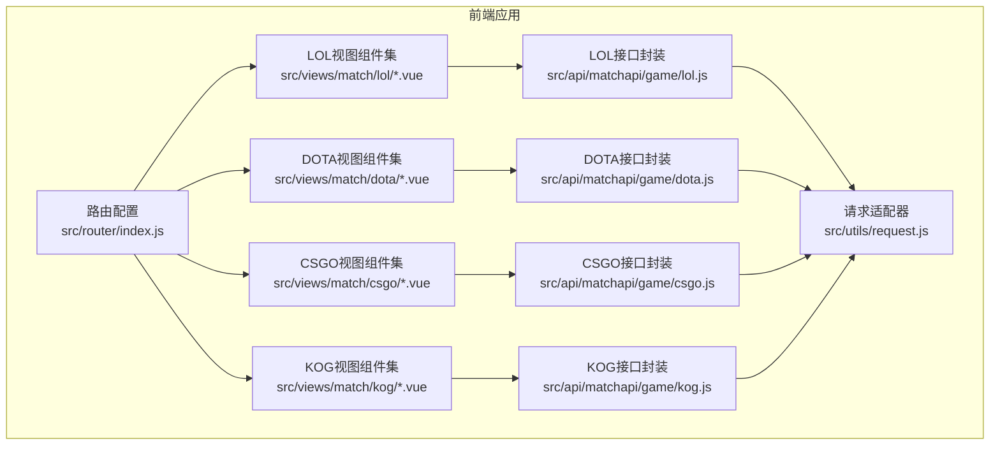
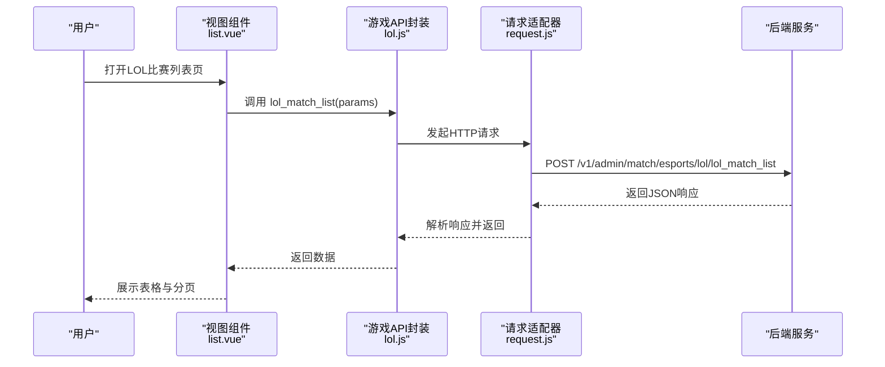
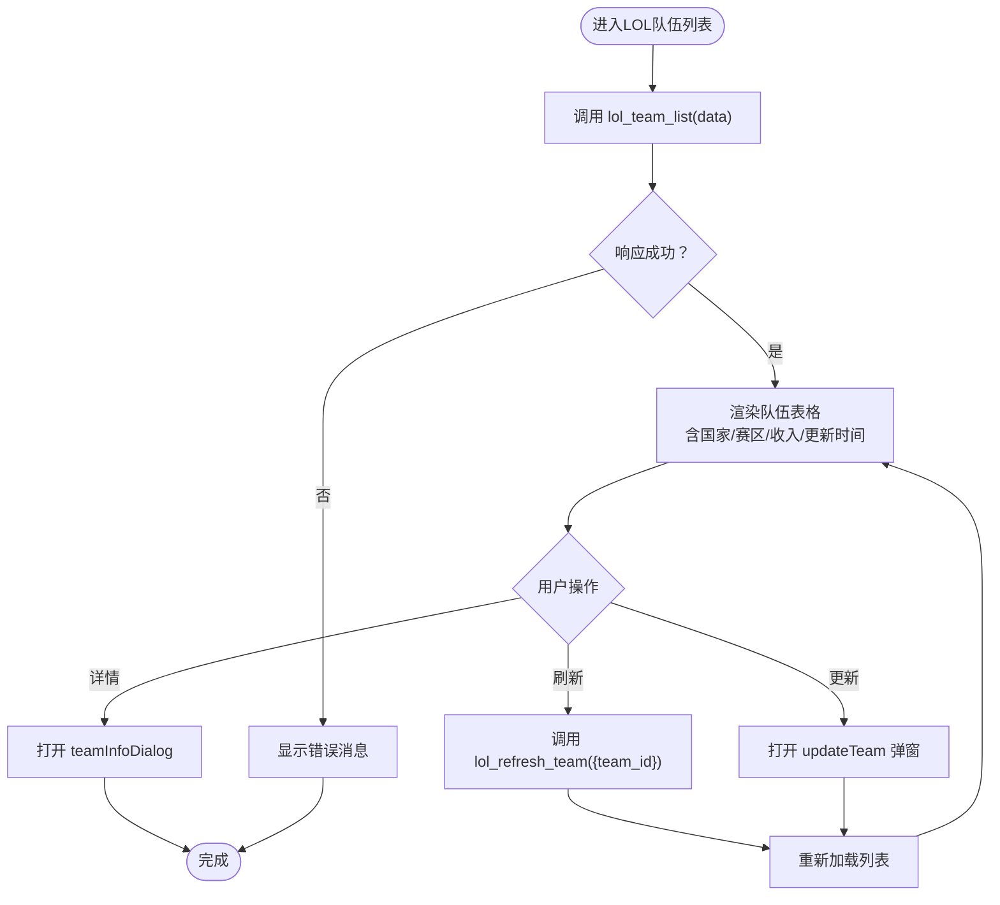
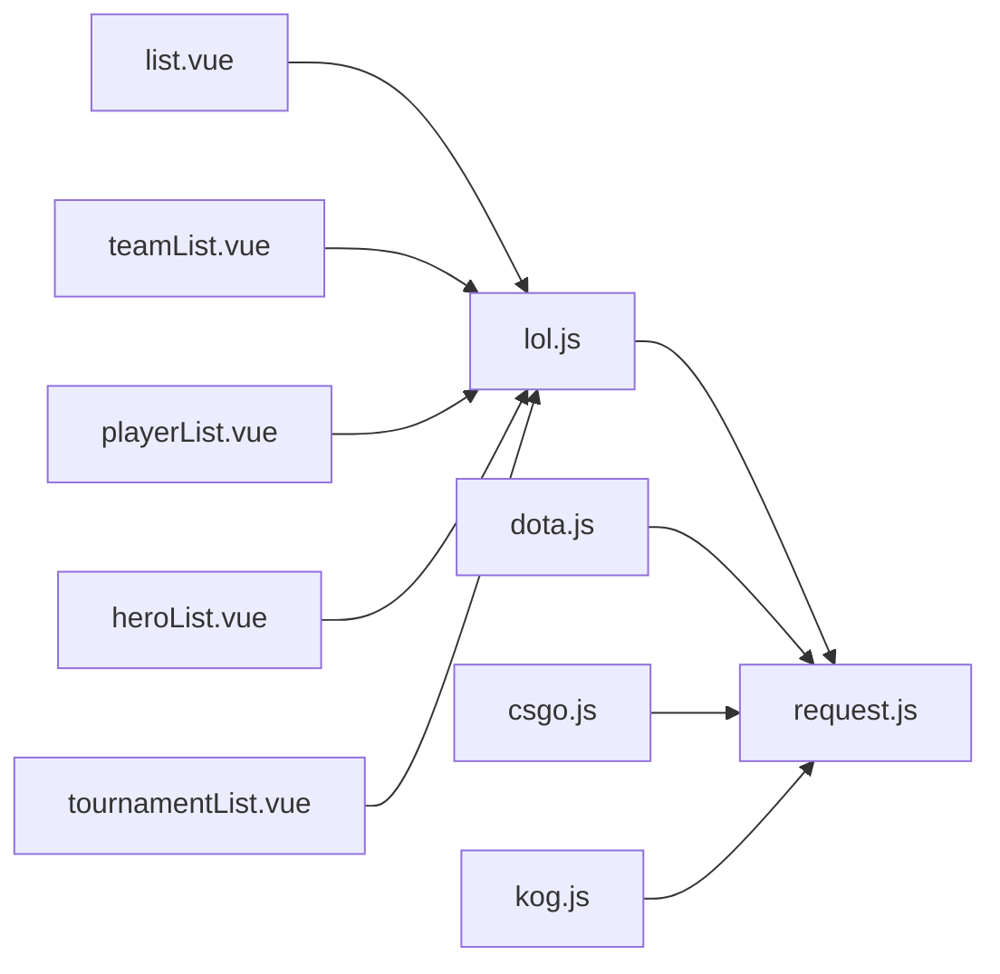

# 电子竞技数据管理

<cite>
**本文引用的文件**
- [src/api/matchapi/game/lol.js](file://src/api/matchapi/game/lol.js)
- [src/api/matchapi/game/dota.js](file://src/api/matchapi/game/dota.js)
- [src/api/matchapi/game/csgo.js](file://src/api/matchapi/game/csgo.js)
- [src/api/matchapi/game/kog.js](file://src/api/matchapi/game/kog.js)
- [src/utils/request.js](file://src/utils/request.js)
- [src/router/index.js](file://src/router/index.js)
- [src/views/match/lol/list.vue](file://src/views/match/lol/list.vue)
- [src/views/match/lol/teamList.vue](file://src/views/match/lol/teamList.vue)
- [src/views/match/lol/playerList.vue](file://src/views/match/lol/playerList.vue)
- [src/views/match/lol/heroList.vue](file://src/views/match/lol/heroList.vue)
- [src/views/match/lol/tournamentList.vue](file://src/views/match/lol/tournamentList.vue)
</cite>

## 目录
1. [简介](#简介)
2. [项目结构](#项目结构)
3. [核心组件](#核心组件)
4. [架构总览](#架构总览)
5. [详细组件分析](#详细组件分析)
6. [依赖关系分析](#依赖关系分析)
7. [性能考量](#性能考量)
8. [故障排查指南](#故障排查指南)
9. [结论](#结论)
10. [附录](#附录)

## 简介
本技术文档面向电子竞技数据管理功能，聚焦于主流电竞游戏（LOL、DOTA、CSGO、KOG）的数据模型与业务实现。文档从系统架构、数据模型、实时同步机制、数据分析能力到API接口与数据处理流程进行全面阐述，帮助开发者快速构建与扩展完整的电竞数据管理体系。

## 项目结构
该工程采用前端单页应用（Vue）组织，围绕“游戏API封装 + 视图组件 + 路由配置”的分层结构展开：
- API层：按游戏拆分接口模块，统一通过请求适配器发送HTTP请求
- 视图层：各游戏的列表、队伍、选手、英雄、赛事等管理界面
- 路由层：集中定义模块化路由，支撑多游戏数据管理入口

图表来源
- [src/router/index.js:1-177](file://src/router/index.js#L1-L177)
- [src/api/matchapi/game/lol.js:1-289](file://src/api/matchapi/game/lol.js#L1-L289)
- [src/api/matchapi/game/dota.js:1-290](file://src/api/matchapi/game/dota.js#L1-L290)
- [src/api/matchapi/game/csgo.js:1-254](file://src/api/matchapi/game/csgo.js#L1-L254)
- [src/api/matchapi/game/kog.js:1-199](file://src/api/matchapi/game/kog.js#L1-L199)
- [src/utils/request.js:1-130](file://src/utils/request.js#L1-L130)

章节来源
- [src/router/index.js:1-177](file://src/router/index.js#L1-L177)

## 核心组件
- 请求适配器（Axios拦截器）
  - 自动注入token头，统一处理响应状态码与错误消息，支持跨域与超时配置
  - 依据运行环境自动切换基础URL与MQTT地址
- 游戏API封装（LOL/DOTA/CSGO/KOG）
  - 统一导出各游戏的列表查询、实体更新、资料库刷新、热门赛事权重调整、评分查询等方法
  - 方法命名规范清晰，便于在视图层直接调用
- 视图组件（以LOL为例）
  - 比赛列表、队伍列表、选手列表、英雄列表、赛事列表等，均具备搜索、排序、分页、刷新等功能

章节来源
- [src/utils/request.js:1-130](file://src/utils/request.js#L1-L130)
- [src/api/matchapi/game/lol.js:1-289](file://src/api/matchapi/game/lol.js#L1-L289)
- [src/views/match/lol/list.vue:1-311](file://src/views/match/lol/list.vue#L1-L311)
- [src/views/match/lol/teamList.vue:1-241](file://src/views/match/lol/teamList.vue#L1-L241)
- [src/views/match/lol/playerList.vue:1-271](file://src/views/match/lol/playerList.vue#L1-L271)
- [src/views/match/lol/heroList.vue:1-164](file://src/views/match/lol/heroList.vue#L1-L164)
- [src/views/match/lol/tournamentList.vue:1-294](file://src/views/match/lol/tournamentList.vue#L1-L294)

## 架构总览
前端通过路由加载对应游戏的视图组件，组件通过API封装调用后端接口；请求适配器负责统一鉴权、错误提示与环境切换。各游戏的API封装遵循一致的命名与参数约定，便于横向扩展。

图表来源
- [src/views/match/lol/list.vue:128-221](file://src/views/match/lol/list.vue#L128-L221)
- [src/api/matchapi/game/lol.js:7-13](file://src/api/matchapi/game/lol.js#L7-L13)
- [src/utils/request.js:22-68](file://src/utils/request.js#L22-L68)

## 详细组件分析

### LOL数据管理组件
- 比赛列表（list.vue）
  - 功能要点：日期范围筛选、关键字搜索（比赛ID/队伍ID/赛事ID/状态）、排序、分页、定位进行中、报表查看、直播图表联动
  - 关键调用：lol_match_list(query) 获取数据，支持时间戳转换与条件过滤
- 队伍列表（teamList.vue）
  - 功能要点：队伍信息展示（名称、简称、国家、赛区、收入）、刷新资料库、更新队伍信息、队伍详情弹窗
  - 关键调用：lol_team_list(data)、lol_refresh_team({team_id})、updateTeam组件
- 选手列表（playerList.vue）
  - 功能要点：位置标签、首发/替补、服役状态、队伍归属、国籍信息、数据更新时间
  - 关键调用：lol_player_list(data)、playerInfoDialog组件
- 英雄列表（heroList.vue）
  - 功能要点：英雄图标、称号、属性统计、更新时间
  - 关键调用：lol_hero_list(data)
- 赛事列表（tournamentList.vue）
  - 功能要点：赛事类型/状态筛选、图标/封面展示、奖池、时间区间、权重编辑与保存、刷新资料库、更新赛事信息
  - 关键调用：lol_tournament_list(data)、lol_refresh_tournament({tournament_id})、lol_update_hot_tournament(data)

图表来源
- [src/views/match/lol/teamList.vue:138-207](file://src/views/match/lol/teamList.vue#L138-L207)
- [src/api/matchapi/game/lol.js:15-21](file://src/api/matchapi/game/lol.js#L15-L21)
- [src/api/matchapi/game/lol.js:138-144](file://src/api/matchapi/game/lol.js#L138-L144)

章节来源
- [src/views/match/lol/list.vue:128-308](file://src/views/match/lol/list.vue#L128-L308)
- [src/views/match/lol/teamList.vue:138-238](file://src/views/match/lol/teamList.vue#L138-L238)
- [src/views/match/lol/playerList.vue:181-268](file://src/views/match/lol/playerList.vue#L181-L268)
- [src/views/match/lol/heroList.vue:91-161](file://src/views/match/lol/heroList.vue#L91-L161)
- [src/views/match/lol/tournamentList.vue:162-291](file://src/views/match/lol/tournamentList.vue#L162-L291)

### DOTA数据管理组件
- 比较与LOL一致，接口命名与调用方式完全对齐，便于复用与扩展
- 主要差异点：英雄技能列表、TI排行榜等特定字段

章节来源
- [src/api/matchapi/game/dota.js:1-290](file://src/api/matchapi/game/dota.js#L1-L290)

### CSGO数据管理组件
- 地图列表、枪支列表、比赛阶段列表等CSGO特有字段
- 队伍/选手统计、排行榜、热门赛事权重管理与LOL一致

章节来源
- [src/api/matchapi/game/csgo.js:1-254](file://src/api/matchapi/game/csgo.js#L1-L254)

### KOG数据管理组件
- 英雄/天赋/技能/装备体系与LOL相似，接口命名风格一致
- 热门赛事权重与刷新资料库能力与LOL/DOTA一致

章节来源
- [src/api/matchapi/game/kog.js:1-199](file://src/api/matchapi/game/kog.js#L1-L199)

## 依赖关系分析
- 组件到API：各视图组件通过导入对应游戏API文件的方法发起请求
- API到适配器：所有游戏API均通过统一的request.js发送HTTP请求
- 路由到视图：路由集中配置，按模块加载对应游戏的管理界面

图表来源
- [src/views/match/lol/list.vue:128-221](file://src/views/match/lol/list.vue#L128-L221)
- [src/views/match/lol/teamList.vue:138-207](file://src/views/match/lol/teamList.vue#L138-L207)
- [src/views/match/lol/playerList.vue:181-226](file://src/views/match/lol/playerList.vue#L181-L226)
- [src/views/match/lol/heroList.vue:91-132](file://src/views/match/lol/heroList.vue#L91-L132)
- [src/views/match/lol/tournamentList.vue:162-259](file://src/views/match/lol/tournamentList.vue#L162-L259)
- [src/api/matchapi/game/lol.js:1-289](file://src/api/matchapi/game/lol.js#L1-L289)
- [src/utils/request.js:1-130](file://src/utils/request.js#L1-L130)

## 性能考量
- 请求超时与错误提示：统一的Axios拦截器可避免阻塞与异常未处理
- 分页与条件查询：视图组件通过分页参数与搜索条件减少一次性传输数据量
- 表格渲染优化：按需加载与高度固定，降低DOM计算压力
- 环境切换：根据运行域名自动切换基础URL，避免重复配置

## 故障排查指南
- 常见HTTP错误
  - 401/403：检查token注入与权限配置
  - 404：核对接口路径与环境变量
  - 500/502/504：后端服务异常或网关问题，查看日志
- 响应码处理
  - 当响应code非0且非blob时，统一弹出错误消息，便于快速定位问题
- 调试建议
  - 在浏览器网络面板观察请求与响应
  - 在组件中打印查询参数与返回结果，确认数据流转

章节来源
- [src/utils/request.js:46-126](file://src/utils/request.js#L46-L126)

## 结论
该系统以统一的请求适配器与清晰的API封装为基础，围绕LOL/DOTA/CSGO/KOG四款主流电竞游戏构建了完整的数据管理能力。通过视图组件与路由的模块化组织，实现了比赛、队伍、选手、英雄、赛事等核心数据的增删改查与统计分析。建议后续在以下方面持续演进：
- 增加实时数据订阅与推送（结合现有MQTT配置点）
- 扩展更多游戏的特有字段与统计维度
- 完善数据校验与批量操作能力
- 增强报表与可视化分析组件

## 附录

### API接口清单（节选）
- LOL
  - 比赛列表：lol_match_list
  - 队伍列表：lol_team_list
  - 选手列表：lol_player_list
  - 英雄列表：lol_hero_list
  - 天赋列表：lol_rune_list
  - 召唤师技能列表：lol_spell_list
  - 装备列表：lol_equipment_list
  - 国家列表：lol_country_list
  - 定位进行中：lol_active_match
  - 直播详情：lol_match_detail
  - 更新队伍/赛事：lol_update_team / lol_update_tournament
  - 重置队伍/赛事：lol_reset_team / lol_reset_tournament
  - 刷新资料库：lol_refresh_team / lol_refresh_tournament
  - 积分榜/最佳评分：lol_comp_ranking / lol_comp_best_rating
  - 转会列表/队伍荣誉：lol_transfer_list / lol_team_honor
  - 队伍/英雄/赛事/选手统计：lol_team_statistics / lol_hero_statistics / lol_comp_statistics / lol_player_statistics
  - 队伍排行榜：lol_team_rank
  - 赛事队伍：lol_comp_team_list
  - 单场事件：lol_match_event_list
  - 热门赛事：lol_hot_tournament_list / add/delete/update
  - 数据修正：lol_fix_detail
  - 评分查询：lol_match_rating
- DOTA/CSGO/KOG
  - 接口命名与LOL保持一致，具体差异体现在特有字段与统计维度上

章节来源
- [src/api/matchapi/game/lol.js:1-289](file://src/api/matchapi/game/lol.js#L1-L289)
- [src/api/matchapi/game/dota.js:1-290](file://src/api/matchapi/game/dota.js#L1-L290)
- [src/api/matchapi/game/csgo.js:1-254](file://src/api/matchapi/game/csgo.js#L1-L254)
- [src/api/matchapi/game/kog.js:1-199](file://src/api/matchapi/game/kog.js#L1-L199)