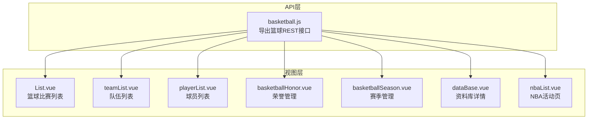
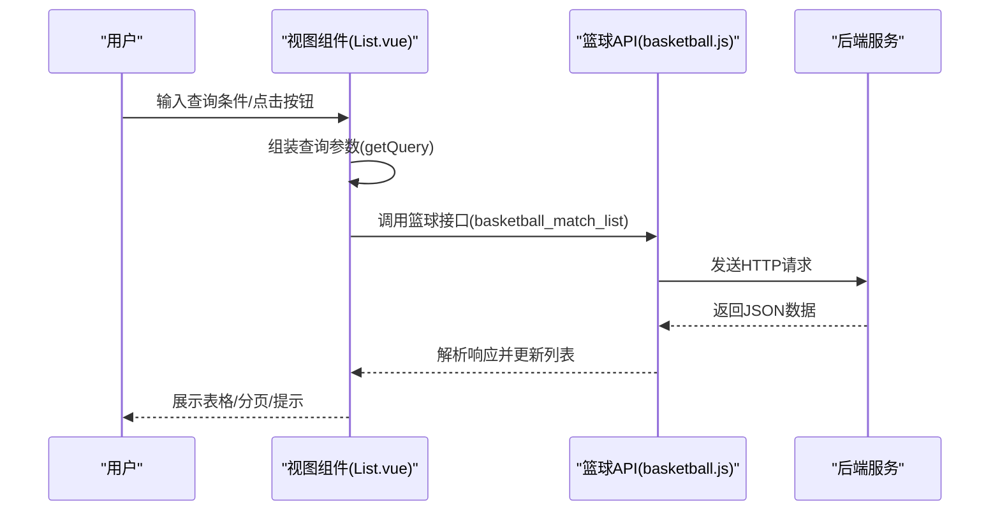
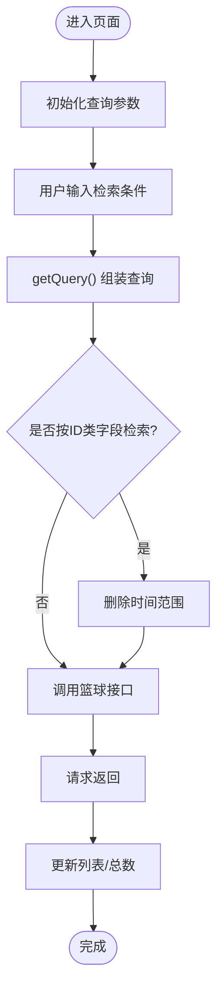
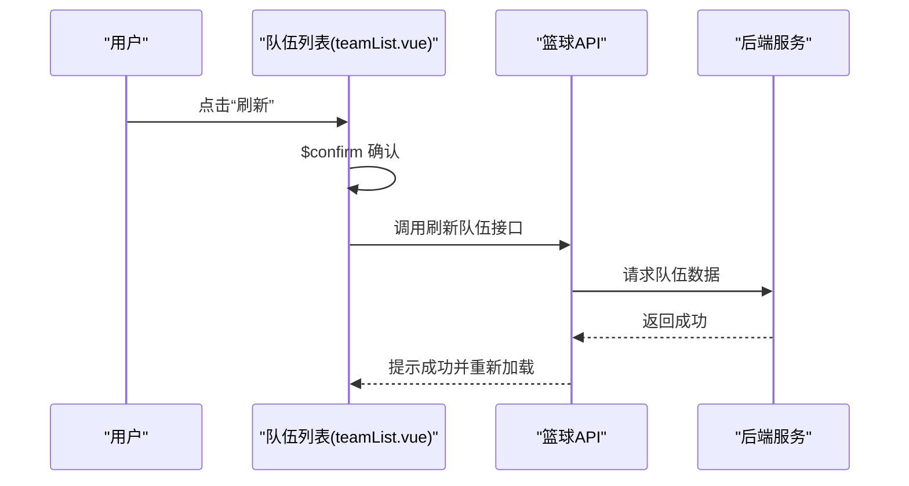
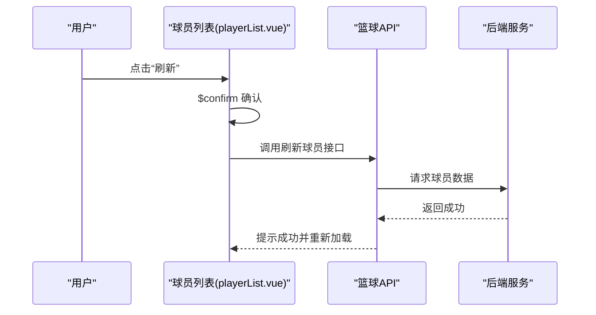
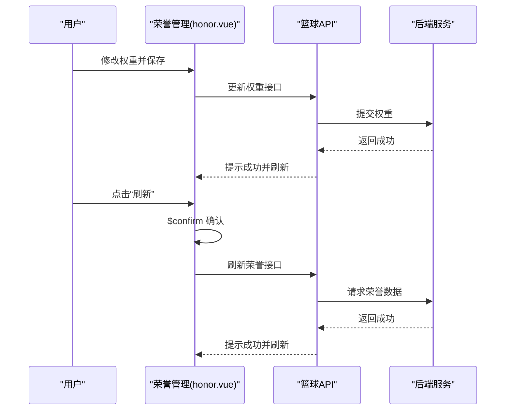
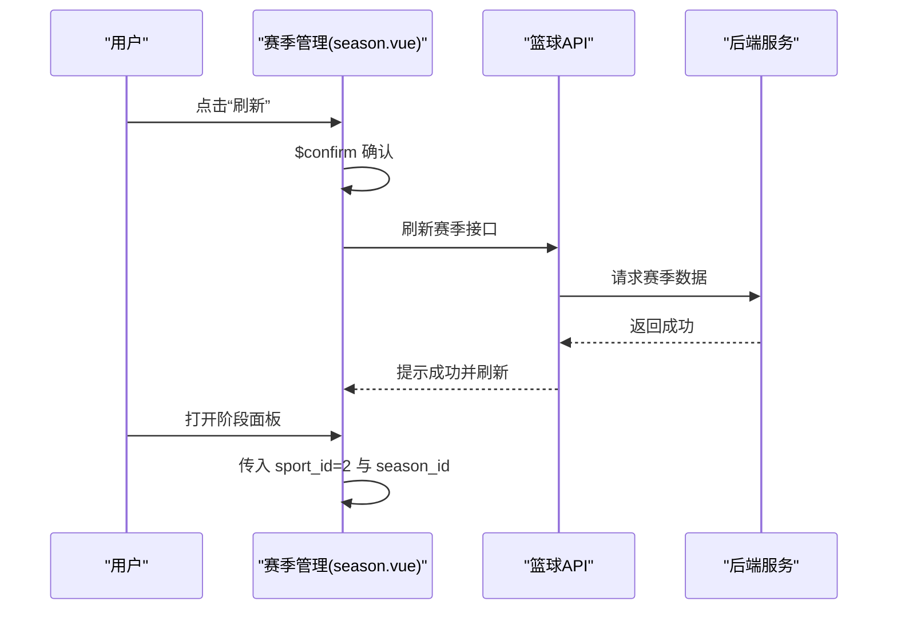
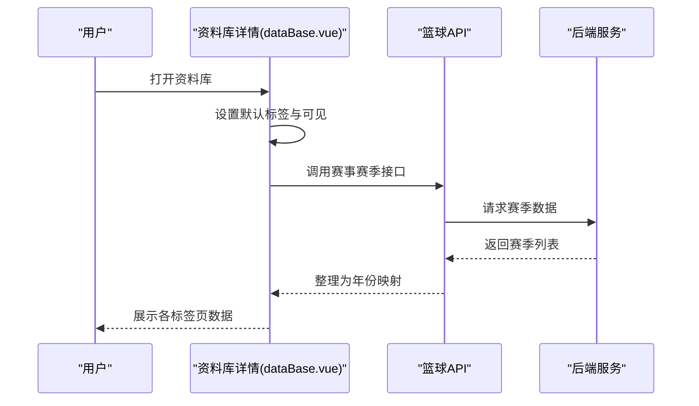
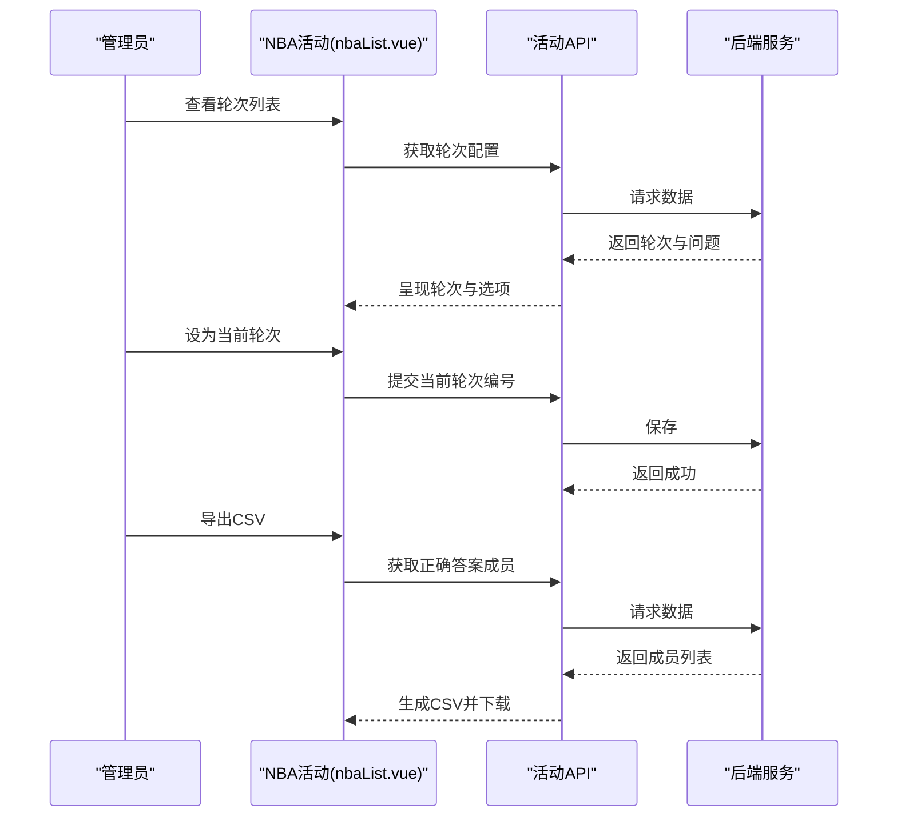
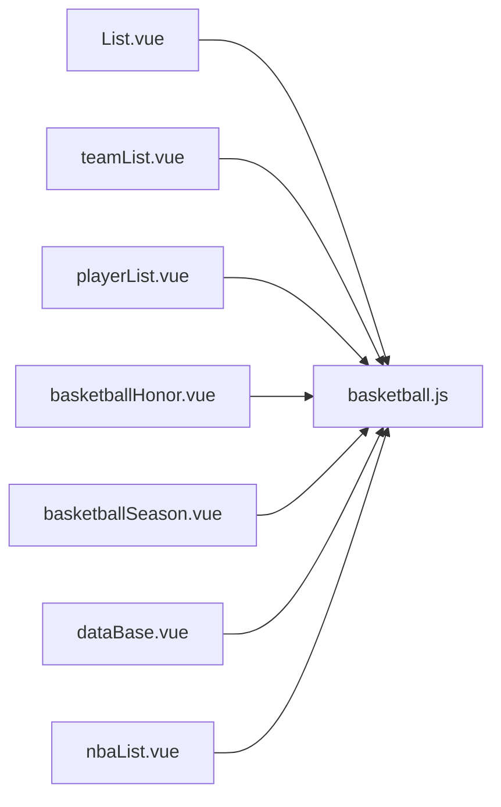

# 篮球数据管理

<cite>
**本文引用的文件**
- [src/api/matchapi/ball/basketball.js](file://src/api/matchapi/ball/basketball.js)
- [src/views/match/basketball/List.vue](file://src/views/match/basketball/List.vue)
- [src/views/match/basketball/playerList.vue](file://src/views/match/basketball/playerList.vue)
- [src/views/match/basketball/teamList.vue](file://src/views/match/basketball/teamList.vue)
- [src/views/match/basketball/basketballHonor.vue](file://src/views/match/basketball/basketballHonor.vue)
- [src/views/match/basketball/basketballSeason.vue](file://src/views/match/basketball/basketballSeason.vue)
- [src/views/match/basketball/components/databaselist/dataBase.vue](file://src/views/match/basketball/components/databaselist/dataBase.vue)
- [src/views/active/nbaList.vue](file://src/views/active/nbaList.vue)
</cite>

## 目录
1. [简介](#简介)
2. [项目结构](#项目结构)
3. [核心组件](#核心组件)
4. [架构总览](#架构总览)
5. [详细组件分析](#详细组件分析)
6. [依赖分析](#依赖分析)
7. [性能考虑](#性能考虑)
8. [故障排查指南](#故障排查指南)
9. [结论](#结论)
10. [附录](#附录)

## 简介
本技术文档围绕篮球数据管理功能展开，覆盖NBA、CBA等职业联赛与国际比赛的数据管理与分析能力。重点包括：
- 数据模型：球队阵容、球员统计数据、比赛记录、荣誉系统、赛季与阶段管理
- 特有统计：得分、篮板、助攻、抢断、盖帽等技术统计的采集与展示
- 实时更新：比赛直播数据、统计数据更新、球员状态变化
- 分析能力：球员表现评估、球队实力对比、历史数据统计
- 实现示例与最佳实践：接口封装、前端组件化、权限控制与批量刷新

## 项目结构
篮球数据管理主要由“API层”和“视图层”构成：
- API层：统一导出篮球相关REST接口，涵盖比赛、队伍、球员、荣誉、赛季、阶段、国家、教练、热门赛事、竞彩等模块
- 视图层：以Vue组件形式组织业务页面，包括比赛列表、队伍列表、球员列表、荣誉管理、赛季管理、资料库详情、活动页（如NBA GOAT）

图表来源
- [src/api/matchapi/ball/basketball.js:1-553](file://src/api/matchapi/ball/basketball.js#L1-L553)
- [src/views/match/basketball/List.vue:1-480](file://src/views/match/basketball/List.vue#L1-L480)
- [src/views/match/basketball/teamList.vue:1-387](file://src/views/match/basketball/teamList.vue#L1-L387)
- [src/views/match/basketball/playerList.vue:1-344](file://src/views/match/basketball/playerList.vue#L1-L344)
- [src/views/match/basketball/basketballHonor.vue:1-220](file://src/views/match/basketball/basketballHonor.vue#L1-L220)
- [src/views/match/basketball/basketballSeason.vue:1-243](file://src/views/match/basketball/basketballSeason.vue#L1-L243)
- [src/views/match/basketball/components/databaselist/dataBase.vue:1-158](file://src/views/match/basketball/components/databaselist/dataBase.vue#L1-L158)
- [src/views/active/nbaList.vue:1-227](file://src/views/active/nbaList.vue#L1-L227)

章节来源
- [src/api/matchapi/ball/basketball.js:1-553](file://src/api/matchapi/ball/basketball.js#L1-L553)
- [src/views/match/basketball/List.vue:1-480](file://src/views/match/basketball/List.vue#L1-L480)

## 核心组件
- 篮球API封装：集中定义篮球数据管理的所有后端接口，便于统一调用与扩展
- 比赛列表：支持按日期、状态、ID等多维检索，提供“热门”筛选、进行中定位、报表导出等能力
- 队伍列表：支持队伍名称/ID/赛事ID/时间/国家队筛选；支持权重调整、教练信息查看、刷新
- 球员列表：支持球员名称/ID/队伍ID检索；支持刷新、锁定字段高亮、多语言名称展示
- 荣誉管理：荣誉列表、权重调整、刷新、编辑器
- 赛季管理：赛季列表、当前赛季标记、统计开关、阶段面板、刷新
- 资料库详情：赛事维度的赛季、排名、最佳球队、最佳球员、情报动态聚合
- NBA活动页：轮次配置、问题选项、正确答案、导出CSV

章节来源
- [src/views/match/basketball/List.vue:207-478](file://src/views/match/basketball/List.vue#L207-L478)
- [src/views/match/basketball/teamList.vue:226-384](file://src/views/match/basketball/teamList.vue#L226-L384)
- [src/views/match/basketball/playerList.vue:198-341](file://src/views/match/basketball/playerList.vue#L198-L341)
- [src/views/match/basketball/basketballHonor.vue:93-218](file://src/views/match/basketball/basketballHonor.vue#L93-L218)
- [src/views/match/basketball/basketballSeason.vue:119-241](file://src/views/match/basketball/basketballSeason.vue#L119-L241)
- [src/views/match/basketball/components/databaselist/dataBase.vue:51-133](file://src/views/match/basketball/components/databaselist/dataBase.vue#L51-L133)
- [src/views/active/nbaList.vue:104-225](file://src/views/active/nbaList.vue#L104-L225)

## 架构总览
前端采用“组件 + API封装”的分层设计：
- 组件负责UI交互、权限控制、分页与查询参数构建
- API封装负责HTTP请求、错误处理与返回格式化
- 数据流从组件发起查询，经API封装调用后端接口，回填到表格或弹窗

图表来源
- [src/views/match/basketball/List.vue:330-351](file://src/views/match/basketball/List.vue#L330-L351)
- [src/api/matchapi/ball/basketball.js:3-9](file://src/api/matchapi/ball/basketball.js#L3-L9)

## 详细组件分析

### 比赛列表组件（List.vue）
- 功能要点
  - 多维检索：比赛ID、队伍ID、赛事ID、赛季ID、阶段ID、状态
  - 时间范围：支持日期范围选择，自动转换为服务端所需格式
  - 状态筛选：枚举15种比赛状态，支持排序与过滤
  - 热门筛选：一键切换“热门/全部”
  - 实时定位：进入“进行中”页面
  - 报表导出：调用房间图表组件生成报表
- 关键流程
  - 查询组装：getQuery将时间数组转换为字符串
  - 条件清理：当按阶段/赛季/比赛ID检索时，清除时间范围避免干扰
  - 列表渲染：basketball_match_list返回数据后更新total与list

图表来源
- [src/views/match/basketball/List.vue:462-476](file://src/views/match/basketball/List.vue#L462-L476)
- [src/views/match/basketball/List.vue:330-351](file://src/views/match/basketball/List.vue#L330-L351)

章节来源
- [src/views/match/basketball/List.vue:207-478](file://src/views/match/basketball/List.vue#L207-L478)

### 队伍列表组件（teamList.vue）
- 功能要点
  - 检索：名称/ID/赛事ID/时间/国家队
  - 字段展示：LOGO、名称、背景、主色调、权重、国家、教练、所属赛事、场馆、分区、成立时间、更新时间
  - 操作：权重编辑保存、教练信息弹窗、刷新队伍数据
- 关键流程
  - 刷新：调用刷新接口，二次确认后执行
  - 锁定高亮：根据locked_cols对单元格添加背景色标识

图表来源
- [src/views/match/basketball/teamList.vue:318-337](file://src/views/match/basketball/teamList.vue#L318-L337)
- [src/api/matchapi/ball/basketball.js:201-208](file://src/api/matchapi/ball/basketball.js#L201-L208)

章节来源
- [src/views/match/basketball/teamList.vue:226-384](file://src/views/match/basketball/teamList.vue#L226-L384)

### 球员列表组件（playerList.vue）
- 功能要点
  - 检索：名称/ID/队伍ID
  - 字段展示：LOGO、多语言名称、搜索词、所属队伍、位置、球衣号、惯用手、入名人堂几率、选秀顺位、学校、身价、城市、联盟球龄、年龄、生日、身高、体重、退役时间、合同到期、死亡时间、更新时间
  - 操作：刷新球员数据、编辑弹窗、锁定字段高亮
- 关键流程
  - 刷新：调用刷新接口，二次确认后执行
  - 锁定高亮：根据locked_cols对单元格添加背景色标识

图表来源
- [src/views/match/basketball/playerList.vue:267-286](file://src/views/match/basketball/playerList.vue#L267-L286)
- [src/api/matchapi/ball/basketball.js:209-216](file://src/api/matchapi/ball/basketball.js#L209-L216)

章节来源
- [src/views/match/basketball/playerList.vue:198-341](file://src/views/match/basketball/playerList.vue#L198-L341)

### 荣誉管理组件（basketballHonor.vue）
- 功能要点
  - 荣誉列表：ID、图标、名称、更新时间、权重
  - 操作：编辑、刷新、权重保存
- 关键流程
  - 权重保存：调用更新权重接口
  - 刷新：调用刷新荣誉接口，二次确认后执行

图表来源
- [src/views/match/basketball/basketballHonor.vue:130-170](file://src/views/match/basketball/basketballHonor.vue#L130-L170)
- [src/api/matchapi/ball/basketball.js:323-346](file://src/api/matchapi/ball/basketball.js#L323-L346)

章节来源
- [src/views/match/basketball/basketballHonor.vue:93-218](file://src/views/match/basketball/basketballHonor.vue#L93-L218)

### 赛季管理组件（basketballSeason.vue）
- 功能要点
  - 赛季列表：ID、赛季名称、赛事名称、是否当前、是否有球员/队伍统计、积分榜、起止时间、更新时间
  - 操作：刷新、编辑、阶段面板
- 关键流程
  - 刷新：调用刷新赛季接口，二次确认后执行
  - 阶段面板：打开后传入篮球运动类型与赛季ID

图表来源
- [src/views/match/basketball/basketballSeason.vue:177-197](file://src/views/match/basketball/basketballSeason.vue#L177-L197)
- [src/views/match/basketball/basketballSeason.vue:231-236](file://src/views/match/basketball/basketballSeason.vue#L231-L236)
- [src/api/matchapi/ball/basketball.js:252-259](file://src/api/matchapi/ball/basketball.js#L252-L259)

章节来源
- [src/views/match/basketball/basketballSeason.vue:119-241](file://src/views/match/basketball/basketballSeason.vue#L119-L241)

### 资料库详情组件（dataBase.vue）
- 功能要点
  - 标签页：赛季、排名、最佳球队、最佳球员、情报动态
  - 数据联动：根据选中赛事，拉取赛季数据并缓存到active_row
- 关键流程
  - 初始化：设置对话框可见与默认标签
  - 拉取赛季：调用赛事赛季接口，整理为年份映射

图表来源
- [src/views/match/basketball/components/databaselist/dataBase.vue:110-131](file://src/views/match/basketball/components/databaselist/dataBase.vue#L110-L131)
- [src/api/matchapi/ball/basketball.js:529-535](file://src/api/matchapi/ball/basketball.js#L529-L535)

章节来源
- [src/views/match/basketball/components/databaselist/dataBase.vue:51-133](file://src/views/match/basketball/components/databaselist/dataBase.vue#L51-L133)

### NBA活动页（nbaList.vue）
- 功能要点
  - 轮次管理：添加/编辑/设为当前轮次
  - 问题与选项：展示每轮问题与正确答案
  - 导出CSV：导出该轮次答题成员清单
- 关键流程
  - 列表加载：调用活动接口获取轮次与配置
  - 设为当前轮次：提交当前轮次编号
  - 导出CSV：调用正确答案接口，拼接CSV并触发下载

图表来源
- [src/views/active/nbaList.vue:137-154](file://src/views/active/nbaList.vue#L137-L154)
- [src/views/active/nbaList.vue:155-173](file://src/views/active/nbaList.vue#L155-L173)
- [src/views/active/nbaList.vue:180-223](file://src/views/active/nbaList.vue#L180-L223)

章节来源
- [src/views/active/nbaList.vue:104-225](file://src/views/active/nbaList.vue#L104-L225)

## 依赖分析
- 组件与API的依赖关系
  - List.vue 依赖 basketball_match_list
  - teamList.vue 依赖 basketball_team_list 与刷新接口
  - playerList.vue 依赖 basketball_player_list 与刷新接口
  - honor.vue 依赖篮球荣誉相关接口
  - season.vue 依赖篮球赛季相关接口
  - dataBase.vue 依赖赛事赛季接口
  - nbaList.vue 依赖活动相关接口

图表来源
- [src/views/match/basketball/List.vue:208-209](file://src/views/match/basketball/List.vue#L208-L209)
- [src/views/match/basketball/teamList.vue:227-228](file://src/views/match/basketball/teamList.vue#L227-L228)
- [src/views/match/basketball/playerList.vue:206-206](file://src/views/match/basketball/playerList.vue#L206-L206)
- [src/views/match/basketball/basketballHonor.vue:94-94](file://src/views/match/basketball/basketballHonor.vue#L94-L94)
- [src/views/match/basketball/basketballSeason.vue:120-120](file://src/views/match/basketball/basketballSeason.vue#L120-L120)
- [src/views/match/basketball/components/databaselist/dataBase.vue:52-52](file://src/views/match/basketball/components/databaselist/dataBase.vue#L52-L52)
- [src/views/active/nbaList.vue:105-105](file://src/views/active/nbaList.vue#L105-L105)

章节来源
- [src/api/matchapi/ball/basketball.js:1-553](file://src/api/matchapi/ball/basketball.js#L1-L553)

## 性能考虑
- 列表分页与懒加载
  - 使用分页组件控制每页数量，减少一次性渲染压力
- 查询参数优化
  - 仅在必要时保留时间范围，避免无效字段影响后端筛选
- 权限控制
  - 通过指令/权限方法控制按钮显隐，减少不必要的DOM与事件绑定
- 批量刷新
  - 刷新接口采用二次确认，避免误操作导致频繁请求
- 图片与图标
  - 使用缩略图与懒加载策略，降低首屏渲染时间

## 故障排查指南
- 列表无数据
  - 检查查询参数是否包含冲突字段（如按ID检索时的时间范围）
  - 确认接口返回code与total是否一致
- 刷新失败
  - 确认二次确认逻辑是否触发
  - 检查网络请求与后端日志
- 字段锁定高亮异常
  - 检查locked_cols字段是否正确传递
  - 确认checkLocked函数对属性集合的匹配逻辑
- 赛季/阶段面板不显示
  - 确认传入的sport_id与season_id是否有效
  - 检查接口返回数据结构是否符合预期

章节来源
- [src/views/match/basketball/List.vue:336-339](file://src/views/match/basketball/List.vue#L336-L339)
- [src/views/match/basketball/teamList.vue:318-337](file://src/views/match/basketball/teamList.vue#L318-L337)
- [src/views/match/basketball/playerList.vue:267-286](file://src/views/match/basketball/playerList.vue#L267-L286)
- [src/views/match/basketball/basketballSeason.vue:231-236](file://src/views/match/basketball/basketballSeason.vue#L231-L236)

## 结论
本篮球数据管理方案通过清晰的API封装与组件化视图，实现了对NBA、CBA及国际比赛的全链路数据治理。围绕比赛、队伍、球员、荣誉、赛季与资料库的统一入口，结合权限控制与批量刷新能力，既满足日常运营需求，也为后续扩展（如实时直播、技术统计分析、历史对比）提供了坚实基础。

## 附录
- 接口一览（节选）
  - 比赛：列表、活跃比赛、详情、状态异常列表、热门赛事、竞彩期号与指数
  - 队伍：列表、更新、刷新、权重更新、阵容
  - 球员：列表、刷新、生涯、荣誉、转会
  - 荣誉：列表、更新、刷新、权重更新、队员/教练列表
  - 赛季：列表、更新、刷新、阶段、队伍/赛事赛季
  - 其他：国家/教练/场馆/阶段/分类/伤残/FIBA排名/评分/规则/Top

章节来源
- [src/api/matchapi/ball/basketball.js:1-553](file://src/api/matchapi/ball/basketball.js#L1-L553)