# 足球数据管理

<cite>
**本文引用的文件**
- [src/api/matchapi/ball/football.js](file://src/api/matchapi/ball/football.js)
- [src/views/match/football/List.vue](file://src/views/match/football/List.vue)
- [src/views/match/football/clubList.vue](file://src/views/match/football/clubList.vue)
- [src/views/match/football/playerList.vue](file://src/views/match/football/playerList.vue)
- [src/views/match/football/footballCoach.vue](file://src/views/match/football/footballCoach.vue)
- [src/views/match/football/referee_list.vue](file://src/views/match/football/referee_list.vue)
- [src/views/match/football/footballHonor.vue](file://src/views/match/football/footballHonor.vue)
- [src/views/match/football/components/transferList.vue](file://src/views/match/football/components/transferList.vue)
- [src/views/match/football/components/databaselist/dataBase.vue](file://src/views/match/football/components/databaselist/dataBase.vue)
</cite>

## 目录
1. [引言](#引言)
2. [项目结构](#项目结构)
3. [核心组件](#核心组件)
4. [架构总览](#架构总览)
5. [详细组件分析](#详细组件分析)
6. [依赖分析](#依赖分析)
7. [性能考虑](#性能考虑)
8. [故障排查指南](#故障排查指南)
9. [结论](#结论)
10. [附录](#附录)

## 引言
本技术文档聚焦于足球数据管理功能，系统性梳理了“联赛管理、球队管理、球员管理、教练管理、裁判管理、荣誉与奖项、转会信息、积分与排名、实时分析与报表”等核心模块，并结合前端视图组件与后端接口定义，给出数据模型、处理流程、导入导出机制、分析与报表能力以及可扩展的业务场景示例。目标是帮助开发者快速理解并高效扩展足球数据管理能力。

## 项目结构
围绕足球数据管理，前端采用按“功能域+视图”的组织方式，核心入口位于 views/match/football 下，配套 API 定义集中在 src/api/matchapi/ball/football.js。数据库资料库对话框 dataBase.vue 提供“概览/赛季/积分榜/最佳球队/最佳球员/最佳阵容/情报动态”等多维度展示。

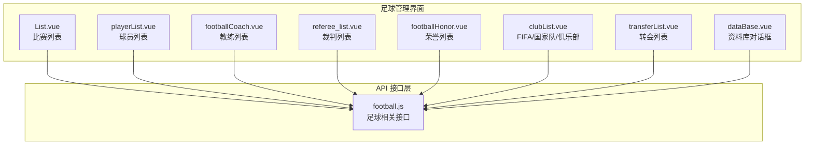

**图表来源**
- [src/views/match/football/List.vue:109-196](file://src/views/match/football/List.vue#L109-L196)
- [src/views/match/football/playerList.vue:55-240](file://src/views/match/football/playerList.vue#L55-L240)
- [src/views/match/football/footballCoach.vue:31-190](file://src/views/match/football/footballCoach.vue#L31-L190)
- [src/views/match/football/referee_list.vue:15-81](file://src/views/match/football/referee_list.vue#L15-L81)
- [src/views/match/football/footballHonor.vue:25-93](file://src/views/match/football/footballHonor.vue#L25-L93)
- [src/views/match/football/clubList.vue:31-57](file://src/views/match/football/clubList.vue#L31-L57)
- [src/views/match/football/components/transferList.vue:32-104](file://src/views/match/football/components/transferList.vue#L32-L104)
- [src/views/match/football/components/databaselist/dataBase.vue:1-47](file://src/views/match/football/components/databaselist/dataBase.vue#L1-L47)
- [src/api/matchapi/ball/football.js:1-775](file://src/api/matchapi/ball/football.js#L1-L775)

**章节来源**
- [src/views/match/football/List.vue:109-196](file://src/views/match/football/List.vue#L109-L196)
- [src/views/match/football/playerList.vue:55-240](file://src/views/match/football/playerList.vue#L55-L240)
- [src/views/match/football/footballCoach.vue:31-190](file://src/views/match/football/footballCoach.vue#L31-L190)
- [src/views/match/football/referee_list.vue:15-81](file://src/views/match/football/referee_list.vue#L15-L81)
- [src/views/match/football/footballHonor.vue:25-93](file://src/views/match/football/footballHonor.vue#L25-L93)
- [src/views/match/football/clubList.vue:31-57](file://src/views/match/football/clubList.vue#L31-L57)
- [src/views/match/football/components/transferList.vue:32-104](file://src/views/match/football/components/transferList.vue#L32-L104)
- [src/views/match/football/components/databaselist/dataBase.vue:1-47](file://src/views/match/football/components/databaselist/dataBase.vue#L1-L47)
- [src/api/matchapi/ball/football.js:1-775](file://src/api/matchapi/ball/football.js#L1-L775)

## 核心组件
- 比赛管理：List.vue 提供比赛列表、筛选、排序、重要标记、报表查看、定位进行中等能力，依赖 football.js 的比赛相关接口。
- 球员管理：playerList.vue 提供球员列表、搜索、刷新、锁定字段高亮、能力与特点展示、跳转 M 站等。
- 教练管理：footballCoach.vue 提供教练列表、搜索、刷新、履历查看、队伍关联等。
- 裁判管理：referee_list.vue 提供裁判列表、搜索、刷新、执法历史查看、编辑。
- 荣誉管理：footballHonor.vue 提供荣誉列表、权重调整、刷新、荣誉详情查看。
- 俱乐部/FIFA/国家队：clubList.vue 提供 FIFA 俱乐部/国家排名刷新与切换。
- 转会管理：transferList.vue 提供按“转入/转出”筛选的转会记录列表。
- 资料库：dataBase.vue 对话框，聚合“概览/赛季/积分榜/最佳球队/最佳球员/最佳阵容/情报动态”。

**章节来源**
- [src/views/match/football/List.vue:109-196](file://src/views/match/football/List.vue#L109-L196)
- [src/views/match/football/playerList.vue:55-240](file://src/views/match/football/playerList.vue#L55-L240)
- [src/views/match/football/footballCoach.vue:31-190](file://src/views/match/football/footballCoach.vue#L31-L190)
- [src/views/match/football/referee_list.vue:15-81](file://src/views/match/football/referee_list.vue#L15-L81)
- [src/views/match/football/footballHonor.vue:25-93](file://src/views/match/football/footballHonor.vue#L25-L93)
- [src/views/match/football/clubList.vue:31-57](file://src/views/match/football/clubList.vue#L31-L57)
- [src/views/match/football/components/transferList.vue:32-104](file://src/views/match/football/components/transferList.vue#L32-L104)
- [src/views/match/football/components/databaselist/dataBase.vue:1-47](file://src/views/match/football/components/databaselist/dataBase.vue#L1-L47)

## 架构总览
前端通过各视图组件调用 football.js 中的统一接口，完成对后端服务的数据请求与交互；资料库 dataBase.vue 作为复合面板，串联多个子组件以提供多维度数据视图。

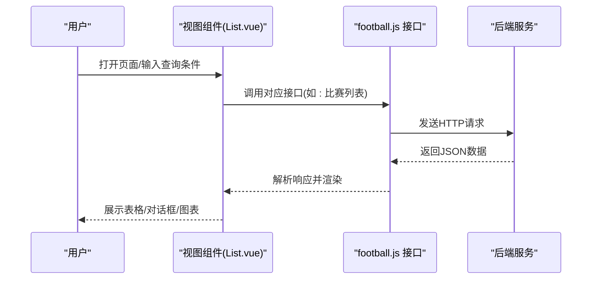

**图表来源**
- [src/views/match/football/List.vue:313-334](file://src/views/match/football/List.vue#L313-L334)
- [src/api/matchapi/ball/football.js:4-10](file://src/api/matchapi/ball/football.js#L4-L10)

## 详细组件分析

### 比赛管理（List.vue）
- 功能要点
  - 时间范围筛选、关键字搜索（比赛ID/队伍ID/赛事ID/阶段ID/状态）、排序（时间/状态）、重要标记切换、定位进行中、报表查看。
  - 表格列包含比赛ID、时间、比赛信息、让球、额外数据等，支持单元格高亮与敏感标记。
- 关键流程
  - 查询参数构造与清理（时间字段在特定搜索条件下清空），调用 football_match_list 获取数据并渲染。
- 可扩展点
  - 新增筛选器、自定义排序、批量操作、导出 CSV。

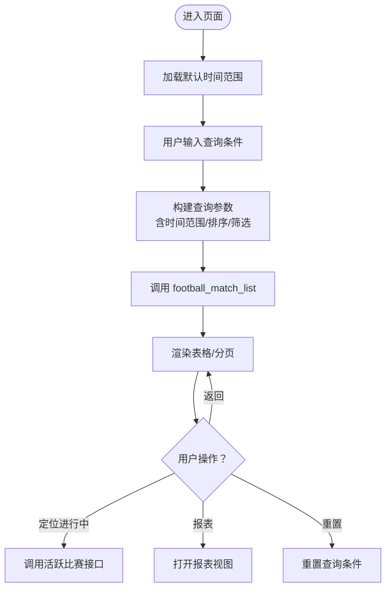

**图表来源**
- [src/views/match/football/List.vue:286-448](file://src/views/match/football/List.vue#L286-L448)
- [src/api/matchapi/ball/football.js:4-10](file://src/api/matchapi/ball/football.js#L4-L10)

**章节来源**
- [src/views/match/football/List.vue:109-196](file://src/views/match/football/List.vue#L109-L196)
- [src/views/match/football/List.vue:286-448](file://src/views/match/football/List.vue#L286-L448)
- [src/api/matchapi/ball/football.js:4-10](file://src/api/matchapi/ball/football.js#L4-L10)

### 球员管理（playerList.vue）
- 功能要点
  - 按名称/ID/队伍ID搜索；展示头像、姓名、国籍、位置、球衣号、惯用脚、能力、特点、所属球队、合同到期、市值、年龄、生日、身高体重、死亡时间、更新时间等。
  - 权限控制下的“刷新”、“编辑”、“查看详情”等操作；锁定字段高亮。
- 处理逻辑
  - 列表加载时对搜索关键词进行校验；刷新使用 football_refresh_player 拉取最新数据。
- 可扩展点
  - 增加球员统计、转会趋势、伤病信息等子面板。

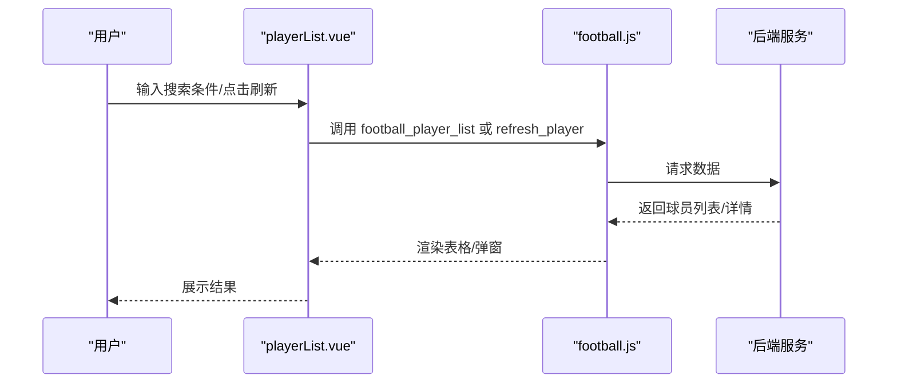

**图表来源**
- [src/views/match/football/playerList.vue:294-336](file://src/views/match/football/playerList.vue#L294-L336)
- [src/api/matchapi/ball/football.js:77-92](file://src/api/matchapi/ball/football.js#L77-L92)
- [src/api/matchapi/ball/football.js:294-300](file://src/api/matchapi/ball/football.js#L294-L300)

**章节来源**
- [src/views/match/football/playerList.vue:55-240](file://src/views/match/football/playerList.vue#L55-L240)
- [src/views/match/football/playerList.vue:294-336](file://src/views/match/football/playerList.vue#L294-L336)
- [src/api/matchapi/ball/football.js:77-92](file://src/api/matchapi/ball/football.js#L77-L92)
- [src/api/matchapi/ball/football.js:294-300](file://src/api/matchapi/ball/football.js#L294-L300)

### 教练管理（footballCoach.vue）
- 功能要点
  - 教练列表、搜索（ID/名称/队伍ID）、查看履历、队伍信息、合同信息、习惯阵型、死亡时间、更新时间；支持刷新。
- 处理逻辑
  - 使用 football_manager_list 获取列表；football_refresh_manager 刷新数据；权限控制下的编辑弹窗。

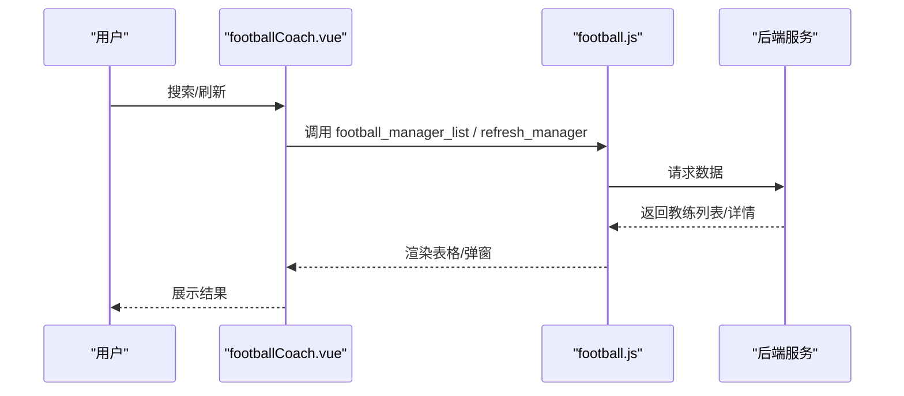

**图表来源**
- [src/views/match/football/footballCoach.vue:276-289](file://src/views/match/football/footballCoach.vue#L276-L289)
- [src/api/matchapi/ball/football.js:156-162](file://src/api/matchapi/ball/football.js#L156-L162)
- [src/api/matchapi/ball/football.js:512-518](file://src/api/matchapi/ball/football.js#L512-L518)

**章节来源**
- [src/views/match/football/footballCoach.vue:31-190](file://src/views/match/football/footballCoach.vue#L31-L190)
- [src/views/match/football/footballCoach.vue:276-289](file://src/views/match/football/footballCoach.vue#L276-L289)
- [src/api/matchapi/ball/football.js:156-162](file://src/api/matchapi/ball/football.js#L156-L162)
- [src/api/matchapi/ball/football.js:512-518](file://src/api/matchapi/ball/football.js#L512-L518)

### 裁判管理（referee_list.vue）
- 功能要点
  - 裁判列表、搜索（ID/姓名）、刷新、查看执法历史、编辑弹窗；支持锁定字段高亮。
- 处理逻辑
  - 使用 football_referee_list 获取列表；football_refresh_referee 刷新；支持事件向上传递选择结果。

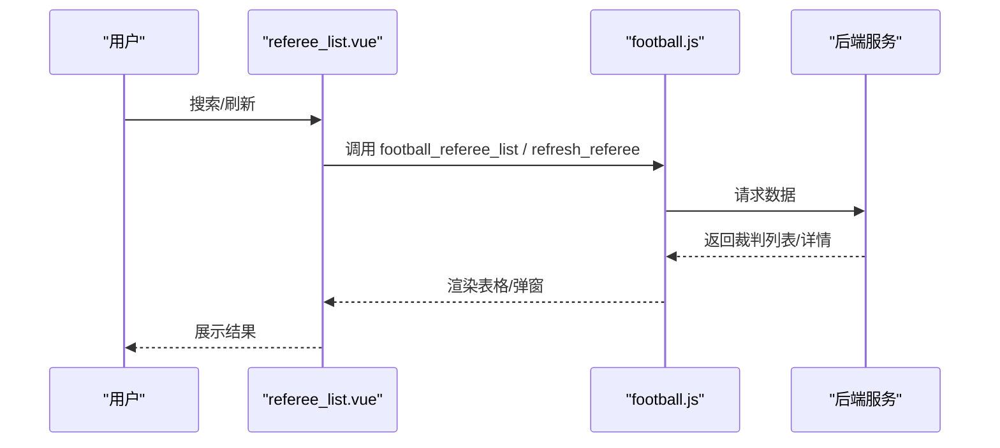

**图表来源**
- [src/views/match/football/referee_list.vue:162-177](file://src/views/match/football/referee_list.vue#L162-L177)
- [src/api/matchapi/ball/football.js:318-324](file://src/api/matchapi/ball/football.js#L318-L324)
- [src/api/matchapi/ball/football.js:487-493](file://src/api/matchapi/ball/football.js#L487-L493)

**章节来源**
- [src/views/match/football/referee_list.vue:15-81](file://src/views/match/football/referee_list.vue#L15-L81)
- [src/views/match/football/referee_list.vue:162-177](file://src/views/match/football/referee_list.vue#L162-L177)
- [src/api/matchapi/ball/football.js:318-324](file://src/api/matchapi/ball/football.js#L318-L324)
- [src/api/matchapi/ball/football.js:487-493](file://src/api/matchapi/ball/football.js#L487-L493)

### 荣誉管理（footballHonor.vue）
- 功能要点
  - 荣誉列表、权重编辑、刷新、荣誉详情查看；支持锁定字段高亮。
- 处理逻辑
  - 使用 football_honor_list 获取列表；football_refresh_honor 刷新；football_update_honor_weight 更新权重。

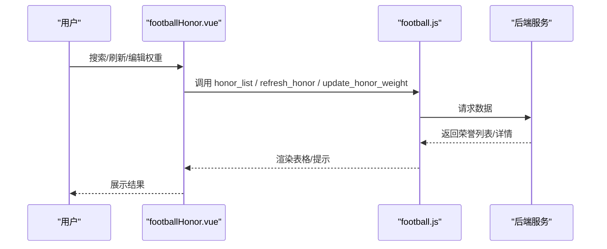

**图表来源**
- [src/views/match/football/footballHonor.vue:174-187](file://src/views/match/football/footballHonor.vue#L174-L187)
- [src/api/matchapi/ball/football.js:174-180](file://src/api/matchapi/ball/football.js#L174-L180)
- [src/api/matchapi/ball/football.js:199-205](file://src/api/matchapi/ball/football.js#L199-L205)
- [src/api/matchapi/ball/football.js:720-726](file://src/api/matchapi/ball/football.js#L720-L726)

**章节来源**
- [src/views/match/football/footballHonor.vue:25-93](file://src/views/match/football/footballHonor.vue#L25-L93)
- [src/views/match/football/footballHonor.vue:174-187](file://src/views/match/football/footballHonor.vue#L174-L187)
- [src/api/matchapi/ball/football.js:174-180](file://src/api/matchapi/ball/football.js#L174-L180)
- [src/api/matchapi/ball/football.js:199-205](file://src/api/matchapi/ball/football.js#L199-L205)
- [src/api/matchapi/ball/football.js:720-726](file://src/api/matchapi/ball/football.js#L720-L726)

### 俱乐部/FIFA/国家队（clubList.vue）
- 功能要点
  - 切换“男子/女子”标签页，分别加载 FIFA 国家队排名；提供“刷新”按钮触发对应接口。
- 处理逻辑
  - 使用 football_fix_fifa_ranking 与 football_fix_club_ranking 刷新排名；子组件按性别或类型初始化。

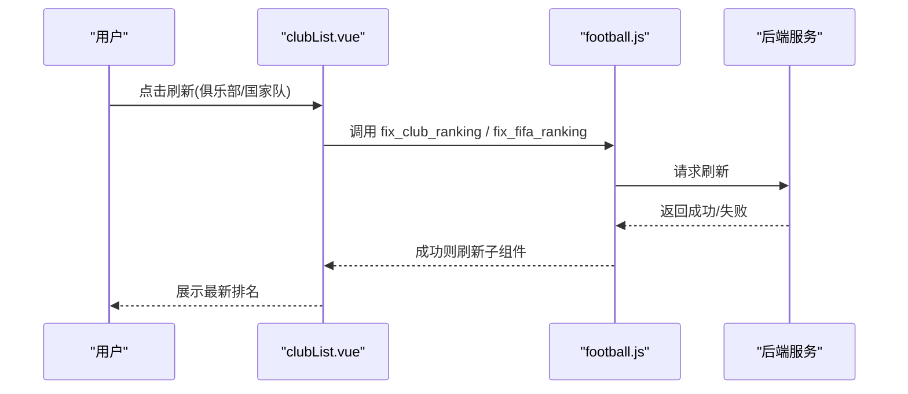

**图表来源**
- [src/views/match/football/clubList.vue:78-112](file://src/views/match/football/clubList.vue#L78-L112)
- [src/api/matchapi/ball/football.js:431-436](file://src/api/matchapi/ball/football.js#L431-L436)
- [src/api/matchapi/ball/football.js:438-443](file://src/api/matchapi/ball/football.js#L438-L443)

**章节来源**
- [src/views/match/football/clubList.vue:31-57](file://src/views/match/football/clubList.vue#L31-L57)
- [src/views/match/football/clubList.vue:78-112](file://src/views/match/football/clubList.vue#L78-L112)
- [src/api/matchapi/ball/football.js:431-436](file://src/api/matchapi/ball/football.js#L431-L436)
- [src/api/matchapi/ball/football.js:438-443](file://src/api/matchapi/ball/football.js#L438-L443)

### 转会管理（transferList.vue）
- 功能要点
  - 通过下拉切换“转入/转出”，展示球员、球队、时间、费用、描述、类型、自由球员状态、更新时间等。
- 处理逻辑
  - 使用 football_transfer_list 获取列表；根据 of_type 与 team_id 过滤。

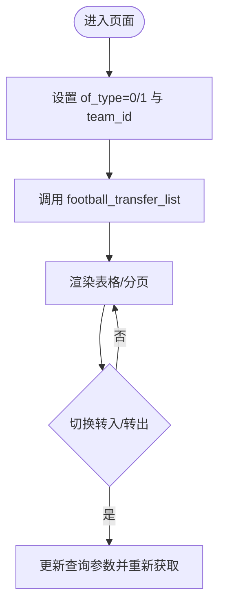

**图表来源**
- [src/views/match/football/components/transferList.vue:130-164](file://src/views/match/football/components/transferList.vue#L130-L164)
- [src/api/matchapi/ball/football.js:86-92](file://src/api/matchapi/ball/football.js#L86-L92)

**章节来源**
- [src/views/match/football/components/transferList.vue:32-104](file://src/views/match/football/components/transferList.vue#L32-L104)
- [src/views/match/football/components/transferList.vue:130-164](file://src/views/match/football/components/transferList.vue#L130-L164)
- [src/api/matchapi/ball/football.js:86-92](file://src/api/matchapi/ball/football.js#L86-L92)

### 资料库（dataBase.vue）
- 功能要点
  - 对话框内多标签页：概览、赛季、积分榜、最佳球队、最佳球员、最佳阵容、情报动态；支持根据赛事/年份切换。
- 处理逻辑
  - 初始化时调用 football_compe_season 获取赛季年份集合，再按需加载各子组件。

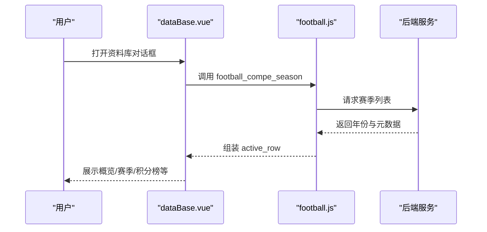

**图表来源**
- [src/views/match/football/components/databaselist/dataBase.vue:125-150](file://src/views/match/football/components/databaselist/dataBase.vue#L125-L150)
- [src/api/matchapi/ball/football.js:735-740](file://src/api/matchapi/ball/football.js#L735-L740)

**章节来源**
- [src/views/match/football/components/databaselist/dataBase.vue:1-47](file://src/views/match/football/components/databaselist/dataBase.vue#L1-L47)
- [src/views/match/football/components/databaselist/dataBase.vue:125-150](file://src/views/match/football/components/databaselist/dataBase.vue#L125-L150)
- [src/api/matchapi/ball/football.js:735-740](file://src/api/matchapi/ball/football.js#L735-L740)

## 依赖分析
- 视图组件与接口层
  - List.vue、playerList.vue、footballCoach.vue、referee_list.vue、footballHonor.vue、transferList.vue、clubList.vue、dataBase.vue 均依赖 football.js 中的接口方法。
- 数据依赖
  - 各组件通过统一的查询参数（分页、排序、筛选、时间范围）与后端交互，返回结构化数据驱动表格渲染。
- 权限与交互
  - 多处使用 v-has 权限指令与 hasPwer 方法控制按钮可见性与操作能力（如刷新、编辑、报表）。

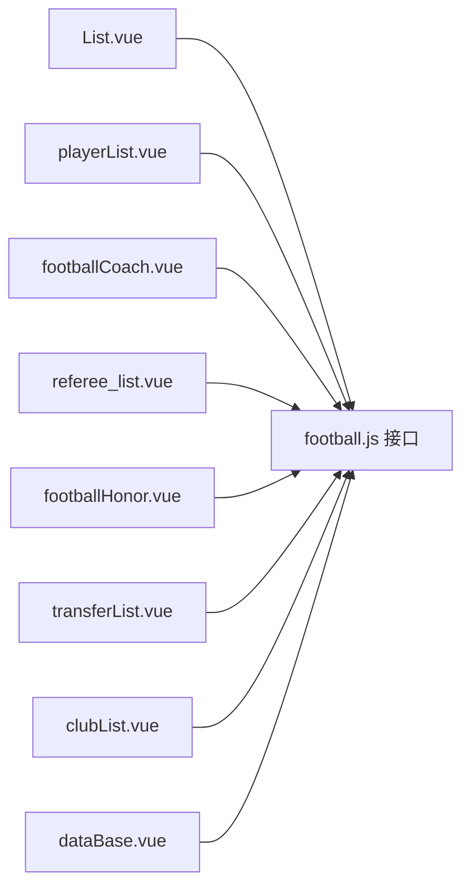

**图表来源**
- [src/views/match/football/List.vue:198-214](file://src/views/match/football/List.vue#L198-L214)
- [src/views/match/football/playerList.vue:243-250](file://src/views/match/football/playerList.vue#L243-L250)
- [src/views/match/football/footballCoach.vue:192-201](file://src/views/match/football/footballCoach.vue#L192-L201)
- [src/views/match/football/referee_list.vue:83-90](file://src/views/match/football/referee_list.vue#L83-L90)
- [src/views/match/football/footballHonor.vue:95-102](file://src/views/match/football/footballHonor.vue#L95-L102)
- [src/views/match/football/components/transferList.vue:107-111](file://src/views/match/football/components/transferList.vue#L107-L111)
- [src/views/match/football/clubList.vue:59-62](file://src/views/match/football/clubList.vue#L59-L62)
- [src/views/match/football/components/databaselist/dataBase.vue:49-56](file://src/views/match/football/components/databaselist/dataBase.vue#L49-L56)
- [src/api/matchapi/ball/football.js:1-775](file://src/api/matchapi/ball/football.js#L1-L775)

**章节来源**
- [src/views/match/football/List.vue:198-214](file://src/views/match/football/List.vue#L198-L214)
- [src/views/match/football/playerList.vue:243-250](file://src/views/match/football/playerList.vue#L243-L250)
- [src/views/match/football/footballCoach.vue:192-201](file://src/views/match/football/footballCoach.vue#L192-L201)
- [src/views/match/football/referee_list.vue:83-90](file://src/views/match/football/referee_list.vue#L83-L90)
- [src/views/match/football/footballHonor.vue:95-102](file://src/views/match/football/footballHonor.vue#L95-L102)
- [src/views/match/football/components/transferList.vue:107-111](file://src/views/match/football/components/transferList.vue#L107-L111)
- [src/views/match/football/clubList.vue:59-62](file://src/views/match/football/clubList.vue#L59-L62)
- [src/views/match/football/components/databaselist/dataBase.vue:49-56](file://src/views/match/football/components/databaselist/dataBase.vue#L49-L56)
- [src/api/matchapi/ball/football.js:1-775](file://src/api/matchapi/ball/football.js#L1-L775)

## 性能考虑
- 列表分页与懒加载：各组件均使用 Pagination 控件与分页参数，避免一次性加载大量数据。
- 查询参数优化：在特定搜索条件下清理时间字段，减少无效过滤带来的请求压力。
- 表格渲染优化：通过 cell-class-name 与 v-loading 控制渲染与加载态，提升交互体验。
- 子组件按需加载：dataBase.vue 在切换标签时才初始化对应子组件，降低初始渲染成本。

[本节为通用建议，不直接分析具体文件]

## 故障排查指南
- 列表为空或数据异常
  - 检查查询参数是否正确（时间范围、排序、筛选），确认 football_match_list/football_player_list 等接口返回码与 total 字段。
  - 参考路径：[List.vue 查询与渲染:313-334](file://src/views/match/football/List.vue#L313-L334)、[playerList.vue 列表加载:294-314](file://src/views/match/football/playerList.vue#L294-L314)
- 刷新失败
  - 确认权限与接口调用（如 football_refresh_player、football_refresh_manager、football_refresh_referee、football_refresh_honor）。
  - 参考路径：[playerList.vue 刷新:317-336](file://src/views/match/football/playerList.vue#L317-L336)、[footballCoach.vue 刷新:257-274](file://src/views/match/football/footballCoach.vue#L257-L274)、[referee_list.vue 刷新:134-151](file://src/views/match/football/referee_list.vue#L134-L151)、[footballHonor.vue 刷新:151-170](file://src/views/match/football/footballHonor.vue#L151-L170)
- 资料库无法展示
  - 确认 football_compe_season 返回的年份数组与 active_row 组装逻辑。
  - 参考路径：[dataBase.vue 初始化与组装:125-150](file://src/views/match/football/components/databaselist/dataBase.vue#L125-L150)

**章节来源**
- [src/views/match/football/List.vue:313-334](file://src/views/match/football/List.vue#L313-L334)
- [src/views/match/football/playerList.vue:294-314](file://src/views/match/football/playerList.vue#L294-L314)
- [src/views/match/football/playerList.vue:317-336](file://src/views/match/football/playerList.vue#L317-L336)
- [src/views/match/football/footballCoach.vue:257-274](file://src/views/match/football/footballCoach.vue#L257-L274)
- [src/views/match/football/referee_list.vue:134-151](file://src/views/match/football/referee_list.vue#L134-L151)
- [src/views/match/football/footballHonor.vue:151-170](file://src/views/match/football/footballHonor.vue#L151-L170)
- [src/views/match/football/components/databaselist/dataBase.vue:125-150](file://src/views/match/football/components/databaselist/dataBase.vue#L125-L150)

## 结论
该足球数据管理模块以“视图组件 + 统一接口层”的方式实现了从比赛到球员、教练、裁判、荣誉、转会、积分与资料库的全链路管理能力。通过清晰的查询参数、权限控制与按需加载策略，既保证了良好的用户体验，也为后续扩展（如 CSV 导入导出、实时分析报表、高级统计）提供了坚实基础。

[本节为总结性内容，不直接分析具体文件]

## 附录

### 数据模型与处理逻辑（概念性说明）
- 比赛信息
  - 字段：比赛ID、时间、状态、主客队、联赛/阶段、让球、额外数据等。
  - 处理：支持按时间范围、状态、ID/队伍/赛事/阶段等多维筛选；提供“重要”标记与“定位进行中”。
- 球员信息
  - 字段：ID、合并ID、头像、姓名、搜索词、国籍、位置、球衣号、惯用脚、能力、特点、所属球队、合同到期、市值、年龄、生日、身高、体重、死亡时间、更新时间。
  - 处理：支持刷新、编辑、锁定字段高亮；按队伍ID联动展示。
- 教练信息
  - 字段：ID、合并ID、头像、姓名、队伍、搜索词、类型、年龄、生日、国家、合同、习惯阵型、死亡时间、更新时间。
  - 处理：支持刷新、履历查看、队伍关联。
- 裁判信息
  - 字段：ID、头像、姓名、生日、更新时间。
  - 处理：支持刷新、执法历史查看、编辑。
- 荣誉信息
  - 字段：ID、图标、名称、权重、更新时间。
  - 处理：支持权重调整、刷新、详情查看。
- 转会信息
  - 字段：ID、球员、球队、时间、费用、描述、类型、自由球员、更新时间。
  - 处理：按转入/转出切换展示。
- 积分与排名
  - 字段：年份、积分榜、最佳球队/球员/阵容、颜色标识等。
  - 处理：按年份切换，动态加载各子组件。

[本节为概念性说明，不直接分析具体文件]

### 导入导出与API同步（建议）
- CSV 导入导出
  - 建议在现有 UploadExcel 与 exportExcel 组件基础上，新增“足球数据模板”与字段映射规则，覆盖比赛、球员、教练、裁判、荣誉、转会等类别。
- API 同步
  - 通过 football.js 中的“刷新/更新/重置”系列接口，实现与外部数据源的定时同步与手动触发。

[本节为通用建议，不直接分析具体文件]

### 实时分析与报表（建议）
- 实时分析
  - 可基于 football_real_time_analytics 与 football_real_time_analytics_purchase 接口，构建“实时比分/事件/购买记录”看板。
- 报表
  - 结合 List.vue 的报表入口与 dataBase.vue 的“情报动态”标签，输出周报/月报/专题分析。

[本节为通用建议，不直接分析具体文件]