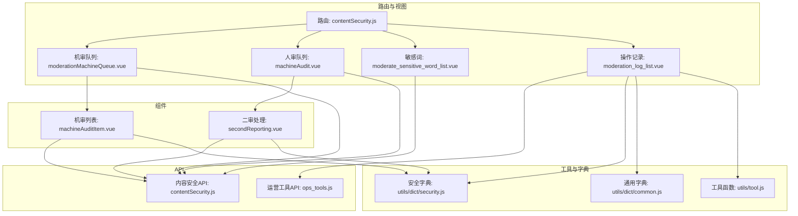
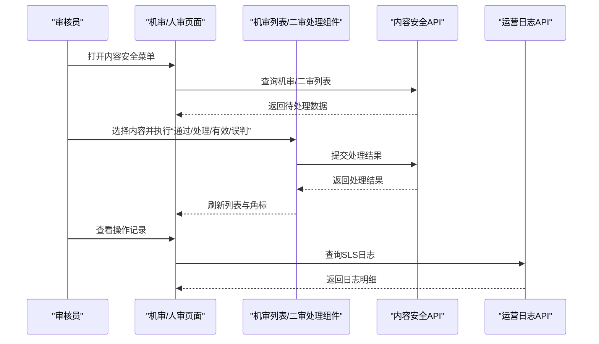
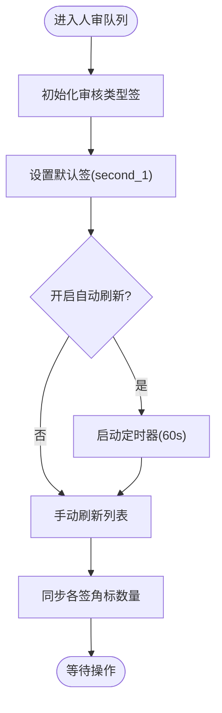
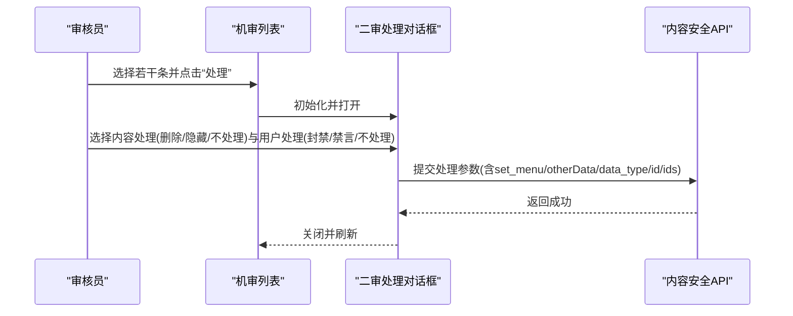
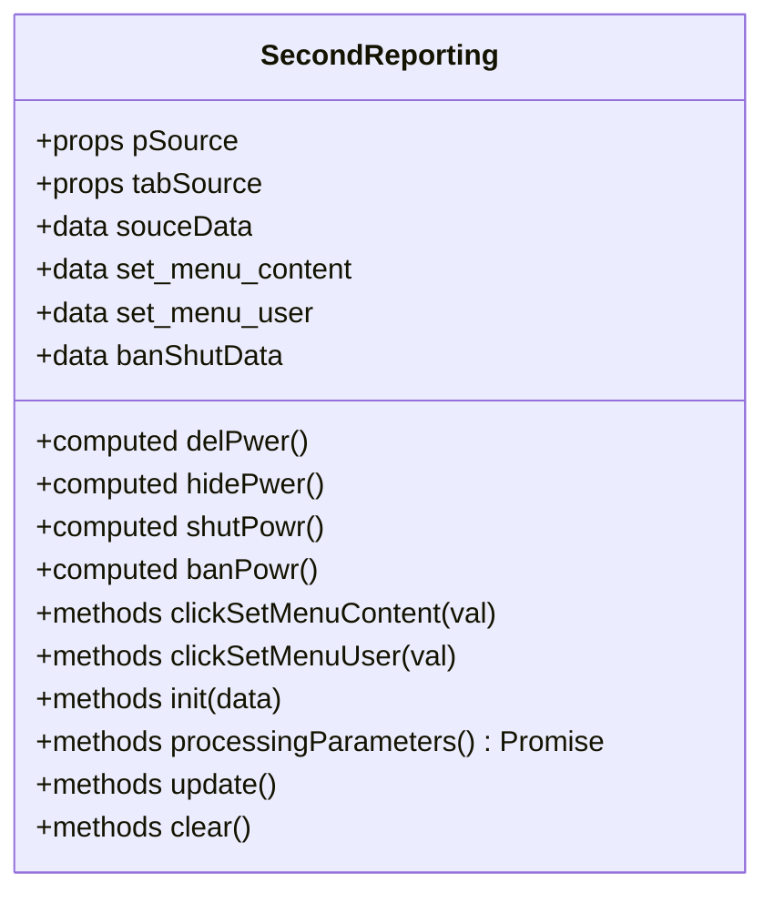
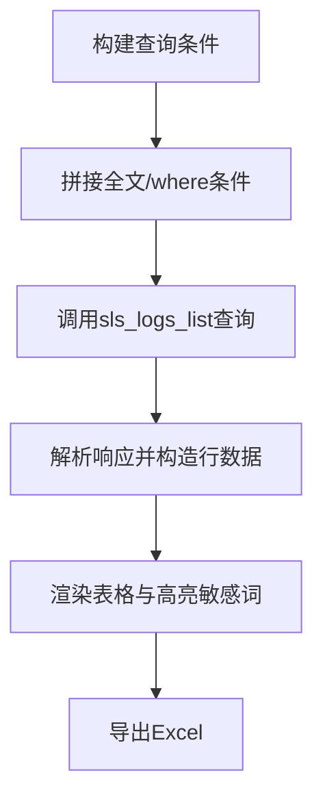
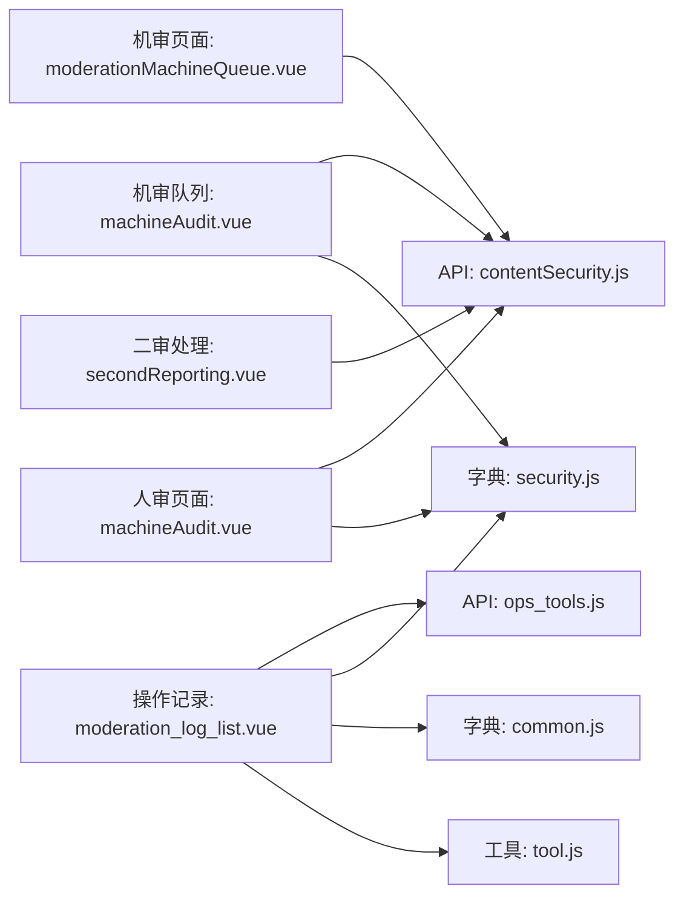
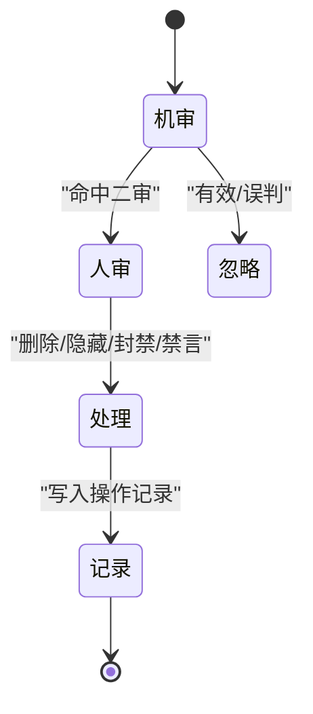

# 内容安全审核

<cite>
**本文引用的文件**
- [src/api/contentSecurity.js](file://src/api/contentSecurity.js)
- [src/router/children/contentSecurity.js](file://src/router/children/contentSecurity.js)
- [src/views/contentSecurity/machineAudit.vue](file://src/views/contentSecurity/machineAudit.vue)
- [src/views/contentSecurity/moderationMachineQueue.vue](file://src/views/contentSecurity/moderationMachineQueue.vue)
- [src/views/contentSecurity/moderation_log_list.vue](file://src/views/contentSecurity/moderation_log_list.vue)
- [src/views/contentSecurity/moderate_sensitive_word_list.vue](file://src/views/contentSecurity/moderate_sensitive_word_list.vue)
- [src/views/contentSecurity/components/machineAudit/machineAuditItem.vue](file://src/views/contentSecurity/components/machineAudit/machineAuditItem.vue)
- [src/views/contentSecurity/components/machineAudit/secondReporting.vue](file://src/views/contentSecurity/components/machineAudit/secondReporting.vue)
- [src/utils/dict/security.js](file://src/utils/dict/security.js)
- [src/utils/dict/common.js](file://src/utils/dict/common.js)
- [src/api/ops_tools.js](file://src/api/ops_tools.js)
- [src/utils/tool.js](file://src/utils/tool.js)
</cite>

## 目录
1. [简介](#简介)
2. [项目结构](#项目结构)
3. [核心组件](#核心组件)
4. [架构总览](#架构总览)
5. [详细组件分析](#详细组件分析)
6. [依赖关系分析](#依赖关系分析)
7. [性能考量](#性能考量)
8. [故障排查指南](#故障排查指南)
9. [结论](#结论)
10. [附录](#附录)

## 简介
本技术文档面向内容安全审核系统，围绕“机器审核、人工审核、内容监控、敏感词过滤”等安全管控机制进行系统化说明。文档从架构设计、数据模型、业务流程、配置项、最佳实践到可扩展的代码示例路径，帮助开发者快速理解与高效扩展安全能力。

## 项目结构
内容安全相关前端模块主要分布在以下位置：
- API 层：统一封装内容安全相关接口，包括机审、二审、敏感词管理、操作记录查询等
- 路由层：定义内容安全菜单与权限角色
- 视图层：机审队列、人审队列、敏感词管理、操作记录报表等页面
- 组件层：机审列表、二审处理对话框、敏感词标签页等
- 工具与字典：审核类型映射、权限与封禁来源对照、通用字典等

**图表来源**
- [src/router/children/contentSecurity.js:1-44](file://src/router/children/contentSecurity.js#L1-L44)
- [src/views/contentSecurity/moderationMachineQueue.vue:1-21](file://src/views/contentSecurity/moderationMachineQueue.vue#L1-L21)
- [src/views/contentSecurity/machineAudit.vue:1-164](file://src/views/contentSecurity/machineAudit.vue#L1-L164)
- [src/views/contentSecurity/moderate_sensitive_word_list.vue:1-23](file://src/views/contentSecurity/moderate_sensitive_word_list.vue#L1-L23)
- [src/views/contentSecurity/moderation_log_list.vue:1-371](file://src/views/contentSecurity/moderation_log_list.vue#L1-L371)
- [src/views/contentSecurity/components/machineAudit/machineAuditItem.vue:1-608](file://src/views/contentSecurity/components/machineAudit/machineAuditItem.vue#L1-L608)
- [src/views/contentSecurity/components/machineAudit/secondReporting.vue:1-232](file://src/views/contentSecurity/components/machineAudit/secondReporting.vue#L1-L232)
- [src/api/contentSecurity.js:1-115](file://src/api/contentSecurity.js#L1-L115)
- [src/api/ops_tools.js:1-174](file://src/api/ops_tools.js#L1-L174)
- [src/utils/dict/security.js:1-23](file://src/utils/dict/security.js#L1-L23)
- [src/utils/dict/common.js:1-723](file://src/utils/dict/common.js#L1-L723)
- [src/utils/tool.js:1-200](file://src/utils/tool.js#L1-L200)

**章节来源**
- [src/router/children/contentSecurity.js:1-44](file://src/router/children/contentSecurity.js#L1-L44)
- [src/views/contentSecurity/machineAudit.vue:1-164](file://src/views/contentSecurity/machineAudit.vue#L1-L164)
- [src/views/contentSecurity/moderationMachineQueue.vue:1-21](file://src/views/contentSecurity/moderationMachineQueue.vue#L1-L21)
- [src/views/contentSecurity/moderation_log_list.vue:1-371](file://src/views/contentSecurity/moderation_log_list.vue#L1-L371)
- [src/views/contentSecurity/moderate_sensitive_word_list.vue:1-23](file://src/views/contentSecurity/moderate_sensitive_word_list.vue#L1-L23)
- [src/views/contentSecurity/components/machineAudit/machineAuditItem.vue:1-608](file://src/views/contentSecurity/components/machineAudit/machineAuditItem.vue#L1-L608)
- [src/views/contentSecurity/components/machineAudit/secondReporting.vue:1-232](file://src/views/contentSecurity/components/machineAudit/secondReporting.vue#L1-L232)
- [src/api/contentSecurity.js:1-115](file://src/api/contentSecurity.js#L1-L115)
- [src/api/ops_tools.js:1-174](file://src/api/ops_tools.js#L1-L174)
- [src/utils/dict/security.js:1-23](file://src/utils/dict/security.js#L1-L23)
- [src/utils/dict/common.js:1-723](file://src/utils/dict/common.js#L1-L723)
- [src/utils/tool.js:1-200](file://src/utils/tool.js#L1-L200)

## 核心组件
- 机审队列页面：展示机审待处理列表，支持刷新、自动刷新、导出、查看详情等
- 人审队列页面：按审核类型分页签显示二审待处理，支持自动刷新角标数量
- 二审处理对话框：对选中或单条内容进行“删除/隐藏/不处理”和“封禁/禁言/不处理”的组合处置
- 敏感词管理：基于敏感词标签页进行增删查操作
- 操作记录：基于 SLS 的日志检索与导出，支持高亮敏感词、查看用户与内容详情

**章节来源**
- [src/views/contentSecurity/machineAudit.vue:1-164](file://src/views/contentSecurity/machineAudit.vue#L1-L164)
- [src/views/contentSecurity/moderationMachineQueue.vue:1-21](file://src/views/contentSecurity/moderationMachineQueue.vue#L1-L21)
- [src/views/contentSecurity/components/machineAudit/machineAuditItem.vue:1-608](file://src/views/contentSecurity/components/machineAudit/machineAuditItem.vue#L1-L608)
- [src/views/contentSecurity/components/machineAudit/secondReporting.vue:1-232](file://src/views/contentSecurity/components/machineAudit/secondReporting.vue#L1-L232)
- [src/views/contentSecurity/moderate_sensitive_word_list.vue:1-23](file://src/views/contentSecurity/moderate_sensitive_word_list.vue#L1-L23)
- [src/views/contentSecurity/moderation_log_list.vue:1-371](file://src/views/contentSecurity/moderation_log_list.vue#L1-L371)

## 架构总览
系统采用“前端页面 + 统一API + 字典与工具”的分层设计：
- 页面层负责交互与展示
- API 层封装内容安全相关接口（机审、二审、敏感词、日志）
- 字典与工具层提供审核类型、权限、封禁来源、时间格式化等通用能力

**图表来源**
- [src/views/contentSecurity/machineAudit.vue:133-160](file://src/views/contentSecurity/machineAudit.vue#L133-L160)
- [src/views/contentSecurity/components/machineAudit/machineAuditItem.vue:414-530](file://src/views/contentSecurity/components/machineAudit/machineAuditItem.vue#L414-L530)
- [src/views/contentSecurity/components/machineAudit/secondReporting.vue:182-224](file://src/views/contentSecurity/components/machineAudit/secondReporting.vue#L182-L224)
- [src/views/contentSecurity/moderation_log_list.vue:272-367](file://src/views/contentSecurity/moderation_log_list.vue#L272-L367)
- [src/api/contentSecurity.js:29-105](file://src/api/contentSecurity.js#L29-L105)
- [src/api/ops_tools.js:3-9](file://src/api/ops_tools.js#L3-L9)

## 详细组件分析

### 机审队列与人审队列
- 机审队列：直接加载机审列表，支持导出、批量有效/误判（聊天室场景）
- 人审队列：按审核类型生成多个签，签内角标显示各类型待处理数量，支持自动刷新定时器与角标同步

**图表来源**
- [src/views/contentSecurity/machineAudit.vue:72-160](file://src/views/contentSecurity/machineAudit.vue#L72-L160)

**章节来源**
- [src/views/contentSecurity/machineAudit.vue:1-164](file://src/views/contentSecurity/machineAudit.vue#L1-L164)
- [src/views/contentSecurity/moderationMachineQueue.vue:1-21](file://src/views/contentSecurity/moderationMachineQueue.vue#L1-L21)

### 机审列表组件
- 支持多类型内容（帖子、评论、聊天室、资讯评论、评分评论、集锦视频评论）
- 支持本地分页、批量选择、导出Excel、查看详情、风险提示、敏感词高亮
- 机审操作：批量/单条“有效/误判”，调用忽略接口
- 二审操作：批量/单条“通过/处理”，触发二审处理对话框

**图表来源**
- [src/views/contentSecurity/components/machineAudit/machineAuditItem.vue:467-530](file://src/views/contentSecurity/components/machineAudit/machineAuditItem.vue#L467-L530)
- [src/views/contentSecurity/components/machineAudit/secondReporting.vue:182-224](file://src/views/contentSecurity/components/machineAudit/secondReporting.vue#L182-L224)
- [src/api/contentSecurity.js:46-70](file://src/api/contentSecurity.js#L46-L70)

**章节来源**
- [src/views/contentSecurity/components/machineAudit/machineAuditItem.vue:1-608](file://src/views/contentSecurity/components/machineAudit/machineAuditItem.vue#L1-L608)
- [src/views/contentSecurity/components/machineAudit/secondReporting.vue:1-232](file://src/views/contentSecurity/components/machineAudit/secondReporting.vue#L1-L232)
- [src/api/contentSecurity.js:1-115](file://src/api/contentSecurity.js#L1-L115)

### 二审处理对话框
- 动态权限校验：根据内容类型映射到删除/隐藏权限与封禁/禁言权限
- 内容处理：删除/隐藏，需填写原因
- 用户处理：封禁（来源与固定来源）、禁言（按来源类型区分）
- 参数组装：set_menu 位掩码 + otherData（删除/隐藏/封禁/禁言参数），按 tabSource 注入 data_type

**图表来源**
- [src/views/contentSecurity/components/machineAudit/secondReporting.vue:64-232](file://src/views/contentSecurity/components/machineAudit/secondReporting.vue#L64-L232)
- [src/utils/dict/common.js:690-710](file://src/utils/dict/common.js#L690-L710)

**章节来源**
- [src/views/contentSecurity/components/machineAudit/secondReporting.vue:1-232](file://src/views/contentSecurity/components/machineAudit/secondReporting.vue#L1-L232)
- [src/utils/dict/common.js:690-710](file://src/utils/dict/common.js#L690-L710)

### 敏感词管理
- 使用统一的敏感词标签页组件，支持按场景（内容安全）进行增删查
- 场景说明与使用范围在通用字典中定义

**章节来源**
- [src/views/contentSecurity/moderate_sensitive_word_list.vue:1-23](file://src/views/contentSecurity/moderate_sensitive_word_list.vue#L1-L23)
- [src/utils/dict/common.js:606-621](file://src/utils/dict/common.js#L606-L621)

### 操作记录与日志
- 基于 SLS 查询接口，支持时间范围、全文检索、where 条件拼装
- 列表字段包含操作时间、操作人、审核延迟、UID、内容ID、标题、内容、图片、审核结果、处理方式、分类、处理理由、风险提示、额外数据
- 支持导出 Excel、查看用户详情、打开对应内容详情弹窗

**图表来源**
- [src/views/contentSecurity/moderation_log_list.vue:272-367](file://src/views/contentSecurity/moderation_log_list.vue#L272-L367)
- [src/api/ops_tools.js:3-9](file://src/api/ops_tools.js#L3-L9)
- [src/utils/tool.js:1-200](file://src/utils/tool.js#L1-L200)

**章节来源**
- [src/views/contentSecurity/moderation_log_list.vue:1-371](file://src/views/contentSecurity/moderation_log_list.vue#L1-L371)
- [src/api/ops_tools.js:1-174](file://src/api/ops_tools.js#L1-L174)
- [src/utils/tool.js:1-200](file://src/utils/tool.js#L1-L200)

## 依赖关系分析
- 页面依赖 API 层提供的内容安全接口与运营日志接口
- 组件依赖字典中的审核类型与权限来源映射
- 页面与组件共享工具函数（时间格式化、高亮敏感词等）

**图表来源**
- [src/views/contentSecurity/machineAudit.vue:1-164](file://src/views/contentSecurity/machineAudit.vue#L1-L164)
- [src/views/contentSecurity/moderationMachineQueue.vue:1-21](file://src/views/contentSecurity/moderationMachineQueue.vue#L1-L21)
- [src/views/contentSecurity/components/machineAudit/machineAuditItem.vue:1-608](file://src/views/contentSecurity/components/machineAudit/machineAuditItem.vue#L1-L608)
- [src/views/contentSecurity/components/machineAudit/secondReporting.vue:1-232](file://src/views/contentSecurity/components/machineAudit/secondReporting.vue#L1-L232)
- [src/views/contentSecurity/moderation_log_list.vue:1-371](file://src/views/contentSecurity/moderation_log_list.vue#L1-L371)
- [src/api/contentSecurity.js:1-115](file://src/api/contentSecurity.js#L1-L115)
- [src/api/ops_tools.js:1-174](file://src/api/ops_tools.js#L1-L174)
- [src/utils/dict/security.js:1-23](file://src/utils/dict/security.js#L1-L23)
- [src/utils/dict/common.js:1-723](file://src/utils/dict/common.js#L1-L723)
- [src/utils/tool.js:1-200](file://src/utils/tool.js#L1-L200)

**章节来源**
- [src/api/contentSecurity.js:1-115](file://src/api/contentSecurity.js#L1-L115)
- [src/api/ops_tools.js:1-174](file://src/api/ops_tools.js#L1-L174)
- [src/utils/dict/security.js:1-23](file://src/utils/dict/security.js#L1-L23)
- [src/utils/dict/common.js:1-723](file://src/utils/dict/common.js#L1-L723)
- [src/utils/tool.js:1-200](file://src/utils/tool.js#L1-L200)

## 性能考量
- 自动刷新：人审队列支持定时刷新角标，建议合理设置刷新周期以平衡实时性与请求压力
- 本地分页：机审列表采用本地分页，减少网络请求；注意大数据量时的内存占用
- 导出与高亮：导出与敏感词高亮涉及大量 DOM 与字符串处理，建议在移动端谨慎使用
- 日志查询：SLS 查询建议限制时间范围与关键词，避免全量扫描

[本节为通用指导，无需特定文件引用]

## 故障排查指南
- 机审/二审列表为空：检查接口返回码与 data_type 参数是否正确注入
- 二审处理失败：确认 set_menu 位掩码与 otherData 结构是否符合接口要求
- 角标不同步：检查角标更新逻辑与 DOM 同步时机
- 操作记录无数据：确认 SLS 查询语句拼装与时间范围是否正确

**章节来源**
- [src/views/contentSecurity/machineAudit.vue:114-160](file://src/views/contentSecurity/machineAudit.vue#L114-L160)
- [src/views/contentSecurity/components/machineAudit/machineAuditItem.vue:553-604](file://src/views/contentSecurity/components/machineAudit/machineAuditItem.vue#L553-L604)
- [src/views/contentSecurity/components/machineAudit/secondReporting.vue:182-224](file://src/views/contentSecurity/components/machineAudit/secondReporting.vue#L182-L224)
- [src/views/contentSecurity/moderation_log_list.vue:272-367](file://src/views/contentSecurity/moderation_log_list.vue#L272-L367)

## 结论
内容安全审核系统通过清晰的页面与组件分层、统一的 API 接口与字典工具，实现了从机审到人审再到日志审计的完整闭环。结合敏感词管理与灵活的权限控制，能够满足多场景下的内容治理需求。建议在实际部署中关注刷新策略、导出性能与日志查询效率，并持续优化误判率与处理策略。

[本节为总结性内容，无需特定文件引用]

## 附录

### 数据模型与字段说明
- 审核记录（日志）关键字段
  - ctime：操作时间
  - delay_time：审核延迟
  - uid：用户ID
  - object_id：内容ID
  - operate/operate_type/model：操作人/类型/模型
  - title/content/image：标题/内容/图片
  - mod_result：审核结果
  - handler_result：处理方式
  - moderate_type：审核类型
  - risk：风险提示
  - response：额外数据（JSON）
- 机审/二审列表关键字段
  - id：记录ID
  - uid：用户ID
  - item_detail：内容详情（含标题、内容、附件、额外参数）
  - extra：额外数据（含敏感词、房间ID、匹配ID等）
  - attachments/params：附件与参数
  - risk：风险提示
  - created_at：发布时间

**章节来源**
- [src/views/contentSecurity/moderation_log_list.vue:23-147](file://src/views/contentSecurity/moderation_log_list.vue#L23-L147)
- [src/views/contentSecurity/components/machineAudit/machineAuditItem.vue:571-591](file://src/views/contentSecurity/components/machineAudit/machineAuditItem.vue#L571-L591)

### 业务流程与关键节点
- 内容提交 -> 机审 -> 人审 -> 处理执行 -> 操作记录
- 机审：有效/误判
- 人审：通过/处理（删除/隐藏/不处理）+（封禁/禁言/不处理）

[本图为概念流程，无需图表来源]

### 配置项与扩展建议
- 审核类型映射：通过安全字典维护，新增类型需同步更新映射与权限来源
- 权限来源：二审处理的删除/隐藏与封禁/禁言权限来源于通用字典，扩展时需补充对应权限键
- 敏感词场景：在通用字典中定义场景与规则，便于前端统一展示与校验
- 日志查询：建议在查询面板增加时间范围与关键词的默认值，提升查询效率

**章节来源**
- [src/utils/dict/security.js:1-23](file://src/utils/dict/security.js#L1-L23)
- [src/utils/dict/common.js:606-621](file://src/utils/dict/common.js#L606-L621)
- [src/views/contentSecurity/moderation_log_list.vue:272-367](file://src/views/contentSecurity/moderation_log_list.vue#L272-L367)

### 最佳实践
- 审核效率优化：合理设置自动刷新周期；对大列表启用虚拟滚动与懒加载
- 误判率控制：建立误判上报与复核机制；定期回放与统计
- 合规性要求：确保敏感词规则与法律法规一致；保留完整的操作记录与证据链
- 可扩展性：将规则与策略抽象为可配置项；组件化处理流程，降低耦合度

[本节为通用指导，无需特定文件引用]