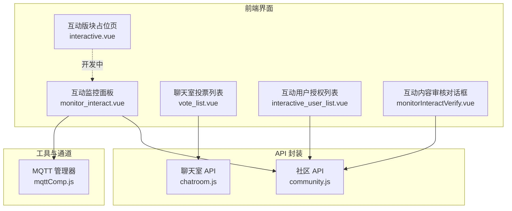
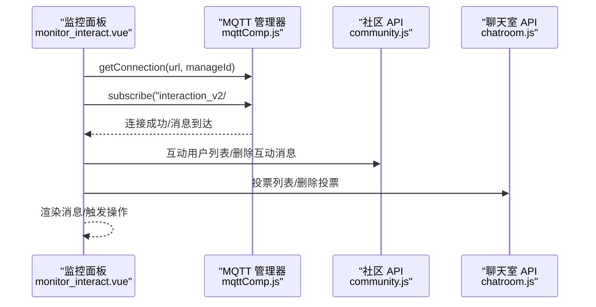
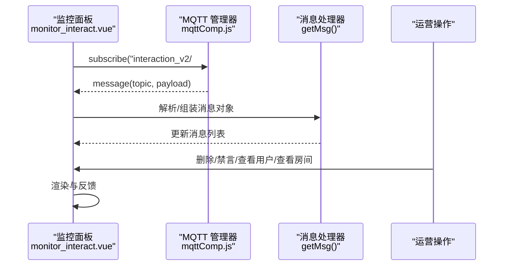
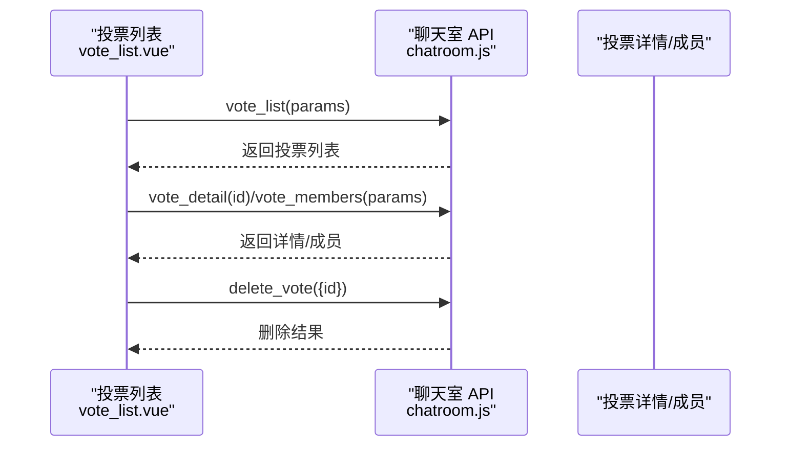
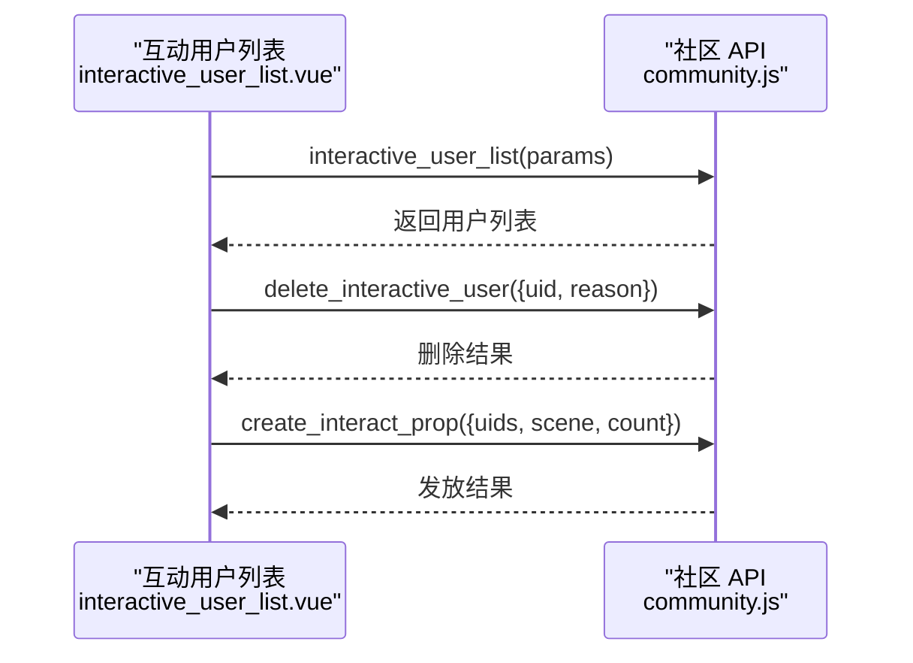
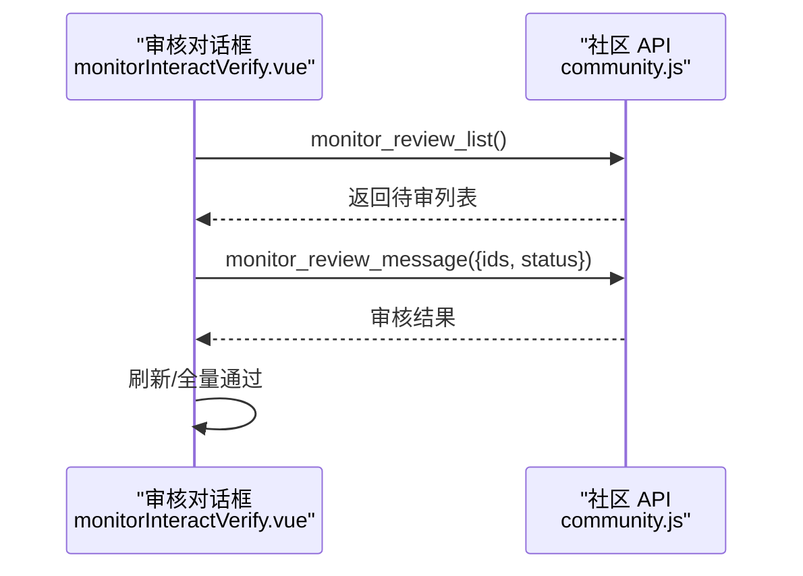
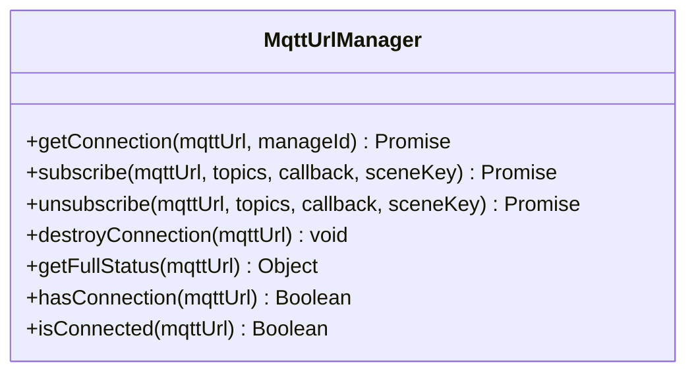
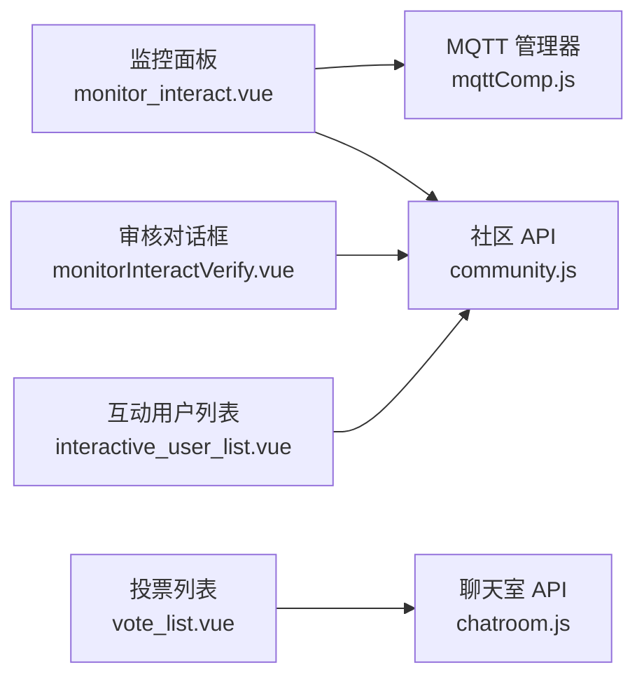

# 互动行为监控

<cite>
**本文引用的文件**
- [interactive.vue](file://src/components/leisu/peopleInfo/interactive/interactive.vue)
- [interactive_user_list.vue](file://src/views/forum/interactive_user_list.vue)
- [monitor_interact.vue](file://src/views/forum/monitor_interact.vue)
- [monitorInteractVerify.vue](file://src/views/forum/components/monitorInteractVerify.vue)
- [vote_list.vue](file://src/views/chat_room/vote_list.vue)
- [chatroom.js](file://src/api/chatroom.js)
- [community.js](file://src/api/community.js)
- [mqttComp.js](file://src/utils/mqttComp.js)
</cite>

## 目录
1. [简介](#简介)
2. [项目结构](#项目结构)
3. [核心组件](#核心组件)
4. [架构总览](#架构总览)
5. [详细组件分析](#详细组件分析)
6. [依赖关系分析](#依赖关系分析)
7. [性能考量](#性能考量)
8. [故障排查指南](#故障排查指南)
9. [结论](#结论)
10. [附录](#附录)

## 简介
本技术文档围绕互动行为监控系统展开，覆盖用户互动监控、聊天室监控、投票行为监控等核心功能。系统通过消息流实时订阅与处理、行为轨迹采集与统计、异常行为检测与干预、可视化分析与报表，以及隐私与合规设计，形成完整的互动治理闭环。

## 项目结构
互动监控相关模块主要分布在以下区域：
- 聊天室与投票：聊天室投票列表、投票详情与成员查询、礼物卡与表情包管理、敏感词与举报管理等
- 社区互动监控：直播互动监控面板、内容审核、互动用户授权与道具发放、互动日志与报表
- 实时消息通道：基于 MQTT 的消息订阅与分发，支持通配符与场景化订阅
- 工具与接口：统一的 API 封装，涵盖聊天室、社区、投票、审核等能力

图表来源
- [monitor_interact.vue:462-472](file://src/views/forum/monitor_interact.vue#L462-L472)
- [mqttComp.js:14-97](file://src/utils/mqttComp.js#L14-L97)
- [chatroom.js:203-239](file://src/api/chatroom.js#L203-L239)
- [community.js:162-176](file://src/api/community.js#L162-L176)
- [interactive_user_list.vue:392-422](file://src/views/forum/interactive_user_list.vue#L392-L422)
- [monitorInteractVerify.vue:124-146](file://src/views/forum/components/monitorInteractVerify.vue#L124-L146)

章节来源
- [monitor_interact.vue:1-749](file://src/views/forum/monitor_interact.vue#L1-L749)
- [mqttComp.js:1-564](file://src/utils/mqttComp.js#L1-L564)
- [chatroom.js:1-351](file://src/api/chatroom.js#L1-L351)
- [community.js:1-676](file://src/api/community.js#L1-L676)
- [vote_list.vue:1-203](file://src/views/chat_room/vote_list.vue#L1-L203)
- [interactive_user_list.vue:1-559](file://src/views/forum/interactive_user_list.vue#L1-L559)
- [monitorInteractVerify.vue:1-254](file://src/views/forum/components/monitorInteractVerify.vue#L1-L254)
- [interactive.vue:1-227](file://src/components/leisu/peopleInfo/interactive/interactive.vue#L1-L227)

## 核心组件
- 互动监控面板：实时接收并展示互动消息，支持删除、禁言、审核、主题色切换等操作
- 聊天室投票：查看与管理投票，支持删除投票、查看选项与统计
- 互动用户授权：管理具备直播互动权限的用户，支持批量设置、发放道具卡、查看日志
- 互动内容审核：对需要审核的内容进行批量通过/拒绝，支持定时刷新与全量通过
- MQTT 管理器：连接池、场景化订阅、通配符匹配、回调去重与自动销毁

章节来源
- [monitor_interact.vue:253-749](file://src/views/forum/monitor_interact.vue#L253-L749)
- [vote_list.vue:1-203](file://src/views/chat_room/vote_list.vue#L1-L203)
- [interactive_user_list.vue:1-559](file://src/views/forum/interactive_user_list.vue#L1-L559)
- [monitorInteractVerify.vue:1-254](file://src/views/forum/components/monitorInteractVerify.vue#L1-L254)
- [mqttComp.js:1-564](file://src/utils/mqttComp.js#L1-L564)

## 架构总览
系统采用“前端界面 + MQTT 实时通道 + API 封装”的三层架构：
- 前端界面负责交互与可视化，调用 API 获取数据并订阅实时消息
- MQTT 管理器负责连接、订阅、消息分发与场景隔离
- API 封装提供聊天室、社区、投票、审核等能力的统一入口

图表来源
- [monitor_interact.vue:462-472](file://src/views/forum/monitor_interact.vue#L462-L472)
- [mqttComp.js:14-97](file://src/utils/mqttComp.js#L14-L97)
- [community.js:162-176](file://src/api/community.js#L162-L176)
- [chatroom.js:203-239](file://src/api/chatroom.js#L203-L239)

## 详细组件分析

### 组件一：互动监控面板（实时消息流）
- 功能要点
  - 初始化 MQTT 连接并订阅主题
  - 解析消息、组装渲染对象、维护消息列表
  - 支持删除消息、禁言用户、查看用户信息、查看房间历史、红包详情等
  - 支持主题色切换与字号调整
- 实时处理
  - 使用 MQTT 管理器的场景化订阅，避免重复订阅与回调冲突
  - 对消息进行解密与结构化处理，支持多种消息类型（文本、图片、系统消息、红包等）
  - 控制消息列表长度，保持前端性能
- 异常与干预
  - 提供删除与禁言入口，结合审核流程实现人工干预
  - 支持清空列表与主题色切换，提升运营效率

图表来源
- [monitor_interact.vue:462-658](file://src/views/forum/monitor_interact.vue#L462-L658)
- [mqttComp.js:115-166](file://src/utils/mqttComp.js#L115-L166)

章节来源
- [monitor_interact.vue:253-749](file://src/views/forum/monitor_interact.vue#L253-L749)
- [mqttComp.js:1-564](file://src/utils/mqttComp.js#L1-L564)

### 组件二：聊天室投票管理
- 功能要点
  - 展示投票列表，支持查看比赛信息、选项、总票数、持续时间与截止时间
  - 支持添加与删除投票，查看投票成员明细
- 数据来源
  - 通过聊天室 API 获取投票列表、详情、成员列表，并支持删除投票

图表来源
- [vote_list.vue:168-200](file://src/views/chat_room/vote_list.vue#L168-L200)
- [chatroom.js:203-239](file://src/api/chatroom.js#L203-L239)

章节来源
- [vote_list.vue:1-203](file://src/views/chat_room/vote_list.vue#L1-L203)
- [chatroom.js:203-239](file://src/api/chatroom.js#L203-L239)

### 组件三：互动用户授权与道具发放
- 功能要点
  - 展示具备直播互动权限的用户列表，支持批量设置、修改价格与发布次数、发放道具卡
  - 支持查看权限获得时间、粉丝数、运动类型、分成比例等
  - 支持移除权限与查看日志
- 数据来源
  - 通过社区 API 获取互动用户列表、删除互动用户、创建互动道具卡等

图表来源
- [interactive_user_list.vue:392-422](file://src/views/forum/interactive_user_list.vue#L392-L422)
- [community.js:198-221](file://src/api/community.js#L198-L221)
- [community.js:293-308](file://src/api/community.js#L293-L308)

章节来源
- [interactive_user_list.vue:1-559](file://src/views/forum/interactive_user_list.vue#L1-L559)
- [community.js:198-308](file://src/api/community.js#L198-L308)

### 组件四：互动内容审核
- 功能要点
  - 展示待审核内容，支持批量通过/拒绝、全量通过、定时刷新
  - 支持查看帖子详情与附件
- 数据来源
  - 通过社区 API 获取审核列表与执行审核操作

图表来源
- [monitorInteractVerify.vue:124-251](file://src/views/forum/components/monitorInteractVerify.vue#L124-L251)
- [community.js:162-176](file://src/api/community.js#L162-L176)

章节来源
- [monitorInteractVerify.vue:1-254](file://src/views/forum/components/monitorInteractVerify.vue#L1-L254)
- [community.js:162-176](file://src/api/community.js#L162-L176)

### 组件五：MQTT 管理器（实时通道）
- 功能要点
  - 连接池管理：按 URL 复用连接，避免重复握手
  - 场景化订阅：同一主题在场景内去重，回调去重，支持通配符
  - 全局订阅优化：当存在通配符时仅订阅通配符，减少服务器压力
  - 自动销毁：无场景订阅时自动断开连接
- 性能与可靠性
  - 连接状态检查、错误与关闭事件处理
  - 消息解析与场景回调分发，异常回调捕获

图表来源
- [mqttComp.js:3-564](file://src/utils/mqttComp.js#L3-L564)

章节来源
- [mqttComp.js:1-564](file://src/utils/mqttComp.js#L1-L564)

## 依赖关系分析
- 组件耦合
  - 监控面板强依赖 MQTT 管理器与社区 API；投票列表依赖聊天室 API；审核对话框依赖社区 API
- 外部依赖
  - MQTT 客户端库用于实时消息传输
  - Element UI 组件库用于表格、按钮、对话框等 UI 组成
- 潜在风险
  - MQTT 连接失败或消息解析异常可能影响监控面板显示
  - 通配符订阅与场景订阅的边界需清晰，避免重复订阅与资源浪费

图表来源
- [monitor_interact.vue:462-472](file://src/views/forum/monitor_interact.vue#L462-L472)
- [mqttComp.js:14-97](file://src/utils/mqttComp.js#L14-L97)
- [chatroom.js:203-239](file://src/api/chatroom.js#L203-L239)
- [community.js:162-176](file://src/api/community.js#L162-L176)
- [interactive_user_list.vue:392-422](file://src/views/forum/interactive_user_list.vue#L392-L422)
- [monitorInteractVerify.vue:124-146](file://src/views/forum/components/monitorInteractVerify.vue#L124-L146)

章节来源
- [monitor_interact.vue:1-749](file://src/views/forum/monitor_interact.vue#L1-L749)
- [mqttComp.js:1-564](file://src/utils/mqttComp.js#L1-L564)
- [chatroom.js:1-351](file://src/api/chatroom.js#L1-L351)
- [community.js:1-676](file://src/api/community.js#L1-L676)
- [vote_list.vue:1-203](file://src/views/chat_room/vote_list.vue#L1-L203)
- [interactive_user_list.vue:1-559](file://src/views/forum/interactive_user_list.vue#L1-L559)
- [monitorInteractVerify.vue:1-254](file://src/views/forum/components/monitorInteractVerify.vue#L1-L254)

## 性能考量
- 实时消息处理
  - 控制消息列表长度，避免 DOM 过多导致卡顿
  - 使用场景化订阅与通配符优化，减少订阅数量
- 请求与渲染
  - 分页加载与懒加载策略，降低初始渲染压力
  - 对图片与附件采用缩略图与延迟加载
- 连接管理
  - 连接池复用与自动销毁，避免资源泄露
  - 错误与关闭事件处理，保证稳定性

## 故障排查指南
- MQTT 连接问题
  - 检查连接池状态与订阅状态，确认 URL 与 manageId 正确
  - 查看连接事件与错误日志，定位网络或鉴权问题
- 消息解析异常
  - 检查消息格式与解密逻辑，确保字段完整性
  - 核对回调绑定与场景匹配，避免回调丢失
- 审核与操作失败
  - 确认 API 返回码与提示信息，检查参数与权限
  - 对批量操作进行二次确认，避免误操作

章节来源
- [mqttComp.js:78-96](file://src/utils/mqttComp.js#L78-L96)
- [monitor_interact.vue:565-658](file://src/views/forum/monitor_interact.vue#L565-L658)
- [monitorInteractVerify.vue:206-230](file://src/views/forum/components/monitorInteractVerify.vue#L206-L230)

## 结论
互动行为监控系统以 MQTT 实时通道为核心，结合社区与聊天室 API，实现了对直播互动、投票行为与内容审核的全链路治理。通过场景化订阅、消息解密与渲染、人工干预与自动化流程，系统在保证实时性的同时兼顾了可运维性与可扩展性。建议后续完善异常检测算法与可视化分析模块，进一步提升风险识别与决策支持能力。

## 附录
- 互动版块占位页：当前处于开发中状态，后续将接入更多监控与分析能力
- 隐私与合规：系统在消息处理与存储层面遵循最小化原则，仅采集必要信息，并提供删除与禁言等干预手段，满足合规要求

章节来源
- [interactive.vue:1-227](file://src/components/leisu/peopleInfo/interactive/interactive.vue#L1-L227)