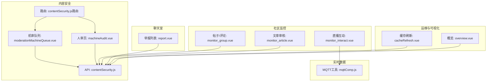
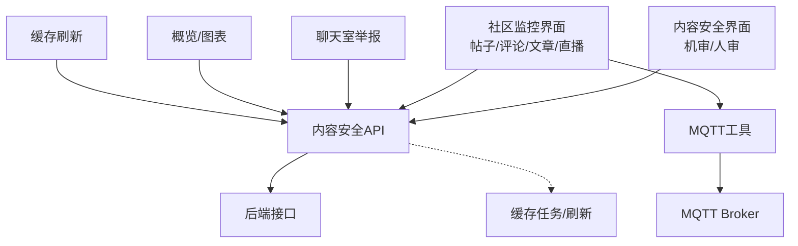
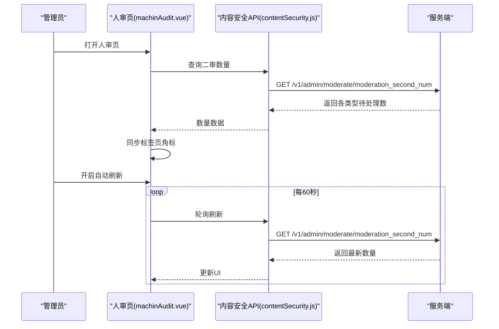
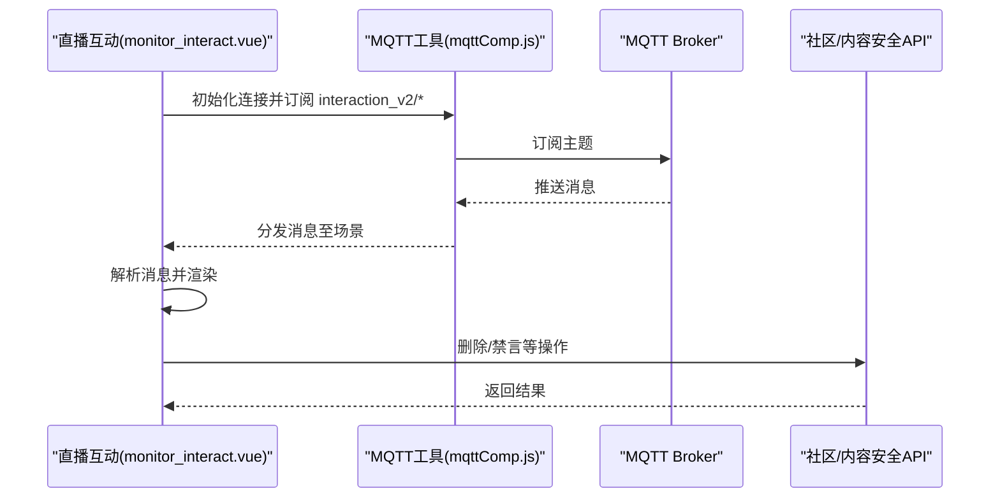
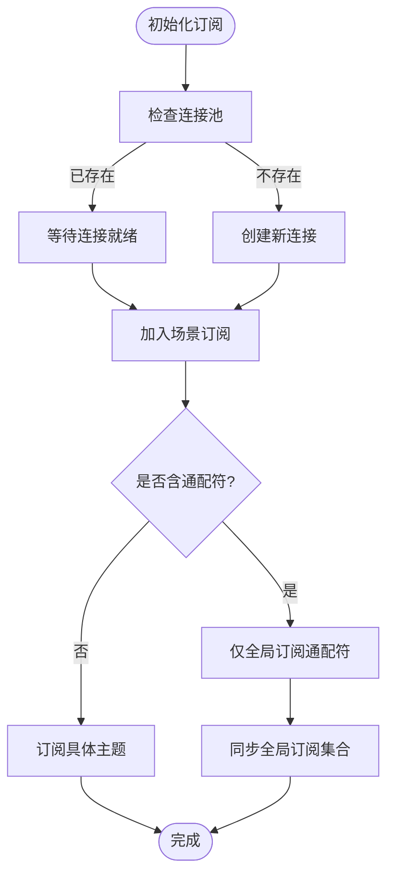
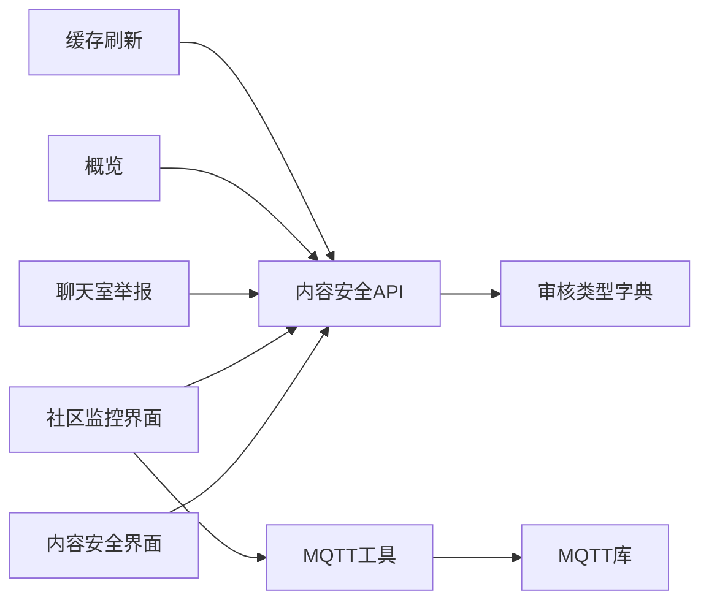

# 内容监控

<cite>
**本文引用的文件**
- [contentSecurity.js](file://src/api/contentSecurity.js)
- [contentSecurity.js（路由）](file://src/router/children/contentSecurity.js)
- [machineAudit.vue](file://src/views/contentSecurity/machineAudit.vue)
- [moderationMachineQueue.vue](file://src/views/contentSecurity/moderationMachineQueue.vue)
- [monitor_interact.vue](file://src/views/forum/monitor_interact.vue)
- [monitor_article.vue](file://src/views/forum/monitor_article.vue)
- [monitor_group.vue](file://src/views/forum/monitor_group.vue)
- [report.vue](file://src/views/chat_room/report.vue)
- [mqttComp.js](file://src/utils/mqttComp.js)
- [security.js（字典）](file://src/utils/dict/security.js)
- [overview.vue](file://src/views/dashboard/overview.vue)
- [cacheRefresh.vue](file://src/views/ops_tools/cacheRefresh.vue)
- [contentSecurity.md（MQTT示例）](file://public/mqttMsg.md)
</cite>

## 目录
1. [引言](#引言)
2. [项目结构](#项目结构)
3. [核心组件](#核心组件)
4. [架构总览](#架构总览)
5. [详细组件分析](#详细组件分析)
6. [依赖关系分析](#依赖关系分析)
7. [性能考量](#性能考量)
8. [故障排查指南](#故障排查指南)
9. [结论](#结论)
10. [附录](#附录)

## 引言
本技术文档面向内容监控系统，覆盖社区监控、自媒体审核、直播间监控等多场景。文档从系统架构、数据采集、处理与告警、可视化展示、性能优化等方面进行系统性梳理，并结合仓库现有代码实现路径，帮助读者快速理解与落地。

## 项目结构
内容监控相关能力主要分布在以下模块：
- 内容安全（机审/人审、敏感词、操作记录）
- 社区监控（帖子/评论/互动直播）
- 聊天室举报
- 实时数据接入（MQTT）
- 运维工具（缓存刷新）
- 仪表盘（概览）

**图表来源**
- [contentSecurity.js（路由）:1-44](file://src/router/children/contentSecurity.js#L1-L44)
- [moderationMachineQueue.vue:1-21](file://src/views/contentSecurity/moderationMachineQueue.vue#L1-L21)
- [machineAudit.vue:1-164](file://src/views/contentSecurity/machineAudit.vue#L1-L164)
- [monitor_interact.vue:1-749](file://src/views/forum/monitor_interact.vue#L1-L749)
- [monitor_group.vue:1-800](file://src/views/forum/monitor_group.vue#L1-L800)
- [monitor_article.vue:1-689](file://src/views/forum/monitor_article.vue#L1-L689)
- [report.vue:1-148](file://src/views/chat_room/report.vue#L1-L148)
- [mqttComp.js:1-563](file://src/utils/mqttComp.js#L1-L563)
- [cacheRefresh.vue:87-150](file://src/views/ops_tools/cacheRefresh.vue#L87-L150)
- [overview.vue:1-331](file://src/views/dashboard/overview.vue#L1-L331)

**章节来源**
- [contentSecurity.js（路由）:1-44](file://src/router/children/contentSecurity.js#L1-L44)
- [contentSecurity.js:1-115](file://src/api/contentSecurity.js#L1-L115)
- [monitor_interact.vue:1-749](file://src/views/forum/monitor_interact.vue#L1-L749)
- [monitor_group.vue:1-800](file://src/views/forum/monitor_group.vue#L1-L800)
- [monitor_article.vue:1-689](file://src/views/forum/monitor_article.vue#L1-L689)
- [report.vue:1-148](file://src/views/chat_room/report.vue#L1-L148)
- [mqttComp.js:1-563](file://src/utils/mqttComp.js#L1-L563)
- [cacheRefresh.vue:87-150](file://src/views/ops_tools/cacheRefresh.vue#L87-L150)
- [overview.vue:1-331](file://src/views/dashboard/overview.vue#L1-L331)

## 核心组件
- 内容安全API封装：统一暴露机审/人审、敏感词、操作记录等接口，便于前端调用与扩展。
- 机审/人审界面：提供自动刷新、标签页聚合、待处理数量同步等交互。
- 社区监控：帖子/评论/文章审核、直播互动流式展示与操作。
- 聊天室举报：举报列表查询与排序。
- MQTT工具：连接池、场景化订阅、通配符优化、全局订阅合并。
- 运维与可视化：缓存任务查询与刷新、运营概览图表。

**章节来源**
- [contentSecurity.js:1-115](file://src/api/contentSecurity.js#L1-L115)
- [machineAudit.vue:1-164](file://src/views/contentSecurity/machineAudit.vue#L1-L164)
- [monitor_interact.vue:1-749](file://src/views/forum/monitor_interact.vue#L1-L749)
- [monitor_group.vue:1-800](file://src/views/forum/monitor_group.vue#L1-L800)
- [monitor_article.vue:1-689](file://src/views/forum/monitor_article.vue#L1-L689)
- [report.vue:1-148](file://src/views/chat_room/report.vue#L1-L148)
- [mqttComp.js:1-563](file://src/utils/mqttComp.js#L1-L563)
- [cacheRefresh.vue:87-150](file://src/views/ops_tools/cacheRefresh.vue#L87-L150)
- [overview.vue:1-331](file://src/views/dashboard/overview.vue#L1-L331)

## 架构总览
内容监控系统采用“前端页面 + API封装 + 实时数据接入”的分层设计：
- 页面层：内容安全、社区监控、聊天室举报、概览与运维。
- 服务层：API封装统一调用后端接口。
- 数据层：MQTT实时事件流、历史数据查询、缓存任务。

**图表来源**
- [contentSecurity.js:1-115](file://src/api/contentSecurity.js#L1-L115)
- [machineAudit.vue:1-164](file://src/views/contentSecurity/machineAudit.vue#L1-L164)
- [monitor_interact.vue:1-749](file://src/views/forum/monitor_interact.vue#L1-L749)
- [monitor_group.vue:1-800](file://src/views/forum/monitor_group.vue#L1-L800)
- [monitor_article.vue:1-689](file://src/views/forum/monitor_article.vue#L1-L689)
- [report.vue:1-148](file://src/views/chat_room/report.vue#L1-L148)
- [mqttComp.js:1-563](file://src/utils/mqttComp.js#L1-L563)
- [cacheRefresh.vue:87-150](file://src/views/ops_tools/cacheRefresh.vue#L87-L150)
- [overview.vue:1-331](file://src/views/dashboard/overview.vue#L1-L331)

## 详细组件分析

### 内容安全：机审/人审与敏感词
- 机审队列：独立入口，承载机审任务。
- 人审页：按审核类型分标签页，支持自动刷新与待处理数量同步。
- 敏感词：统一查询与维护入口。
- 审核类型字典：定义各场景的审核类型与权限映射。

**图表来源**
- [machineAudit.vue:133-160](file://src/views/contentSecurity/machineAudit.vue#L133-L160)
- [contentSecurity.js:37-44](file://src/api/contentSecurity.js#L37-L44)

**章节来源**
- [moderationMachineQueue.vue:1-21](file://src/views/contentSecurity/moderationMachineQueue.vue#L1-L21)
- [machineAudit.vue:1-164](file://src/views/contentSecurity/machineAudit.vue#L1-L164)
- [contentSecurity.js:1-115](file://src/api/contentSecurity.js#L1-L115)
- [security.js（字典）:1-23](file://src/utils/dict/security.js#L1-L23)

### 社区监控：帖子/评论/文章审核与直播互动
- 帖子/评论/文章审核：支持批量/单项审批、隐藏/删除/封禁、IP与平台信息展示、自动刷新。
- 直播互动：订阅MQTT主题，实时渲染消息、支持删除、禁言、红包详情等操作。

**图表来源**
- [monitor_interact.vue:462-472](file://src/views/forum/monitor_interact.vue#L462-L472)
- [mqttComp.js:115-249](file://src/utils/mqttComp.js#L115-L249)

**章节来源**
- [monitor_group.vue:1-800](file://src/views/forum/monitor_group.vue#L1-L800)
- [monitor_article.vue:1-689](file://src/views/forum/monitor_article.vue#L1-L689)
- [monitor_interact.vue:1-749](file://src/views/forum/monitor_interact.vue#L1-L749)
- [mqttComp.js:1-563](file://src/utils/mqttComp.js#L1-L563)

### 聊天室举报
- 提供举报列表查询、排序、分页，展示举报人/被举报人、IP、时间等信息。

**章节来源**
- [report.vue:1-148](file://src/views/chat_room/report.vue#L1-L148)

### 实时数据采集与异常检测（MQTT）
- 连接池与场景化订阅：同一URL复用连接，场景隔离，避免重复订阅。
- 通配符优化：存在通配符时仅全局订阅通配符，减少服务器压力。
- 自动销毁：无订阅场景自动销毁连接，降低资源占用。

**图表来源**
- [mqttComp.js:14-96](file://src/utils/mqttComp.js#L14-L96)
- [mqttComp.js:115-249](file://src/utils/mqttComp.js#L115-L249)
- [mqttComp.js:256-329](file://src/utils/mqttComp.js#L256-L329)

**章节来源**
- [mqttComp.js:1-563](file://src/utils/mqttComp.js#L1-L563)

### 运维与可视化
- 缓存刷新：查询缓存任务、查看刷新排行、触发刷新。
- 概览：多维度图表（在线、活跃、留存、版本分布等），支持时间范围与网格切换。

**章节来源**
- [cacheRefresh.vue:87-150](file://src/views/ops_tools/cacheRefresh.vue#L87-L150)
- [overview.vue:1-331](file://src/views/dashboard/overview.vue#L1-L331)

## 依赖关系分析
- 页面与API：内容安全、社区监控、举报、概览均依赖API封装。
- 实时数据：直播互动依赖MQTT工具；MQTT工具依赖MQTT库与连接池。
- 字典与权限：审核类型字典用于UI标签与权限控制。

**图表来源**
- [contentSecurity.js:1-115](file://src/api/contentSecurity.js#L1-L115)
- [monitor_interact.vue:1-749](file://src/views/forum/monitor_interact.vue#L1-L749)
- [mqttComp.js:1-563](file://src/utils/mqttComp.js#L1-L563)
- [security.js（字典）:1-23](file://src/utils/dict/security.js#L1-L23)

**章节来源**
- [contentSecurity.js:1-115](file://src/api/contentSecurity.js#L1-L115)
- [monitor_interact.vue:1-749](file://src/views/forum/monitor_interact.vue#L1-L749)
- [mqttComp.js:1-563](file://src/utils/mqttComp.js#L1-L563)
- [security.js（字典）:1-23](file://src/utils/dict/security.js#L1-L23)

## 性能考量
- 实时数据
  - 连接池复用：避免重复握手与资源浪费。
  - 通配符订阅：减少主题数量，降低服务器压力。
  - 自动销毁：无订阅场景及时释放连接。
- 页面渲染
  - 人审页仅同步标签角标，避免整页重挂载。
  - 直播互动列表限制长度，防止内存膨胀。
- 请求与刷新
  - 机审/人审支持自动刷新，60秒轮询，可按需调整。
  - 文章审核支持开关自动刷新，减少不必要的轮询。

**章节来源**
- [machineAudit.vue:114-131](file://src/views/contentSecurity/machineAudit.vue#L114-L131)
- [monitor_interact.vue:652-657](file://src/views/forum/monitor_interact.vue#L652-L657)
- [monitor_article.vue:574-588](file://src/views/forum/monitor_article.vue#L574-L588)

## 故障排查指南
- MQTT连接问题
  - 使用工具的调试状态查看连接、全局订阅、场景订阅详情，定位订阅异常。
  - 若长时间无消息，检查订阅主题是否正确、是否被通配符覆盖。
- 机审/人审无数据
  - 确认自动刷新开关与倒计时是否生效。
  - 检查接口返回码与数据结构，确认标签页数量同步逻辑。
- 直播互动不显示
  - 确认MQTT连接与订阅是否成功。
  - 检查消息解析逻辑与主题格式（参考MQTT示例）。

**章节来源**
- [mqttComp.js:512-546](file://src/utils/mqttComp.js#L512-L546)
- [machineAudit.vue:88-112](file://src/views/contentSecurity/machineAudit.vue#L88-L112)
- [monitor_interact.vue:462-472](file://src/views/forum/monitor_interact.vue#L462-L472)
- [contentSecurity.md（MQTT示例）:3659-3935](file://public/mqttMsg.md#L3659-L3935)

## 结论
该内容监控系统以清晰的分层与模块化设计实现了多场景监控：机审/人审、社区内容审核、直播互动流式展示与举报管理。通过MQTT工具的连接池与场景化订阅，系统在实时性与资源占用之间取得平衡；配合概览与运维工具，形成从前端到后端的完整监控闭环。

## 附录
- 实时数据主题与字段参考（示例）
  - 互动直播主题：interaction_v2/*
  - 评论/发帖/看台等主题：见MQTT示例文档

**章节来源**
- [contentSecurity.md（MQTT示例）:3659-3935](file://public/mqttMsg.md#L3659-L3935)