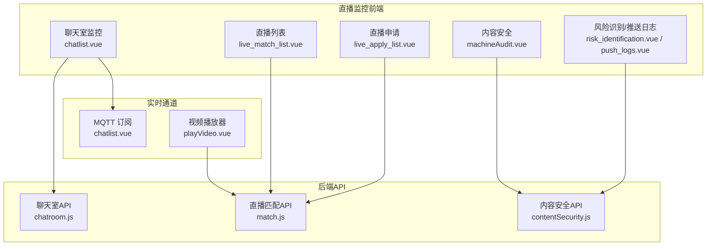
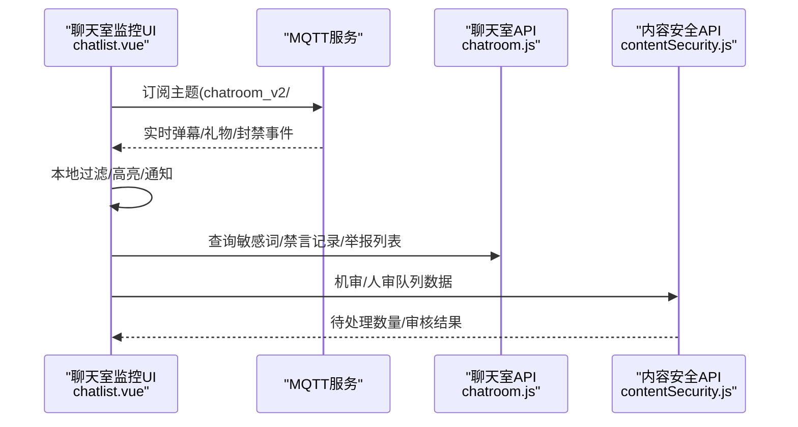
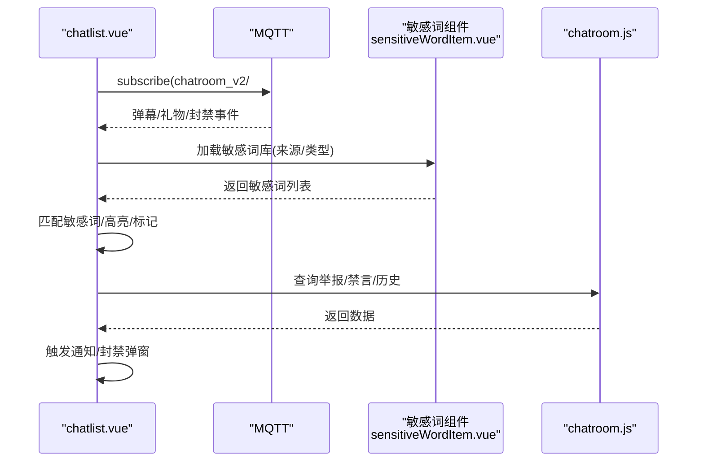
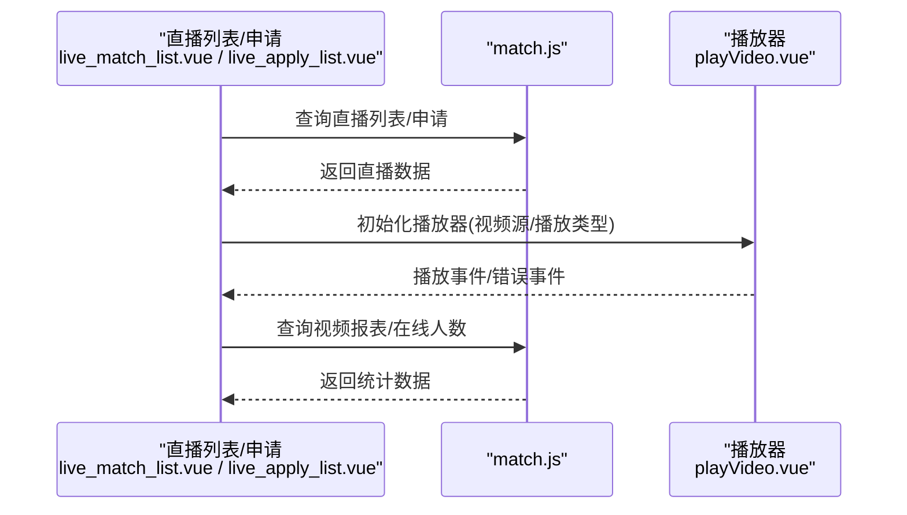
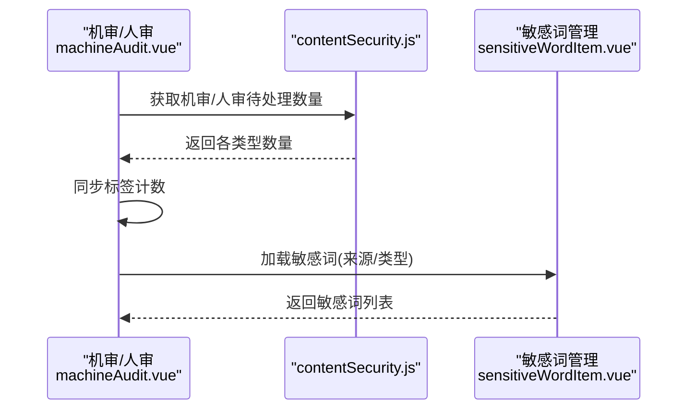
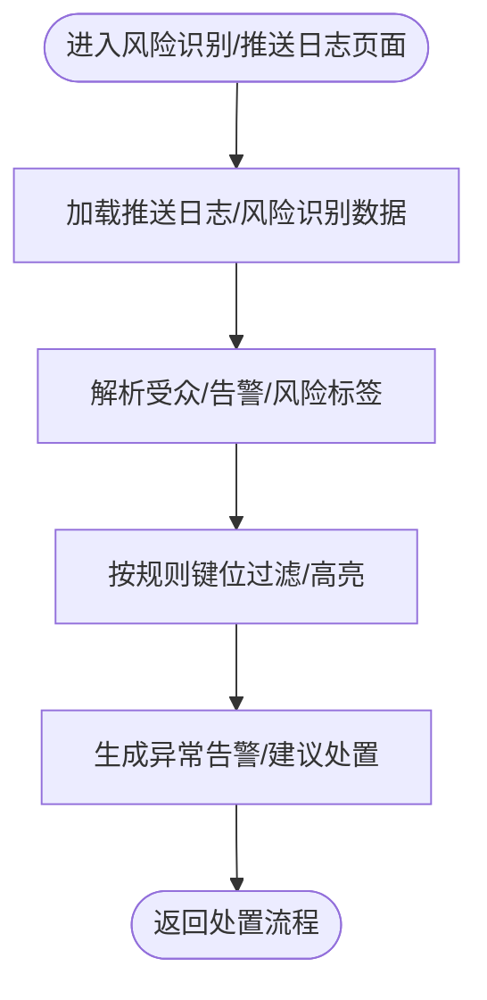
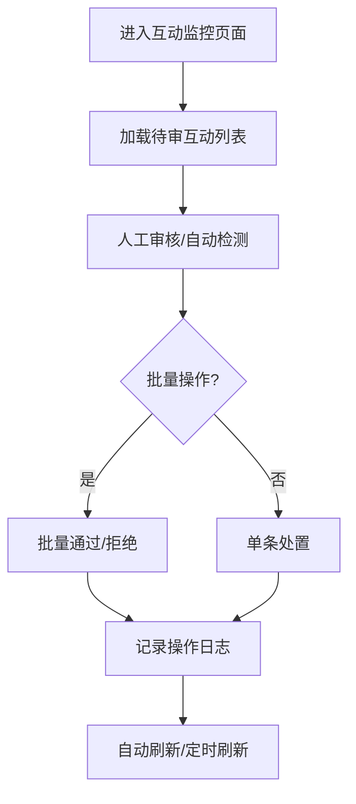
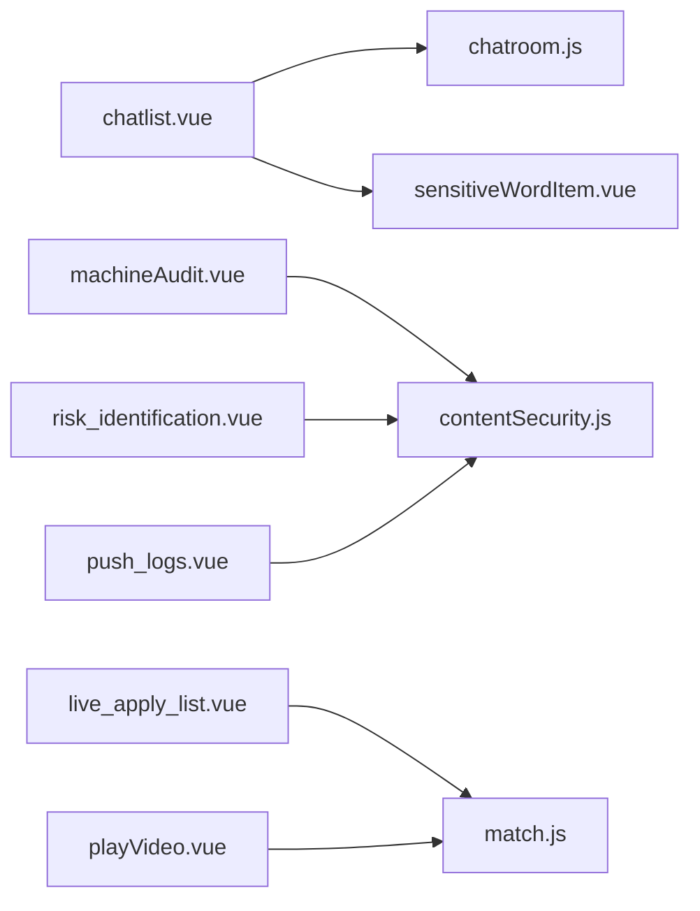

# 直播内容监控

<cite>
**本文引用的文件**
- [chatlist.vue](file://src/views/chat_room/chatlist.vue)
- [sensitiveWordTabs.vue](file://src/views/chat_room/sensitiveWordTabs.vue)
- [sensitiveWordItem.vue](file://src/views/chat_room/sensitiveWordItem.vue)
- [machineAudit.vue](file://src/views/contentSecurity/machineAudit.vue)
- [contentSecurity.js](file://src/api/contentSecurity.js)
- [chatroom.js](file://src/api/chatroom.js)
- [live_match_list.vue](file://src/views/match/video/live_match_list.vue)
- [live_apply_list.vue](file://src/views/match/video/live_apply_list.vue)
- [match.js](file://src/api/match.js)
- [contentSecurity.js（路由）](file://src/router/children/contentSecurity.js)
- [monitor_interact.vue](file://src/views/forum/monitor_interact.vue)
- [monitor_group.vue](file://src/views/forum/monitor_group.vue)
- [push_logs.vue](file://src/views/ops_tools/push_logs.vue)
- [risk_identification.vue](file://src/views/ops_tools/risk_identification.vue)
- [sy.json](file://src/views/ops_tools/sy.json)
- [playVideo.vue](file://src/components/leisu/playVideo.vue)
</cite>

## 目录
1. [简介](#简介)
2. [项目结构](#项目结构)
3. [核心组件](#核心组件)
4. [架构总览](#架构总览)
5. [详细组件分析](#详细组件分析)
6. [依赖关系分析](#依赖关系分析)
7. [性能考虑](#性能考虑)
8. [故障排查指南](#故障排查指南)
9. [结论](#结论)
10. [附录](#附录)

## 简介
本技术文档面向直播内容监控系统，围绕“直播房间监控、弹幕内容监控、主播行为监控”三大目标，系统梳理前端监控界面、实时消息通道、敏感词规则引擎、内容审核流程、异常流量识别与告警、数据分析与性能优化策略。文档以仓库现有代码为依据，结合组件职责与API交互，给出可落地的实现路径与可视化图示。

## 项目结构
本项目采用前端单页应用架构，直播监控相关能力主要分布在以下模块：
- 聊天室监控与弹幕分析：chatlist 页面 + MQTT 实时订阅 + 敏感词规则管理
- 直播房间与视频流监控：直播列表、直播申请、视频播放器与流参数监控
- 内容安全与审核：机审/人审队列、敏感词配置、审核日志
- 异常流量与风控：推送日志、风险识别、批量行为检测
- 数据分析：直播热度、违规统计、主播表现评估

图表来源
- [chatlist.vue:580-663](file://src/views/chat_room/chatlist.vue#L580-L663)
- [live_match_list.vue:88-132](file://src/views/match/video/live_match_list.vue#L88-L132)
- [live_apply_list.vue:223-269](file://src/views/match/video/live_apply_list.vue#L223-L269)
- [machineAudit.vue:43-52](file://src/views/contentSecurity/machineAudit.vue#L43-L52)
- [chatroom.js:1-351](file://src/api/chatroom.js#L1-L351)
- [contentSecurity.js:1-115](file://src/api/contentSecurity.js#L1-L115)
- [match.js:209-751](file://src/api/match.js#L209-L751)

章节来源
- [chatlist.vue:580-663](file://src/views/chat_room/chatlist.vue#L580-L663)
- [live_match_list.vue:88-132](file://src/views/match/video/live_match_list.vue#L88-L132)
- [live_apply_list.vue:223-269](file://src/views/match/video/live_apply_list.vue#L223-L269)
- [machineAudit.vue:43-52](file://src/views/contentSecurity/machineAudit.vue#L43-L52)
- [chatroom.js:1-351](file://src/api/chatroom.js#L1-L351)
- [contentSecurity.js:1-115](file://src/api/contentSecurity.js#L1-L115)
- [match.js:209-751](file://src/api/match.js#L209-L751)

## 核心组件
- 聊天室弹幕监控与实时告警
  - 通过 MQTT 订阅多路主题，实时接收弹幕、礼物、封禁等事件，进行本地过滤与高亮，并触发通知与封禁流程。
  - 敏感词规则：支持按来源（聊天室/预测/社区/内容安全）配置不同类型的敏感词策略（不可见/封禁/替换/特殊等），并提供批量增删改查与分页展示。
- 直播房间监控
  - 直播列表与直播申请：支持筛选、批量操作、上下线切换、隐藏/取消隐藏、导出报表等。
  - 视频播放器：封装播放器事件监听，处理播放异常、解码错误、硬件性能不足等场景。
- 内容安全与审核
  - 机审/人审队列：按审核类型聚合待处理数量，支持自动刷新与标签计数同步。
  - 敏感词管理：统一入口管理各来源敏感词，支持替换词、过期时间、批量操作。
- 异常流量与风控
  - 推送日志与风险识别：展示推送受众、告警信息、批量行为特征识别结果，辅助定位异常流量与团伙行为。
- 数据分析
  - 直播热度、违规统计、主播表现评估：结合直播报表、视频用户数、违规日志等维度进行统计分析。

章节来源
- [chatlist.vue:178-414](file://src/views/chat_room/chatlist.vue#L178-L414)
- [sensitiveWordTabs.vue:1-50](file://src/views/chat_room/sensitiveWordTabs.vue#L1-L50)
- [sensitiveWordItem.vue:100-324](file://src/views/chat_room/sensitiveWordItem.vue#L100-L324)
- [machineAudit.vue:1-164](file://src/views/contentSecurity/machineAudit.vue#L1-L164)
- [contentSecurity.js:1-115](file://src/api/contentSecurity.js#L1-L115)
- [chatroom.js:1-351](file://src/api/chatroom.js#L1-L351)
- [live_match_list.vue:88-132](file://src/views/match/video/live_match_list.vue#L88-L132)
- [live_apply_list.vue:223-269](file://src/views/match/video/live_apply_list.vue#L223-L269)
- [match.js:209-751](file://src/api/match.js#L209-L751)
- [push_logs.vue:58-84](file://src/views/ops_tools/push_logs.vue#L58-L84)
- [risk_identification.vue:150-169](file://src/views/ops_tools/risk_identification.vue#L150-L169)

## 架构总览
直播监控系统从前端页面到后端API形成闭环：前端负责实时订阅、规则执行、审核与展示；后端提供直播、聊天室、内容安全、风控等接口。

图表来源
- [chatlist.vue:580-663](file://src/views/chat_room/chatlist.vue#L580-L663)
- [chatroom.js:1-351](file://src/api/chatroom.js#L1-L351)
- [contentSecurity.js:1-115](file://src/api/contentSecurity.js#L1-L115)

## 详细组件分析

### 组件A：聊天室弹幕监控与实时告警
- 实时订阅与消息处理
  - 初始化 MQTT 连接，订阅多主题，区分系统封禁、禁言、撤回、礼物、弹幕等事件，统一转换为本地消息结构并入队展示。
  - 提供“先审后发”过滤逻辑，避免未审核内容直接展示。
- 弹幕内容分析与敏感词
  - 通过敏感词管理组件，按来源与类型加载敏感词库，支持精确/模糊搜索、分页、批量操作。
  - 在消息渲染阶段对命中敏感词的内容进行高亮与标记，便于人工审核。
- 实时告警与处置
  - 对封号/禁言/撤回等事件触发通知；支持弹窗选择处置套餐（临时/永久/聊天室封禁）。
  - 提供“趋势”“礼物列表”“主题设置”等辅助工具，提升监控效率。

图表来源
- [chatlist.vue:580-663](file://src/views/chat_room/chatlist.vue#L580-L663)
- [sensitiveWordItem.vue:100-324](file://src/views/chat_room/sensitiveWordItem.vue#L100-L324)
- [chatroom.js:1-351](file://src/api/chatroom.js#L1-L351)

章节来源
- [chatlist.vue:178-414](file://src/views/chat_room/chatlist.vue#L178-L414)
- [chatlist.vue:580-663](file://src/views/chat_room/chatlist.vue#L580-L663)
- [sensitiveWordTabs.vue:1-50](file://src/views/chat_room/sensitiveWordTabs.vue#L1-L50)
- [sensitiveWordItem.vue:100-324](file://src/views/chat_room/sensitiveWordItem.vue#L100-L324)
- [chatroom.js:1-351](file://src/api/chatroom.js#L1-L351)

### 组件B：直播房间监控与视频流监控
- 直播列表与直播申请
  - 支持筛选体育类型、批量操作、快速上下线、隐藏/取消隐藏、导出报表等。
  - 提供“主播直播-方案-聊天室”一体化入口，便于联动监控。
- 视频播放器与流参数监控
  - 封装播放器事件，处理播放中、解码异常、硬件性能不足等场景，提供错误提示与降级建议。
  - 提供视频在线人数、视频用户数、视频报表等接口，支撑热度分析。

图表来源
- [live_match_list.vue:88-132](file://src/views/match/video/live_match_list.vue#L88-L132)
- [live_apply_list.vue:223-269](file://src/views/match/video/live_apply_list.vue#L223-L269)
- [match.js:209-751](file://src/api/match.js#L209-L751)
- [playVideo.vue:171-197](file://src/components/leisu/playVideo.vue#L171-L197)

章节来源
- [live_match_list.vue:88-132](file://src/views/match/video/live_match_list.vue#L88-L132)
- [live_apply_list.vue:223-269](file://src/views/match/video/live_apply_list.vue#L223-L269)
- [match.js:209-751](file://src/api/match.js#L209-L751)
- [playVideo.vue:171-197](file://src/components/leisu/playVideo.vue#L171-L197)

### 组件C：内容安全与审核队列
- 机审/人审队列
  - 按审核类型聚合待处理数量，支持自动刷新与标签计数同步，避免整页重挂载导致弹层异常。
- 敏感词管理
  - 统一入口管理聊天室/预测/社区/内容安全来源的敏感词，支持替换词、过期时间、批量增删改查与分页展示。

图表来源
- [machineAudit.vue:133-160](file://src/views/contentSecurity/machineAudit.vue#L133-L160)
- [contentSecurity.js:1-115](file://src/api/contentSecurity.js#L1-L115)
- [sensitiveWordItem.vue:100-324](file://src/views/chat_room/sensitiveWordItem.vue#L100-L324)

章节来源
- [machineAudit.vue:1-164](file://src/views/contentSecurity/machineAudit.vue#L1-L164)
- [contentSecurity.js:1-115](file://src/api/contentSecurity.js#L1-L115)
- [sensitiveWordItem.vue:100-324](file://src/views/chat_room/sensitiveWordItem.vue#L100-L324)

### 组件D：异常流量与风控
- 推送日志
  - 展示推送受众、告警信息、附加字段，支持展开查看详细内容，辅助定位异常流量。
- 风险识别
  - 展示批量行为特征、IP/设备风险、团伙划分等识别结果，结合 sy.json 中的规则键位进行解读。

图表来源
- [push_logs.vue:58-84](file://src/views/ops_tools/push_logs.vue#L58-L84)
- [risk_identification.vue:150-169](file://src/views/ops_tools/risk_identification.vue#L150-L169)
- [sy.json:29-87](file://src/views/ops_tools/sy.json#L29-L87)

章节来源
- [push_logs.vue:58-84](file://src/views/ops_tools/push_logs.vue#L58-L84)
- [risk_identification.vue:150-169](file://src/views/ops_tools/risk_identification.vue#L150-L169)
- [sy.json:29-87](file://src/views/ops_tools/sy.json#L29-L87)

### 组件E：论坛互动监控（概念性）
- 论坛互动监控与审核
  - 提供互动审核入口与主题设置，支持批量通过/拒绝、自动刷新与定时刷新。
  - 结合直播监控策略，对违规互动内容进行拦截与处置。

图表来源
- [monitor_interact.vue:265-277](file://src/views/forum/monitor_interact.vue#L265-L277)
- [monitor_group.vue:882-906](file://src/views/forum/monitor_group.vue#L882-L906)

章节来源
- [monitor_interact.vue:265-277](file://src/views/forum/monitor_interact.vue#L265-L277)
- [monitor_group.vue:882-906](file://src/views/forum/monitor_group.vue#L882-L906)

## 依赖关系分析
- 组件耦合
  - chatlist 依赖 MQTT 管理器与聊天室 API，同时依赖敏感词组件与封禁弹窗组件。
  - machineAudit 依赖内容安全 API 与字典配置，用于动态生成审核类型与计数。
  - live_apply_list 依赖 match API 与播放器组件，用于直播状态变更与播放预览。
- 外部依赖
  - MQTT 作为实时消息通道，承载弹幕、礼物、封禁等事件。
  - 播放器组件封装播放事件与错误处理，减少页面复杂度。
- 潜在循环依赖
  - 当前组件间通过 API 与工具类解耦，未发现明显循环依赖。

图表来源
- [chatlist.vue:439-442](file://src/views/chat_room/chatlist.vue#L439-L442)
- [machineAudit.vue:43-52](file://src/views/contentSecurity/machineAudit.vue#L43-L52)
- [live_apply_list.vue:233-236](file://src/views/match/video/live_apply_list.vue#L233-L236)
- [chatroom.js:1-351](file://src/api/chatroom.js#L1-L351)
- [contentSecurity.js:1-115](file://src/api/contentSecurity.js#L1-L115)
- [match.js:209-751](file://src/api/match.js#L209-L751)

章节来源
- [chatlist.vue:439-442](file://src/views/chat_room/chatlist.vue#L439-L442)
- [machineAudit.vue:43-52](file://src/views/contentSecurity/machineAudit.vue#L43-L52)
- [live_apply_list.vue:233-236](file://src/views/match/video/live_apply_list.vue#L233-L236)
- [chatroom.js:1-351](file://src/api/chatroom.js#L1-L351)
- [contentSecurity.js:1-115](file://src/api/contentSecurity.js#L1-L115)
- [match.js:209-751](file://src/api/match.js#L209-L751)

## 性能考虑
- 实时消息处理
  - 使用 MQTT 复用连接与订阅，避免重复握手；对消息进行本地过滤与分页展示，降低 DOM 压力。
- 弹幕并发处理
  - 采用分页与虚拟滚动思路（通过左右两列对比展示），限制单次渲染消息数量，提升滚动流畅度。
- 规则引擎与敏感词
  - 分来源/分类型加载敏感词，支持精确/模糊搜索与分页，避免一次性加载过多规则造成卡顿。
- 视频流处理
  - 播放器事件监听与错误提示分离，避免在渲染阶段阻塞；对解码异常与硬件性能不足提供明确提示。
- 审核队列刷新
  - 自动刷新采用定时器与倒计时，避免频繁轮询；仅同步标签计数，减少整页重绘。

## 故障排查指南
- MQTT 连接失败
  - 检查 MQTT 地址与凭证；确认订阅主题是否正确；查看控制台错误日志。
- 弹幕未显示或延迟
  - 确认“先审后发”开关状态；检查网络与订阅状态；验证消息类型映射。
- 敏感词不生效
  - 核对敏感词来源与类型；确认替换词/过期时间配置；检查本地搜索模式（精确/模糊）。
- 播放异常
  - 关注播放器事件回调，识别解码错误、API 不支持、硬件性能不足等问题；根据提示调整播放参数或设备。
- 审核队列不更新
  - 检查自动刷新定时器与倒计时；确认接口返回数据结构；避免整页重挂载导致弹层异常。

章节来源
- [chatlist.vue:580-663](file://src/views/chat_room/chatlist.vue#L580-L663)
- [playVideo.vue:171-197](file://src/components/leisu/playVideo.vue#L171-L197)
- [machineAudit.vue:88-112](file://src/views/contentSecurity/machineAudit.vue#L88-L112)

## 结论
本直播内容监控系统通过“实时消息通道 + 规则引擎 + 审核流程 + 风控识别 + 数据分析”的闭环设计，实现了对直播房间、弹幕内容与主播行为的多维监控。前端组件职责清晰、API 调用规范，具备良好的扩展性与可维护性。建议后续在规则引擎与审核流程中引入更细粒度的策略配置与自动化处置能力，进一步提升监控效率与准确性。

## 附录
- 路由与权限
  - 内容安全相关路由包含机审/人审队列、敏感词管理、操作记录等，配合角色权限控制访问范围。

章节来源
- [contentSecurity.js（路由）:1-43](file://src/router/children/contentSecurity.js#L1-L43)