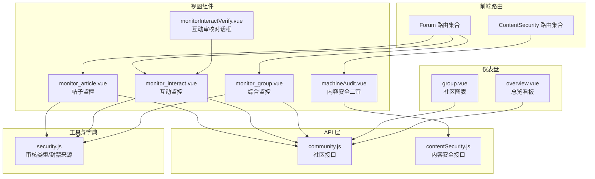
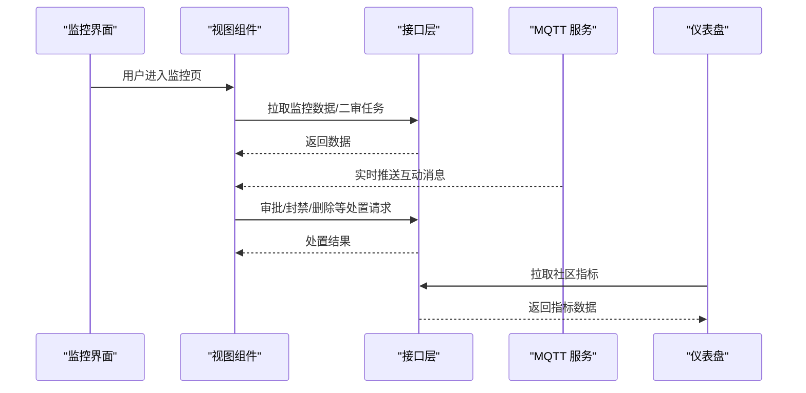
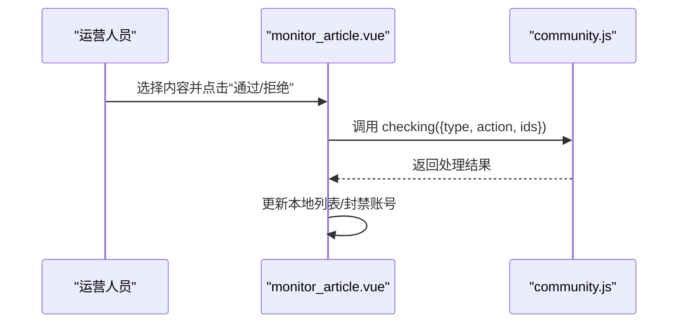
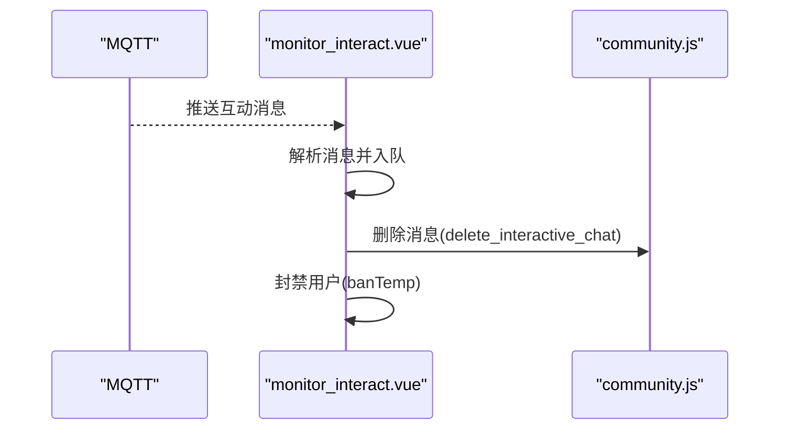
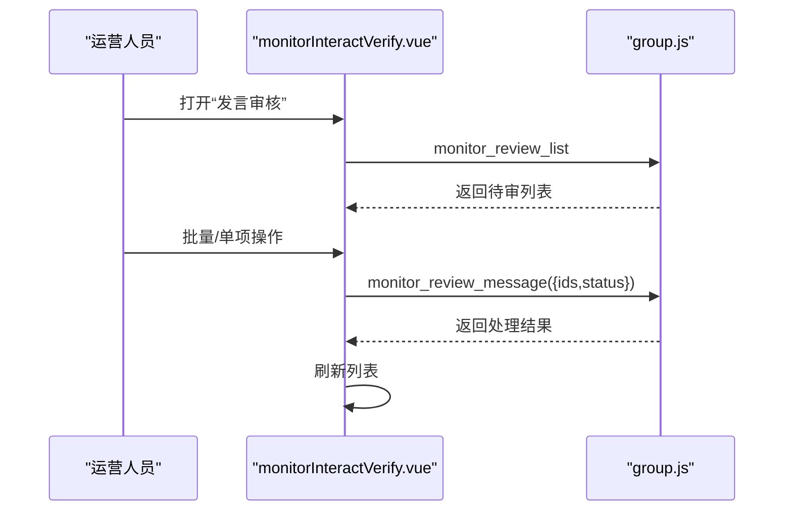
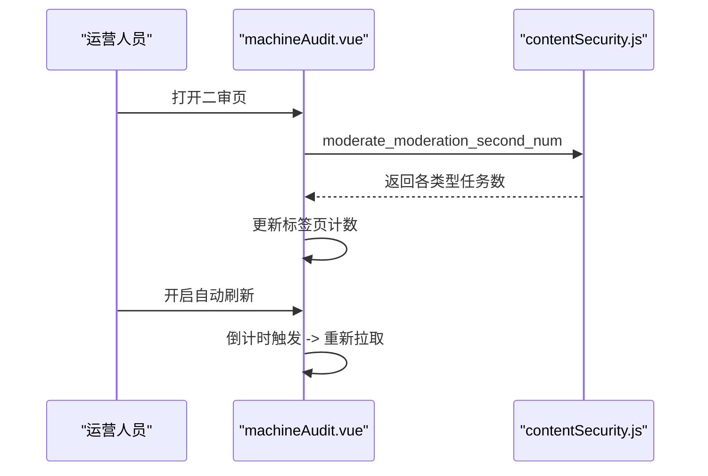
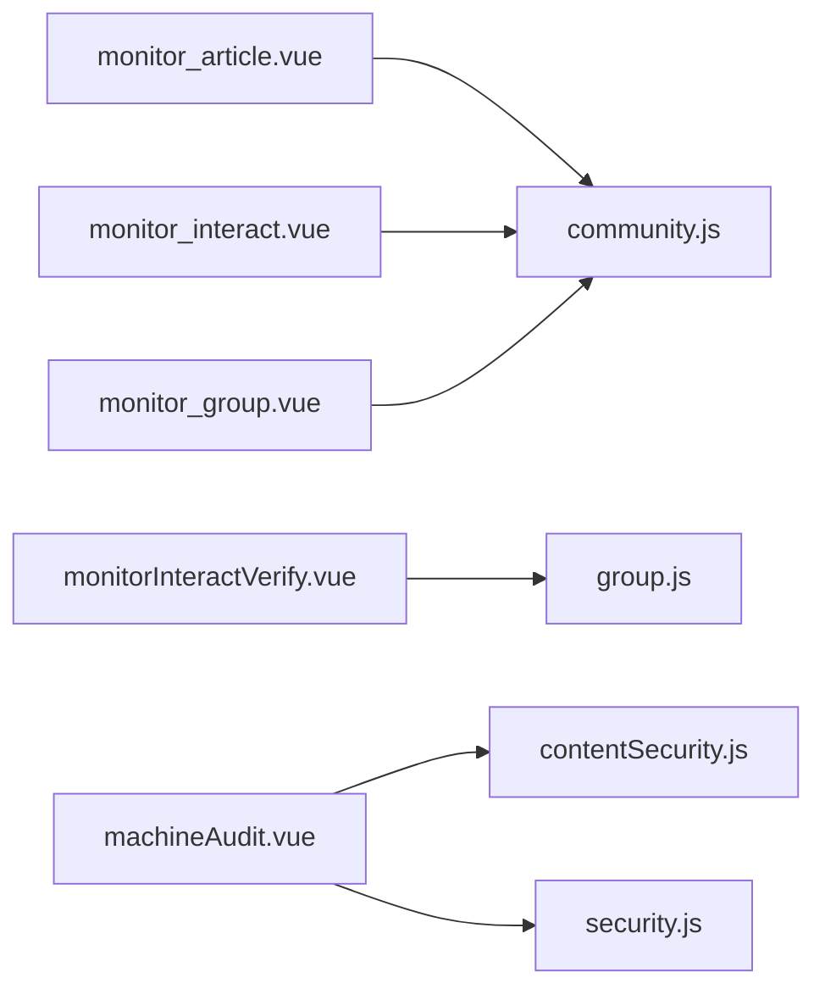

# 社区内容监控

<cite>
**本文引用的文件**
- [community.js](file://src/api/community.js)
- [contentSecurity.js](file://src/api/contentSecurity.js)
- [security.js](file://src/utils/dict/security.js)
- [monitor_article.vue](file://src/views/forum/monitor_article.vue)
- [monitor_interact.vue](file://src/views/forum/monitor_interact.vue)
- [monitor_group.vue](file://src/views/forum/monitor_group.vue)
- [machineAudit.vue](file://src/views/contentSecurity/machineAudit.vue)
- [monitorInteractVerify.vue](file://src/views/forum/components/monitorInteractVerify.vue)
- [index.js](file://src/router/index.js)
- [group.vue](file://src/views/dashboard/group.vue)
- [overview.vue](file://src/views/dashboard/overview.vue)
</cite>

## 目录
1. [引言](#引言)
2. [项目结构](#项目结构)
3. [核心组件](#核心组件)
4. [架构总览](#架构总览)
5. [详细组件分析](#详细组件分析)
6. [依赖关系分析](#依赖关系分析)
7. [性能考虑](#性能考虑)
8. [故障排查指南](#故障排查指南)
9. [结论](#结论)
10. [附录](#附录)

## 引言
本技术文档面向社区内容监控系统，聚焦于“帖子监控”“评论监控”“互动内容监控”的实现方案，覆盖监控指标设计（内容质量评分、违规行为检测、用户活跃度分析）、数据采集机制（实时内容抓取、历史数据回溯、用户行为分析）、告警与处置流程（自动检测规则、人工审核、违规处理策略），以及可视化展示（实时监控面板、内容热度排行、用户行为分析）。同时给出性能优化策略（异步处理、缓存机制、负载均衡）以支撑高并发场景。

## 项目结构
社区监控功能主要分布在以下模块：
- 路由与入口：通过路由聚合到“论坛/社区”模块，统一承载监控页面与组件。
- API 层：封装社区与内容安全相关接口，提供监控数据拉取、审核与处置能力。
- 视图层：包含“帖子监控”“互动监控”“人工审核对话框”等页面组件。
- 工具与字典：内容安全审核类型、封禁来源映射等配置化定义。
- 仪表盘：提供社区维度的可视化看板（如热帖排行、用户留存等）。

**图表来源**
- [index.js:74-129](file://src/router/index.js#L74-L129)
- [monitor_article.vue:149-293](file://src/views/forum/monitor_article.vue#L149-L293)
- [monitor_interact.vue:253-387](file://src/views/forum/monitor_interact.vue#L253-L387)
- [monitor_group.vue:527-800](file://src/views/forum/monitor_group.vue#L527-L800)
- [machineAudit.vue:27-41](file://src/views/contentSecurity/machineAudit.vue#L27-L41)
- [monitorInteractVerify.vue:34-89](file://src/views/forum/components/monitorInteractVerify.vue#L34-L89)
- [community.js:1-676](file://src/api/community.js#L1-L676)
- [contentSecurity.js:1-115](file://src/api/contentSecurity.js#L1-L115)
- [security.js:1-23](file://src/utils/dict/security.js#L1-L23)
- [group.vue:75-95](file://src/views/dashboard/group.vue#L75-L95)
- [overview.vue:44-133](file://src/views/dashboard/overview.vue#L44-L133)

**章节来源**
- [index.js:74-129](file://src/router/index.js#L74-L129)

## 核心组件
- 社区接口层（community.js）
  - 负责帖子/评论/互动/举报/封禁/人气排行/投票等社区监控相关接口调用。
  - 关键接口示例：帖子列表、评论列表、互动聊天列表、举报记录、封禁日志、人气排行、投票等。
- 内容安全接口层（contentSecurity.js）
  - 负责内容审核、二审数量、敏感词管理等接口。
  - 关键接口示例：二审数量查询、二审列表、忽略/处理二审、敏感词列表等。
- 安全字典（security.js）
  - 定义审核类型与封禁来源映射，用于控制不同内容类型的处置权限与动作。
- 视图组件
  - 帖子监控（monitor_article.vue）：按类型分栏展示待审内容，支持批量/单项审批、封禁、隐藏/删除。
  - 互动监控（monitor_interact.vue）：基于 MQTT 实时接收互动消息，支持删除、封禁、清屏、主题色设置。
  - 综合监控（monitor_group.vue）：聚合帖子/评论/互动/付费内容等多类信息，支持审核与处置。
  - 人工审核对话框（monitorInteractVerify.vue）：对互动消息进行人工审核与批量处理。
  - 内容安全二审（machineAudit.vue）：按审核类型标签页展示二审任务量，支持自动刷新。

**章节来源**
- [community.js:1-676](file://src/api/community.js#L1-L676)
- [contentSecurity.js:1-115](file://src/api/contentSecurity.js#L1-L115)
- [security.js:1-23](file://src/utils/dict/security.js#L1-L23)
- [monitor_article.vue:149-293](file://src/views/forum/monitor_article.vue#L149-L293)
- [monitor_interact.vue:253-387](file://src/views/forum/monitor_interact.vue#L253-L387)
- [monitor_group.vue:527-800](file://src/views/forum/monitor_group.vue#L527-L800)
- [monitorInteractVerify.vue:34-89](file://src/views/forum/components/monitorInteractVerify.vue#L34-L89)
- [machineAudit.vue:27-41](file://src/views/contentSecurity/machineAudit.vue#L27-L41)

## 架构总览
社区监控系统采用“路由聚合 + 视图组件 + API 调用 + 工具字典”的分层架构。实时数据通过 MQTT 接收，审核与处置通过接口完成，仪表盘组件从接口拉取统计数据进行可视化。

**图表来源**
- [monitor_interact.vue:462-472](file://src/views/forum/monitor_interact.vue#L462-L472)
- [monitor_article.vue:589-604](file://src/views/forum/monitor_article.vue#L589-L604)
- [machineAudit.vue:133-160](file://src/views/contentSecurity/machineAudit.vue#L133-L160)
- [group.vue:75-95](file://src/views/dashboard/group.vue#L75-L95)

## 详细组件分析

### 帖子监控组件（monitor_article.vue）
- 功能要点
  - 分栏展示不同类型内容（如“雷速号文章”“串关文章”“预测号文章”“足彩文章”）。
  - 支持全选/反选、批量审批、单项审批、拒绝并隐藏/删除/封号。
  - 自动刷新开关与倒计时，提升审核效率。
  - 支持查看详情与封禁原因选择。
- 数据流
  - 通过 checking_list 获取待审列表；通过 checking 完成审批；通过 update_field_v2/expert_update_v2 对账号执行封禁。
- 处置流程
  - 审批通过：直接移除列表项。
  - 拒绝并隐藏/删除：调用对应接口，前端本地移除。
  - 拒绝并封号：先执行审批，再根据类型调用相应封禁接口。

**图表来源**
- [monitor_article.vue:421-464](file://src/views/forum/monitor_article.vue#L421-L464)
- [monitor_article.vue:632-675](file://src/views/forum/monitor_article.vue#L632-L675)
- [community.js:263-270](file://src/api/community.js#L263-L270)

**章节来源**
- [monitor_article.vue:149-293](file://src/views/forum/monitor_article.vue#L149-L293)
- [monitor_article.vue:589-604](file://src/views/forum/monitor_article.vue#L589-L604)
- [monitor_article.vue:617-630](file://src/views/forum/monitor_article.vue#L617-L630)
- [community.js:263-270](file://src/api/community.js#L263-L270)

### 互动监控组件（monitor_interact.vue）
- 功能要点
  - 通过 MQTT 订阅 interaction_v2 主题，实时渲染互动消息。
  - 支持删除消息、封禁用户、清屏、字号切换、主题色设置。
  - 支持“发言审核”弹窗，对需要人工复核的消息进行批量/单项处理。
- 数据流
  - 初始化 MQTT 连接并订阅主题；解析消息后入队显示；支持删除与封禁操作。
- 处置流程
  - 删除：调用 delete_interactive_chat。
  - 封禁：通过 banTemp 组件发起封禁流程。
  - 清屏：清空列表与累计数组。

**图表来源**
- [monitor_interact.vue:462-472](file://src/views/forum/monitor_interact.vue#L462-L472)
- [monitor_interact.vue:565-658](file://src/views/forum/monitor_interact.vue#L565-L658)
- [monitor_interact.vue:659-677](file://src/views/forum/monitor_interact.vue#L659-L677)
- [community.js:390-391](file://src/api/community.js#L390-L391)

**章节来源**
- [monitor_interact.vue:253-387](file://src/views/forum/monitor_interact.vue#L253-L387)
- [monitor_interact.vue:462-472](file://src/views/forum/monitor_interact.vue#L462-L472)
- [monitor_interact.vue:565-658](file://src/views/forum/monitor_interact.vue#L565-L658)
- [monitor_interact.vue:659-677](file://src/views/forum/monitor_interact.vue#L659-L677)
- [community.js:390-391](file://src/api/community.js#L390-L391)

### 人工审核对话框（monitorInteractVerify.vue）
- 功能要点
  - 弹窗展示待审核互动消息，支持批量通过/拒绝、全部通过。
  - 自动轮询加载，空闲时倒计时刷新。
- 流程
  - 加载数据 -> 用户操作 -> 调用 monitor_review_message -> 刷新列表。

**图表来源**
- [monitorInteractVerify.vue:124-147](file://src/views/forum/components/monitorInteractVerify.vue#L124-L147)
- [monitorInteractVerify.vue:188-230](file://src/views/forum/components/monitorInteractVerify.vue#L188-L230)

**章节来源**
- [monitorInteractVerify.vue:34-89](file://src/views/forum/components/monitorInteractVerify.vue#L34-L89)
- [monitorInteractVerify.vue:124-147](file://src/views/forum/components/monitorInteractVerify.vue#L124-L147)
- [monitorInteractVerify.vue:188-230](file://src/views/forum/components/monitorInteractVerify.vue#L188-L230)

### 内容安全二审（machineAudit.vue）
- 功能要点
  - 按审核类型（帖子/评论/聊天室/资讯评论等）生成标签页。
  - 支持手动/自动刷新，倒计时刷新二审任务数量。
- 流程
  - 初始化标签 -> 默认选中 -> 拉取二审数量 -> 自动刷新倒计时 -> 同步标签计数。

**图表来源**
- [machineAudit.vue:72-82](file://src/views/contentSecurity/machineAudit.vue#L72-L82)
- [machineAudit.vue:133-160](file://src/views/contentSecurity/machineAudit.vue#L133-L160)
- [contentSecurity.js:38-44](file://src/api/contentSecurity.js#L38-L44)

**章节来源**
- [machineAudit.vue:27-41](file://src/views/contentSecurity/machineAudit.vue#L27-L41)
- [machineAudit.vue:72-82](file://src/views/contentSecurity/machineAudit.vue#L72-L82)
- [machineAudit.vue:133-160](file://src/views/contentSecurity/machineAudit.vue#L133-L160)
- [contentSecurity.js:38-44](file://src/api/contentSecurity.js#L38-L44)

### 综合监控（monitor_group.vue）
- 功能要点
  - 聚合帖子/评论/互动/付费内容等，支持审核与处置。
  - 字体/图片模式切换、主题设置、语音播放、红包/附件查看等。
- 适用场景
  - 快速定位违规内容、批量处置、跨模块联动。

**章节来源**
- [monitor_group.vue:527-800](file://src/views/forum/monitor_group.vue#L527-L800)

## 依赖关系分析
- 组件耦合
  - monitor_interact.vue 依赖 MQTT 工具与社区接口；与 banTemp、bagDetail、choiceColor 等组件协作。
  - monitor_article.vue 依赖社区接口与用户/媒体组件，负责审批与封禁链路。
  - monitorInteractVerify.vue 依赖 group.js 的审核接口，作为人工复核入口。
  - machineAudit.vue 依赖 contentSecurity.js 的二审接口与 security.js 的审核类型字典。
- 外部依赖
  - MQTT：用于实时互动消息推送。
  - 后端接口：统一通过 utils/request 封装，保证错误处理与拦截器一致性。

**图表来源**
- [monitor_article.vue:149-293](file://src/views/forum/monitor_article.vue#L149-L293)
- [monitor_interact.vue:253-387](file://src/views/forum/monitor_interact.vue#L253-L387)
- [monitor_group.vue:527-800](file://src/views/forum/monitor_group.vue#L527-L800)
- [monitorInteractVerify.vue:34-89](file://src/views/forum/components/monitorInteractVerify.vue#L34-L89)
- [machineAudit.vue:27-41](file://src/views/contentSecurity/machineAudit.vue#L27-L41)
- [community.js:1-676](file://src/api/community.js#L1-L676)
- [contentSecurity.js:1-115](file://src/api/contentSecurity.js#L1-L115)
- [security.js:1-23](file://src/utils/dict/security.js#L1-L23)

**章节来源**
- [monitor_interact.vue:462-472](file://src/views/forum/monitor_interact.vue#L462-L472)
- [monitor_article.vue:589-604](file://src/views/forum/monitor_article.vue#L589-L604)
- [machineAudit.vue:133-160](file://src/views/contentSecurity/machineAudit.vue#L133-L160)

## 性能考虑
- 异步处理
  - 使用定时器与自动刷新（如 machineAudit.vue 的倒计时刷新）降低人工负担。
  - 互动监控使用 MQTT 异步推送，避免轮询压力。
- 缓存机制
  - 前端可对“二审任务数”等高频读取数据做轻量缓存，减少重复请求。
- 负载均衡
  - 将不同类型的监控任务拆分到独立标签页/面板，避免单点过载。
- 渲染优化
  - 互动监控列表限制最大长度（如保留前 N 条），防止 DOM 过大。
  - 图片/附件懒加载与缩略图展示，降低带宽与渲染成本。

[本节为通用建议，无需特定文件引用]

## 故障排查指南
- MQTT 连接失败
  - 现象：互动监控无消息。
  - 排查：检查 MQTT 地址、订阅主题是否正确；确认初始化连接与订阅逻辑。
  - 参考路径：[monitor_interact.vue:462-472](file://src/views/forum/monitor_interact.vue#L462-L472)
- 审批/封禁无效
  - 现象：点击通过/拒绝后列表未更新或封禁未生效。
  - 排查：确认接口返回码与本地移除逻辑；检查封禁来源权限映射。
  - 参考路径：[monitor_article.vue:421-464](file://src/views/forum/monitor_article.vue#L421-L464)、[security.js:13-22](file://src/utils/dict/security.js#L13-L22)
- 二审任务数不更新
  - 现象：标签页计数长时间不变。
  - 排查：检查自动刷新倒计时与定时器清理；确认接口返回数据结构。
  - 参考路径：[machineAudit.vue:133-160](file://src/views/contentSecurity/machineAudit.vue#L133-L160)
- 仪表盘数据缺失
  - 现象：社区图表无数据。
  - 排查：确认接口参数与时间范围；检查图表组件数据绑定。
  - 参考路径：[group.vue:75-95](file://src/views/dashboard/group.vue#L75-L95)

**章节来源**
- [monitor_interact.vue:462-472](file://src/views/forum/monitor_interact.vue#L462-L472)
- [monitor_article.vue:421-464](file://src/views/forum/monitor_article.vue#L421-L464)
- [security.js:13-22](file://src/utils/dict/security.js#L13-L22)
- [machineAudit.vue:133-160](file://src/views/contentSecurity/machineAudit.vue#L133-L160)
- [group.vue:75-95](file://src/views/dashboard/group.vue#L75-L95)

## 结论
本系统通过“路由聚合 + 组件化 + 接口层 + 工具字典 + 仪表盘”的架构，实现了对社区内容的全链路监控与处置。实时互动监控结合人工审核对话框，形成“自动检测 + 人工复核”的双轨机制；内容安全二审与审核类型字典确保处置策略可配置、可追溯。配合异步处理、缓存与负载优化，可在高并发场景下保持稳定与高效。

[本节为总结性内容，无需特定文件引用]

## 附录

### 监控指标设计建议
- 内容质量评分
  - 基于互动分/初始热度的计算公式，结合点赞、评论、阅读等维度，动态调整权重。
  - 参考路径：[intelligence.vue:1134-1143](file://src/views/intelligence/intelligence.vue#L1134-L1143)
- 违规行为检测
  - 敏感词匹配、违规内容识别、重复/刷屏检测、异常 IP/设备检测。
  - 参考路径：[contentSecurity.js:82-105](file://src/api/contentSecurity.js#L82-L105)
- 用户活跃度分析
  - 登录次数、在线时长、发帖/评论频率、互动参与度、付费行为等。
  - 参考路径：[group.vue:75-95](file://src/views/dashboard/group.vue#L75-L95)

### 数据采集机制
- 实时内容抓取
  - 互动消息通过 MQTT 实时推送，帖子/评论/举报等通过接口轮询或分页拉取。
  - 参考路径：[monitor_interact.vue:462-472](file://src/views/forum/monitor_interact.vue#L462-L472)、[monitor_article.vue:589-604](file://src/views/forum/monitor_article.vue#L589-L604)
- 历史数据回溯
  - 通过时间范围筛选与分页接口，支持历史记录查询与导出。
  - 参考路径：[community.js:353-375](file://src/api/community.js#L353-L375)
- 用户行为分析
  - 仪表盘组件按模块聚合用户行为数据，支持多维度对比。
  - 参考路径：[overview.vue:44-133](file://src/views/dashboard/overview.vue#L44-L133)

### 告警与处置流程
- 自动检测规则
  - 敏感词命中、违规关键词、异常行为阈值触发预警。
  - 参考路径：[contentSecurity.js:82-105](file://src/api/contentSecurity.js#L82-L105)
- 人工审核流程
  - 二审任务分配与优先级排序；人工复核后执行通过/忽略/处理。
  - 参考路径：[machineAudit.vue:72-82](file://src/views/contentSecurity/machineAudit.vue#L72-L82)
- 违规处理策略
  - 隐藏/删除/封禁/封+删等策略，依据审核类型与封禁来源映射执行。
  - 参考路径：[security.js:13-22](file://src/utils/dict/security.js#L13-L22)

### 可视化展示
- 实时监控面板
  - 互动监控面板实时滚动消息，支持清屏与字号切换。
  - 参考路径：[monitor_interact.vue:253-387](file://src/views/forum/monitor_interact.vue#L253-L387)
- 内容热度排行
  - 仪表盘提供热帖排行、话题热度、用户留存等图表。
  - 参考路径：[group.vue:75-95](file://src/views/dashboard/group.vue#L75-L95)、[overview.vue:44-133](file://src/views/dashboard/overview.vue#L44-L133)