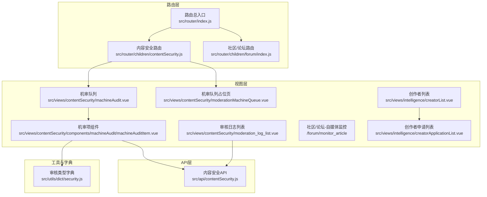
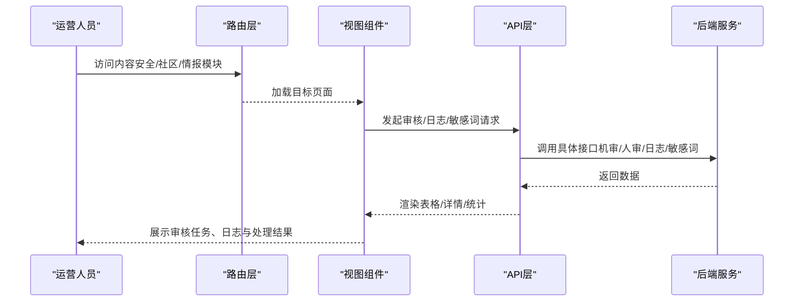
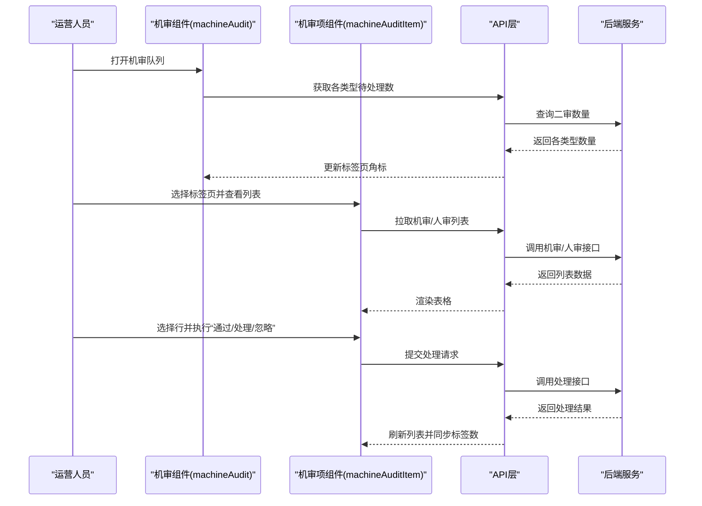
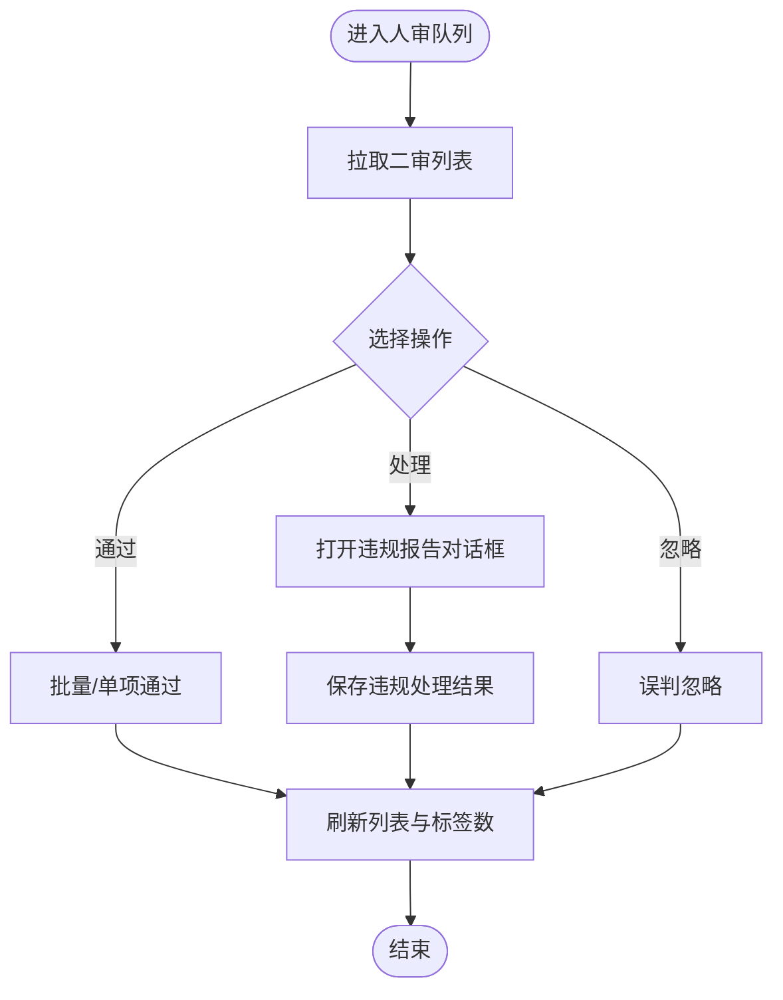
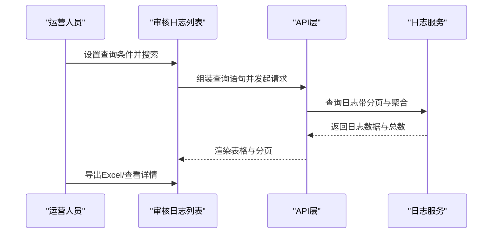
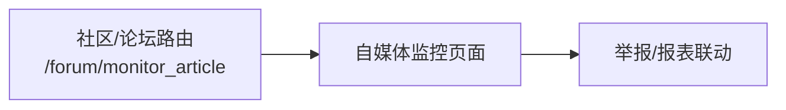
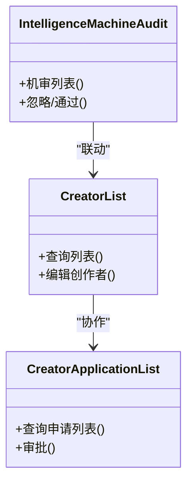
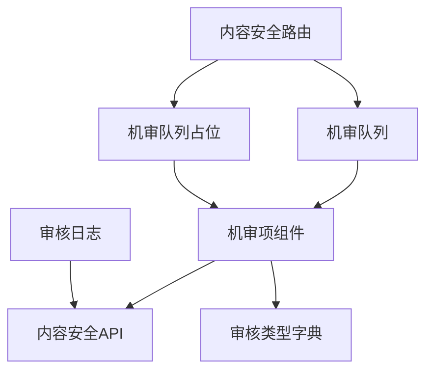

# 自媒体内容审核监控

<cite>
**本文引用的文件**
- [src/router/index.js](file://src/router/index.js)
- [src/router/children/contentSecurity.js](file://src/router/children/contentSecurity.js)
- [src/router/children/forum/index.js](file://src/router/children/forum/index.js)
- [src/api/contentSecurity.js](file://src/api/contentSecurity.js)
- [src/views/contentSecurity/machineAudit.vue](file://src/views/contentSecurity/machineAudit.vue)
- [src/views/contentSecurity/moderationMachineQueue.vue](file://src/views/contentSecurity/moderationMachineQueue.vue)
- [src/views/contentSecurity/moderation_log_list.vue](file://src/views/contentSecurity/moderation_log_list.vue)
- [src/views/contentSecurity/components/machineAudit/machineAuditItem.vue](file://src/views/contentSecurity/components/machineAudit/machineAuditItem.vue)
- [src/utils/dict/security.js](file://src/utils/dict/security.js)
- [src/views/intelligence/creatorList.vue](file://src/views/intelligence/creatorList.vue)
- [src/views/intelligence/creatorApplicationList.vue](file://src/views/intelligence/creatorApplicationList.vue)
- [src/views/intelligence/machineAudit.vue](file://src/views/intelligence/machineAudit.vue)
</cite>

## 目录
1. [简介](#简介)
2. [项目结构](#项目结构)
3. [核心组件](#核心组件)
4. [架构总览](#架构总览)
5. [详细组件分析](#详细组件分析)
6. [依赖关系分析](#依赖关系分析)
7. [性能考量](#性能考量)
8. [故障排查指南](#故障排查指南)
9. [结论](#结论)
10. [附录](#附录)

## 简介
本技术文档围绕“自媒体内容审核监控系统”展开，聚焦于自媒体账号监控、内容发布审核、违规内容检测、审核指标设计（内容质量评估、违规行为识别、账号信誉评分）、数据采集与处理机制（自动检测、人工审核、结果反馈）、告警与处置机制（违规标记、风险评估、处罚执行）、统计分析（审核效率、质量趋势、违规分布）以及系统扩展性（多平台统一管理、智能审核辅助、流程优化）。  
文档基于仓库中的内容安全与社区/自媒体相关模块进行梳理，结合前端路由、API 接口、视图组件与字典配置，形成从架构到实现的全景式说明。

## 项目结构
系统采用前端单页应用（Vue）+ 后端接口的模式，内容安全与自媒体相关功能主要分布在以下路径：
- 路由层：定义“内容安全”“社区/论坛”“自媒体/情报”等模块入口与子页面
- 视图层：内容安全的机审/人审队列、审核日志、敏感词管理；社区/论坛的自媒体监控、举报与报表；情报模块的创作者管理
- API 层：封装内容安全审核相关接口
- 工具与字典：审核类型映射、权限与操作标签等

**图表来源**
- [src/router/index.js:1-177](file://src/router/index.js#L1-L177)
- [src/router/children/contentSecurity.js:1-43](file://src/router/children/contentSecurity.js#L1-L43)
- [src/router/children/forum/index.js:1-230](file://src/router/children/forum/index.js#L1-L230)
- [src/views/contentSecurity/machineAudit.vue:1-164](file://src/views/contentSecurity/machineAudit.vue#L1-L164)
- [src/views/contentSecurity/moderationMachineQueue.vue:1-21](file://src/views/contentSecurity/moderationMachineQueue.vue#L1-L21)
- [src/views/contentSecurity/components/machineAudit/machineAuditItem.vue:1-608](file://src/views/contentSecurity/components/machineAudit/machineAuditItem.vue#L1-L608)
- [src/views/contentSecurity/moderation_log_list.vue:1-371](file://src/views/contentSecurity/moderation_log_list.vue#L1-L371)
- [src/api/contentSecurity.js:1-115](file://src/api/contentSecurity.js#L1-L115)
- [src/utils/dict/security.js:1-23](file://src/utils/dict/security.js#L1-L23)

**章节来源**
- [src/router/index.js:1-177](file://src/router/index.js#L1-L177)
- [src/router/children/contentSecurity.js:1-43](file://src/router/children/contentSecurity.js#L1-L43)
- [src/router/children/forum/index.js:1-230](file://src/router/children/forum/index.js#L1-L230)

## 核心组件
- 内容安全模块
  - 机审队列：展示并处理各类内容的机审任务，支持自动刷新、按标签页切换、批量操作与导出
  - 人审队列：展示二审任务，支持按审核类型分组、手动处理、忽略误判
  - 审核日志：基于日志服务查询审核记录，支持导出、高亮关键词、查看用户与关联对象详情
  - 敏感词管理：维护敏感词库，支持增删查
- 社区/论坛模块
  - 自媒体监控：面向自媒体内容的监控与审核入口
  - 举报与报表：举报列表、交互报表等
- 智能体/创作者模块
  - 创作者列表与申请列表：创作者资质、等级、结算与封禁等管理
  - 情报机审：资讯类内容的机审流程

**章节来源**
- [src/views/contentSecurity/machineAudit.vue:1-164](file://src/views/contentSecurity/machineAudit.vue#L1-L164)
- [src/views/contentSecurity/moderationMachineQueue.vue:1-21](file://src/views/contentSecurity/moderationMachineQueue.vue#L1-L21)
- [src/views/contentSecurity/moderation_log_list.vue:1-371](file://src/views/contentSecurity/moderation_log_list.vue#L1-L371)
- [src/views/contentSecurity/components/machineAudit/machineAuditItem.vue:1-608](file://src/views/contentSecurity/components/machineAudit/machineAuditItem.vue#L1-L608)
- [src/router/children/forum/index.js:76-93](file://src/router/children/forum/index.js#L76-L93)
- [src/views/intelligence/creatorList.vue:86-155](file://src/views/intelligence/creatorList.vue#L86-L155)
- [src/views/intelligence/creatorApplicationList.vue:107-153](file://src/views/intelligence/creatorApplicationList.vue#L107-L153)
- [src/views/intelligence/machineAudit.vue:114-155](file://src/views/intelligence/machineAudit.vue#L114-L155)

## 架构总览
系统从前端路由进入，根据模块划分加载对应视图；视图通过 API 层调用后端接口，完成内容审核、日志查询与敏感词管理；字典模块提供审核类型与权限映射，确保界面与业务一致。

**图表来源**
- [src/router/index.js:74-129](file://src/router/index.js#L74-L129)
- [src/api/contentSecurity.js:28-105](file://src/api/contentSecurity.js#L28-L105)
- [src/views/contentSecurity/machineAudit.vue:133-160](file://src/views/contentSecurity/machineAudit.vue#L133-L160)
- [src/views/contentSecurity/moderation_log_list.vue:272-367](file://src/views/contentSecurity/moderation_log_list.vue#L272-L367)

## 详细组件分析

### 机审队列（内容安全）
机审队列负责展示各类内容的机审任务，支持：
- 自动刷新与倒计时控制
- 按审核类型分组的标签页
- 列表渲染：标题、内容、附件/视频、风险提示、发布时间、额外数据
- 操作：通过、处理、批量操作、导出 Excel、查看详情

**图表来源**
- [src/views/contentSecurity/machineAudit.vue:72-160](file://src/views/contentSecurity/machineAudit.vue#L72-L160)
- [src/views/contentSecurity/components/machineAudit/machineAuditItem.vue:286-604](file://src/views/contentSecurity/components/machineAudit/machineAuditItem.vue#L286-L604)
- [src/api/contentSecurity.js:28-79](file://src/api/contentSecurity.js#L28-L79)

**章节来源**
- [src/views/contentSecurity/machineAudit.vue:1-164](file://src/views/contentSecurity/machineAudit.vue#L1-L164)
- [src/views/contentSecurity/components/machineAudit/machineAuditItem.vue:1-608](file://src/views/contentSecurity/components/machineAudit/machineAuditItem.vue#L1-L608)
- [src/api/contentSecurity.js:1-115](file://src/api/contentSecurity.js#L1-L115)

### 人审队列（内容安全）
人审队列用于人工复核机审进审的内容，支持：
- 按审核类型分组的人审标签页
- 二审处理：通过、处理（提交违规报告）
- 误判忽略：批量或单项忽略
- 关联详情：帖子、评论、资讯、评分、聊天室等

**图表来源**
- [src/views/contentSecurity/components/machineAudit/machineAuditItem.vue:466-530](file://src/views/contentSecurity/components/machineAudit/machineAuditItem.vue#L466-L530)
- [src/views/contentSecurity/components/machineAudit/machineAuditItem.vue:561-569](file://src/views/contentSecurity/components/machineAudit/machineAuditItem.vue#L561-L569)

**章节来源**
- [src/views/contentSecurity/components/machineAudit/machineAuditItem.vue:1-608](file://src/views/contentSecurity/components/machineAudit/machineAuditItem.vue#L1-L608)

### 审核日志（内容安全）
审核日志提供对审核历史的检索与分析：
- 支持时间范围、文本与条件过滤
- 展示操作时间、操作人、审核延迟、UID、内容ID、标题、内容、图片、审核结果、处理方式、分类、处理理由、风险提示、额外数据
- 支持导出 Excel、高亮敏感词、查看用户与关联对象详情

**图表来源**
- [src/views/contentSecurity/moderation_log_list.vue:272-367](file://src/views/contentSecurity/moderation_log_list.vue#L272-L367)

**章节来源**
- [src/views/contentSecurity/moderation_log_list.vue:1-371](file://src/views/contentSecurity/moderation_log_list.vue#L1-L371)

### 社区/论坛-自媒体监控
社区/论坛模块提供“自媒体审核”入口，用于监控与审核自媒体内容，配合举报、报表等功能形成闭环。

**图表来源**
- [src/router/children/forum/index.js:83-87](file://src/router/children/forum/index.js#L83-L87)

**章节来源**
- [src/router/children/forum/index.js:1-230](file://src/router/children/forum/index.js#L1-L230)

### 智能体/创作者管理
- 创作者列表：支持按 UID、等级、审核/结算/视频封禁/置顶/战报权限筛选，查看与编辑创作者状态
- 创作者申请列表：支持按 UID 筛选，查看申请状态与材料
- 情报机审：资讯类内容的机审流程

**图表来源**
- [src/views/intelligence/creatorList.vue:86-155](file://src/views/intelligence/creatorList.vue#L86-L155)
- [src/views/intelligence/creatorApplicationList.vue:107-153](file://src/views/intelligence/creatorApplicationList.vue#L107-L153)
- [src/views/intelligence/machineAudit.vue:114-155](file://src/views/intelligence/machineAudit.vue#L114-L155)

**章节来源**
- [src/views/intelligence/creatorList.vue:86-155](file://src/views/intelligence/creatorList.vue#L86-L155)
- [src/views/intelligence/creatorApplicationList.vue:107-153](file://src/views/intelligence/creatorApplicationList.vue#L107-L153)
- [src/views/intelligence/machineAudit.vue:114-155](file://src/views/intelligence/machineAudit.vue#L114-L155)

## 依赖关系分析
- 路由依赖：内容安全与社区/论坛模块在路由层注册，机审/人审页面通过子组件复用
- 组件依赖：机审项组件复用至机审队列与人审队列，共享操作逻辑与类型映射
- API 依赖：机审/人审/日志/敏感词均通过统一 API 文件封装
- 字典依赖：审核类型与权限映射集中于字典模块，保证界面与业务一致

**图表来源**
- [src/router/children/contentSecurity.js:1-43](file://src/router/children/contentSecurity.js#L1-L43)
- [src/views/contentSecurity/machineAudit.vue:1-164](file://src/views/contentSecurity/machineAudit.vue#L1-L164)
- [src/views/contentSecurity/moderationMachineQueue.vue:1-21](file://src/views/contentSecurity/moderationMachineQueue.vue#L1-L21)
- [src/views/contentSecurity/components/machineAudit/machineAuditItem.vue:1-608](file://src/views/contentSecurity/components/machineAudit/machineAuditItem.vue#L1-L608)
- [src/views/contentSecurity/moderation_log_list.vue:1-371](file://src/views/contentSecurity/moderation_log_list.vue#L1-L371)
- [src/api/contentSecurity.js:1-115](file://src/api/contentSecurity.js#L1-L115)
- [src/utils/dict/security.js:1-23](file://src/utils/dict/security.js#L1-L23)

**章节来源**
- [src/router/children/contentSecurity.js:1-43](file://src/router/children/contentSecurity.js#L1-L43)
- [src/views/contentSecurity/components/machineAudit/machineAuditItem.vue:251-268](file://src/views/contentSecurity/components/machineAudit/machineAuditItem.vue#L251-L268)
- [src/api/contentSecurity.js:1-115](file://src/api/contentSecurity.js#L1-L115)
- [src/utils/dict/security.js:1-23](file://src/utils/dict/security.js#L1-L23)

## 性能考量
- 列表分页与本地分页：机审项组件使用本地分页，减少不必要的网络请求
- 自动刷新节流：机审队列提供倒计时与定时器清理，避免频繁轮询
- 懒加载与按需渲染：路由与组件采用动态导入，降低首屏压力
- 导出与高亮：导出前确认与高亮渲染采用轻量策略，避免阻塞主线程

[本节为通用建议，无需特定文件来源]

## 故障排查指南
- 无法获取待处理数
  - 检查二审数量接口是否返回正确数据
  - 确认标签页名称与数据类型映射一致
- 列表为空或加载失败
  - 核查机审/人审接口参数与返回格式
  - 检查日志查询语句与时间范围
- 操作无响应
  - 确认处理接口调用成功并触发列表刷新
  - 检查定时器是否被清理
- 导出异常
  - 确认选中数据与字段映射
  - 检查导出依赖是否正确引入

**章节来源**
- [src/views/contentSecurity/machineAudit.vue:133-160](file://src/views/contentSecurity/machineAudit.vue#L133-L160)
- [src/views/contentSecurity/components/machineAudit/machineAuditItem.vue:414-465](file://src/views/contentSecurity/components/machineAudit/machineAuditItem.vue#L414-L465)
- [src/views/contentSecurity/moderation_log_list.vue:272-367](file://src/views/contentSecurity/moderation_log_list.vue#L272-L367)

## 结论
该系统以“内容安全”“社区/论坛”“智能体/创作者”三大模块为核心，构建了从机审到人审、从日志到报表的完整审核闭环。通过统一的 API 与字典配置，保障了跨模块的一致性与可维护性。建议后续在以下方面持续优化：
- 引入更细粒度的审核指标与可视化看板
- 增强敏感词与规则引擎的动态配置能力
- 优化日志检索与统计分析的性能与准确性
- 扩展多平台内容统一管理与智能辅助审核能力

[本节为总结性内容，无需特定文件来源]

## 附录

### 审核类型与权限映射（字典）
- 审核类型：帖子/评论（彩民圈/其他）、聊天室、资讯评论、评分评论、集锦视频评论
- 二审处理权限：按类型映射到删除/隐藏权限，确保合规处置

**章节来源**
- [src/utils/dict/security.js:1-23](file://src/utils/dict/security.js#L1-L23)

### 路由与模块入口
- 内容安全模块：机审队列、人审队列、敏感词、审核日志
- 社区/论坛模块：自媒体监控、举报、报表
- 智能体/创作者模块：创作者列表、申请列表、情报机审

**章节来源**
- [src/router/children/contentSecurity.js:1-43](file://src/router/children/contentSecurity.js#L1-L43)
- [src/router/children/forum/index.js:1-230](file://src/router/children/forum/index.js#L1-L230)
- [src/router/index.js:74-129](file://src/router/index.js#L74-L129)