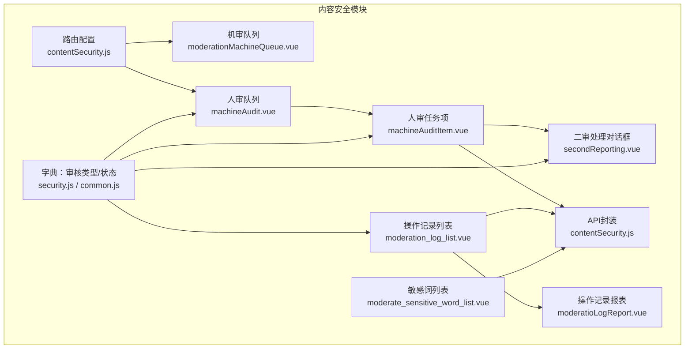
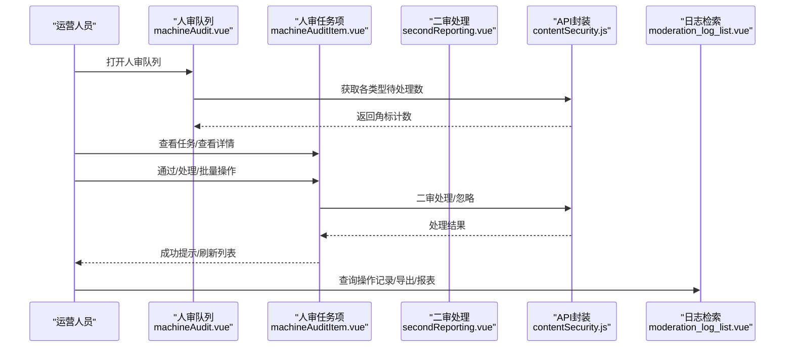
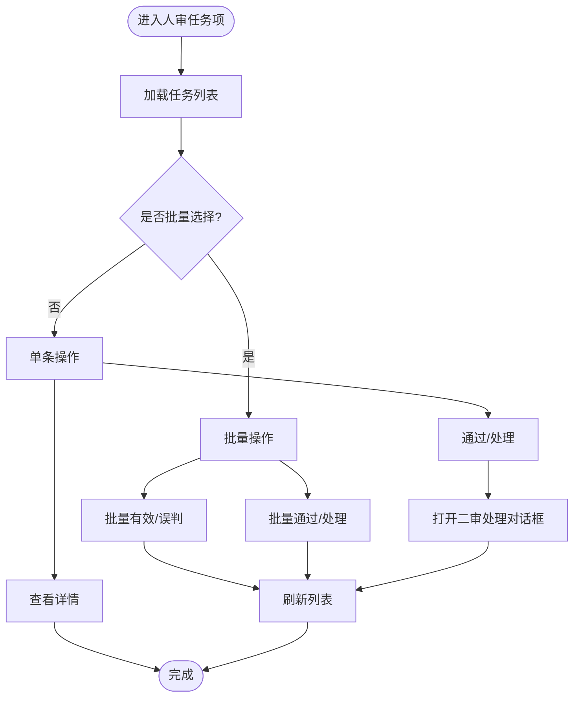
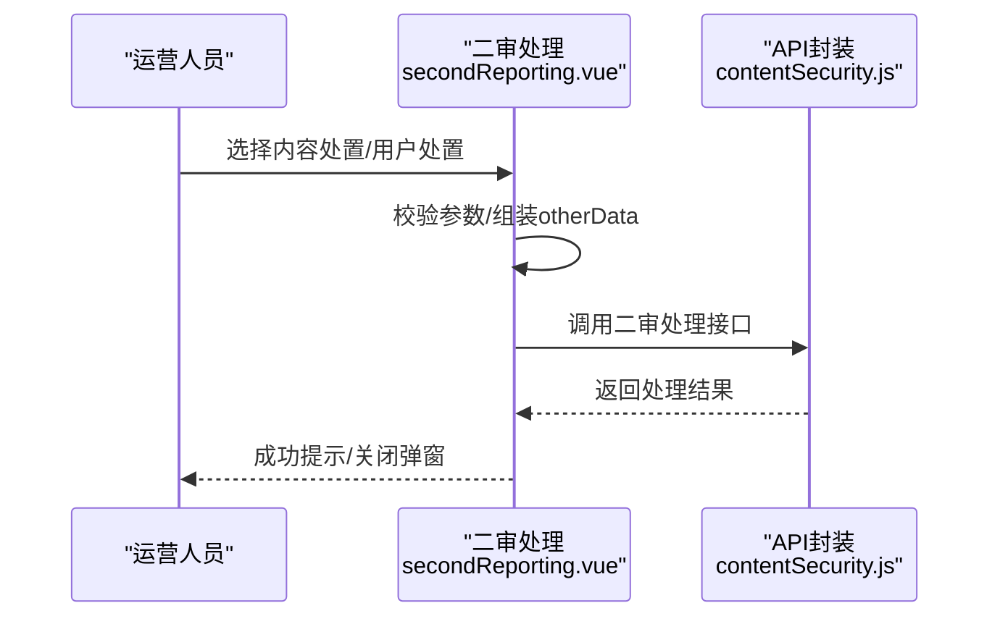
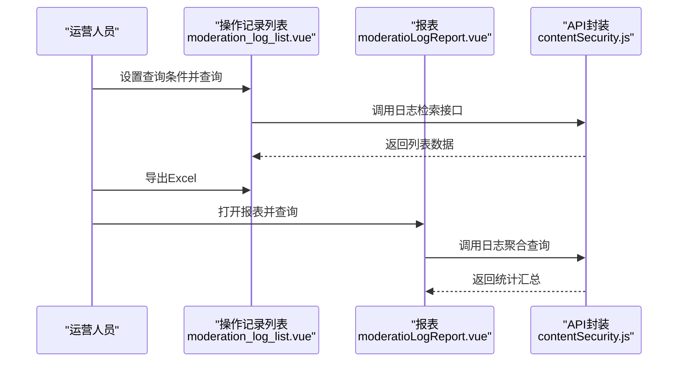
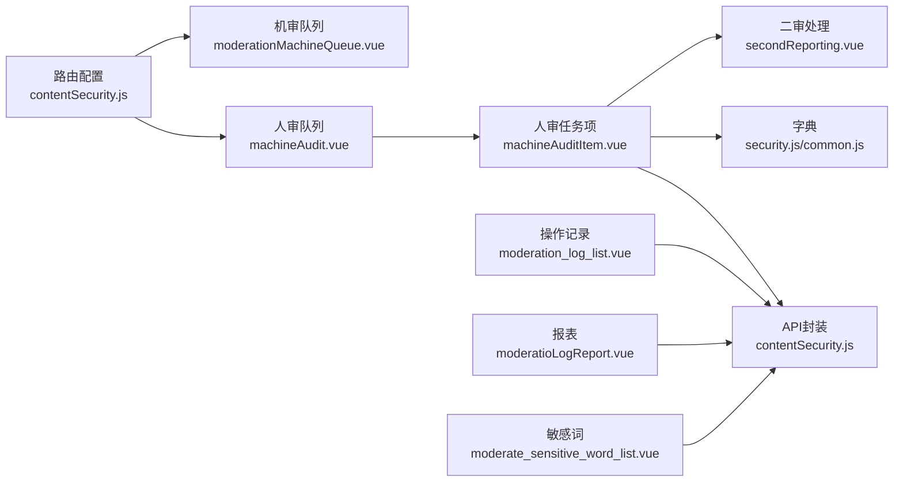

# 审核工作流

<cite>
**本文引用的文件**   
- [src/views/contentSecurity/machineAudit.vue](file://src/views/contentSecurity/machineAudit.vue)
- [src/views/contentSecurity/moderationMachineQueue.vue](file://src/views/contentSecurity/moderationMachineQueue.vue)
- [src/views/contentSecurity/components/machineAudit/machineAuditItem.vue](file://src/views/contentSecurity/components/machineAudit/machineAuditItem.vue)
- [src/views/contentSecurity/components/machineAudit/secondReporting.vue](file://src/views/contentSecurity/components/machineAudit/secondReporting.vue)
- [src/views/contentSecurity/moderation_log_list.vue](file://src/views/contentSecurity/moderation_log_list.vue)
- [src/views/contentSecurity/components/moderatioLogReport.vue](file://src/views/contentSecurity/components/moderatioLogReport.vue)
- [src/views/contentSecurity/moderate_sensitive_word_list.vue](file://src/views/contentSecurity/moderate_sensitive_word_list.vue)
- [src/router/children/contentSecurity.js](file://src/router/children/contentSecurity.js)
- [src/api/contentSecurity.js](file://src/api/contentSecurity.js)
- [src/utils/dict/security.js](file://src/utils/dict/security.js)
- [src/utils/dict/common.js](file://src/utils/dict/common.js)
</cite>

## 目录
1. [简介](#简介)
2. [项目结构](#项目结构)
3. [核心组件](#核心组件)
4. [架构总览](#架构总览)
5. [详细组件分析](#详细组件分析)
6. [依赖关系分析](#依赖关系分析)
7. [性能考量](#性能考量)
8. [故障排查指南](#故障排查指南)
9. [结论](#结论)
10. [附录](#附录)

## 简介
本技术文档围绕“审核工作流”展开，覆盖从内容提交到处理完成的完整流程，包括初审、复审、终审等环节；阐述审核任务的分配机制（自动分配、手动指派、优先级排序）；解释审核状态管理（待审核、审核中、已通过、已拒绝、申诉中等状态流转）；描述审核记录的保存与查询机制（操作日志、审核历史、处理轨迹）；提供统计分析能力（审核时效、通过率、误判率等指标）；并给出优化策略（并行处理、智能分流、质量控制等）。

## 项目结构
审核相关功能主要集中在“内容安全”模块，包含以下关键页面与组件：
- 人审队列与机审队列：用于展示不同类型的审核任务
- 二审处理对话框：用于执行删除/隐藏、封禁/禁言等处置
- 操作记录与报表：用于审计追踪与统计分析
- 敏感词配置：用于规则与策略管理
- 路由与字典：定义页面入口、审核类型与状态映射

图表来源
- [src/views/contentSecurity/moderationMachineQueue.vue:1-20](file://src/views/contentSecurity/moderationMachineQueue.vue#L1-L20)
- [src/views/contentSecurity/machineAudit.vue:1-164](file://src/views/contentSecurity/machineAudit.vue#L1-L164)
- [src/views/contentSecurity/components/machineAudit/machineAuditItem.vue:1-608](file://src/views/contentSecurity/components/machineAudit/machineAuditItem.vue#L1-L608)
- [src/views/contentSecurity/components/machineAudit/secondReporting.vue:1-232](file://src/views/contentSecurity/components/machineAudit/secondReporting.vue#L1-L232)
- [src/views/contentSecurity/moderation_log_list.vue:1-371](file://src/views/contentSecurity/moderation_log_list.vue#L1-L371)
- [src/views/contentSecurity/components/moderatioLogReport.vue:1-135](file://src/views/contentSecurity/components/moderatioLogReport.vue#L1-L135)
- [src/views/contentSecurity/moderate_sensitive_word_list.vue:1-23](file://src/views/contentSecurity/moderate_sensitive_word_list.vue#L1-L23)
- [src/router/children/contentSecurity.js:1-43](file://src/router/children/contentSecurity.js#L1-L43)
- [src/api/contentSecurity.js:63-115](file://src/api/contentSecurity.js#L63-L115)
- [src/utils/dict/security.js:1-23](file://src/utils/dict/security.js#L1-L23)
- [src/utils/dict/common.js:378-396](file://src/utils/dict/common.js#L378-L396)

章节来源
- [src/router/children/contentSecurity.js:1-43](file://src/router/children/contentSecurity.js#L1-L43)
- [src/views/contentSecurity/machineAudit.vue:1-164](file://src/views/contentSecurity/machineAudit.vue#L1-L164)
- [src/views/contentSecurity/moderationMachineQueue.vue:1-20](file://src/views/contentSecurity/moderationMachineQueue.vue#L1-L20)
- [src/views/contentSecurity/components/machineAudit/machineAuditItem.vue:1-608](file://src/views/contentSecurity/components/machineAudit/machineAuditItem.vue#L1-L608)
- [src/views/contentSecurity/components/machineAudit/secondReporting.vue:1-232](file://src/views/contentSecurity/components/machineAudit/secondReporting.vue#L1-L232)
- [src/views/contentSecurity/moderation_log_list.vue:1-371](file://src/views/contentSecurity/moderation_log_list.vue#L1-L371)
- [src/views/contentSecurity/components/moderatioLogReport.vue:1-135](file://src/views/contentSecurity/components/moderatioLogReport.vue#L1-L135)
- [src/views/contentSecurity/moderate_sensitive_word_list.vue:1-23](file://src/views/contentSecurity/moderate_sensitive_word_list.vue#L1-L23)
- [src/api/contentSecurity.js:63-115](file://src/api/contentSecurity.js#L63-L115)
- [src/utils/dict/security.js:1-23](file://src/utils/dict/security.js#L1-L23)
- [src/utils/dict/common.js:378-396](file://src/utils/dict/common.js#L378-L396)

## 核心组件
- 机审队列：展示聊天室类审核任务，支持刷新与导出
- 人审队列：按审核类型分页签展示，支持自动刷新与角标计数
- 人审任务项：表格展示内容详情、风险提示、附件与额外数据；支持通过/处理、批量操作、查看详情
- 二审处理：统一处置入口，支持删除/隐藏、封禁/禁言、批量处理
- 操作记录：基于日志检索的审核记录列表，支持导出与报表
- 敏感词配置：集中管理审核敏感词策略

章节来源
- [src/views/contentSecurity/moderationMachineQueue.vue:1-20](file://src/views/contentSecurity/moderationMachineQueue.vue#L1-L20)
- [src/views/contentSecurity/machineAudit.vue:1-164](file://src/views/contentSecurity/machineAudit.vue#L1-L164)
- [src/views/contentSecurity/components/machineAudit/machineAuditItem.vue:1-608](file://src/views/contentSecurity/components/machineAudit/machineAuditItem.vue#L1-L608)
- [src/views/contentSecurity/components/machineAudit/secondReporting.vue:1-232](file://src/views/contentSecurity/components/machineAudit/secondReporting.vue#L1-L232)
- [src/views/contentSecurity/moderation_log_list.vue:1-371](file://src/views/contentSecurity/moderation_log_list.vue#L1-L371)
- [src/views/contentSecurity/components/moderatioLogReport.vue:1-135](file://src/views/contentSecurity/components/moderatioLogReport.vue#L1-L135)
- [src/views/contentSecurity/moderate_sensitive_word_list.vue:1-23](file://src/views/contentSecurity/moderate_sensitive_word_list.vue#L1-L23)

## 架构总览
审核工作流采用“前端组件 + API封装 + 字典配置 + 日志检索”的架构：
- 页面通过路由进入内容安全模块
- 人审/机审任务通过API获取，表格渲染与交互
- 二审处理调用统一接口，结合字典进行权限与处置映射
- 审核记录通过日志检索实现，支持导出与报表

图表来源
- [src/views/contentSecurity/machineAudit.vue:133-160](file://src/views/contentSecurity/machineAudit.vue#L133-L160)
- [src/views/contentSecurity/components/machineAudit/machineAuditItem.vue:467-530](file://src/views/contentSecurity/components/machineAudit/machineAuditItem.vue#L467-L530)
- [src/views/contentSecurity/components/machineAudit/secondReporting.vue:182-224](file://src/views/contentSecurity/components/machineAudit/secondReporting.vue#L182-L224)
- [src/views/contentSecurity/moderation_log_list.vue:272-367](file://src/views/contentSecurity/moderation_log_list.vue#L272-L367)
- [src/api/contentSecurity.js:63-115](file://src/api/contentSecurity.js#L63-L115)

## 详细组件分析

### 人审队列与机审队列
- 人审队列：按审核类型生成标签页，支持自动刷新与角标计数同步
- 机审队列：专门展示聊天室类任务，支持刷新与导出

章节来源
- [src/views/contentSecurity/machineAudit.vue:1-164](file://src/views/contentSecurity/machineAudit.vue#L1-L164)
- [src/views/contentSecurity/moderationMachineQueue.vue:1-20](file://src/views/contentSecurity/moderationMachineQueue.vue#L1-L20)

### 人审任务项（表格与操作）
- 表格字段：内容ID、用户信息、标题/内容、图片/视频、风险提示、进审原因、发布时间、额外数据
- 操作按钮：有效/误判（聊天室）、通过/处理（其他类型）、批量操作、导出Excel
- 详情查看：支持打开帖子、评论、资讯、评分、聊天室等详情弹窗

图表来源
- [src/views/contentSecurity/components/machineAudit/machineAuditItem.vue:176-187](file://src/views/contentSecurity/components/machineAudit/machineAuditItem.vue#L176-L187)
- [src/views/contentSecurity/components/machineAudit/machineAuditItem.vue:414-530](file://src/views/contentSecurity/components/machineAudit/machineAuditItem.vue#L414-L530)

章节来源
- [src/views/contentSecurity/components/machineAudit/machineAuditItem.vue:1-608](file://src/views/contentSecurity/components/machineAudit/machineAuditItem.vue#L1-L608)

### 二审处理（统一处置）
- 支持内容处置：删除、隐藏、不处理
- 支持用户处置：封禁、禁言、不处理
- 权限校验：根据审核类型映射到对应删除/隐藏权限与封禁/禁言权限
- 结果回传：统一调用二审处理接口，支持批量ID

图表来源
- [src/views/contentSecurity/components/machineAudit/secondReporting.vue:104-224](file://src/views/contentSecurity/components/machineAudit/secondReporting.vue#L104-L224)
- [src/api/contentSecurity.js:63-79](file://src/api/contentSecurity.js#L63-L79)
- [src/utils/dict/security.js:12-22](file://src/utils/dict/security.js#L12-L22)

章节来源
- [src/views/contentSecurity/components/machineAudit/secondReporting.vue:1-232](file://src/views/contentSecurity/components/machineAudit/secondReporting.vue#L1-L232)
- [src/utils/dict/security.js:1-23](file://src/utils/dict/security.js#L1-L23)

### 操作记录与报表
- 操作记录：支持按时间范围、关键词、where条件检索，展示操作人、审核延迟、内容ID、标题、内容、图片、审核结果、处理方式、分类、处理理由、风险提示、额外数据
- 导出：支持导出Excel
- 报表：按操作人统计“合计/通过/处理/平均审核延时”

图表来源
- [src/views/contentSecurity/moderation_log_list.vue:272-367](file://src/views/contentSecurity/moderation_log_list.vue#L272-L367)
- [src/views/contentSecurity/components/moderatioLogReport.vue:83-131](file://src/views/contentSecurity/components/moderatioLogReport.vue#L83-L131)
- [src/api/contentSecurity.js:63-115](file://src/api/contentSecurity.js#L63-L115)

章节来源
- [src/views/contentSecurity/moderation_log_list.vue:1-371](file://src/views/contentSecurity/moderation_log_list.vue#L1-L371)
- [src/views/contentSecurity/components/moderatioLogReport.vue:1-135](file://src/views/contentSecurity/components/moderatioLogReport.vue#L1-L135)

### 敏感词配置
- 页面：集中展示与管理审核敏感词
- 功能：新增、删除、列表查询

章节来源
- [src/views/contentSecurity/moderate_sensitive_word_list.vue:1-23](file://src/views/contentSecurity/moderate_sensitive_word_list.vue#L1-L23)

### 审核状态管理与类型映射
- 审核类型：帖子/评论（彩民圈/其他）、聊天室、资讯评论、评分评论、集锦视频评论等
- 审核状态：审核中、已通过、未通过（通用状态对象）
- 二审处置权限映射：根据审核类型映射到删除/隐藏权限与封禁/禁言权限

章节来源
- [src/utils/dict/security.js:1-23](file://src/utils/dict/security.js#L1-L23)
- [src/utils/dict/common.js:378-396](file://src/utils/dict/common.js#L378-L396)

## 依赖关系分析
- 路由依赖：内容安全模块路由定义了机审队列、人审队列、敏感词、操作记录等入口
- 组件依赖：人审队列依赖人审任务项；人审任务项依赖API封装与字典；二审处理依赖API与权限字典；操作记录依赖日志检索API
- 数据依赖：审核任务列表、角标计数、日志检索、报表统计均依赖后端接口

图表来源
- [src/router/children/contentSecurity.js:1-43](file://src/router/children/contentSecurity.js#L1-L43)
- [src/views/contentSecurity/machineAudit.vue:1-164](file://src/views/contentSecurity/machineAudit.vue#L1-L164)
- [src/views/contentSecurity/moderationMachineQueue.vue:1-20](file://src/views/contentSecurity/moderationMachineQueue.vue#L1-L20)
- [src/views/contentSecurity/components/machineAudit/machineAuditItem.vue:1-608](file://src/views/contentSecurity/components/machineAudit/machineAuditItem.vue#L1-L608)
- [src/views/contentSecurity/components/machineAudit/secondReporting.vue:1-232](file://src/views/contentSecurity/components/machineAudit/secondReporting.vue#L1-L232)
- [src/views/contentSecurity/moderation_log_list.vue:1-371](file://src/views/contentSecurity/moderation_log_list.vue#L1-L371)
- [src/views/contentSecurity/components/moderatioLogReport.vue:1-135](file://src/views/contentSecurity/components/moderatioLogReport.vue#L1-L135)
- [src/views/contentSecurity/moderate_sensitive_word_list.vue:1-23](file://src/views/contentSecurity/moderate_sensitive_word_list.vue#L1-L23)
- [src/api/contentSecurity.js:63-115](file://src/api/contentSecurity.js#L63-L115)
- [src/utils/dict/security.js:1-23](file://src/utils/dict/security.js#L1-L23)
- [src/utils/dict/common.js:378-396](file://src/utils/dict/common.js#L378-L396)

章节来源
- [src/router/children/contentSecurity.js:1-43](file://src/router/children/contentSecurity.js#L1-L43)
- [src/api/contentSecurity.js:63-115](file://src/api/contentSecurity.js#L63-L115)

## 性能考量
- 自动刷新：人审队列支持定时刷新角标计数，避免频繁请求造成压力
- 本地分页：人审任务项采用本地分页，减少网络请求次数
- 导出与报表：导出与报表采用日志检索聚合，建议合理设置时间范围与条件以降低查询成本
- 批量操作：支持批量通过/处理与批量有效/误判，提升处理效率

## 故障排查指南
- 角标不更新：检查自动刷新开关与定时器状态，确认接口返回数据格式
- 无法导出：确认选择的数据与导出逻辑，检查浏览器弹窗拦截
- 二审处理失败：检查权限映射与参数组装，确认接口返回码与提示
- 操作记录为空：检查日志检索条件与时间范围，确认日志存储可用性

章节来源
- [src/views/contentSecurity/machineAudit.vue:88-112](file://src/views/contentSecurity/machineAudit.vue#L88-L112)
- [src/views/contentSecurity/components/machineAudit/machineAuditItem.vue:296-318](file://src/views/contentSecurity/components/machineAudit/machineAuditItem.vue#L296-L318)
- [src/views/contentSecurity/components/machineAudit/secondReporting.vue:182-224](file://src/views/contentSecurity/components/machineAudit/secondReporting.vue#L182-L224)
- [src/views/contentSecurity/moderation_log_list.vue:272-367](file://src/views/contentSecurity/moderation_log_list.vue#L272-L367)

## 结论
该审核工作流通过清晰的页面职责划分、完善的API封装与字典配置，实现了从内容提交到处理完成的闭环管理。人审与机审分离、二审统一处置、日志驱动的审计与统计，满足了运营对效率与合规性的双重需求。后续可在任务分配、智能分流与质量控制方面持续优化，进一步提升整体处理效能。

## 附录
- 审核类型与状态字典参考：[src/utils/dict/security.js:1-23](file://src/utils/dict/security.js#L1-L23)、[src/utils/dict/common.js:378-396](file://src/utils/dict/common.js#L378-L396)
- 审核接口参考：[src/api/contentSecurity.js:63-115](file://src/api/contentSecurity.js#L63-L115)
- 路由入口参考：[src/router/children/contentSecurity.js:1-43](file://src/router/children/contentSecurity.js#L1-L43)