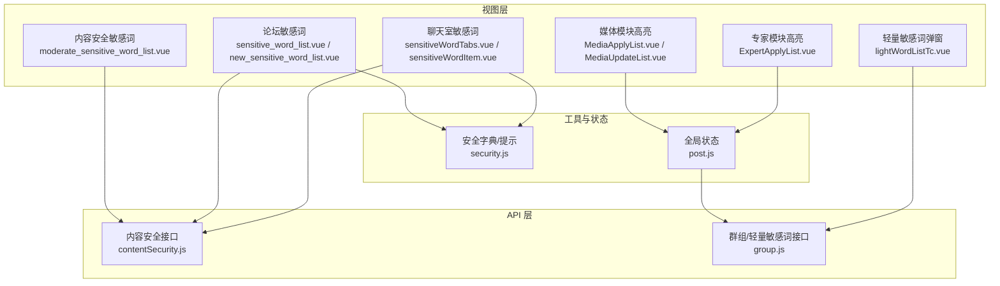
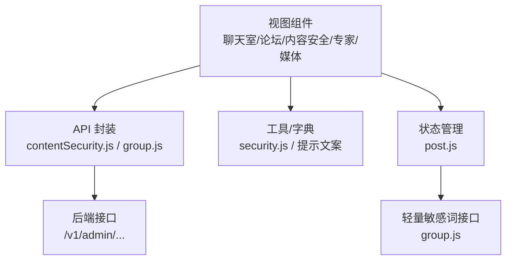
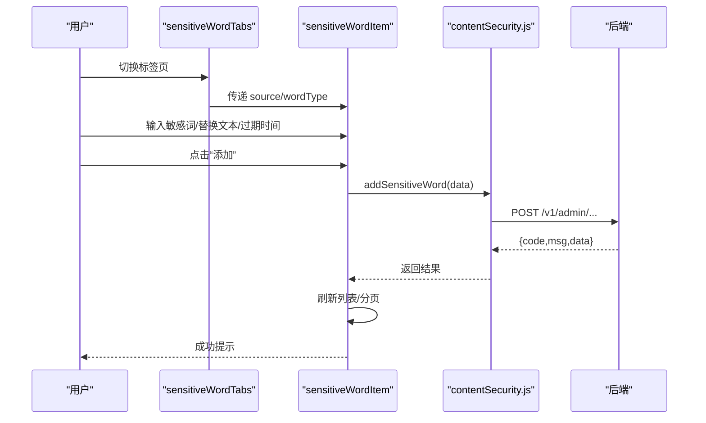
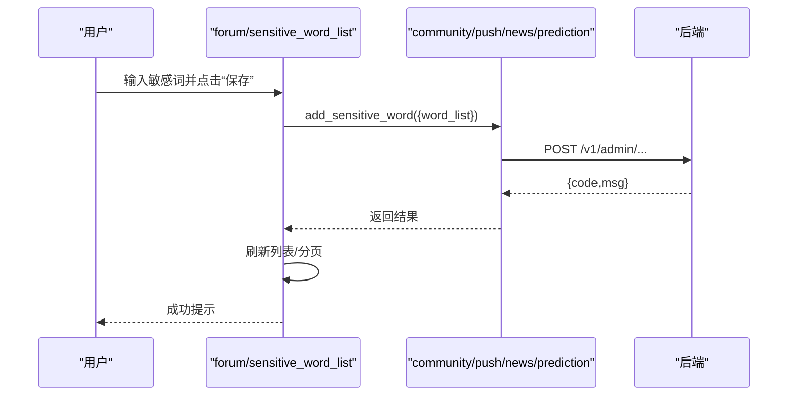
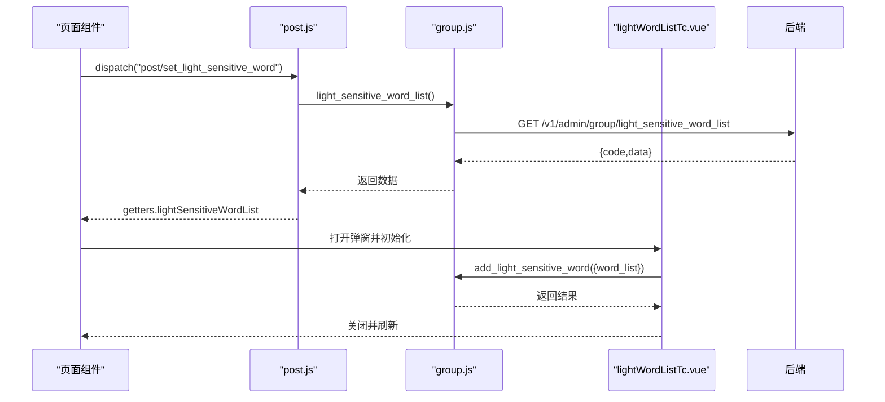
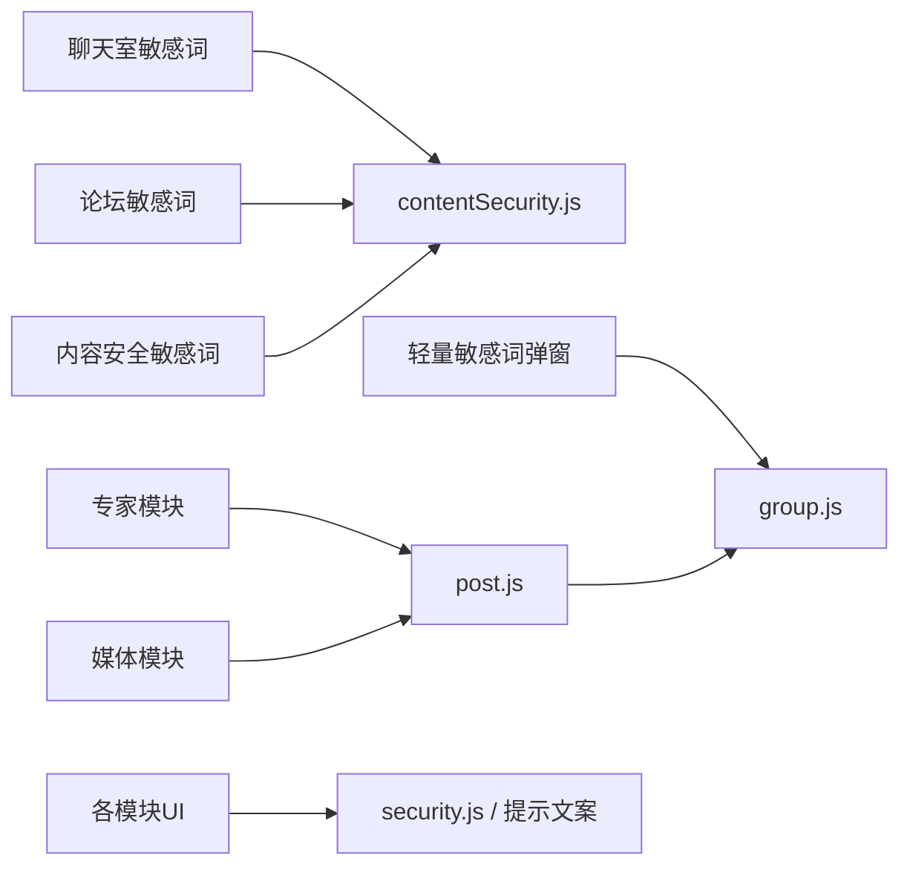

# 敏感词管理

<cite>
**本文引用的文件**   
- [sensitiveWordTabs.vue](file://src/views/chat_room/sensitiveWordTabs.vue)
- [sensitiveWordItem.vue](file://src/views/chat_room/sensitiveWordItem.vue)
- [sensitive_word_list.vue](file://src/views/forum/sensitive_word_list.vue)
- [new_sensitive_word_list.vue](file://src/views/forum/new_sensitive_word_list.vue)
- [moderate_sensitive_word_list.vue](file://src/views/contentSecurity/moderate_sensitive_word_list.vue)
- [contentSecurity.js](file://src/api/contentSecurity.js)
- [security.js](file://src/utils/dict/security.js)
- [ExpertApplyList.vue](file://src/views/expert/ExpertApplyList.vue)
- [MediaApplyList.vue](file://src/views/media/MediaApplyList.vue)
- [MediaUpdateList.vue](file://src/views/media/MediaUpdateList.vue)
- [lightWordListTc.vue](file://src/components/leisu/peopleInfo/group/components/lightWordListTc.vue)
- [post.js](file://src/store/modules/post.js)
- [group.js](file://src/api/group.js)
</cite>

## 目录
1. [简介](#简介)
2. [项目结构](#项目结构)
3. [核心组件](#核心组件)
4. [架构总览](#架构总览)
5. [详细组件分析](#详细组件分析)
6. [依赖关系分析](#依赖关系分析)
7. [性能考虑](#性能考虑)
8. [故障排查指南](#故障排查指南)
9. [结论](#结论)
10. [附录](#附录)

## 简介
本技术文档围绕敏感词管理系统展开，聚焦于敏感词库的构建与维护、检测与处理策略、配置与扩展点以及性能优化实践。系统覆盖聊天室、预测器、社区（论坛）、内容安全审核等多个业务域，提供敏感词的增删改查、批量操作、本地检索、替换封禁等能力，并在前端展示层支持高亮标记与交互式弹窗。

## 项目结构
敏感词管理相关的核心文件主要分布在以下位置：
- 视图层：聊天室、论坛、内容安全审核、专家与媒体模块的敏感词页面与组件
- API 层：内容安全与各业务线敏感词接口封装
- 工具与字典：敏感词提示文案与审核类型映射
- 状态层：轻量敏感词列表的全局状态管理与拉取

**图表来源**
- [sensitiveWordTabs.vue:1-50](file://src/views/chat_room/sensitiveWordTabs.vue#L1-L50)
- [sensitiveWordItem.vue:1-324](file://src/views/chat_room/sensitiveWordItem.vue#L1-L324)
- [sensitive_word_list.vue:1-243](file://src/views/forum/sensitive_word_list.vue#L1-L243)
- [new_sensitive_word_list.vue:1-22](file://src/views/forum/new_sensitive_word_list.vue#L1-L22)
- [moderate_sensitive_word_list.vue:1-22](file://src/views/contentSecurity/moderate_sensitive_word_list.vue#L1-L22)
- [contentSecurity.js:1-115](file://src/api/contentSecurity.js#L1-L115)
- [security.js:1-23](file://src/utils/dict/security.js#L1-L23)
- [post.js:1-120](file://src/store/modules/post.js#L1-L120)
- [group.js:441-460](file://src/api/group.js#L441-L460)

**章节来源**
- [sensitiveWordTabs.vue:1-50](file://src/views/chat_room/sensitiveWordTabs.vue#L1-L50)
- [sensitiveWordItem.vue:100-324](file://src/views/chat_room/sensitiveWordItem.vue#L100-L324)
- [sensitive_word_list.vue:64-243](file://src/views/forum/sensitive_word_list.vue#L64-L243)
- [new_sensitive_word_list.vue:1-22](file://src/views/forum/new_sensitive_word_list.vue#L1-L22)
- [moderate_sensitive_word_list.vue:1-22](file://src/views/contentSecurity/moderate_sensitive_word_list.vue#L1-L22)
- [contentSecurity.js:1-115](file://src/api/contentSecurity.js#L1-L115)
- [security.js:1-23](file://src/utils/dict/security.js#L1-L23)
- [post.js:1-120](file://src/store/modules/post.js#L1-L120)
- [group.js:441-460](file://src/api/group.js#L441-L460)

## 核心组件
- 聊天室敏感词组件：负责按类型（不可见、封禁、替换、特殊）展示与管理敏感词，支持精确/模糊搜索、批量删除、过期时间设置、替换文本配置等。
- 论坛敏感词组件：支持多业务源（社区、预测、新闻、推送），统一的增删改查与分页展示。
- 内容安全敏感词组件：面向审核场景，提供“进审敏感词”等专项管理。
- 高亮与弹窗：在专家、媒体等模块中对敏感词进行高亮显示，并提供轻量敏感词弹窗。
- 状态与接口：通过全局状态拉取轻量敏感词列表，供页面高亮使用；通过 API 封装各业务线敏感词 CRUD。

**章节来源**
- [sensitiveWordItem.vue:100-324](file://src/views/chat_room/sensitiveWordItem.vue#L100-L324)
- [sensitive_word_list.vue:64-243](file://src/views/forum/sensitive_word_list.vue#L64-L243)
- [moderate_sensitive_word_list.vue:1-22](file://src/views/contentSecurity/moderate_sensitive_word_list.vue#L1-L22)
- [ExpertApplyList.vue:282-314](file://src/views/expert/ExpertApplyList.vue#L282-L314)
- [MediaApplyList.vue:266-305](file://src/views/media/MediaApplyList.vue#L266-L305)
- [MediaUpdateList.vue:259-291](file://src/views/media/MediaUpdateList.vue#L259-L291)
- [lightWordListTc.vue:152-184](file://src/components/leisu/peopleInfo/group/components/lightWordListTc.vue#L152-L184)
- [post.js:91-120](file://src/store/modules/post.js#L91-L120)
- [group.js:441-460](file://src/api/group.js#L441-L460)

## 架构总览
系统采用“视图层 + API 层 + 工具/字典 + 状态层”的分层设计：
- 视图层：根据业务域选择不同的敏感词页面与组件，统一通过 props/source/wordType 控制展示与行为。
- API 层：封装各业务线敏感词接口，包括列表、新增、删除、替换等。
- 工具/字典：提供敏感词提示文案与审核类型映射，辅助 UI 提示与权限控制。
- 状态层：提供轻量敏感词列表的全局状态，用于页面高亮与弹窗初始化。

**图表来源**
- [contentSecurity.js:1-115](file://src/api/contentSecurity.js#L1-L115)
- [group.js:441-460](file://src/api/group.js#L441-L460)
- [security.js:1-23](file://src/utils/dict/security.js#L1-L23)
- [post.js:91-120](file://src/store/modules/post.js#L91-L120)

## 详细组件分析

### 聊天室敏感词组件（tabs + item）
- 功能要点
  - 类型标签页：不可见、封禁、替换、特殊等，对应不同处理策略
  - 搜索：支持精确/模糊搜索，本地过滤
  - 批量操作：全选、批量删除
  - 替换与封禁：替换文本输入、过期时间选择
  - 权限控制：基于权限位动态显示按钮
- 数据流
  - 组件通过 props 接收 source 与 wordType，决定调用的 API 与展示文案
  - 列表分页加载，每页 200 条
  - 新增时根据类型拼接“敏感词|替换文本”，或直接拆分逗号分隔的多个词
  - 删除时批量传入词列表，接口返回成功后刷新本地视图

**图表来源**
- [sensitiveWordTabs.vue:1-50](file://src/views/chat_room/sensitiveWordTabs.vue#L1-L50)
- [sensitiveWordItem.vue:100-324](file://src/views/chat_room/sensitiveWordItem.vue#L100-L324)
- [contentSecurity.js:82-105](file://src/api/contentSecurity.js#L82-L105)

**章节来源**
- [sensitiveWordTabs.vue:1-50](file://src/views/chat_room/sensitiveWordTabs.vue#L1-L50)
- [sensitiveWordItem.vue:100-324](file://src/views/chat_room/sensitiveWordItem.vue#L100-L324)
- [contentSecurity.js:1-115](file://src/api/contentSecurity.js#L1-L115)

### 论坛敏感词组件（社区/预测/新闻/推送）
- 功能要点
  - 多源支持：根据 source 切换不同接口
  - 搜索：精确/模糊切换，清空恢复分页
  - 批量删除：勾选后统一删除
  - 导入：支持多词逗号分隔批量导入
- 数据流
  - 列表分页加载，每页 200 条
  - 新增/删除均调用对应业务线接口，成功后刷新本地数据

**图表来源**
- [sensitive_word_list.vue:64-243](file://src/views/forum/sensitive_word_list.vue#L64-L243)
- [contentSecurity.js:82-105](file://src/api/contentSecurity.js#L82-L105)

**章节来源**
- [sensitive_word_list.vue:64-243](file://src/views/forum/sensitive_word_list.vue#L64-L243)
- [contentSecurity.js:1-115](file://src/api/contentSecurity.js#L1-L115)

### 内容安全敏感词组件（审核侧）
- 功能要点
  - 专项管理：仅展示“进审敏感词”等审核相关词
  - 与内容安全模块联动：审核列表、二审、忽略等接口
- 数据流
  - 通过 moderate_sensitive_word_list 获取列表
  - 支持新增/删除，返回成功后刷新

**章节来源**
- [moderate_sensitive_word_list.vue:1-22](file://src/views/contentSecurity/moderate_sensitive_word_list.vue#L1-L22)
- [contentSecurity.js:82-105](file://src/api/contentSecurity.js#L82-L105)

### 高亮与弹窗（专家/媒体/轻量敏感词）
- 功能要点
  - 页面高亮：从全局状态拉取轻量敏感词列表，使用正则对关键词进行高亮包裹
  - 弹窗组件：支持在群组详情中打开轻量敏感词弹窗，进行新增/关闭等操作
- 数据流
  - 通过 dispatch 拉取轻量敏感词列表
  - 使用正则对文本进行高亮替换

**图表来源**
- [post.js:91-120](file://src/store/modules/post.js#L91-L120)
- [group.js:441-460](file://src/api/group.js#L441-L460)
- [lightWordListTc.vue:152-184](file://src/components/leisu/peopleInfo/group/components/lightWordListTc.vue#L152-L184)
- [ExpertApplyList.vue:282-314](file://src/views/expert/ExpertApplyList.vue#L282-L314)
- [MediaApplyList.vue:266-305](file://src/views/media/MediaApplyList.vue#L266-L305)
- [MediaUpdateList.vue:259-291](file://src/views/media/MediaUpdateList.vue#L259-L291)

**章节来源**
- [post.js:91-120](file://src/store/modules/post.js#L91-L120)
- [group.js:441-460](file://src/api/group.js#L441-L460)
- [lightWordListTc.vue:152-184](file://src/components/leisu/peopleInfo/group/components/lightWordListTc.vue#L152-L184)
- [ExpertApplyList.vue:282-314](file://src/views/expert/ExpertApplyList.vue#L282-L314)
- [MediaApplyList.vue:266-305](file://src/views/media/MediaApplyList.vue#L266-L305)
- [MediaUpdateList.vue:259-291](file://src/views/media/MediaUpdateList.vue#L259-L291)

## 依赖关系分析
- 组件间耦合
  - 聊天室与内容安全模块共享统一的敏感词接口封装，降低重复逻辑
  - 论坛模块通过多源分支适配不同业务线，保持 UI 一致性
  - 高亮与弹窗依赖全局状态与轻量敏感词接口，形成松耦合的数据驱动
- 外部依赖
  - API 层封装了统一的请求方法与路由，便于集中维护
  - 字典与提示文案集中管理，避免分散硬编码

**图表来源**
- [contentSecurity.js:1-115](file://src/api/contentSecurity.js#L1-L115)
- [group.js:441-460](file://src/api/group.js#L441-L460)
- [security.js:1-23](file://src/utils/dict/security.js#L1-L23)
- [post.js:91-120](file://src/store/modules/post.js#L91-L120)

**章节来源**
- [contentSecurity.js:1-115](file://src/api/contentSecurity.js#L1-L115)
- [group.js:441-460](file://src/api/group.js#L441-L460)
- [security.js:1-23](file://src/utils/dict/security.js#L1-L23)
- [post.js:91-120](file://src/store/modules/post.js#L91-L120)

## 性能考虑
- 列表分页
  - 每页固定条数（200），减少一次性渲染压力，提升滚动与交互流畅度
- 本地搜索
  - 在已加载数据上进行过滤，避免频繁网络请求
- 正则高亮
  - 对唯一关键词集合进行正则替换，避免重复匹配
- 状态拉取
  - 通过全局状态缓存轻量敏感词列表，减少重复请求

**章节来源**
- [sensitiveWordItem.vue:195-199](file://src/views/chat_room/sensitiveWordItem.vue#L195-L199)
- [sensitive_word_list.vue:135-139](file://src/views/forum/sensitive_word_list.vue#L135-L139)
- [ExpertApplyList.vue:282-314](file://src/views/expert/ExpertApplyList.vue#L282-L314)
- [MediaApplyList.vue:266-305](file://src/views/media/MediaApplyList.vue#L266-L305)
- [MediaUpdateList.vue:259-291](file://src/views/media/MediaUpdateList.vue#L259-L291)
- [post.js:91-120](file://src/store/modules/post.js#L91-L120)

## 故障排查指南
- 新增失败
  - 检查输入格式：替换类型需提供替换文本且不含特定字符；批量导入需确保分隔符正确
  - 查看接口返回：确认 code 与 msg，定位服务端错误
- 删除异常
  - 确认所选词是否存在于当前页或本地缓存
  - 检查权限位是否具备删除能力
- 高亮无效
  - 确认全局状态中轻量敏感词列表已拉取
  - 检查正则替换逻辑与关键词集合是否正确
- 分页错乱
  - 切换页码后重新渲染分页数据，确保 slice 起止索引正确

**章节来源**
- [sensitiveWordItem.vue:250-292](file://src/views/chat_room/sensitiveWordItem.vue#L250-L292)
- [sensitive_word_list.vue:166-191](file://src/views/forum/sensitive_word_list.vue#L166-L191)
- [post.js:91-120](file://src/store/modules/post.js#L91-L120)

## 结论
本敏感词管理系统在多业务域内实现了统一的敏感词管理与高亮能力，通过清晰的组件分层、稳定的 API 封装与全局状态驱动，满足了不同场景下的敏感词维护与检测需求。建议后续在检测算法层面引入更丰富的匹配策略（如模糊/正则/上下文分析）与缓存优化，以进一步提升性能与准确性。

## 附录

### 敏感词检测与处理策略（概念性说明）
- 检测原理
  - 本地高亮：基于正则对关键词进行高亮包裹
  - 替换策略：在输入/输出环节对敏感词进行替换
  - 封禁策略：对违规内容进行屏蔽或限制
- 匹配算法
  - 精确匹配：完全一致
  - 模糊匹配：包含关系或通配
  - 上下文分析：结合前后文语义进行判定
- 处理优先级
  - 根据词类型与违规等级设定优先级，优先执行高优先级策略
- 白名单机制
  - 对特定用户/内容开放白名单，绕过部分检测规则

[本节为概念性说明，不直接分析具体文件]