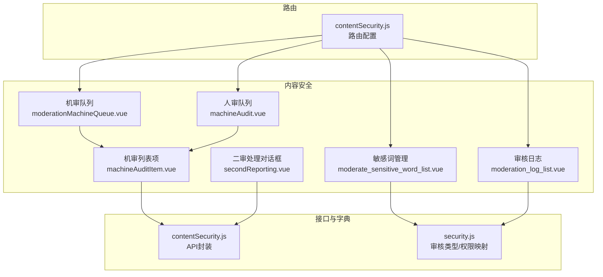
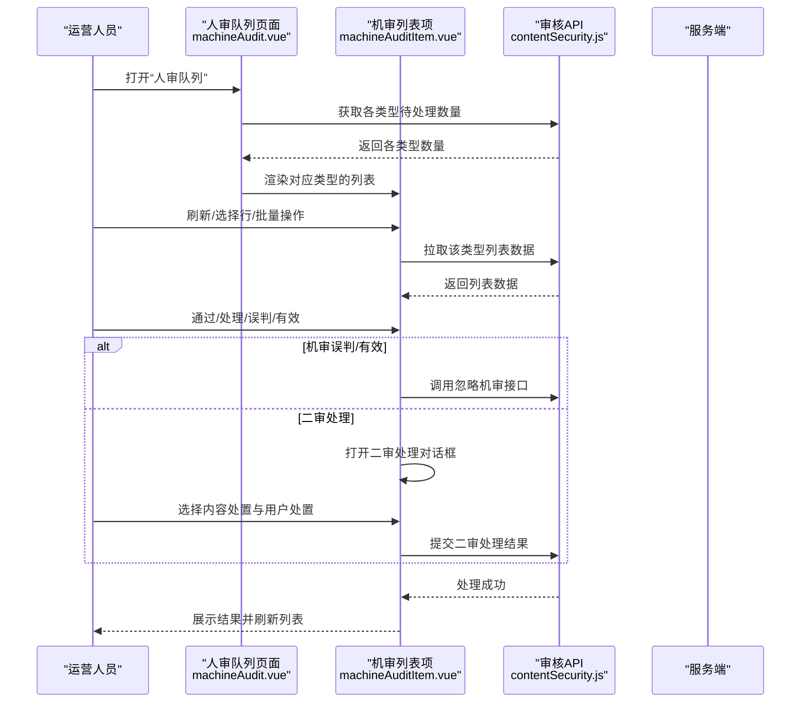
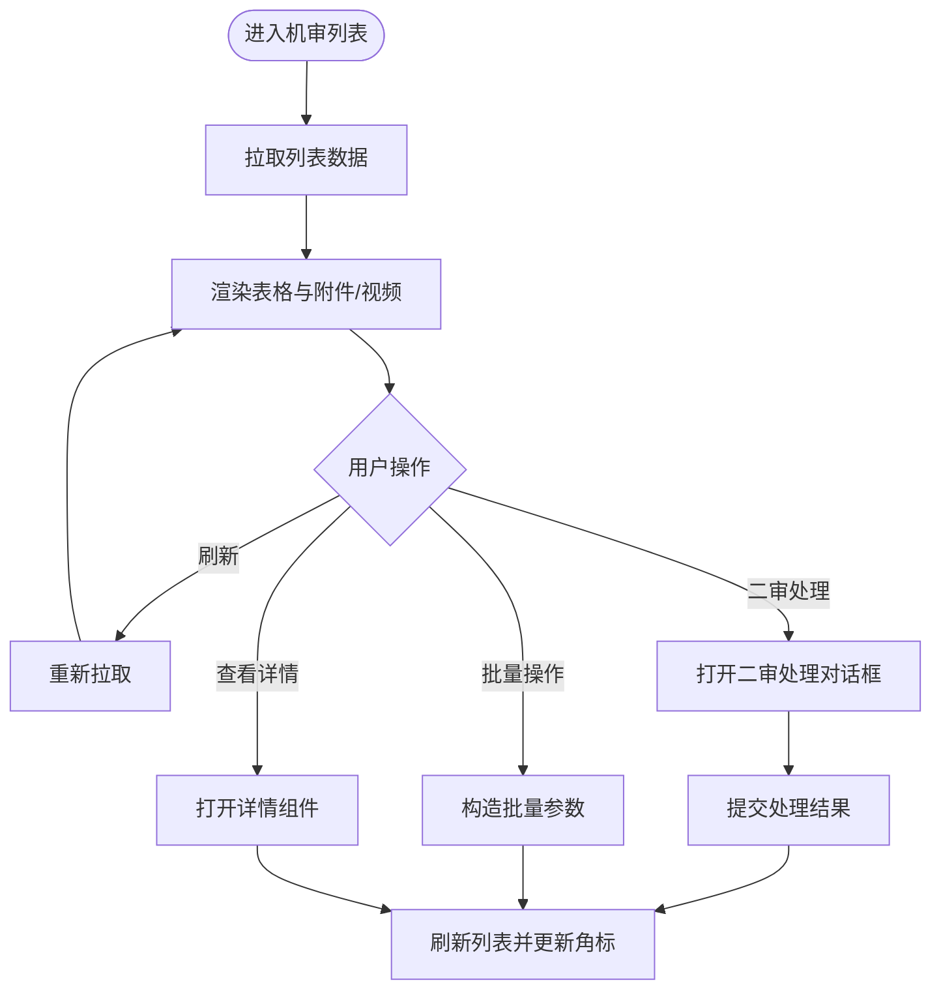
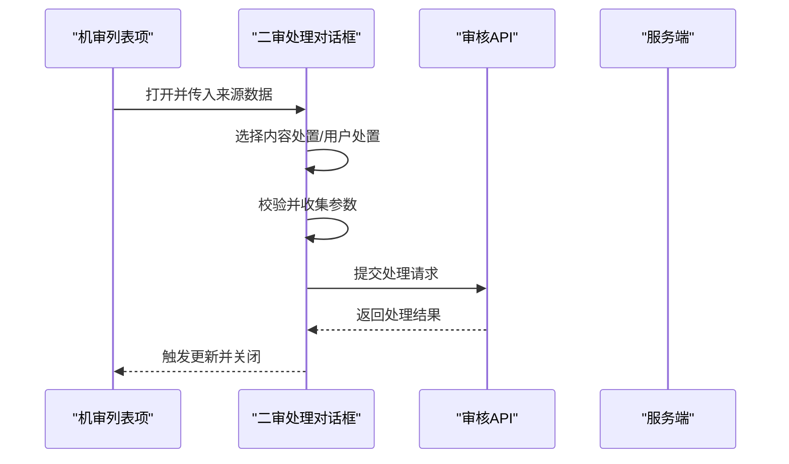
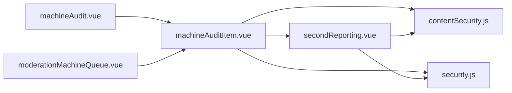

# 机器审核

<cite>
**本文引用的文件**
- [src/views/contentSecurity/machineAudit.vue](file://src/views/contentSecurity/machineAudit.vue)
- [src/views/contentSecurity/moderationMachineQueue.vue](file://src/views/contentSecurity/moderationMachineQueue.vue)
- [src/views/contentSecurity/components/machineAudit/machineAuditItem.vue](file://src/views/contentSecurity/components/machineAudit/machineAuditItem.vue)
- [src/views/contentSecurity/components/machineAudit/secondReporting.vue](file://src/views/contentSecurity/components/machineAudit/secondReporting.vue)
- [src/views/contentSecurity/moderate_sensitive_word_list.vue](file://src/views/contentSecurity/moderate_sensitive_word_list.vue)
- [src/views/contentSecurity/moderation_log_list.vue](file://src/views/contentSecurity/moderation_log_list.vue)
- [src/api/contentSecurity.js](file://src/api/contentSecurity.js)
- [src/utils/dict/security.js](file://src/utils/dict/security.js)
- [src/router/children/contentSecurity.js](file://src/router/children/contentSecurity.js)
- [src/components/exportExcel/exportExcelHelpers.js](file://src/components/exportExcel/exportExcelHelpers.js)
</cite>

## 目录
1. [简介](#简介)
2. [项目结构](#项目结构)
3. [核心组件](#核心组件)
4. [架构总览](#架构总览)
5. [详细组件分析](#详细组件分析)
6. [依赖关系分析](#依赖关系分析)
7. [性能考量](#性能考量)
8. [故障排查指南](#故障排查指南)
9. [结论](#结论)
10. [附录](#附录)

## 简介
本技术文档围绕“机器审核”功能展开，系统性阐述自动审核与人工复核（二审）的前端实现与协作机制。文档覆盖以下要点：
- 自动审核触发与数据流：从接口到页面渲染、分页与批量操作
- 二审处理流程：内容处置与用户处置的组合策略
- 审核规则与权重：敏感词配置与处理策略
- 审核日志与报表：导出与检索
- 性能优化与最佳实践：自动刷新、本地分页与资源加载

## 项目结构
机器审核相关模块主要分布在内容安全模块下，包含：
- 页面入口与路由：机审队列、人审队列、敏感词管理、审核日志
- 核心组件：机审列表项、二审处理对话框
- 接口封装：统一的审核 API 封装
- 字典与类型：审核类型映射与权限对照

图表来源
- [src/views/contentSecurity/moderationMachineQueue.vue:1-21](file://src/views/contentSecurity/moderationMachineQueue.vue#L1-L21)
- [src/views/contentSecurity/machineAudit.vue:1-164](file://src/views/contentSecurity/machineAudit.vue#L1-L164)
- [src/views/contentSecurity/components/machineAudit/machineAuditItem.vue:1-608](file://src/views/contentSecurity/components/machineAudit/machineAuditItem.vue#L1-L608)
- [src/views/contentSecurity/components/machineAudit/secondReporting.vue:1-232](file://src/views/contentSecurity/components/machineAudit/secondReporting.vue#L1-L232)
- [src/views/contentSecurity/moderate_sensitive_word_list.vue:1-23](file://src/views/contentSecurity/moderate_sensitive_word_list.vue#L1-L23)
- [src/views/contentSecurity/moderation_log_list.vue:212-229](file://src/views/contentSecurity/moderation_log_list.vue#L212-L229)
- [src/api/contentSecurity.js:1-115](file://src/api/contentSecurity.js#L1-L115)
- [src/utils/dict/security.js:1-23](file://src/utils/dict/security.js#L1-L23)
- [src/router/children/contentSecurity.js:1-43](file://src/router/children/contentSecurity.js#L1-L43)

章节来源
- [src/router/children/contentSecurity.js:1-43](file://src/router/children/contentSecurity.js#L1-L43)
- [src/views/contentSecurity/machineAudit.vue:1-164](file://src/views/contentSecurity/machineAudit.vue#L1-L164)
- [src/views/contentSecurity/moderationMachineQueue.vue:1-21](file://src/views/contentSecurity/moderationMachineQueue.vue#L1-L21)
- [src/views/contentSecurity/components/machineAudit/machineAuditItem.vue:1-608](file://src/views/contentSecurity/components/machineAudit/machineAuditItem.vue#L1-L608)
- [src/views/contentSecurity/components/machineAudit/secondReporting.vue:1-232](file://src/views/contentSecurity/components/machineAudit/secondReporting.vue#L1-L232)
- [src/views/contentSecurity/moderate_sensitive_word_list.vue:1-23](file://src/views/contentSecurity/moderate_sensitive_word_list.vue#L1-L23)
- [src/views/contentSecurity/moderation_log_list.vue:212-229](file://src/views/contentSecurity/moderation_log_list.vue#L212-L229)
- [src/api/contentSecurity.js:1-115](file://src/api/contentSecurity.js#L1-L115)
- [src/utils/dict/security.js:1-23](file://src/utils/dict/security.js#L1-L23)

## 核心组件
- 机审队列页面：承载机审列表组件，用于展示聊天室类机审任务
- 人审队列页面：承载机审列表组件，按审核类型分页显示，支持自动刷新与角标同步
- 机审列表项：负责拉取数据、渲染内容与附件、高亮敏感词、批量/单项操作、二审处理与导出
- 二审处理对话框：组合内容处置（删除/隐藏/不处理）与用户处置（封禁/禁言/不处理），并提交处理结果
- 审核日志：支持导出与检索，便于审计与复盘

章节来源
- [src/views/contentSecurity/moderationMachineQueue.vue:1-21](file://src/views/contentSecurity/moderationMachineQueue.vue#L1-L21)
- [src/views/contentSecurity/machineAudit.vue:1-164](file://src/views/contentSecurity/machineAudit.vue#L1-L164)
- [src/views/contentSecurity/components/machineAudit/machineAuditItem.vue:1-608](file://src/views/contentSecurity/components/machineAudit/machineAuditItem.vue#L1-L608)
- [src/views/contentSecurity/components/machineAudit/secondReporting.vue:1-232](file://src/views/contentSecurity/components/machineAudit/secondReporting.vue#L1-L232)
- [src/views/contentSecurity/moderation_log_list.vue:212-229](file://src/views/contentSecurity/moderation_log_list.vue#L212-L229)

## 架构总览
机器审核从前端到后端的关键交互如下：

图表来源
- [src/views/contentSecurity/machineAudit.vue:133-160](file://src/views/contentSecurity/machineAudit.vue#L133-L160)
- [src/views/contentSecurity/components/machineAudit/machineAuditItem.vue:553-604](file://src/views/contentSecurity/components/machineAudit/machineAuditItem.vue#L553-L604)
- [src/api/contentSecurity.js:29-79](file://src/api/contentSecurity.js#L29-L79)

## 详细组件分析

### 人审队列页面（machineAudit.vue）
- 功能概述
  - 初始化审核类型标签页，过滤掉特定类型
  - 支持手动刷新与自动刷新（倒计时轮询）
  - 同步各标签页角标数量，避免整页重挂载导致弹层异常
- 关键逻辑
  - 角标同步：通过 DOM 查询与 innerHTML 替换实现
  - 自动刷新：定时器控制 60 秒周期调用接口
  - 数据来源：调用“二审各类数据”接口，映射到标签页

章节来源
- [src/views/contentSecurity/machineAudit.vue:72-82](file://src/views/contentSecurity/machineAudit.vue#L72-L82)
- [src/views/contentSecurity/machineAudit.vue:88-112](file://src/views/contentSecurity/machineAudit.vue#L88-L112)
- [src/views/contentSecurity/machineAudit.vue:114-131](file://src/views/contentSecurity/machineAudit.vue#L114-L131)
- [src/views/contentSecurity/machineAudit.vue:133-160](file://src/views/contentSecurity/machineAudit.vue#L133-L160)

### 机审队列页面（moderationMachineQueue.vue）
- 功能概述
  - 专用于展示聊天室类机审任务
  - 作为机审列表项的容器，占位处理机审页无人审角标接口

章节来源
- [src/views/contentSecurity/moderationMachineQueue.vue:1-21](file://src/views/contentSecurity/moderationMachineQueue.vue#L1-L21)

### 机审列表项（machineAuditItem.vue）
- 功能概述
  - 列表渲染：内容ID、用户信息、标题、内容、图片/视频、风险提示、进审原因、发布时间、额外数据
  - 操作能力：刷新、批量通过/处理、批量有效/误判、导出 Excel
  - 二审处理：打开“二审处理对话框”，传递来源与类型
  - 详情查看：根据类型打开帖子、评论、资讯、评分评论或聊天室历史
- 数据映射
  - 类型映射：将 tabSource 映射到具体业务模型与忽略字段
  - 附件与视频：从 item_detail 或 params 中提取
  - 高亮敏感词：对标题与内容进行关键词高亮
- 分页策略
  - 本地分页：基于内存切片，避免频繁请求

图表来源
- [src/views/contentSecurity/components/machineAudit/machineAuditItem.vue:553-604](file://src/views/contentSecurity/components/machineAudit/machineAuditItem.vue#L553-L604)
- [src/views/contentSecurity/components/machineAudit/machineAuditItem.vue:467-530](file://src/views/contentSecurity/components/machineAudit/machineAuditItem.vue#L467-L530)
- [src/views/contentSecurity/components/machineAudit/machineAuditItem.vue:347-412](file://src/views/contentSecurity/components/machineAudit/machineAuditItem.vue#L347-L412)

章节来源
- [src/views/contentSecurity/components/machineAudit/machineAuditItem.vue:14-208](file://src/views/contentSecurity/components/machineAudit/machineAuditItem.vue#L14-L208)
- [src/views/contentSecurity/components/machineAudit/machineAuditItem.vue:251-268](file://src/views/contentSecurity/components/machineAudit/machineAuditItem.vue#L251-L268)
- [src/views/contentSecurity/components/machineAudit/machineAuditItem.vue:271-281](file://src/views/contentSecurity/components/machineAudit/machineAuditItem.vue#L271-L281)
- [src/views/contentSecurity/components/machineAudit/machineAuditItem.vue:347-412](file://src/views/contentSecurity/components/machineAudit/machineAuditItem.vue#L347-L412)
- [src/views/contentSecurity/components/machineAudit/machineAuditItem.vue:467-530](file://src/views/contentSecurity/components/machineAudit/machineAuditItem.vue#L467-L530)
- [src/views/contentSecurity/components/machineAudit/machineAuditItem.vue:553-604](file://src/views/contentSecurity/components/machineAudit/machineAuditItem.vue#L553-L604)

### 二审处理对话框（secondReporting.vue）
- 功能概述
  - 内容处置：删除/隐藏/不处理，支持选择理由与通知对象
  - 用户处置：封禁/禁言/不处理，按来源类型生成封禁/禁言参数
  - 参数校验：通过子组件的 validateAndGetData/validateAndEmit 获取参数
  - 提交处理：组装 set_menu 与 otherData，调用二审处理接口
- 权限与来源
  - 根据审核类型映射到删除/隐藏权限与封禁来源

图表来源
- [src/views/contentSecurity/components/machineAudit/secondReporting.vue:103-179](file://src/views/contentSecurity/components/machineAudit/secondReporting.vue#L103-L179)
- [src/views/contentSecurity/components/machineAudit/secondReporting.vue:182-224](file://src/views/contentSecurity/components/machineAudit/secondReporting.vue#L182-L224)
- [src/api/contentSecurity.js:64-70](file://src/api/contentSecurity.js#L64-L70)

章节来源
- [src/views/contentSecurity/components/machineAudit/secondReporting.vue:10-55](file://src/views/contentSecurity/components/machineAudit/secondReporting.vue#L10-L55)
- [src/views/contentSecurity/components/machineAudit/secondReporting.vue:103-179](file://src/views/contentSecurity/components/machineAudit/secondReporting.vue#L103-L179)
- [src/views/contentSecurity/components/machineAudit/secondReporting.vue:182-224](file://src/views/contentSecurity/components/machineAudit/secondReporting.vue#L182-L224)
- [src/utils/dict/security.js:13-22](file://src/utils/dict/security.js#L13-L22)

### 审核类型与权限映射（security.js）
- 审核类型：涵盖帖子、评论、聊天室、资讯评论、评分评论、集锦视频评论等
- 二审权限映射：将审核类型映射到删除/隐藏权限与封禁来源，用于按钮可用性与参数生成

章节来源
- [src/utils/dict/security.js:1-23](file://src/utils/dict/security.js#L1-L23)

### 审核 API 封装（contentSecurity.js）
- 已封装接口
  - 获取二审各类数据数量
  - 拉取二审列表
  - 忽略机审（误判/有效）
  - 处理二审
  - 敏感词列表/添加/删除
- 使用建议
  - 在组件中按需调用，注意 data_type 的传递与批量参数的构造

章节来源
- [src/api/contentSecurity.js:29-79](file://src/api/contentSecurity.js#L29-L79)
- [src/api/contentSecurity.js:82-105](file://src/api/contentSecurity.js#L82-L105)

### 审核日志与报表（moderation_log_list.vue、exportExcelHelpers.js）
- 日志页面：支持打开详情、跳转编辑组件
- 导出与检索：提供构建 SLS 查询体与 count 查询的方法，便于导出与统计

章节来源
- [src/views/contentSecurity/moderation_log_list.vue:212-229](file://src/views/contentSecurity/moderation_log_list.vue#L212-L229)
- [src/components/exportExcel/exportExcelHelpers.js:233-267](file://src/components/exportExcel/exportExcelHelpers.js#L233-L267)

## 依赖关系分析
- 组件耦合
  - 人审队列页面依赖机审列表项与审核 API
  - 机审列表项依赖二审处理对话框、附件/视频组件、工具函数与字典
  - 二审处理对话框依赖内容/用户处置子组件与权限字典
- 外部依赖
  - 请求封装：统一通过 request 工具发起
  - 工具函数：高亮关键词、时间格式化、字典映射
  - 路由：内容安全模块路由集中管理

图表来源
- [src/views/contentSecurity/machineAudit.vue:43-52](file://src/views/contentSecurity/machineAudit.vue#L43-L52)
- [src/views/contentSecurity/moderationMachineQueue.vue:8-14](file://src/views/contentSecurity/moderationMachineQueue.vue#L8-L14)
- [src/views/contentSecurity/components/machineAudit/machineAuditItem.vue:211-230](file://src/views/contentSecurity/components/machineAudit/machineAuditItem.vue#L211-L230)
- [src/views/contentSecurity/components/machineAudit/secondReporting.vue:58-62](file://src/views/contentSecurity/components/machineAudit/secondReporting.vue#L58-L62)
- [src/api/contentSecurity.js:1-115](file://src/api/contentSecurity.js#L1-L115)
- [src/utils/dict/security.js:1-23](file://src/utils/dict/security.js#L1-L23)

## 性能考量
- 自动刷新与倒计时
  - 人审队列页面采用定时器每 60 秒轮询一次，减少手动刷新压力
- 本地分页
  - 列表项使用本地分页，避免频繁网络请求，提升滚动体验
- 资源懒加载
  - 详情弹窗按需打开，减少初始渲染负担
- 批量操作
  - 批量通过/处理/有效/误判一次性构造参数并提交，降低交互成本

章节来源
- [src/views/contentSecurity/machineAudit.vue:88-112](file://src/views/contentSecurity/machineAudit.vue#L88-L112)
- [src/views/contentSecurity/components/machineAudit/machineAuditItem.vue:271-281](file://src/views/contentSecurity/components/machineAudit/machineAuditItem.vue#L271-L281)
- [src/views/contentSecurity/components/machineAudit/machineAuditItem.vue:467-530](file://src/views/contentSecurity/components/machineAudit/machineAuditItem.vue#L467-L530)

## 故障排查指南
- 列表为空或异常
  - 检查接口返回码与错误日志，确认 data_type 是否正确传递
  - 确认本地分页是否被意外重置
- 二审处理未生效
  - 校验内容/用户处置参数是否通过子组件校验
  - 确认 set_menu 与 otherData 组装是否完整
- 自动刷新失效
  - 检查定时器状态与倒计时逻辑，确保未被提前清理
- 导出异常
  - 核对导出字段映射与数据格式化逻辑

章节来源
- [src/views/contentSecurity/components/machineAudit/machineAuditItem.vue:553-604](file://src/views/contentSecurity/components/machineAudit/machineAuditItem.vue#L553-L604)
- [src/views/contentSecurity/components/machineAudit/secondReporting.vue:182-224](file://src/views/contentSecurity/components/machineAudit/secondReporting.vue#L182-L224)
- [src/views/contentSecurity/machineAudit.vue:133-160](file://src/views/contentSecurity/machineAudit.vue#L133-L160)
- [src/views/contentSecurity/components/machineAudit/machineAuditItem.vue:296-345](file://src/views/contentSecurity/components/machineAudit/machineAuditItem.vue#L296-L345)

## 结论
本机器审核体系以“机审 + 二审”的双层防线为核心，结合敏感词配置与日志导出，形成闭环的审核与治理流程。前端通过本地分页、自动刷新与批量操作提升效率，同时通过权限映射与参数校验保障处置的准确性与可追溯性。

## 附录

### 审核流程与接口调用路径
- 机审误判/有效：机审列表项 -> 忽略机审接口
- 二审处理：机审列表项 -> 二审处理对话框 -> 二审处理接口
- 列表拉取：根据 tabSource 判断调用机审或二审列表接口，并传递 data_type

章节来源
- [src/views/contentSecurity/components/machineAudit/machineAuditItem.vue:414-465](file://src/views/contentSecurity/components/machineAudit/machineAuditItem.vue#L414-L465)
- [src/views/contentSecurity/components/machineAudit/machineAuditItem.vue:467-530](file://src/views/contentSecurity/components/machineAudit/machineAuditItem.vue#L467-L530)
- [src/views/contentSecurity/components/machineAudit/machineAuditItem.vue:553-604](file://src/views/contentSecurity/components/machineAudit/machineAuditItem.vue#L553-L604)
- [src/api/contentSecurity.js:29-79](file://src/api/contentSecurity.js#L29-L79)

### 审核类型与处理策略对照
- 审核类型：帖子、评论、聊天室、资讯评论、评分评论、集锦视频评论
- 处理策略：根据类型映射删除/隐藏权限与封禁来源，确保处置合规

章节来源
- [src/utils/dict/security.js:1-23](file://src/utils/dict/security.js#L1-L23)