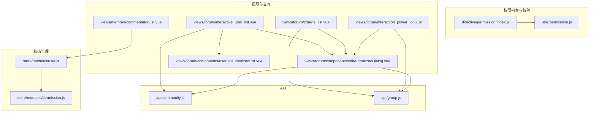
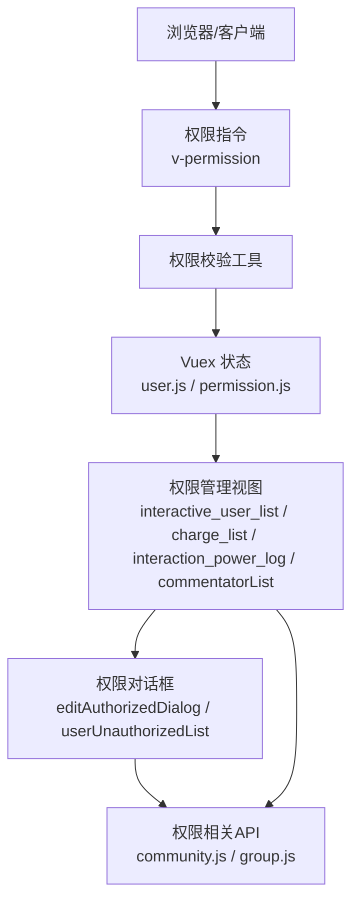
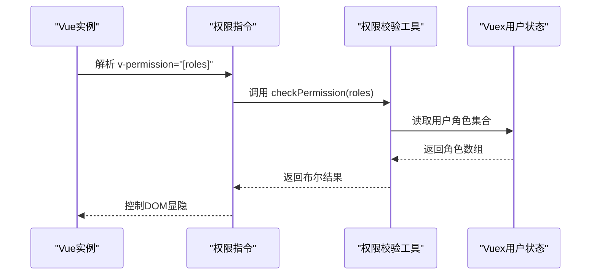
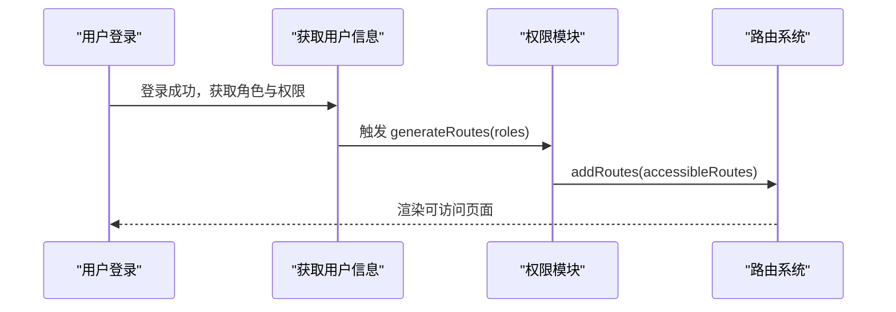
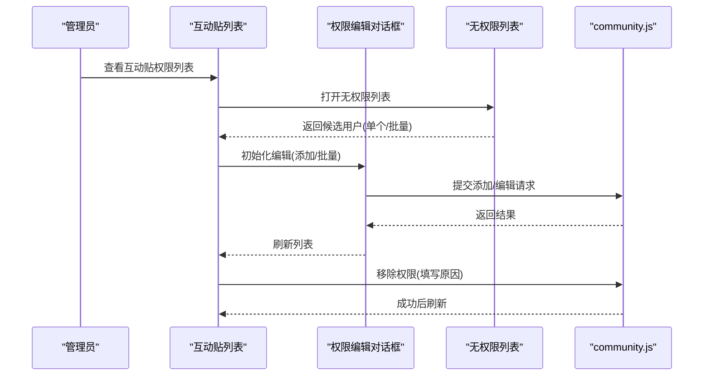
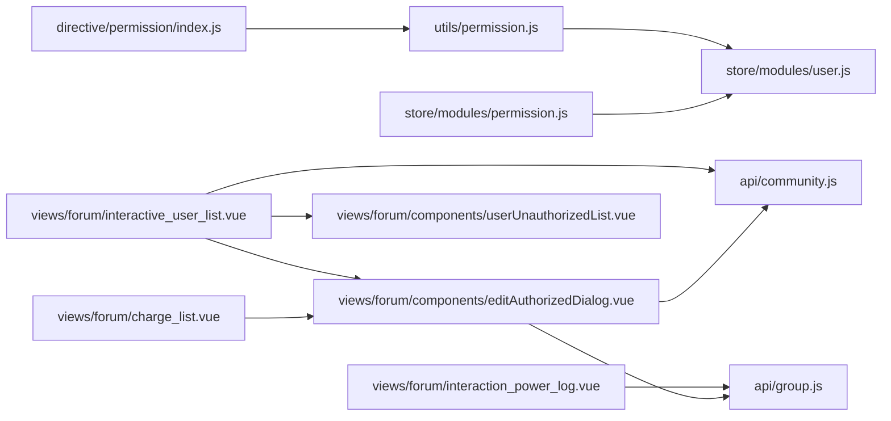

# 社区权限管理

<cite>
**本文引用的文件**
- [src/directive/permission/index.js](file://src/directive/permission/index.js)
- [src/utils/permission.js](file://src/utils/permission.js)
- [src/store/modules/permission.js](file://src/store/modules/permission.js)
- [src/store/modules/user.js](file://src/store/modules/user.js)
- [src/views/forum/interactive_user_list.vue](file://src/views/forum/interactive_user_list.vue)
- [src/views/forum/charge_list.vue](file://src/views/forum/charge_list.vue)
- [src/views/forum/interaction_power_log.vue](file://src/views/forum/interaction_power_log.vue)
- [src/views/forum/components/editAuthorizedDialog.vue](file://src/views/forum/components/editAuthorizedDialog.vue)
- [src/views/forum/components/userUnauthorizedList.vue](file://src/views/forum/components/userUnauthorizedList.vue)
- [src/views/member/commentatorList.vue](file://src/views/member/commentatorList.vue)
- [src/api/community.js](file://src/api/community.js)
- [src/api/group.js](file://src/api/group.js)
</cite>

## 目录
1. [简介](#简介)
2. [项目结构](#项目结构)
3. [核心组件](#核心组件)
4. [架构总览](#架构总览)
5. [详细组件分析](#详细组件分析)
6. [依赖关系分析](#依赖关系分析)
7. [性能考量](#性能考量)
8. [故障排查指南](#故障排查指南)
9. [结论](#结论)
10. [附录](#附录)

## 简介
本技术文档围绕社区权限管理系统展开，聚焦于用户权限的分级管理与治理，覆盖普通用户、版主、管理员等角色；涵盖发帖、评论、投票、打赏等权限维度；阐述权限授予与撤销机制（手动授权、批量授权、权限模板）、权限日志与审计（操作记录、权限变更历史、异常行为监控）、权限配置管理界面（权限设置、批量授权、权限模板），以及安全策略（权限验证、防越权攻击、最小权限原则）。文档以代码级可视化方式呈现系统架构与关键流程，帮助开发者与运维人员快速理解并高效维护该权限体系。

## 项目结构
社区权限管理由前端模块化组织，主要涉及以下层次：
- 权限指令与校验层：指令注册、权限校验函数
- 状态管理层：用户角色与权限集合、动态路由生成
- 视图与交互层：权限配置界面、日志与审计界面、批量授权与无权限列表
- API 层：社区与群组相关权限接口

图表来源
- [src/directive/permission/index.js:1-14](file://src/directive/permission/index.js#L1-L14)
- [src/utils/permission.js:1-26](file://src/utils/permission.js#L1-L26)
- [src/store/modules/user.js:1-545](file://src/store/modules/user.js#L1-L545)
- [src/store/modules/permission.js:1-66](file://src/store/modules/permission.js#L1-L66)
- [src/views/forum/interactive_user_list.vue:1-559](file://src/views/forum/interactive_user_list.vue#L1-L559)
- [src/views/forum/charge_list.vue:1-297](file://src/views/forum/charge_list.vue#L1-L297)
- [src/views/forum/interaction_power_log.vue:1-294](file://src/views/forum/interaction_power_log.vue#L1-L294)
- [src/views/forum/components/editAuthorizedDialog.vue:1-303](file://src/views/forum/components/editAuthorizedDialog.vue#L1-L303)
- [src/views/forum/components/userUnauthorizedList.vue:1-155](file://src/views/forum/components/userUnauthorizedList.vue#L1-L155)
- [src/views/member/commentatorList.vue:1-322](file://src/views/member/commentatorList.vue#L1-L322)
- [src/api/community.js:1-676](file://src/api/community.js#L1-L676)
- [src/api/group.js:1-642](file://src/api/group.js#L1-L642)

章节来源
- [src/directive/permission/index.js:1-14](file://src/directive/permission/index.js#L1-L14)
- [src/utils/permission.js:1-26](file://src/utils/permission.js#L1-L26)
- [src/store/modules/user.js:1-545](file://src/store/modules/user.js#L1-L545)
- [src/store/modules/permission.js:1-66](file://src/store/modules/permission.js#L1-L66)

## 核心组件
- 权限指令与校验
  - 指令注册：在全局安装权限指令，供组件使用 v-permission 指令控制按钮/菜单显隐
  - 权限校验：根据当前用户的角色集合与指令参数进行匹配，返回布尔值决定渲染
- 动态路由与权限过滤
  - 根据用户角色过滤异步路由表，仅展示具备访问权限的页面
- 权限配置界面
  - 互动贴权限列表：支持批量设置、编辑、移除、无权限列表导入、周卡/三日卡配置
  - 付费贴权限列表：支持添加/编辑付费贴权限、批量授权
  - 权限日志：查看互动权限变更记录、批量拒绝
  - 评论员权限：按分组移除/添加评论员
- 权限对话框与无权限列表
  - 权限编辑对话框：统一承载添加/编辑权限的表单，支持批量与单项
  - 无权限列表：按条件筛选可授权用户，支持单个/批量导入授权
- API 封装
  - 社区权限相关接口：互动用户列表、添加/修改/删除互动权限、打赏权限等
  - 群组权限相关接口：付费贴列表、添加/编辑付费贴权限、周卡权限等

章节来源
- [src/directive/permission/index.js:1-14](file://src/directive/permission/index.js#L1-L14)
- [src/utils/permission.js:1-26](file://src/utils/permission.js#L1-L26)
- [src/store/modules/permission.js:1-66](file://src/store/modules/permission.js#L1-L66)
- [src/views/forum/interactive_user_list.vue:1-559](file://src/views/forum/interactive_user_list.vue#L1-L559)
- [src/views/forum/charge_list.vue:1-297](file://src/views/forum/charge_list.vue#L1-L297)
- [src/views/forum/interaction_power_log.vue:1-294](file://src/views/forum/interaction_power_log.vue#L1-L294)
- [src/views/forum/components/editAuthorizedDialog.vue:1-303](file://src/views/forum/components/editAuthorizedDialog.vue#L1-L303)
- [src/views/forum/components/userUnauthorizedList.vue:1-155](file://src/views/forum/components/userUnauthorizedList.vue#L1-L155)
- [src/views/member/commentatorList.vue:1-322](file://src/views/member/commentatorList.vue#L1-L322)
- [src/api/community.js:1-676](file://src/api/community.js#L1-L676)
- [src/api/group.js:1-642](file://src/api/group.js#L1-L642)

## 架构总览
系统采用“指令 + 状态 + 视图 + API”的分层设计：
- 指令层负责前端渲染层面的权限控制
- 状态层负责角色与权限集合、动态路由生成
- 视图层提供权限配置、日志与审计、批量授权等管理界面
- API 层封装社区与群组权限相关接口，支撑前后端交互

图表来源
- [src/directive/permission/index.js:1-14](file://src/directive/permission/index.js#L1-L14)
- [src/utils/permission.js:1-26](file://src/utils/permission.js#L1-L26)
- [src/store/modules/user.js:1-545](file://src/store/modules/user.js#L1-L545)
- [src/store/modules/permission.js:1-66](file://src/store/modules/permission.js#L1-L66)
- [src/views/forum/interactive_user_list.vue:1-559](file://src/views/forum/interactive_user_list.vue#L1-L559)
- [src/views/forum/charge_list.vue:1-297](file://src/views/forum/charge_list.vue#L1-L297)
- [src/views/forum/interaction_power_log.vue:1-294](file://src/views/forum/interaction_power_log.vue#L1-L294)
- [src/views/member/commentatorList.vue:1-322](file://src/views/member/commentatorList.vue#L1-L322)
- [src/views/forum/components/editAuthorizedDialog.vue:1-303](file://src/views/forum/components/editAuthorizedDialog.vue#L1-L303)
- [src/views/forum/components/userUnauthorizedList.vue:1-155](file://src/views/forum/components/userUnauthorizedList.vue#L1-L155)
- [src/api/community.js:1-676](file://src/api/community.js#L1-L676)
- [src/api/group.js:1-642](file://src/api/group.js#L1-L642)

## 详细组件分析

### 组件A：权限指令与校验（v-permission）
- 功能要点
  - 在全局注册权限指令，组件中通过 v-permission="[...]” 控制元素显隐
  - 校验逻辑：读取用户角色集合，判断指令参数数组中的角色是否存在交集
- 关键路径
  - 指令注册入口：[src/directive/permission/index.js:1-14](file://src/directive/permission/index.js#L1-L14)
  - 权限校验函数：[src/utils/permission.js:1-26](file://src/utils/permission.js#L1-L26)

图表来源
- [src/directive/permission/index.js:1-14](file://src/directive/permission/index.js#L1-L14)
- [src/utils/permission.js:1-26](file://src/utils/permission.js#L1-L26)
- [src/store/modules/user.js:1-545](file://src/store/modules/user.js#L1-L545)

章节来源
- [src/directive/permission/index.js:1-14](file://src/directive/permission/index.js#L1-L14)
- [src/utils/permission.js:1-26](file://src/utils/permission.js#L1-L26)
- [src/store/modules/user.js:1-545](file://src/store/modules/user.js#L1-L545)

### 组件B：动态路由与权限过滤
- 功能要点
  - 根据用户角色过滤异步路由表，生成可访问路由集合
  - 提供 generateRoutes 动作，结合 router.addRoutes 实现动态挂载
- 关键路径
  - 路由过滤与生成：[src/store/modules/permission.js:1-66](file://src/store/modules/permission.js#L1-L66)
  - 用户信息与角色注入：[src/store/modules/user.js:1-545](file://src/store/modules/user.js#L1-L545)

图表来源
- [src/store/modules/permission.js:1-66](file://src/store/modules/permission.js#L1-L66)
- [src/store/modules/user.js:1-545](file://src/store/modules/user.js#L1-L545)

章节来源
- [src/store/modules/permission.js:1-66](file://src/store/modules/permission.js#L1-L66)
- [src/store/modules/user.js:1-545](file://src/store/modules/user.js#L1-L545)

### 组件C：互动贴权限管理（列表、编辑、移除、批量设置）
- 功能要点
  - 列表展示互动贴权限用户，支持排序、筛选、批量勾选
  - 编辑对话框统一处理添加/编辑，支持发布次数、价格、运动类型、分成比例、周卡/三日卡配置
  - 移除权限需填写原因，支持单个/批量移除
  - 无权限列表支持按 UID 搜索与批量导入授权
- 关键路径
  - 列表视图：[src/views/forum/interactive_user_list.vue:1-559](file://src/views/forum/interactive_user_list.vue#L1-L559)
  - 权限编辑对话框：[src/views/forum/components/editAuthorizedDialog.vue:1-303](file://src/views/forum/components/editAuthorizedDialog.vue#L1-L303)
  - 无权限列表：[src/views/forum/components/userUnauthorizedList.vue:1-155](file://src/views/forum/components/userUnauthorizedList.vue#L1-L155)
  - 社区权限 API：[src/api/community.js:198-237](file://src/api/community.js#L198-L237)

图表来源
- [src/views/forum/interactive_user_list.vue:1-559](file://src/views/forum/interactive_user_list.vue#L1-L559)
- [src/views/forum/components/editAuthorizedDialog.vue:1-303](file://src/views/forum/components/editAuthorizedDialog.vue#L1-L303)
- [src/views/forum/components/userUnauthorizedList.vue:1-155](file://src/views/forum/components/userUnauthorizedList.vue#L1-L155)
- [src/api/community.js:198-237](file://src/api/community.js#L198-L237)

章节来源
- [src/views/forum/interactive_user_list.vue:1-559](file://src/views/forum/interactive_user_list.vue#L1-L559)
- [src/views/forum/components/editAuthorizedDialog.vue:1-303](file://src/views/forum/components/editAuthorizedDialog.vue#L1-L303)
- [src/views/forum/components/userUnauthorizedList.vue:1-155](file://src/views/forum/components/userUnauthorizedList.vue#L1-L155)
- [src/api/community.js:198-237](file://src/api/community.js#L198-L237)

### 组件D：付费贴权限管理（添加/编辑/批量授权）
- 功能要点
  - 付费贴权限列表支持添加/编辑，包含分成比例、每日发布次数、可发布价格、绑定比赛数
  - 支持从“无权限列表”批量导入授权
- 关键路径
  - 列表视图：[src/views/forum/charge_list.vue:1-297](file://src/views/forum/charge_list.vue#L1-L297)
  - 权限编辑对话框：[src/views/forum/components/editAuthorizedDialog.vue:1-303](file://src/views/forum/components/editAuthorizedDialog.vue#L1-L303)
  - 群组权限 API：[src/api/group.js:220-250](file://src/api/group.js#L220-L250)

章节来源
- [src/views/forum/charge_list.vue:1-297](file://src/views/forum/charge_list.vue#L1-L297)
- [src/views/forum/components/editAuthorizedDialog.vue:1-303](file://src/views/forum/components/editAuthorizedDialog.vue#L1-L303)
- [src/api/group.js:220-250](file://src/api/group.js#L220-L250)

### 组件E：权限日志与审计（互动权限变更记录）
- 功能要点
  - 展示互动权限变更日志，支持筛选、排序、批量拒绝
  - 可查看额外信息与操作者信息，支持打开公众号操作面板
- 关键路径
  - 日志视图：[src/views/forum/interaction_power_log.vue:1-294](file://src/views/forum/interaction_power_log.vue#L1-L294)
  - 权限变更日志 API：[src/api/group.js:26-32](file://src/api/group.js#L26-L32)

章节来源
- [src/views/forum/interaction_power_log.vue:1-294](file://src/views/forum/interaction_power_log.vue#L1-L294)
- [src/api/group.js:26-32](file://src/api/group.js#L26-L32)

### 组件F：评论员权限管理（按分组移除/添加）
- 功能要点
  - 支持按 UID 搜索用户，添加/移除评论员分组
- 关键路径
  - 评论员列表：[src/views/member/commentatorList.vue:1-322](file://src/views/member/commentatorList.vue#L1-L322)

章节来源
- [src/views/member/commentatorList.vue:1-322](file://src/views/member/commentatorList.vue#L1-L322)

## 依赖关系分析
- 组件耦合
  - 权限指令与校验工具强依赖用户状态中的角色集合
  - 动态路由模块依赖用户角色，生成可访问路由
  - 权限配置视图依赖权限编辑对话框与无权限列表
  - 权限编辑对话框依赖社区/群组 API
- 外部依赖
  - API 层提供权限相关接口，支撑前端权限 CRUD 与日志查询
- 潜在风险
  - 若角色集合缺失或为空，可能导致指令校验失败
  - 批量授权时未正确处理 UID 列表，可能引发接口错误

图表来源
- [src/directive/permission/index.js:1-14](file://src/directive/permission/index.js#L1-L14)
- [src/utils/permission.js:1-26](file://src/utils/permission.js#L1-L26)
- [src/store/modules/user.js:1-545](file://src/store/modules/user.js#L1-L545)
- [src/store/modules/permission.js:1-66](file://src/store/modules/permission.js#L1-L66)
- [src/views/forum/interactive_user_list.vue:1-559](file://src/views/forum/interactive_user_list.vue#L1-L559)
- [src/views/forum/charge_list.vue:1-297](file://src/views/forum/charge_list.vue#L1-L297)
- [src/views/forum/interaction_power_log.vue:1-294](file://src/views/forum/interaction_power_log.vue#L1-L294)
- [src/views/forum/components/editAuthorizedDialog.vue:1-303](file://src/views/forum/components/editAuthorizedDialog.vue#L1-L303)
- [src/views/forum/components/userUnauthorizedList.vue:1-155](file://src/views/forum/components/userUnauthorizedList.vue#L1-L155)
- [src/api/community.js:1-676](file://src/api/community.js#L1-L676)
- [src/api/group.js:1-642](file://src/api/group.js#L1-L642)

章节来源
- [src/directive/permission/index.js:1-14](file://src/directive/permission/index.js#L1-L14)
- [src/utils/permission.js:1-26](file://src/utils/permission.js#L1-L26)
- [src/store/modules/user.js:1-545](file://src/store/modules/user.js#L1-L545)
- [src/store/modules/permission.js:1-66](file://src/store/modules/permission.js#L1-L66)
- [src/views/forum/interactive_user_list.vue:1-559](file://src/views/forum/interactive_user_list.vue#L1-L559)
- [src/views/forum/charge_list.vue:1-297](file://src/views/forum/charge_list.vue#L1-L297)
- [src/views/forum/interaction_power_log.vue:1-294](file://src/views/forum/interaction_power_log.vue#L1-L294)
- [src/views/forum/components/editAuthorizedDialog.vue:1-303](file://src/views/forum/components/editAuthorizedDialog.vue#L1-L303)
- [src/views/forum/components/userUnauthorizedList.vue:1-155](file://src/views/forum/components/userUnauthorizedList.vue#L1-L155)
- [src/api/community.js:1-676](file://src/api/community.js#L1-L676)
- [src/api/group.js:1-642](file://src/api/group.js#L1-L642)

## 性能考量
- 列表加载优化
  - 合理设置分页参数，避免一次性加载过多数据
  - 对筛选条件进行去抖与合并，减少重复请求
- 批量操作
  - 批量授权/移除时，建议前端做 UID 去重与必填校验，降低后端压力
- 路由生成
  - 动态路由仅在角色变化时触发生成，避免频繁 addRoutes 导致的渲染抖动

## 故障排查指南
- 权限指令不生效
  - 检查用户状态中角色集合是否为空或未注入
  - 确认 v-permission 参数是否为数组且包含有效角色
- 动态路由不更新
  - 确认角色变更后已调用 generateRoutes 并 addRoutes
- 批量授权失败
  - 核对 UID 列表是否为空或格式错误
  - 检查必填字段（如分成比例、发布次数、价格等）是否填写完整
- 日志查询无数据
  - 确认筛选条件与 operate_type/classify 的范围是否合理
  - 检查接口返回码与 total 字段

章节来源
- [src/utils/permission.js:1-26](file://src/utils/permission.js#L1-L26)
- [src/store/modules/permission.js:1-66](file://src/store/modules/permission.js#L1-L66)
- [src/views/forum/components/editAuthorizedDialog.vue:1-303](file://src/views/forum/components/editAuthorizedDialog.vue#L1-L303)
- [src/api/group.js:26-32](file://src/api/group.js#L26-L32)

## 结论
本权限管理体系通过“指令 + 状态 + 视图 + API”的分层设计，实现了对社区用户权限的精细化管理与可视化治理。系统支持多类权限（发帖、评论、投票、打赏、周卡等）的配置与审计，并提供批量授权、无权限列表导入、日志查询等实用能力。配合动态路由与最小权限原则，可有效降低越权风险并提升运营效率。

## 附录
- 权限维度与对应功能
  - 发帖权限：付费贴/互动贴的发布次数、价格、绑定比赛数、分成比例
  - 评论/投票/打赏：通过权限列表与日志进行管理与审计
  - 周卡/三日卡：支持开启与联动配置
- 授权与撤销机制
  - 手动授权：通过编辑对话框逐项设置
  - 批量授权：从无权限列表批量导入
  - 权限模板：可通过批量设置复用常用配置
- 安全策略
  - 权限验证：指令与状态双重校验
  - 防越权：基于角色的动态路由与最小权限原则
  - 审计：权限变更日志与操作记录追踪