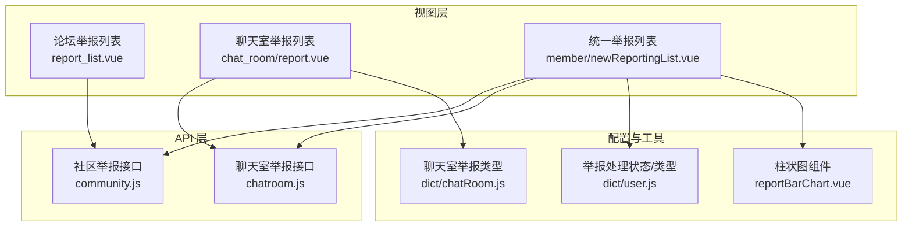
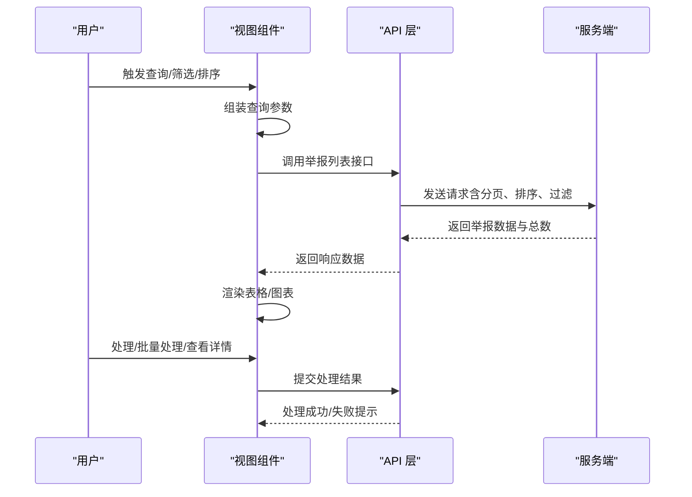
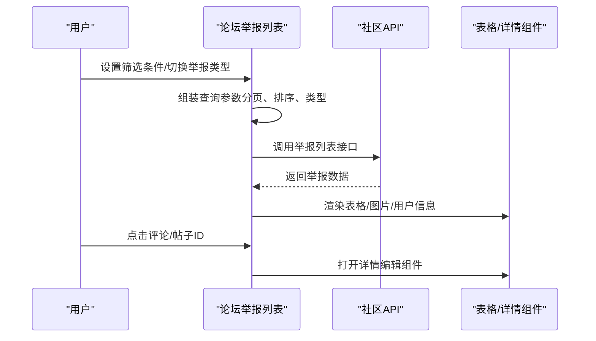
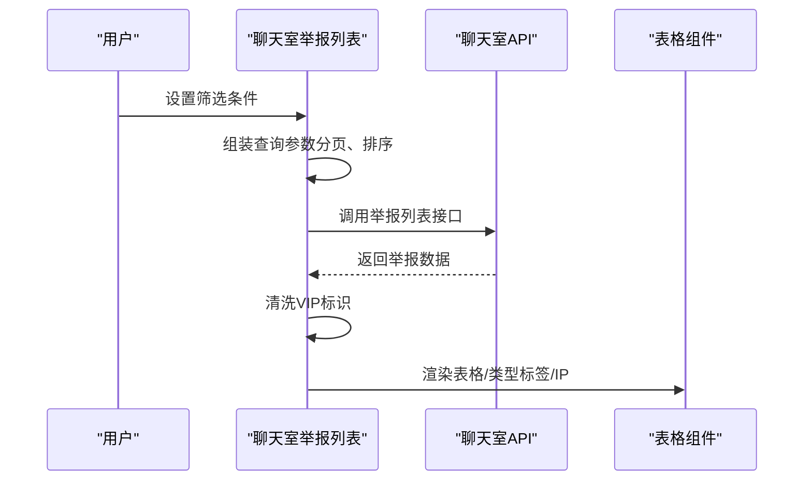
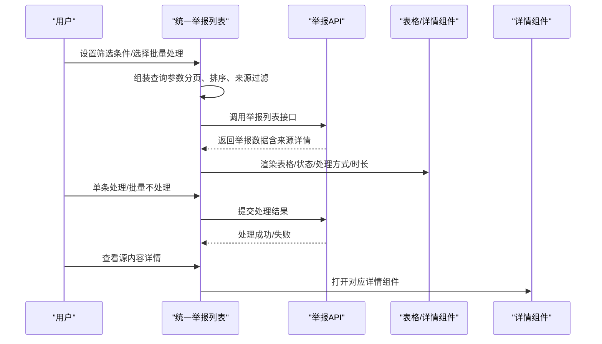
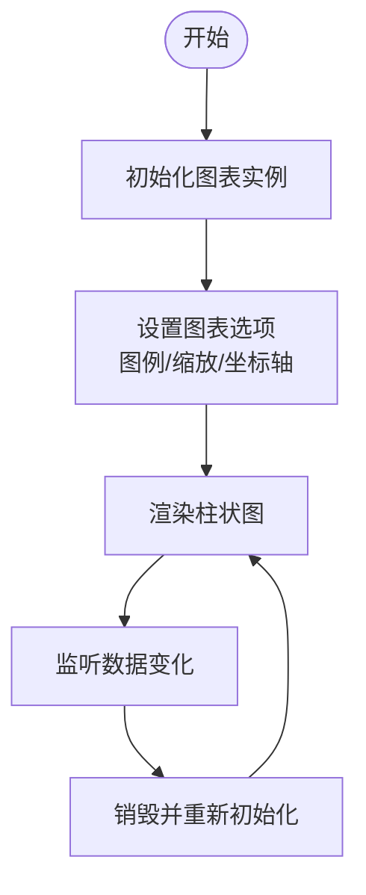
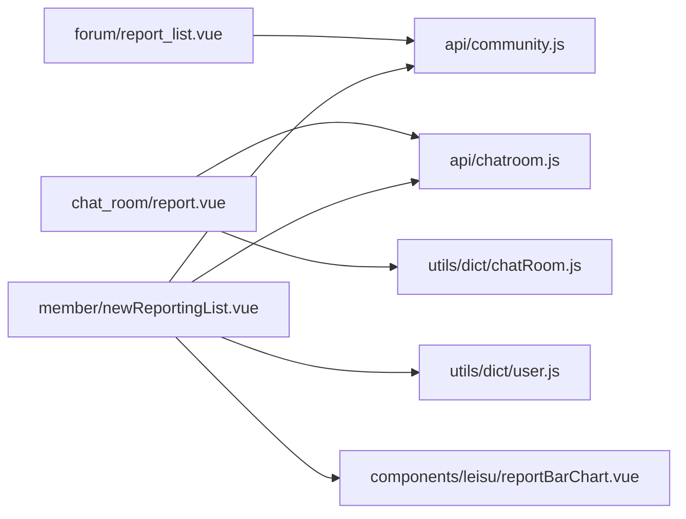

# 举报列表

<cite>
**本文引用的文件**
- [src/views/forum/report_list.vue](file://src/views/forum/report_list.vue)
- [src/views/chat_room/report.vue](file://src/views/chat_room/report.vue)
- [src/views/member/newReportingList.vue](file://src/views/member/newReportingList.vue)
- [src/api/community.js](file://src/api/community.js)
- [src/api/chatroom.js](file://src/api/chatroom.js)
- [src/utils/dict/chatRoom.js](file://src/utils/dict/chatRoom.js)
- [src/utils/dict/user.js](file://src/utils/dict/user.js)
- [src/components/leisu/reportBarChart.vue](file://src/components/leisu/reportBarChart.vue)
</cite>

## 目录
1. [简介](#简介)
2. [项目结构](#项目结构)
3. [核心组件](#核心组件)
4. [架构总览](#架构总览)
5. [详细组件分析](#详细组件分析)
6. [依赖关系分析](#依赖关系分析)
7. [性能考量](#性能考量)
8. [故障排查指南](#故障排查指南)
9. [结论](#结论)
10. [附录](#附录)

## 简介
本技术文档围绕“举报列表”功能展开，系统性阐述举报数据的采集与处理流程、举报类型与状态管理、列表展示逻辑、统计分析与导出能力，以及举报处理工作流与安全机制。文档基于前端代码实现进行归纳总结，并通过图示帮助读者理解模块间的关系与数据流转。

## 项目结构
举报列表功能主要分布在以下区域：
- 论坛举报列表：用于展示社区内帖子、评论、互动直播间的举报记录
- 聊天室举报列表：用于展示聊天室内的举报记录
- 统一举报列表：用于展示用户反馈/举报的综合列表，支持批量处理与处理状态跟踪
- API 层：封装举报查询接口
- 字典与工具：提供举报类型、处理状态、平台等字典配置
- 图表组件：提供柱状图等可视化组件，便于统计分析

图表来源
- [src/views/forum/report_list.vue:1-208](file://src/views/forum/report_list.vue#L1-L208)
- [src/views/chat_room/report.vue:1-148](file://src/views/chat_room/report.vue#L1-L148)
- [src/views/member/newReportingList.vue:1-383](file://src/views/member/newReportingList.vue#L1-L383)
- [src/api/community.js:353-360](file://src/api/community.js#L353-L360)
- [src/api/chatroom.js:26-32](file://src/api/chatroom.js#L26-L32)
- [src/utils/dict/chatRoom.js:1-22](file://src/utils/dict/chatRoom.js#L1-L22)
- [src/utils/dict/user.js:161-189](file://src/utils/dict/user.js#L161-L189)
- [src/components/leisu/reportBarChart.vue:1-198](file://src/components/leisu/reportBarChart.vue#L1-L198)

章节来源
- [src/views/forum/report_list.vue:1-208](file://src/views/forum/report_list.vue#L1-L208)
- [src/views/chat_room/report.vue:1-148](file://src/views/chat_room/report.vue#L1-L148)
- [src/views/member/newReportingList.vue:1-383](file://src/views/member/newReportingList.vue#L1-L383)
- [src/api/community.js:353-360](file://src/api/community.js#L353-L360)
- [src/api/chatroom.js:26-32](file://src/api/chatroom.js#L26-L32)
- [src/utils/dict/chatRoom.js:1-22](file://src/utils/dict/chatRoom.js#L1-L22)
- [src/utils/dict/user.js:161-189](file://src/utils/dict/user.js#L161-L189)
- [src/components/leisu/reportBarChart.vue:1-198](file://src/components/leisu/reportBarChart.vue#L1-L198)

## 核心组件
- 论坛举报列表：支持按举报类型筛选（帖子、评论、互动直播间、资讯评论），展示举报人、被举报人、举报内容、图片附件、标题等字段；支持排序与分页。
- 聊天室举报列表：展示聊天室举报类型、举报人、被举报人、举报内容、举报人IP等字段；支持排序与分页。
- 统一举报列表：支持多来源举报（社区、资讯等），展示举报来源、举报类型、举报原因、举报内容、图片、处理状态、处理方式、处理时长、操作人、平台、渠道、IP等；支持批量不处理与单条处理；可联动查看源内容详情。
- API 接口：分别封装社区举报列表与聊天室举报列表的数据请求。
- 字典与工具：提供举报类型映射、处理状态枚举、平台图标渲染、时间格式化等工具方法。
- 图表组件：提供柱状图组件，用于举报量趋势、类型分布等可视化展示。

章节来源
- [src/views/forum/report_list.vue:14-92](file://src/views/forum/report_list.vue#L14-L92)
- [src/views/chat_room/report.vue:7-61](file://src/views/chat_room/report.vue#L7-L61)
- [src/views/member/newReportingList.vue:18-167](file://src/views/member/newReportingList.vue#L18-L167)
- [src/api/community.js:353-360](file://src/api/community.js#L353-L360)
- [src/api/chatroom.js:26-32](file://src/api/chatroom.js#L26-L32)
- [src/utils/dict/chatRoom.js:1-22](file://src/utils/dict/chatRoom.js#L1-L22)
- [src/utils/dict/user.js:161-189](file://src/utils/dict/user.js#L161-L189)
- [src/components/leisu/reportBarChart.vue:1-198](file://src/components/leisu/reportBarChart.vue#L1-L198)

## 架构总览
举报列表功能采用“视图组件 + API 封装 + 字典与工具”的分层设计。视图组件负责交互与展示，API 层负责数据请求，字典与工具提供配置与辅助方法。统一举报列表作为中枢，整合多来源举报并提供统一的处理入口。

图表来源
- [src/views/member/newReportingList.vue:240-322](file://src/views/member/newReportingList.vue#L240-L322)
- [src/api/community.js:353-360](file://src/api/community.js#L353-L360)
- [src/api/chatroom.js:26-32](file://src/api/chatroom.js#L26-L32)

## 详细组件分析

### 论坛举报列表（report_list.vue）
- 功能要点
  - 支持按举报类型切换（帖子、评论、互动直播间、资讯评论），动态更新列名与跳转入口
  - 展示举报人、被举报人、提交时间、标题、举报内容、图片附件等
  - 支持排序、分页、搜索历史
  - 点击评论或帖子 ID 可进入详情编辑组件
- 数据来源
  - 使用社区举报列表接口获取数据
- 关键交互
  - 切换 report_type 后更新列头与跳转逻辑
  - 通过工具函数对时间、排序条件进行处理

图表来源
- [src/views/forum/report_list.vue:142-205](file://src/views/forum/report_list.vue#L142-L205)
- [src/api/community.js:353-360](file://src/api/community.js#L353-L360)

章节来源
- [src/views/forum/report_list.vue:1-208](file://src/views/forum/report_list.vue#L1-L208)
- [src/api/community.js:353-360](file://src/api/community.js#L353-L360)

### 聊天室举报列表（chat_room/report.vue）
- 功能要点
  - 展示举报类型标签、举报人、被举报人、举报内容、举报人IP
  - 对 VIP 标识进行清洗处理
  - 支持排序、分页、搜索历史
- 数据来源
  - 使用聊天室举报列表接口获取数据
- 关键交互
  - 通过字典映射举报类型标签
  - 重置表格滚动位置以保证体验

图表来源
- [src/views/chat_room/report.vue:98-138](file://src/views/chat_room/report.vue#L98-L138)
- [src/api/chatroom.js:26-32](file://src/api/chatroom.js#L26-L32)
- [src/utils/dict/chatRoom.js:1-22](file://src/utils/dict/chatRoom.js#L1-L22)

章节来源
- [src/views/chat_room/report.vue:1-148](file://src/views/chat_room/report.vue#L1-L148)
- [src/api/chatroom.js:26-32](file://src/api/chatroom.js#L26-L32)
- [src/utils/dict/chatRoom.js:1-22](file://src/utils/dict/chatRoom.js#L1-L22)

### 统一举报列表（member/newReportingList.vue）
- 功能要点
  - 多来源举报聚合（社区、资讯等），展示举报来源、类型、原因、内容、图片、处理状态、处理方式、处理时长、操作人、平台、渠道、IP
  - 支持批量不处理与单条处理；支持排序、分页、搜索历史
  - 可点击源内容查看详情（帖子、评论、资讯评论、评分评论）
- 数据来源
  - 使用统一举报列表接口，支持多来源数据合并返回
- 关键交互
  - 处理状态与处理方式通过位运算组合展示
  - 源内容详情通过 complain_type 映射到不同详情组件
  - 支持批量不处理（result=2）

图表来源
- [src/views/member/newReportingList.vue:240-380](file://src/views/member/newReportingList.vue#L240-L380)
- [src/api/community.js:353-360](file://src/api/community.js#L353-L360)
- [src/utils/dict/user.js:161-189](file://src/utils/dict/user.js#L161-L189)

章节来源
- [src/views/member/newReportingList.vue:1-383](file://src/views/member/newReportingList.vue#L1-L383)
- [src/api/community.js:353-360](file://src/api/community.js#L353-L360)
- [src/utils/dict/user.js:161-189](file://src/utils/dict/user.js#L161-L189)

### 统计分析与导出（reportBarChart.vue）
- 功能要点
  - 提供柱状图组件，支持图例、缩放、坐标轴旋转、双Y轴等配置
  - 可用于举报量趋势、举报类型分布等可视化展示
- 使用建议
  - 结合后端统计接口或前端聚合数据，传入 barData 与 xAxisName 进行渲染

图表来源
- [src/components/leisu/reportBarChart.vue:46-196](file://src/components/leisu/reportBarChart.vue#L46-L196)

章节来源
- [src/components/leisu/reportBarChart.vue:1-198](file://src/components/leisu/reportBarChart.vue#L1-L198)

## 依赖关系分析
- 视图组件依赖 API 层提供的举报列表接口
- 统一举报列表同时依赖社区与聊天室举报接口
- 字典模块提供举报类型、处理状态、平台等配置
- 工具模块提供时间格式化、排序条件组装、平台图标渲染等通用方法
- 图表组件独立于业务逻辑，通过 props 注入数据进行渲染

图表来源
- [src/views/forum/report_list.vue:95-100](file://src/views/forum/report_list.vue#L95-L100)
- [src/views/chat_room/report.vue:65-70](file://src/views/chat_room/report.vue#L65-L70)
- [src/views/member/newReportingList.vue:177-184](file://src/views/member/newReportingList.vue#L177-L184)
- [src/api/community.js:353-360](file://src/api/community.js#L353-L360)
- [src/api/chatroom.js:26-32](file://src/api/chatroom.js#L26-L32)
- [src/utils/dict/chatRoom.js:1-22](file://src/utils/dict/chatRoom.js#L1-L22)
- [src/utils/dict/user.js:161-189](file://src/utils/dict/user.js#L161-L189)
- [src/components/leisu/reportBarChart.vue:1-198](file://src/components/leisu/reportBarChart.vue#L1-L198)

章节来源
- [src/views/forum/report_list.vue:95-100](file://src/views/forum/report_list.vue#L95-L100)
- [src/views/chat_room/report.vue:65-70](file://src/views/chat_room/report.vue#L65-L70)
- [src/views/member/newReportingList.vue:177-184](file://src/views/member/newReportingList.vue#L177-L184)
- [src/api/community.js:353-360](file://src/api/community.js#L353-L360)
- [src/api/chatroom.js:26-32](file://src/api/chatroom.js#L26-L32)
- [src/utils/dict/chatRoom.js:1-22](file://src/utils/dict/chatRoom.js#L1-L22)
- [src/utils/dict/user.js:161-189](file://src/utils/dict/user.js#L161-L189)
- [src/components/leisu/reportBarChart.vue:1-198](file://src/components/leisu/reportBarChart.vue#L1-L198)

## 性能考量
- 列表分页与排序：通过分页参数与排序条件控制请求规模，避免一次性加载过多数据
- 图片懒加载：图片列表组件按需渲染，减少首屏压力
- 图表渲染优化：图表组件在数据变化时销毁并重建，确保数据更新及时反映
- 请求去抖与防抖：在复杂筛选条件下，建议在视图层增加输入防抖，降低频繁请求

## 故障排查指南
- 列表为空或总数异常
  - 检查查询参数是否正确传递（分页、排序、类型）
  - 确认接口返回码与数据结构
- 处理状态不更新
  - 确认处理接口调用成功与返回码
  - 检查本地缓存与列表刷新逻辑
- 图表不渲染或数据不更新
  - 检查 barData 与 xAxisName 的数据结构
  - 确认组件生命周期钩子（mounted、beforeDestroy、watch）执行情况
- VIP 标识显示异常
  - 检查数据清洗逻辑是否生效

章节来源
- [src/views/chat_room/report.vue:112-133](file://src/views/chat_room/report.vue#L112-L133)
- [src/views/member/newReportingList.vue:324-356](file://src/views/member/newReportingList.vue#L324-L356)
- [src/components/leisu/reportBarChart.vue:39-45](file://src/components/leisu/reportBarChart.vue#L39-L45)

## 结论
举报列表功能通过清晰的分层设计与统一的处理入口，实现了多来源举报的聚合展示与处理闭环。结合字典与工具模块，系统具备良好的扩展性与可维护性。建议在后续迭代中完善统计分析与导出能力，并加强安全与风控策略的落地。

## 附录
- 举报触发条件
  - 论坛举报：用户在帖子/评论/互动直播间/资讯评论中触发举报
  - 聊天室举报：用户在聊天室中触发举报
  - 统一举报：用户反馈/举报入口统一汇聚
- 举报类型分类
  - 聊天室举报类型：广告、刷屏、恶意攻击
  - 统一举报类型：违法违规、色情低俗、违规营销、不实信息、未成年相关、侵犯权益、政治敏感、涉企虚假、网络谣言
- 处理状态
  - 未处理、已处理、不处理、有用、回访、处理中
- 展示逻辑
  - 列表字段：举报人、被举报人、举报内容、图片、处理状态、处理方式、处理时长、平台、渠道、IP等
  - 详情查看：根据 complain_type 映射到不同详情组件
- 统计分析
  - 举报量趋势、举报类型分布、处理时效分析等可通过图表组件进行可视化
- 导出与分析
  - 建议在现有接口基础上扩展统计报表与导出能力（如按日/周维度汇总）
- 安全机制
  - 举报真实性验证：结合举报来源、IP、平台、渠道等多维特征进行校验
  - 恶意举报防护：对高频重复举报、异常时间段、异常IP等进行识别与限制
  - 举报者隐私保护：对敏感字段进行脱敏处理（如VIP标识清洗、IP展示限制）